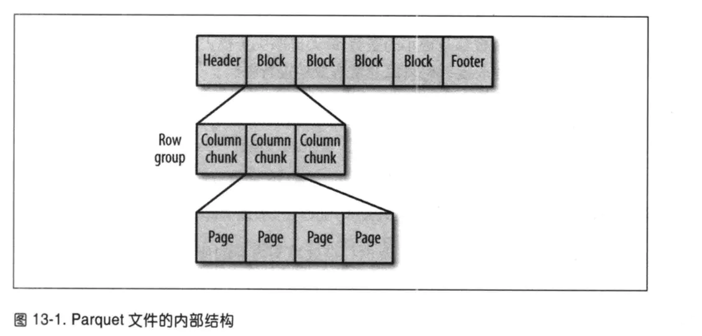
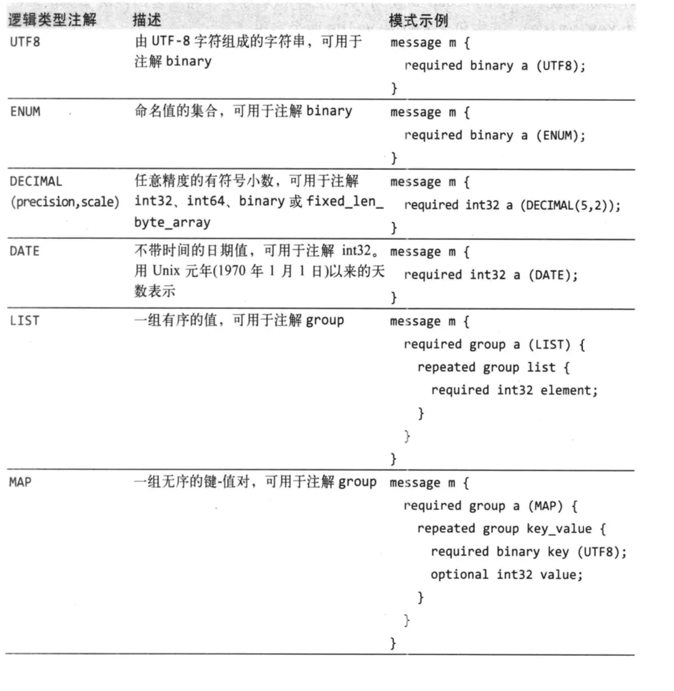

# Apache Parquet
## 动机
我们创建 Parquet 是为了在 Hadoop 生态中的任一项目利用压缩的高效的列数据表示。

Parquet 基于思维中的嵌套数据结构从头开始构建，利用了 Dremel 论文中描述的[记录分片和装配算法（record shredding and assembly algorithm）](https://github.com/julienledem/redelm/wiki/The-striping-and-assembly-algorithms-from-the-Dremel-paper)。我们认为这种方式比网状名字空间的简单扁平化更具优势。

Parquet 支持高效压缩算法和编码模式（`schemes`）。多个项目已经展示了对数据采用正确的压缩算法和编码模式的性能影响。Parquet 允许压缩模式特定于每一个列级别。当新的编码方案被发明并实现后，它们可以被添加进来，从而永远不会过时。

Parquet 可以被任何人使用。Hadoop 生态多有数据处理框架，但我们对自娱自乐不感兴趣。我们相信一个高效的实现良好的列存储底层对所有框架都是有用的，因为它无需担心扩展的成本，以及设立依赖的困难。
## 模块
[parquet-format](https://github.com/apache/parquet-format) 项目包含格斯规范，以及正确地读入 Parquet 文件所需的元数据的 `Thrift` 定义。

[parquet-mr](https://github.com/apache/parquet-mr) 项目包括多个子模块，它实现了读写嵌套的面向列数据流的核心组件，将这个核心映射到 Parquet 格式，并提供 Hadoop 输入/输出格式，`Pig` 加载器，以及其它一些与 Parquet 交互的基于 Java 的工具。

[parquet-cpp](https://github.com/apache/parquet-cpp) 项目提供了一个读写 Parquet 文件的 C++ 库。

[parquet-rs](https://github.com/sunchao/parquet-rs) 项目是一个读写 Parquet 文件的 Rust 库。

[parquet-compatibility](https://github.com/Parquet/parquet-compatibility) 项目包含兼容性测试，用于验证不同语言读写相互的文件的实现。
## 构建
Java 资源可以使用 `mvn package` 构建。当前的稳定版本总是可以从 `Maven` 中央仓库获得。

`C++ thrift` 资源可以通过 `make` 生成。

`Thrift` 通过代码生成可产生其它多种支持 `Thrift` 的语言。
## 发布
请参见[如何发布](https://parquet.apache.org/documentation/how-to-release/)。
## 术语
- Block（hdfs block）：这是指 hdfs 的一个 block，它意味着在描述文件格式时是不可改变的。该文件格式被设计为在 hdfs 之上很好地工作。
- 文件：一个 hdfs 问你按必须包含该文件的元信息，它甚至不需要实际包含数据。
- 行组（Row group）：多行数据的逻辑横向分区。没有一个物理结构来保证一个行组。一个行组由包含该数据集中的每一个列的多个列块。
- 列块（Column chunk）：一个块数据仅包含一列。列快驻留于一个特殊的行组，且在文件里保证是连续的。
- 页（Page）：列块又被分割为页。也是一个概念上不可分割的单元（基于压缩和编码而言）。在一个列块内有多种类型的页相互交织。
## 并行单元（Unit of parallelization）
- MapReduce - 文件/行组
- IO - 列块
- 编码/压缩 - 页
## 文件格式
文件及其 Thrift 定义应该一起读入以理解文件格式。
```
4-byte magic number "PAR1"
<Column 1 Chunk 1 + Column Metadata>
<Column 2 Chunk 1 + Column Metadata>
...
<Column N Chunk 1 + Column Metadata>
<Column 1 Chunk 2 + Column Metadata>
<Column 2 Chunk 2 + Column Metadata>
...
<Column N Chunk 2 + Column Metadata>
...
<Column 1 Chunk M + Column Metadata>
<Column 2 Chunk M + Column Metadata>
...
<Column N Chunk M + Column Metadata>
File Metadata
4-byte length in bytes of file metadata
4-byte magic number "PAR1"
```
在上面的例子中，该表有 N 列，被分割成 M 个行组。文件元数据包含所有列元信息起始位置的信息。关于元数据的更多细节可以在 thrift 文件中找到。

元数据是在数据之后一次性写入的。

读程序期待首先读入文件元数据找到它该信去的所有列块，这些列块应该被顺序读取。



## 元数据
有三种类型的元数据：文件元数据，列（块）元数据，页头元数据。所有的 `thrift` 结构都使用 `TCompactProtocol` 序列化。


## 类型
文件格式支持的数据类型尽量少，而关注于这些类型如何影响磁盘存储。例如，在高效编码上由于 16 位整形数已经由 32 位整形数包含，16 位整形数并未被显式支持。这降低了实现该文件格式的读写应用的复杂性。这些类型包括：
- BOOLEAN: 1 位布尔值
- INT32: 32 位有符号整数
- INT64: 64 位有符号整数
- INT96: 96 位有符号整数
- FLOAT: IEEE 32 位浮点数
- DOUBLE: IEEE 64 位浮点数
- BYTE_ARRAY: 任意长字节数组
## 逻辑类型
逻辑类型通过执行基本类型如何被解释来扩展可用于 parquet 存储的类型。这保证基本数据类型集最小化，以及复用 parquet 的高效编码。例如，字符串被存储为 `UTF-8` 注解的字节数组。这些注解定义了如何解码和解释数据。注解在文件元数据中存储为 `ConvertedType`，其文挡在 [LogicalTypes.md](https://github.com/apache/parquet-format/blob/master/LogicalTypes.md)可见。


## 嵌套编码
为了编码嵌套列，`Parquet` 使用 `Dremel` 的定义级别和副本级别编码。定义级别定义了在列所在路径上有多少可选字段被定义了。副本级别指定了在路径上多少值重复。最大定义和副本级别可从模式（schema ）计算（如有多少嵌套）。这定义了存储这些级别所需的位数（级别为列的所有值定义）。

支持两种级别编码方式，`ITPACKED` 和 `RLE`，但当前只有 `RLE` 在使用，因为它取代了 `BITPACKED`。
## Nulls
Nullity 在定义级别编码（它是运行长度编码），NULL 值并不在数据中编码。例如，在一个非嵌套模式，一个带有一千个 NULL 列将会在定义级别以运行长度编码（0，1000次），而没有其它的。
## 数据页
对于数据页，在页面头之后，有三类信息被连续编码。我们有：
- 定义级别数据
- 副本级别数据
- 编码值。头中的特定大小值得是这三者之和。

数据也的数据总是必须的。基于模式定义，定义级别和副本级别是可选的。如果列未嵌套（例如，到列的路径长度为1），我们不需为副本级别编码（它总是拥有值1）。数据时必须的，定义级别被跳过（如果被编码，它总是拥有最大定义级别值）。

例如，如果一个列非嵌套且必须，页面里的数据仅仅只有编码值。

支持的编码在[Encodings.md](https://github.com/apache/parquet-format/blob/master/Encodings.md)里描述。
## 列块
列块由连续写入的页构成。这些页面共享一个公共的头，读程序可以跳过它们不感兴趣的页。页面数据跟随头，可以被压缩和/或编码。压缩和编码由页元数据指定。
## Checksumming
数据页可以被单独计算校验和。这可以允许在 HDFS 级别禁用校验和，以此来更好地支持单行查询。
## 错误恢复
如果文件元数据毁坏，文件将丢失。如果列元数据毁坏，列块将丢失（但该列位于其它行组的列块依然正常）。如果一个页头毁坏，该块剩余页数将丢失。如果一个页的数据毁坏，页将丢失。如果仅仅是一个小的行组毁坏，则文件将更可靠。

潜在的扩展：使用小的行组，最大的问题是将元数据放置于尾部。如果在写文件元数据时发生错误，则写入的所有数据都将不可读。这可以通过每一定量行组后写入元数据来修正。

每个文件的元数据是累积的，包括到目前为止所写的所有行组。结合 `rc` 和 `arvo` 文件所使用同步标记（sync markers）策略，一个阅读器可以恢复部分写入的文件。
## 分割元数据和列数据
格式显式设计隔离了元数据和数据。这允许分割列到多个文件，同时拥有一个单独的元数据文件来引用多个 parquet 文件。
## 配置
- 行组大小：行组越大，它所容纳的列块就越大，从而使得越大的序列IO称为可能。大的行组页需要写路径上（或两路写入）更多的缓存。我们推荐大的行组（512MB - 1GB），因为一个完整的行组需要被读入时，我们需要它完整地适配一个 HDFS 块。
  因此，HDFS 块大小页需要被设置得更大。一个优化的读设置可能为：1GB 行组大小，1GB HDFS 块大小，每个HDFS文件就一个 HDFS 块。
- 数据页大小：数据页应被视为不可分割的，因此小的数据页允许更细粒度的读入（例如，单行查询）。大页面带来更小的空间负载（更少的页头）和更低的分析负载（处理页头）。注意：对于顺序扫描，并不期待一次读入一个页；这不是 IO 块，我们建议 8KB 页大小。
## 扩展性
文件格式也有许多地方可做兼容性扩展：
- 文件版本：文件元数据包括一个版本
- 编码：编码由枚举值指定，将来可以添加更多
- 页类型：额外的页类型可被添加并被安全地跳过。


## Reference
- [Apache Parquet](https://parquet.apache.org/documentation/latest/)
- [parquet-format](https://github.com/apache/parquet-format)
- [parquet学习总结](https://www.jianshu.com/p/b823c727fe46)