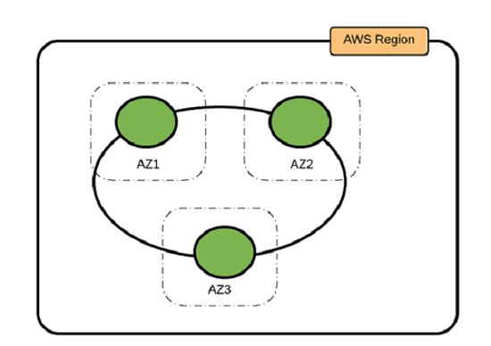
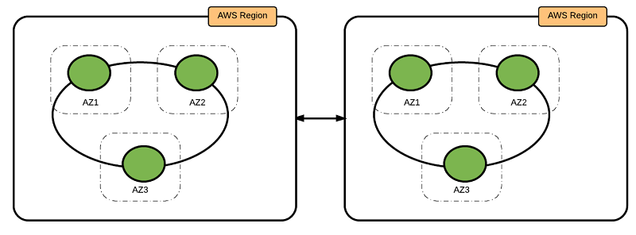
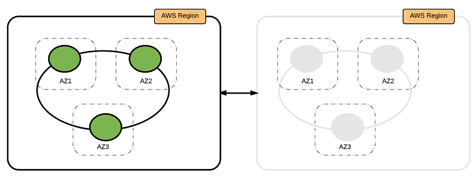

# Best Practices for Running Apache Cassandra on Amazon EC2
Apache Cassandra是广泛使用的高性能NoSQL数据库。当前在on-premises环境维护Cassandra的客户可能期待在[Amazon EC2](https://aws.amazon.com/ec2/运行Cassandra)以获取其弹性，可靠性，安全性及其经济型等收益。

Amazon EC2 和 [Amazon Elastic Block Store (Amazon EBS)](https://aws.amazon.com/ebs/) 提供了安全，可扩展的计算能力，以及AWS云端存储。当两者结合使用，你可以部署Cassandra，允许你根据你的需求缩放Cassandra系统的能力。考虑到可能的部署计数的数量，为你的用例选择一个最合适的战略并不总是很容易的。

本文中，我们将介绍3种Cassandra 部署选项，也提供了在下面这些领域根据你的用例决定你的最佳实践的指南。
- Cassandra 资源概览
- 部署考虑（Deployment considerations）
- 存储选项（Storage options）
- 网络（Networking）
- 高可用性和可靠性（High availability and resiliency）
- 可维护性（Maintenance）
- 安全性
## DynamoDB
在我们跳进在AWS运行Cassandra的最佳实践之前，我们应该提到我们有可多客户决定使用DynamoDB 而非维护自己的Cassandra集群。DynamoDB 是全托管的，无服务的，并且提供了跨区域，多master的复制，数据加密，以及托管的备份和恢复。与IAM的集成使得DynamoDB 的客户可以基于他们的数据安全需要而实现细粒度的访问控制。

几个已经运行大型Cassandra 集群多年的客户已经切换到DynamoDB--这消除了管理Cassandra集群和自己维护高可用性和持久性的复杂性。Gumgum.com就是这样的一个客户，它们切换到DynamoDB并观察到了客观的成本节省。更多细节，请参考[Moving to Amazon DynamoDB from Hosted Cassandra: A Leap Towards 60% Cost Saving per Year](http://techblog.gumgum.com/articles/moving-to-amazon-dynamodb-from-hosted-cassandra)。
## Cassandra 资源概览
这里是标准Cassandra 资源的一个简短介绍，以及它们在AWS的基础设施下如何实现。如果你已经对Cassandra 和AWS部署熟悉，它们可作为一个知识更新：
资源|Cassandra|AWS
--------|--------|--------
集群|一个简单的Cassandra部署。这通常包括多个物理位置，keyspaces和物理服务器|AWS 上一个逻辑部署构造，映射到一个[AWS CloudFormation](https://aws.amazon.com/cloudformation) StackSet，它包含一个或多个CloudFormation 栈以部署Cassandra
Datacenter|医嘱节点配置为一个单独复制组|AWS 上一个逻辑部署构造。一个数据中心是用一个CloudFormation 栈部署的，包含EC2实例，网络，unchu以及安全资源。
机架（Rack）|服务器集合。一个数据中心至少包含一个机架。Cassandra 努力将数据副本放置到不同的机架|一个单独的可用区
服务器/节点|一个运行Cassandra 软件的物理或虚拟机|一个AWS EC2实例
令牌（Token）|概念上，集群管理的数据以一个环形表示。换进一步被分成与节点数相当的范围。每个节点负责维护一个或多个范围。每个节点被指定一个Token。它是从范围里的一个随机数。Token值决定了节点在环上的位置以及它负责的范围|Cassandra内部管理
虚拟节点（vnode）|负责存储一定范围的数据。每个vnode接受环上的一个Token。一个集群（默认地）含有256个Token，它平均分布到Cassandra 数据中心的所有服务器上|Cassandra内部管理
复制因子|跨集群的副本数|Cassandra内部管理
## 部署考虑
将Cassandra 部署到Amazon EC2上的众多收益中的一个就是你可以自动化你的很多部署任务。另外，AWS包含一些服务如CloudFormation，它允许你描述和规定你的云端基础设施资源。

我们建议用一个CloudFormation 模板编排一个Cassandra环。如果你在多个AWS区域中部署，你可以使用一个CloudFormation StackSet来管理这些栈。所有这些维护操作（缩放，升级和备份）都可用AWS SDK脚本化。
### 部署模式（Deployment patterns）
在本节我们讨论在Amazon EC2上部署Cassandra不同部署选项。一个成功的部署始于对这些选项的详细的思考。考虑你的巨大的数据量，网络环境，throughput，和可用性。
- 单AWS区域，3个可用区
- Active-Active，多个AWS区域
- Active-Standby，多个AWS区域
### 单AWS区域，3个可用区
在这个模式下，你把 Cassandra 集群部署到一个AWS区域的3个可用区上。整个集群只有一个环。通过利用3个可用区中的EC2实例，你可以确保副本在所有可用区中平均分布。
 

为了确保数据跨所有可用区平均分布，我们建议你在所有可用区平均分布EC2实例。集群中的EC2实例格式应为3（复制因子）的倍数。

该模式适用于应用制备部署到一个区域的场景，或者被部署到多个区域但出于数据隐私或法律需求需要数据被要求被部署到同一区域。

优势（Pros）|劣势（Cons）
--------|--------
高可用性，可忍受一个可用区失败|不能保护一种情形：该区域的许多资源在断断续续失败
部署简单|
### Active-Active，多个AWS区域
在这个模式下，你在两个区域部署两个环并连接它们。两个区域的VPC是[成对](http://docs.aws.amazon.com/AmazonVPC/latest/PeeringGuide/Welcome.html)的，所以数据可以在两个环间复制。

 

我们推荐两个区域的环在性质上保持一致，节点数一样，实例类型以及存储配置。

这种模式最适合使用Cassandra集群的应用被部署在多个区域上。

优势（Pros）|劣势（Cons）
--------|--------
failover时没有数据丢失|很高的操作负荷
高可用性，可容忍一个区域的许多资源在断断续续失败|第二个区域使成本翻倍
读写操作可被路由到本地区域以获取更低延迟及更高的性能|
### Active-Standby，多个AWS区域
在这个模式下，你在两个区域部署两个环并连接它们。两个区域的VPC是[成对](http://docs.aws.amazon.com/AmazonVPC/latest/PeeringGuide/Welcome.html)的，所以数据可以在两个环间复制。

 

但是，第二个区域不从应用哪里接受流量。它仅仅用作灾备恢复的第二数据中心。如果主区域不可用，它才开始接受流量。

我们推荐两个区域的环在性质上保持一致，节点数一样，实例类型以及存储配置。

这种模式最适合使用Cassandra集群的应用要求低的单点失效目标(RPO) 以及恢复时间(RTO)。

优势（Pros）|劣势（Cons）
--------|--------
failover时没有数据丢失|很高的操作负荷
高可用性，可容忍一个区域的失败或分区|写操作最终一致性读的延迟很高；第二个区域使成本翻倍
## 存储选项

## Reference
- [Best Practices for Running Apache Cassandra on Amazon EC2](https://aws.amazon.com/cn/blogs/big-data/best-practices-for-running-apache-cassandra-on-amazon-ec2/)