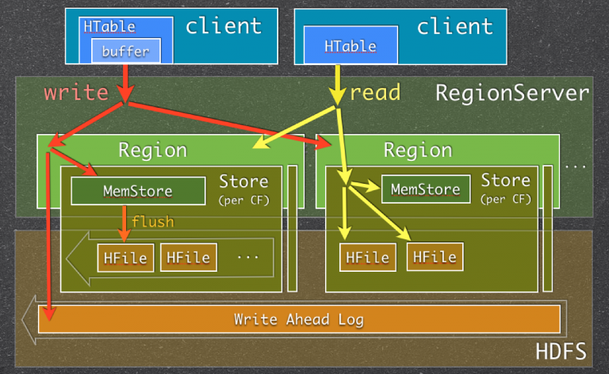
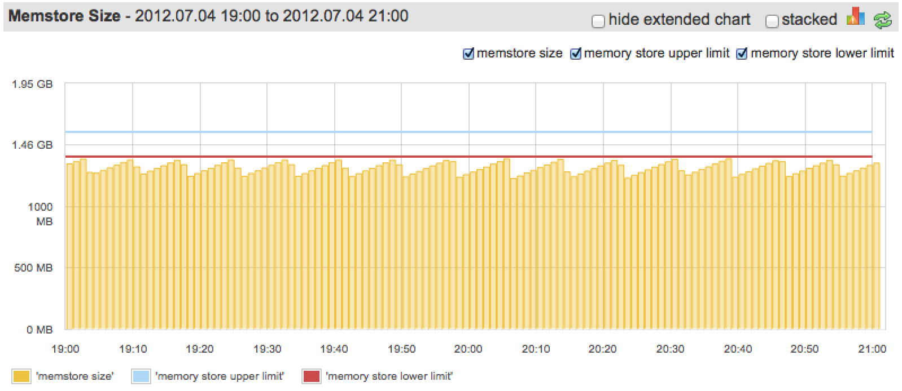

# 配置HBase Memstore：你应该知道什么
在这篇文章中我们将讨论HBase用户应该知道的HBase内部组件之一：Memstore。理解和Memstore相关的底层处理将能帮你配置HBase集群以取得更好性能。
## HBase Memstore


当一个RegionServer收到一个写请求时，它把请求导向到一个特定的Region。每个Region存储一个行集（row set），行数据可被分为多个列族。特定列族的数据被存在HStore里，HStore由MemStore和一系列HFiles构成。Memstore在RegionServer主存中，而HFiles被写到HDFS里。当一个写请求被处理时，数据首先写到Memstore。然后，当数据量达到某个阀值（显然，主存必须被很好地限制），Memstore数据被刷写到HFile。

使用Memstore的主要原因是需要在往HDFS存储数据时使其按行键排序。由于HDFS被设计用于顺序读写，不允许文件修改，HBase 不能有效地把新数据写到磁盘上：写的数据未曾排序（当输入是无序的时候），这也意味着未曾为将来的检索优化。为了解决这个问题，HBase将收到的数据缓存在内存里（Memstore），并在刷写前排序，接下来在写到HDFS时使用顺序写。注意在现实中HFile 不仅仅是一系列有序行，[它的结构和功能比这复杂的多](apache_hbase_io.md)。

除了解决“无序”的问题，Memstore 也有其它好处，比如：
  + 它可用做一个内存缓存持有新加数据。当新写的数据访问比老数据访问更频繁时，在许多场合下它都是有用的。
  + 当内存中数据写入到持久存储时，可能对行/单元格作一定的优化。例如，对某一个列族的单元格如果配置成只保存一个版本，而Memstore收到某个单元格的多个更新，则仅仅最新一条数据被保存，其它老数据将被丢弃（它们永远不会被写入到HFile中）

重要的事情是每次Memstore的刷写都将为一个列族创建一个HFile。

关于读操作最后的结果很简单：HBase首先检查数据是否在MemStore中，然后去HFiles查询并返回两者合并后的结果给用户。

**关心什么：**
这里有很多原因需要HBase用户和管理员直到MemStore是什么，它如何使用：
- 针对MemStore有很多配置选项可以用来取得更好的性能并避免问题。HBase并不会基于你的使用模式为你（自动）调整设置
- 频繁的Memstore刷写能影响读性能并给系统带来额外负载
- Memstore涮写的方式可能影响你的Shema设计

让我们近距离检验这些观点。
## 配置MemStore刷写（Configuring Memstore Flushes）
基本上由两组配置属性（略去region关闭前的刷写）：
+ 首先决定刷写什么时候被触发
+ 其次决定刷写什么时候被触发，并且刷写期间更新被阻塞

第一组关于触发常规刷写，通常与服务于写请求同步进行。控制刷写阀值的属性为：
  + hbase.hregion.memstore.flush.size
    ```
    <property>
      <name>hbase.hregion.memstore.flush.size</name>
      <value>134217728</value>
      <description>
        当MemStore的大小超过这个字节数后，MemStore将被涮写到磁盘。一个线程每隔hbase.server.thread.wakefrequency将检查MemStore字节数。
      </description>
    </property>
    ```
  + base.regionserver.global.memstore.lowerLimit
    ```
    <property>
      <name>hbase.regionserver.global.memstore.lowerLimit</name>
      <value>0.35</value>
      <description>
        在强制刷写前一个RegionServer所有MemStore的最大值，缺省是35%堆内存。如果这个值与hbase.regionserver.global.memstore.upperLimit相等，则当更新由于MemStore限制被阻塞时将会导致最小可能的刷写
      </description>
    </property>
    ```
注意第一个设置是每Memstore的设置，例如，你定义它时需要考虑每个RegionServer服务的Region个数。当Region数增长时（你只是在你的Region数较小时设置此数），Memstore刷写可能首先被第二个阀值触发。

第二组设置事关安全：有时候写负载太高，刷写速度不能跟上，而我们不想MemStore无限制增长，在这种情况下更新被堵塞，除非memstore 达到可控大小。这些阀值配置如下：
  + hbase.regionserver.global.memstore.upperLimit
    ```
    <property>
      <name>hbase.regionserver.global.memstore.upperLimit</name>
      <value>0.4</value>
      <description>
        在新的更新被阻塞，MemStore被强制刷写前一个RegionServer里所有MemStores的最大大小。缺省是堆大小的40%。更新被阻塞，MemStore被强制刷写直到一个RegionServer里所有MemStores的大小降到hbase.regionserver.global.memstore.lowerLimit以下。
      </description>
    </property>
    ```
  + hbase.hregion.memstore.block.multiplier
    ```
    <property>
      <name>hbase.hregion.memstore.block.multiplier</name>
      <value>2</value>
      <description>
        如果MemStore已经达到hbase.hregion.memstore.block.multiplier * hbase.hregion.memstore.flush.size字节数，则阻塞更新。这对于防止在更新高峰期MemStore爆棚有用。没有一个上限，MemStore会堆积，刷写出的HFile文件可能会话很长时间来Compact或切分，更糟糕的，可能会导致OOME。
      </description>
    </property>
    ```
在特定RegionServer上堵塞更新可能会是一个很大的问题，值得担心的可能更多。因为从HBase设计来讲，一个Region仅被一个RegionServer管理，当写负载被平均分配到整个集群（通过Regions），拥有一个如此“慢”的RegionServer将会使得整个集群变慢（基本指速度影响）。

> **提示**：监控Memstore Size 和 Memstore Flush Queue size。理想情况下Memstore Size不应该达到MemStore的上限，Memstore Flush Queue size不应该稳定增长。
## Memstore频繁刷写
因为我们期待避免写堵塞，看起来在到达“写堵塞”阀值前提早刷写是个不错的方式。但是，这将导致频繁刷写--它将影响读性能并给集群带来额外负载。

每次MemStore刷写时每个列族都会创建一个HFile。频繁的刷写可能会创建许多HFiles。因为在读操作过程中HBase将不得不查看许多文件，读取速度将受到损害。

为阻止打开太多文件，避免读性能恶化，我们拥有HFiles compaction过程。HBase将会定期（当某些配置的阀值达到时）合并多个小文件打一个大文件。显然，MemStore刷写创建的文件越多，系统承担的工作（额外付在）就会越多。更需注意的是：Compaction过程通常是与服务其它请求同时进行的，当HBase不能跟上合并HFiles的步伐时（是的，这也有配置的阀值），它将再次阻塞这个RegionServer的写操作。如同上面提到的，这是非常不期待的。

> **提示**：监控RegionServer上的Compaction Queue size。当它持续增长时，你就需要在它引起问题之前采取行动。

更多HFiles创建和Compaction的信息可在[这儿](http://outerthought.org/blog/465-ot.html)找到。

因此，理想地MemStore使用尽可能多的内存（和配置相同，但不是RegionServer的所有内存：我们还拥有内存缓存），但不要超过上限。下图显示了一个比较好的状态：



之所以说"比较"好，是因为我们可以配置下限靠近上限，并且我们很少超过它（下限）。
## 多个列族与Memstore刷写
## HLog（WAL）大小与Memstore刷写
## 压缩与Memstore刷写

## References
- [Configuring HBase Memstore: What You Should Know](https://sematext.com/blog/hbase-memstore-what-you-should-know/)
