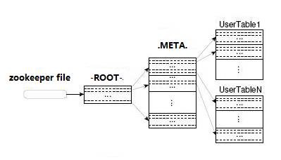
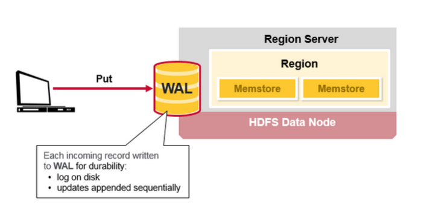
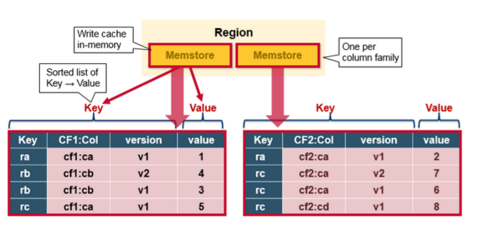
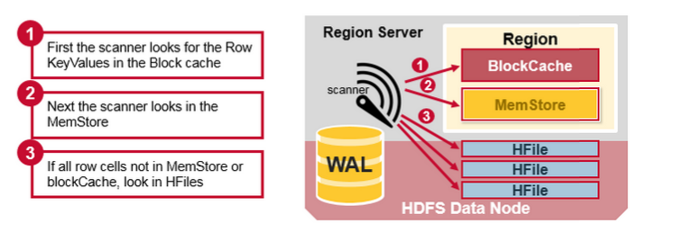
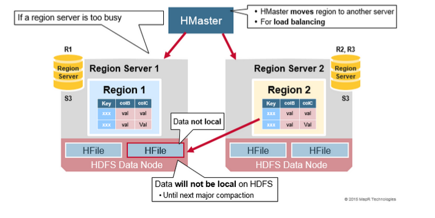
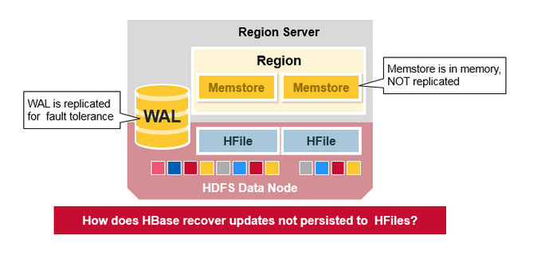
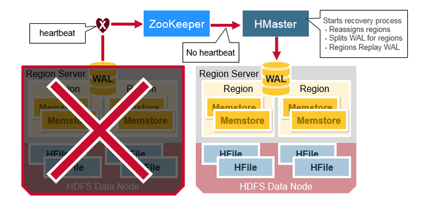
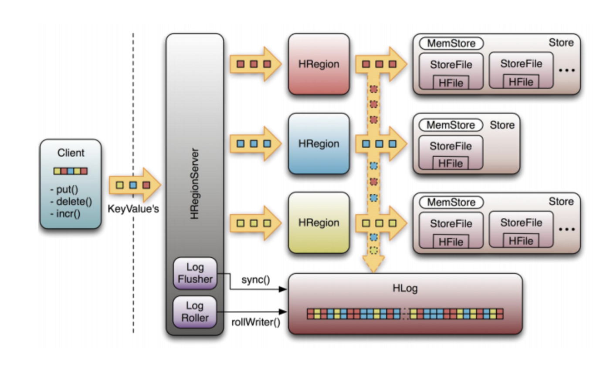

# HBase架构指南
## 1. 简介
HBase是一个高可靠性，高性能，面向列的，可扩展的分布式存储系统，利用HBase技术可以在不贵的PC服务器上构建大规模结构化存储集群。HBase的目标是存储和处理大量的数据，尤其适合用用标准硬件配置来处理大量包含行和列的数据。

不同于MapReduce的离线批处理计算框架，HBase是随机访问存储和查询平台，它可以弥补HDFS不能随机访问数据的缺憾。

HBase适用于实用性要求不太高的商业场景--HBase存储字节数组，它并不关心数据类型，允许动态灵活的数据模型。

上图描述了Hadoop 2.0生态中的各层系统--HBase位于结构化存储层。

HDFS为HBase提供了高可靠性的底层存储支持。

MapReduce为HBase提供高性能批处理处理能力。Zookeeper为HBase提供稳定的服务和failover机制。Pig和Hive为HBase提供数据统计处理的高级语言支持。Sqoop提供HDB来支持关系数据库导入功能，该功能使得把商业数据从传统数据库导入HBase变得方便。
## 2. HBase Architectural Components
物理上看，HBase是由3种类型的服务器组成的主从架构。Region Server服务于数据读写，当访问数据时，客户直接与HBase Region Server通讯。Region指派，DDL（创建，删除表）由HBase Master进程处理。Zookeeper，作为HDFS的一部分，维护活动集群状态。

Hadoop DataNode存储Region Server管理的数据。所有的HBase数据都存储在HDFS文件中。Region Servers和HDFS DataNodes驻留在同一节点上，这可以确保RegionServers服务的数据的本地性（将数据保存在需要它的地方）。HBase数据在刚写时是在本地的，但当一个region被移动后，它就不再具有本地性，直到compaction。

### 2.1 基本架构（Basic Architecture）
+ 客户（client）：使用HBase的RPC机制与HMaster和HRegionServer通讯，提交请求并获取结果。对管理操作，客户向HMaster提交RPC请求；对数据读写操作，向HRegionServer提交RPC请求。
+ Zookeeper：通过将集群中的每一个节点的信息注册到ZooKeeper中，HMaster可在任何时候感知到每个HRegionServer的健康状态，也能避免HMaster的单点问题。
+ HMaster：管理所有的HRegionServers，告诉它们哪些HRegions需要维护，并监控所有的HRegionServers的健康状态。当一个新的HRegionServer注册进HMaster，HMaster告诉它等待数据被分配给它。当一个HRegionServer死去，HMaster将把它负责维护的所有HRegions标记为未分配的，并把它们指派给其它HRegionServers。HMaster不存在单点问题。HBase可以启动多个HMaster，通过ZooKeeper的选举机制，总有一个HMaster实例在集群中运行，从而提高了集群的可用性。
+ HRegion：当表大小超过一个阀值，HBase会将该表分割成几个不同区域，每个区域含有表中所有行的一部分。对用户来说，表是一个数据集，由主键区分(RowKey)。物理上，表被分割成多个块，每个块是一个HRegion。我们使用表名 + 起始主键来区分每个HRegion。一个HRegion将保存一个表中一系列连续数据。一个完整的表数据存储在多个HRegions中。
+ HRegionServer：从底层来说HBase的所有数据都存储在HDFS里。用户可以通过一系列HRegionServers得到数据。一般集群的每个节点上之韵星一个HRegionServer实例，一个段的HRegion仅仅由一个HRegionServer负责维。HRegionServer主页负责根据用户的IO请求从HDFS文件系统读写数据，**它是HBase的核心模块**。HRegionServer内部管理了一系列的 HRegion 对象，每个HRegion对应本地表的一系列连续数据段。HRegion 由多个HStores组成，每个HStore代表本地表的一个列族的存储。它可被视为每个列族是一个中央存储单元。因此，为了提高操作效率，我们倾向于把具有相同IO特征的列放到同一个列族中。
+ HStore：**它是HBase存储的核心**，它由MemStore 和StoreFiles组成。MemStore是一个内存缓存，用户写入的数据首先被放置到MemStore中。当MemStore 满时， **一个StoreFile（其底层实现是HFile）将会被刷写**。当StoreFile 文件数增长到一个特定阀值时，一个Compact Merge操作就会被触发，多个StoreFiles 将会被合并成一个，合并过程中也会执行版本合并和数据删除。因此，可以视为HBase仅仅添加数据，所有的更新和删除操作将由后面的Compact 过程执行，因此用户的写入操作只要它进入了内存，就会马上返回，从而确保了HBase I/O的高性能。当StoreFiles文件Compact后，它将形成一个越来越大的文件。当单个StoreFile 文件的大小超过一个特定阀值时，一个切分（Split ）操作将会被触发，同时，当前HRegion 将会被切分成两个HRegions，父HRegion 将会下线。两个字HRegions 将会被HMaster指派给对应的HRegionServer ，如此原先的HRegion 的负载压力就会被分流到两个HRegions里。
+ HLog：每个HRegionServer 拥有一个HLog 对象，它是一个预写日志类用于实现Write Ahead Log（WAL）。每次用户写入数据到MemStore，它也将一份数据的拷贝写到HLog 文件。HLog 会定期滚动和删除，老文件将会被删除（数据已经被写入到StoreFile中）。当HMaster 通过ZooKeeper检测到一个HRegionServer 异常终止，HMaster 将会首先处理遗留HLog 文件，把不同HRegions的数据分割开，并把它们放至对应的HRegion目录下，然后再分发无效的HRegions。在加载HRegion的过程中，这些HRegions 的HRegionServer 将会找到是否有一个历史HLog 需要处理，因此在回放日志（Replay HLog）将会被传送到MemStore中，然后被刷写到StoreFiles 中以完成数据恢复。
### 2.2 Root and Meta
所有HBase的HRegion metadata存储在.META。 表中。当HRegion增长时，.META表中的数据随之增长，并被切分成多个HRegions。

为了在.META表中定位每个HRegion，.META表中的所有HRegions 的metadata 存储在-ROOT-表中。最终，-ROOT-表的位置信息被存储在ZooKeeper中。

在所有客户访问用户数据之前，他们需要访问Zookeeper 以获取-ROOT-的位置信息，进而获得.META表的位置，并最终根据.META表中的信息获得用户数据的位置信息，如下图所示：

-ROOT-表永远不会切分，它只有一个HRegion，这可以确保任何HRegion 可以在3跳内被定位。为了加速访问，.META表中的所有regions都被加载在内存中。

客户端缓存返回的位置信息，且该缓存不会主动失效。如果客户给予缓存信息不能访问数据，就向.META表的相关RegionServer发起查询以获取数据的位置信息。如果仍失败，查询-ROOT-以获取相关.META表在哪里。

最终，如果以前的信息全无效，HRegion的数据被ZooKeeper重新定位。因此如果客户端缓存全无效，你必须往返6次以获取正确的HRegion。 
## 3. HBase组件细说
### 3.1 Regions
HBase被行键（row key）范围水平切分成“Regions”。一个Region包含一个表中开始键和结束键范围内的所有行。Regions被指派给集群内的节点“RegionServers”，这些RegionServer服务于数据读写。一个RegionServer可以服务于1000个Region。

### 3.2 HBase HMaster
Region指派，DDL（创建，删除表）操作由HBase HMaster处理。

一个master负责：
- 协调RegionServers
  + 在启动时指派Regions，为（灾难）回复或负载均衡重新指派Regions
  + 监控集群中所有的RegionServers（监听来自ZooKeeper的通知）
- 管理功能
  + 创建，删除，更新表的接口

### 3.3 ZooKeeper: 协调器
HBase使用ZooKeeper作为一个分布式协调服务来维护集群服务器状态。ZooKeeper维护哪些服务器活着且可用，并提供服务器失效通知。Zookeeper使用共识来确保公共共享状态。注意应该有3台或5台服务器以确保共识。

## 4. 这些组件如何协同工作（How the Components Work Together）
Zookeeper常被用于协调分布式系统各成员间的共享状态信息。RegionServers和活动HMaster都维持了与ZooKeeper的会话。ZooKeeper则通过心跳机制为活动会话维护了临时节点。

每个RegionServer创建了一个临时节点，HMaster监控这些节点以发现可用的RegionServer，它同时监控节点服务失效。HMasters争夺创建临时节点，Zookeeper决定谁是第一个并确保它是为一活动的HMaster。活动的HMaster向ZooKeeper发送心跳，不活动的HMaster则监听活动HMaster失效通知。

如果一个RegionServer或活动HMaster发送心跳失败，会话将会过期，对应临时节点将会被删除。更新状态监听器将会被通知节点被删除了。活动HMaster 监听RegionServers，将会恢复失效的RegionServer。不活动的HMaster监听活动HMaster失效，如果活动HMaster失效，一个不活动的HMaster则成为新的活动HMaster。
### 4.1 HBase Meta Table
+ .META表是一个HBase表，持有集群中所有regions 的列表
+ .META就像一个树
+ .META表结构如下所示
  + 键：region开始键，region id
  + 值：RegionServer

### 4.2 Region Server Components
RegionServer运行在HDFS DataNode上，它包含以下组件：
+ WAL：预写日志是分不是文件系统的一个文件。WAL通常用于存储还没写入持久存储的新数据；它用于在失效时恢复。
+ BlockCache：读缓存。它在内存中保存被频繁读取的数据。但缓存满时最少使用数据被移除。
+ MemStore：写缓存。它用于存储还没写到磁盘上的新数据。在写到磁盘之前排序。每个Region的每个列族有一个MemStore。
+ Hfiles：将行按有序键值对存储到磁盘上。

### 4.3 HBase Write Steps
当一个客户发出一个Put请求时，第一步是把数据写进WAL：
- Edits被添加到磁盘上的WAL尾部
- WAL用于在服务崩溃时恢复还未持久化到存储的数据

数据一旦写进WAL，它被放进MemStore。然后，put请求的确认信息就返回给客户。

### 4.4 HBase MemStore
MemStore把更新数据存储为有序键值对，当刷写到HFile时保持同样的格式。一个列族一个MemStore，更新数据在每个列族内排序。

### 4.5 HBase Region Flush
当MemStore堆积了足够的数据，整个有序数据集被写到HDFS中的一个新HFile。每个列族HBase都会使用多个HFile，里面包含实际的单元格，即键值对实例。当MemStores 中的有序键值对不断刷写到磁盘文件时，这些文件就被不断创建。

注意这是HBase中限制列族数量的其中一个原因。每个列族一个MemStore；当一个MemStore 满时，它们都会被刷写。它同时也保存了最后一次写的序列号，这样系统就可以知道如今已经写到哪里。

最高序列号在每个HFile中以meta字段的形式存储，用来反映持久化在哪里结束，从哪里开始。当一个region启动，这个序列号被读入，最高值被用作新的编辑值。

### 4.6 HBase HFile
数据存储在HFile中，它包含有序键值对。当MemStore累积到足够数据时，整个有序键值对数据集剑被写入到HDFS的一个新HFile中。这是顺序写，速度极快，因为它避免了磁头的移动。

HFile包含多层索引，它允许HBase寻址到特定数据而不需要读入整个文件。多层索引就像一个b+树：
+ 键值对按递增序存储
+ 行键索引点可索引到64KB “块（blocks）”的键值对数据
+ 每个块拥有自己的叶子索引
+ 每个块的最后一个键被放到中间索引中
+ 根索引指向中间索引

尾部（trailer）指向meta块，它在结束文件写操作的时候被写入。尾部也拥有其它信息比如布隆过滤器，时间范围信息等。布隆过滤器帮助跳过不含特定行键的文件，时间范围信息用于帮助跳过不在查询时间范围的文件。

我们刚讨论过的索引在HFile打开时加载并保持在内存中，这允许查询因因需要一次磁盘寻址即可完成。

### 4.7 HBase Read Merge
我们已经看到一个行键对应的键值对单元格可以存在多个地方，已经持久化的行单元格在HFile中，最近更新的单元格在MemStore中，最近读取过的单元格在BlockCache。那么当你读一行时，系统如何放回对应的单元格呢？一个针对block cache，MemStore和HFile中的键值对的读合并操作按下面的步骤进行：
1. 首先，扫描器从Block cache中查询行单元格--读缓存。最近读取过的单元格缓存在这里，如果需要内存，LRU算法被用于清除老的内容
2. 接下来，扫描器查看MemStore，写缓存在内存中保存了最新写的数据
3. 如果扫描器未在MemStore和Block Cache找到所有的行单元格数据，HBase将使用Block Cache的索引和布隆过滤器来将HFile加载进内存，它里面可能包含目标数据。

正如前面讨论的，每个MemStore可能含有许多HFile，这意味着对于读操作，将需要检查多个文件，这将影响性能。这被称为读放大。

### 4.8 HBase Minor Compaction
HBase将自动选取一些小的HFiles并将它们重写为一些少的较大的文件，这个过程被称为minor compaction。Minor compaction通过合并排序来降低存储文件的数目。

### 4.9 HBase Major Compaction
Major compaction合并并重写一个region的所有HFiles，形成每列族一个新的HFile，在此过程中，去掉删除或过期的单元格。这提升了读性能；但是，因为Major compaction重写了所有的文件，大量的磁盘I/O和网络流量可能将在这个过程中产生，这被称为写放大。

Major compactions可被调度为自动运行。由于写放大，Major compactions通常被安排于周末或晚上运行。Major compaction也可以是以前由于服务失败或负载均衡而需远程访问的数据文件变得本地化。

### 4.10 Region Split
让我们来简单回顾一下regions：
+ 一个表可水平切分为一个或多个Regions，一个Region包含一系列连续的以开始键和结束键为界的数据行
+ 每个Region缺省为1G
+ 一个表的Region通过RegionServer服务于客户
+ 一个RegionServer可服务于1000个Regions（它们可能属于同一个表，也可属于不同的表）

最初每个表有一个Region。当这个Region涨的过大，它就会切分成两个子Region。两个子Region，每个代表原Reion的一班，在同一个RegionServer上被并行打开，然后这个切分被汇报给HMaster。出于负载均衡的目的，HMaster可能将这个Region迁移到别的RegionServer上。

前面提到，出于负载均衡的目的，HMaster可能将这个Region迁移到别的RegionServer上。这将导致新的RegionServer服务从一台远端HDFS节点来的数据，这种倩况不会改变，直到major compaction将数据文件移到该RegionServer的本地节点。但它被写完后，HBase数据将位于本地，但当一个Region被移动后（因为负载均衡或灾难恢复），它不再是本地的，直到major compaction完成。

## 5. HDFS Data Replication
所有读写都是通过主节点（primary node），HDFS复制WAL和HFile数据块。HFile块复制是自动发生地。HBase依赖HDFS来提供数据安全性--因为是HDFS保存文件。当数据写到HDFS时，本地写了一份拷贝，然后他被复制到第二个节点，并继续复制到第三个节点。

WAL和HFile都被持久化到硬盘并复制，

## 6. HBase Crash Recovery
当一个RegionServer失效时，崩溃的Regions变得不可用，直到RegionServer失效被检测到并采取了恢复措施。Zookeeper在其失去RegionServer的心跳连接后会判断该RegionServer已失效；接下来HMaster会通知该RegionServer已失效。

当HMaster检测到一个RegionServer已崩溃，HMaster将把已崩溃RegionServer的Regions指派给其它活动RegionServers。为了恢复已崩溃RegionServer的MemStore中未被持久化到磁盘的数据，HMaster将把已崩溃RegionServer的WAL切分成不同的文件，并把这些文件存储到新的RegionServer的数据节点上。每个RegionServer接下来回放切分的WAL文件，以此重建那个Region的数据。

## 7. HBase读写过程
下面的图是RegionServer的数据存储关系图。上面提到，HBase利用MemStore和StoreFile来把更新写到表中。当数据更新时它首先写到HLog和MemStore，数据在MemStore中是排序的。

当MemStore数据累积到一定阀值后，一个新的MemStore被创建，老的MemStore被加入到刷写队列（Flush queue），一个单独的线程刷写MemStore到磁盘成为一个新的StoreFile。同时，系统将在ZooKeeper中记录一个CheckPoint，指示在这之前的数据已经被持久化了。当一个异常事件发生时，MemStore中的数据可能丢失。

在这个例子中，HLog被用来恢复CheckPoint之后的数据。

StoreFile是只读的，一旦创建就不能更改。因此，HBase的更新是一个附加的操作。当StoreFile数量达到一个阀值后，一个合并操作被触发，对同一个键的修改将被合并到一个大的StoreFile中。当一个StoreFile大小超过一个阀值后，StoreFile被切分成两个StoreFiles。

## References
- [HBase Working Principle: A part Hadoop Architecture](https://towardsdatascience.com/hbase-working-principle-a-part-of-hadoop-architecture-fbe0453a031b)
- [HBase Architecture In Depth](https://mapr.com/blog/in-depth-look-hbase-architecture/)
- [Apache HBase ™ Reference Guide](https://hbase.apache.org/book.html)
- [A Beginners Guide to HBase](https://medium.com/@pankaj.singhal/a-beginners-guide-to-hbase-1310f832aff7)
