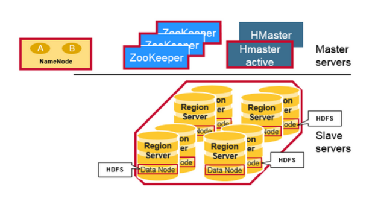

# HBase架构指南
## 简介
HBase是一个高可靠性，高性能，面向列的，可扩展的分布式存储系统，利用HBase技术可以在不贵的PC服务器上构建大规模结构化存储集群。HBase的目标是存储和处理大量的数据，尤其适合用用标准硬件配置来处理大量包含行和列的数据。

不同于MapReduce的离线批处理计算框架，HBase是随机访问存储和查询平台，它可以弥补HDFS不能随机访问数据的缺憾。

HBase适用于实用性要求不太高的商业场景--HBase存储字节数组，它并不关心数据类型，允许动态灵活的数据模型。

上图描述了Hadoop 2.0生态中的各层系统--HBase位于结构化存储层。

HDFS为HBase提供了高可靠性的底层存储支持。

MapReduce为HBase提供高性能批处理处理能力。Zookeeper为HBase提供稳定的服务和failover机制。Pig和Hive为HBase提供数据统计处理的高级语言支持。Sqoop提供HDB来支持关系数据库导入功能，该功能使得把商业数据从传统数据库导入HBase变得方便。
## HBase Architectural Components
物理上看，HBase是由3种类型的服务器组成的主从架构。Region Server服务于数据读写，当访问数据时，客户直接与HBase Region Server通讯。Region指派，DDL（创建，删除表）由HBase Master进程处理。Zookeeper，作为HDFS的一部分，维护活动集群状态。

Hadoop DataNode存储Region Server管理的数据。所有的HBase数据都存储在HDFS文件中。Region Servers和HDFS DataNodes驻留在同一节点上，这可以确保RegionServers服务的数据的本地性（将数据保存在需要它的地方）。HBase数据在刚写时是在本地的，但当一个region被移动后，它就不再具有本地性，直到compaction。

+ 客户（client）：使用HBase的RPC机制与HMaster和HRegionServer通讯，提交请求并获取结果。对管理操作，客户向HMaster提交RPC请求；对数据读写操作，向HRegionServer提交RPC请求。
+ Zookeeper：通过将集群中的每一个节点的信息注册到ZooKeeper中，HMaster可在任何时候感知到每个HRegionServer的健康状态，也能避免HMaster的单点问题。
+ HMaster：管理所有的HRegionServers，告诉它们哪些HRegions需要维护，并监控所有的HRegionServers的健康状态。当一个新的HRegionServer注册进HMaster，HMaster告诉它等待数据被分配给它。当一个HRegionServer死去，HMaster将把它负责维护的所有HRegions标记为未分配的，并把它们指派给其它HRegionServers。HMaster不存在单点问题。HBase可以启动多个HMaster，通过ZooKeeper的选举机制，总有一个HMaster实例在集群中运行，从而提高了集群的可用性。
+ HRegion：当表大小超过一个阀值，HBase会将该表分割成几个不同区域，每个区域含有表中所有行的一部分。对用户来说，表是一个数据集，由主键区分(RowKey)。物理上，表被分割成多个块，每个块是一个HRegion。我们使用表名 + 起始主键来区分每个HRegion。一个HRegion将保存一个表中一系列连续数据。一个完整的表数据存储在多个HRegions中。
+ HRegionServer：从底层来说HBase的所有数据都存储在HDFS里。用户可以通过一系列HRegionServers得到数据。一般集群的每个节点上之韵星一个HRegionServer实例，一个段的HRegion仅仅由一个HRegionServer负责维。HRegionServer主页负责根据用户的IO请求从HDFS文件系统读写数据，**它是HBase的核心模块**。HRegionServer内部管理了一系列的 HRegion 对象，每个HRegion对应本地表的一系列连续数据段。HRegion 由多个HStores组成，每个HStore代表本地表的一个列族的存储。它可被视为每个列族是一个中央存储单元。因此，为了提高操作效率，我们倾向于把具有相同IO特征的列放到同一个列族中。
+ HStore：**它是HBase存储的核心**，它由MemStore 和StoreFiles组成。MemStore是一个内存缓存，用户写入的数据首先被放置到MemStore中。当MemStore 满时， **一个StoreFile（其底层实现是HFile）将会被刷写**。当StoreFile 文件数增长到一个特定阀值时，一个Compact Merge操作就会被触发，多个StoreFiles 将会被合并成一个，合并过程中也会执行版本合并和数据删除。因此，可以视为HBase仅仅添加数据，所有的更新和删除操作将由后面的Compact 过程执行，因此用户的写入操作只要它进入了内存，就会马上返回，从而确保了HBase I/O的高性能。当StoreFiles文件Compact后，它将形成一个越来越大的文件。当单个StoreFile 文件的大小超过一个特定阀值时，一个切分（Split ）操作将会被触发，同时，当前HRegion 将会被切分成两个HRegions，父HRegion 将会下线。两个字HRegions 将会被HMaster指派给对应的HRegionServer ，如此原先的HRegion 的负载压力就会被分流到两个HRegions里。
+ HLog：每个HRegionServer 拥有一个HLog 对象，它是一个预写日志类用于实现Write Ahead Log（WAL）。每次用户写入数据到MemStore，它也将一份数据的拷贝写到HLog 文件。HLog 会定期滚动和删除，老文件将会被删除（数据已经被写入到StoreFile中）。当HMaster 通过ZooKeeper检测到一个HRegionServer 异常终止，HMaster 将会首先处理遗留HLog 文件，把不同HRegions的数据分割开，并把它们放至对应的HRegion目录下，然后再分发无效的HRegions。在加载HRegion的过程中，这些HRegions 的HRegionServer 将会找到是否有一个历史HLog 需要处理，因此在回放日志（Replay HLog）将会被传送到MemStore中，然后被刷写到StoreFiles 中以完成数据恢复。

## References
- [HBase Working Principle: A part Hadoop Architecture](https://towardsdatascience.com/hbase-working-principle-a-part-of-hadoop-architecture-fbe0453a031b)
- [HBase Architecture In Depth](https://mapr.com/blog/in-depth-look-hbase-architecture/)
- [Apache HBase ™ Reference Guide](https://hbase.apache.org/book.html)
