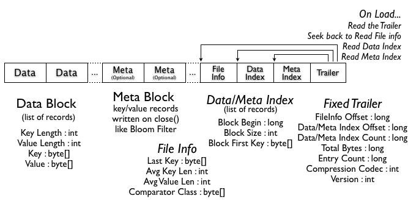

# Apache HBase I/O – HFile
## 简介
Apache HBase是Hadoop下一套开源分布式带版本功能存储管理系统，非常适合随机实时读写访问。

等等？随机实时读写访问？我没听错？

这怎么可能？Hadoop不是顺序读写的批处理系统吗？

是的，我们在谈论同一个事情，在下一章节，我将解释如何HBase如何实现随机读写，它如何存储数据，以及HBase的HFile的格式演变。
## Apache Hadoop I/O 文件格式
Hadoop提供了[顺序文件](https://clouderatemp.wpengine.com/blog/2011/01/hadoop-io-sequence-map-set-array-bloommap-files/)格式，你可以向它添加键值对，但也是由于它的“append-only”能力，这种文件格式不支持对已插入记录的修改和删除。唯一允许的操作就收添加（append），如果你想查找特定键，你就不得不遍历整个文件直到找到它。

如你所见，你被迫遵守顺序读写模式，但如何才可能在其上构建想HBase一样的随机，低延迟读写访问系统呢？

为了帮你解决这个问题，Hadoop提供了另一种文件格式，即MapFile，一种顺序文件的扩展。MapFile实际上是一个目录，它包含两个文件，数据文件“/data”和索引文件“/index”。MapFile允许你添加排序过的键值对。每个N个键（N是一个可配置的间隔），键和位置偏移将被存到索引文件中。这支持快速查询，因为它不需要遍历所有的记录，你可以扫描少的多的索引文件。一旦你找到了你的数据块，你可以直接跳到数据文件中去读取目标数据。

MapFile是很好--你可以快速查询你的键值对，但它还是有下面的两个问题：
- 如何删除或替换一个键值对
- 如果我的输入无序，那么我将无法使用MapFile
## HBase & MapFile
HBase键包括：行键（rowKey），列族, 列（column qualifier），时间戳和类型。

为了解决删除键值对的问题，一种思路是使用“类型（type）”字段来标记键已被删除（墓碑标记，tombstone markers）。解决替换一个键值对仅仅需要选取较新的时间戳（正确值靠近文件末尾，append-only意味着上次插入肯定靠近文件末尾）。

为了解决“无序”的键的问题，我们把最后添加的键值对保存在内存中，当其达到一个阀值时，HBase将其刷写到一个MapFile。通过这种方式，你将有序键值对加入到了MapFile中。

确切来说HBase这样运作：当你用table.put()添加一个值时，你的键值对被添加到MemStore（MemStore之下其实是一个有序的ConcurrentSkipListMap）。当达到一个MemStore的阀值（hbase.hregion.memstore.flush.size）或者一个RegionServer为MemStore使用了太多内存时(hbase.regionserver.global.memstore.upperLimit)，数据就被刷写到磁盘上形成一个MapFile。

每次刷写的结果都是一个新的MapFile，这意味着为了找到某个键你可能不得不搜寻多个文件。这将消耗更多资源，可能潜在地变慢。

每次一个get或Scan发出，HBase将遍历每个文件来来查询结果。为避免查询更多文件，专门有一个线程来探测文件数已经达到某个阀值（hbase.hstore.compaction.max），接下来它将在一个被称为“compaction”的过程中合并多个文件，结果将形成一个新的较大文件。

HBase拥有两种类型的“compaction”：“minor compaction”仅仅将两个或多个小文件合成一个大文件；“major compaction”将选择一个Region中所有文件，合并它们并执行一些清理工作。在“major compaction” 中，删除的键值对将被移除，新文件将不再含有墓碑标记；所有重复的键值对（值替换操作）也被删除。

在2.0版本之前，HBase一直使用MapFile格式来存储数据；但自0.20版本开始一种HBase特有的Mapfile文件格式被引入（HBASE-61）。
## HFile v1
在HBase 0.20中，MapFile被HFile替换：一种特殊的HBase映射（map）文件实现。其思路和MapFile很相似，但它在一个普通键值对文件基础上添加了许多特性。这些特性比如metadata的支持和索引一样保存在同一个文件里。

和MapFile一样数据块（data block）包含实际的键值对数据。对每一个“块关闭操作”，第一个键被加进索引中，而索引在HFile关闭时被写入（磁盘）。

HFile格式也加进了两种额外的“metadata”块类型：Meta和FileInfo。这两种键值对块也在文件关闭时写入。

Meta块被设计用来以一个字符串的形式保存大量数据及其索引；FileInfo则为一个简单的Map，它适合以字节数组的格式来保存少量数据的键值对。Regionserver的StoreFile以Meta-Blocks来存储布隆过滤器；以FileInfo来存储最大SequenceId；Major compaction键和时间戳范围。这些信息是有用的--我们可以在以下情况下避免读文件：键不可能有机会存在（布隆过滤器）；文件太老（Max SequenceId）；文件太信（Timerange）。

## HFile v2
在HBase 0.92中，HFile格式有一点改变（HBASE-3857），主要是改进存储大量数据时的性能。HFile v1的一个主要问题是你需要把所有的（monolithic）索引 和布隆过滤器加载进内存。为了解决这个问题，v2引入了多级索引以及块级别（block-level）布隆过滤器。这一改进的结果就是HFile v2获得了速度提升，内存和缓冲使用优化。

HFile v2的主要特征是“内联块（inline blocks）”，其初衷是避免将整个文件的索引和布隆过滤器加载进内存，而是将索引和布隆过滤器按块加载。这样的话你只需在内存中按需加载。

因为索引移到了块级别，而且你拥有多级别索引，意味着每个索引快拥有自己的索引（叶索引）。每个块的最后一个键用于创建中间索引，最终构成一个像b+树的多级索引。

现在块头含有下面一些信息：“Block Magic”被“Block Type”替换，它用于描述块数据，子索引，布隆，Metadata，根索引等的内容。三个字段（压缩，非压缩大小，前一块偏移量）也被加入来帮助前后快速定位。
### Data Block Encodings
因为键是有序的，并通常很相似，有可能设计出一个专用压缩算法，相信它可比通用压缩算法拥有更高压缩率。

HBASE-4218致力于解决这个问题，在HBase 0.94中你就可以在许多不同的算法中选择：前缀编码和差异编码。

前缀编码的主要思想是将相同的前缀仅仅存储一次，因为行是排序的，典型地其开头都是相同的。

差异编码将这一概念推的更远。不再仅仅将键视为不透明的一段字节码，差异编码将键切分以便于对各部分更好地压缩。这里列族名仅仅存储一次。如果键长度，值长度和类型和前一行一样，这些字段就可被丢弃。同样，为了增加压缩率，时间戳也仅仅存储和前一个的差值。

注意这一特性缺省被禁用，因为它会导致较慢的写入和查询速度，以及较多的数据被缓存。为了开启这一特性你可以将DATA_BLOCK_ENCODING设为PREFIX， DIFF，FAST_DIFF等任一在table info中的类型。
## HFile v3
HBASE-5313包含一个提议来重构HFile布局来进一步提升压缩率。
- 在块头将所有的键打包，在块尾将所有的值打包。这种方式下你可以为键和值使用不同的压缩算法
- 使用与前值XOR的方法来压缩时间戳，使用VInt而非long来存储。

同时，一个柱状（columnar）格式或柱状（columnar）编码处于研究状态，请参见[AVRO-806 for a columnar file format by Doug Cutting](https://github.com/cutting/trevni)。
> **译者注**：从这个项目主页信息来看，该修改已被合并进Apache Avro。

你也看到一个演化趋势是对文件包含的内容越了解，越能取得好的压缩率，或者在何处压输能更好地减少从磁盘读写数据的量。更少的I/O意味着更高的速度。

## Reference
- [Apache HBase I/O – HFile](https://blog.cloudera.com/apache-hbase-i-o-hfile/)
- [Hadoop I/O: Sequence, Map, Set, Array, BloomMap Files](https://clouderatemp.wpengine.com/blog/2011/01/hadoop-io-sequence-map-set-array-bloommap-files/)
- [Apache HBase Write Path](https://clouderatemp.wpengine.com/blog/2012/06/hbase-write-path/)