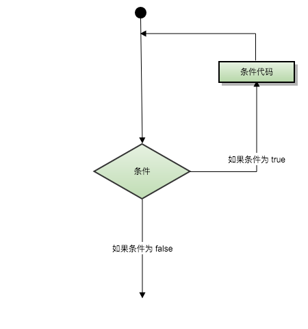
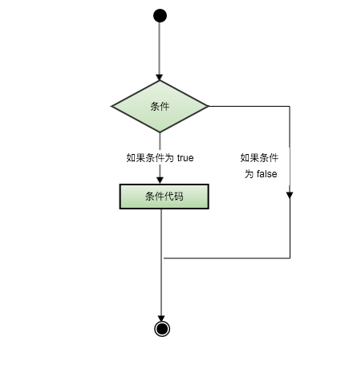

# Lua 教程

Lua 是一种轻量小巧的脚本语言，用标准C语言编写并以源代码形式开放，其设计目的是为了嵌入应用程序中，从而为应用程序提供灵活的扩展和定制功能。

Lua 是巴西里约热内卢天主教大学（Pontifical Catholic University of Rio de Janeiro）里的一个研究小组，由Roberto Ierusalimschy、Waldemar Celes 和 Luiz Henrique de Figueiredo所组成并于1993年开发。

## 1. Lua 入门教程

### 设计目的

其设计目的是为了嵌入应用程序中，从而为应用程序提供灵活的扩展和定制功能。

### Lua 特性

- 轻量级: 它用标准C语言编写并以源代码形式开放，编译后仅仅一百余K，可以很方便的嵌入别的程序里。
- 可扩展: Lua提供了非常易于使用的扩展接口和机制：由宿主语言(通常是C或C++)提供这些功能，Lua可以使用它们，就像是本来就内置的功能一样。
- 其它特性:
  + 支持面向过程(procedure-oriented)编程和函数式编程(functional programming)；
  + 自动内存管理；只提供了一种通用类型的表（table），用它可以实现数组，哈希表，集合，对象；
  + 语言内置模式匹配；闭包(closure)；函数也可以看做一个值；提供多线程（协同进程，并非操作系统所支持的线程）支持；
  + 通过闭包和table可以很方便地支持面向对象编程所需要的一些关键机制，比如数据抽象，虚函数，继承和重载等。

### Lua 应用场景

- 游戏开发
- 独立应用脚本
- Web 应用脚本
- 扩展和数据库插件如：MySQL Proxy 和 MySQL WorkBench
- 安全系统，如入侵检测系统

## 2. Lua 环境安装

### Linux 系统上安装

Linux & Mac上安装 Lua 安装非常简单，只需要下载源码包并在终端解压编译即可，本文使用了 `5.3.0` 版本进行安装：

```
curl -R -O http://www.lua.org/ftp/lua-5.3.0.tar.gz
tar zxf lua-5.3.0.tar.gz
cd lua-5.3.0
make linux test
make install
```

### Mac OS X 系统上安装

```
curl -R -O http://www.lua.org/ftp/lua-5.3.0.tar.gz
tar zxf lua-5.3.0.tar.gz
cd lua-5.3.0
make macosx test
make install
```

### Window 系统上安装 Lua

window下你可以使用一个叫"SciTE"的IDE环境来执行 `lua` 程序，下载地址为：

Github 下载地址：https://github.com/rjpcomputing/luaforwindows/releases，双击安装后即可在该环境下编写 `Lua` 程序并运行。

你也可以使用 `Lua` 官方推荐的方法使用 `LuaDist`：http://luadist.org/

## 3. Lua 基本语法

### 第一个 Lua 程序

#### 交互式编程
Lua 提供了交互式编程模式。我们可以在命令行中输入程序并立即查看效果。

Lua 交互式编程模式可以通过命令 `lua -i` 或 `lua` 来启用：

```
$ lua -i 
$ Lua 5.3.0  Copyright (C) 1994-2015 Lua.org, PUC-Rio
> 
```

在命令行中，输入以下命令:

```
> print("Hello World！")
Hello World！
```

#### 脚本式编程

我们可以将 Lua 程序代码保持到一个以 lua 结尾的文件，并执行，该模式称为脚本式编程，如我们将如下代码存储在名为 `hello.lua` 的脚本文件中：

```
print("Hello World！")
print("www.w3cschool.cn")
```

使用 lua 名执行以上脚本，输出结果为：

```
$ lua test.lua
Hello World！
www.w3cschool.cn
```

我们也可以将代码修改为如下形式来执行脚本（在开头添加：#!/usr/local/bin/lua）：

```
#!/usr/local/bin/lua

print("Hello World！")
print("www.w3cschool.cn")
```

以上代码中，我们指定了 Lua 的解释器 `/usr/local/bin directory`。加上 `#` 号标记解释器会忽略它。接下来我们为脚本添加可执行权限，并执行：

```
./test.lua 
Hello World！
www.w3cschool.cn
```

### 注释

#### 单行注释

两个减号是单行注释:

```
--
```

#### 多行注释

```
--[[
 多行注释
 多行注释
 --]]
```

#### 标识符

Lua 标示符用于定义一个变量，函数获取其他用户定义的项。标示符以一个字母 A 到 Z 或 a 到 z 或下划线 _ 开头后加上0个或多个字母，下划线，数字（0到9）。

最好不要使用下划线加大写字母的标示符，因为Lua的保留字也是这样的。

Lua 不允许使用特殊字符如 `@`, `$`, 和 `%` 来定义标示符。Lua 是一个区分大小写的编程语言。因此在 Lua 中 `W3c` 与 `w3c` 是两个不同的标示符。以下列出了一些正确的标示符：

```
mohd         zara      abc     move_name    a_123
myname50     _temp     j       a23b9        retVal
```

#### 关键字

以下列出了 Lua 的保留关键字。保留关键字不能作为常量或变量或其他用户自定义标示符：

```
and	break do else elseif end false for function if in local
nil	not	or	repeat return then true until while
```

一般约定，以下划线开头连接一串大写字母的名字（比如 _VERSION）被保留用于 Lua 内部全局变量。

#### 全局变量

在默认情况下，变量总是认为是全局的。

全局变量不需要声明，给一个变量赋值后即创建了这个全局变量，访问一个没有初始化的全局变量也不会出错，只不过得到的结果是：`nil`。

```
> print(b)
nil
> b=10
> print(b)
10
> 
```

如果你想删除一个全局变量，只需要将变量赋值为 `nil`。

```
b = nil
print(b)      --> nil
```

这样变量 `b` 就好像从没被使用过一样。换句话说, 当且仅当一个变量不等于 `nil` 时，这个变量即存在。

## 4. Lua 数据类型

Lua是动态类型语言，变量不要类型定义, 只需要为变量赋值。 值可以存储在变量中，作为参数传递或结果返回。

Lua中有8个基本类型分别为：`nil`、`boolean`、`number`、`string`、`userdata`、`function`、`thread` 和 `table`。

数据类型|描述
--------|--------
nil|这个最简单，只有值nil属于该类，表示一个无效值（在条件表达式中相当于false）。
boolean|包含两个值：false 和 true。
number|表示双精度类型的实浮点数
string|字符串由一对双引号或单引号来表示
function|由 C 或 Lua 编写的函数
userdata|表示任意存储在变量中的C数据结构
thread|表示执行的独立线路，用于执行协同程序
table|Lua 中的表（table）其实是一个"关联数组"（associative arrays），数组的索引可以是数字、字符串或表类型。在 Lua 里，table 的创建是通过"构造表达式"来完成，最简单构造表达式是{}，用来创建一个空表。

我们可以使用 `type` 函数测试给定变量或者值的类型：

```
print(type("Hello world"))      --> string
print(type(10.4*3))             --> number
print(type(print))              --> function
print(type(type))               --> function
print(type(true))               --> boolean
print(type(nil))                --> nil
print(type(type(X)))            --> string
```

### nil（空）

`nil` 类型表示一种没有任何有效值，它只有一个值 -- `nil`，例如打印一个没有赋值的变量，便会输出一个 `nil` 值：

```
> print(type(a))
nil
>
```

对于全局变量和 `table`，`nil` 还有一个"删除"作用，给全局变量或者 `table` 表里的变量赋一个 `nil` 值，等同于把它们删掉，执行下面代码就知：

```
tab1 = { key1 = "val1", key2 = "val2", "val3" }
for k, v in pairs(tab1) do
    print(k .. " - " .. v)
end
 
tab1.key1 = nil
for k, v in pairs(tab1) do
    print(k .. " - " .. v)
end
```

使用 `nil` 作比较时应该加上双引号：

```
> type(X)
nil
> type(X)==nil
false
> type(X)=="nil"
true
>
```

### boolean（布尔）

`boolean` 类型只有两个可选值：`true`（真） 和 `false`（假），Lua 把 `false` 和 `nil` 看作是"假"，其他的都为"真":

```
print(type(true))
print(type(false))
print(type(nil))
 
if false or nil then
    print("至少有一个是 true")
else
    print("false 和 nil 都为 false")
end

if 0 then
    print("数字 0 是 true")
else
    print("数字 0 为 false")
end
```

以上代码执行结果如下：

```
$ lua test.lua 
boolean
boolean
nil
false 和 nil 都为false
数字0是true
```

### number（数字）

Lua 默认只有一种 number 类型 -- double（双精度）类型（默认类型可以修改 luaconf.h 里的定义），以下几种写法都被看作是 number 类型：

```
print(type(2))
print(type(2.2))
print(type(0.2))
print(type(2e+1))
print(type(0.2e-1))
print(type(7.8263692594256e-06))
```

### string（字符串）

字符串由一对双引号或单引号来表示。

```
string1 = "this is string1"
string2 = 'this is string2'
```

也可以用 2 个方括号 "[[]]" 来表示"一块"字符串。

```
html = [[
<html>
<head></head>
<body>
    <a href="//www.w3cschool.cn/">w3cschoolW3Cschool教程</a>
</body>
</html>
]]
print(html)
```

以下代码执行结果为：

```
<html>
<head></head>
<body>
    <a href="//www.w3cschool.cn/">w3cschoolW3Cschool教程</a>
</body>
</html>
```

在对一个数字字符串上进行算术操作时，Lua 会尝试将这个数字字符串转成一个数字:

```
> print("2" + 6)
8.0
> print("2" + "6")
8.0
> print("2 + 6")
2 + 6
> print("-2e2" * "6")
-1200.0
> print("error" + 1)
stdin:1: attempt to perform arithmetic on a string value
stack traceback:
 stdin:1: in main chunk
    [C]: in ?
> 
```

以上代码中"error" + 1执行报错了，字符串连接使用的是 .. ，如：

```
> print("a" .. 'b')
ab
> print(157 .. 428)
157428
> 
```

使用 # 来计算字符串的长度，放在字符串前面，如下实例：

```
> len = "www.w3cschool.cn"
> print(#len)
16
> print(#"www.w3cschool.cn")
16
> 
```

### table（表）

在 Lua 里，table 的创建是通过"构造表达式"来完成，最简单构造表达式是{}，用来创建一个空表。也可以在表里添加一些数据，直接初始化表:

```
-- 创建一个空的 table
local tbl1 = {}
 
-- 直接初始表
local tbl2 = {"apple", "pear", "orange", "grape"}
```

Lua 中的表（table）其实是一个"关联数组"（associative arrays），数组的索引可以是数字或者是字符串。

```
-- table_test.lua 脚本文件
a = {}
a["key"] = "value"
key = 10
a[key] = 22
a[key] = a[key] + 11
for k, v in pairs(a) do
    print(k .. " : " .. v)
end
```

脚本执行结果为：

```
$ lua table_test.lua 
key : value
10 : 33
```

不同于其他语言的数组把 `0` 作为数组的初始索引，在 Lua 里表的默认初始索引一般以 `1` 开始。

```
-- table_test2.lua 脚本文件
local tbl = {"apple", "pear", "orange", "grape"}
for key, val in pairs(tbl) do
    print("Key", key)
end
```

脚本执行结果为：

```
$ lua table_test2.lua 
Key 1
Key  2
Key  3
Key  4
```

table 不会固定长度大小，有新数据添加时 table 长度会自动增长，没初始化的 table item 都是 nil。

```
-- table_test3.lua 脚本文件
a3 = {}
for i = 1, 10 do
    a3[i] = i
end
a3["key"] = "val"
print(a3["key"])
print(a3["none"])
```

脚本执行结果为：

```
$ lua table_test3.lua 
val
nil
```

### function（函数）

在 Lua 中，函数是被看作是"第一类值（First-Class Value）"，函数可以存在变量里:

```
-- function_test.lua 脚本文件
function factorial1(n)
    if n == 0 then
        return 1
    else
        return n * factorial1(n - 1)
    end
end
print(factorial1(5))
factorial2 = factorial1
print(factorial2(5))
```

脚本执行结果为：

```
$ lua function_test.lua 
120
120
```

function 可以以匿名函数（anonymous function）的方式通过参数传递:

```
-- function_test2.lua 脚本文件
function anonymous(tab, fun)
    for k, v in pairs(tab) do
        print(fun(k, v))
    end
end

tab = { key1 = "val1", key2 = "val2" }
anonymous(tab, function(key, val)
    return key .. " = " .. val
end)
```

脚本执行结果为：

```
$ lua function_test2.lua 
key1 = val1
key2 = val2
```

### thread（线程）

在 Lua 里，最主要的线程是协同程序（coroutine）。它跟线程（thread）差不多，拥有自己独立的栈、局部变量和指令指针，可以跟其他协同程序共享全局变量和其他大部分东西。

线程跟协程的区别：线程可以同时多个运行，而协程任意时刻只能运行一个，并且处于运行状态的协程只有被挂起（suspend）时才会暂停。

### userdata（自定义类型）

userdata 是一种用户自定义数据，用于表示一种由应用程序或 C/C++ 语言库所创建的类型，可以将任意 C/C++ 的任意数据类型的数据（通常是 struct 和 指针）存储到 Lua 变量中调用。

## 5. Lua 变量

变量在使用前，必须在代码中进行声明，即创建该变量。编译程序执行代码之前编译器需要知道如何给语句变量开辟存储区，用于存储变量的值。

Lua 变量有三种类型：全局变量、局部变量、表中的域。

Lua 中的变量全是全局变量，那怕是语句块或是函数里，除非用 `local` 显式声明为局部变量。

局部变量的作用域为从声明位置开始到所在语句块结束。

变量的默认值均为 nil。

```
-- test.lua 文件脚本
a = 5               -- 全局变量
local b = 5         -- 局部变量

function joke()
    c = 5           -- 全局变量
    local d = 6     -- 局部变量
end

joke()
print(c,d)          --> 5 nil

do 
    local a = 6     -- 局部变量
    b = 6           -- 全局变量
    print(a,b);     --> 6 6
end

print(a,b)      --> 5 6
```

执行以上实例输出结果为：

```
$ lua test.lua 
5	nil
6	6
5	6
```

### 赋值语句

赋值是改变一个变量的值和改变表域的最基本的方法。

```
a = "hello" .. "world"
t.n = t.n + 1
```

Lua可以对多个变量同时赋值，变量列表和值列表的各个元素用逗号分开，赋值语句右边的值会依次赋给左边的变量。

```
a, b = 10, 2*x       <-->       a=10; b=2*x
```

遇到赋值语句Lua会先计算右边所有的值然后再执行赋值操作，所以我们可以这样进行交换变量的值：

```
x, y = y, x                     -- swap 'x' for 'y'
a[i], a[j] = a[j], a[i]         -- swap 'a[i]' for 'a[i]'
```

当变量个数和值的个数不一致时，Lua会一直以变量个数为基础采取以下策略：

```
a. 变量个数 > 值的个数             按变量个数补足nil
b. 变量个数 < 值的个数             多余的值会被忽略 
```

多值赋值经常用来交换变量，或将函数调用返回给变量：

```
a, b = f()
```

f()返回两个值，第一个赋给a，第二个赋给b。

应该尽可能的使用局部变量，有两个好处：

1. 避免命名冲突。
2. 访问局部变量的速度比全局变量更快。

### 索引

对 table 的索引使用方括号 `[]`。Lua 也提供了 `.` 操作。

```
t[i]
t.i                 -- 当索引为字符串类型时的一种简化写法
gettable_event(t,i) -- 采用索引访问本质上是一个类似这样的函数调用
```

例如：

```
> site = {}
> site["key"] = "www.w3cschool.cn"
> print(site["key"])
www.w3cschool.cn
> print(site.key)
www.w3cschool.cn
```

## 6. Lua 循环

很多情况下我们需要做一些有规律性的重复操作，因此在程序中就需要重复执行某些语句。

一组被重复执行的语句称之为循环体，能否继续重复，决定循环的终止条件。

循环结构是在一定条件下反复执行某段程序的流程结构，被反复执行的程序被称为循环体。

循环语句是由循环体及循环的终止条件两部分组成的。



Lua 语言提供了以下几种循环处理方式：

循环类型|描述
--------|--------
[while 循环](https://www.w3cschool.cn/lua/lua-while-loop.html)|在条件为 true 时，让程序重复地执行某些语句。执行语句前会先检查条件是否为 true。
[for 循环](https://www.w3cschool.cn/lua/lua-for-loop.html)|重复执行指定语句，重复次数可在 for 语句中控制。
[Lua repeat...until](https://www.w3cschool.cn/lua/lua-repeat-until-loop.html)|重复执行循环，直到指定的条件为真时为止
[循环嵌套](https://www.w3cschool.cn/lua/lua-nested-loops.html)|可以在循环内嵌套一个或多个循环语句（while、for、do..while）

### 循环控制语句

循环控制语句用于控制程序的流程， 以实现程序的各种结构方式。

Lua 支持以下循环控制语句：

控制语句|描述
--------|--------
[break 语句](https://www.w3cschool.cn/lua/lua-break-statement.html)|退出当前循环或语句，并开始脚本执行紧接着的语句。

### 无限循环

在循环体中如果条件永远为 true 循环语句就会永远执行下去，以下以 while 循环为例：

```
while( true )
do
   print("循环将永远执行下去")
end
```

## 7. Lua 流程控制

Lua 编程语言流程控制语句通过程序设定一个或多个条件语句来设定。在条件为 true 时执行指定程序代码，在条件为 false 时执行其他指定代码。

以下是典型的流程控制流程图：



控制结构的条件表达式结果可以是任何值，Lua 认为 `false` 和 `nil` 为假，`true` 和非 `nil` 为真。

要注意的是Lua中 `0` 为 `true`：

```
--[ 0 为true ]
if(0)
then
    print("0 为真")
end
```

以上代码输出结果为：

```
0 为真
```

Lua 提供了以下控制结构语句：


语句|描述
--------|--------
[if 语句](https://www.w3cschool.cn/lua/if-statement-in-lua.html)|if 语句 由一个布尔表达式作为条件判断，其后紧跟其他语句组成。
[if...else 语句](https://www.w3cschool.cn/lua/if-else-statement-in-lua.html)|if 语句 可以与 else 语句搭配使用, 在 if 条件表达式为 false 时执行 else 语句代码。
[if 嵌套语句](https://www.w3cschool.cn/lua/nested-if-statements-in-lua.html)|你可以在if 或 else if中使用一个或多个 if 或 else if 语句 。

## 8. Lua 函数

在Lua中，函数是对语句和表达式进行抽象的主要方法。既可以用来处理一些特殊的工作，也可以用来计算一些值。

Lua 提供了许多的内建函数，你可以很方便的在程序中调用它们，如print()函数可以将传入的参数打印在控制台上。

Lua 函数主要有两种用途：

1. 完成指定的任务，这种情况下函数作为调用语句使用；
2. 计算并返回值，这种情况下函数作为赋值语句的表达式使用。

### 函数定义

Lua 编程语言函数定义格式如下：

```
optional_function_scope function function_name( argument1, argument2, argument3..., argumentn)
   function_body
 return result_params_comma_separated
end
```

解析：

- optional_function_scope
  
  该参数是可选的制定函数是全局函数还是局部函数？

  未设置该参数默认为全局函数，如果你需要设置函数为局部函数需要使用关键字 local。
- function_name:

  指定函数名称。
- argument1, argument2, argument3..., argumentn:

  函数参数，多个参数以逗号隔开，函数也可以不带参数。
- function_body:
  
  函数体，函数中需要执行的代码语句块。
- result_params_comma_separated:

  函数返回值，Lua语言函数可以返回多个值，每个值以逗号隔开。

#### 实例

以下实例定义了函数 max()，参数为 num1, num2，用于比较两值的大小，并返回最大值：

```
--[[ 函数返回两个值的最大值 --]]
function max(num1, num2)
   if (num1 > num2) then
      result = num1;
   else
      result = num2;
   end

   return result; 
end

-- 调用函数
print("两值比较最大值为 ",max(10,4))
print("两值比较最大值为 ",max(5,6))
```

以上代码执行结果为：

```
两值比较最大值为     10
两值比较最大值为    6
```

Lua 中我们可以将函数作为参数传递给函数，如下实例：

```
myprint = function(param)
   print("这是打印函数 -   ##",param,"##")
end

function add(num1,num2,functionPrint)
   result = num1 + num2
   -- 调用传递的函数参数
   functionPrint(result)
end

myprint(10)
-- myprint 函数作为参数传递
add(2, 5, myprint)
```

以上代码执行结果为：

```
这是打印函数 -   ##   10  ##
这是打印函数 -   ##   7   ##
```

### 多返回值

Lua函数可以返回多个结果值，比如string.find，其返回匹配串"开始和结束的下标"（如果不存在匹配串返回nil）。

```
> s, e = string.find("www.w3cschool.cn", "w3cschool") 
> print(s, e)
5	13
```

Lua函数中，在return后列出要返回的值的列表即可返回多值，如：

```
function maximum (a)
    local mi = 1             -- 最大值索引
    local m = a[mi]          -- 最大值
    for i, val in ipairs(a) do
       if val > m then
           mi = i
           m = val
       end
    end
    return m, mi
end

print(maximum({8,10,23,12,5}))
```

以上代码执行结果为：

```
23   3
```

### 可变参数

Lua函数可以接受可变数目的参数，和C语言类似在函数参数列表中使用三点 `（...)` 表示函数有可变的参数。

Lua将函数的参数放在一个叫 `arg` 的表中，`#arg` 表示传入参数的个数。

例如，我们计算几个数的平均值：

```
function average(...)
   result = 0
   local arg={...}
   for i,v in ipairs(arg) do
      result = result + v
   end
   print("总共传入 " .. #arg .. " 个数")
   return result/#arg
end

print("平均值为",average(10,5,3,4,5,6))
```

以上代码执行结果为：

```
总共传入 6 个数
平均值为 5.5
```

## 9. Lua 运算符


## 10. Lua 字符串


## 11. Lua 数组


## 12. Lua 迭代器

## 13. Lua table(表)

## 14. Lua 模块与包

## 15. Lua 元表(Metatable)

## 16. Lua 协同程序(coroutine)

## 17. Lua 文件 I/O

## 18. Lua 错误处理

## 19. Lua 调试(Debug)

## 20. Lua 垃圾回收

## 21. Lua 面向对象

## 22. Lua 数据库访问

## Reference

- [Lua 教程](https://www.w3cschool.cn/lua/lua-tutorial.html)
- [lua tutorial 01](https://blog.csdn.net/c_boy_lu/article/details/50454812)