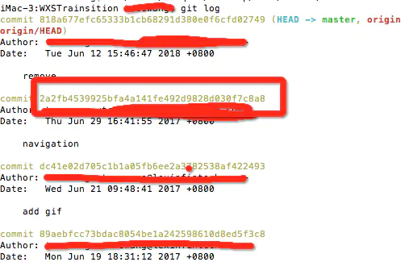
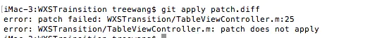
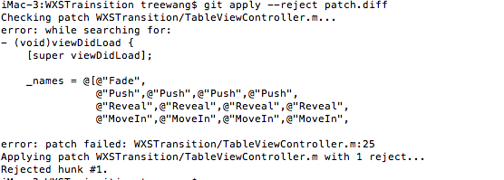

# Git 打补丁-- patch 和 diff 的使用
## 1. patch 和diff 的区别
Git 提供了两种补丁方案：
- 是用git diff生成的UNIX标准补丁.diff文件：.diff文件只是记录文件改变的内容，不带有commit记录信息,多个commit可以合并成一个diff文件。
- git format-patch生成的Git专用.patch 文件：.patch文件带有记录文件改变的内容，也带有commit记录信息,每个commit对应一个patch文件。
## 2. 创建patch和diff
### 2.1 创建patch 文件的常用命令行
- 某次提交（含）之前的几次提交：
  ```
  git format-patch 【commit sha1 id】-n
  ```
  n指从sha1 id对应的commit开始算起n个提交，例如：
  ```
  git format-patch  2a2fb4539925bfa4a141fe492d9828d030f7c8a8 -2
  ```
- 某个提交的patch
  ```
  git format-patch 【commit sha1 id】 -1
  ```
  例如：
  ```
  git format-patch  2a2fb4539925bfa4a141fe492d9828d030f7c8a8 -1
  ```
- 某两次提交之间的所有patch
  ```
  git format-patch 【commit sha1 id】..【commit sha1 id】 
  ```
  例如：
  ```
  git format-patch  2a2fb4539925bfa4a141fe492d9828d030f7c8a8..89aebfcc73bdac8054be1a242598610d8ed5f3c8
  ```
### 2.2 创建diff文件的常用方法
- 使用命令行
  ```
  git diff  【commit sha1 id】 【commit sha1 id】 >  【diff文件名】
  ```
  例如：
  ```
  git diff  2a2fb4539925bfa4a141fe492d9828d030f7c8a8  89aebfcc73bdac8054be1a242598610d8ed5f3c8 > patch.diff
  ```
- 使用SourceTree
#### 2.2.1
- 为未提交的修改生成diff
  ```
  git diff > feature_a.patch
  ```
- 如果有新增的文件，并不在 git 管理之内
  ```
  git diff --cached > feature_a.patch
  ```
- 如果还包含二进制文件，例如图片等
  ```
  git diff --cached --binary > feature_a.patch
  ```
- 应用 patch
  ```
  git apply feature_a.patch
  ```
### 2.3 如何获取commit sha1 id
git 中的每个commit都有对应的一个sha1 id，我们可以通过在终端输入git log，然后找到对应的commit sha1 id:



如图中2a2fb4539925bfa4a141fe492d9828d030f7c8a8便是sha1 id
## 3. 应用patch 和 diff
### 3.1 相关命令行
- 检查patch/diff是否能正常打入:
  ```
  git apply --check 【path/to/xxx.patch】
  git apply --check 【path/to/xxx.diff】
  ```
- 打入patch/diff:
  ```
  git apply 【path/to/xxx.patch】
  git apply 【path/to/xxx.diff】
  ```
  或者：
  ```
  git  am 【path/to/xxx.patch】
  ```
### 3.2 使用SourceTree
## 4. 冲突解决
在打补丁过程中有时候会出现冲突的情况，有冲突时会打入失败，如图：



此时需要解决冲突：
1. 首先使用 以下命令行，自动合入 patch 中不冲突的代码改动，同时保留冲突的部分：
   ```
   git  apply --reject  xxxx.patch
   ```
2. 可以在终端中显示出冲突的大致代码：
  

  同时会生成后缀为 .rej 的文件，保存没有合并进去的部分的内容，可以参考这个进行冲突解决。
3. 解决完冲突后删除后缀为 .rej 的文件，并执行git add.添加改动到暂存区
4. 接着执行git am --resolved或者git am --continue

> **说明**：在打入patch冲突时，可以执行git am --skip跳过此次冲突，也可以执行git am --abort回退打入patch的动作，还原到操作前的状态。


## Reference
- [Git 打补丁-- patch 和 diff 的使用（详细）](https://www.jianshu.com/p/ec04de3f95cc)
- [通过 git diff 生成 patch 补丁](https://www.sunzhongwei.com/git-diff-generated-patch-patches)
- [Create a git patch from the uncommitted changes in the current working directory](https://stackoverflow.com/questions/5159185/create-a-git-patch-from-the-uncommitted-changes-in-the-current-working-directory)