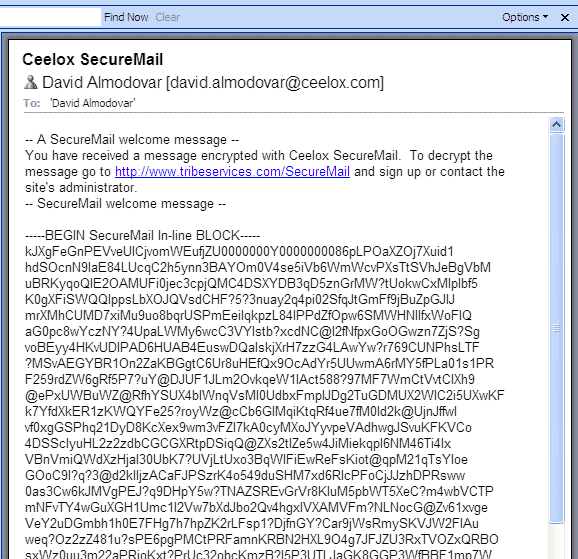

# GPG入门教程
[GnuPG软件](http://www.gnupg.org/)（简称GPG），它是目前最流行、最好用的加密工具之一。
## 一、什么是GPG


要了解什么是GPG，就要先了解[PGP](http://en.wikipedia.org/wiki/Pretty_Good_Privacy)。

1991年，程序员[Phil Zimmermann](http://en.wikipedia.org/wiki/Phil_Zimmermann)为了避开政府监视，开发了加密软件PGP。这个软件非常好用，迅速流传开来，成了许多程序员的必备工具。但是，它是商业软件，不能自由使用。所以，自由软件基金会决定，开发一个PGP的替代品，取名为GnuPG。这就是GPG的由来。

GPG有许多用途，本文主要介绍文件加密。至于邮件的加密，不同的邮件客户端有不同的设置，请参考Ubuntu网站的[介绍](https://help.ubuntu.com/community/GnuPrivacyGuardHowto#Reading_OpenPGP_E-mail)。

本文的使用环境为Linux命令行。如果掌握了命令行，[Windows](http://gpg4win.org/) 或 [Mac OS](https://gpgtools.org/) 客户端，就非常容易掌握。GPG并不难学，学会了它，从此就能轻松传递加密信息。建议读者一步步跟着教程做，对每条命令都自行测试。


## 二、安装
GPG有两种安装方式。可以下载[源码](http://www.gnupg.org/download/index.en.html)，自己编译安装。
```
./configure
make
make install
```
也可以安装编译好的二进制包。
```
# Debian / Ubuntu 环境
sudo apt-get install gnupg

# Fedora 环境
yum install gnupg
```
安装完成后，键入下面的命令：
```
gpg --help
```
如果屏幕显示GPG的帮助，就表示安装成功。
## 三、生成密钥
安装成功后，使用gen-ken参数生成自己的密钥：
```
gpg --gen-key
```
回车以后，会跳出一大段文字：
```
wangbb@c005mkkbjde03:~> gpg --gen-key
gpg (GnuPG) 2.0.22; Copyright (C) 2013 Free Software Foundation, Inc.
This is free software: you are free to change and redistribute it.
There is NO WARRANTY, to the extent permitted by law.

Please select what kind of key you want:
   (1) RSA and RSA (default)
   (2) DSA and Elgamal
   (3) DSA (sign only)
   (4) RSA (sign only)
Your selection?
```
第一段是版权声明，然后让用户自己选择加密算法。默认选择第一个选项，表示加密和签名都使用RSA算法。

然后，系统就会问你密钥的长度：
```
RSA keys may be between 1024 and 4096 bits long.
What keysize do you want? (2048)
```
密钥越长越安全，默认是2048位。

接着，设定密钥的有效期：
```
Please specify how long the key should be valid.
         0 = key does not expire
      <n>  = key expires in n days
      <n>w = key expires in n weeks
      <n>m = key expires in n months
      <n>y = key expires in n years
Key is valid for? (0)
```
如果密钥只是个人使用，并且你很确定可以有效保管私钥，建议选择第一个选项，即永不过期。回答完上面三个问题以后，系统让你确认：
```
Is this correct? (y/N)
```
输入y，系统就要求你提供个人信息：
```
GnuPG needs to construct a user ID to identify your key.

Real name: Bingbing Wang
Email address: wbb1975@sina.com
Comment: My personal key
You selected this USER-ID:
    "Bingbing Wang (My personal key) <wbb1975@sina.com>"
```
"真实姓名"填入你姓名的英文写法，"电子邮件地址"填入你的邮件地址，"注释"这一栏可以空着。

然后，你的"用户ID"生成了。
```
您选定了这个用户标识：
　　　"Ruan YiFeng <yifeng.ruan@gmail.com>"
```
我的"真实姓名"是Ruan YiFeng，"电子邮件地址"是yifeng.ruan@gmail.com，所以我的"用户ID"就是"Ruan YiFeng <yifeng.ruan@gmail.com>"。系统会让你最后确认一次。
```
Change (N)ame, (C)omment, (E)mail or (O)kay/(Q)uit? O
```
输入O表示"确定"。

接着，系统会让你设定一个私钥的密码。这是为了防止误操作，或者系统被侵入时有人擅自动用私钥。
```
You need a Passphrase to protect your secret key.
```
然后，系统就开始生成密钥了，这时会要求你做一些随机的举动，以生成一个随机数。
> 我们需要生成大量的随机字节。这个时候您可以多做些琐事(像是敲打键盘、移动鼠标、读写硬盘之类的)，这会让随机数字发生器有更好的机会获得足够的熵数。

几分钟以后，系统提示密钥已经生成了：
```
We need to generate a lot of random bytes. It is a good idea to perform
some other action (type on the keyboard, move the mouse, utilize the
disks) during the prime generation; this gives the random number
generator a better chance to gain enough entropy.
We need to generate a lot of random bytes. It is a good idea to perform
some other action (type on the keyboard, move the mouse, utilize the
disks) during the prime generation; this gives the random number
generator a better chance to gain enough entropy.
gpg: key A09BA24C marked as ultimately trusted
public and secret key created and signed.

gpg: checking the trustdb
gpg: 3 marginal(s) needed, 1 complete(s) needed, PGP trust model
gpg: depth: 0  valid:   1  signed:   0  trust: 0-, 0q, 0n, 0m, 0f, 1u
pub   2048R/A09BA24C 2020-11-14
      Key fingerprint = 3CDA 1853 55D3 70A3 F8D8  18F8 77D2 6A22 A09B A24C
uid                  Bingbing Wang <wbb1975@sina.com>
sub   2048R/CB7D8316 2020-11-14
```
请注意上面的字符串"A09BA24C"，这是"用户ID"的Hash字符串，可以用来替代"用户ID"。

这时，最好再生成一张"撤销证书"，以备以后密钥作废时，可以请求外部的公钥服务器撤销你的公钥：
```
wangbb@c005mkkbjde03:~> gpg --gen-revoke "Bingbing Wang"

sec  2048R/A09BA24C 2020-11-14 Bingbing Wang <wbb1975@sina.com>

Create a revocation certificate for this key? (y/N) y
Please select the reason for the revocation:
  0 = No reason specified
  1 = Key has been compromised
  2 = Key is superseded
  3 = Key is no longer used
  Q = Cancel
(Probably you want to select 1 here)
Your decision? 1
Enter an optional description; end it with an empty line:
> in case one day I want to revoke it
>
Reason for revocation: Key has been compromised
in case one day I want to revoke it
Is this okay? (y/N) y

You need a passphrase to unlock the secret key for
user: "Bingbing Wang <wbb1975@sina.com>"
2048-bit RSA key, ID A09BA24C, created 2020-11-14

gpg: Invalid passphrase; please try again ...

You need a passphrase to unlock the secret key for
user: "Bingbing Wang <wbb1975@sina.com>"
2048-bit RSA key, ID A09BA24C, created 2020-11-14

ASCII armored output forced.
Revocation certificate created.

Please move it to a medium which you can hide away; if Mallory gets
access to this certificate he can use it to make your key unusable.
It is smart to print this certificate and store it away, just in case
your media become unreadable.  But have some caution:  The print system of
your machine might store the data and make it available to others!
```
上面的"用户ID"部分，可以填入你的邮件地址或者Hash字符串（以下同）。
## 四、密钥管理
### 4.1 列出密钥
list-keys参数列出系统中已有的密钥：
```
gpg --list-keys
```
显示结果如下：
```wangbb@c005mkkbjde03:~> gpg --list-keys
/data/wangbb/.gnupg/pubring.gpg
-------------------------------
pub   2048R/A09BA24C 2020-11-14
uid                  Bingbing Wang <wbb1975@sina.com>
sub   2048R/CB7D8316 2020-11-14
```
第一行显示公钥文件名（pubring.gpg），第二行显示公钥特征（2048位，Hash字符串和生成时间），第三行显示"用户ID"，第四行显示私钥特征。

如果你要从密钥列表中删除某个密钥，可以使用delete-key参数：
```
gpg --delete-key [用户ID]
```
### 4.2 输出密钥
公钥文件（.gnupg/pubring.gpg）以二进制形式储存，armor参数可以将其转换为ASCII码显示：
```
gpg --armor --output public-key.txt --export [用户ID]
```
"用户ID"指定哪个用户的公钥，output参数指定输出文件名（public-key.txt）。

类似地，export-secret-keys参数可以转换私钥：
```
gpg --armor --output secretkey.txt --export-secret-keys CB7D8316
```
### 4.3 上传公钥
公钥服务器是网络上专门储存用户公钥的服务器。send-keys参数可以将公钥上传到服务器：
```
gpg --keyserver hkp://subkeys.pgp.net --send-keys A09BA24C
```
使用上面的命令，你的公钥就被传到了服务器subkeys.pgp.net，然后通过交换机制，所有的公钥服务器最终都会包含你的公钥。

由于公钥服务器没有检查机制，任何人都可以用你的名义上传公钥，所以没有办法保证服务器上的公钥的可靠性。通常，你可以在网站上公布一个公钥指纹，让其他人核对下载到的公钥是否为真。fingerprint参数生成公钥指纹。
```
gpg --fingerprint [用户ID]
```
### 4.4 输入密钥
除了生成自己的密钥，还需要将他人的公钥或者你的其他密钥输入系统。这时可以使用import参数：
```
gpg --import [密钥文件]
```
为了获得他人的公钥，可以让对方直接发给你，或者到公钥服务器上寻找。
```
gpg --keyserver hkp://subkeys.pgp.net --search-keys [用户ID]
```
正如前面提到的，我们无法保证服务器上的公钥是否可靠，下载后还需要用其他机制验证。
## 五、加密和解密
### 5.1 加密
假定有一个文本文件demo.txt，怎样对它加密呢？

encrypt参数用于加密：
```
gpg --recipient [用户ID] --output demo.en.txt --encrypt demo.txt
```
recipient参数指定接收者的公钥，output参数指定加密后的文件名，encrypt参数指定源文件。运行上面的命令后，demo.en.txt就是已加密的文件，可以把它发给对方。
### 5.2 解密
对方收到加密文件以后，就用自己的私钥解密：
```
gpg --decrypt demo.en.txt --output demo.de.txt
```
decrypt参数指定需要解密的文件，output参数指定解密后生成的文件。运行上面的命令，demo.de.txt就是解密后的文件。

GPG允许省略decrypt参数：
```
gpg demo.en.txt
```
运行上面的命令以后，解密后的文件内容直接显示在标准输出。
## 六、签名
### 6.1 对文件签名
有时，我们不需要加密文件，只需要对文件签名，表示这个文件确实是我本人发出的。sign参数用来签名：
```
gpg --sign application.conf
```
运行上面的命令后，当前目录下生成application.conf.gpg文件，这就是签名后的文件。这个文件默认采用二进制储存，如果想生成ASCII码的签名文件，可以使用clearsign参数：
```
gpg --clearsign application.conf
```
运行上面的命令后 ，当前目录下生成application.conf.asc文件，后缀名asc表示该文件是ASCII码形式的。

如果想生成单独的签名文件，与文件内容分开存放，可以使用detach-sign参数：
```
gpg --detach-sign application.conf
```
运行上面的命令后，当前目录下生成一个单独的签名文件application.conf.sig。该文件是二进制形式的，如果想采用ASCII码形式，要加上armor参数：
```
gpg --armor --detach-sign application.conf
```
运行上面的命令后 ，当前目录下生成application.conf.asc文件，后缀名asc表示该文件是ASCII码形式的，而且只包含文件签名。
### 6.2 签名+加密
上一节的参数，都是只签名不加密。如果想同时签名和加密，可以使用下面的命令：
```
gpg --local-user [发信者ID] --recipient [接收者ID] --armor --sign --encrypt application.conf
```
local-user参数指定用发信者的私钥签名，recipient参数指定用接收者的公钥加密，armor参数表示采用ASCII码形式显示，sign参数表示需要签名，encrypt参数表示指定源文件。
### 6.3 验证签名
我们收到别人签名后的文件，需要用对方的公钥验证签名是否为真。verify参数用来验证：
```
gpg --verify demo.txt.asc demo.txt
```
举例来说，[openvpn网站](http://openvpn.net/index.php/open-source/downloads.html)就提供每一个下载包的gpg签名文件。你可以根据它的[说明](http://openvpn.net/index.php/open-source/documentation/sig.html)，验证这些下载包是否为真。

## Reference
- [GPG入门教程](http://www.ruanyifeng.com/blog/2013/07/gpg.html)
- [GPG Quick Start](http://www.madboa.com/geek/gpg-quickstart/): Paul Heinlein
- [GnuPrivacyGuardHowto](https://help.ubuntu.com/community/GnuPrivacyGuardHowto): Ubuntu help
- [GnuPG Tutorial](http://www.bitflop.com/document/129): by KNL
- [GPG Tutorial](http://futureboy.us/pgp.html): by Alan Eliasen
- [GnuPG 袖珍 HOWTO (中文版)](http://www.gnupg.org/howtos/zh/index.html)
- [The GNU Privacy Handbook](http://www.gnupg.org/gph/en/manual.html)