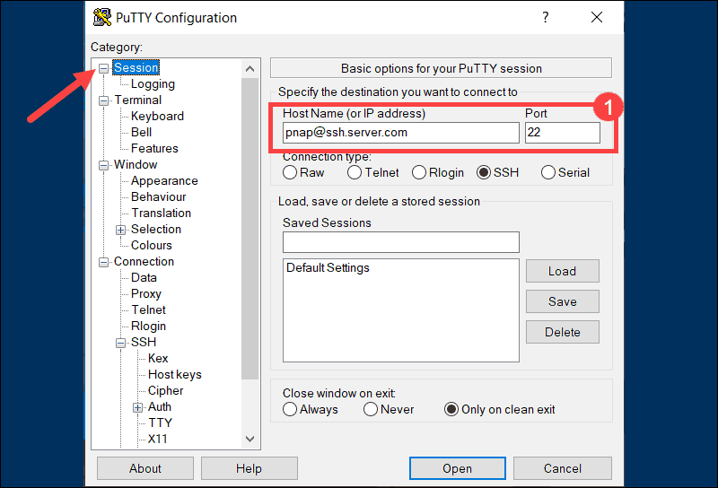
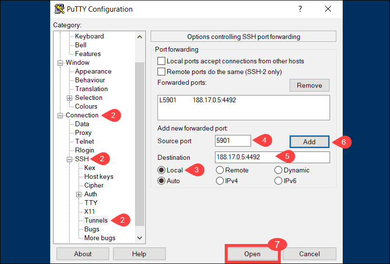
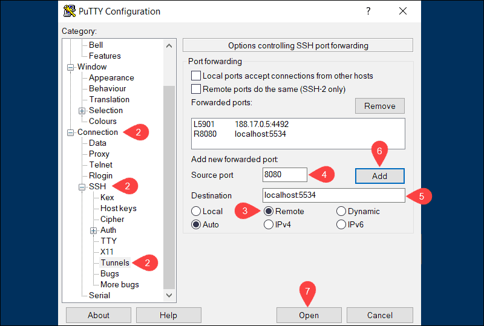
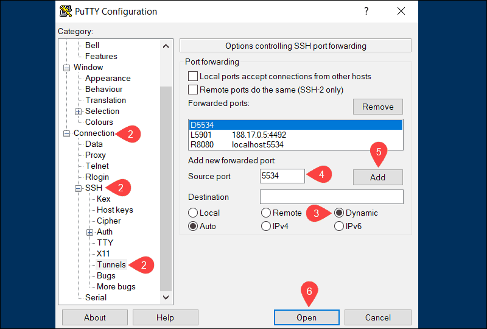

## 如何使用 SSH 端口转发
### 0. 介绍
SSH 端口转发常被称为 SSH 隧道，两个术语可以无缝交换使用。

加密的 SSH 隧道用作传送混杂在一起的各种数据的通道，并把它第送到远端系统。这种方法常用于绕过防火墙安全协议。端口转发是大多数 SSH 客户端和服务器端应用的一个组件。

可查询相关文档如 [OpenSSH for Linux](https://phoenixnap.com/kb/openssl-tutorial-ssl-certificates-private-keys-csrs)，[Windows Putty Client](https://phoenixnap.com/kb/install-putty-on-windows)，了解关于如何启用本地，远程，动态 SSH 端口转发。
**先决条件**
- 一个你选择的 SSH 客户端及服务器（OpenSSH 或 PuTTY）
- 一个可达的远程或本地服务器IP地址或域名
- 如果你在使用 OpenSSH 服务器，请用文本编辑器打开 `/etc/ssh/sshd_config`。如果你发现 `AllowTcpForwarding` 被设置为 `No`， 将其改为 `Yes`。另外，如果你打算使用远程端口转发，你必须得将 `GatewayPorts` 设置为 `Yes`。然后你需要重启服务器以让修改生效。
### 1. 如何使用本地端口转发（How to Use Local Port Forwarding）
宝贵的网络资源一般不允许远程 SSH 访问。在现代分布式环境中这是一个服务器限制。企业通常通常设置一个中间 “跳转” 服务器来接受 SSH 远程连接，以此来解决这个问题。

你的本地 SSH 客户端与[远程 SSH 服务器](https://phoenixnap.com/kb/ssh-to-connect-to-remote-server-linux-or-windows)建立连接。这个连接IE下来被转发到可信内部网络里的资源。[SSH 连接建立]https://phoenixnap.com/kb/how-does-ssh-work之后，安全问题可以集中于中间 SSH 服务器而非网络内的单个资源。
#### 1.1 利用 OpenSSH 进行本地端口转发
为了在 Linux 上使用 SSH 隧道，你需要给你的客户提供源/目标端口号以及目标服务器地址。位置标书可以是 IP 地址或主机名。

本地端口转发命令的基本语法非常直接：
```
ssh -L local_port:destination_server_ip:remote_port ssh_server_hostname
```
- **ssh** - 在本机上启动 SSH 客户端程序并简历到远程 SSH 服务器的安全连接
- **-L local_port:destination_server_ip:remote_port** - 本地客户端的本地端口被转发到目标远程服务器的端口
- **ssh_server_hostname** – 该语法元素代表远程 SSH 服务器的主机名或 IP 地址

SSH 端口转发命令的一个实际例子如下：
```
ssh –L 5901:188.17.0.5:4492 pnap@ssh.server.com
```
在上面的例子中，所有发往本地主机 5901 端口的流量被转发到远程服务器 188.17.0.5 的 4492 端口。
#### 1.2 利用 Putty 进行本地端口转发
PuTTY 是 Windows 平台一个用户友好的 SSH 客户端，可以遵循下面的步骤来配置本地端口转发：
1. 当你启动 PuTTY 时，**Sessions** 窗口让你指定目标 SSH 服务器的主机名或 IP 地址以及端口号（例如 `pnap@ssh.server.com` 以及端口号 `22`）。
   
2. 从左边 **Category** 列表中导航到 **Connection > SSH > Tunnels**.
3. 选择 **Local** 来指定 SSH 端口转发的类型
    
4. 在 **Source port** 字段中输入你的本地端口号
5. 在 **Destination** 字段中输入远程地址和端口号。使用下面的格式：**destination_server_ip:remote_port**，例如：`Source port: 5901, Destination: 188.17.0.5:4492`
6. 一旦你已经验证了你输入的信息是正确的，点击 **Add**。
7. 到现在为止连接的所有参数都已经设置完毕。点击 Open 以开启本地端口转发。 
> **注意**：如果你是 Ubuntu 用户，请参考我们的教程[如何在 Ubuntu 上安装 putty](https://phoenixnap.com/kb/how-to-install-putty-on-ubuntu)。
### 2. 如何使用远程端口转发（How to Use Remote Port Forwarding）
远程端口转发的目的是为了让远程服务器访问你的本地机器上的资源。

远程端口转发是我们探讨过的本地端口转发的反向操作。
#### 2.1 利用 OpenSSH 进行远程端口转发
**远程端口转发**命令的基本语法非常直接：
```
ssh -R remote_port:localhost:local_port ssh_server_hostname
```
在这个例子中，我们引入了远程服务器 ssh.server.com 来转发任何到达其 8080 端口上的流量到本地在端口 5534 监听的资源上。
```
ssh –R 8080:localhost:5534 pnap@ssh.server.com
```
能够访问 SSH 服务器的用户现在能够访问你的本地机器上的资源。
#### 2.2 利用 Putty 进行远程端口转发
1. 当你启动 PuTTY 时，**Sessions** 窗口让你指定目标 SSH 服务器的主机名或 IP 地址以及端口号（例如 `pnap@ssh.server.com` 以及端口号 `22`）。
   
2. 从左边 **Category** 列表中导航到 **Connection > SSH > Tunnels**.
3. 选择 **Remote** 来指定 SSH 端口转发的类型
    
4. 在 **Source port** 字段中输入你的远程端口号
5. 在 **Destination** 字段中输入目标地址和端口号。使用下面的格式：**localhost:local_port**（例如 localhost:5534）
6. 一旦你已经验证了你输入的信息是正确的，点击 **Add**。
7. 到现在为止连接的所有参数都已经设置完毕。点击 Open 以开启远程端口转发。 

在上面的例子中，用户及应用能够连接到远程 SSH 服务器的 `8080`，并被转发到本地机器的 `5534` 端口。
### 3. 如何使用动态端口转发(How To Use Dynamic Port Forwarding)
动态端口转发并不像前两种常见，大多数用户发现使用本地端口转发可以取得同样的效果。由于你不需要使用预定义的远程端口和服务器，动态端口转发可以提供更多的灵活性。
> **注意**：当使用动态端口转发时，有必要配置你的应用以使用 SOCKS 代理服务器。
#### 3.1 利用 OpenSSH 进行动态端口转发
通过适应 ssh 命令集 -D 命令行参数，你可以使用你的 ssh 客户端来在本地创建一个 SOCKS 代理：
```
ssh –D local_port ssh_server_hostname
```
下面的命令在你的本机 5534 端口上打开了一个 SOCKS 代理：
```
ssh –D 5534 pnap@ssh.server.com
```
你现在可以配置一个本地资源，比如浏览器，来使用端口 5534。所用从这个资源来的流量被重定向到基于这个预定义端口建立的 SSH 连接。
#### 3.2 利用 Putty 进行动态端口转发
1. 当你启动 PuTTY 时，**Sessions** 窗口让你指定目标 SSH 服务器的主机名或 IP 地址以及端口号（例如 `pnap@ssh.server.com` 以及端口号 `22`）。
   
2. 从左边 **Category** 列表中导航到 **Connection > SSH > Tunnels**.
3. 选择 **Dynamic** 来指定 SSH 端口转发的类型
    
4. 在 **Source port** 字段中输入你的动态端口号（例如5534），在你的本地机器上的 SOCKS 代理服务器将使用这个端口来动态转发流量。
5. 一旦你已经验证了你输入的信息是正确的，点击 **Add**。
7. 到现在为止连接的所有参数都已经设置完毕。点击 Open 以开启动态端口转发。
> 为了动态转发正常工作，你需要为你的 SOCKS 代理服务器配置并启用每个应用。
### 4. 结论
这个教程谈到了三种不同的端口转发，你需要使用的命令，以及如何在你的系统上实现他们。

SSH 端口转发是很强大的功能，它需要仔细的管理，整个过程都需要[高安全标准](https://phoenixnap.com/blog/data-center-security-auditing-standards)的维护。
### 5. 实践
#### 5.1 转发的参数
- -C 压缩数据
- -f 后台验证用户/密码，通常和-N连用，不用登陆到远程主机
- -N 不执行脚本和命令，通常与-f连用
- -g 在-L，-R或-D参数中，允许远程主机连接到建立的转发的端口，如果不加这个参数，只允许本地主机建立连接
- -L 本地端口:目标IP:目标端口
- -D 动态端口转发
- -R 远程端口转发
- -T 不分配 TTY， 只做代理使用
- -q 安静模式，不输出错误/警告信息
#### 5.2 本地转发
从本地网络服务器的某个端口，转发到远程服务器的某个端口。说白了就是，将发送到本地端口的请求，转发到目标端口。格式如下：
```
ssh -L 本地网卡地址:本地端口:目标地址:目标端口 用户@SSH服务器地址

ssh -L [LOCAL_IP:]LOCAL_PORT:DESTINATION:DESTINATION_PORT [USER@]SSH_SERVER
```
#### 5.3 远程转发

## Reference
- [How to Use SSH Port Forwarding](https://phoenixnap.com/kb/ssh-port-forwarding)
- [How to Set up SSH Tunneling (Port Forwarding)](https://linuxize.com/post/how-to-setup-ssh-tunneling/)
- [A Guide to SSH Port Forwarding/Tunnelling](https://www.booleanworld.com/guide-ssh-port-forwarding-tunnelling/)
