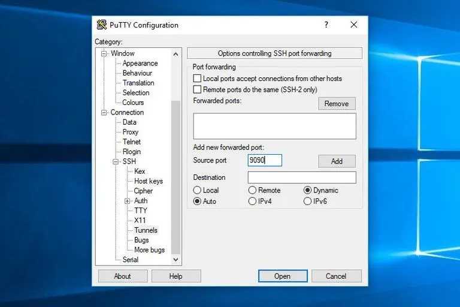

# 如何设置 SSH 隧道（端口映射）
SSH 隧道或 SSH 端口映射是一种在客户和服务器机器建立加密 SSH 连接的方法，通过它服务端口可以被中继。

SSH 隧道对于使用非加密协议如 VNC 或 [FTP](https://linuxize.com/post/how-to-use-linux-ftp-command-to-transfer-files/) 传输网络数据的服务，访问地理受限的内容，或者绕开中间防火墙都是有用的。基本上，你可以转发任何 TCP 流量并通过一个安全的 SSH 连接隧道化传输。

有三种类型的 SSH 端口转发：
- 本地端口转发：转发一个到客户端的连接到 SSH 服务器主机并接下来到达目标主机端口
- 远程端口转发：转发到达服务器主机端口的流量到客户端主机并最终到达目标主机
- 动态端口转发：创建一个 SOCKS 代理服务器允许一定范围的端口互相通讯

本文将介绍如何设置本地，远程以及动态加密 SSH 隧道。
## 本地端口转发（Local Port Forwarding）
本地端口转发允许你转发本地主机（ssh 客户端）上的一个端口到远程（ssh 服务器）机器上的一个端口，然后转发到目标主机上的一个端口。

在这种转发类型中，`SSH` 客户端在一个给定端口上监听，并对通过该端口至远程 SSH 服务器的特定端口的任何连接做隧道化处理，该连接接下来被转发至目标机器的一个端口。

本地端口转发主要用于连接内部网络的一个远程服务，比如一个数据库服务器或一个 VNC 服务器。

在Linux， macOS 或者其它 Unix 系统中，为了创建一个本地端口转发，向 ssh 客户端传递 `-L` 选项。
```
ssh -L [LOCAL_IP:]LOCAL_PORT:DESTINATION:DESTINATION_PORT [USER@]SSH_SERVER
```
用到的选项如下：
- `[LOCAL_IP:]LOCAL_PORT`：本地机器 IP 和端口号。当本地机器 IP 不指定时，ssh 客户端绑定至 `localhost`。
- `DESTINATION:DESTINATION_PORT`：目标机器的主机名或 IP 地址以及端口号
- `[USER@]SERVER_IP`：远程 SSH 用户名以及服务器 IP 地址

你可以使用任何大于1024的端口作为 `LOCAL_PORT`。小于 `1024` 的端口是特权端口且只能被 root 使用。如果你的 SSH 服务器在一个[非 22 的端口](https://linuxize.com/post/how-to-change-ssh-port-in-linux/)上监听，使用 `-p [PORT_NUMBER]` 选项。

目标主机名 必须可从 SSH 服务器解析。

我们假设你有一个 MySQL 数据库服务器运行在内部（私有）网络的 db001.host:3306，它可以从机器 pub001.host 上访问，并且你期待使用你的本机 MySQL 客户端连接到该数据库服务器。为了实现这个，你可以使用下面的命令转发连接：
```
ssh -L 3336:db001.host:3306 user@pub001.host
```
一旦你运行上面的命令，你将被提示输入远程 SSH 用户密码。一旦输入，你就会登陆进远程服务器，SSH 隧道将会被建立。[建立一个基于密钥的 SSH 认证](https://linuxize.com/post/how-to-setup-passwordless-ssh-login/)是个很好的主意，可以登录进远程服务器而无需输入密码。

现在，如果你将你的本机数据库客户端连接到 `127.0.0.1:3336`，连接将会通过作为中间服务器的 `pub001.host` 转发到 `db001.host:3306` 数据库服务器。

你可以在一条 SSH 命令转发多个端口到多个目标。例如，你有第二个 MySQL 数据库服务器运行在机器 db002.host，而你想从你的本地客户连接到两个数据库服务器，你可以运行：
```
ssh -L 3336:db001.host:3306 3337:db002.host:3306 user@pub001.host
```
为了连接第二个服务器，你应该使用 `127.0.0.1:3337`。

当目标主机与 SSH 服务器相同时，你可以使用 localhost 而无需指定目标 IP 或主机。

如果你需要通过 `VNC` 来连接一个远程服务器，该 `VNC` 运行在同一个机器上，并且它不能从外部访问，那么你可以使用下面的命令：
```
ssh -L 5901:127.0.0.1:5901 -N -f user@remote.host
```
`-f` 选项告诉 `ssh` 命令在后台运行，`-N` 不执行远程命令。我们使用 `localhost` 是因为 `VNC` 和 `SSH` 服务器运行于同i太服务器上。

如果你在设置 `SSH` 隧道中遇到问题，检查你的远程 `SSH` 服务器配置并确保 `AllowTcpForwarding` 不被设置为 `no`。默认地，转发是允许的。
## 远程端口转发（Remote Port Forwarding）
远程端口转发是本地端口转发的反向操作。允许你转发远程 ssh 服务器上的一个端口到本地（ssh 客户端）机器上的一个端口，然后转发到目标主机上的一个端口。

在这种转发类型中，`SSH` 服务器在一个给定端口上监听，并对通过该端口至本地 SSH 客户端的特定端口的任何连接做隧道化处理，该连接接下来被转发至目标机器的一个端口。

在Linux， macOS 或者其它 Unix 系统中，为了创建一个远程端口转发，向 ssh 客户端传递 `-R` 选项。
```
ssh -R [REMOTE:]REMOTE_PORT:DESTINATION:DESTINATION_PORT [USER@]SSH_SERVER
```
用到的选项如下：
- `[REMOTE:]REMOTE_PORT`：远程 SSH 服务器 IP 和端口号。任意空 `REMOTE` 意味着 远程 SSH 绑定到任意接口。
- `DESTINATION:DESTINATION_PORT`：目标机器的主机名或 IP 地址以及端口号
- `[USER@]SERVER_IP`：远程 SSH 用户名以及服务器 IP 地址

远程端口转发主要用于授予外部人员访问内部服务的权限。

我们假设你在你的本地机器上开发一个 Web 服务，然后你想向让你的开发小伙伴们预先展示一下。你没有公共 IP，因此其他的开发者无法通过 Internet 访问它。

如果你有远程 SSH 服务器的访问权限，你可以使用下面的命令设置远程转发端口转发：
```
ssh -R 8080:127.0.0.1:3000 -N -f user@remote.host
```
上面的命令行将使得 ssh 服务器在 `8080` 端口上监听，并隧道化所有到该端口的流量到你本地机器上的 `3000` 端口。

现在，你的开发者小伙伴们可以在浏览器输入 `the_ssh_server_ip:8080` 来预览你那令人惊叹的应用了。

如果你在设置远程端口转发中遇到问题，检查你的远程 `SSH` 服务器配置并确保 `GatewayPorts` 被设置为 `yes `。
## 动态端口转发（Dynamic Port Forwarding）
动态端口转发允许你在本机（(ssh 客户端）创建一个 socket，它将充当一个 SOCKS 代理服务器。当客户连接到这个端口，连接将被转发到远程机器（ssh 服务器），它接下来转发到目标主机上的一个动态端口。

这种方式下，所有使用 SOCKS 代理的应用都会连接到 SSH 服务器，该服务器将转发所有流量到实际目标（机器）。

在Linux， macOS 或者其它 Unix 系统中，为了创建一个动态端口转发（SOCKS），向 ssh 客户端传递 `-D` 选项。
```
ssh -D [LOCAL_IP:]LOCAL_PORT [USER@]SSH_SERVER
```
用到的选项如下：
- `[LOCAL_IP:]LOCAL_PORT`：本地机器的 IP 和端口号。当不指定 `LOCAL_IP` 时，ssh 客户端绑定到 `localhost`。
- `[USER@]SERVER_IP`：远程 SSH 用户名以及服务器 IP 地址

一个典型动态端口转发的例子是通过一个 SSH 服务器隧道化 Web 浏览器的流量。

下面的命令将在端口 `9099` 上创建 SOCKS 隧道：
```
ssh -D 9090 -N -f user@remote.host
```
隧道一旦建立，你可以配置你的应用来使用它。这篇[文章](https://linuxize.com/post/how-to-setup-ssh-socks-tunnel-for-private-browsing/)解释了如何配置 Firefox 和 Google Chrome 浏览器来使用 SOCKS 代理。

对于每个需要隧道化其流量的应用，端口转发都需要为其单独单独配置。
## 在 Windows 上设置 SSH 隧道
Windows 用户可以使用 PuTTY SSH 客户端来创建 SSH 隧道。你可以从[这里](https://www.chiark.greenend.org.uk/~sgtatham/putty/latest.html)下载 PuTTY 。
1. 启动 Putty 并在 `Host name (or IP address)` 字段中输入 SSH 服务器 IP：
   
2. 在 `Connection` 菜单下，展开 `SSH` 并选中 `Tunnel`s。点选 `Local` 按钮 设置本地端口转发，`Remote` 用于远程端口转发，`Dynamic` 用于动态端口转发。
   + 当设置本地端口转发时，在 `Source Port` 字段中输入本地转发端口，在 `Destination` 中输入目标主机或 IP，例如 `localhost:5901`
   + 当设置远程端口转发时，在 `Source Port` 字段中输入 SSH 服务器转发端口，在 `Destination` 中输入目标主机或 IP，例如 `localhost:3000`
   + 当设置动态端口转发时，仅仅需要在 `Source Port` 字段中输入本地 SOCKS 端口

   
3. 点击 `Add` 按钮，如下图所示：
   
4. 回到 `Session` 页面以保存设置，如此你无需每次启动时重新你输入它们。在 `Saved Session` 字段中输入会话名，并点击 `Save` 按钮。
   
5. 选中保存的回话，通过点击 `Open` 按钮以登陆到远程服务器：
   

一个新的窗口将会出现并要求你输入用户名和密码。一旦你输入用户名和密码，你就会登陆进你的服务器，SSH 隧道将会启用。

设置[公钥认证](https://linuxize.com/post/generate-ssh-keys-on-windows-with-puttygen/)可以允许你无需输入密码就可以登陆进你的服务器。

## 结论
我们已经向你展示了如何设置 SSH 隧道并通过一个安全的 SSH 连接转发流量。为方便使用，你可以在 [SSH 配置文件](https://linuxize.com/post/using-the-ssh-config-file/)中定义 SSH 隧道，或者创建一个 [Bash 别名](https://linuxize.com/post/how-to-create-bash-aliases/)来设置 SSH 隧道。

## Reference
- [How to Set up SSH Tunneling (Port Forwarding)](https://linuxize.com/post/how-to-setup-ssh-tunneling/)