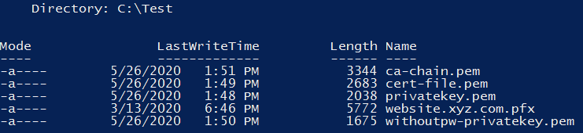

# How to import PFX-formatted certificates into AWS Certificate Manager using OpenSSL
在本文中，我将向你展示如何利用OpenSSL将PFX格式的证书导入到[AWS Certificate Manager (ACM)](http://aws.amazon.com/acm) 中。

安全套接字层（Secure Sockets Layer）和传输层安全Transport Layer Security (SSL/TLS)证书是小型数据文件，它数字的把一对加密密钥与一个机构的细节绑定。密钥对（ key pair）用于安全网络通讯，为互联网和私有网络上的网站建立标识。证书通常由信任证书颁发机构（CA）颁发，一个CA像一个受信任的第三方那样运作--被证书所有者和证书的依赖方共同信任。这些证书的格式由 [X.509](https://en.wikipedia.org/wiki/X.509)或 [Europay, Mastercard, and Visa (EMV)](https://en.wikipedia.org/wiki/EMV#EMV_certificates) 标准指定。 由受信证书颁发机构发布的证书通常用个人信息交换（Personal Information Exchange (PFX)） 或个人强化邮件（Privacy-Enhanced Mail (PEM)）格式编码。

[ACM](https://aws.amazon.com/certificate-manager/)让你很容易地规定，管理，部署公共或私有`SSL/TLS`证书用于 [Amazon Web Services (AWS)](http://aws.amazon.com/) 和你内部连接的资源。证书可以从AWS外部导入，或使用AWS工具创建。证书可被用于与ACM集成的AWS资源，例如[弹性负载均衡](http://aws.amazon.com/elasticloadbalancing)， [Amazon CloudFront](http://aws.amazon.com/cloudfront)分发，以及[Amazon API Gateway](https://aws.amazon.com/api-gateway)。

为了向ACM导入一个自签名的 SSL/TLS证书，你必须利用PEM格式提供证书及其私钥。为了导入一个签名证书，你必须以PEM格式包含证书链。[导入签署的前提条件](https://docs.aws.amazon.com/acm/latest/userguide/import-certificate-prerequisites.html)提供了更多细节。

有时候，受信证书颁发机构以PFX格式颁发证书，私钥，证书链细节。在本文中，我们将展示如何将PFX编码式的证书转化为PEM格式并将其导入到ACM中。
## 解决方案
下面的解决方案使用[OpenSSL](https://www.openssl.org/)命令行工具将PFX编码的证书转化为PEM格式。证书然后被导入到ACM中。


图1：使用OpenSSL工具将PFX编码的证书转化为PEM格式。证书然后被导入到ACM

该方案由两部分，如前图所示：
1. 使用OpenSSL工具将PFX编码的证书转化为PEM格式
2. 将证书导入到ACM中
## 前提
我们使用OpenSSL工具将PFX编码的证书转化为PEM格式。OpenSSL是一个操作加密文件的开源工具集，它也是一个通用加密库。

在本文中，我们使用密码保护的PFX编码文件--website.xyz.com.pfx--使用一个X.509标准的CA签名的证书，带有2048-位RSA私钥数据，
1. 下载并安装OpenSSL工具箱
   - 如果你在使用Linux，从[OpenSSL Downloads](https://www.openssl.org/source/)下载并安装最新tar文件
   - 如果你在使用Windows，从[Shining Light Productions](http://slproweb.com/products/Win32OpenSSL.html)下载。
2. 将OpenSSL二进制路径添加到你的系统PATH变量，如此这些二进制文件可在命令行下使用。
## 将PFX编码的证书转化为PEM格式
运行下名的命令将PFX编码的SSL证书转化为PEM格式。这个过程需要一个PFX编码的证书以及用于加密它的密钥。

下面的过程PFX编码的签名证书文件转化为PEM格式的证书文件：
- cert-file.pem – 包含该资源对应的SSL/TLS 证书的PEM文件
- withoutpw-privatekey.pem – 包含没有密码保护的证书的私钥的PEM文件
- ca-chain.pem – PEM文件包含CA根证书
### 转换PFX编码证书
1. 使用下面的命令行从PFX 文件中提取证书私钥。如果你的证书用密码加密过，在提示时输入它。命令行产生一个PEM编码的私钥文件名为`privatekey.pem`。当提示输入一个`PEM pass phrase`时，输入一个密码以保护你的私钥文件。
   ```
   openssl pkcs12 -in website.xyz.com.pfx -nocerts -out privatekey.pem
   ```
   

   图2：提示输入PEM pass phrase。
2. 上一步产生一个密码保护的私钥。为了移除密码，运行下面的命令。当提示时，输入上一步的密码，当成功时，你会看到写了`RSA`密钥。
   ```
   openssl rsa -in privatekey.pem -out withoutpw-privatekey.pem
   ```
   

   图3：写入RSA 密钥
3. 使用下面的命令行将证书从PFX 文件中传送到一个PEM文件。这创建了一个PEM编码的证书文件名为`cert-file.pem`。如果成功，你会看你到`MAC verified OK`。
   ```
   openssl pkcs12 -in website.xyz.com.pfx -clcerts -nokeys -out cert-file.pem
   ```
   

   图4：MAC verified OK
4. 最后，使用下面的命令行从PFX 文件中提取证书链。这创建了证书链文件名为`ca-chain.pem`。如果成功，你会看你到`MAC verified OK`。
   ```
   openssl pkcs12 -in website.xyz.com.pfx -cacerts -nokeys -chain -out ca-chain.pem
   ```
   

   图5：MAC verified OK

但前面的所有步骤结束后，PFX编码的签名证书文件被分割，返回三个PEM格式的文件，如下图所示。为了看到一个目录下的文件列表，在Windows下运行`dir`命令，在Linux下运行`ls -l`命令。
- cert-file.pem
- withoutpw-privatekey.pem
- ca-chain.pem



图6：PEM格式文件
## 将PEM 证书导入到ACM
使用ACM console来导入PEM编码的SSL证书。你需要在上节创建的以下PEM文件：SSL证书（`cert-file.pem`），私钥（`withoutpw-privatekey.pem`），CA根证书（`ca-chain.pem`）。
## 证书导入
1. 倒开[ACM console](https://console.aws.amazon.com/acm/home)，如果这是你第一次使用ACM，查找**AWS Certificate Manager**头，并选择**Get started**按钮。
2. 选择**Import a certificate**
3. 加入你在前面步骤创建的证书文件
   + 用一个文本编辑器如Notepad 打开`cert-file.pem`。拷贝从`–BEGIN CERTIFICATE–` 开始到`–END CERTIFICATE–`间的所有行。将它们粘贴到**Certificate body**文本框。
   + 打开`withoutpw-privatekey.pem`。拷贝从`–BEGIN RSA PRIVATE KEY–` 开始到`–END RSA PRIVATE KEY–`间的所有行。将它们粘贴到**Certificate private key**文本框。
   + 对于**Certificate chain**，拷贝和粘贴来自文件`ca-chain.pem`的从`–BEGIN CERTIFICATE–` 开始到`CERTIFICATE–`间的所有行

   
   
   图7：添加文件并导入证书
4. 点击**Next**并为证书添加标签。每个标签包含一个你定义的名值对。标签帮助你管理，识别，组织，查询以及过滤资源
5. 选择**Review and import**
6. Review你的证书信息并点击**Import**
## 结论
在本文中，我们讨论了你如何利用OpenSSL 将PFX编码的SSL/TLS正是导入到ACM中去。你可以将导入的证书文件用于ACM集成的AWS服务。ACM使得为一个网站或AWS上的应用建立SSL/TLS变得容易。ACM 可以替代许多与使用和管理SSL/TLS 证书相关的人工操作过程。ACM 也可以管理更新，它可以帮助你缩短错误配置，撤回，证书过期导致的服务中断时间，你可以从你的证书颁发机构获取并导入新的证书，从未更新并导入你的新证书，或者你可以从ACM申请一个新的证书。

## Reference
- [How to import PFX-formatted certificates into AWS Certificate Manager using OpenSSL](https://aws.amazon.com/blogs/security/how-to-import-pfx-formatted-certificates-into-aws-certificate-manager-using-openssl/)
- [How to use *.pfx certificate for Amazon ELB SSL](https://stackoverflow.com/questions/36156917/how-to-use-pfx-certificate-for-amazon-elb-ssl)
- [SSL证书（SSL Certificates）](https://www.aliyun.com/sswd/1110408-1.html)