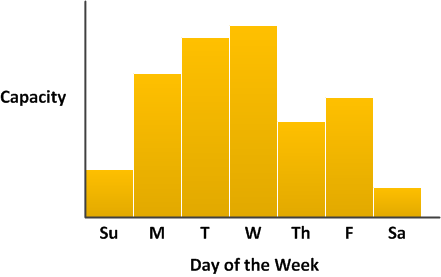
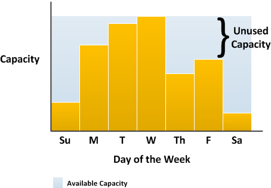
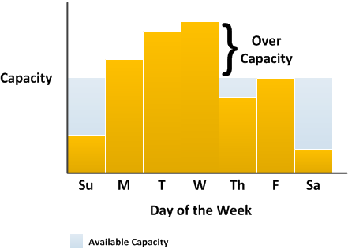
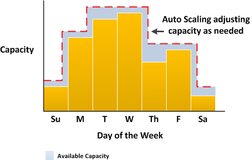
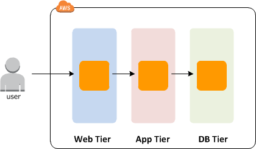
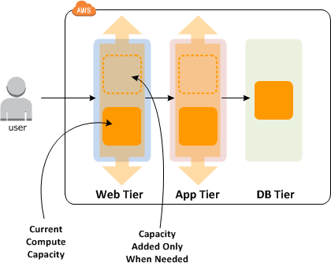
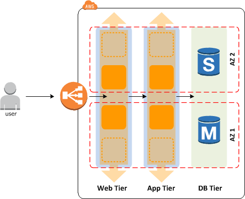

# Amazon EC2 Auto Scaling
## 1. Amazon EC2 Auto Scaling 是什么？
Amazon EC2 Auto Scaling 帮助确保您拥有适量的 Amazon EC2 实例，用于处理您的应用程序负载。您可创建 EC2 实例的集合，称为 Auto Scaling 组。您可以指定各个 Auto Scaling 组中最少的实例数量，Amazon EC2 Auto Scaling 会确保您的组中的实例永远不会低于这个数量。您可以指定各个 Auto Scaling 组中最大的实例数量，Amazon EC2 Auto Scaling 会确保您的组中的实例永远不会超过这个数量。如果您在创建组的时候或在创建组之后的任何时候指定了所需容量，Amazon EC2 Auto Scaling 会确保您的组一直具有此数量的实例。如果您指定了扩展策略，则 Amazon EC2 Auto Scaling 可以在您的应用程序的需求增加或降低时启动或终止实例。

例如，以下 Auto Scaling 组的最小容量为 1 个实例，所需容量为 2 个实例，最大容量为 4 个实例。您制定的扩展策略是按照您指定的条件，在最大最小实例数范围内调整实例的数量。


有关 Amazon EC2 Auto Scaling 优点的更多信息，请参阅[Amazon EC2 Auto Scaling 的好处](https://docs.aws.amazon.com/zh_cn/autoscaling/ec2/userguide/auto-scaling-benefits.html)。

**Auto Scaling 组件**
下表描述 Amazon EC2 Auto Scaling 的关键组件。
图例|组件
-------|--------
|自动扩展组（Groups）: 您的 EC2 实例整理到组 中，从而当作一个逻辑单位进行扩展和管理。当您创建一个组时，您可以指定其中 EC2 实例的最小数量、最大数量以及所需数量（desired number）。有关更多信息，请参阅[Auto Scaling 组](https://docs.aws.amazon.com/zh_cn/autoscaling/ec2/userguide/AutoScalingGroup.html)。
|配置模板（Configuration templates）: 您的组使用启动模板，或启动配置（不推荐使用，提供的功能较少），作为其 EC2 实例的配置模板。您可以为实例指定一些信息，例如，AMI ID、实例类型、密钥对、安全组和块储存设备映射。有关更多信息，请参阅 [启动模板](https://docs.aws.amazon.com/zh_cn/autoscaling/ec2/userguide/LaunchTemplates.html) 和 [启动配置](https://docs.aws.amazon.com/zh_cn/autoscaling/ec2/userguide/LaunchConfiguration.html)。
|扩展选项（Scaling options）: Amazon EC2 Auto Scaling 提供了多种扩展 Auto Scaling 组的方式。例如，您可以将组配置为在发生指定条件时（动态扩展）或根据时间表进行扩展。有关更多信息，请参阅[扩展选项](https://docs.aws.amazon.com/zh_cn/autoscaling/ec2/userguide/scaling_plan.html#scaling_typesof)。

**入门**
如果您刚刚接触 Amazon EC2 Auto Scaling，我们建议您参阅[Amazon EC2 Auto Scaling 实例生命周期](https://docs.aws.amazon.com/zh_cn/autoscaling/ec2/userguide/AutoScalingGroupLifecycle.html)开始前的准备工作。

要开始使用，请完成[Amazon EC2 Auto Scaling Groups](https://docs.aws.amazon.com/zh_cn/autoscaling/ec2/userguide/GettingStartedTutorial.html)教程，以创建 Auto Scaling 组并了解它在该组中的实例终止时如何进行响应。如果您已有 EC2 实例正在运行，则可以使用现有 EC2 实例创建 Auto Scaling 组，并可随时从组中删除实例。

**访问 Amazon EC2 Auto Scaling**
如果您已注册 AWS 账户，则可以通过登录 AWS 管理控制台来访问 Amazon EC2 Auto Scaling，选择EC2，然后从控制台主页导航窗格中选择Auto Scaling 组。

您还可以通过使用[Amazon EC2 Auto Scaling API](https://docs.aws.amazon.com/autoscaling/ec2/APIReference/) 来访问 Amazon EC2 Auto Scaling 。Amazon EC2 Auto Scaling 提供查询 API。这些请求属于 HTTP 或 HTTPS 请求，需要使用 HTTP 动词 GET 或 POST 以及一个名为 Action 的查询参数。有关 Amazon EC2 Auto Scaling 的 API 操作的更多信息，请参阅操作中的Amazon EC2 Auto Scaling API 参考。

如果您倾向于使用特定语言的 API 而非通过 HTTP 或 HTTPS 提交请求来构建应用程序，AWS 为软件开发人员提供了库文件、示例代码、教程和其他资源。这些库文件提供可自动执行任务的基本功能，例如以加密方式对请求签名、重试请求和处理错误响应，因此您可以更轻松地上手。有关更多信息，请参阅[AWS 开发工具包和工具](http://aws.amazon.com/tools/)。

如果倾向于使用命令行界面，您可使用以下选项：
- AWS 命令行界面 (CLI)
提供大量 AWS 产品的相关命令，同时由 Windows、macOS 和 Linux 提供支持。要开始使用，请参阅[AWS 命令行界面用户指南](https://docs.aws.amazon.com/cli/latest/userguide/)。有关更多信息，请参阅[Auto Scaling](https://docs.aws.amazon.com/cli/latest/reference/autoscaling/index.html)中的AWS CLI 命令参考。
- 适用于 Windows PowerShell 的 AWS 工具
为在 PowerShell 环境中编写脚本的用户提供大量 AWS 产品的相关命令。要开始使用，请参阅[适用于 Windows PowerShell 的 AWS 工具用户指南](https://docs.aws.amazon.com/powershell/latest/userguide/)。有关更多信息，请参阅[AWS Tools for PowerShell Cmdlet 参考](https://docs.aws.amazon.com/powershell/latest/reference/Index.html)。

有关访问 AWS 的证书的信息，请参阅[AWS 安全凭证](https://docs.aws.amazon.com/general/latest/gr/aws-security-credentials.html)中的Amazon Web Services 一般参考。有关调用 Amazon EC2 Auto Scaling 的地区和终端节点的信息，请参阅[区域和终端节点](https://docs.aws.amazon.com/general/latest/gr/as.html)中的表AWS一般参考。

**Amazon EC2 Auto Scaling 的定价**
Amazon EC2 Auto Scaling 不产生额外费用，因此可方便地试用它并了解它如何使您的 AWS 架构获益。您仅需为使用的 AWS 资源（如 EC2 实例和 CloudWatch 警报）付费。

**PCI DSS 合规性**
Amazon EC2 Auto Scaling 支持由商家或服务提供商处理、存储和传输信用卡数据，而且已经验证符合支付卡行业 (PCI) 数据安全标准 (DSS)。有关 PCI DSS 的更多信息，包括如何请求 AWS PCI Compliance Package 的副本，请参阅[PCI DSS 第 1 级](http://aws.amazon.com/compliance/pci-dss-level-1-faqs/)。

**相关服务**
要为您的应用程序的所有可扩展 AWS 资源配置自动扩展，请使用 AWS Auto Scaling。借助 AWS Auto Scaling，您还可以简化为 Auto Scaling 组定义动态扩展策略的流程，并使用预测扩展功能在提前预测到流量变化时扩展您的 Amazon EC2 容量。有关更多信息，请参阅[AWS Auto Scaling 用户指南](https://docs.aws.amazon.com/autoscaling/plans/userguide/)。

要跨 Auto Scaling 组中的多个实例自动分配应用程序的传入流量，可使用 Elastic Load Balancing。有关更多信息，请参阅 [Elastic Load Balancing 用户指南](https://docs.aws.amazon.com/elasticloadbalancing/latest/userguide/)。

要监控您的实例和 Amazon EBS 卷的基本统计数据，请使用 Amazon CloudWatch。有关更多信息，请参阅 [Amazon CloudWatch 用户指南](https://docs.aws.amazon.com/AmazonCloudWatch/latest/monitoring/)。

要监控您的账户对 Amazon EC2 Auto Scaling API 进行的调用，请使用 AWS CloudTrail。记录的数据包括 AWS 管理控制台、命令行工具和其他服务进行的调用。有关更多信息，请参阅 [AWS CloudTrail 用户指南](https://docs.aws.amazon.com/awscloudtrail/latest/userguide/)。
### 1.1 Amazon EC2 Auto Scaling 的好处
向应用程序架构添加 Amazon EC2 Auto Scaling 是最大程度利用 AWS 云的一种方式。当您使用 Amazon EC2 Auto Scaling 时，您的应用程序将获得以下优势：
- 提高容错能力。Amazon EC2 Auto Scaling 可以检测到实例何时运行状况不佳并终止实例，然后启动新实例以替换它。您还可以配置 Amazon EC2 Auto Scaling 以使用多个可用区。如果一个可用区变得不可用，则 Amazon EC2 Auto Scaling 可以在另一个可用区中启动实例以进行弥补。
- 提高可用性。Amazon EC2 Auto Scaling 帮助确保应用程序始终拥有合适的容量以满足当前流量需求。
- 加强成本管理。Amazon EC2 Auto Scaling 可以根据需要动态地增加或降低容量。由于您仅为使用的 EC2 实例付费，您可以在需要的时候启动实例，并在不需要的时候终止实例以节约成本。
#### 1.1.1 涵盖可变需求
为了更好地演示 Amazon EC2 Auto Scaling 的一些优势，请设想有一个在 AWS 上运行的基本 Web 应用程序。此应用程序允许员工搜索可用于开会的会议室。每周开始和结束时段，此应用程序的使用率最低。每周中期，有更多的员工安排会议，因此对此应用程序的需求会显著提高。

下图显示此应用程序的容量在一周中的使用情况。



按照传统做法，可通过两种方式为这些容量变化做好规划。第一种选择是添加足够多的服务器，以便应用程序始终具有足够的容量来满足需求。但是，这种做法的缺点是应用程序在某些天并不需要这么多容量。额外容量闲置不用，并且实际上提高了使应用程序保持运行的成本。



第二种选择是采用处理应用程序平均需求所需的容量。这种做法成本更低，因为不用购买仅仅偶尔使用的设备。然而，这样做的风险是：当对应用程序的需求超过其容量时，可能造成糟糕的客户体验。



通过向此应用程序添加 Amazon EC2 Auto Scaling，您就有了第三种选择。您可以仅在需要时才向应用程序添加新实例，并在不再需要这些实例时终止它们。由于 Amazon EC2 Auto Scaling 使用 EC2 实例，因此您只需在使用时为使用的实例付费。您现在有了一个具有成本效益的架构，可在尽量减少支出的同时提供最佳客户体验。


#### 1.1.2 Web 应用程序架构
在常见的 Web 应用程序场景中，您同时运行应用程序的多个副本来满足客户流量。将在相同的 EC2 实例（云服务器）上托管应用程序的多个副本，每个实例都可以处理客户请求。



Amazon EC2 Auto Scaling 代表您管理 EC2 实例的启动和终止。您定义一组条件（如 Amazon CloudWatch 警报），用于确定 Auto Scaling 组何时启动或终止 EC2 实例。将 Auto Scaling 组添加到网络架构有助于提高应用程序的可用性和容错能力。



您可以根据需要创建任意数量的 Auto Scaling 组。例如，您可以为每个层创建 Auto Scaling 组。

要在 Auto Scaling 组的各实例之间分配流量，可在您的架构中引入一个负载均衡器。有关更多信息，请参阅 [Elastic Load Balancing](https://docs.aws.amazon.com/zh_cn/autoscaling/ec2/userguide/autoscaling-load-balancer.html)。
#### 1.1.3 跨可用区分发实例
AWS 资源（如 EC2 实例）放置在高度可用的数据中心。为了提供额外的扩展性和可靠性，这些数据中心位于不同的物理位置。地区是指大型、分布范围广泛的地理位置。每个区域包含多个不同的位置（称为可用区），它们旨在与其他可用区中的故障隔离。相同地区中的不同可用区之间通过廉价、低延迟的网络相连。有关更多信息，请参阅[区域和终端节点](https://docs.aws.amazon.com/general/latest/gr/as.html)中的表Amazon Web Services 一般参考。

通过使 Auto Scaling 组跨区域中的多个可用区，Amazon EC2 Auto Scaling 使您可以利用地理冗余的安全性和可靠性。当一个可用区运行状况不佳或无法使用时，Auto Scaling 将在不受影响的可用区中启动新实例。当运行状况不佳的可用区恢复运行状况时，Auto Scaling 会自动在所有指定的可用区中重新均匀分配应用程序实例。

Auto Scaling 组可以包含来自同一区域中的一个或多个可用区的 EC2 实例。但是，Auto Scaling 组不能跨多个区域。

对于 VPC 中的 Auto Scaling 组，在子网中启动 EC2 实例。在您创建或更新 Auto Scaling 组时，您可以为您的 EC2 实例选择子网。您可为每个可用区选择一个或多个子网。有关更多信息，请参阅 [VPC 和子网](https://docs.aws.amazon.com/vpc/latest/userguide/VPC_Subnets.html)中的Amazon VPC 用户指南。

**实例分配**
Amazon EC2 Auto Scaling 尝试在为您的 Auto Scaling 组启用的可用区之间均匀分配实例。Amazon EC2 Auto Scaling 通过尝试在实例最少的可用区中启动新实例来执行此操作。但是，如果尝试失败，Amazon EC2 Auto Scaling 将尝试在另一可用区中启动实例，直到成功。对于 VPC 中的 Auto Scaling 组，如果可用区中有多个子网，Amazon EC2 Auto Scaling 将从可用区中随机选择一个子网。



**再平衡活动**
再平衡活动分为两类：可用区域重新平衡和容量重新平衡。
- 可用区重新平衡
  在某些操作发生后，Auto Scaling 组可能会在可用区之间变得不平衡。Amazon EC2 Auto Scaling 将通过重新平衡可用区来进行补偿。以下操作可能导致重新平衡活动：
  + 更改组的可用区。
  + 您明确地终止或断开实例，组变得不平衡。
  + 之前没有足够容量的可用区已恢复，并提供了额外容量。
  + 之前 Spot 价格超出您最高价的可用区现在的 Spot 价格低于您的最高价。

  因为 Amazon EC2 Auto Scaling 尝试在终止旧实例之前启动新实例，所以达到或接近指定的最大容量可能会阻碍或完全停止再平衡活动。为避免此问题，在再平衡活动期间，系统可以暂时超出某组的指定最大容量的 10%（或超出 1 个实例，以较大者为准）。仅当该组达到或接近最大容量，并需要重新平衡时，才可超出容量限制；此类情况的原因是用户请求重新分区，或者是为了弥补区域可用性问题。该扩展仅持续重新平衡组所需的时间（通常为几分钟）。
- 容量再平衡
  使用竞价型实例时，您可以为 Auto Scaling 组启用容量重新平衡。当您打开容量重新平衡时，每当 Amazon EC2 通知竞价型实例有较高的中断风险时，Amazon EC2 Auto Scaling 都会尝试启动竞价型实例。启动新实例后，它会终止旧实例。有关更多信息，请参阅 [Amazon EC2 Auto Scaling 容量再平衡](https://docs.aws.amazon.com/zh_cn/autoscaling/ec2/userguide/capacity-rebalance.html)。
### 1.2 Amazon EC2 Auto Scaling 实例生命周期
Auto Scaling 组中的 EC2 实例具有的路径或生命周期不同于其他 EC2 实例的路径或生命周期。Auto Scaling 组启动实例并将其投入使用时，将开始生命周期。生命周期在您终止实例或 Auto Scaling 组禁用实例并将其终止时结束。
> **注意** 一旦启动实例，您就需要为实例付费，包括尚未将实例投入使用的时间。

下图阐释了 Amazon EC2 Auto Scaling 生命周期内的实例状态之间的过渡。


**扩展（Scale out）**
以下横向扩展事件指示 Auto Scaling 组启动 EC2 实例并将其附加到组：
- 手动增大组的大小。有关更多信息，请参阅 [Amazon EC2 Auto Scaling 的手动扩展](https://docs.aws.amazon.com/zh_cn/autoscaling/ec2/userguide/as-manual-scaling.html)。
- 您创建一个扩展策略来自动根据指定的所需增量来增大组的大小。有关更多信息，请参阅 [Amazon EC2 Auto Scaling 的动态扩展](https://docs.aws.amazon.com/zh_cn/autoscaling/ec2/userguide/as-scale-based-on-demand.html)。
- 您可以通过安排在某个特定时间增大组的大小来设置扩展。有关更多信息，请参阅 [Amazon EC2 Auto Scaling 的计划扩展](https://docs.aws.amazon.com/zh_cn/autoscaling/ec2/userguide/schedule_time.html)。

在发生横向扩展事件时，Auto Scaling 组将使用分配的启动配置来启动所需数目的 EC2 实例。这些实例最初处于 Pending 状态。如果您向 Auto Scaling 组添加生命周期挂钩，则可在此处执行自定义操作。有关更多信息，请参阅[生命周期挂钩](https://docs.aws.amazon.com/zh_cn/autoscaling/ec2/userguide/AutoScalingGroupLifecycle.html#as-lifecycle-hooks)。

在每个实例完全配置并通过 Amazon EC2 运行状况检查后，它将附加到 Auto Scaling 组并进入InService状态。将根据 Auto Scaling 组的所需容量对实例进行计数。

**正在使用的实例（Instances in service）**
实例将保持 InService 状态，直至出现下列情况之一：
- 发生缩减（scale-in）事件，并且 Amazon EC2 Auto Scaling 选择终止此实例来减小 Auto Scaling 组的大小。有关更多信息，请参阅[控制 Auto Scaling 中那些实例终止](https://docs.aws.amazon.com/zh_cn/autoscaling/ec2/userguide/as-instance-termination.html)。
- 将实例置于 Standby 状态。有关更多信息，请参阅[进入和退出备用状态](https://docs.aws.amazon.com/zh_cn/autoscaling/ec2/userguide/AutoScalingGroupLifecycle.html#as-lifecycle-standby)。
- 您从 Auto Scaling 组分离(detach)实例。有关更多信息，请参阅[分离实例](https://docs.aws.amazon.com/zh_cn/autoscaling/ec2/userguide/AutoScalingGroupLifecycle.html#as-lifecycle-detach)。

实例未通过所需数目的运行状况检查，因此将从 Auto Scaling 组中删除实例、终止实例和替换实例。有关更多信息，请参阅 [Auto Scaling 实例的运行 Health 况检查](https://docs.aws.amazon.com/zh_cn/autoscaling/ec2/userguide/healthcheck.html)。

**缩减（Scale in）**
以下缩减事件指示 Auto Scaling 组从组中分离 EC2 实例并将其终止：
- 手动减小组的大小。有关更多信息，请参阅 [Amazon EC2 Auto Scaling 的手动扩展](https://docs.aws.amazon.com/zh_cn/autoscaling/ec2/userguide/as-manual-scaling.html)。
- 您创建一个扩展策略，自动根据指定的所需减少量来减小组的大小。有关更多信息，请参阅 [Amazon EC2 Auto Scaling 的动态扩展](https://docs.aws.amazon.com/zh_cn/autoscaling/ec2/userguide/as-scale-based-on-demand.html)。
- 您可以通过安排在某个特定时间减小组的大小来设置扩展。有关更多信息，请参阅 [Amazon EC2 Auto Scaling 的计划扩展](https://docs.aws.amazon.com/zh_cn/autoscaling/ec2/userguide/schedule_time.html)。

您必须为所创建的每个横向扩展事件创建一个相应的缩减事件。这有助于确保分配给您的应用程序的资源与对这些资源的需求尽可能相符。

发生缩减事件时，Auto Scaling 组将分离一个或多个实例。Auto Scaling 组使用其终止策略来确定要终止的实例。正在从 Auto Scaling 组中分离和关闭的实例将在  `Terminating` 状态，并且无法重新投入服务。如果您向 Auto Scaling 组添加生命周期挂钩，则可在此处执行自定义操作。最后，实例将完全终止并进入 `Terminated` 状态。

**附加实例**
您可以将符合特定条件的正在运行的 EC2 实例附加到 Auto Scaling 组。在附加实例后，将该实例作为 Auto Scaling 组的一部分进行管理。

有关更多信息，请参阅[将 EC2 实例附加到 Auto Scaling 组](https://docs.aws.amazon.com/zh_cn/autoscaling/ec2/userguide/attach-instance-asg.html)。

**分离实例**
您可以从 Auto Scaling 组中分离实例。分离实例后，您可以独立于 Auto Scaling 组管理实例或者将实例附加到其他 Auto Scaling 组。

有关更多信息，请参阅[将 EC2 实例与 Auto Scaling 组分离](https://docs.aws.amazon.com/zh_cn/autoscaling/ec2/userguide/detach-instance-asg.html)。

**生命周期挂钩**
您可以将生命周期挂钩添加到 Auto Scaling 组，以便在实例启动或终止时执行自定义操作。

当 Amazon EC2 Auto Scaling 响应横向扩展事件时，它将启动一个或多个实例。这些实例最初处于 `Pending` 状态。如果您添加了 `autoscaling:EC2_INSTANCE_LAUNCHING`生命周期挂钩添加到 Auto Scaling 组，则实例将从 `Pending` 状态添加到 `Pending:Wait` 状态。完成生命周期操作后，实例将进入 `Pending:Proceed` 状态。在完全配置实例后，实例将附加到 Auto Scaling 组并将其输入 `InService` 状态。

当 Amazon EC2 Auto Scaling 响应缩减事件时，它将终止一个或多个实例。这些实例将从 Auto Scaling 组中分离并输入 `Terminating` 状态。如果您添加了`autoscaling:EC2_INSTANCE_TERMINATING` 生命周期挂钩添加到 Auto Scaling 组，则实例将从 `Terminating` 状态添加到 `Terminating:Wait` 状态。完成生命周期操作后，实例将进入 `Terminating:Proceed` 状态。在完全终止实例后，实例将进入 `Terminated` 状态。

有关更多信息，请参阅 [Amazon EC2 Auto Scaling 生命周期挂钩](https://docs.aws.amazon.com/zh_cn/autoscaling/ec2/userguide/lifecycle-hooks.html)。

**进入和退出备用状态**
可以将任何处于 InService 状态的实例置于 Standby 状态。这使您能够终止对实例的使用，排查实例的问题或对实例进行更改，然后重新将实例投入使用。

处于Standby状态中的实例继续由 Auto Scaling 组管理。但是，在将这些实例重新投入使用前，它们不是您的应用程序的有效部分。

有关更多信息，请参阅 [临时从 Auto Scaling 组中移除实例](https://docs.aws.amazon.com/zh_cn/autoscaling/ec2/userguide/as-enter-exit-standby.html)。
### 1.3 Amazon EC2 Auto Scaling 服务配额（service quotas）
您的 AWS 账户具有 Amazon EC2 Auto Scaling 的以下默认配额（以前称为限制）。
- 默认配额
  + 每个区域的启动配置数（Launch configurations per Region）：200
  + 每个区域的 Auto Scaling 组数：200
- Auto Scaling 组配额
  + 每个 Auto Scaling 组的扩展策略数：50
  + 每个 Auto Scaling 组的计划操作数：125
  + Auto Scaling 组的生命周期挂钩数：50
  + 每个 Auto Scaling 组的 SNS 主题数：10
  + 每个 Auto Scaling 组的 Classic 负载均衡器数：50
  + 每个 Auto Scaling 组的目标组数：50
- 扩展策略配额
  + 每个扩展策略的步进调整数：20
- API 特定的限制
  + 您每次可以将 [AttachInstances](https://docs.aws.amazon.com/autoscaling/ec2/APIReference/API_AttachInstances.html)、[DetachInstances](https://docs.aws.amazon.com/autoscaling/ec2/APIReference/API_DetachInstances.html)、[EnterStandby](https://docs.aws.amazon.com/autoscaling/ec2/APIReference/API_EnterStandby.html) 和 [ExitStandby](https://docs.aws.amazon.com/autoscaling/ec2/APIReference/API_ExitStandby.html) 与最多 20 个实例 ID 一起使用。
  + 您每次可以将 [AttachLoadBalancers](https://docs.aws.amazon.com/autoscaling/ec2/APIReference/API_AttachLoadBalancers.html) 和 [DetachLoadBalancers](https://docs.aws.amazon.com/autoscaling/ec2/APIReference/API_DetachLoadBalancers.html) 与最多 10 个负载均衡器一起使用。
  + 您每次可以将 [AttachLoadBalancerTargetGroups](https://docs.aws.amazon.com/autoscaling/ec2/APIReference/API_AttachLoadBalancerTargetGroups.html) 和 [DetachLoadBalancerTargetGroups](https://docs.aws.amazon.com/autoscaling/ec2/APIReference/API_DetachLoadBalancerTargetGroups.html) 与最多 10 个目标组一起使用。
  + 您可以使用 [SetInstanceProtection](https://docs.aws.amazon.com/autoscaling/ec2/APIReference/API_SetInstanceProtection.html) 一次最多 50 个实例。

有关其他服务的服务配额的信息，请参阅[服务终端节点和配额](https://docs.aws.amazon.com/general/latest/gr/aws-service-information.html)中的Amazon Web Services 一般参考。
### 1.4 设置
开始使用 Amazon EC2 Auto Scaling。请完成以下任务。
- 注册 AWS
  创建 AWS 账户时，我们会自动为所有 AWS 服务注册您的账户。您只需为使用的服务付费。除了要为 EC2 实例支付费用，您使用 Amazon EC2 Auto Scaling。

  如果您没有 AWS 账户，请按照以下方式注册 AWS。

  **注册 AWS 账户**
  1. 打开 https://portal.aws.amazon.com/billing/signup。
  2. 按照屏幕上的说明进行操作。
     在注册时，您将接到一通电话，要求您使用电话键盘输入一个验证码。

  注册过程完成后，AWS 会向您发送一封确认电子邮件。
- 准备使用 Amazon EC2
  如果您以前未使用过 Amazon EC2，请完成 Amazon EC2 文档中所述的任务。有关更多信息，请参阅[使用 Amazon EC2 进行设置](https://docs.aws.amazon.com/AWSEC2/latest/UserGuide/get-set-up-for-amazon-ec2.html)中的适用于 Linux 实例的 Amazon EC2 用户指南或者使用 Amazon EC2 进行设置中的适用于 Windows 实例的 Amazon EC2 用户指南。
- 安装 AWS CLI
  要将 AWS CLI 与 Amazon EC2 Auto Scaling 配合使用，请安装最新的 AWS CLI 版本。有关安装 AWS CLI 或升级到最新版本的信息，请参阅[安装 AWS 命令行](https://docs.aws.amazon.com/cli/latest/userguide/cli-chap-install.html)接口中的AWS 命令行界面用户指南。
### 1.5 入门
### 1.6 教程：设置具有扩展和负载均衡功能的应用程序
## 2. 启动模板（Launch templates）
启动模板类似于[启动配置](https://docs.aws.amazon.com/zh_cn/autoscaling/ec2/userguide/LaunchConfiguration.html)，因为它指定实例配置信息。包括 Amazon 系统映像 (AMI) ID、实例类型、密钥对、安全组以及用于启动 EC2 实例的其他参数。但是，定义启动模板而非启动配置可让您有多个版本的模板。利用版本控制，您可以创建完整一组参数的一个子集，然后重复使用它创建其他模板或模板版本。例如，您可以创建一个默认模板来定义常用的配置参数，并允许将其他参数指定为同一模板另一个版本的一部分。

我们建议您从启动模板创建 Auto Scaling 组，以确保您可以访问最新功能和改进。如果您计划继续对 Amazon EC2 Auto Scaling 使用启动配置，请注意，并非所有 Auto Scaling 组功能都可用。例如，您无法创建 Auto Scaling 组来同时启动 Scaling 实例和按需实例或者指定多个实例类型或多个启动模板。您必须使用启动模板来配置这些功能。有关更多信息，请参阅 [Auto Scaling 组，包括多种实例类型和购买选项](https://docs.aws.amazon.com/zh_cn/autoscaling/ec2/userguide/asg-purchase-options.html)。

除了您可以使用启动模板配置 Amazon EC2 Auto Scaling 的功能外，启动模板还可以使用 Amazon EC2 的较新功能。这包括当前一代的 EBS 卷类型（gp3 和 io2）、EBS 卷标记、[T2 无限实例](https://docs.aws.amazon.com/AWSEC2/latest/UserGuide/burstable-performance-instances-unlimited-mode-concepts.html)、弹性推理和[专用主机](https://docs.aws.amazon.com/AWSEC2/latest/UserGuide/dedicated-hosts-overview.html)，仅举几个例子。专用主机是指 EC2 实例容量供您专用的物理服务器。Amazon EC2专用实例也在专用硬件上运行，相比专用实例，使用专用主机的优势在于，您可以自带外部供应商的合格软件许可证并在 EC2 实例上使用。

如果当前使用启动配置，您可以在更新使用启动配置创建的 Auto Scaling 组时指定启动模板。

要创建用于 Auto Scaling 组的启动模板，请从头开始创建模板，创建现有模板的新版本，或者从启动配置、运行的实例或其他模板中复制参数。

当您使用启动模板创建或更新 Auto Scaling 组时，您必须具有足够的权限。有关更多信息，请参阅[启动模板支持](https://docs.aws.amazon.com/zh_cn/autoscaling/ec2/userguide/ec2-auto-scaling-launch-template-permissions.html)。

以下主题介绍用于创建和使用用于 Auto Scaling 组的启动模板的最常见过程。有关启动模板的更多信息，请参阅[通过启动模板启动实例的](https://docs.aws.amazon.com/AWSEC2/latest/UserGuide/ec2-launch-templates.html)部分适用于 Linux 实例的 Amazon EC2 用户指南。
### 2.1 为 Auto Scaling 组创建启动模板
在可以使用启动模板创建 Auto Scaling 组之前，您必须创建启动模板，其中包括启动 EC2 实例所需的参数，例如 Amazon 系统映像 (AMI) 的 ID 和实例类型。

以下过程用于创建新的启动模板。在创建启动模板之后，您可以按照[使用启动模板创建 Auto Scaling 组](https://docs.aws.amazon.com/zh_cn/autoscaling/ec2/userguide/create-asg-launch-template.html)中的指令来创建Auto Scaling 组。

**注意**
在创建要用于 Auto Scaling 组的启动模板时，请记住以下信息：
- 您可以使用启动模板配置 Auto Scaling 组中的其他设置，以启动多个实例类型并组合按需和 Spot 购买选项，如[Auto Scaling 组，包括多种实例类型和购买选项](https://docs.aws.amazon.com/zh_cn/autoscaling/ec2/userguide/asg-purchase-options.html)。不支持启动具有以下组合的实例：
  + 如果在启动模板中指定 Spot 实例请求
  + 在 EC2-Classic 中
- 启动模板还使您能够利用 Amazon EC2 的更新功能，例如当前一代 EBS 卷类型（gp3 和 io2）、EBS 卷标记、T2 无限实例、弹性推断和专用主机。
- 只有在指定主机资源组时，才可支持专用主机（主机租赁）。您不能定位特定主机 ID 或使用主机放置关联。
- 您可以使用启动模板配置网络类型（VPC 或 EC2-Classic）、子网和可用区。但是，将忽略这些设置，以支持在 Auto Scaling 组中指定的内容。
#### 创建启动模板（控制台）
按照以下步骤为以下内容配置启动模板：
- 指定要从其中启动实例的 Amazon 系统映像 (AMI)。
- 选择与您指定的 AMI 兼容的实例类型。
- 指定连接到实例时要使用的 key pair，例如，使用 SSH。
- 添加一个或多个安全组以允许从外部网络访问实例。
- 指定是将其他 EBS 卷还是实例存储卷附加到每个实例。
- 添加自定义标签（键值对）到实例和卷。
##### 创建启动模板
1. 通过以下网址打开 Amazon EC2 控制台：https://console.aws.amazon.com/ec2/。
2. 在导航窗格上的 **INSTANCES (实例)**下，选择 **Launch Templates (启动模板)**。
3. 选择**创建启动模板((。为启动模板的初始版本输入名称并提供描述。
4. 在Auto Scaling 指南下，请选中此复选框让 Amazon EC2 提供指导，以帮助创建要与 Amazon EC2 Auto Scaling 一起使用的模板。
5. 在 **Launch template contents (启动模板内容)** 下，填写每个必填字段以及用作实例启动规范的所有可选字段。
  + **Amazon 系统映像 (AMI)**：选择要从其中启动实例的 AMI 的 ID。您可以搜索所有可用的 AMI，也可以从 Quick Start (快速启动) 列表中选择列表中常用的 AMI 之一。如果您没有看到所需的 AMI，则可以查找合适的 AMI，记下其 ID 并将其指定为自定义值。
  + 实例类型：选择[实例类型](https://docs.aws.amazon.com/AWSEC2/latest/UserGuide/instance-types.html)。
  + (可选)密钥对（登录）：指定一个[密钥对](https://docs.aws.amazon.com/AWSEC2/latest/UserGuide/ec2-key-pairs.html)。
6. （可选）在**Network settings (网络设置)**中，执行以下操作：
  + 网络平台：如果适用，请选择是将实例启动到 VPC 还是 EC2-Classic。不过，Amazon EC2 Auto Scaling 将忽略启动模板的网络类型和可用区设置以支持 Auto Scaling 组设置。
  + 安全组：选择一个或多个安全组，或留空以将一个或多个安全组配置为网络接口的一部分。对于 Auto Scaling 组会将实例启动到其中的 VPC，必须为其配置各个安全组。如果要使用 EC2-Classic，则必须使用专为 EC2-Classic 创建的安全组。

   如果您未在启动模板中指定任何安全组，则 Amazon EC2 使用默认安全组。默认情况下，此安全组不允许来自外部网络的入站流量。
7. （可选）适用于**存储（卷**）中，除了 AMI 指定的卷以外，还可以指定要附加到实例的卷 (卷 1（AMI 根目录）)。要添加新卷，请选择 **Add new volume (添加新卷)**。
   a **卷类型**：卷类型取决于您选择的实例类型。每个实例类型都有一个关联根设备卷，它是 Amazon EBS 卷或实例存储卷。有关更多信息，请参阅[Amazon EC2 实例存储](https://docs.aws.amazon.com/AWSEC2/latest/UserGuide/InstanceStorage.html)和 [Amazon EBS 卷](https://docs.aws.amazon.com/AWSEC2/latest/UserGuide/EBSVolumes.html)中的适用于 Linux 实例的 Amazon EC2 用户指南。
  b. 设备名称：指定卷的设备名称。
  c. 快照：输入用于创建卷的快照的 ID。
  d. 大小 (GiB)：对于 Amazon EBS 支持的 Amazon EBS 支持的卷，请指定存储大小。如果您要从快照中创建卷，但未指定卷大小，则默认值为快照大小。
  e. 卷类型：对于亚马逊 EBS 卷，请选择卷类型。
  f. IOPS：对于预配置的 IOPS SSD 卷，输入该卷应该支持的每秒输入/输出操作 (IOPS) 的最大数量。
  g. 终止时删除：对于 Amazon EBS 卷，选择在终止关联实例时是否删除此卷。
  h. Encrypted：选择是更改 Amazon EBS 卷的加密状态。设置此参数的默认效果会随所选卷源而异，如下表所述。在所有情况下，您都必须拥有使用指定 CMK 的权限。有关指定加密卷的更多信息，请参阅Amazon EBS 加密中的适用于 Linux 实例的 Amazon EC2 用户指南。
  i 密钥：如果您选择是在上一步中，您可以选择输入在对卷加密时要使用的客户主密钥 (CMK)。输入您以前使用 AWS Key Management Service 创建的任何 CMK。您可以粘贴您可以访问的任何密钥的完整 ARN。有关更多信息，请参阅 。AWS Key Management Service 开发人员指南和与加密卷结合使用时必需的 CMK 密钥策略主题。注意：Amazon EBS 不支持非对称 CMK。
  > **注意** 提供 CMK 但未同时设置加密参数会导致错误。
8. 对于**实例标签**，请提供键和值组合以指定标签。您可以标记实例、卷或两者。
9 .要更改默认网络接口，请参阅[更改默认网络接口](https://docs.aws.amazon.com/zh_cn/autoscaling/ec2/userguide/create-launch-template.html#change-network-interface)。如果要保留默认网络接口（主网络接口），请跳过此步骤。
10. 要配置高级设置，请参阅[为启动模板配置高级设置](https://docs.aws.amazon.com/zh_cn/autoscaling/ec2/userguide/create-launch-template.html#advanced-settings-for-your-launch-template)。否则，请选择**创建启动模板**。
11. 要创建 Auto Scaling 组，请选择**创建 Auto Scaling 组（在确认页面上）**。
##### 更改默认网络接口
本节介绍如何更改默认网络接口。例如，这允许您定义是否要为每个实例分配公有 IP 地址，而不是默认为子网上的自动分配公有 IP 设置。

**注意事项和限制**
在指定网络接口时，请记住以下注意事项和限制：
- 您必须将安全组配置为网络接口的一部分，而不是在安全组部分。您不能在这两处指定安全组。
- 您不能将特定的私有 IP 地址分配给 Auto Scaling 实例。当实例启动时，会在从其中启动实例的子网的 CIDR 范围中分配私有地址。有关为您的 VPC 或子网指定 CIDR 范围的更多信息，请参阅[Amazon VPC 用户指南](https://docs.aws.amazon.com/vpc/latest/userguide/)。
- 如果您指定了现有网络接口 ID，则只能启动一个实例。为此，您必须使用 AWS CLI 或软件开发工具包创建 Auto Scaling 组。创建组时，必须指定可用区，但不指定子网 ID。此外，您只能在现有网络接口的设备索引为 0 时指定其。
- 如果您指定多个网络接口，则不能自动分配公有 IP 地址。也无法跨网络接口指定重复的设备索引。请注意，主网络接口和辅助网络接口都将位于同一子网中。

**更改默认网络接口**
1. 在**网络接口（ Network interfaces）**中，选择**添加网络接口**。
2. 指定主网络接口，并注意以下字段：
   + 设备索引：指定设备索引。Enter0用于主要网络接口 (eth0)。
   + 网络接口：留空以在启动实例时创建新的网络接口，或者输入现有网络接口的 ID。如果您指定了 ID，则这会将 Auto Scaling 组限制为一个实例。
   + 描述：输入一个描述性名称。
   + 子网：虽然您可以选择指定一个子网，但 Amazon EC2 Auto Scaling 将忽略该子网以支持 Auto Scaling 组设置。
   + Auto Sassign public IP：选择是否自动分配[公有 IP 地址](https://docs.aws.amazon.com/AWSEC2/latest/UserGuide/using-instance-addressing.html#public-ip-addresses)设备索引为 0 的网络接口。此设置优先于为子网配置的设置。如果未设置值，则默认设置为使用启动实例的子网的自动分配公有 IP 设置。
   + 安全组：选择一个或多个[安全组](https://docs.aws.amazon.com/AWSEC2/latest/UserGuide/using-network-security.html)。对于 Auto Scaling 组会将实例启动到其中的 VPC，必须为其配置各个安全组。
   + 终止时删除：选择在 Auto Scaling 组缩减并终止网络接口附加到的实例时是否删除网络接口。
   + Elastic Fabric Adapter：指示网络接口是否为弹性结构适配器。有关更多信息，请参阅[Elastic Fabric Adapter](https://docs.aws.amazon.com/AWSEC2/latest/UserGuide/efa.html)中的适用于 Linux 实例的 Amazon EC2 用户指南。
   + 网卡索引：使用支持多个网卡的实例类型时，将网络接口连接到特定的网卡。必须将主网络接口 (eth0) 分配给网卡索引 0。如果未指定，则默认为 0。有关更多信息，请参阅[网卡](https://docs.aws.amazon.com/AWSEC2/latest/UserGuide/using-eni.html#network-cards)中的适用于 Linux 实例的 Amazon EC2 用户指南。
3. 要添加辅助网络接口，请选择**添加网络接口**。
##### 为启动模板配置高级设置
您可以定义 Auto Scaling 实例所需的任何其他功能。例如，您可以选择一个 IAM 角色，您的应用程序在访问其他 AWS 资源时可以使用，或者指定可用于在实例启动后执行常见自动配置任务的实例用户数据。

以下步骤讨论了需要注意的最有用的设置。有关下面的任何设置的更多信息高级详细信息，请参阅[创建启动模板](https://docs.aws.amazon.com/AWSEC2/latest/UserGuide/ec2-launch-templates.html#create-launch-template)中的适用于 Linux 实例的 Amazon EC2 用户指南。

**配置高级设置**
1. 适用于**高级详细信息**中，展开部分以查看字段。
2. 适用于**购买选项**，您可以选择**请求 Spot 实例**以按需价格请求 Spot 实例，以按需价格为上限；而选择自定义以更改默认竞价型实例设置。对于 Auto Scaling 组，您必须指定不带结束日期的一次性请求（默认值）。有关更多信息，请参阅[为容错和灵活的应用程序请求竞价型实例](https://docs.aws.amazon.com/zh_cn/autoscaling/ec2/userguide/asg-launch-spot-instances.html)。
   > **注意** 如果禁用此设置，您可以稍后在 Auto Scaling 组中请求竞价型实例。这还为您提供了指定多个实例类型的选项。这样，如果 Amazon EC2 竞价服务需要回收您的竞价型实例，我们可以从另一个竞价池启动替换实例。有关更多信息，请参阅 [Auto Scaling 组，包括多种实例类型和购买选项](https://docs.aws.amazon.com/zh_cn/autoscaling/ec2/userguide/asg-purchase-options.html)。
3. 适用于**IAM 实例配置文件**，您可以指定要与实例关联的 AWS Identity and Access Management (IAM) 实例配置文件。当您选择实例配置文件时，会将对应的 IAM 角色与 EC2 实例关联。有关更多信息，请参阅[适用于 Amazon EC2 实例上运行的应用程序的 IAM 角色](https://docs.aws.amazon.com/zh_cn/autoscaling/ec2/userguide/us-iam-role.html)。
4. 适用于**终止保护**中，选择是否防止实例意外终止。当您启用终止保护时，它会提供额外的终止保护，但不会保护 Amazon EC2 Auto Scaling 启动的终止。要控制 Auto Scaling 组是否可以终止特定实例，请使用[实例扩展保护](https://docs.aws.amazon.com/zh_cn/autoscaling/ec2/userguide/as-instance-termination.html#instance-protection)。
5. 适用于**详细 CloudWatch 监控**中，选择是否允许实例以 1 分钟的间隔向 Amazon CloudWatch 发布指标数据。将收取额外费用。有关更多信息，请参阅[为 Auto Scaling 实例配置监控](https://docs.aws.amazon.com/zh_cn/autoscaling/ec2/userguide/enable-as-instance-metrics.html)。
6. 适用于**T2/T3 无限**中，选择是否允许应用程序突增到基准以上所需的时间。此字段仅适用于 T2、T3 和 T3a 实例。可能收取额外费用。有关更多信息，请参阅[使用 Auto Scaling 组以 “无限” 模式启动可突增性能实例](https://docs.aws.amazon.com/AWSEC2/latest/UserGuide/burstable-performance-instances-how-to.html#burstable-performance-instances-auto-scaling-grp)中的适用于 Linux 实例的 Amazon EC2 用户指南。
7. 适用于**置放群组名称**，您可以指定在其中启动实例的置放群组。并非可以在置放群组中启动所有实例类型。如果您使用一个指定其他置放群组的 CLI 命令来配置 Auto Scaling 组，将忽略该设置，而支持为 Auto Scaling 组指定的设置。
8 .适用于**容量预留**，您可以指定是否将实例启动到共享容量中，还可以指定任何open能力预留、特定的能力预留或能力预留组。有关更多信息，请参阅[在现有容量预留中启动实例](https://docs.aws.amazon.com/AWSEC2/latest/UserGuide/capacity-reservations-using.html#capacity-reservations-launch)中的适用于 Linux 实例的 Amazon EC2 用户指南。
9. 适用于**租期**，您可以选择在共享硬件上运行您的实例 (**共享**), 在专用硬件上 (**专用**），或者使用主机资源组时，在专用主机上（**专用主机**)。可能收取额外费用。
   如果您选择专用主机，请完成以下信息：
   a. **适用于租赁主机资源组**，您可以为 BYOL AMI 指定要在专用主机上使用的主机资源组。在使用此功能之前，您不必先在您的帐户中分配专用主机。无论何种情况，您的实例都会在专用主机上自动启动。请注意，基于许可证配置关联的 AMI 一次只能映射到一个主机资源组。有关更多信息，请参阅[主机资源组](https://docs.aws.amazon.com/license-manager/latest/userguide/host-resource-groups.html)中的AWS License Manager 用户指南。
10. 适用于**许可证配置**中，指定要使用的许可证配置。您可以根据指定的许可证配置启动实例，以跟踪您的许可证使用情况。有关更多信息，请参阅[创建许可证配置](https://docs.aws.amazon.com/license-manager/latest/userguide/create-license-configuration.html)中的License Manager 用户指南。
11. 要为与此版本的启动模板关联的所有实例配置实例元数据选项，请执行以下操作：
   a. 适用于可访问元数据中，选择是启用还是禁用对实例元数据服务的 HTTP 终端节点的访问。默认情况下，将启用 HTTP 终端节点。如果您选择禁用终端节点，则会关闭对实例元数据的访问。只有在启用 HTTP 终端节点时，才可以指定要求 IMDSv2 的条件。
   b. 适用于元数据版本，您可以选择在请求实例元数据时要求使用实例元数据服务版本 2 (IMDSV2)。如果未指定值，则默认为支持 IMDSv1 和 IMDSv2。
   c. 适用于元数据令牌响应跃点限制，您可以为元数据标记设置允许的网络跃点数。如果您不指定值，默认值为 1。

   有关更多信息，请参阅[配置实例元数据服务](https://docs.aws.amazon.com/AWSEC2/latest/UserGuide/configuring-instance-metadata-service.html)中的适用于 Linux 实例的 Amazon EC2 用户指南。
12. 适用于**用户数据**，您可以指定用户数据在启动时配置实例或在实例启动后运行配置脚本。
13. 选择**创建启动模板**。
14. 要创建 Auto Scaling 组，请选择**创建 Auto Scaling 组**（在确认页面上）。
#### 从现有实例创建启动模板（控制台）
1. 通过以下网址打开 Amazon EC2 控制台：https://console.aws.amazon.com/ec2/。
2. 在导航窗格上的 **INSTANCES (实例)** 下，选择 **Instances (实例)**。
3. 选择实例，然后选择**操作、映像和模板、从实例创建模板**。
4. 提供名称和说明。
5. 在 Auto Scaling 指南中，选中相应的复选框。
6. 根据需要调整任何设置，然后选择**创建启动模板**。
7. 要创建 Auto Scaling 组，请选择**创建 Auto Scaling 组（在确认页面上）**。

#### 创建启动模板 (AWS CLI)
**您可以使用以下任一命令：**
- create-launch-template (AWS CLI)
- New-EC2LaunchTemplate(AWS Tools for Windows PowerShell)
### 2.2 将启动配置复制到启动模板
使用以下过程，从现有启动配置复制选项以创建新启动模板。此操作只能从控制台执行。

您可以从现有启动配置创建启动模板，以便您轻松更新 Auto Scaling 组来使用启动模板。与启动配置类似，启动模板可以包含用于启动实例的全部或部分参数。使用启动模板，您还可以创建模板的多个版本，以便更快更轻松地启动新实例。

#### 从启动配置创建启动模板（控制台）
1. 通过以下网址打开 Amazon EC2 控制台：https://console.aws.amazon.com/ec2/。
2. 在导航窗格中的 **AUTO SCALING** 上，选择 **Launch Configurations**。
3. 选择您要复制的启动配置，然后选择**操作，复制到启动模板**。这将设置一个与您所选启动配置具有相同名称和选项的新启动模板。
4. 对于**新建启动模板名称**，您可以使用启动配置的名称（默认值）或者输入新名称。启动模板名称必须是唯一的。
5. （可选）若要使用新启动模板创建 Auto Scaling 组，请选择**使用新模板创建 Auto Scaling 组**。有关更多信息，请参阅[使用启动模板创建 Auto Scaling 组](https://docs.aws.amazon.com/zh_cn/autoscaling/ec2/userguide/create-asg-launch-template.html)。
6. 选择**Copy (复制)**。

在创建启动模板之前，您可以使用所创建的启动模板，根据需要更新现有 Auto Scaling 组。有关更多信息，请参阅[使用启动模板替换启动配置](https://docs.aws.amazon.com/zh_cn/autoscaling/ec2/userguide/replace-launch-config.html)。
### 2.3 使用启动模板替换启动配置
编辑具有现有启动配置的 Auto Scaling 组时，您可以选择使用启动模板替换启动配置。这使您可以将启动模板用于当前使用的任意 Auto Scaling 组。在这样做的过程中，您可以利用启动模板的版本控制和其他功能。

替换 Auto Scaling 组的启动配置后，启动的任何新实例将使用新的启动模板，但是现有实例不受影响。要更新现有实例，请终止这些实例，以便将其替换为 Auto Scaling 组，或者允许 Auto Scaling 基于[终止策略](https://docs.aws.amazon.com/zh_cn/autoscaling/ec2/userguide/as-instance-termination.html)以逐步使用较新实例替换较旧实例。。
> **注意**：借助最长实例生命周期和实例刷新功能，您还可以替换 Auto Scaling 组中的所有实例，以启动使用启动模板的新实例。有关更多信息，请参阅[根据最大实例生命周期替换 Auto Scaling 实例](https://docs.aws.amazon.com/zh_cn/autoscaling/ec2/userguide/asg-max-instance-lifetime.html)和[基于实例刷新替换 Auto Scaling 实例](https://docs.aws.amazon.com/zh_cn/autoscaling/ec2/userguide/asg-instance-refresh.html)。
#### 前提条件
您必须先创建启动模板，然后才能替换 Auto Scaling 组中的启动配置。创建启动模板最简单的方法从启动配置进行复制。有关更多信息，请参阅[将启动配置复制到启动模板](https://docs.aws.amazon.com/zh_cn/autoscaling/ec2/userguide/copy-launch-config.html)。

当使用启动模板替换启动配置时，系统会检查您的 ec2:RunInstances 权限。如果您尝试使用启动模板，但没有足够的权限，则会收到一条错误，指出您未获授权使用启动模板。有关所需 IAM 权限的信息，请参阅[启动模板支持](https://docs.aws.amazon.com/zh_cn/autoscaling/ec2/userguide/ec2-auto-scaling-launch-template-permissions.html)。
#### 替换 Auto Scaling 组的启动配置(console)
1. 通过以下网址打开 Amazon EC2 Auto Scaling 控制台：https://console.aws.amazon.com/ec2autoscaling/。
2. 选中 Auto Scaling 组旁边的复选框。
   将在页面底部打开一个拆分窗格，其中显示有关所选组的信息。
3. 在存储库的**详细信息**选项卡上，选择**启动配置、编辑**。
4. 选择**切换到启动模板**。
5. 适用于**启动模板**下，选择**启动模板**。
6. 适用于Version下，根据需要选择启动模板版本。在创建启动模板版本之后，您可以选择 Auto Scaling 组在横向扩展时是使用启动模板的默认版本还是最新版本。
7. 完成后，选择**更新**。
#### 使用命令行替换启动配置
您可以使用以下任一命令：
1. update-auto-scaling-group (AWS CLI)
2. Update-ASAutoScalingGroup(AWS Tools for Windows PowerShell)

有关使用 CLI 命令更新 Auto Scaling 组以使用启动模板的示例，请参阅[更新 Auto Scaling 组以使用启动模板](https://docs.aws.amazon.com/zh_cn/autoscaling/ec2/userguide/examples-launch-templates-aws-cli.html#update-asg-launch-template-cli)。
### 2.4 使用启动模板的 AWS CLI 示例
您可以通过 AWS 管理控制台、AWS CLI 或开发工具包创建和管理启动模板。本节介绍了从 AWS CLI 创建和管理 Amazon EC2 自动扩展启动模板的示例。
#### 2.4.1 创建简单启动模板
#### 2.4.2 指定在创建时标记实例的标签
#### 2.4.3 指定现有网络接口
#### 2.4.4 分配公有 IP 地址
#### 2.4.5 添加辅助网络接口
#### 2.4.6 创建多个启用 EFA 的网络接口
#### 2.4.7 指定块设备映射
#### 2.4.8 管理启动模板
#### 2.4.9 更新 Auto Scaling 组以使用启动模板
## 3. 启动配置（Launch configurations）


## 4. Auto Scaling 组
### 4.1 使用多个实例类型和购买选项（Using multiple instance types and purchase options）
您可以启动并自动扩展单个 Auto Scaling 组中的一组按需实例和 Scaling 组。除了享受使用 Spot 实例的折扣外，您还可以使用预留实例或 Savings Plan 获得常规按需实例定价的折扣价。所有这些因素的综合作用是帮助您优化 EC2 实例节省的成本，同时确保为您的应用程序获得所需的规模和性能。

首先在一个启动模板中指定常用配置参数，并在创建 Auto Scaling 组时选择该模板。当您配置 Auto Scaling 组时，您可以：
- 为组选择一个或多个实例类型（可以选择性地覆盖启动模板指定的实例类型）。
- 定义多个启动模板，以允许具有不同 CPU 架构（例如 Arm 和 x86）的实例在同一 Auto Scaling 组中启动。
- 为每个实例类型分配一个单独的权重。例如，如果实例类型提供不同的 vCPU、内存、存储或网络带宽功能，执行此操作可能很有用。
- 按可从 Savings Plan 或预留实例折扣定价中受益的实例类型排定优先级。
- 指定要启动的按需容量和 Spot 容量，并指定可选的按需容量基本部分。
- 定义 Amazon EC2 Auto Scaling 应如何在实例类型之间分配 Scaling 容量。
- 启用容量再平衡。当您打开容量重新平衡时，每当 Amazon EC2 竞价型服务通知竞价型实例有较高的中断风险时，Amazon EC2 Auto Scaling 都会尝试启动竞价型实例。启动新实例后，它会终止旧实例。有关更多信息，请参阅 [Amazon EC2 Auto Scaling 容量再平衡](https://docs.aws.amazon.com/zh_cn/autoscaling/ec2/userguide/capacity-rebalance.html)。

通过跨多个可用区中运行的多个实例类型部署应用程序以提高可用性。您只能使用一种实例类型，但最佳做法是使用几种实例类型，以便在您选择的可用区中实例容量不足的情况下启动另一种实例类型。对于 Spot 实例，如果实例容量不足，Amazon EC2 Auto Scaling 继续尝试其他 Spot 实例池（取决于您选择的实例类型和分配策略），而不是启动按需实例，以便您可以利用 Spot 实例节省的成本。
#### 4.1.1 分配策略
以下分配策略确定 Auto Scaling 组如何满足按需容量和 Spot 容量来自可能的实例类型。

Amazon EC2 Auto Scaling 首先尝试确保您的实例在您指定的可用区之间均匀平衡。然后，它根据指定的分配策略启动实例类型。
##### 按需实例
按需实例的分配策略是 prioritized。Amazon EC2 Auto Scaling 使用模板覆盖列表中的实例类型顺序，确定在满足按需容量时应首先使用哪一实例类型。例如，假设您按以下顺序指定三个启动模板覆盖：c5.large、c4.large, 和c3.large。启动按需实例时，Auto Scaling 组可以通过以下方式满足按需容量：c5.large，然后c4.large，然后c3.large。

管理按需实例的优先级顺序时，请考虑以下事项：
您可以通过使用 Savings Plans 或预留实例预先支付使用费用，以获得按需实例的大幅折扣。有关 Saunch Plance 或 Savings Plans 留实例的更多信息，请参阅 [Amazon EC2 定价页](http://aws.amazon.com/ec2/pricing/)。
- 对于预留实例，如果 Amazon EC2 Auto Scaling 启动匹配的实例类型，则适用常规按需实例定价的折扣价。这意味着，如果存在未使用的 c4.large 预留实例，则可以设置实例类型优先级，将预留实例的最高优先级赋予 c4.large 实例类型。当 c4.large 实例启动时，您可享受预留实例定价。
- 对于 Savings Plans，当您使用 Amazon EC2 实例 Savings Plans 或 Compute Savings Plans 时，将适用常规按需实例定价的折扣率。由于 Saunch Plance 的灵活 Savings Plans 性，您可以更灵活地确定实例类型的优先级。只要您使用 Savings Plan 涵盖的实例类型，就可以按任意优先级顺序设置它们，甚至可以偶尔完全更改它们的顺序，并继续享受由 Savings Plan 提供的折扣价。要了解有关 Savings Plans 的更多信息，请参阅 [Savings Plans 用户指南](https://docs.aws.amazon.com/savingsplans/latest/userguide/)。
##### Spot 实例
Amazon EC2 Auto Scaling 提供了以下可用于 Scaling 实例的分配策略：
- capacity-optimized
  Amazon EC2 Auto Scaling 可以从 Spot 实例池中分配实例，并为启动的实例数量提供最佳容量。通过这种方式部署可帮助您最高效地使用剩余 EC2 容量。

  使用 Spot 实例，定价会根据长期供需趋势缓慢发生变化，但容量会实时波动。该 capacity-optimized 策略通过查看实时容量数据并预测可用性最高的池，自动在可用性最高的池中启动 Spot 实例。这适用于大数据和分析、图像和媒体渲染以及机器学习等工作负载。它也适用于高性能计算，这些计算可能会因重启工作和检查点而产生更高的中断成本。通过实现更低的中断可能性，capacity-optimized 策略可以降低您工作负载的整体成本。

  此外，也可以使用capacity-optimized-prioritized分配策略，然后在启动模板覆盖列表中设置实例类型的顺序，从最高优先级到最低（列表中的第一个到最后一个）。Amazon EC2 Auto Scaling 在尽最大努力的基础上遵守实例类型优先级，但首先针对容量进行优化。对于必须最大限度地减少中断可能性的工作负载来说，这是一个很好的选择，但对某些实例类型的偏好也很重要。
- lowest-price
  Amazon EC2 Auto Scaling 从您指定数量 (N) 的 Spot 实例池以及在满足需求时单价最低的池中分配您的实例。

  例如，如果您指定 4 个实例类型和 4 个可用区，您的 Auto Scaling 组有可能利用多达 16 个不同的 Spot 实例池。如果您为分配策略指定 2 个 Spot 池 (N = 2)，您的 Auto Scaling 组最少可以使用 8 个不同的 Spot 池来满足 Spot 容量，而且单价最低。

首先，我们建议您选择 capacity-optimized 分配策略并指定适合您的应用程序的若干种实例类型。此外，您可以为 Amazon EC2 Auto Scaling 定义一系列可用区，以便在启动实例时从中选择。

（可选）您可以指定您的 Spot 实例的最高价。如果未指定最高价，则默认最高价为按需价格，不过您仍可以获得 Spot 实例提供的大幅折扣。这些折扣得以实现是得益于使用新的 [Spot 定价模型](http://aws.amazon.com/blogs/compute/new-amazon-ec2-spot-pricing/)带来了稳定的 Spot 定价。

有关 Spot 实例的分配策略的更多信息，请参阅 [AWS 博客中的针对 Amazon EC2 Spot 实例的容量优化分配策略简介](http://aws.amazon.com/blogs/compute/introducing-the-capacity-optimized-allocation-strategy-for-amazon-ec2-spot-instances/)。
#### 4.1.2 控制按需实例的比例
您可以完全控制 Auto Scaling 组中作为按需实例启动的实例所占比例。为确保您始终拥有实例容量，您可以指定组中作为按需实例启动的百分比，也可以选择指定初始的按需实例基数。如果您选择指定按需实例容量基本容量，则 Auto Scaling 组将确保在组扩展时首先启动按需实例。超出基本容量的任何内容都使用按需百分比来确定要启动多少按需实例和 Spot 实例。您可以指定 0 到 100 之间的任意数字来作为按需百分比。

Auto Scaling 组的大小增加时，该组的行为如下所示：
#### 4.1.3 竞价型实例的最佳实践
#### 4.1.4 Prerequisites
您的启动模板配置为使用 Auto Scaling 组。有关更多信息，请参阅 [为 Auto Scaling 组创建启动模板](https://docs.aws.amazon.com/zh_cn/autoscaling/ec2/userguide/create-launch-template.html)。

您仅在具有调用 Auto Scaling 组的权限时，才能使用启动模板创建 Auto Scaling 组的权限。ec2:RunInstancesaction. 有关更多信息，请参阅 [启动模板支持](https://docs.aws.amazon.com/zh_cn/autoscaling/ec2/userguide/ec2-auto-scaling-launch-template-permissions.html)。
#### 4.1.5 使用 Auto Scaling 组创建 Scaling 组（控制台）
#### 4.1.6 配置竞价分配策略 (AWS CLI)
#### 4.1.7 验证您的 Auto Scaling 组是否已正确配置，以及该组是否已启动实例 (AWS CLI)
要检查 Auto Scaling 组是否已正确配置，以及它是否已启动实例，请使用 `describe-auto-scaling-groups` 命令。验证混合实例策略和子网列表是否存在且配置正确。如果实例已启动，您将看到实例及其状态的列表。要查看实例启动所产生的扩展活动，请使用 `describe-scaling-activities` 命令。您可以监视正在进行和最近完成的扩展活动。
#### 4.1.8 配置覆盖（Configuring overrides）
根据您的要求，在使用多个实例类型时，您必须覆盖当前启动模板中的某些属性。例如，某些实例类型可能需要具有不同 AMI 的启动模板。为此，您必须配置Overrides属性。

Overrides属性允许您定义 Amazon EC2 Auto Scaling 可用于启动实例的一组属性，包括：
- InstanceType— 实例的类型。有关可用实例类型的更多信息，请参阅[实例类型](https://docs.aws.amazon.com/AWSEC2/latest/UserGuide/instance-types.html)中的适用于 Linux 实例的 Amazon EC2 用户指南。
- LaunchTemplateSpecification—（可选）单个实例类型的启动模板。此属性目前限制为 AWS CLI 或开发工具包，并且不可从控制台使用。
- WeightedCapacity—（可选）此类型为了满足 Auto Scaling 组所需容量而提供的预置实例的单位数量。
##### 为实例类型指定不同的启动模板
Overrides属性允许您为新的或现有的 Auto Scaling 组定义单个实例类型的新启动模板。例如，如果实例类型的体系结构需要与组其余部分不同的 AMI，则必须指定具有兼容 AMI 的启动模板。

假设您为计算密集型应用程序配置 Auto Scaling 组，并希望包含 C5、C5a 和 C6g 实例类型的混合使用。但是，C6g 实例配备基于 64 位 Arm 架构的 AWS Graviton 处理器，而 C5 和 C5a 实例则在 64 位英特尔 x86 处理器上运行。C5 实例的 AMI 适用于 C5a 实例，反之亦然，但不适用于 C6g 实例。Overrides属性允许您为 C6g 实例包含不同的启动模板，同时对 C5 和 C5a 实例仍使用相同的启动模板。
> **注意** 目前，仅当您使用 AWS CLI 或软件开发工具包时，此功能才可用，控制台不可用。
###### 添加或更改实例类型的启动模板 (AWS CLI)
以下过程介绍如何使用 AWS CLI 配置 Auto Scaling 组，以便一个或多个实例类型使用与组其余部分不同的启动模板。
- 创建和配置新的 Auto Scaling 组
  1. 创建一个配置文件，您可以在其中指定混合实例策略结构并包含Overrides参数。

    以下是以 JSON 格式设置的示例配置文件的内容。它指定c5.large、c5a.large, 和c6g.large实例类型，并为c6g.large实例类型，以确保使用适当的 AMI 启动 ARM 实例。Amazon EC2 Auto Scaling 使用实例类型顺序，确定在满足按需容量时应首先使用哪一实例类型。
    ```
    {
    "AutoScalingGroupName":"my-asg",
    "MixedInstancesPolicy":{
        "LaunchTemplate":{
        "LaunchTemplateSpecification":{
            "LaunchTemplateName":"my-launch-template-for-x86",
            "Version":"$Latest"
        },
        "Overrides":[
            {
            "InstanceType":"c6g.large",
            "LaunchTemplateSpecification": {
                "LaunchTemplateName": "my-launch-template-for-arm",
                "Version": "$Latest"
            }
            },
            {
            "InstanceType":"c5.large"
            },
            {
            "InstanceType":"c5a.large"
            }
        ]
        },
        "InstancesDistribution":{
        "OnDemandBaseCapacity": 1,
        "OnDemandPercentageAboveBaseCapacity": 50,
        "SpotAllocationStrategy": "capacity-optimized"
        }
    },
    "MinSize":1,
    "MaxSize":5,
    "DesiredCapacity":3,
    "VPCZoneIdentifier":"subnet-5ea0c127,subnet-6194ea3b,subnet-c934b782",
    "Tags":[ ]
    }
    ```
  2. 请使用以下create-auto-scaling-group命令，引用 JSON 文件作为 Auto Scaling 组的唯一参数。
     ```
     aws autoscaling create-auto-scaling-group --cli-input-json file://~/config.json
     ```
- 更改现有 Auto Scaling 组中实例类型的启动模板
   请使用以下update-auto-scaling-group命令为实例类型指定不同的启动模板，方法是传递Overrides参数。

   进行此更改时，启动的所有新实例都基于新设置，但现有实例不受影响。为确保 Auto Scaling 组正在使用新设置，您可以通过启动实例刷新或使用最大实例生命周期功能来替换组中的所有实例。
   ```
   aws autoscaling update-auto-scaling-group --cli-input-json file://~/config.json
   ``` 
   下面是一个 config.json 示例文件。
   ```
   {
    "AutoScalingGroupName":"my-asg",
    "MixedInstancesPolicy":{
        "LaunchTemplate":{
        "Overrides":[
            {
            "InstanceType":"c6g.large",
            "LaunchTemplateSpecification": {
                "LaunchTemplateName": "my-launch-template-for-arm",
                "Version": "$Latest"
            }
            },
            {
            "InstanceType":"c5.large"
            },
            {
            "InstanceType":"c5a.large"
            }
        ]
        }
    }
    }
   ```
- 验证 Auto Scaling 组的启动模板
  请使用以下describe-auto-scaling-groups命令验证和查看当前指定的启动模板。
  ```
  aws autoscaling describe-auto-scaling-groups --auto-scaling-group-name my-asg
  ```
  以下为响应示例。
  ```
  {
    "AutoScalingGroups":[
        {
        "AutoScalingGroupName":"my-asg",
        "AutoScalingGroupARN":"arn",
        "MixedInstancesPolicy":{
            "LaunchTemplate":{
            "LaunchTemplateSpecification":{
                "LaunchTemplateId":"lt-0fb0e487336917fb2",
                "LaunchTemplateName":"my-launch-template-for-x86",
                "Version":"$Latest"
            },
            "Overrides":[
                {
                "InstanceType":"c6g.large",
                "LaunchTemplateSpecification": {
                    "LaunchTemplateId": "lt-09d958b8fb2ba5bcc",
                    "LaunchTemplateName": "my-launch-template-for-arm",
                    "Version": "$Latest"
                }
                },
                {
                "InstanceType":"c5.large"
                },
                {
                "InstanceType":"c5a.large"
                }
            ]
            },
            "InstancesDistribution":{
            "OnDemandAllocationStrategy":"prioritized",
            "OnDemandBaseCapacity":1,
            "OnDemandPercentageAboveBaseCapacity":50,
            "SpotAllocationStrategy":"capacity-optimized"
            }
        },
        "MinSize":1,
        "MaxSize":5,
        "DesiredCapacity":3,
        "Instances":[
            {
            "InstanceId":"i-07c63168522c0f620",
            "InstanceType":"c5.large",
            "AvailabilityZone":"us-west-2c",
            "LifecycleState":"InService",
            "HealthStatus":"Healthy",
            "LaunchTemplate":{
                "LaunchTemplateId":"lt-0fb0e487336917fb2",
                "LaunchTemplateName":"my-launch-template-for-x86",
                "Version":"1"
            },
            "ProtectedFromScaleIn":false
            },
            {
            "InstanceId":"i-0b7ff78be9896a2c2",
            "InstanceType":"c5.large",
            "AvailabilityZone":"us-west-2a",
            "LifecycleState":"InService",
            "HealthStatus":"Healthy",
            "LaunchTemplate":{
                "LaunchTemplateId":"lt-0fb0e487336917fb2",
                "LaunchTemplateName":"my-launch-template-for-x86",
                "Version":"1"
            },
            "ProtectedFromScaleIn":false
            },
            {
            "InstanceId":"i-0c682c2ceae918bc0",
            "InstanceType":"c6g.large",
            "AvailabilityZone":"us-west-2b",
            "LifecycleState":"InService",
            "HealthStatus":"Healthy",
            "LaunchTemplate":{
                "LaunchTemplateId":"lt-09d958b8fb2ba5bcc",
                "LaunchTemplateName":"my-launch-template-for-arm",
                "Version":"1"
            },
        ...
        }
    ]
    }
  ```
##### 配置 Amazon EC2 Auto Scaling 的实例权重
在将 Auto Scaling 组配置为启动多个实例类型时，您可以使用实例权重来选择定义每个实例对所需组容量贡献的容量单位数。这样，您可以通过直接映射到应用程序性能的方式指定每种实例类型的相对权重。您可以对实例加权以满足您的特定应用程序需求，例如，依据内核 (vCPU) 或内存 (GiB) 加权。

例如，假设您运行一个计算密集型应用程序，该应用程序在至少具有 8 个 vCPU 和 15 GiB RAM 时性能最佳。如果您使用 c5.2xlarge 作为基本单元，以下任何 EC2 实例类型都将满足您的应用程序需求。
实例类型|vCPU|内存 (GiB)
--------|--------|--------
c5.2xlarge|8|16
c5.4xlarge|16|32
c5.12xlarge|48|96
c5.18xlarge|72|144
c5.24xlarge|96|192

默认情况下，所有实例类型都被视为具有相同权重。换句话说，无论 Amazon EC2 Auto Scaling 启动大型还是小型实例类型，每个实例都会计入所需组容量。

但是，通过实例权重，您可以分配一个数值，该值指定与每个实例类型关联的容量单位数。例如，如果实例大小不相同，c5.2xlarge 实例的权重可能为 2，而 c5.4xlarge（大两倍）的权重可能为 4，依此类推。然后，当 Amazon EC2 Auto Scaling 启动实例时，这些实例的权重会计入您所需的容量中。
###### 每单位小时价格
下表比较美国东部（弗吉尼亚北部、俄亥俄）不同可用区中 Spot 实例的每小时价格和同一区域中按需实例的价格。显示的价格是示例定价，而不是当前定价。这些价格是您每实例小时的成本。
实例类型|us–east–1a|us–east–1b|us–east–1c|按需定价
--------|--------|--------|--------|--------
c5.2xlarge|0.180 USD|0.191 USD|0.170 USD|0.34 USD
c5.4xlarge|0.341 USD|0.361 USD|0.318 USD|0.68 USD
c5.12xlarge|0.779 USD|0.777 USD|0.777 USD|2.04 USD
c5.18xlarge|1.207 USD|1.475 USD|1.357 USD|3.06 USD
c5.24xlarge|1.555 USD|1.555 USD|1.555 USD|4.08 USD

通过实例权重，您可以根据每单位小时 的使用量来评估您的成本。您可以将某种实例类型的价格除以它表示的单位数来确定每单位小时价格。对于按需实例，部署一个实例类型时的每单位小时 价格与部署不同大小的相同实例类型时的价格相同。但是，相比之下，每单位小时 的 Spot 价格因 Spot 池而异。

了解每单位小时 价格计算如何与权重实例配合工作的最简单方法是使用示例。例如，为便于计算，假定您只想启动 us-east-1a 中的 Spot 实例。每单位小时价格如下所示。
实例类型|us–east–1a|实例权重|每单位小时价格
--------|--------|--------|--------
c5.2xlarge|0.180 USD|2|0.090 USD
c5.4xlarge|0.341 USD|4|0.085 USD
c5.12xlarge|0.779 USD|12|0.065 USD
c5.18xlarge|1.207 USD|18|0.067 USD
c5.24xlarge|1.555 USD|24|0.065 USD
###### Considerations
本节讨论有效实施实例权重的关键注意事项。
- 首先选择能够反映应用程序实际性能要求的几种实例类型。然后，通过指定实例类型的权重，确定每种实例类型应计入所需容量的数量。该权重应用于组中的当前和未来实例。
- 在为权重选择超大范围时应小心谨慎。例如，当较大实例类型的权重为 200 时，我们建议不要将前一个实例类型的权重指定为 1。此外，最小权重和最大权重之间的差异不能太极端。如果任何实例类型的权重差异太大，这可能会对持续的性价比优化产生负面影响。
- Auto Scaling 组的大小以容量单位计量，而不是以实例计量。例如，如果权重基于 vCPU，则必须指定所需核心数、最小核心数和最大核心数。
- 设置权重和所需容量，使所需容量至少比最大权重大两到三倍。
- 如果您选择为竞价设置自己的最高价格，则必须指定价格每实例小时，这对于您最昂贵的实例类型来说足够高。如果可用区的当前 Spot 价格低于您的最高价格和容量，Amazon EC2 Auto Scaling 会预配置 Spot 实例。如果一个 Spot 实例池无法满足 Spot 实例请求，它将继续尝试其他 Spot 池以便利用 Spot 实例节约成本。

通过实例权重，引入了以下新行为：
- 当前容量等于或高于所需容量。由于 Amazon EC2 Auto Scaling 希望预配置实例，直到所需容量完全达到，因此可能会超过目标。例如，假设您指定了两个实例类型 c5.2xlarge 和 c5.12xlarge，并且您为 c5.2xlarge 分配了实例权重 2，为 c5.12xlarge 分配了实例权重 12。如果还剩 5 个单位才能达到所需容量，并且 Amazon EC2 Auto Scaling 会预置一个c5.12xlarge，所需容量超过 7 个单位。
- 当 Amazon EC2 Auto Scaling 预配置实例以达到所需容量时，同避免超过目标相比，跨可用区分配实例和遵从按需实例和 Spot 实例的分配策略都会具有更高优先级。
- 通过使用您的首选分配策略，Amazon EC2 Auto Scaling 可以超出最大容量限制，以便在可用区之间保持平衡。Amazon EC2 Auto Scaling 强制执行的硬性限制是一个值，该值等于您所需的容量加上最大重量的值。

添加或修改现有组的权重时，请注意以下事项：
- 向现有 Auto Scaling 组添加实例权重时，您必须包含已在组中运行的任何实例类型。
- 修改现有实例权重时，Amazon EC2 Auto Scaling 将根据新权重启动或终止实例以达到所需容量。
- 如果您删除了实例类型，该实例类型的所有正在运行的实例都将继续采用其上次更新的权重值，即使该实例类型已被删除也是如此。
###### 添加或修改 Auto Scaling 组的权重
您可以向现有 Auto Scaling 组添加权重，也可以在创建新 Auto Scaling 组时添加权重。您还可以更新现有的 Auto Scaling 组以定义新的配置选项（Spot/按需使用情况、Spot 分配策略、实例类型）。如果您更改了所需的 Spot 或按需实例数量，Amazon EC2 Auto Scaling 会逐步替换现有实例，以匹配新的购买选项。

在使用实例权重创建 Auto Scaling 组之前，我们建议您熟悉启动具有多种实例类型的组。有关更多信息和其他示例，请参阅 [Auto Scaling 组，包括多种实例类型和购买选项](https://docs.aws.amazon.com/zh_cn/autoscaling/ec2/userguide/asg-purchase-options.html)。

以下示例说明如何使用 AWS CLI 在您创建 Auto Scaling 组时添加权重，以及添加或修改现有 Auto Scaling 组的权重。您可以在 JSON 文件中配置各种参数，然后将 JSON 文件作为 Auto Scaling 组的唯一参数引用。
**在创建时向 Auto Scaling 组添加权重**
使用create-auto-scaling-group命令创建新 Auto Scaling 组。例如，以下命令创建一个新的 Auto Scaling 组，并通过指定以下内容添加实例权重：
- 作为按需实例 (0)
- 每个可用区中 Spot 实例的分配策略(capacity-optimized)。
- 按优先级顺序启动（m4.16xlarge、m5.24xlarge）的实例类型
- 与实例类型之间的相对大小差异 (vCPU) 相对应的实例权重（16、24）
- 要在其中启动实例的子网（subnet-5ea0c127、subnet-6194ea3b、subnet-c934b782），每个子网对应于不同的可用区
- 启动模板 (my-launch-template) 和启动模板版本 ($Latest)

```
aws autoscaling create-auto-scaling-group --cli-input-json file://~/config.json
```
下面是一个 config.json 示例文件。
```
{
    "AutoScalingGroupName": "my-asg",
    "MixedInstancesPolicy": {
        "LaunchTemplate": {
            "LaunchTemplateSpecification": {
                "LaunchTemplateName": "my-launch-template",
                "Version": "$Latest"
            },
            "Overrides": [
                {
                    "InstanceType": "m4.16xlarge",
                    "WeightedCapacity": "16"
                },
                {
                    "InstanceType": "m5.24xlarge",
                    "WeightedCapacity": "24"
                }
            ]
        },
        "InstancesDistribution": {
            "OnDemandPercentageAboveBaseCapacity": 0,
            "SpotAllocationStrategy": "capacity-optimized"
        }
    },
    "MinSize": 160,
    "MaxSize": 720,
    "DesiredCapacity": 480,
    "VPCZoneIdentifier": "subnet-5ea0c127,subnet-6194ea3b,subnet-c934b782",
    "Tags": []
}
```
**添加或修改现有 Auto Scaling 组的权重**
使用 update-auto-scaling-group 命令添加或修改权重。例如，以下命令通过指定以下内容向现有 Auto Scaling 组中的实例类型添加权重：
- 按优先级顺序启动（c5.18xlarge、c5.24xlarge、c5.2xlarge、c5.4xlarge)
- 与实例类型之间的相对大小差异 (vCPU) 相对应的实例权重（18、24、2、4）
- 新增加的所需容量，大于最大权重

```
aws autoscaling update-auto-scaling-group --cli-input-json file://~/config.json
```

下面是一个 config.json 示例文件。
```
{
    "AutoScalingGroupName": "my-existing-asg",
    "MixedInstancesPolicy": {
        "LaunchTemplate": {
            "Overrides": [
                {
                    "InstanceType": "c5.18xlarge",
                    "WeightedCapacity": "18"
                },
                {
                    "InstanceType": "c5.24xlarge",
                    "WeightedCapacity": "24"
                },
                {
                    "InstanceType": "c5.2xlarge",
                    "WeightedCapacity": "2"
                },
                {
                    "InstanceType": "c5.4xlarge",
                    "WeightedCapacity": "4"
                }
            ]
        }
    },
    "MinSize": 0,
    "MaxSize": 100,
    "DesiredCapacity": 100
}
```
**验证 Auto Scaling 组的权重**
使用以下 describe-auto-scaling-groups 命令验证权重。
```
aws autoscaling describe-auto-scaling-groups --auto-scaling-group-name my-asg
```
以下为响应示例。
```
{
    "AutoScalingGroups": [
        {
            "AutoScalingGroupName": "my-asg",
            "AutoScalingGroupARN": "arn",
            "MixedInstancesPolicy": {
                "LaunchTemplate": {
                    "LaunchTemplateSpecification": {
                        "LaunchTemplateId": "lt-0b97f1e282EXAMPLE",
                        "LaunchTemplateName": "my-launch-template",
                        "Version": "$Latest"
                    },
                    "Overrides": [
                        {
                            "InstanceType": "m4.16xlarge",
                            "WeightedCapacity": "16"
                        },
                        {
                            "InstanceType": "m5.24xlarge",
                            "WeightedCapacity": "24"
                        }
                    ]
                },
                "InstancesDistribution": {
                    "OnDemandAllocationStrategy": "prioritized",
                    "OnDemandBaseCapacity": 0,
                    "OnDemandPercentageAboveBaseCapacity": 0,
                    "SpotAllocationStrategy": "capacity-optimized"
                }
            },
            "MinSize": 160,
            "MaxSize": 720,
            "DesiredCapacity": 480,
            "DefaultCooldown": 300,
            "AvailabilityZones": [
                "us-west-2a",
                "us-west-2b",
                "us-west-2c"
            ],
            "LoadBalancerNames": [],
            "TargetGroupARNs": [],
            "HealthCheckType": "EC2",
            "HealthCheckGracePeriod": 0,
            "Instances": [
                {
                    "InstanceId": "i-027327f0ace86f499",
                    "InstanceType": "m5.24xlarge",
                    "AvailabilityZone": "us-west-2a",
                    "LifecycleState": "InService",
                    "HealthStatus": "Healthy",
                    "LaunchTemplate": {
                        "LaunchTemplateId": "lt-0b97f1e282EXAMPLE",
                        "LaunchTemplateName": "my-launch-template",
                        "Version": "7"
                    },
                    "ProtectedFromScaleIn": false,
                    "WeightedCapacity": "24"
                },
                {
                    "InstanceId": "i-0ec0d761cc134878d",
                    "InstanceType": "m4.16xlarge",
                    "AvailabilityZone": "us-west-2a",
                    "LifecycleState": "Pending",
                    "HealthStatus": "Healthy",
                    "LaunchTemplate": {
                        "LaunchTemplateId": "lt-0b97f1e282EXAMPLE",
                        "LaunchTemplateName": "my-launch-template",
                        "Version": "7"
                    },
                    "ProtectedFromScaleIn": false,
                    "WeightedCapacity": "16"
                },
           ...
        }
    ]
}
```
### 4.2 使用启动模板创建组
### 4.3 使用 EC2 启动向导创建组
### 4.4 使用启动配置创建组
### 4.5 使用 EC2 实例创建组
### 4.6 标记 Auto Scaling 组和实例
### 4.7 Elastic Load Balancing
### 4.8 Compute Optimizer 建议
### 4.9 根据最大实例生命周期替换实例
### 4.10 基于实例刷新替换实例
### 4.11 合并 Auto Scaling 组
### 4.12 删除 Auto Scaling 基础结构
## 5. 扩展组
### 5.1 设置容量限制
### 5.2 维护固定数量的实例
### 5.3 手动扩展
您可以随时手动更改现有 Auto Scaling 组的大小。您可以更新 Auto Scaling 组的所需容量，或更新附加到 Auto Scaling 组的实例。当不需要自动扩展或需要将容量保持为固定数量的实例时，手动扩展组非常有用。

**更改 Auto Scaling 组（控制台）的大小**
当您更改 Auto Scaling 组的所需容量时，Amazon EC2 Auto Scaling 将管理启动或终止实例的过程以维护新的组大小。

以下示例假设您创建了 Auto Scaling 组，该组的最小大大小为 1，最大大大小为 5。因此，该组目前正在运行的实例是 1 个。
- **更改 Auto Scaling 组的大小**
  1. 打开 Amazon EC2 Auto Scaling 控制台，网址为：https://console.aws.amazon.com/ec2autoscaling/。
  2. 选中 Auto Scaling 组旁的复选框。
     将在 **Auto Scaling groups (Auto Scaling 组)** 页面底部打开一个拆分窗格，其中显示有关所选组的信息。
  3. 在 **Details (详细信息)** 选项卡上，选择 **Group details (组详细信息)**、**Edit (编辑)**。
  4. 对于 **Desired capacity (所需容量)**，请将所需容量增加一。例如，如果当前值是 **1**，请输入 **2**。
     理想容量必须小于或等于组的最大容量。如果 **Desired capacity (所需容量)** 的新值大于 **Maximum capacity (最大容量)**，则必须更新 **Maximum capacity (最大容量)**。
  5. 完成后，选择 **Update (更新)**。

  接下来，验证 Auto Scaling 组是否已另外启动一个实例。
- **验证组的大小 Auto Scaling 否已更改**
1. 在 Activity (活动) 选项卡上的 Activity history (活动历史状态) 中，Status (状态) 列显示实例的当前状态。使用刷新按钮，直到您看到实例的状态更改为 Successful (成功)。这表明 Auto Scaling 组已成功启动新实例。
   > **注意** 如果实例无法启动，您可以在Amazon EC2 Auto Scaling中找到问题排查提示。
2. 在 Instance management (实例管理) 选项卡的 Instances (实例) 中，Lifecycle (生命周期) 列显示实例的状态。启动实例只需很短的时间。实例启动后，其状态将更改为 InService。您可以看到您的 Auto Scaling 组已启动1新实例，并且它位于InService状态。

**更改 Auto Scaling 组 (AWS CLI) 的大小**
在更改 Auto Scaling 组的大小时，Amazon EC2 Auto Scaling 将管理启动或终止实例的流程以保持新的组大小。默认行为是不等待默认冷却时间完成，但您可以覆盖默认设置并等待冷却时间完成。有关更多信息，请参阅 Amazon EC2 Auto Scaling 的缩减冷却时间。

以下示例假设您创建了 Auto Scaling 组，该组的最小大大小为 1，最大大大小为 5。因此，该组目前正在运行的实例是 1 个。
- **更改 Auto Scaling 组的大小**
  使用set-desired-capacity命令更改 Auto Scaling 组的大小，如以下示例所示。
  ```
  aws autoscaling set-desired-capacity --auto-scaling-group-name my-asg --desired-capacity 2
  ```
  如果您选择遵守 Auto Scaling 组的默认冷却时间，必须指定–-honor-cooldown选项，如以下示例所示。
  ```
  aws autoscaling set-desired-capacity --auto-scaling-group-name my-asg --desired-capacity 2 --honor-cooldown
  ```
- **验证 Auto Scaling 组的大小**
  使用describe-auto-scaling-groups命令确认 Auto Scaling 组的大小已更改，如以下示例所示：
  ```
  aws autoscaling describe-auto-scaling-groups --auto-scaling-group-name my-asg
  ```
  注意 DesiredCapacity 显示了新值。您的 Auto Scaling 组已启动实例。
#### 5.3.1 将 EC2 实例附加到 Auto Scaling 组
Amazon EC2 自动扩展为您提供了一个选项，可通过将一个或多个 EC2 实例附加到现有 Auto Scaling 组来为这些实例启用自动扩展。附加实例后，它们将成为 Auto Scaling 组的一部分。

要附加的实例必须满足以下条件：
- 实例处于 running 状态。
- 用于启动实例的 AMI 必须仍然存在。
- 实例不是其他 Auto Scaling 组的成员。
- 实例会启动到 Auto Scaling 组中定义的某个可用区。
- 如果 Auto Scaling 组具有附加的负载均衡器，则实例和该负载均衡器必须都位于 EC2-或同一 VPC 中。如果 Auto Scaling 组具有附加的目标组，则实例和负载均衡器必须都位于同一 VPC 中。

当您附加实例时，该组的所需容量将增加要附加的实例数。如果要附加的实例数加上所需容量超过组的最大大小，请求将失败。

如果您将实例附加到已具有附加负载均衡器的 Auto Scaling 组，则实例将注册到该负载均衡器。如果您将实例附加到已具有附加目标组的 Auto Scaling 组，则实例将注册到该目标组。

这些示例使用具有以下配置的 Auto Scaling 组：
- Auto Scaling 组名称 = my-asg
- 最小大小 = 2
- 最大大小 = 5
- 所需容量 = 2
- 可用区 = us-west-2a

##### 附加实例（控制台）
您可以将现有实例附加到现有 Auto Scaling 组或在创建新 Auto Scaling 组时附加到新建的 Auto Scaling 组。
- 将实例附加到新 Auto Scaling 组
  1. 通过以下网址打开 Amazon EC2 控制台：https://console.aws.amazon.com/ec2/。
  2. 在导航窗格上的 INSTANCES (实例) 下，选择 Instances (实例)，然后选择一个实例。
  3. 选择操作、实例设置、附加到 Auto Scaling 组。
  4. 在存储库的附加到 Auto Scaling 组页面, 用于Auto Scaling 组，输入组的名称，然后选择Attach。
     将使用新的启动配置和为 Auto Scaling 组指定的相同名称创建新的 Auto Scaling 组。启动配置从所附加的实例获取其设置（例如，安全组和 IAM 角色）。Auto Scaling 组从所附加的实例获取设置（例如，可用区和子网），并且有所需的容量和最大小。1。
  5.（可选）要编辑 Auto Scaling 组的设置，请在导航窗格上的AUTO SCALING中，选择Auto Scaling 组。选中新 Auto Scaling 组旁边的复选框，然后选择编辑按钮（位于组列表上方），根据需要更改设置，然后选择更新。
- 将实例附加到现有 Auto Scaling 组
  1. 通过以下网址打开 Amazon EC2 控制台：https://console.aws.amazon.com/ec2/。
  2. （可选）在导航窗格上的 AUTO SCALING 下，选择 Auto Scaling Groups (Auto Scaling 组)。选择 Auto Scaling 组并验证 Auto Scaling 组的最大大小足够大，可以再添加一个实例。否则，在 Details (详细信息) 选项卡上，增加最大容量。
  3. 在导航窗格上的 INSTANCES (实例) 下，选择 Instances (实例)，然后选择一个实例。
  4. 选择操作、实例设置、附加到 Auto Scaling 组。
  5. 在存储库的附加到 Auto Scaling 组页面, 用于Auto Scaling 组，选择 Auto Scaling group (Auto Scaling 组)，然后选择Attach。
  6. 如果实例不符合条件，则会显示一条错误消息并提供详细信息。例如，实例可能没有位于与 Auto Scaling 组相同的可用区中。选择 Close 并使用符合条件的实例重试。
##### 附加实例 (AWS CLI)
**将实例附加到 Auto Scaling 组的步骤**
1. 使用以下内容描述特定的 Auto Scaling 组describe-auto-scaling-groups命令。
   ```
   aws autoscaling describe-auto-scaling-groups --auto-scaling-group-names my-asg
   ```
   以下示例响应显示所需的容量为 2，并且组具有两个正在运行的实例。
2. 使用以下方法将实例附加到 Auto Scaling 组 attach-instances命令。
   ```
   aws autoscaling attach-instances --instance-ids i-0787762faf1c28619 --auto-scaling-group-name my-asg
   ```
3. 要验证是否已附加实例，请使用 describe-auto-scaling-groups命令。
   ```
   aws autoscaling describe-auto-scaling-groups --auto-scaling-group-names my-asg
   ```
   下面的示例响应显示所需容量已增加了 1 个实例（达到新容量 3），并且有一个新实例 i-0787762faf1c28619。
#### 5.3.2 将 EC2 实例与 Auto Scaling 组分离
您可以从 Auto Scaling 组中移除（分离）实例。分离实例之后，可以独立于 Auto Scaling 组的其余部分管理这些实例。通过分离实例，您可以：
- 将实例从一个 Auto Scaling 组移出，然后将其附加到其他组。有关更多信息，请参阅 将 EC2 实例附加到 Auto Scaling 组。
- 使用运行应用程序的现有实例创建 Auto Scaling 组，以此来对其进行测试。随后，您可以在测试完成后从 Auto Scaling 组中分离这些实例。

分离实例时，您可以选择按分离的实例数减少 Auto Scaling 组的所需容量。如果您选择不减少容量，Amazon EC2 Auto Scaling 会启动新实例以替换分离的实例。如果减少容量，但将多个实例从同一可用区分离，则除非暂停AZRebalance过程。有关更多信息，请参阅 扩展流程。

如果要分离的实例的数量将 Auto Scaling 组的大小降到其最小容量以下，则必须先减小组的最小容量，然后才能分离实例。

如果您从具有附加负载均衡器的 Auto Scaling 组中分离实例，则实例将从负载均衡器取消注册。如果您从具有附加目标组的 Auto Scaling 组中分离实例，则实例将从目标组取消注册。**如果为负载均衡器启用了连接耗尽**（if connection draining is enabled for your load balancer），则 Amazon EC2 Auto Scaling 会等待运行中请求完成。

这些示例使用具有以下配置的 Auto Scaling 组：
- Auto Scaling 组名称 =my-asg
- 最小容量 = 1
- 最大容量 = 5
- 所需容量 = 4
- 可用区域 = us-west-2a
##### 分离实例（控制台）
**将实例与现有 Auto Scaling 组分离**
1. 打开 Amazon EC2 Auto Scaling 控制台，网址为：https://console.aws.amazon.com/ec2autoscaling/。
2. 选中 Auto Scaling 组旁的复选框。
   将在 Auto Scaling groups (Auto Scaling 组) 页面底部打开一个拆分窗格，其中显示有关所选组的信息。
3. 在 Instance management (实例管理) 选项卡上的 Instances (实例) 中，选择一个实例，然后选择 Actions (操作)、Detach (分离)。
4. 在 Detach instance (分离实例) 对话框中，选中该复选框可启动替换实例，取消选中该复选框可减少所需容量。选择 Detach instance (分离实例)。
##### 分离实例 (AWS CLI)
**将实例与现有 Auto Scaling 组分离**
1. 使用以下 describe-auto-scaling-instances 命令列出当前实例。
   ```
   aws autoscaling describe-auto-scaling-instances
   ```
   以下示例响应显示该组有 4 个正在运行的实例。
2. 使用以下 detach-instances 命令分离实例并减少所需的容量。
   ```
   aws autoscaling detach-instances --instance-ids i-05b4f7d5be44822a6 --auto-scaling-group-name my-asg --should-decrement-desired-capacity
   ```
3. 使用以下 describe-auto-scaling-instances 命令验证是否已分离该实例。
   ```
   aws autoscaling describe-auto-scaling-instances
   ```
   以下示例响应显示现在有 3 个正在运行的实例。
### 5.4 动态扩展
当您配置动态扩展时，必须定义如何根据不断变化的需求扩展 Auto Scaling 组的容量。

例如，假设您有一个当前在两个实例上运行的 Web 应用程序，并希望在应用程序负载变化时将 Auto Scaling 组的 CPU 使用率保持在 50% 左右。这为您提供额外容量以处理流量高峰，而无需维护过多的空闲资源。

您可以通过创建扩展策略将 Auto Scaling 组配置为动态扩展以满足此需求。然后，Amazon EC2 Auto Scaling 可以向外扩展组（添加更多实例）以处理高峰时段的高需求，并在低利用率期间缩减组（运行更少的实例）以降低成本。

**扩展策略的工作原理**
扩展策略指示 Amazon EC2 自动扩展跟踪特定的 CloudWatch 指标，并定义当关联的 CloudWatch 警报处于警报状态时要采取的措施。用于触发警报的指标是来自 Auto Scaling 组中所有实例的指标聚合。（例如，假设您有一个 Auto Scaling 组，其中有两个实例，一个实例的 CPU 利用率为 60%，另一个实例的 CPU 利用率为 40%。 平均而言，其 CPU 利用率为 50%。） 策略生效时，Amazon EC2 Auto Scaling 会在触发警报时向上或向下调整组的所需容量。

当执行扩展策略时，如果容量计算生成的数字超出了组的最小和最大小的范围，则 Amazon EC2 Auto Scaling 确保新容量永远不会超出最小和最大小限制。容量通过以下两种方式衡量：使用您在以实例数设置所需容量时选择的相同单位；或者使用容量单位（如果应用了实例权重）。
+ 示例 1：Auto Scaling 组的最大容量为 3，当前容量为 2，并有增加 3 个实例的扩展策略。执行此扩展策略时，Amazon EC2 Auto Scaling 仅向组添加 1 个实例，以防止组超出其最大大小。
+ 示例 2：Auto Scaling 组的最小容量为 2，当前容量为 3，并有移除 2 个实例的扩展策略。执行此扩展策略时，Amazon EC2 Auto Scaling 仅从组中删除 1 个实例，以防止组小于其最小大小。

当所需容量达到最大大小限制时，向外扩展停止。如果需求下降并且容量下降，Amazon EC2 Auto Scaling 可以再次向外扩展。

但使用实例权重时例外。在这种情况下，Amazon EC2 Auto Scaling 可以向外扩展并超过最大大小限制，但上限为您的最大实例权重。其目的是尽可能接近新的所需容量，但仍然遵循为该组指定的分配战略。分配策略决定要启动的实例类型。权重根据实例类型确定每个实例向所需的组容量贡献的容量单位数。
+ 示例 3：Auto Scaling 组的最大容量为 12，当前容量为 10，并有增加 5 个容量单位的扩展策略。向实例类型分配三个权重之一：1、4 或 6。执行扩展策略时，Amazon EC2 Auto Scaling 会根据分配策略选择启动权重为 6 的实例类型。此横向扩展事件的结果是得到所需容量为 12、当前容量为 16 的组。
**扩展策略类型**
Amazon EC2 Auto Scaling 支持以下类型的扩展策略：
- 目标跟踪扩展-根据特定指标的目标值增加或减少组的当前容量。它的工作方式类似于您家中负责控制温度的恒温器-您只需选择一个温度，恒温器会替您完成所有其他工作。
- 步进扩展-根据一组扩展调整增加或减少组的当前容量，这些调整称为步进调整，这将根据警报违例规模发生变化。
- 简单扩展-根据单个扩展调整增加或减少组的当前容量。

如果您根据一个随 Auto Scaling 组中实例数成比例增减的使用率指标进行扩展，我们建议您改用目标跟踪扩展策略。否则，我们建议您使用步进扩展策略。
**多扩展策略**
在大多数情况下，目标跟踪扩展策略就足以将 Auto Scaling 组配置为自动横向扩展和缩减。目标跟踪扩展策略允许您选择所需结果，并让 Auto Scaling 组根据需要添加和删除实例以实现该结果。

对于高级扩展配置，Auto Scaling 组可以有多个扩展策略。例如，您可以定义一个或多个目标跟踪扩展策略，一个或多个步进扩展策略，或者同时使用两种策略。这样可以更灵活地覆盖多种场景。

为了说明多个扩展策略如何协同工作，请设想一个应用程序，它使用 Auto Scaling 组和 Amazon SQS 队列将请求发送到单个 EC2 实例。为了帮助确保应用程序性能达到最佳级别，有两个策略用于控制何时扩展 Auto Scaling 组。一个是使用自定义指标、根据队列中的 SQS 消息数增加和移除容量的目标跟踪策略。另一个是使用 Amazon CloudWatch 的步骤扩展策略CPUUtilization指标，以增加实例在指定时间长度内的使用率超过 90% 时的容量。

如果同时实施多个策略，各个策略可能会同时指示 Auto Scaling 组扩展（或缩减）。例如，这可能是CPUUtilization指标达到峰值并触发 CloudWatch 警报，同时触发 SQS 自定义指标警报。

如果发生上述情况，Amazon EC2 Auto Scaling 会选择在扩展和缩减时都提供最大容量的策略。例如，假定 CPUUtilization 策略启动一个实例，而 SQS 队列的策略启动两个实例。如果同时满足两个策略的向外扩展条件，则 Amazon EC2 Auto Scaling 优先选择 SQS 队列策略。这会导致 Auto Scaling 组启动两个实例。

即使策略使用不同的扩展条件，使提供最大容量的策略具有优先级的方法也适用。例如，如果一个策略终止三个实例，另一个策略将实例数量减少 25% 且在扩展时组中有八个实例，则 Amazon EC2 Auto Scaling 会优先考虑为组提供最大数量实例的策略。这会导致 Auto Scaling 组终止两个实例（8 X 25% = 2）。目的是防止 Amazon EC2 Auto Scaling 删除过多实例。

不过，在将目标跟踪扩展策略与步进扩展策略结合使用时，我们建议您务必谨慎，因为这些策略之间的冲突可能会导致意外的行为。例如，如果步进扩展策略在目标跟踪策略准备执行缩减之前启动缩减活动，则不会阻止缩减活动。在缩减活动完成后，目标跟踪策略可能会指示组重新横向扩展。
#### 5.4.1 目标跟踪扩展策略
使用目标跟踪扩展策略时，您可以选择一个扩展指标并设置一个目标值。Amazon EC2 Auto Scaling 创建和管理触发扩展策略的 CloudWatch 警报，并根据指标和目标值计算扩展调整。扩展策略根据需要增加或减少容量，将指标保持在指定的目标值或接近指定的目标值。除了将指标保持在目标值附近以外，目标跟踪扩展策略还会对由于负载模式变化而造成的指标变化进行调整。

例如，您可以使用目标跟踪扩展进行以下操作：
- 配置目标跟踪扩展策略，使 Auto Scaling 组的平均聚合 CPU 利用率保持在 40%。
- 为 Auto Scaling 组配置目标跟踪扩展策略，使 Application Load Balancer 目标组的每目标请求数保持在 1000。

根据应用程序的需求，您可能会发现这些常用扩展指标之一在使用目标跟踪时最适合您，或者可能会发现这些指标的组合或其它指标能够更好地满足您的需求。
##### Considerations
为 Auto Scaling 组创建目标跟踪扩展策略之前，您应该了解目标跟踪扩展策略的以下特征和行为：
- 目标跟踪扩展策略假设它应该在指定指标高于目标值时向外扩展您的 Auto Scaling 组。当指定指标低于目标值时，不能使用目标跟踪扩展策略在 Auto Scaling 组中扩展。
- 您可能会看到目标值与实际指标数据点之间存在差距。这是因为我们在确定需要添加或删除多少个实例时通过向上或向下取整来保守地进行操作，以免添加的实例数量不足或删除的实例数量过多。但是，对于实例较少的 Auto Scaling 组，组的使用率可能偏离目标值较远。例如，假设您将 CPU 使用率的目标值设置为 50%，然后 Auto Scaling 组超过了该目标。我们可以确定，添加 1.5 个实例会将 CPU 使用率降低到接近 50%。由于不可能添加 1.5 个实例，我们将该值向上取整，添加两个实例。这可能会将 CPU 使用率降至 50% 以下，但可确保应用程序具有充足的支持资源。同样，如果我们确定删除 1.5 个实例可使 CPU 使用率提高到 50% 以上，我们将只删除一个实例。
- 对于包含更多实例的更大 Auto Scaling 组，使用率分布在更多实例上，在这种情况下，添加或删除实例会导致目标值和实际指标数据点之间的差距缩小。
- 为了确保应用程序可用性，Auto Scaling 组会针对指标尽快按比例向外扩展，但缩减过程相对缓慢。
- 您可以为 Auto Scaling 组提供多个目标跟踪扩展策略，但前提是它们分别使用不同的指标。Amazon EC2 Auto Scaling 的目的是始终优先考虑可用性，因此其行为会有所不同，具体取决于目标跟踪策略是否已准备好扩展或扩展。如果任何目标跟踪策略已准备好进行向外扩展，它将向外扩展 Auto Scaling 组，但仅在所有目标跟踪策略（启用了缩减部分）准备好缩减时才执行缩减。有关更多信息，请参阅 多扩展策略。
- 您可以禁用目标跟踪扩展策略的缩减部分。通过使用此功能，您可以灵活地使用不同的方法缩减 Auto Scaling 组。例如，您可以使用不同的扩展策略类型进行缩减，同时使用目标跟踪扩展策略进行扩展。
- 请勿编辑或删除为目标跟踪扩展策略配置的 CloudWatch 警报。与目标跟踪扩展策略关联的 CloudWatch 警报由 AWS 管理，当不再需要这些警报时，将会自动删除。

**选择指标**
在目标跟踪扩展策略中，您可以使用预定义指标或自定义指标。

可供使用的预定义指标如下：
- `ASGAverageCPUUtilization` — Auto Scaling 组的平均 CPU 利用率。
- `ASGAverageNetworkIn` - Auto Scaling 组在所有网络接口上收到的平均字节数。
- `ASGAverageNetworkOut` - Auto Scaling 组在所有网络接口上发送的平均字节数。
- `ALBRequestCountPerTarget`- Application Load Balancer 目标组中每个目标完成的请求数。

您可以选择其他可用 Amazon CloudWatch 指标，也可以通过指定自定义指标来选择 CloudWatch 指标或您自己的指标。您必须使用 AWS CLI 或开发工具包，创建包含自定义指标的目标跟踪策略。

选择指标时请记住原则：
- 并非所有指标都适用于目标跟踪。当指定自定义指标时，这可能很重要。指标必须是有效的使用率指标，它用于描述实例的繁忙程度。指标值必须随着 Auto Scaling 组中的实例数按比例增加或减少。这样，指标数据可用于随实例数量按比例扩展或缩减。例如，Auto Scaling 组的 CPU 使用率指标（即 Amazon EC2 指标）能够正常工作。CPUUtilization指标维度AutoScalingGroupName），如果 Auto Scaling 组上的负载分布在实例之间。
- 以下指标不适用于目标跟踪：
  + Auto Scaling 组前面的负载均衡器收到的请求数（即，Elastic Load Balancing 指标）RequestCount)。负载均衡器收到的请求数不会根据 Auto Scaling 组的使用率而发生变化。
  + 负载均衡器请求延迟（即，Elastic Load Balancing 指标）Latency)。请求延迟可能会根据使用率增加而增加，但不一定按比例变化。
  + CloudWatch Amazon SQS 队列指标 `ApproximateNumberOfMessagesVisible`。队列中的消息数可能不会随着处理队列中的消息的 Auto Scaling 组的大小按比例发生变化。但是，用于测量消息数（Auto Scaling 组的每个 EC2 实例的队列中）的自定义指标能够正常工作。有关更多信息，请参阅 根据 Amazon SQS 进行扩展。
- 当指定指标没有数据时，目标跟踪扩展策略不会扩展 Auto Scaling 组，除非您使用ALBRequestCountPerTarget指标。其中的原理是 ALBRequestCountPerTarget 指标为不存在关联数据的时间段发出零，而且目标跟踪处理需要指标数据来解释低使用率趋势。要实现在不存在路由到目标组的请求时使 Auto Scaling 组缩减为 0 个实例，组的最小容量必须设置为 0。
- 要使用 ALBRequestCountPerTarget 指标，您必须指定 ResourceLabel 参数以标识与该指标关联的目标组。

**监控 Amazon EC2 指标**
为了确保更快地响应指标值的变化，我们建议您以 1 分钟一次的频率对指标进行扩展。如果将随指标扩展的频率设置为 5 分钟，可能会导致响应速度变慢，并根据过期的指标数据进行扩展。

要获得 Amazon EC2 指标的此级别数据，您必须专门启用详细监控功能。默认情况下，为 Amazon EC2 实例启用基本监控，也就是说，实例的指标数据以 5 分钟的频率提供。有关更多信息，请参阅[为 Auto Scaling 实例配置监控](https://docs.aws.amazon.com/zh_cn/autoscaling/ec2/userguide/enable-as-instance-metrics.html)。

**实例预热**
当您创建目标跟踪扩展策略时，可以指定新启动实例的预热时间（秒数）。在指定预热时间过期前，实例不会计入 Auto Scaling 组的聚合指标。

在扩展时，我们不会将正在预热的实例看作当前组容量的一部分，从而使指标在启动时不受更高资源使用率的影响。这可确保添加的实例不会超出您的需要。

在缩减时，我们会将正在终止的实例视为当前组容量的一部分。因此不会从 Auto Scaling 组中删除更多实例。

正在进行扩展活动时不能启动收缩活动。
##### 创建目标跟踪扩展策略（控制台）
您可以选择在创建 Auto Scaling 组时或在创建 Auto Scaling 组之后对其配置目标跟踪扩展策略。

**创建具有目标跟踪扩展策略的 Auto Scaling 组**
1. 打开 Amazon EC2 Auto Scaling 控制台，网址为：https://console.aws.amazon.com/ec2autoscaling/。
2. 选择 **Create Auto Scaling group (创建 Auto Scaling 组)**。
3. 在步骤 1、2 和 3 中，根据需要选择选项，然后继续**步骤 4: 配置组大小和扩展策略**。
4. 在**组大小**中，通过更新最小容量和最大容量来指定要在其间扩展的范围。这两个设置允许您的 Auto Scaling 组动态缩放。Amazon EC2 Auto Scaling 按最小容量和最大容量指定的值范围扩展您的组。
5. 在**扩展策略（Scaling policies）**中，选择**目标跟踪扩展策略（Target tracking scaling policy）**。
6. 要定义策略，请执行以下操作：
   + 指定策略的名称。
   + 对于 **Metric type (指标类型)**， 选择一个指标。
     如果您选择每个目标的 **Application Load Balancer** 请求，选择一个**目标组**。
   + 为指标指定 **Target value**。
   + （可选）为 **Instances need (实例需要)** 指定实例预热值。这样就可以控制新启动的实例在什么时间开始作用于 CloudWatch 指标。
   + （可选）选择 **Disable scale in to create only a scale-out policy (禁用缩减以创建仅扩展策略)**。这样，可以根据需要创建独立的其他类型的缩减策略。
7. 继续创建 Auto Scaling 组。您的扩展策略将在创建 Auto Scaling 组后创建。

**为现有 Auto Scaling 组创建目标跟踪扩展策略**
1. 打开 Amazon EC2 Auto Scaling 控制台，网址为：https://console.aws.amazon.com/ec2autoscaling/。
2. 选中 Auto Scaling 组旁的复选框。
   将在 Auto Scaling groups (Auto Scaling 组) 页面底部打开一个拆分窗格，其中显示有关所选组的信息。
3. 验证是否正确设置了最小容量和最大容量。例如，如果组已经是最大大小，则指定一个新的最大值才能进行扩展。Amazon EC2 Auto Scaling 不会超出最小容量范围或最大容量范围。要更新组，请在 **Details (详细信息)** 选项卡上，更改最小容量和最大容量的当前设置。
4. 在 **Automatic scaling (自动扩展)** 选项卡的 **Scaling policies (扩展策略)** 中，选择 **Add policy (添加策略)**。
5. 要定义策略，请执行以下操作：
   a. 对于 Policy type (策略类型)，保留默认的 Target tracking scaling (目标跟踪扩展)。
   b. 指定策略的名称。
   c. 对于 Metric type (指标类型)， 选择一个指标。您只能选择一种指标类型。要使用多个指标，请创建多个策略。
      如果您选择每个目标的 Application Load Balancer 请求中，选择一个目标组。
   d. 为指标指定 Target value。
   e. （可选）为 Instances need (实例需要) 指定实例预热值。这样就可以控制新启动的实例在什么时间开始作用于 CloudWatch 指标。
   f. （可选）选择 Disable scale in to create only a scale-out policy (禁用缩减以创建仅扩展策略)。这样，可以根据需要创建独立的其他类型的缩减策略。
6. 选择创建。
##### 创建目标跟踪扩展策略 (AWS CLI)
按如下方式使用 AWS CLI，为您的 Auto Scaling 组配置目标跟踪扩展策略。
**步骤 1: 创建 Auto Scaling 组**
使用create-auto-scaling-group命令创建 Auto Scaling 组的步骤my-asg使用启动配置my-launch-config。如果您没有要使用的启动配置，可以通过调用 create-launch-configuration 创建一个。
```
aws autoscaling create-auto-scaling-group --auto-scaling-group-name my-asg \
  --launch-configuration-name my-launch-config \
  --vpc-zone-identifier "subnet-5ea0c127,subnet-6194ea3b,subnet-c934b782" \
  --max-size 5 --min-size 1
```
**步骤 2: 创建目标跟踪扩展策略**
在您创建 Auto Scaling 组后，可以创建目标跟踪扩展策略，指示 Amazon EC2 Auto Scaling 在应用程序负载变化时动态地增加或减少组中正在运行的 EC2 实例数量。

**示例：目标跟踪配置文件**
以下是将 CPU 平均使用率保持在 40% 的示例目标跟踪配置。将此配置保存在名为 config.json 的文件中。
```
{
  "TargetValue": 40.0,
  "PredefinedMetricSpecification": 
    {
      "PredefinedMetricType": "ASGAverageCPUUtilization"
    }
}
```
有关更多信息，请参阅[PredefinedMetricSpecification](https://docs.aws.amazon.com/autoscaling/ec2/APIReference/API_PredefinedMetricSpecification.html)中的Amazon EC2 Auto Scaling API 参考。

或者，您可以通过创建自定义指标规范并为 CloudWatch 中的每个参数添加值来自定义用于扩展的指标。以下是一个示例目标跟踪配置，它将指定指标的平均利用率保持在 40％。
```
{
   "TargetValue":40.0,
   "CustomizedMetricSpecification":{
      "MetricName":"MyUtilizationMetric",
      "Namespace":"MyNamespace",
      "Dimensions":[
         {
            "Name":"MyOptionalMetricDimensionName",
            "Value":"MyOptionalMetricDimensionValue"
         }
      ],
      "Statistic":"Average",
      "Unit":"Percent"
   }
}
```
有关更多信息，请参阅[CustomizedMetricSpecification](https://docs.aws.amazon.com/autoscaling/ec2/APIReference/API_CustomizedMetricSpecification.html)中的Amazon EC2 Auto Scaling API 参考。

**示例：cpu40-target-tracking-scaling-policy**
使用put-scaling-policy命令以及config.json文件，创建一个名为的扩展策略。cpu40-target-tracking-scaling-policy将 Auto Scaling 组的平均 CPU 利用率保持在 40%。
```
aws autoscaling put-scaling-policy --policy-name cpu40-target-tracking-scaling-policy \
  --auto-scaling-group-name my-asg --policy-type TargetTrackingScaling \
  --target-tracking-configuration file://config.json
```
如果成功，此命令将返回代表您创建的两个 CloudWatch 警报的 ARN 和名称：
```
{
    "PolicyARN": "arn:aws:autoscaling:region:account-id:scalingPolicy:228f02c2-c665-4bfd-aaac-8b04080bea3c:autoScalingGroupName/my-asg:policyName/cpu40-target-tracking-scaling-policy",
    "Alarms": [
        {
            "AlarmARN": "arn:aws:cloudwatch:region:account-id:alarm:TargetTracking-my-asg-AlarmHigh-fc0e4183-23ac-497e-9992-691c9980c38e",
            "AlarmName": "TargetTracking-my-asg-AlarmHigh-fc0e4183-23ac-497e-9992-691c9980c38e"
        },
        {
            "AlarmARN": "arn:aws:cloudwatch:region:account-id:alarm:TargetTracking-my-asg-AlarmLow-61a39305-ed0c-47af-bd9e-471a352ee1a2",
            "AlarmName": "TargetTracking-my-asg-AlarmLow-61a39305-ed0c-47af-bd9e-471a352ee1a2"
        }
    ]
}
```
#### 5.4.2 步骤和简单扩展策略
#### 5.4.3 根据 Amazon SQS 进行扩展
#### 5.4.4 验证扩展活动
#### 5.4.5 禁用扩展策略
#### 5.4.5 删除扩展策略
#### 5.4.6 AWS CLI 扩展策略示例
### 5.5 扩展冷却时间
### 5.6 计划的扩展
### 5.7 生命周期挂钩
### 5.8 热泳池
### 5.9 Auto Scaling 实例终止
### 5.10 临时删除实例
### 5.11 暂停扩展
## 6. 监控
## 7. 安全性
## 8. 故障排除
## 9. 资源


## Reference
- [Amazon EC2 Auto Scaling](https://docs.aws.amazon.com/zh_cn/autoscaling/ec2/userguide/what-is-amazon-ec2-auto-scaling.html)