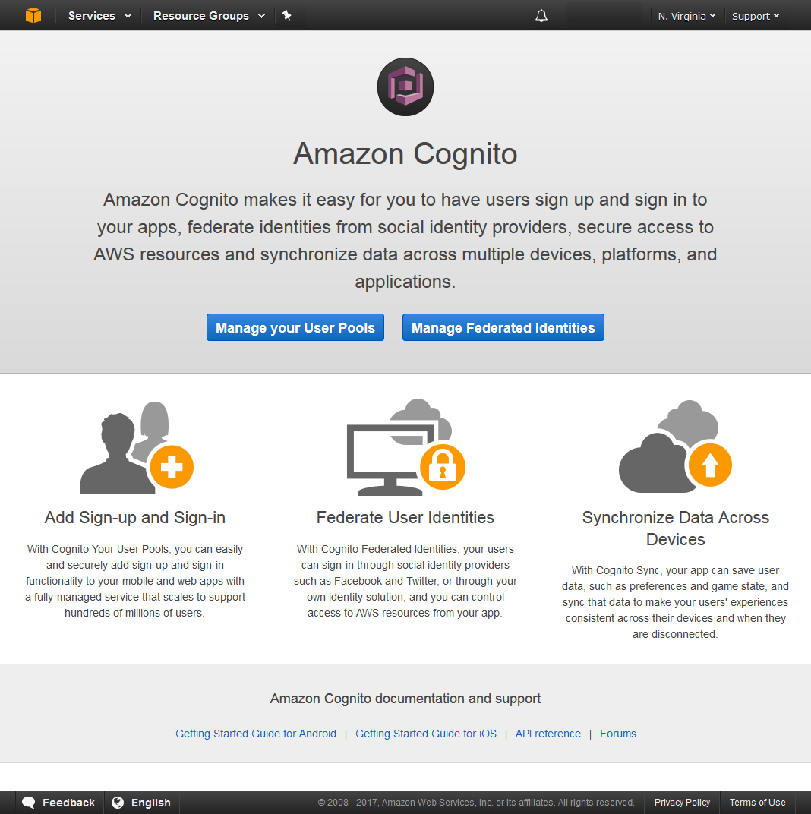
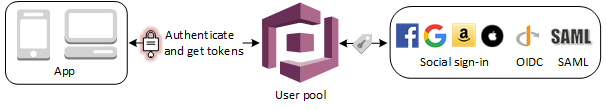
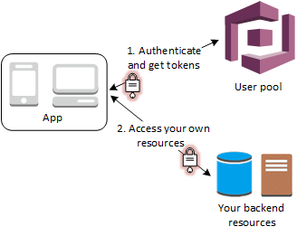
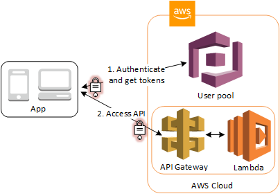
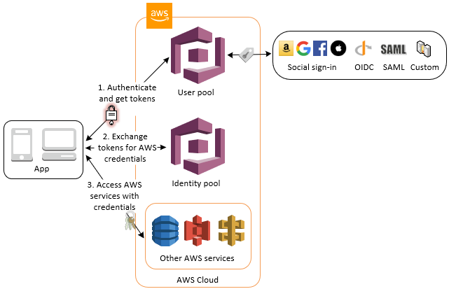
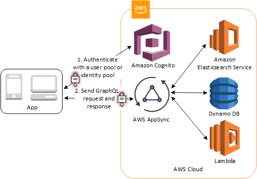

# Amazon Cognito
## 1. 什么是 Amazon Cognito？
Amazon Cognito 为您的 Web 和移动应用程序提供身份验证、授权和用户管理。您的用户可使用用户名和密码直接登录，也可以通过第三方（例如 Facebook、Amazon、Google 或 Apple）登录。

Amazon Cognito 的两个主要组件是用户池（user pools）和身份池（identity pools）。用户池是为您的应用程序提供注册和登录选项的用户目录。使用身份池，您可以授予用户访问其他 AWS 服务的权限。您可以单独或配合使用身份池和用户池。
#### 将 Amazon Cognito 用户池和身份池配合使用
有关常见 Amazon Cognito 场景，请参阅图表。这里的目标是验证用户身份，然后授予用户访问其它 AWS 服务的权限。

1. 在第一步中，您的应用程序用户通过用户池登录，并在成功进行身份验证后收到用户池令牌。
2. 接下来，您的应用程序通过身份池用用户池令牌交换 AWS 凭证。
3. 最后，您的应用程序用户可以使用这些 AWS 凭证来访问其他 AWS 服务（如 Amazon S3 或 DynamoDB）。


有关使用身份池和用户池的更多示例，请参阅常见 [Amazon Cognito 场景](https://docs.aws.amazon.com/zh_cn/cognito/latest/developerguide/cognito-scenarios.html)。

Amazon Cognito 符合 SOC 1-3、PCI DSS、ISO 27001 的要求且符合 HIPAA-BAA 的条件。有关更多信息，请参阅 [AWS 范围内服务](http://aws.amazon.com/compliance/services-in-scope/)。另请参阅[区域数据注意事项](https://docs.aws.amazon.com/zh_cn/cognito/latest/developerguide/security-cognito-regional-data-considerations.html)。
#### Amazon Cognito 功能
##### 用户池
用户池是 Amazon Cognito 中的用户目录。利用用户池，您的用户可以通过 Amazon Cognito 登录您的 Web 或移动应用程序或通过第三方身份提供商 (IdP) 联合登录。无论您的用户是直接登录还是通过第三方登录，用户池的所有成员都有一个可通过开发工具包访问的目录配置文件。

用户池提供：
- 注册和登录服务。
- 用于登录用户的内置的、可自定义的 Web UI。
- 使用 Facebook、Google、Login with Amazon 和 Sign in with Apple 的社交登录，以及通过您的用户池中的 SAML 和 OIDC 身份提供商的登录。
- 用户目录管理和用户配置文件。
- 多重验证 (MFA)、遭盗用凭证检查、账户盗用保护以及电话和电子邮件验证等安全功能。
- 通过 AWS Lambda 触发器进行的自定义工作流程和用户迁移。

有关用户池的更多信息，请参阅[用户池入门](https://docs.aws.amazon.com/zh_cn/cognito/latest/developerguide/getting-started-with-cognito-user-pools.html)和 [Amazon Cognito 用户池 API 参考](https://docs.aws.amazon.com/cognito-user-identity-pools/latest/APIReference/)。
##### 身份池
借助身份池，您的用户可以获取临时 AWS 凭证来访问 AWS 服务（如 Amazon S3 和 DynamoDB）。身份池支持匿名访客用户以及可用来验证身份池用户的身份的以下身份提供商：
- Amazon Cognito 用户池
- 使用 Facebook、Google、Login with Amazon 和 Sign in with Apple 的社交登录
- OpenID Connect (OIDC) 提供商
- SAML 身份提供商
- 已经过开发人员验证的身份

要保存用户配置文件信息，您的身份池需要与用户池集成。

有关身份池的更多信息，请参阅[Amazon Cognito 身份池入门 (联合身份)](https://docs.aws.amazon.com/zh_cn/cognito/latest/developerguide/getting-started-with-identity-pools.html)和 [Amazon Cognito 身份池 API 参考](https://docs.aws.amazon.com/cognitoidentity/latest/APIReference/)。
#### 开始使用 Amazon Cognito
有关首要任务和开始位置的指南，请参阅 [Amazon Cognito 入门](https://docs.aws.amazon.com/zh_cn/cognito/latest/developerguide/cognito-getting-started.html)。

有关视频、文章、文档和示例应用程序，请参阅[Amazon Cognito 开发人员资源](https://aws.amazon.com/cognito/dev-resources/)。

您需要有 AWS 账户才能使用 Amazon Cognito。有关更多信息，请参阅[使用 Amazon Cognito 控制台](https://docs.aws.amazon.com/zh_cn/cognito/latest/developerguide/cognito-console.html)。
#### 区域可用性
在全球多个 AWS 区域中提供 Amazon Cognito。在每个区域，Amazon Cognito 分布在多个可用区内。这些可用区的物理位置是相互隔离的，但可通过私有、低延迟、高吞吐量和高度冗余的网络连接联合在一起。这些可用区域使 AWS 能够提供极高水平的可用性和冗余的服务（包括 Amazon Cognito），同时最大程度地减少延迟。

有关所有地区列表, Amazon Cognito 当前可用,请参阅Amazon Web Services 一般参考中的 [AWS区域和端点](https://docs.aws.amazon.com/general/latest/gr/rande.html##cognito_identity_region)。 要了解有关每个区域中可用的可用区数量的更多信息，请参阅[AWS 全球基础设施](https://aws.amazon.com/about-aws/global-infrastructure/)。
#### Amazon Cognito定价
有关 Amazon Cognito 定价的信息，请参阅 [Amazon Cognito 定价](https://aws.amazon.com/cognito/pricing/)。
### 1.1 使用 Amazon Cognito 控制台
您可以使用 [Amazon Cognito 控制台](https://console.aws.amazon.com/cognito/home)创建和管理用户池和身份池。

要使用 Amazon Cognito 控制台
1. 要使用 Amazon Cognito，您需要[注册 AWS 账户](https://docs.aws.amazon.com/cognito/latest/developerguide/aws-cognito-sign-up-aws-account.html)。
2. 转到 [Amazon Cognito 控制台](https://console.aws.amazon.com/cognito/home)。系统可能会提示您输入 AWS 凭证。
3. 要创建或编辑用户池，请选择**管理您的用户池**。
   有关更多信息，请参阅 [用户池入门](https://docs.aws.amazon.com/zh_cn/cognito/latest/developerguide/getting-started-with-cognito-user-pools.html)。
4. 要创建或编辑身份池，请选择 **Manage Identity Pools (管理身份池)**。

   有关更多信息，请参阅 [Amazon Cognito 身份池入门 (联合身份)](https://docs.aws.amazon.com/zh_cn/cognito/latest/developerguide/getting-started-with-identity-pools.html)。

Amazon Cognito 控制台是 AWS 管理控制台的一部分，后者提供了有关账户和账单的信息。有关更多信息，请参阅[使用 AWS 管理控制台](https://docs.aws.amazon.com/awsconsolehelpdocs/latest/gsg/getting-started.html)。


### 1.2 Amazon Cognito 入门
Amazon Cognito 的两个主要组件是用户池和身份池。用户池是为您的 Web 和移动应用程序用户提供注册和登录选项的用户目录。身份池提供 AWS 凭证以向用户授予对其他 AWS 服务的访问权限。 您可以单独使用或配合使用用户池和身份池。
### 1.3 常见 Amazon Cognito 场景
本主题介绍使用 Amazon Cognito 的六个常见场景。

Amazon Cognito 的两个主要组件是用户池和身份池。用户池是为您的 Web 和移动应用程序用户提供注册和登录选项的用户目录。身份池提供 AWS 凭证以向用户授予对其他 AWS 服务的访问权限。

用户池是 Amazon Cognito 中的用户目录。您的应用程序用户可以通过用户池直接登录，也可以通过第三方身份提供商 (IdP) 联合。用户池管理从通过 Facebook、Google、Amazon 和 Apple 进行的社交登录返回的以及从 OpenID Connect (OIDC) 和 SAML IdP 返回的令牌的处理开销。 无论您的用户是直接登录还是通过第三方登录，用户池的所有成员都有一个可通过开发工具包访问的目录配置文件。

借助身份池，您的用户可以获取临时 AWS 凭证来访问 AWS 服务，如 Amazon S3 和 DynamoDB。身份池支持匿名来宾用户以及通过第三方 IdP 的联合身份验证。
#### 1.3.1 使用用户池进行身份验证
您可以允许您的用户使用用户池进行身份验证。您的应用程序用户可以通过用户池直接登录，也可以通过第三方身份提供商 (IdP) 联合。用户池管理从通过 Facebook、Google、Amazon 和 Apple 进行的社交登录返回的以及从 OpenID Connect (OIDC) 和 SAML IdP 返回的令牌的处理开销。

成功进行身份验证后，您的 Web 或移动应用程序将收到来自 Amazon Cognito 的用户池令牌。您可以使用这些令牌检索允许您的应用程序访问其他 AWS 服务的 AWS 凭证，也可以选择使用它们来控制对您的服务器端资源或 Amazon API Gateway 的访问。

有关更多信息，请参阅[用户池身份验证流程](https://docs.aws.amazon.com/zh_cn/cognito/latest/developerguide/amazon-cognito-user-pools-authentication-flow.html)和[将令牌与用户池结合使用](https://docs.aws.amazon.com/zh_cn/cognito/latest/developerguide/amazon-cognito-user-pools-using-tokens-with-identity-providers.html)。


#### 1.3.2 使用用户池访问您的服务器端资源
成功进行用户池登录后，您的 Web 或移动应用程序将收到来自 Amazon Cognito 的用户池令牌。您可以使用这些令牌控制对您的服务器端资源的访问。您也可以创建用户池组来管理权限以及表示不同类型的用户。有关使用组控制资源访问权限的更多信息，请参阅[向用户池添加组](https://docs.aws.amazon.com/zh_cn/cognito/latest/developerguide/cognito-user-pools-user-groups.html)。



在为用户池配置域后，Amazon Cognito 服务会预置一个托管 Web UI，您可使用此 UI 向应用程序添加注册页和登录页。使用此 OAuth 2.0 基础，您可以创建自己的资源服务器，以使您的用户能够访问受保护的资源。有关更多信息，请参阅[为您的用户池定义资源服务器](https://docs.aws.amazon.com/zh_cn/cognito/latest/developerguide/cognito-user-pools-define-resource-servers.html)。

有关用户池身份验证的更多信息，请参阅用[户池身份验证流程](https://docs.aws.amazon.com/zh_cn/cognito/latest/developerguide/amazon-cognito-user-pools-authentication-flow.html)和[将令牌与用户池结合使用](https://docs.aws.amazon.com/zh_cn/cognito/latest/developerguide/amazon-cognito-user-pools-using-tokens-with-identity-providers.html)。
#### 1.3.3 结合使用 API 网关 和 Lambda 与用户池访问资源
您可以允许用户通过 API 网关 访问您的 API。API 网关 会验证来自成功的用户池身份验证的令牌，并使用它们向您的用户授予对资源（包括 Lambda 函数）或您自己的 API 的访问权限。

您可以使用用户池中的组控制对 API 网关 的权限，方法是将组成员资格映射到 IAM 角色。用户所属的组包含在您的应用程序用户登录时用户池提供的 ID 令牌中。有关用户池组的更多信息，请参阅[向用户池添加组](https://docs.aws.amazon.com/zh_cn/cognito/latest/developerguide/cognito-user-pools-user-groups.html)。

您可以将您的用户池令牌随请求一起提交到 API 网关，以便 Amazon Cognito 授权方 Lambda 函数进行验证。有关 API 网关 的信息，请参阅[将 API 网关 与 Amazon Cognito 用户池配合使用](https://docs.aws.amazon.com/apigateway/latest/developerguide/apigateway-integrate-with-cognito.html)。


#### 1.3.4 使用用户池和身份池访问 AWS 服务
成功进行用户池身份验证后，您的应用程序将收到来自 Amazon Cognito 的用户池令牌。您可以用它们交换用于使用身份池对其他 AWS 服务的临时访问令牌。有关更多信息，请参阅[在登录后使用身份池访问 AWS 服务](https://docs.aws.amazon.com/zh_cn/cognito/latest/developerguide/amazon-cognito-integrating-user-pools-with-identity-pools.html)和[Amazon Cognito 身份池入门 (联合身份)](https://docs.aws.amazon.com/zh_cn/cognito/latest/developerguide/getting-started-with-identity-pools.html)。


#### 1.3.5 借助第三方进行身份验证并使用身份池访问 AWS 服务
您可以允许您的用户通过身份池访问 AWS 服务。身份池需要来自由第三方身份提供商进行身份验证的用户的 IdP 令牌 (如果是匿名来宾，则不需要令牌)。作为交换，身份池将授予可用来访问其他 AWS 服务的临时 AWS 凭证。有关更多信息，请参阅[Amazon Cognito 身份池入门 (联合身份)](https://docs.aws.amazon.com/zh_cn/cognito/latest/developerguide/getting-started-with-identity-pools.html)。


#### 1.3.6 使用 Amazon Cognito 访问 AWS AppSync 资源
您可以允许您的用户使用来自成功的 Amazon Cognito 身份验证（来自用户池或身份池）的令牌访问 AWS AppSync 资源。有关更多信息，请参阅[使用用户池或联合身份访问 AWS AppSync 和数据源](https://docs.aws.amazon.com/appsync/latest/devguide/security.html)。


## 2. 教程
### 2.1 创建用户池
利用用户池，您的用户可以通过 Amazon Cognito 登录您的 Web 或移动应用程序。

**创建用户池**
1. 转到 Amazon Cognito 控制台。可能会提示您输入 AWS 凭证。
2. 选择 Manage User Pools (管理用户池)。
3. 选择 Create a user pool。
4. 为您的用户池指定一个名称，然后选择 Review defaults (查看默认值) 以保存该名称。
5. 在审查页面上，选择创建池。
### 2.2 创建身份池
借助身份池，您的用户可以获取临时 AWS 凭证来访问 AWS 服务（如 Amazon S3 和 DynamoDB）。

**创建身份池**
1. 转到 Amazon Cognito 控制台。可能会提示您输入 AWS 凭证。
2. 选择 **Manage Identity Pools (管理身份池)**
3. 选择 **Create new identity pool (创建新身份池)**。
4. 为身份池输入一个名称。
5. 要启用**未经身份验证的身份**，请从**未经验证的身份**可折叠部分中选择**启用未经验证的身份的访问权限**。
6. 选择 Create Pool。
7. 系统将提示您访问您的 AWS 资源。

   选择允许以创建两个与您的身份池关联的默认角色，一个用于未经身份验证的用户，另一个用于经过身份验证的用户。这些默认角色会向 Amazon Cognito Sync 提供身份池访问权限。您可以在 IAM 控制台中修改与身份池关联的角色。
8. 记下您的身份池 ID 号。您将使用它来设置允许您的应用程序用户访问其他 AWS 服务（如 Amazon Simple Storage Service 或 DynamoDB）的策略
### 2.3 清除您的 AWS 资源
**删除身份池**
1. 转到 Amazon Cognito 控制台。可能会提示您输入 AWS 凭证。
2. 选择 **Manage Identity Pools (管理身份池)**。
3. 选择要删除的身份池的名称。此时将显示身份池的“控制面板”页。
4. 在“控制面板”页的右上角，选择**编辑身份池**。此时将显示**编辑身份池**页。
5. 向下滚动并选择**删除身份池**以将其展开。
6. 选择删除身份池。
7. 选择删除池。

**删除用户池**
1. 转到 Amazon Cognito 控制台。可能会提示您输入 AWS 凭证。
2. Manage User Pools (管理用户池)。
3. 选择在上一步中创建的用户池。
4. 在域名页面的应用程序集成下，选择删除域。
5. 提示确认时，选择删除域。
6. 转到常规设置页。
7. 选择页面右上角的删除池。
8. 提示确认时，输入删除并选择删除池。
### 2.4 与应用程序集成
当新用户发现您的程序时，或当现有用户返回使用您的应用程序时，他们的第一个任务是注册或登录。通过将 Amazon Cognito 与客户端代码集成，您可以将应用程序连接到协助进行身份验证和授权工作流的后端 AWS 功能。例如，您的应用程序将使用 Amazon Cognito API 在用户池中创建新用户、检索用户池令牌以及从身份池中获取临时凭证。要将 Amazon Cognito 与您的 Web 或移动应用程序集成，请使用 AWS Amplify 框架提供的开发工具包和库。

**使用 AWS Amplify 框架进行 Amazon Cognito 身份验证**
AWS Amplify 向 Web 和移动开发人员提供服务和库。借助 AWS Amplify，您可以构建与由 AWS 服务组成的后端环境集成的应用程序。要预配置后端环境，以及将 AWS 服务与客户端代码集成，请使用 AWS Amplify 框架。该框架提供了一个交互式命令行界面 (CLI)，可帮助您为按类别组织的功能（包括分析、存储和身份验证以及其他功能）配置 AWS 资源。该框架还为 Web 和移动平台（包括 iOS、Android 及 JavaScript）提供了高级开发工具包和库。支持的 JavaScript 框架包括 React、React Native、Angular、Ionic 和 Vue。每个开发工具包和库都包含身份验证操作，您可以使用这些操作来实施 Amazon Cognito 驱动的身份验证工作流。

要使用 AWS Amplify 框架向应用程序添加身份验证功能，请参阅您使用的平台的 AWS Amplify 文档：
- [适用于 JavaScript 的 AWS Amplify 身份验证](https://aws-amplify.github.io/docs/js/authentication)
- [适用于 iOS 的 AWS Amplify 身份验证](https://aws-amplify.github.io/docs/ios/authentication)
- [适用于 Android 的 AWS Amplify 身份验证](https://aws-amplify.github.io/docs/android/authentication)
## 3. Amazon Cognito 用户池
用户池是 Amazon Cognito 中的用户目录。利用用户池，您的用户可以通过 Amazon Cognito 登录您的 Web 或移动应用程序。您的用户还可以通过社交身份提供商（例如 Google、Facebook、Amazon 或 Apple）以及 SAML 身份提供商登录。无论您的用户是直接登录还是通过第三方登录，用户池的所有成员都有一个可通过软件开发工具包 (SDK) 访问的目录配置文件。

用户池提供：
- 注册和登录服务。
- 用于登录用户的内置的、可自定义的 Web UI。
- 使用 Facebook、Google、Login with Amazon 和 Sign in with Apple 的社交登录，以及使用您的用户池中的 SAML 身份提供商的登录。
- 用户目录管理和用户配置文件。
- 多重验证 (MFA)、遭盗用凭证检查、账户盗用保护以及电话和电子邮件验证等安全功能。
- 通过 AWS Lambda 触发器进行的自定义工作流程和用户迁移。

在成功验证用户身份后，Amazon Cognito 将颁发 JSON Web Token (JWT)，可供您用来保护和授权对您自己的 API 的访问或交换 AWS 凭证。


Amazon Cognito 通过适用于 JavaScript、Android 和 iOS 的 Amazon Cognito 用户池身份开发工具包来提供令牌处理。请参阅[用户池入门](https://docs.aws.amazon.com/zh_cn/cognito/latest/developerguide/getting-started-with-cognito-user-pools.html)和[将令牌与用户池结合使用](https://docs.aws.amazon.com/zh_cn/cognito/latest/developerguide/amazon-cognito-user-pools-using-tokens-with-identity-providers.html)。

Amazon Cognito 的两个主要组件是用户池和身份池。身份池提供 AWS 凭证以向用户授予对其他 AWS 服务的访问权限。要使您的用户池中的用户能够访问 AWS 资源，您可以配置一个身份池以用用户池令牌交换 AWS 凭证。有关更多信息，请参阅[在登录后使用身份池访问 AWS 服务](https://docs.aws.amazon.com/zh_cn/cognito/latest/developerguide/amazon-cognito-integrating-user-pools-with-identity-pools.html)和[Amazon Cognito 身份池入门 (联合身份)](https://docs.aws.amazon.com/zh_cn/cognito/latest/developerguide/getting-started-with-identity-pools.html)。
### 3.1 用户池入门
以下步骤介绍如何使用 Amazon Cognito 控制台设置和配置用户池。有关从何处开始使用 Amazon Cognito 的指南，请参阅[Amazon Cognito 入门](https://docs.aws.amazon.com/zh_cn/cognito/latest/developerguide/cognito-getting-started.html)。
#### 3.1.1 先决条件：注册 AWS 账户
您需要一个 AWS 账户才能使用 Amazon Cognito。如果您还没有账户，请按照以下步骤注册：

**如需注册 AWS 账户**
1. 打开 https://portal.aws.amazon.com/billing/signup。
2. 按照屏幕上的说明进行操作。

   在注册时，您将接到一通电话，要求您使用电话键盘输入一个验证码。
#### 3.1.2 步骤 1.创建用户池
通过使用 Amazon Cognito 用户池，您可以创建和维护用户目录，并将注册信息和登录信息添加到移动应用程序或 Web 应用程序。

**创建用户池**
1. 转到 [Amazon Cognito 控制台](https://console.aws.amazon.com/cognito/home)。系统可能会提示您输入 AWS 凭证。
2. 选择 **Manage User Pools (管理用户池)**。
3. 在页面右上角，选择 **Create a user pool (创建用户池)**。
4. 为您的用户池指定一个名称，然后选择 **Review defaults (查看默认值)** 以保存该名称。
5. 在页面左上角，选择 **Attributes (属性)**，然后依次选择 **Email address or phone number (电子邮件地址或电话号码)** 和 **Allow email addresses (允许使用电子邮件地址)**，最后选择 **Next step (下一步)** 加以保存。
   > **注意**
   > 我们建议您在创建用户池之前对 username 属性启用不区分大小写。例如，当选择此选项时，用户将能够使用“username”或“Username”登录。除了 username 属性之外，启用此选项还可使 preferred_username 和 email 别名不区分大小写。有关更多信息，请参阅 Amazon Cognito 用户池 API 参考 中的 CreateUserPool。
6. 在左侧导航菜单中，选择 **Review (查看)**。
7. 查看用户池信息并进行必要的更改。如果信息正确，请选择 **Create pool (创建池)**。
#### 3.1.3 步驟 2.添加应用程序以启用托管 Web UI
在创建用户池后，您可以创建一个应用程序，以便使用内置网页来对用户进行注册和登录。

**在用户池中创建应用程序**
1. 转到 Amazon Cognito 控制台。系统可能会提示您输入 AWS 凭证。
2. 选择 Manage User Pools (管理用户池)。
3. 从列表中选择现有用户池，或创建用户池。
4. 在页面左侧的导航栏上，选择常规设置下的应用程序客户端。
5. 选择 Add an app client。
6. 为应用程序指定名称。
7. 在此入门练习中，清除生成客户端密钥选项，因为使用客户端 JavaScript 在 URL 中发送此密钥是不安全的。客户端密钥由具有以下特点的应用程序使用：拥有可保护客户端密钥的服务器端组件。
8. 选择 Create app client。
9. 记下应用程序客户端 ID。
10. 选择返回池详细信息。
11. 从控制台页面左侧的导航栏中选择应用程序客户端设置。
12. 选择 Cognito 用户池作为其中一个启用身份提供商。
    > **注意**
    > 要使用外部身份提供商 (IdP)（如 Facebook、Amazon、Google 和 Apple）以及通过 OpenID Connect (OIDC) 或 SAML IdP 进行登录，请首先按下文所述的方式配置它们，然后返回到应用程序客户端设置页面以启用它们。
13. 输入一个回调 URL，供 Amazon Cognito 授权服务器在用户通过身份验证之后进行调用。对于 Web 应用程序，该 URL 应以 https:// 开头，如 https://www.example.com。

   对于 iOS 或 Android 应用程序，您可以使用类似 myapp:// 的回调 URL。
14. 输入注销 URL。
15. 选择授权代码授予以返回随后与用户池令牌交换的授权代码。由于令牌绝不会直接向最终用户公开，因此它们不太可能被泄露。但是，后端需要自定义应用程序以将授权代码换成用户池令牌。出于安全原因，强烈建议您将授权代码授予流程与[代码交换的证明密钥 (PKCE)](https://tools.ietf.org/html/rfc7636) 一起用于移动应用程序。
16. 在允许的 OAuth 流程下，选择隐式授予以便从 Amazon Cognito 将用户池 JSON Web Token (JWT) 返回给您。当没有可用于将授权代码换成令牌的后端时，您可以使用此流程。它对于调试令牌也很有帮助。
    > **注意** 您可以同时启用授权代码授予和隐式代码授予，然后按需使用每个授予。
17. 除非您希望明确地排除一个允许的 OAuth 范围，否则请选中所有“允许的 OAuth 范围”的复选框。
    > **注意** 只有在您的应用程序需要代表自己而不是代表用户请求访问令牌时才选择客户端凭证。
18. 选择 Save changes。
19. 在域名页面上，键入可用的域前缀。
20. 记下完整的域地址。
21. 选择 Save changes。

**查看您的登录页面**
您可以使用以下 URL 查看托管 UI 登录网页。记下 response_type。在本例中，response_type=code 表示授权代码授予。
```

https://your_domain/login?response_type=code&client_id=your_app_client_id&redirect_uri=your_callback_url
```

您可以使用针对隐式代码授予的以下 URL 查看托管 UI 登录网页，其中，response_type=token。成功登录后，Amazon Cognito 会将用户池令牌返回到您的 Web 浏览器的地址栏。
```

https://your_domain/login?response_type=token&client_id=your_app_client_id&redirect_uri=your_callback_url
```

您可以在响应中的 #idtoken= 参数后面找到 JSON Web Token (JWT) 身份令牌。

下面是来自隐式授予请求的示例响应。您的身份令牌字符串长得多。
```

https://www.example.com/#id_token=123456789tokens123456789&expires_in=3600&token_type=Bearer
```

您可以使用 AWS Lambda 解码和验证用户池令牌，请参阅 AWS GitHub 网站上的[解码和验证 Amazon Cognito JWT 令牌](https://github.com/awslabs/aws-support-tools/tree/master/Cognito/decode-verify-jwt)。

使用 RS256 算法对 Amazon Cognito 用户池令牌进行签名。

您可能需要先等待一分钟以刷新浏览器，之后才会显示您在控制台中所做的更改。

您的域将显示在域名页面上。您的应用程序客户端 ID 和回调 URL 显示在 General settings (常规设置) 页面上。
#### 3.1.4 步驟 3.向用户池添加社交登录 (可选)
您可以允许应用程序用户通过社交身份提供商 (IdP)（例如 Facebook、Google、Amazon 和 Apple）进行登录。无论您的用户是直接登录还是通过第三方登录，所有用户都在用户池中有一个配置文件。如果您不想添加通过社交登录身份提供商进行的登录，请跳过此步骤。
#### 3.1.5 步驟 4.将使用 SAML 身份提供商的登录添加到用户池 (可选)
#### 3.1.6 后续步骤
### 3.2 使用 Amazon Cognito 托管 UI 进行注册和登录
### 3.3 通过第三方添加用户池登录
### 3.4 使用 Lambda 触发器自定义用户池工作流
### 3.5 将 Amazon Pinpoint 分析与 Amazon Cognito 用户池结合使用
### 3.6 在用户池中管理用户
### 3.7 Amazon Cognito 用户池的电子邮件设置
### 3.8 将令牌与用户池结合使用
### 3.9 在成功进行用户池身份验证后访问资源
### 3.10 用户池参考 (AWS 管理控制台)
### 3.11 管理错误响应
## 4. Amazon Cognito 身份池
## 5. Amazon Cognito Sync
## 6. 安全性
## 7. API 参考
### 7.1 Amazon Cognito 用户池 API 参考
利用 Amazon Cognito 用户池，您可以使您的 Web 和移动应用程序用户能够注册和登录。您可以更改经过身份验证的用户的密码，并为未经身份验证的用户启动忘记密码流程。有关更多信息，请参阅 用户池身份验证流程 和 将令牌与用户池结合使用。


### 7.2 Amazon Cognito 用户池 Auth API 参考
### 7.3 Amazon Cognito 身份池概念 (联合身份) API 参考
### 7.4 Amazon Cognito 同步 API 参考

## Reference
- [什么是 Amazon Cognito？](https://docs.aws.amazon.com/zh_cn/cognito/latest/developerguide/what-is-amazon-cognito.html)