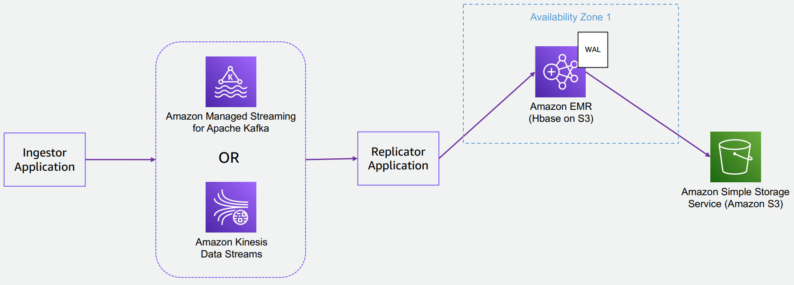

# Amazon HBase on S3

## Introduction to Amazon EMR HBase on S3

### Components
- HBase master (3 with EMR multi master)
- One or more region servers 
- Zookeeper instances on EMR master nodes 
- S3 as Storage layer

Important Notes
- The HBase root directory is stored in Amazon S3, including HBase store files and table metadata
- NEVER have more than one cluster pointing to the same root dir
- WALs are still written on HDFS for performance
- Combined cache: 
  + BlockCache = On-heap cache = to store bloom filters and indices 
  + BucketCache = local disks (default) or offheap memory = to store data block

## HBase on HDFS or HBase on S3?

Factor|HBase on HDFS|HBase on S3
--------|--------|--------
Cost|Higher - 3x data replication + usually a DR cluster running in parallel Lower |single replica + S3 less expensive than local 
storage
Ease of operation|Lower – Storage is local and coupled to compute: 1. Difficult to terminate and re-create a cluster: upgrades, change instance types 2. Disaster recovery: Can only leverage HDFS replication. Cluster down(corrupted or terminated) means data is lost. DR plan needed: • Continue Snapshot + Export to S3 (compute resources needed)• DR replica cluster running in parallel(additional cluster up and running) |Higher - Allows to decouple storage from compute: 1. Easy to terminate and re-create a cluster: upgrades, change instance types, cluster idle times 2. Disaster recovery: Can leverage S3 SLAs. Cluster down = launch a new one pointing the same S3 location
Performance|Provides in general better performance in most cases (S3 << EBS << Instance Stores): 1. Reads: read from local volumes (EBS or better with instance stores) is faster than reading from S3 (milliseconds / sub-milliseconds read responses) 2. Writes: write to local volumes (EBS or better with instance stores) is faster than writing to S| 1. Comparable performance as HDFS can be obtain 
relying on caching features and configurations tuning (if huge cache needed, add storage to the cluster which may reduce cost savings)
2. Good option for read-intensive workloads or when tables rarely chances over time (best when data most frequently accessed is the most recent) or when tables rarely chances over time

## Amazon EMR HBase High Availability and Disaster Recovery

### EMR Clusters Considerations

- EMR clusters are self-healing: 
  + instance failure = automatically replaced
- For EMR clusters with a single master node the master node is a single point of failure:
  + master node failure = cluster failure
- We can launch EMR clusters with Multi-masters:
  + we can use rack-awareness to spread the masters on different hardware
  + master instance failure = automatically replaced
  + EMR can tolerate 1 master instance failure at a time
- Amazon EMR clusters are deployed in a single AZ:
  + AZ impaired = EMR cluster impaired
- Terminated EMR cluster = EBS and Instance Store data are lost


### HBase on HDFS – HBase replication

**HBase Replication (Active - Active)**
- Master <--> Master Replication
- Require a cluster replica always up and running 
- It does not perform replication of data written before the peering, and it does not replicate metadata operations (e.g. Creation of new tables)

**HBase Replication (Active - Standby)**
- Create a single replication Master --> Master
- Require a cluster replica always up and running 
- It does not perform replication of data written before the peering, and it does not replicate metadata operations (e.g. Creation of new tables)
- Route53 to switch on the replica cluster in case of failures 
- Easier to manage and implemen

### HBase on HDFS – Write on multiple clusters


**HBase Writes (Active - Active)**
- HBase writers write on both the clusters (each record written twice)
- Metadata operations (i.e., Tables creation / Deletion) have to be performed on both the clusters
- Operations overhead (i.e., writes fail on one cluster, accumulate and replay)

**HBase Reads (Active - Standby OR Active-Active)**
- Readers can be configured to read from a primary cluster or can be “load balanced” on the 2 clusters

### HBase on HDFS – HA/DR solutions comparison

### HBase on S3 – Default behaviour


### HBase on S3 – Upstream storage



### HBase on S3 – High Availability for Reads

To ensure that the read replica clusters are reading the most recent data, follow the steps below:
- Insert data as usual into the primary cluster (Bulkload preferred)
- Ensure data is flushed to Hfiles (if not using bulkloading)
- In case of region changes (i.e., split, merges) or tables modifictions (i.e., creation, removal) run refresh_meta command on the read replica cluster
- In case of new writes, run the refresh_hfiles 'table_name' command for the updated tables on the read replica cluster (or hbase org.apache.hadoop.hbase.client.example.RefreshHFilesClient 'table_name')
- Note: till no fushes + refresh_meta + refresh_hfiles we cannot read latest updates
- To avoid inconsistencies: insert data in batches + flush data + run the refresh commands on the read replica cluster

### HBase on S3 – Amazon EMR WAL feature (New)


### Amazon S3 Object Replication

- Enable S3 object replication on the HBase root directory in a different bucket on the same region or on a different region
- Enable S3 versioning and the delete markers replication
- Enable the Replication Time Control (RTC) capabilities (this also enables S3 replication metrics )
- Setup a Lifecycle rule to remove delete markers, incomplete multipart uploads, and non current version of files.
- In case of impairment of primary cluster:
- Verify no objects pending replication on the S3 replication metrics
- Launch a cluser pointing the new S3 bucket


## HBase on S3 – High level Tuning Recommendations

### General Idea


Main idea is to reduce accesses to S3:
- Reduce latency
- Limit S3 requests to reduce throttling

### Cluster instances and storage volume

- HBase typically performs better with small instances:
  + spread requests across them (different network interfaces + queues + less regions to manage in parallel)
  + Too big Java Heap dedicated to HBase Region servers = possible heavy GC durations (use < 64Gb of heap or tune the 
GC configurations)
- Most HBase workloads perform well with General Purpose (GP2/GP3) volumes
- Best performance with EC2 instances powered by Instance Store volumes:
  + especially true for write intensive / mixed workloads
  + Huge amount of write requests means large amount of IOPS (compaction, WAL writes, bucketcache writes)
  + Trade-off to be evaluated between higher cost for Instance Store backed instances and performance improvements
- Number of cluster instance:
  + Depends on the overall amount of regions and on the amount of regions per Region Server. There are limitations in 
terms of number of HBase regions a single Region Server can handle (huge amount on a single RS may lead to issues 
and unexpected behavior – See Number of HBase regions section)

### Cluster Instance Types

Instances|Feature
-------|--------
Storage Optimized instances: (i.e., i3 / i3en)|Provide NVMe SSD disks = fast IO; Good for write intensive workloads with high storage demand
Memory optimized instances (i.e., r5)|More memory for memstores, cache and local HBase queues/objects
Compute optimized (i.e., c5)|Higher proportion of vCPU – good if you need to serve a large volume of requests and/or large amount of regions on a region server (a lot of regions active in parallel)
General purpose (i.e., m5)|Trade-off between memory and core
m5d / r5d /c5d|Provide NVMe SSD disks = fast IO; Trade-off to be evaluated between higher cost for Instance Store backed instances and performance improvements

### Number of HBase regions

- Reference formula (from [HBase documentation](https://hbase.apache.org/book.html)) to compute the IDEAL number of regions per region server 
(recommended value to use a starting point): **(REGION_SERVER_MEM_SIZE * MEMSTORE_FRACTION) / (MEMSTORE_SIZE * NUM_COLUMN_FAMILIES**

  + **REGION_SERVER_MEM_SIZE**: Memory allocated for the Region Server, as defined by the parameter `-Xmx` in `hbaseenv.sh`
  + **MEMSTORE_FRACTION**: Memstore memory fraction, defined by `hbase.regionserver.global.memstore.size` (default 0.4)
  + **MEMSTORE_SIZE**: Memstore flush size, defined by `hbase.hregion.memstore.flush.size` (default 128MB)
  + **NUM_COLUMN_FAMILIES**: Number of column families defined for the table
- Note: this assumes all the regions are filled at approximately the same rate. This is not usually the case and so you can have an higher number of regions per RS (i.e., depend on how active regions are at the same time)
- Example: HBase Region Server with 32GB Heap hosting tables with 2 column families each with default HBase settings, IDEAL allocation equals to `(32GB * 0.4) / (128MB * 2) = 50`

### Region Size and Region Split Policy

#### Regions size:
Reference values (from [HBase documentation](https://hbase.apache.org/book.html)): 
- 5-10GB optimal (`hbase.hregion.max.filesize = 10737418240` by default – 10GB + 
`hbase.hregion.split.overallfiles = true`)
- Suggested max of **20GB**

#### Regions split policy:
- Default with HBase 2.x: `org.apache.hadoop.hbase.regionserver.SteppingSplitPolicy` (quickly increase the number of regions for fresh new tables that are not pre-partitioned)
- To have better control we can use `org.apache.hadoop.hbase.regionserver.
  ```
  ConstantSizeRegionSplitPolicy` [
    {
      "Classification": "hbase-site",
      "Properties": {
      "hbase.regionserver.region.split.policy": "org.apache.hadoop.hbase.regionserver.ConstantSizeRegionSplitPolicy",
      "hbase.hregion.max.filesize": "10737418240"
      }
    }
  ]
  ```

#### Note
During region splits our ingestors/readers can experience short. Possible to pre-split a table and disable region splitting for it (we have to know our use case) . Table pre-spitting advantages:
- Avoid costly splitting operation
- Ensure the table starts spread across different RS (reads/writes are immediately distributed)

### Migration Starting point

- As starting point use the latest generation of memory optimized instance types (R5/R5d) and the same region 
density per RegionServer as in your HDFS backed cluster
- As you progress to tune the read and write path, first establish a configuration that supports the SLA of your 
application. Then, increase the region density by reducing the number of nodes in the cluster (See Next 
Performance tests section)

### General Recommendation

- Use latest Amazon EMR release to benefit from all changes and features continuously added to Apache HBase
- Large clusters require an S3 manual partitioning to prevent S3 throttling issues. This can be performed by 
contacting Premium Support
- Partitioning example for HBase
  `BUCKET/data/NAMESPACE/TABLE/[0-f]`
  `BUCKET/archive/data/NAMESPACE/TABLE/[0-f]`
- To increase concurrent requests per Region server increase the number of active RPC listeners (`hbase.regionserver.handler.count` – default 30)
- Use a multiwal strategy (improve writes throughput - `hbase.wal.provider = multiwal` - `hbase.wal.regiongrouping.numgroups = number of disks per instance`)
• Increase the region server thread pools to speed up the initialization of the regions (`hbase.regionserver.executor.openregion.threads - hbase.regionserver.executor.closeregion.threads`)

### Read Workloads Recommendations

Objective is to reduce number of S3 Read operations:

- Increase BucketCache size (`hbase.bucketcache.size`):
  + **BucketCache** = (`Size of hot data / number of region servers`)
  + the disk size should be large enough to cover all caching requirements, HDFS requirements (WALs), and OS and Apache Hadoop requirements.
  + When your instance has multiple volumes, the BucketCache is divided across n-1 volumes
- Cache blocks on writes and on compactions (`hbase.rs.cacheblocksonwrite -
hbase.rs.cachecompactedblocksonwrite`)
- Pre-fetch blocks on region opening (`hbase.rs.prefetchblocksonopen` or only for specific tables column families `PREFETCH_BLOCKS_ON_OPEN` + increase `hbase.bucketcache.writer.threads` and `hbase.bucketcache.writer.queuelength`). 
  + Note: this adds overhead on region opening, specially when we launch a new cluster on top of existing Hbase data. If almost always reading only latest written data possible to rely only on Cache blocks on writes

### Write Workloads Recommendations

Objective: reduce number of S3 Write operations / improve writes performance

- Increase memstore flush size (`hbase.hregion.memstore.flush.size`) . This reduce flush operations and small compactions.
- Increase amount of threads performing flush operations (`hbase.hstore.flusher.count`)
- Avoid HFile rename operations (HFiles commit during flush/compactions) with [Persistent File Tracking](https://aws.amazon.com/blogs/big-data/amazon-emr-6-2-0-adds-persistent-hfile-tracking-to-improve-performance-with-hbase-on-amazon-s3/) (enabled by default in EMR 6.2.0+) (Note: feature not supporting HBase Region replication)

## Performance Tests

### Tool1: HBase Performance Evaluation Utility

- Already available inside an EMR cluster with Hbase installed
- Can be invoked from the EMR leader node:
  ```
  hbase pe <OPTIONS> <command> <nclients>
  ```
- We can test both read and write operations controlling different aspects (i.e., number of clients, table splits, size of data to write, number of rows per client, …)
- Possible to run as a single multi-thread client or as a mapreduce application (one client per mapper)
- We can see min, max and avg response latency and average TPS/QPS

### Tool2: YCBS (Yahoo Cloud Serving Benchmark)

- [Utility](https://ycsb.site/) not available in EMR, to be manually installed
- Utility more focused on testing workload patterns (i.e., workload type A, B, C, D, …)
- You can mix different volumes of write/read/mutate operations + sizes of the data to be read/modified
- Tools comes with pre-defined templates for standard workload patterns. Example: [Workload A](https://github.com/brianfrankcooper/YCSB/blob/master/workloads/workloada): 50% read operations + 50% update operations using 1KB payloads for each row
- Useful when you know your workloads pattern and you want to simulate more realistic use cases
- Tool only offer multi-threaded clients. For bigger clusters you may want to configure a fleet of EC2 instances (i.e., EMR cluster) and run the clients from each node with automation scripts
- See latencies and throughputs reports

## Observability

### Monitoring HBase: HBase WebUI

### Monitoring HBase: Grafana & Prometheus

Details:
- Better and richer experience to monitor HBase clusters
- Customizable based on needs
- Blog: [Monitor Apache HBase on Amazon EMR using Amazon Managed Service for Prometheus and Amazon Managed Grafana](https://aws.amazon.com/blogs/big-data/monitor-apache-hbase-on-amazon-emr-using-amazon-managed-service-for-prometheus-and-amazon-managed-grafana/)

### Monitoring HBase: JMX Metrics

Details:
- HBase metrics can be exported via Java Management Extensions (JMX) – to be enabled
- JMX metrics are also exposed in JSON format on HTTP endpoints
  + HBase Master `http://master-dns-name:16010/jmx?description=true`
  + HBase Region `http://region-dns-name:16030/jmx?description=true`
- See [HBase metrics](https://hbase.apache.org/book.html) on the HBase documentation

## Useful Resources

## Reference

- [Stefano Sandon/Amazon EMR HBase on S3](file:///d/work/HBase Cloud Poc/HBase_S3.pdf)