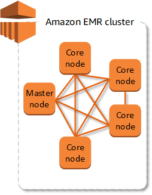
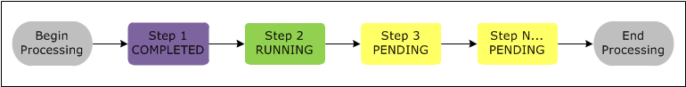
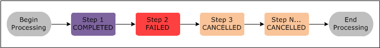
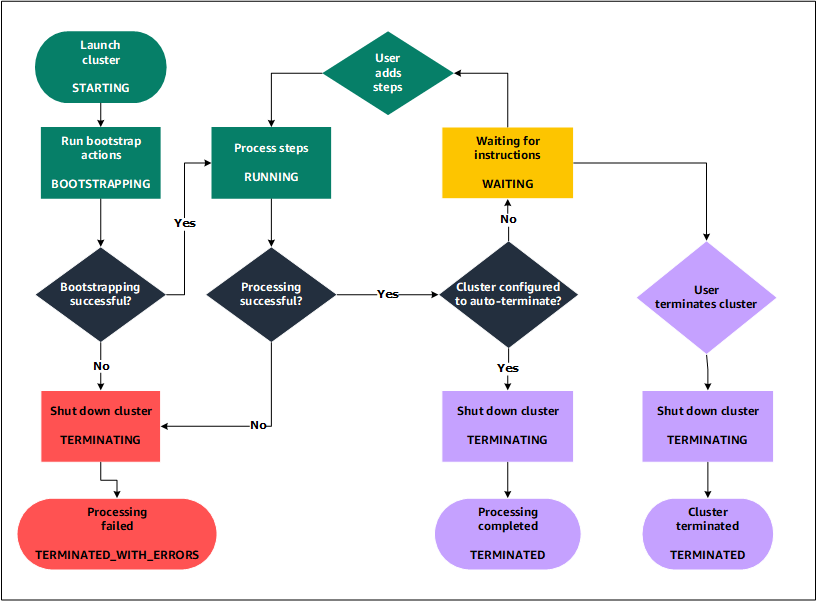
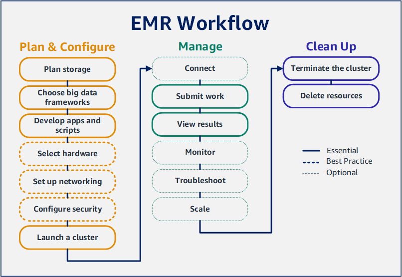

# 什么是 Amazon EMR？

## 1. 什么是 Amazon EMR？

Amazon EMR（以前称为 Amazon Elastic MapReduce）是一个托管集群平台，可简化在上运行大数据框架（如 [Apache Hadoop](http://aws.amazon.com/elasticmapreduce/details/hadoop) 和 [Apache Spark](http://aws.amazon.com/elasticmapreduce/details/spark)）的过程，AWS 以处理和分析海量数据。使用这些框架和相关的开源项目，您可以处理用于分析目的的数据和业务情报工作负载。Amazon EMR 还允许您转换大量数据并移出/移入到其它AWS数据存储和数据库中，例如 Amazon Simple Storage Service（Amazon S3）和 Amazon DynamoDB。

如果您是首次接触 Amazon EMR 的用户，我们建议您除了本部分外还应先阅读以下各部分：

- [Amazon EMR](http://aws.amazon.com/elasticmapreduce/) – 此服务页面提供 Amazon EMR 亮点、产品详细信息和定价信息。

- [教程：Amazon EMR 入门](https://docs.aws.amazon.com/zh_cn/emr/latest/ManagementGuide/emr-gs.html) – 本教程将帮助您快速开始使用 Amazon EMR。

### 1.1 概览

本主题概览 Amazon EMR 集群，包括：如何向集群提供工作、数据的处理方式、集群在处理期间经历的各种状态。

#### 了解集群和节点

集群是 Amazon EMR 的核心组件。集群是 Amazon Elastic Compute Cloud（Amazon EC2）实例的集合。集群中的每个实例称作节点。集群中的每个节点都有一个角色，称作节点类型。Amazon EMR 还在每个节点类型上安装不同的软件组件，在分布式应用程序（如 Apache Hadoop）中为每个节点赋予一个角色。

Amazon EMR 中的节点类型有：

- **主节点**：该节点管理集群，它通过运行软件组件来协调在其它节点之间分配数据和任务的过程以便进行处理。主节点跟踪任务的状态并监控集群的运行状况。每个集群都有一个主节点，并且可以仅使用主节点创建单节点集群。
- **核心节点**：该节点具有运行任务并在集群上的 Hadoop Distributed File System（HDFS）中存储数据的软件组件。多节点集群至少具有一个核心节点。
- **任务节点**：该节点具有仅运行任务但不在 HDFS 中存储数据的软件组件。任务节点是可选的。

下图显示了一个包含一个主节点和四个核心节点的集群。



#### 向集群提交工作

在 Amazon EMR 上运行集群时，可以通过几个选项指定需要完成的工作。

- 在函数中提供要完成的工作的完整定义，您可以在创建集群时将其指定为步骤。对于那些处理固定的数据量并在处理完成时终止的集群，通常会采取这种做法。
- 创建一个长时间运行的集群并使用 Amazon EMR 控制台、Amazon EMR API 或 AWS CLI 提交包含一个或多个任务的步骤。有关更多信息，请参阅[向集群提交工作](https://docs.aws.amazon.com/zh_cn/emr/latest/ManagementGuide/emr-work-with-steps.html)
- 创建一个集群，根据需要使用 SSH 连接到主节点和其它节点，并使用安装的应用程序提供的界面以脚本或交互方式执行任务和提交查询。有关更多信息，请参阅[《Amazon EMR 版本指南》](https://docs.aws.amazon.com/emr/latest/ReleaseGuide/)。

#### 处理数据

启动集群时，您需要选择要安装的框架和应用程序，以满足您的数据处理需求。要处理 Amazon EMR 集群中的数据，您可以直接向已安装的应用程序提交任务或查询，或在集群中运行步骤。

##### 直接向应用程序提交任务

您可以直接向安装在 Amazon EMR 集群中的应用程序提交任务和与之交互。为此，您通常通过安全连接连接到主节点，并访问可用于直接在集群上运行的软件的接口和工具。有关更多信息，请参阅[连接到集群](https://docs.aws.amazon.com/zh_cn/emr/latest/ManagementGuide/emr-connect-master-node.html)：

##### 运行步骤以处理数据

您可以向 Amazon EMR 集群提交一个或多个有序的步骤。每个步骤都是一个工作单位，其中包含可由集群上安装的软件处理的数据操作指令。

下面是一个使用四个步骤的示例处理操作：

1. 提交要处理的输入数据集。
2. 使用 Pig 程序处理第一个步骤的输出。
3. 使用 Hive 程序处理第二个输入数据集。
4. 写入一个输出数据集。

通常，在 Amazon EMR 中处理数据时，输入为以文件形式存储在您选择的底层文件系统（如 Amazon S3 或 HDFS）中。数据从处理序列中的一个步骤传递到下一个。最后一步将输出数据写入指定位置，如 Amazon S3 存储桶。

步骤按下面的序列运行：

1. 提交请求以开始处理步骤。
2. 所有步骤的状态均设为 PENDING (待处理)。
3. 序列中的第一个步骤启动时，其状态更改为 RUNNING (正在运行)。其它步骤仍处于 PENDING (待处理) 状态。
4. 第一个步骤完成后，其状态更改为 COMPLETED (已完成)。
5. 序列中的下一个步骤启动，其状态更改为 RUNNING (正在运行)。完成时，其状态更改为 COMPLETED (已完成)。
6. 对每个步骤重复这一模式，直到所有步骤均完成，处理结束。

下图显示了此步骤序列及随着处理的进行各步骤的状态更改。



如果处理期间步骤失败，其状态会更改为 **FAILED (失败)**。您可以确定接下来如何处理每个步骤。默认情况下，序列中的任何其余步骤设置为 **CANCELLED (已取消)**，并且如果前面的步骤失败则不会运行。您也可以选择忽略失败并允许继续执行其余步骤，或者立即终止集群。

下图显示了此步骤序列和处理期间某个步骤失败时默认的状态变更。



#### 了解集群的生命周期

成功的 Amazon EMR 集群会遵循以下流程：

1. Amazon EMR 首先会根据您的规格，在集群中为每个实例预置 EC2 实例。有关更多信息，请参阅[配置集群硬件和联网](https://docs.aws.amazon.com/zh_cn/emr/latest/ManagementGuide/emr-plan-instances.html)：对于所有实例，Amazon EMR 使用 Amazon EMR 的默认 AMI 或您指定的自定义 Amazon Linux AMI。有关更多信息，请参阅[使用自定义 AMI](https://docs.aws.amazon.com/zh_cn/emr/latest/ManagementGuide/emr-custom-ami.html)：在此期间，集群的状态是 **STARTING**。
2. Amazon EMR 在每个实例上运行您指定的引导操作(runs bootstrap actions)。您可以使用引导操作安装自定义应用程序并执行所需的自定义。有关更多信息，请参阅[创建引导操作以安装其它软件](https://docs.aws.amazon.com/zh_cn/emr/latest/ManagementGuide/emr-plan-bootstrap.html)：在此期间，集群的状态是 **BOOTSTRAPPING**。
3. Amazon EMR 安装在您创建集群时指定的本机应用程序，例如，Hive、Hadoop 和 Spark 等。
4. 在成功完成引导操作并安装本机应用程序后，集群状态为**RUNNING**。此时，您可以连接到集群实例，集群将按顺序运行在创建集群时指定的任何步骤。您可以提交额外的步骤，这些步骤在任何以前的步骤完成后运行。有关更多信息，请参阅[向集群提交工作](https://docs.aws.amazon.com/zh_cn/emr/latest/ManagementGuide/emr-work-with-steps.html)：
5. 在成功运行步骤后，集群将进入 **WAITING** 状态。如果集群配置为在完成最后一个步骤后自动终止，则会进入 **TERMINATING** 状态然后进入 **TERMINATED** 状态。如果集群配置为等待，您必须在不再需要它时手动将其关闭。手动关闭集群后，它先进入 **TERMINATING** 状态，再进入 **TERMINATED** 状态。

集群生命周期中的故障将导致 Amazon EMR 终止集群及其所有实例，除非您启用了终止保护。如果集群由于故障而终止，则会删除集群上存储的任何数据并将集群状态设置为**TERMINATED_WITH_ERRORS**。如果启用了终止保护，您可以从集群中检索数据，然后删除终止保护并终止集群。有关更多信息，请参阅[使用终止保护](https://docs.aws.amazon.com/zh_cn/emr/latest/ManagementGuide/UsingEMR_TerminationProtection.html)：

下图显示的是集群的生命周期以及生命周期的每个阶段是如何映射到具体的集群状态的。



### 1.2 优点

使用 Amazon EMR 有诸多优势。本节概览这些优势并提供指向其它信息的链接以帮助您加深了解。

#### 节省成本

Amazon EMR 的定价取决于您部署的 Amazon EC2 实例的实例类型和数量及您启动集群的区域。按需定价提供很低的费率，但您可以通过购买预留实例或竞价型实例来进一步降低成本。Spot 实例可以显著节省成本，在某些情况下，低至按需定价的十分之一。

> **注意** 如果您为 EMR 集群使用 Amazon S3、Amazon Kinesis 或 DynamoDB，这些服务会产生额外费用 - 与您的 Amazon EMR 使用费分开计费。
> **注意** 当您在私有子网中设置 Amazon EMR 集群时，我们建议您也为 Amazon S3 设置 VPC 端点。如果您的 EMR 集群处于没有适用于 Amazon S3 的 VPC 端点的私有子网中，则您需要为与 S3 流量关联的其他 NAT 网关付费，因为您的 EMR 集群与 S3 之间的流量不是位于您的 VPC 内。

有关定价选项和定价详情的更多信息，请参阅 [Amazon EMR 定价](http://aws.amazon.com/elasticmapreduce/pricing/)。

#### AWS集成

Amazon EMR 可与其它AWS服务集成，为您的集群提供联网、存储、安全等功能。下面的列表提供了几个这种集成的示例：

- Amazon EC2 适用于包含集群中的节点的实例
- Amazon Virtual Private Cloud（Amazon VPC）用于配置在其中启动实例的虚拟网络
- Amazon S3 可存储输入和输出数据
- Amazon CloudWatch 可监控集群性能和配置警报
- AWS Identity and Access Management（IAM）可配置权限
- AWS CloudTrail 可审计服务请求
- AWS Data Pipeline 可调度和启动您的集群
- AWS Lake Formation 可在 Amazon S3 数据湖中发现、编目和保护数据

#### 部署

您的 EMR 集群由 EC2 实例组成，这些实例执行您提交给集群的工作。当您启动集群时，Amazon EMR 使用您选择的应用程序（如 Apache Hadoop 或 Spark）配置实例。为集群选择最适合处理需求的实例大小和类型：批处理、低延迟查询、流数据或大数据存储。有关 Amazon EMR 实例类型的更多信息，请参阅[配置集群硬件和联网](https://docs.aws.amazon.com/zh_cn/emr/latest/ManagementGuide/emr-plan-instances.html)。

Amazon EMR 提供了多种在集群上配置软件的方式。例如，您可以安装包含选定应用程序集（可以包含 Hadoop 等通用框架及 Hive、Pig、Spark 等应用程序）的 Amazon EMR 版本。您也可以安装多个 MapR 分发版之一。Amazon EMR 使用 Amazon Linux，因此，您还可以在集群上借助 yum 包管理器或从源代码手动安装软件。有关更多信息，请参阅[配置集群软件](https://docs.aws.amazon.com/zh_cn/emr/latest/ManagementGuide/emr-plan-software.html)：

#### 可扩展性和灵活度

Amazon EMR 可根据您的计算需求变化灵活扩缩集群。您可以调整集群，在工作负载高峰时增加实例，在工作负载高峰过后移除实例，从而控制成本。有关更多信息，请参阅[手动调整正在运行的集群的大小](https://docs.aws.amazon.com/zh_cn/emr/latest/ManagementGuide/emr-manage-resize.html)

Amazon EMR 还提供了运行多个实例组的选项，因此，您可以在一个组中使用按需实例来保障处理能力，同时在另一个组中使用竞价型实例来加快任务完成速度并降低成本。您还可以混合多种实例类型以充分利用某种竞价型实例类型的定价优势。有关更多信息，请参阅[什么时候应该使用竞价型实例](https://docs.aws.amazon.com/zh_cn/emr/latest/ManagementGuide/emr-plan-instances-guidelines.html#emr-plan-spot-instances)？

此外，Amazon EMR 还可以为您的输入、输出和中间数据灵活使用多种文件系统。例如，对于不需要在集群生命周期之外存储的处理数据，您可以选择在集群的主节点和核心节点上运行的 Hadoop Distributed File System（HDFS）。您可以选择 EMR 文件系统（EMRFS），将 Amazon S3 用作在集群上运行的应用程序的数据层，以便分离计算和存储，并在集群生命周期之外保留数据。EMRFS 具备更多优势，可供您独立扩展或收缩计算和存储需求。您可以通过调整集群来扩展计算需求，也可以通过使用 Amazon S3 来扩展存储需求。有关更多信息，请参阅[使用存储和文件系统](https://docs.aws.amazon.com/zh_cn/emr/latest/ManagementGuide/emr-plan-file-systems.html)

#### 可靠性

Amazon EMR 能够监控集群中的节点并自动终止和替换出现故障的实例。

Amazon EMR 提供了控制集群终止方式（自动或手动）的配置选项。如果您将集群配置为自动终止，则集群会在所有步骤完成后终止。这称作暂时性集群。不过，您可以将集群配置为在处理完成后继续运行，这样，当您不再需要它时，可以选择手动终止集群。或者，您可以创建一个集群，与所安装的应用程序直接交互，然后在不再需要时手动将其终止。这些示例中的集群称作长时间运行的集群。

此外，您还可以配置终止保护，以防止集群中的实例由于处理期间出现的错误或问题而终止。如果启用终止保护，您可以在终止前从实例恢复数据。这些选项的默认设置根据您启动集群时是采用控制台、CLI 还是 API 方式而有所不同。有关更多信息，请参阅[使用终止保护](https://docs.aws.amazon.com/zh_cn/emr/latest/ManagementGuide/UsingEMR_TerminationProtection.html)

#### 安全性

Amazon EMR 利用其它AWS服务（如 IAM 和 Amazon VPC）和功能（如 Amazon EC2 密钥对）来帮助您保护集群和数据。

#### 监控

您可以使用 Amazon EMR 管理界面和日志文件来对集群问题进行故障排查，如故障或错误。Amazon EMR 可以在 Amazon S3 中归档日志文件，因此，您可以存储日志并对问题进行问题排查（甚至在集群终止后）。Amazon EMR 还在 Amazon EMR 控制台中提供了可选的调试工具，让您能够基于步骤、任务和任务浏览日志文件。有关更多信息，请参阅[配置集群日志记录和调试](https://docs.aws.amazon.com/zh_cn/emr/latest/ManagementGuide/emr-plan-debugging.html)

Amazon EMR 集成 CloudWatch 以跟踪集群及集群中任务的性能指标。您可以基于多种指标（如集群是否处于空闲状态、已使用的存储的百分比）配置警报。有关更多信息，请参阅[使用监控指标 CloudWatch](https://docs.aws.amazon.com/zh_cn/emr/latest/ManagementGuide/UsingEMR_ViewingMetrics.html)

#### 管理界面

有多种可以和 Amazon EMR 交互的方式：

- 控制台 – 图形用户界面，可用于启动和管理集群。借助这个界面，您可以填写各种 Web 窗体，指定待启动集群的详细信息、查看现有集群的详细信息、调试和终止集群。使用控制台是开始使用 Amazon EMR 的最简单的方式，您无需具备编程知识。该主机可通过 https://console.aws.amazon.com/elasticmapreduce/home 在线获得。
- AWS Command Line Interface（AWS CLI）– 可在本地计算机上运行的客户端应用程序，用于连接 Amazon EMR 以及创建和管理集群。AWS CLI 包含特定于 Amazon EMR 的功能丰富的命令集。您可以使用它来编写脚本，以实现启动和管理集群的自动化。如果您更喜欢在命令行中工作，则最好的选择是使用 AWS CLI。有关更多信息，请参阅 [AWS CLI 命令参考中的 Amazon EMR](https://docs.aws.amazon.com/cli/latest/reference/emr/index.html)。
- 软件开发工具包 (SDK) – SDK 提供了调用 Amazon EMR 以创建和管理集群的函数。借助它们，您可以编写应用程序，用于自动处理集群的创建和管理流程。使用 SDK 是扩展或者自定义 Amazon EMR 的功能的理想选择。Amazon EMR 目前在可用于以下 SDK：Go、Java、.NET（C# 和 VB.NET）、Node.js、PHP、Python 和 Ruby。有关这些 SDK 的更多信息，请参阅[适用于AWS的工具](http://aws.amazon.com/tools/)和 [Amazon EMR 示例代码和库](http://aws.amazon.com/code/Elastic-MapReduce)。
- Web 服务 API – 一种低层接口，可以用来直接使用 JSON 调用 Web 服务。使用 API 是创建调用 Amazon EMR 的自定义 SDK 的最佳选择。有关更多信息，请参阅 [Amazon EMR API 参考](https://docs.aws.amazon.com/ElasticMapReduce/latest/API/Welcome.html)。

### 1.3 架构

Amazon EMR 服务架构包括多个层，每个层为集群提供特定的功能。本节概览这些层及每个层的组件。

#### 存储

**存储层**包含可用于集群的不同的文件系统。有多种不同类型的存储选项，如下所述。

##### Hadoop Distributed File System（HDFS）

Hadoop Distributed File System（HDFS）是一种分布式、可扩展的文件系统，供 Hadoop 使用。HDFS 将它所存储的数据在集群中的实例之间进行分配，从而在不同的实例上存储多份数据副本，确保在单个实例发生故障的情况下不会出现数据的丢失。HDFS 属于一种暂时性存储，会在集群终止时收回。HDFS 可用于在 MapReduce 处理期间缓存中间结果或用于具有大量随机 I/O 的工作负载。

有关更多信息，请参阅本指南中的[实例存储](https://docs.aws.amazon.com/zh_cn/emr/latest/ManagementGuide/emr-plan-storage.html) 或访问 [Apache Hadoop 网站上的 HDFS 用户指南](http://hadoop.apache.org/docs/stable/hadoop-project-dist/hadoop-hdfs/HdfsUserGuide.html)。

##### EMR 文件系统 (EMRFS)

借助 EMR 文件系统（EMRFS），Amazon EMR 可使 Hadoop 具备直接访问存储在 Amazon S3 中的数据（就像使用 HDFS 文件系统时一样）的功能。在集群中，您可以将 HDFS 或 Amazon S3 用作文件系统。Amazon S3 最常用于存储 HDFS 中存储的输入和输出数据以及中间结果。

##### 本地文件系统

本地文件系统指的是本地连接的磁盘。创建 Hadoop 集群时，会从 Amazon EC2 实例上创建各个节点，这些节点附带了预先配置的数据块，这些数据块属于称为实例存储的预先附加的磁盘存储。实例存储卷上的数据仅在 Amazon EC2 实例的生命周期内保留。

#### 集群资源管理

**资源管理层**负责管理集群资源和调度作业，以进行数据处理。

默认情况下，Amazon EMR 使用 YARN（Yet Another Resource Negotiator，Apache Hadoop 2.0 中引入的一个组件）集中管理多个数据处理框架的集群资源。但是，Amazon EMR 中提供有不使用 YARN 作为资源管理器的其它框架和应用程序。Amazon EMR 还在每个节点上配备一个代理，用于管理 YARN 组件、确保集群正常运行以及与 Amazon EMR 服务进行通信。

由于竞价型实例通常用于运行任务节点，而 Amazon EMR 具有调度 YARN 任务的默认功能，因此在竞价型实例上运行的任务节点终止时，正在运行的任务不会失败。Amazon EMR 通过允许应用程序主进程仅在核心节点上运行来实现这一目标。应用程序主进程控制正在运行的任务，并且需要在任务的整个生命周期内保持活动状态。

Amazon EMR 发行版 5.19.0 及更高版本使用内置 YARN 节点标签功能来实现这一目标。（早期版本使用代码补丁）。yarn-site 中的属性和 capacity-scheduler 配置分类是默认配置，以便 YARN capacity-scheduler 和 fair-scheduler 利用节点标注。Amazon EMR 自动为核心节点添加 CORE 标注，并设置属性，以便只在具有 CORE 标签的节点上安排应用程序主节点。手动修改 yarn-site 和 capacity-scheduler 配置分类中的相关属性，或直接在关联的 XML 文件中修改相关属性，可能会破坏此功能或调整此功能。

#### 数据处理框架

数据处理框架层是用于分析和处理数据的引擎。可在 YARN 上运行并具有自己的资源管理功能的框架有很多。不同的框架适用于不同类型的处理需求，如批处理、交互式处理、内存中处理、流式处理等。框架的选择因使用案例而定。这影响到应用程序层 (用于与要处理的数据交互的层) 可用的语言和接口。Hadoop MapReduce 和 Spark 是可用于 Amazon EMR 的主处理框架。

##### Hadoop MapReduce

Hadoop MapReduce 是一种用于分布式计算的开源编程模型。它通过处理 (除 Map-Reduce 功能外的) 所有逻辑简化了编写平行分布式应用程序的过程。Map 函数将数据映射到一系列称为中间结果的键值对上。Reduce 函数则汇总这些中间结果、应用其它计算法并生成最终输出。有多个框架可用 MapReduce，例如 Hive，它会自动生成 Map 和 Reduce 程序。

有关更多信息，请参阅 Apache Hadoop Wiki 网站上的 [Map 和 Reduce 操作的执行原理](http://wiki.apache.org/hadoop/HadoopMapReduce)。

##### Apache Spark

Spark 是一种用于处理大数据工作负载的集群框架和编程模型。与 Hadoop 一样 MapReduce，Spark 是一个开源的分布式处理系统，但使用有向无环图来执行计划，使用内存缓存来处理数据集。在 Amazon EMR 上运行 Spark 时，您可以使用 EMRFS 直接访问 Amazon S3 中的数据。Spark 支持多种交互式查询模块，如 SparkSQL。

有关更多信息，请参阅《Amazon EMR 版本指南》中的 [Amazon EMR 集群上的 Apache Spark](https://docs.aws.amazon.com/emr/latest/ReleaseGuide/emr-spark.html)。

#### 应用程序和项目

Amazon EMR 支持许多应用程序，如 Hive、Pig 和 Spark Streaming 库，以提供使用更高级的语言创建处理工作负载、运用机器学习算法、制作流处理应用程序、构建数据仓库等功能。此外，Amazon EMR 还支持拥有自己的集群管理功能而不使用 YARN 的开源项目。

您可以使用多种库和语言与在 Amazon EMR 中运行的应用程序交互。例如，你可以将 Java、Hive 或 Pig 与 Spark 一起 MapReduce 使用，也可以将 Spark Streaming、Spark SQL、mLLib 和 GraphX 与 Spark 一起使用。

有关更多信息，请参阅[《Amazon EMR 版本指南》](https://docs.aws.amazon.com/emr/latest/ReleaseGuide/)。

## 2. 设置 Amazon EMR

## 3. 入门教程

### 3.0 概览

借助 Amazon EMR，您可以设置集群以便在几分钟内使用大数据框架处理和分析数据。本教程介绍如何使用 Spark 启动示例集群，以及如何运行存储在 Amazon S3 存储桶中的简单 PySpark 脚本。它涵盖了三个主要工作流类别中的基本 Amazon EMR 任务：计划和配置、管理以及清除。

在学习本教程时，您可以找到指向更详细主题的链接，以及[后续步骤](https://docs.aws.amazon.com/zh_cn/emr/latest/ManagementGuide/emr-gs.html#emr-gs-next-steps)部分中其他步骤的想法。如果您有任何疑问或遇到困难，请在我们的[论坛](http://forums.aws.amazon.com/forum.jspa?forumID=52)上联系 Amazon EMR 团队。



#### 先决条件
- 在启动 Amazon EMR 集群之前，请确保您已完成[设置 Amazon EMR](https://docs.aws.amazon.com/zh_cn/emr/latest/ManagementGuide/emr-setting-up.html) 中的任务。

#### 费用
- 您创建的示例集群将在实际环境中运行。该集群产生最低费用。为避免额外费用，请确保您完成本教程最后一步中的清理任务。根据 Amazon EMR 定价，费用按秒计算。费用也因区域而有所不同。有关更多信息，请参阅 [Amazon EMR 定价](http://aws.amazon.com/emr/pricing)。
- 对于您在 Amazon S3 中存储的小文件，也可能会产生最低费用。如果您在 AWS 免费套餐的使用限制内，则可能会免除 Amazon S3 所产生的部分或全部费用。有关更多信息，请参阅 [Amazon S3 定价](http://aws.amazon.com/s3/pricing)和 [AWS免费套餐](http://aws.amazon.com/free/)。

### 3.1 第 1 步：计划和配置 Amazon EMR 集群

#### 为 Amazon EMR 准备存储

当您使用 Amazon EMR 时，您可以从各种文件系统中进行选择，以存储输入数据、输出数据和日志文件。在本教程，您可以使用 EMRFS 将数据存储在 S3 存储桶中。EMRFS 是 Hadoop 文件系统的一种实现方式，允许您读取常规文件并将其写入到 Amazon S3。有关更多信息，请参阅[使用存储和文件系统](https://docs.aws.amazon.com/zh_cn/emr/latest/ManagementGuide/emr-plan-file-systems.html)。

要为本教程创建存储桶，请参照《Amazon Simple Storage Service 控制台用户指南》中的[如何创建 S3 存储桶](https://docs.aws.amazon.com/AmazonS3/latest/user-guide/create-bucket.html)？。在您计划启动 Amazon EMR 集群的同一AWS区域中创建存储桶。例如，美国西部（俄勒冈）`us-west-2`。

您用于 Amazon EMR 的存储桶和文件夹具有以下限制：

- 名称由小写字母、数字、句点 (.) 和连字符 (-) 组成。
- 名称不能以数字结尾。
- 对于所有AWS账户，存储桶名称必须是唯一的。
- 输出文件夹必须为空。

#### 为 Amazon EMR 准备含有输入数据的应用程序

为 Amazon EMR 准备应用程序的最常见方法是将应用程序及其输入数据上传至 Amazon S3。然后，您在向集群提交工作时，指定脚本和数据的 Amazon S3 位置。

在此步骤中，您将示例 PySpark 脚本上传到 Amazon S3 存储桶。我们提供了 PySpark 脚本供您使用。该脚本处理食品企业检查数据并在 S3 存储桶中返回结果文件。结果文件列出了红色类违规最多的十大企业。

您还可以将示例输入数据上载到 Amazon S3 以供 PySpark 脚本处理。输入数据是修正版，其中包含 2006 年至 2020 年华盛顿州金县卫生部门的检查结果。有关更多信息，请参阅 [King County Open Data: Food Establishment Inspection Data](https://data.kingcounty.gov/Health-Wellness/Food-Establishment-Inspection-Data/f29f-zza5)。以下是数据集中的示例行。

```
name, inspection_result, inspection_closed_business, violation_type, violation_points
100 LB CLAM, Unsatisfactory, FALSE, BLUE, 5
100 PERCENT NUTRICION, Unsatisfactory, FALSE, BLUE, 5
7-ELEVEN #2361-39423A, Complete, FALSE, , 0
```

#### 为 EMR 准备示例 PySpark 脚本

1. 将下面的示例代码复制到您选择的编辑器中的新文件中。
   
   ```
    import argparse

    from pyspark.sql import SparkSession

    def calculate_red_violations(data_source, output_uri):
        """
        Processes sample food establishment inspection data and queries the data to find the top 10 establishments
        with the most Red violations from 2006 to 2020.

        :param data_source: The URI of your food establishment data CSV, such as 's3://DOC-EXAMPLE-BUCKET/food-establishment-data.csv'.
        :param output_uri: The URI where output is written, such as 's3://DOC-EXAMPLE-BUCKET/restaurant_violation_results'.
        """
        with SparkSession.builder.appName("Calculate Red Health Violations").getOrCreate() as spark:
            # Load the restaurant violation CSV data
            if data_source is not None:
                restaurants_df = spark.read.option("header", "true").csv(data_source)

            # Create an in-memory DataFrame to query
            restaurants_df.createOrReplaceTempView("restaurant_violations")

            # Create a DataFrame of the top 10 restaurants with the most Red violations
            top_red_violation_restaurants = spark.sql("""SELECT name, count(*) AS total_red_violations 
            FROM restaurant_violations 
            WHERE violation_type = 'RED' 
            GROUP BY name 
            ORDER BY total_red_violations DESC LIMIT 10""")

            # Write the results to the specified output URI
            top_red_violation_restaurants.write.option("header", "true").mode("overwrite").csv(output_uri)

    if __name__ == "__main__":
        parser = argparse.ArgumentParser()
        parser.add_argument(
            '--data_source', help="The URI for you CSV restaurant data, like an S3 bucket location.")
        parser.add_argument(
            '--output_uri', help="The URI where output is saved, like an S3 bucket location.")
        args = parser.parse_args()

        calculate_red_violations(args.data_source, args.output_uri)
   ```

2. 将该文件保存为 `health_violations.py`。
3. 将 `health_violations.py` 上传到您为本教程创建的 Amazon S3 存储桶中。有关说明，请参阅 Amazon Simple Storage Service 入门指南中的[将对象上传到存储桶](https://docs.aws.amazon.com/AmazonS3/latest/gsg/PuttingAnObjectInABucket.html)。

#### 为 EMR 准备示例输入数据

1. 下载 zip 文件 [food_establishment_data.zip](https://docs.aws.amazon.com/zh_cn/emr/latest/ManagementGuide/samples/food_establishment_data.zip)。
2. 解压并保存 `food_establishment_data.zip` 至 计算机的 `food_establishment_data.csv`。
3. 将 CSV 文件上载到您为本教程创建的 S3 存储桶。有关说明，请参阅 Amazon Simple Storage Service 入门指南中的[将对象上传到存储桶](https://docs.aws.amazon.com/AmazonS3/latest/gsg/PuttingAnObjectInABucket.html)。

有关为 EMR 设置数据的更多信息，请参阅[准备输入数据](https://docs.aws.amazon.com/zh_cn/emr/latest/ManagementGuide/emr-plan-input.html)。

#### 启动 Amazon EMR 集群

您在准备存储位置和应用程序之后，则可以启动示例 Amazon EMR 集群。在此步骤，您使用最新的 [Amazon EMR 版本](https://docs.aws.amazon.com/emr/latest/ReleaseGuide/emr-release-components.html)启动 Apache Spark 集群。

##### 使用新控制台启动安装有 Spark 的集群

1. 通过以下AWS Management Console链接登录并打开 Amazon EMR 控制台：https://console.aws.amazon.com/emr。
2. 在左侧导航窗格中的 **EMR on EC2** 下，选择 **Clusters（集群）**，然后选择 **Create cluster（创建集群）**。
3. 在 Create Cluster（创建集群）页面上，记下 **Release（发行版）**、**Instance type（实例类型）**、**Number of instances（示例数量）**和 **Permissions（权限）**的默认值。这些字段使用适用于通用型集群的值自动填充。
4. 在 **Cluster name（集群名称）**字段中，输入唯一的集群名称以帮助您识别集群，例如 `My first cluster`。
5. 在 **Applications (应用程序)** 下，选择 **Spark 选项**以在集群上安装 Spark。
   
   > **注意** 在启动集群之前，选择要在 Amazon EMR 集群上运行的应用程序。在启动集群之后，您无法在集群中添加或删除应用程序。

6. 在 **Cluster logs（集群日志）**下，选中 Publish cluster-specific logs to Amazon S3（将集群特定日志发布到 Amazon S3）复选框。将 **Amazon S3 location（Amazon S3 位置）**值替换为您创建的 Amazon S3 存储桶，后跟 `/logs`。例如，`s3://DOC-EXAMPLE-BUCKET/logs`。添加 `/logs` 会在存储桶中创建一个名为 `“logs”` 的新文件夹，Amazon EMR 可以从中复制集群的日志文件。
7. 在 **Security configuration and permissions（安全配置和权限）**下，选择您的 **EC2 key pair（EC2 密钥对）**。在同一部分中，选择 **Amazon EMR 的服务角色**下拉菜单，然后选择 `EMR_DefaultRole`。然后，选择 **IAM role for instance profile（实例配置文件DefaultRole的 IAM 角色）**下拉菜单并选择 `EMR_EC2`
8. 选择 **Create cluster（创建集群）**以启动集群并打开集群详细信息页面。
9.  找到集群名称旁边的**集群 Status (状态)**。Amazon EMR 预制集群过程中，状态会从 **Starting (正在启动)** 变为 **Running (正在运行)** 再变为 **Waiting (正在等待)**。您可能需要选择右侧的刷新图标或刷新您的浏览器才能查看状态更新情况。

集群已启动且正在运行，并准备好接受工作时，集群状态会变更为 **Waiting (正在等待)**。有关读取集群摘要的更多信息，请参阅[查看集群状态和详细信息](https://docs.aws.amazon.com/zh_cn/emr/latest/ManagementGuide/emr-manage-view-clusters.html)。有关集群状态的信息，请参阅[了解集群的生命周期](https://docs.aws.amazon.com/zh_cn/emr/latest/ManagementGuide/emr-overview.html#emr-overview-cluster-lifecycle)。

##### 使用 AWS CLI 启动安装有 Spark 的集群

1. 创建 IAM 原定设置角色，然后您可以使用该角色通过以下命令创建集群。

   ```
   aws emr create-default-roles
   ```

   有关 create-default-roles 的更多信息，请参阅 [AWS CLI 命令参考](https://docs.aws.amazon.com/cli/latest/reference/emr/create-default-roles.html)。
2. 使用以下命令创建 Spark 集群。使用 `--name` 选项为您的集群输入一个名称，并使用 `--ec2-attributes` 选项指定您的 EC2 密钥对的名称。

   ```
   aws emr create-cluster \
   --name "<My First EMR Cluster>" \
   --release-label <emr-5.36.0> \
   --applications Name=Spark \
   --ec2-attributes KeyName=<myEMRKeyPairName> \
   --instance-type m5.xlarge \
   --instance-count 3 \
   --use-default-roles						
   ```

   请注意 `--instance-type`、`--instance-count` 和 `--use-default-roles` 的其它必需值。这些值是为通用型集群选择的。有关 `create-cluster` 的更多信息，请参阅 [AWS CLI 命令参考](https://docs.aws.amazon.com/cli/latest/reference/emr/create-cluster.html)。

   > **注意** 为了便于读取，包含 Linux 行继续符 (\)。它们可以通过 Linux 命令删除或使用。对于 Windows，请将它们删除或替换为脱字符 (^)。

   将会看到类似下面的输出。输出将显示新集群的 `ClusterId` 和 `ClusterArn`。记下您的 `ClusterId`。您可以使用 `ClusterId` 检查集群状态并提交工作。
   ```
   {
     "ClusterId": "myClusterId",
     "ClusterArn": "myClusterArn"
   }  
   ```
3. 使用以下命令检查集群状态。

   ```
   aws emr describe-cluster --cluster-id <myClusterId>
   ```

   您应看到类似下面的输出，可以使用 `Status` 对象适用于新集群。

   ```
   {
    "Cluster": {
        "Id": "myClusterId",
        "Name": "My First EMR Cluster",
        "Status": {
            "State": "STARTING",
            "StateChangeReason": {
                "Message": "Configuring cluster software"
            }
        }
     }
   }
   ```

   在 Amazon EMR 预置集群时，State 值从 `STARTING` 变为 `RUNNING`，再变为 `WAITING`。

   集群已启动且正在运行，并准备好接受工作时，集群状态会变更为 `WAITING`。有关集群状态的信息，请参阅[了解集群的生命周期](https://docs.aws.amazon.com/zh_cn/emr/latest/ManagementGuide/emr-overview.html#emr-overview-cluster-lifecycle)。

### 3.2 第 2 步：管理 Amazon EMR 集群

#### 3.2.1 将工作提交到 Amazon EMR

启动集群后，可以向正在运行的集群提交工作，从而处理分析数据。提交工作至 Amazon EMR 集群，作为 step (步骤)。步骤是由一个或多个任务组成的工作单位。例如，您可以提交一个步骤来计算值，或传输和处理数据。可以在创建集群时提交步骤，也可以将步骤提交到正在运行的集群。教程这部分内容中，您向正在运行的集群提交`health_violations.py` 步骤。要了解有关步骤的更多信息，请参阅[向集群提交工作](https://docs.aws.amazon.com/zh_cn/emr/latest/ManagementGuide/emr-work-with-steps.html)。

##### 使用新控制台以步骤的形式提交 Spark 应用程序

1. 通过以下AWS Management Console 链接登录并打开 Amazon EMR 控制台：https://console.aws.amazon.com/emr。
2. 在左侧导航窗格中的 **EMR on EC2** 下，选择 **Clusters（集群）**，然后选择要提交工作的集群。集群状态必须为 **Waiting (正在等待)**。
3. 选择 **Steps**（步骤）选项卡，然后选择 **Add step**（添加步骤）。
4. 根据以下准则配置步骤：
   
   - 对于 **Type**（类型），选择 **Spark application**（Spark 应用程序）。您应该会看到 **Deploy Mode**（部署模式）、**Application location**（应用程序位置）和 **Spark-submit options**（Spark-submit 选项）的其他字段。
   - 对于 **Name**（名称），输入新名称。如果您在集群中有很多步骤，命名每个步骤有助于您跟踪它们。
   - 对于 **Deploy mode**（部署模式），保留默认值 **Cluster mode**（集群模式）。有关 Spark 部署模式的更多信息，请参阅 Apache Spark 文档中的 [Cluster mode overview（集群模式概览）](https://spark.apache.org/docs/latest/cluster-overview.html)。
   - 对于 **Application location**（应用程序位置），输入 Amazon S3 中 `health_violations.p`y 脚本的位置，例如 `s3://DOC-EXAMPLE-BUCKET/health_violations.py`。
   - **Spark-submit options**（Spark-submit 选项）字段留空。有关 `spark-submit` 选项的更多信息，请参阅 [Launching applications with spark-submit（使用 spark-submit 启动应用程序）](https://spark.apache.org/docs/latest/submitting-applications.html#launching-applications-with-spark-submit)。
   - 在 **Arguments** (参数) 字段中，输入以下参数和值：
  
     ```
     --data_source s3://DOC-EXAMPLE-BUCKET/food_establishment_data.csv --output_uri s3://DOC-EXAMPLE-BUCKET/myOutputFolder						
     ```

     将 `s3://DOC-EXAMPLE-BUCKET/food_establishment_data.csv` 替换为您在[为 Amazon EMR 准备含有输入数据的应用程序中准备的输入数据](https://docs.aws.amazon.com/zh_cn/emr/latest/ManagementGuide/emr-gs.html#emr-getting-started-prepare-app)的 S3 存储桶 URI。将 `DOC-EXAMPLE-BUCKET` 替换为您为本教程创建的存储桶的名称，并将 `myOutputFolder` 替换为您集群输出文件夹的名称。
   - 对于 **Action if step fails**（步骤失败时的操作），接受默认选项 **Continue**（继续）。这样，如果步骤失败，集群将继续运行。

5. 选择 **Add** (添加) 以提交步骤。该步骤应出现在控制台中，状态为 **Pending** (待处理)。
6. 监控步骤状态。状态将从 **Pending**（待处理）变为 **Running**（正在运行）再变为 **Completed**（已完成）。要更新控制台中的状态，请选择 **Filter**（筛选条件）右侧的刷新图标。运行该脚本大约需要一分钟时间。步骤成功完成后，该状态将变为 **Completed**（已完成）。

有关步骤生命周期的更多信息，请参阅[运行步骤以处理数据](https://docs.aws.amazon.com/zh_cn/emr/latest/ManagementGuide/emr-overview.html#emr-overview-steps)。

##### 使用 AWS CLI 以步骤的形式提交 Spark 应用程序

1. 确保您拥有在[启动 Amazon EMR 集群](https://docs.aws.amazon.com/zh_cn/emr/latest/ManagementGuide/emr-gs.html#emr-getting-started-launch-sample-cluster)中启动的集群的 `ClusterId`。您还可以使用以下命令检索集群 ID。

   ```
   aws emr list-clusters --cluster-states WAITING
   ```

2. 通过 `add-steps` 命令和 `ClusterId`，将 `health_violations.py` 以步骤的形式提交。
   - 您可以通过替换 "My Spark Application" 为您的步骤指定一个名称。在 `Args` 数组中，将 `s3://DOC-EXAMPLE-BUCKET/health_violations.py` 替换为您的 `health_violations.py` 应用程序的位置。
   - 将 `s3://DOC-EXAMPLE-BUCKET/food_establishment_data.csv` 替换为您的 `food_establishment_data.csv` 数据集的 S3 位置。
   - 将 `s3://DOC-EXAMPLE-BUCKET/MyOutputFolder` 替换为您指定存储桶的 S3 路径和您的集群输出文件夹的名称。
   - `ActionOnFailure=CONTINUE` 表示如果步骤失败，集群将继续运行。

   ```
   aws emr add-steps \
   --cluster-id <myClusterId> \
   --steps Type=Spark,Name="<My Spark Application>",ActionOnFailure=CONTINUE,Args=[<s3://DOC-EXAMPLE-BUCKET/health_violations.py>,--data_source,<s3://DOC-EXAMPLE-BUCKET/food_establishment_data.csv>,--output_uri,<s3://DOC-EXAMPLE-BUCKET/MyOutputFolder>]							
   ```
   
   有关使用 CLI 提交步骤的更多信息，请参阅 [AWS CLI 命令参考](https://docs.aws.amazon.com/cli/latest/reference/emr/add-steps.html)。

   提交步骤后，您应该会看到包含 StepIds 的列表的输出，类似于下列内容。由于您提交了一个步骤，因此列表中只有一个 ID。复制步骤 ID。使用步骤 ID，检查步骤状态。

   ```
   {
     "StepIds": [
        "s-1XXXXXXXXXXA"
     ]
   }	
   ```
3. 使用带有 `describe-step` 命令的步骤，查询步骤的状态。

   ```
   aws emr describe-step --cluster-id <myClusterId> --step-id <s-1XXXXXXXXXXA>
   ```

   您应该会看到包含步骤相关内容的输出，类似于以下内容。

   ```
   {
    "Step": {
        "Id": "s-1XXXXXXXXXXA",
        "Name": "My Spark Application",
        "Config": {
            "Jar": "command-runner.jar",
            "Properties": {},
            "Args": [
                "spark-submit",
                "s3://DOC-EXAMPLE-BUCKET/health_violations.py",
                "--data_source",
                "s3://DOC-EXAMPLE-BUCKET/food_establishment_data.csv",
                "--output_uri",
                "s3://DOC-EXAMPLE-BUCKET/myOutputFolder"
            ]
        },
        "ActionOnFailure": "CONTINUE",
        "Status": {
            "State": "COMPLETED"
        }
    }
   }
   ```

   随着步骤的运行，步骤的 `State` 从 `PENDING` 变为 `RUNNING`，再变为 `COMPLETED`。运行该步骤大约需要一分钟，因此您可能需要多次检查状态。

当 State 更改为 `COMPLETED` 时，您将知道该步骤已成功。

#### 3.2.2 查看结果

步骤成功运行后，您可以在 Amazon S3 输出文件夹中查看其输出结果。

查看 health_violations.py 的结果：

1. 通过以下网址打开 Amazon S3 控制台：https://console.aws.amazon.com/s3/。
2. 选择 **Bucket name (存储桶名称)**，然后选择您在提交步骤时指定的输出文件夹。例如，`DOC-EXAMPLE-BUC KET` 然后 `myOutputFolder`。
3. 验证以下项目是否位于输出文件夹中：
   - 称为 _SUCCESS 的小格式对象。
   - 以前缀 part- 开头的 CSV 文件，包含结果。
4. 选择包含结果的对象，然后选择 **Download** (下载) 以将结果保存到本地文件系统。
5. 在选定编辑器中打开结果。输出文件列出了红色违规最多的十大食品企业。输出文件还显示每个机构的红色违规总数。以下是 health_violations.py 结果的示例。

   ```
    name, total_red_violations
    SUBWAY, 322
    T-MOBILE PARK, 315
    WHOLE FOODS MARKET, 299
    PCC COMMUNITY MARKETS, 251
    TACO TIME, 240
    MCDONALD'S, 177
    THAI GINGER, 153
    SAFEWAY INC #1508, 143
    TAQUERIA EL RINCONSITO, 134
    HIMITSU TERIYAKI, 128
   ```

   有关 Amazon EMR 集群输出的更多信息，请参阅[配置输出位置](https://docs.aws.amazon.com/zh_cn/emr/latest/ManagementGuide/emr-plan-output.html)。

#### 3.2.3 使用 AWS CLI 连接到您的集群。

无论您的操作系统如何，都可以使用 AWS CLI 创建 SSH 连接到集群。

**要使用 AWS CLI 连接到集群并查看日志文件**

1. 使用以下命令开启与集群的 SSH 连接。将 `<mykeypair.key>` 替换为密钥对的完整路径和文件名。例如，`C:\Users\<username>\.ssh\mykeypair.pem`。
   
   ```
   aws emr ssh --cluster-id <j-2AL4XXXXXX5T9> --key-pair-file <~/mykeypair.key>
   ```
2. 导航到 `/mnt/var/log/spark` 访问集群主节点 (master node) 上的 Spark 日志。然后查看该位置的文件。有关主节点 (master node) 上其他日志文件的列表，请参阅[查看主节点上的日志文件](https://docs.aws.amazon.com/zh_cn/emr/latest/ManagementGuide/emr-manage-view-web-log-files.html#emr-manage-view-web-log-files-master-node)。
   
   ```
   cd /mnt/var/log/spark
   ls
   ```

### 3.3 第 3 步：清除 Amazon EMR 资源

#### 3.3.1 终止集群

现在，您已向集群提交工作并查看了 PySpark 应用程序的结果，因此可以终止集群。终止集群会停止所有集群关联的 Amazon EMR 费用和 Amazon EC2 实例。

在终止集群后，Amazon EMR 将有关集群的元数据免费保留两个月。归档元数据有助于为新任务克隆集群 (clone the cluster) 或为了参考的目的重新访问集群配置。元数据不包括集群写入 S3 的数据，或存储在集群上的 HDFS 中的数据。

> **注意** Amazon EMR 控制台不允许您在关闭集群后从列表视图中终止集群。当 Amazon EMR 清除其元数据时，终止的集群将从控制台消失。

##### 使用新控制台终止集群

1. 通过以下AWS Management Console链接登录并打开 Amazon EMR 控制台：https://console.aws.amazon.com/emr。
2. 选择 **Clusters**（集群），然后选择要终止的集群。
3. 在 **Actions**（操作）下拉菜单下，选择 **Terminate cluster**（终止集群）。
4. 在对话框中选择 **Terminate**（终止）。根据集群配置，终止可能需要 5 至 10 分钟。有关如何终止 Amazon EMR 集群的更多信息，请参阅[终止集群](https://docs.aws.amazon.com/zh_cn/emr/latest/ManagementGuide/UsingEMR_TerminateJobFlow.html)。

##### 使用 AWS CLI 终止集群

1. 使用以下命令启动集群终止过程。将 `<myClusterId >` 替换为示例集群 ID。命令不会返回输出。
   
   ```
   aws emr terminate-clusters --cluster-ids <myClusterId>
   ```
2. 要检查集群终止过程是否正在进行，请使用以下命令检查集群状态。
   
   ```
   aws emr describe-cluster --cluster-id <myClusterId>									
   ```

   以下是 JSON 格式的示例输出。集群 Status 应从 `TERMINATING` 更改为 `TERMINATED`。终止可能需要 5 到 10 分钟，具体取决于集群配置。有关终止 Amazon EMR 集群的更多信息，请参阅[终止集群](https://docs.aws.amazon.com/zh_cn/emr/latest/ManagementGuide/UsingEMR_TerminateJobFlow.html)。

   ```
   {
    "Cluster": {
        "Id": "j-xxxxxxxxxxxxx",
        "Name": "My Cluster Name",
        "Status": {
            "State": "TERMINATED",
            "StateChangeReason": {
                "Code": "USER_REQUEST",
                "Message": "Terminated by user request"
            }
        }
    }
   }
   ```

#### 3.3.2 删除 S3 资源

为避免产生额外费用，您应删除 Amazon S3 存储桶。删除存储桶意味着将删除本教程中的所有 Amazon S3 资源。您的存储桶应包含：

- PySpark script
- 输入数据集
- 您的输出结果文件夹
- 您的日志文件夹

如果您将 PySpark 脚本或输出保存在不同位置，您可能需要采取额外的步骤来删除存储的文件。

> **注意** 在删除存储桶之前，必须终止集群。否则，可能不允许您清空存储桶。

要删除存储桶，请参照 《Amazon Simple Storage Service 用户指南》中[如何删除 S3 存储桶](https://docs.aws.amazon.com/AmazonS3/latest/user-guide/delete-bucket.html)？的说明。

### 3.4 后续步骤

您现在已经从头到尾启动了第一个 Amazon EMR 集群。您还完成了基本的 EMR 任务，例如：准备和提交大数据应用程序、查看结果以及终止集群。

可以使用以下主题了解如何自定义 Amazon EMR 工作流程的更多信息。

#### 了解 Amazon EMR 的大数据应用程序

在[《Amazon EMR 版本指南》](https://docs.aws.amazon.com/emr/latest/ReleaseGuide/emr-release-components.html)中发现并比较您可以在集群上安装的大数据应用程序。《发布指南 (Release Guide)》详细介绍了每个 EMR 发布版本，并包括使用 Amazon EMR 上的 Spark 和 Hadoop 等框架的提示。

#### 规划集群硬件、联网和安全

本教程中，您将创建一个简单的 EMR 集群，而无需配置高级选项。高级选项允许您指定 Amazon EC2 实例类型、集群联网和集群安全性。有关规划和启动满足您要求的集群的更多信息，请参阅[计划和配置集群](https://docs.aws.amazon.com/zh_cn/emr/latest/ManagementGuide/emr-plan.html)和 [Amazon EMR 中的安全性](https://docs.aws.amazon.com/zh_cn/emr/latest/ManagementGuide/emr-security.html)。

#### 管理集群

除了 Amazon EMR 控制台之外，您还可以使用 AWS Command Line Interface、Web 服务 API 或众多受支持的 AWS SDK 之一来管理 Amazon EMR。有关更多信息，请参阅[管理界面](https://docs.aws.amazon.com/zh_cn/emr/latest/ManagementGuide/emr-overview-benefits.html#emr-what-tools)。

您可以通过多种方式与安装在 Amazon EMR 集群上的应用程序进行交互。某些应用程序（如 Apache Hadoop）会发布您可以查看的 Web 界面。有关更多信息，请参阅[查看 Amazon EMR 集群上托管的 Web 界面](https://docs.aws.amazon.com/zh_cn/emr/latest/ManagementGuide/emr-web-interfaces.html)。

#### 浏览 EMR 技术博客

有关新的 Amazon EMR 功能的示例演练和深入的技术讨论，请参阅[AWS大数据博客](http://aws.amazon.com/blogs/big-data/tag/amazon-emr/)。

## 4. 控制台中的新增功能

Amazon EMR 已迁移到全新控制台。新控制台更新了界面，您不仅能够以直观方式管理 Amazon EMR 环境，而且能轻松访问文档、产品信息和其他资源。本页介绍旧控制台与 Amazon EMR 新 AWS Management Console 在体验方面的重要区别。

## Reference

- [什么是 Amazon EMR？](https://docs.aws.amazon.com/zh_cn/emr/latest/ManagementGuide/emr-overview.html)
