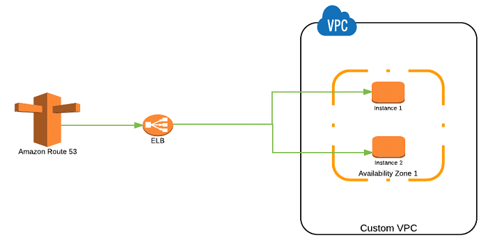
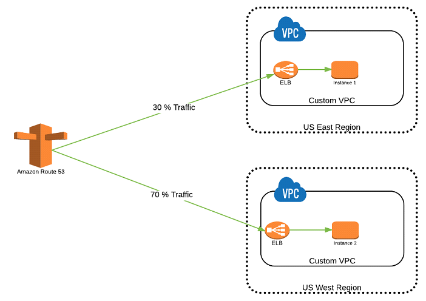
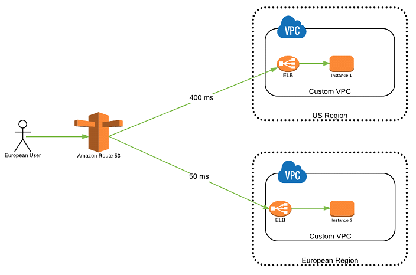
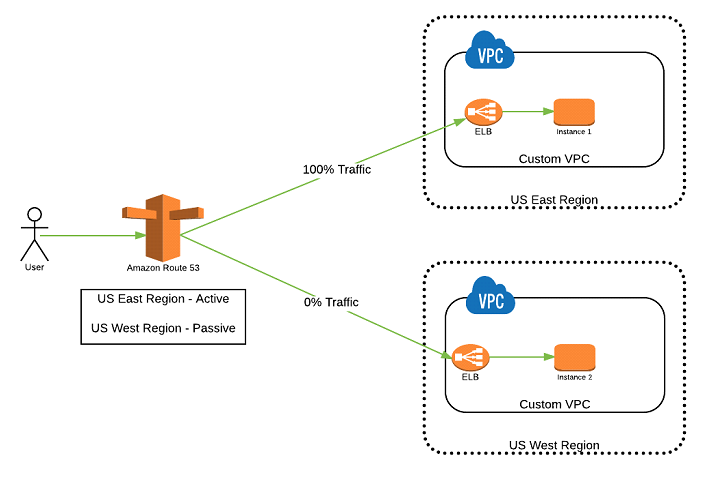
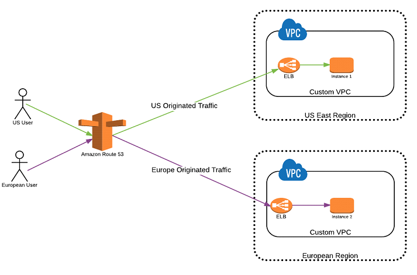
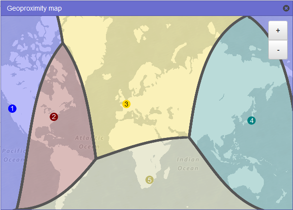

# AWS — Amazon Route 53 — 路由策略概览

对 AWS Route 53 路由策略类型的介绍--入门指南。

当你创建一个记录，你选择了一个路由策略，它决定了 `Amazon Route 53` 如何响应查询。

- **简单路由策略** — 用于为你的域名执行一个给定功能的单一资源，例如，一个服务于 `example.com` 网站内容的 web 服务器。
- **加权路由策略** — 按照你制定的比例将流量路由到多个资源。
- **延迟路由策略** — 当你拥有哎多个 AWS 区域的资源且你期望将流量路由到延迟最小的区域时使用。
- **故障转移路由策略** — 当你想配置主备失败切换时使用
- **地理位置路由策略** — 当你期待基于用户位置时路由流量时使用
- **地理位置临近度路由策略** — 当你期待基于你的资源所在位置，并可选地切换位置时路由流量使用
- **多值应答路由策略** — 当你期待 Route 53 对 DNS 查询最多随机返回至多 8 条记录时使用

## 简单路由策略

                                 Amazon Route 53 — 简单路由策略

简单路由策略是一个最基本的路由策略，它使用一条 A 记录来解析一个单个资源，它通常没有任何特殊的规则。例如，可以创建一个 DNS 记录来解析一个指向别名记录的域名，它可以将流量路由到向一套 EC2 分发流量的负载均衡器。

## 加权路由策略

                                 Amazon Route 53 — 加权路由策略

当多个资源服务于同一功能，并且流量需要基于一些预定义的权重分发到这些资源上时，加权路由策略就派上用场了。

## 延迟路由策略

                                 Amazon Route 53 — 延迟路由策略

当多个资源服务于同一功能，并且你期待 Route 53 以最低延迟即提供最快查询速度的资源提供 DNS 查询回复时，延迟路由策略就派上用场了。

## 故障转移路由策略

                                 Amazon Route 53 — 故障转移路由策略

故障转移路由策略用于创建主动/被动设置，例如一个站点是活跃的并服务所有的流量；另一边灾备站点处于备用状态。Route 53 利用健康检查监控主站点的健康状况。

## 地理位置路由策略

                                 Amazon Route 53 — 地理位置路由策略

地理位置路由策略用于基于从 DNS 查询发起的地理位置来路由流量。该策略允许将流量发送到与请求发起地位于同一区域的资源上，例如它允许基于用户位置的区域亲缘性。

## 地理位置临近度路由策略

                                 Amazon Route 53 — 地理位置临近度路由策略

地理位置临近度路由策略让 Amazon Route 53 基于你的资源与用户的地理位置来路由流量。你也能可选地通过指定一个值即一个偏好来来让流量或多或少地路由到一个给定资源上。一个偏好扩张或收缩了流量被路由到资源的地理区域。为了使用地理位置临近度路由策略，你必须使用Route 53 [流量工作流](https://docs.aws.amazon.com/Route53/latest/DeveloperGuide/traffic-flow.html)。

## 多值应答路由策略

                                 Amazon Route 53 — 多值应答路由策略

多值应答路由策略很像简单路由策略，但它能够为你的 Web 服务器的 DNS 查询返回多个值如多个 IP 地址。你可以为任意一条记录指定多个值，但多值应路由也让你检查了每一个资源的健康状态，因此Route 53 仅仅返回健康的资源。它并不是负载均衡器的替代品，但能够返回多个经过健康检查的 IP 地址的能力也是一种使用 DNS 来改善可用性以及负载均衡的方式。

## Reference
- [AWS — Amazon Route 53 — Routing Policies Overview](https://medium.com/awesome-cloud/aws-amazon-route-53-routing-policies-overview-285cee2d4d3b)