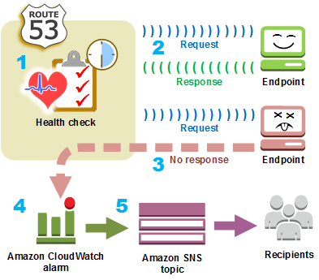

# Amazon Route 53
## 1. Amazon Route 53 是什么？
Amazon Route 53 是一种具有很高可用性和可扩展性的域名系统 (DNS) Web 服务。您可以使用 Route 53 以任意组合执行三个主要功能：域名注册（domain registration）、DNS 路由（DNS routing）和运行状况检查（health checking）。如果您选择使用 Route 53 来执行所有这三种功能，请按以下顺序执行步骤：
1。注册域名
   您的网站需要一个名称，如 example.com。利用 Route 53 可以为您的网站或 Web 应用程序注册一个名称，称为域名。
   + 有关概述，请参阅[域注册的工作原理](https://docs.aws.amazon.com/zh_cn/Route53/latest/DeveloperGuide/welcome-domain-registration.html)。
   + 有关步骤，请参阅[注册新域](https://docs.aws.amazon.com/zh_cn/Route53/latest/DeveloperGuide/domain-register.html)。
   + 有关指导您注册域并在 Amazon S3 存储桶中创建简单网站的教程，请参阅[Amazon Route 53 入门](https://docs.aws.amazon.com/zh_cn/Route53/latest/DeveloperGuide/getting-started.html)。
2. 将 Internet 流量路由到您的域的资源
   当用户打开 Web 浏览器并在地址栏中输入您的域名 (example.com) 或子域名 (acme.example.com) 时，Route 53 会帮助将浏览器与您的网站或 Web 应用程序相连接。
   + 有关概述，请参阅[如何将 Internet 流量路由到您的网站或 Web 应用程序](https://docs.aws.amazon.com/zh_cn/Route53/latest/DeveloperGuide/welcome-dns-service.html)。
   + 有关步骤，请参阅[将 Amazon Route 53 配置为 DNS 服务](https://docs.aws.amazon.com/zh_cn/Route53/latest/DeveloperGuide/dns-configuring.html)。
3. 检查资源的运行状况
   Route 53 会通过 Internet 将自动请求发送到资源（如 Web 服务器），以验证其是否可访问、可用且功能正常。您还可以选择在资源变得不可用时接收通知，并可选择将 Internet 流量从运行状况不佳的资源路由到别处。
   + 有关概述，请参阅[Amazon Route 53 如何检查您的资源的运行状况](https://docs.aws.amazon.com/zh_cn/Route53/latest/DeveloperGuide/welcome-health-checks.html)。
   + 有关步骤，请参阅[创建 Amazon Route 53 运行状况检查和配置 DNS 故障转移](https://docs.aws.amazon.com/zh_cn/Route53/latest/DeveloperGuide/dns-failover.html)。
### 1.1 域注册的工作原理
如果要创建网站或 Web 应用程序，请首先注册您的网站的名称，称为[domain name](https://docs.aws.amazon.com/zh_cn/Route53/latest/DeveloperGuide/route-53-concepts.html#route-53-concepts-domain-name)。您的域名是用户在浏览器中输入以显示您的网站的名称 (如 example.com)。

以下是如何向 Amazon Route 53 注册域名的概述：
1. 选择一个域名并确认它是可用的，也就是说，没有人已经注册了您想要的域名。

  如果您想要的域名已经在使用，则您可以尝试其他名称，或尝试仅将顶级域 (例如 .com) 更改为另一个顶级域名，如 .ninja 或 .hockey。有关 Route 53 支持的顶级域的列表，请参阅[可在 Amazon Route 53 注册的域](https://docs.aws.amazon.com/zh_cn/Route53/latest/DeveloperGuide/registrar-tld-list.html)。
2. 向 Route 53 注册域名。注册域时，您可以提供域所有者和其他联系人的姓名和联系信息。

   当您向 Route 53 注册域时，相应服务将会通过执行以下操作自动将其自身设为域的 DNS 服务：
   - 创建与您的域具有相同名称的[hosted zone](https://docs.aws.amazon.com/zh_cn/Route53/latest/DeveloperGuide/route-53-concepts.html#route-53-concepts-hosted-zone)。
   - 将一组由四个名称服务器构成的名称服务器组分配给托管区域。当有人使用浏览器访问您的网站时，例如```www.example.com```。这些名称服务器会告诉浏览器在哪里可以找到您的资源，例如Web服务器或 Amazon S3 桶([Amazon S3](https://docs.aws.amazon.com/s3/)是用于存储和检索Web上任意位置的任何量数据的对象存储。存储桶是S3中存储的对象容器。)
   - 从托管区域获取名称服务器，并将其添加到域中。

   有关更多信息，请参阅[如何将 Internet 流量路由到您的网站或 Web 应用程序](https://docs.aws.amazon.com/zh_cn/Route53/latest/DeveloperGuide/welcome-dns-service.html)。
3. 在注册过程结束时，我们会将您的信息发送给域注册商。[domain registrar](https://docs.aws.amazon.com/zh_cn/Route53/latest/DeveloperGuide/route-53-concepts.html#route-53-concepts-domain-registrar)为 Amazon Registrar, Inc. 或我们的注册商合作者 Gandi。要确定您的域的注册商是谁，请参阅[可在 Amazon Route 53 注册的域](https://docs.aws.amazon.com/zh_cn/Route53/latest/DeveloperGuide/registrar-tld-list.html)。
4. 该注册商会将您的信息发送给域的注册机构。注册机构是销售一个或多个顶级域 (如 .com) 的域注册的公司。
5. 注册机构将有关您的域的信息存储在其自己的数据库中，并将一些信息存储在公共 WHOIS 数据库中。

有关如何注册域名的更多信息，请参阅[注册新域](https://docs.aws.amazon.com/zh_cn/Route53/latest/DeveloperGuide/domain-register.html)。

如果您已经向另一个注册商注册了域名，则可以选择将该域注册转移到 Route 53。使用其他 Route 53 功能则不需要执行此操作。有关更多信息，请参阅[将域注册转移到 Amazon Route 53](https://docs.aws.amazon.com/zh_cn/Route53/latest/DeveloperGuide/domain-transfer-to-route-53.html)。
### 1.2 如何将 Internet 流量路由到您的网站或 Web 应用程序
Internet 上的所有计算机 (从您的智能手机或笔记本电脑，到为海量零售网站提供内容的服务器)，均通过使用数字相互通信。称为 IP 地址的这些数字采用以下格式之一：
- Internet 协议版本 4 (IPv4) 格式，比如 192.0.2.44
- Internet 协议版本 6 (IPv6) 格式，比如 2001:0db8:85a3:0000:0000:abcd:0001:2345

当您打开浏览器访问某个网站时，您不需要记住并输入像这么长的一串字符。相反，您可以输入像 ```example.com``` 这样的域名，仍然可访问预期的网站。DNS 服务 (如 Amazon Route 53) 有助于在域名和 IP 地址之间建立连接。
#### 有关对 Amazon Route 53 进行配置以路由域 Internet 流量的概述(route internet traffic for your domain)
下面概述了如何使用 Amazon Route 53 控制台来注册域名，以及将 Route 53 配置为将 Internet 流量路由到您的网站或 Web 应用程序。
1. 您注册希望用户用于访问您的内容的域名。有关概述，请参阅[域注册的工作原理](https://docs.aws.amazon.com/zh_cn/Route53/latest/DeveloperGuide/welcome-domain-registration.html)。
2. 注册您的域名后，Route 53 会自动创建与该域的名称相同的公共托管区域。有关更多信息，请参阅[使用公有托管区域](https://docs.aws.amazon.com/zh_cn/Route53/latest/DeveloperGuide/AboutHZWorkingWith.html)。
3. 要将流量路由到您的资源，请在您的托管区域中创建记录 (也称为资源记录集)。每个记录都包含有关如何要为您的域路由流量的信息，比如：
   + 姓名
     记录的名称对应于您希望 Route 53 对其路由流量的域名 (example.com) 或子域名 (www.example.com、retail.example.com)。

     托管区域中每个记录的名称必须以托管区域的名称结尾。例如，如果托管区域的名称为 example.com，则所有记录名称均必须以 example.com 结尾。Route 53 控制台会为您自动执行此操作。
   + Type
     记录类型通常决定了您希望流量路由到的资源的类型。例如，要将流量路由到电子邮件服务器，请将“Type”指定为“MX”。要将流量路由到具有 IPv4 IP 地址的 Web 服务器，请将“Type”指定为“A”。
   + Value
     “Value”与“Type”密切相关。如果您将“Type”指定为“MX”，则对“Value”指定一个或多个电子邮件服务器的名称。如果您将“Type”指定为“A”，则指定 IPv4 格式的 IP 地址，比如 192.0.2.136。

有关记录的更多信息，请参阅[使用记录](https://docs.aws.amazon.com/zh_cn/Route53/latest/DeveloperGuide/rrsets-working-with.html)。

您还可以创建特殊的 Route 53 记录（称为别名记录），这些记录会将流量路由到 Amazon S3 存储桶、Amazon CloudFront 分配和其他 AWS 资源。有关更多信息，请参阅[在别名记录和非别名记录之间进行选择](https://docs.aws.amazon.com/zh_cn/Route53/latest/DeveloperGuide/resource-record-sets-choosing-alias-non-alias.html)和[将 Internet 流量路由到您的 AWS 资源](https://docs.aws.amazon.com/zh_cn/Route53/latest/DeveloperGuide/routing-to-aws-resources.html)。

有关将 Internet 流量路由到您的资源的更多信息，请参阅[将 Amazon Route 53 配置为 DNS 服务](https://docs.aws.amazon.com/zh_cn/Route53/latest/DeveloperGuide/dns-configuring.html)。
#### Amazon Route 53 如何为您的域路由流量
在您将 Amazon Route 53 配置为将 Internet 流量路由到您的资源（比如 Web 服务器或 Amazon S3 存储桶）之后，当有人请求 www.example.com 的内容时，将在短短几毫秒内发生以下情况：


1. 用户打开 Web 浏览器并在地址栏中输入 `www.example.com`，然后按 Enter。
2. 将对 `www.example.com` 的请求路由到 DNS 解析程序，该解析程序通常由用户的 Internet 服务提供商 (ISP) (比如有线 Internet 提供商、DSL 宽带提供商或企业网络) 进行管理。
3. ISP 的 DNS 解析程序将对 www.example.com 的请求转发到 DNS 根名称服务器。
4. DNS 解析程序将再次转发对 www.example.com 的请求，而这次会转发到 .com 域的其中一个 TLD 名称服务器。.com 域的名称服务器使用与 example.com 域关联的四个 Route 53 名称服务器的名称来响应该请求。

  DNS 解析程序会缓存 (存储) 四个 Route 53 名称服务器。下次有人浏览到 example.com 时，解析程序将跳过步骤 3 和 4，因为它已缓存了 example.com 的名称服务器。名称服务器通常缓存时长为两天。
5. DNS 解析程序选择一个 Route 53 名称服务器，并将对 www.example.com 的请求转发到该名称服务器。
6. Route 53 名称服务器在 example.com 托管区域中查找 www.example.com 记录、获取关联值 (比如 Web 服务器的 IP 地址 192.0.2.44)，并将该 IP 地址返回到 DNS 解析程序。
7. DNS 解析程序最终将获得用户所需的 IP 地址。解析程序将该值返回给 Web 浏览器。
   > **注意**：DNS 解析程序还会将 example.com 的 IP 地址缓存您指定的一段时间，以便在下次有人浏览到 example.com 时，它可以更快地做出响应。有关更多信息，请参阅[time to live (TTL)](https://docs.aws.amazon.com/zh_cn/Route53/latest/DeveloperGuide/route-53-concepts.html#route-53-concepts-time-to-live)。

8. Web 浏览器将对 www.example.com 的请求发送到它从 DNS 解析程序那里获得的 IP 地址。这是您的内容所在的位置，例如，在 Amazon EC2 实例上运行的 Web 服务器，或配置为网站终端节点的 Amazon S3 存储桶。
9. 192.0.2.44 上的 Web 服务器或其他资源将 www.example.com 的网页返回到 Web 浏览器，而 Web 浏览器会显示该页面。
### 1.3 Amazon Route 53 如何检查您的资源的运行状况
Amazon Route 53 运行状况检查可监控您的资源 (如 Web 服务器和电子邮件服务器) 的运行状况。您可以选择为运行状况检查配置 Amazon CloudWatch 警报，以便在资源变得不可用时收到通知。

如果您希望在资源变得不可用时收到通知，下面概述了运行状况检查的工作原理：



1. 您创建运行状况检查，并指定用于定义您希望运行状况检查如何工作的值，例如：
   - 您希望 Route 53 监控的终端节点 (如 Web 服务器) 的 IP 地址或域名。(您还可以监控其他运行状况检查的状态或 CloudWatch 警报的状态。)
   - 您想要的协议 Amazon Route 53 用于执行检查: HTTP、HTTPS或TCP。
   - 您希望 Route 53 向终端节点发送请求的频率，也就是请求时间间隔。
   - 在 Route 53 认为终端节点运行状况不佳之前，终端节点必须尝试响应请求的连续次数，也就是失败阈值。
   - (可选) 当 Route 53 检测到终端节点运行状况不佳时，您希望接收通知的方式。当您配置通知时，Route 53 会自动设置 CloudWatch 警报。CloudWatch 使用 Amazon SNS 通知用户终端节点运行状况不佳。
2. Route 53 开始以您在运行状况检查中指定的时间间隔向终端节点发送请求。
   如果终端节点响应请求，则 Route 53 会认为终端节点运行状况良好，因此不会采取任何措施。
3. 如果终端节点没有响应请求，则 Route 53 会开始计算终端节点未响应的连续请求的计数：
   - 如果计数达到为失败阈值指定的值，则 Route 53 会认为终端节点运行状况不佳。
   - 如果在计数达到失败阈值之前终端节点开始再次响应，则 Route 53 会将计数重置为 0，而 CloudWatch 不会与您联系。
4. 如果 Route 53 认为终端节点运行状况不佳，并且您配置了运行状况检查通知，则 Route 53 会通知 CloudWatch。
   如果您没有配置通知，则仍然可以在 Route 53 控制台中看到 Route 53 运行状况检查的状态。有关更多信息，请参阅[监控运行状况检查状态和获取通知](https://docs.aws.amazon.com/zh_cn/Route53/latest/DeveloperGuide/health-checks-monitor-view-status.html)。
5. 如果您配置了运行状况检查通知，则 CloudWatch 会触发警报，并使用 Amazon SNS 向指定收件人发送通知。

除了检查指定终端节点的运行状况之外，您还可以将运行状况检查配置为检查一个或多个其他运行状况检查的运行状况，以便在指定数量的资源 (如五个 Web 服务器中的两个) 不可用时收到通知。您还可以将运行状况检查配置为检查 CloudWatch 警报的状态，以便您可以根据广泛的标准收到通知，而不仅仅限于资源是否响应请求。

如果您有执行相同功能的多个资源 (例如 Web 服务器或数据库服务器)，并且您希望 Route 53 仅将流量路由到运行状况良好的资源，则可以通过将运行状况检查与相应资源的每个记录相关联，来配置 DNS 故障转移。如果运行状况检查确定基础资源运行状况不佳，则 Route 53 会将流量从相关联的记录路由到别处。

有关使用 Route 53 监控资源运行状况的更多信息，请参阅[创建 Amazon Route 53 运行状况检查和配置 DNS 故障转移](https://docs.aws.amazon.com/zh_cn/Route53/latest/DeveloperGuide/dns-failover.html)。
### 1.4 Amazon Route 53 概念
#### 域注册概念
- **域名**（domain name）
  用户在 Web 浏览器的地址栏中键入的名称 (比如 example.com)，用于访问某个网站或 Web 应用程序。要使您的网站或 Web 应用程序在 Internet 上可用，您首先要注册一个域名。有关更多信息，请参阅[域注册的工作原理](https://docs.aws.amazon.com/zh_cn/Route53/latest/DeveloperGuide/welcome-domain-registration.html)。
- **域注册商**（domain registrar）
  经 Internet 名称和数字地址分配机构 (ICANN) 认可的公司，旨在处理特定顶级域 (TLD) 的域注册。例如，Amazon Registrar, Inc. 是 .com、.net 和 .org 域的域注册商。我们的注册商合作者 Gandi 是数百个 TLD (比如 .apartments、.boutique 和 .camera) 的域注册商。有关更多信息，请参阅[可在 Amazon Route 53 注册的域](https://docs.aws.amazon.com/zh_cn/Route53/latest/DeveloperGuide/registrar-tld-list.html)。
- **域注册机构**（domain registry）
  有权销售具有一个特定顶级域的域的公司。例如，[VeriSign](http://www.verisign.com/) 是有权销售具有一个 .com TLD 的域的注册机构。域注册机构可定义注册域的规则，比如地理 TLD 的住所要求。域注册机构还会维护具有相同 TLD 的所有域名的权威数据库。注册机构的数据库中包含一些信息，比如每个域的联系人信息和名称服务器等。
- **域经销商**（domain reseller）
  出售注册商（比如 Amazon Registrar）的域名的公司。Amazon Route 53 是 Amazon Registrar 和我们的注册商合作者 Gandi 的域经销商。
- **顶级域 (TLD)**（top-level domain (TLD)）
  域名的最后一部分，比如 .com、.org 或 .ninja。有两种类型的顶级域：
  + 通用顶级域
    这些 TLD 通常会让用户知道他们能够在相应网站上找到什么内容。例如，具有 TLD .bike 的域名通常与摩托车或自行车企业或组织的网站有关。除了少数例外情况外，您可以使用任何您想要的通用 TLD，因此自行车俱乐部可将 .hockey TLD 用于其域名。
  + 地理顶级域
    这些 TLD 与地理区域 (如国家/地区或城市) 相关。有些地理 TLD 注册机构具有住所要求，而有些地理 TLD 注册机构 (比如 .io（英属印度洋领地）) 则允许甚至鼓励将其用作通用 TLD。

  有关向 Route 53 注册域名时可以使用的 TLD 的列表，请参阅[可在 Amazon Route 53 注册的域](https://docs.aws.amazon.com/zh_cn/Route53/latest/DeveloperGuide/registrar-tld-list.html)。
#### 域名系统 (DNS) 概念
- **别名记录**（alias record）
  您可以使用 Amazon Route 53 创建的一种记录，用于将流量路由到 AWS 资源（如 Amazon CloudFront 分配和 Amazon S3 存储桶）。有关更多信息，请参阅[在别名记录和非别名记录之间进行选择](https://docs.aws.amazon.com/zh_cn/Route53/latest/DeveloperGuide/resource-record-sets-choosing-alias-non-alias.html)。
- **权威名称服务器**（authoritative name server）
  一个名称服务器，该名称服务器具有关于域名系统 (DNS) 的一部分的明确信息，并通过返回适用的信息响应来自 DNS 解析程序的请求。例如，.com 顶级域 (TLD) 的权威名称服务器知道每个已注册 .com 域的名称服务器的名称。当 .com 权威名称服务器收到来自 example.com 的 DNS 解析程序的请求时，它会使用 example.com 域的 DNS 服务的名称服务器的名称进行响应。

  Route 53 名称服务器是将 Route 53 用作 DNS 服务的每个域的权威名称服务器。这些名称服务器知道，您希望如何基于您在域的托管区域中创建的记录来路由您的域和子域的流量。（Route 53 名称服务器可存储将 Route 53 用作 DNS 服务的域的托管区域。）

  例如，如果 Route 53 名称服务器收到对 www.example.com 的请求，它将找到该记录并返回记录中指定的 IP 地址 (如 192.0.2.33)。
- **DNS 查询**（DNS query）
  通常为由某个设备 (比如计算机或智能手机) 向与某域名关联的资源的域名系统 (DNS) 提交的请求。DNS 查询最常见的示例是，用户打开浏览器并在地址栏中键入域名。对 DNS 查询的响应通常是与诸如 Web 服务器之类的资源相关联的 IP 地址。发出请求的设备使用该 IP 地址与资源进行通信。例如，浏览器可以使用该 IP 地址从 Web 服务器中获取某个网页。
- **DNS 解析程序**（DNS resolver）
  通常由 Internet 服务提供商 (ISP) 管理的 DNS 服务器，充当用户请求与 DNS 名称服务器之间的中介。当您打开浏览器并在地址栏中输入域名时，您的查询将首先发送到 DNS 解析程序。该解析程序会与 DNS 名称服务器通信，以获取相应资源 (比如 Web 服务器) 的 IP 地址。DNS 解析程序也称为递归名称服务器，因为它会将请求发送到一系列权威 DNS 名称服务器，直到它获得返回到用户设备 (例如，笔记本电脑上的 Web 浏览器) 的响应 (通常为 IP 地址)。
- **域名系统 (DNS)**（Domain Name System (DNS)）
  一个全球服务器网络，可帮助计算机、智能手机、平板电脑和其他已启用 IP 的设备之间相互通信。域名系统会将容易理解的名称 (例如 example.com) 转换为数字，这些数字称为 IP 地址，允许计算机在 Internet 上相互找到对方。

  另请参阅[IP address](https://docs.aws.amazon.com/zh_cn/Route53/latest/DeveloperGuide/route-53-concepts.html#route-53-concepts-ip-address)。
- **托管区域**（hosted zone）
  一个记录容器，其中包含有关您希望如何路由域 (比如 example.com) 及其所有子域 (比如 www.example.com、retail.example.com 和 seattle.accounting.example.com) 的流量的信息。托管区域具有与相应域相同的名称。

  例如，example.com 的托管区域可能包括如下两个记录：一个记录具有关于将 www.example.com 的流量路由到 IP 地址为 192.0.2.243 的 Web 服务器的信息；另一个记录具有关于将 example.com 的电子邮件路由到两个电子邮件服务器 (mail1.example.com 和 mail2.example.com) 的信息。每个电子邮件服务器还需要自己的记录。

  另请参阅[record (DNS record)](https://docs.aws.amazon.com/zh_cn/Route53/latest/DeveloperGuide/route-53-concepts.html#route-53-concepts-resource-record-set)。
- **IP 地址**（IP address）
  分配给 Internet 上某个设备（例如笔记本电脑、智能手机或 Web 服务器）的一个数字，允许该设备与 Internet 上的其他设备进行通信。IP 地址采用以下格式之一：
  + Internet 协议版本 4 (IPv4) 格式，比如 192.0.2.44
  + Internet 协议版本 6 (IPv6) 格式，比如 2001:0db8:85a3:0000:0000:abcd:0001:2345

  Route 53 支持 IPv4 和 IPv6 地址，以用于以下用途：
  + 您可以创建类型为 A (针对 IPv4 地址) 或类型为 AAAA (针对 IPv6 地址) 的记录。
  + 您可以创建将请求发送到 IPv4 或 IPv6 地址的运行状况检查。
  + 如果 DNS 解析程序在 IPv6 网络上，则它可以使用 IPv4 或 IPv6 向 Route 53 提交请求。
- **名称服务器**（name servers）
  域名系统 (DNS) 中的服务器，可帮助将域名转换为计算机用于彼此相互通信的 IP 地址。名称服务器为递归名称服务器 (也称为 DNS resolver) 或authoritative name server。

  有关 DNS 如何将流量路由到您的资源的概述（包括 Route 53 在此过程中的作用），请参阅[Amazon Route 53 如何为您的域路由流量](https://docs.aws.amazon.com/zh_cn/Route53/latest/DeveloperGuide/welcome-dns-service.html#welcome-dns-service-how-route-53-routes-traffic)。
- **私有 DNS**（private DNS）
  域名系统 (DNS) 的本地版本，允许您将域及其子域的流量路由到一个或多个 Amazon Virtual Private Cloud (VPC) 内的 Amazon EC2 实例。有关更多信息，请参阅[使用私有托管区域](https://docs.aws.amazon.com/zh_cn/Route53/latest/DeveloperGuide/hosted-zones-private.html)。
- **记录 (DNS 记录)**（record (DNS record)）
  托管区域中的一个对象，用于定义您要如何路由域或子域的流量。例如，您可以为 example.com 和 www.example.com 创建记录，将流量路由到 IP 地址为 192.0.2.234 的 Web 服务器。

  有关记录的更多信息（包括有关由特定于 Route 53 的记录所提供功能的信息），请参阅将[Amazon Route 53 配置为 DNS 服务](https://docs.aws.amazon.com/zh_cn/Route53/latest/DeveloperGuide/dns-configuring.html)。
- **递归名称服务器**（recursive name server）
  请参阅[DNS resolver](https://docs.aws.amazon.com/zh_cn/Route53/latest/DeveloperGuide/route-53-concepts.html#route-53-concepts-dns-resolver)。
- **可重用的委派集**（reusable delegation set）
  一组可用于多个托管区域的四个权威名称服务器。默认情况下，Route 53 会将随机选择的名称服务器分配给每个新的托管区域。为了更轻松地将大量域的 DNS 服务迁移到 Route 53，您可以创建可重用委派集，然后将可重用委派集与新的托管区域相关联。(您无法更改与现有托管区域相关联的名称服务器。)

  创建一个可重用委派集，并以编程方式将其与托管区域相关联；不支持使用 Route 53 控制台。有关更多信息，请参阅 https://docs.aws.amazon.com/Route53/latest/APIReference/API_CreateHostedZone.html中的 CreateHostedZone 和 Amazon Route 53 API ReferenceCreateReusableDelegationSet。[AWS 开发工具包](https://docs.aws.amazon.com/)、[AWS Command Line Interface](https://docs.aws.amazon.com/cli/latest/reference/route53/index.html)和[适用于 Windows PowerShell 的 AWS 工具](https://docs.aws.amazon.com/powershell/latest/reference/)中也提供了相同的功能。
- **路由策略**（routing policy）
  用于确定 Route 53 如何响应 DNS 查询的记录设置。Route 53 支持以下路由策略：
  + **简单路由策略** – 用于将 Internet 流量路由到为您的域执行给定功能的单一资源（例如，为 example.com 网站提供内容的 Web 服务器）。
  + **故障转移路由策略** – 如果您想要配置主动-被动故障转移，则可以使用该策略。
  + **地理位置路由策略** – 用于根据用户的位置将 Internet 流量路由到您的资源。
  + **地理位置临近度路由策略** – 用于根据资源的位置来路由流量，以及（可选）将流量从一个位置中的资源转移到另一个位置中的资源。
  + **延迟路由策略** – 如果您的资源位于多个位置，并且您想要将流量路由到提供最佳延迟的资源，则可以使用该策略。
  + **多值应答路由策略** – 如果您想要让 Route 53 用随机选择的正常记录（最多八条）响应 DNS 查询，则可以使用该策略。
  + **加权路由策略** – 用于按照您指定的比例将流量路由到多个资源。

  有关更多信息，请参阅[选择路由策略](https://docs.aws.amazon.com/zh_cn/Route53/latest/DeveloperGuide/routing-policy.html)。
- **子域**（subdomain）
  一个域名，该域名拥有添加到已注册域名前面的一个或多个标签。例如，如果您注册了域名 example.com，则 www.example.com 为子域。如果您为 example.com 域创建了托管区域 accounting.example.com，则 seattle.accounting.example.com 为子域。

  要为子域路由流量，请创建一个具有所需名称 (如 www.example.com) 的记录，并指定适用的值，例如 Web 服务器的 IP 地址。
- **生存时间 (TTL)**（time to live (TTL)）
  在向 Route 53 提交另一个请求以获取记录的当前值之前，您希望 DNS 解析程序缓存 (存储) 该记录的值的时间量 (以秒为单位)。如果 DNS 解析程序在 TTL 到期之前收到对同一个域的另一个请求，则该解析程序将返回缓存的值。

  较长的 TTL 会降低您的 Route 53 费用，这一点部分取决于 Route 53 响应的 DNS 查询的数量。在更改记录中的值 (例如通过更改 www.example.com 的 Web 服务器的 IP 地址) 后，较短的 TTL 会缩短 DNS 解析程序将流量路由到较旧资源的时间量。
#### 运行状况检查概念
- **DNS 故障转移**（DNS failover）
  将流量从运行状况不佳的资源路由到运行状况良好的资源的一种方法。当您有多个资源（例如，多个 Web 服务器或邮件服务器）执行同一功能时，可以将 Route 53 运行状况检查配置为检查您的资源的运行状况，并在您的托管区域中配置记录，以便仅将流量路由到运行状况良好的资源。

  有关更多信息，请参阅[配置 DNS 故障转移](https://docs.aws.amazon.com/zh_cn/Route53/latest/DeveloperGuide/dns-failover-configuring.html)。

- **endpoint**
  您将运行状况检查配置为监控其运行状况的资源 (比如 Web 服务器或电子邮件服务器)。您可以通过 IPv4 地址 (192.0.2.243)、IPv6 地址 (2001:0db8:85a3:0000:0000:abcd:0001:2345) 或通过域名 (example.com) 指定终端节点。

  > **注意** 您还可以创建运行状况检查，以监控其他运行状况检查的状态，或监控 CloudWatch 警报的警报状态。
- **运行状况检查**（health check）
  一个 Route 53 组件，让您可以执行以下操作：
  - 监控指定终端节点 (比如 Web 服务器) 的运行状况是否良好
  - (可选) 当某个终端节点运行状况不佳时收到通知
  - (可选) 配置 DNS 故障转移，从而让您可以将 Internet 流量从运行状况不佳的资源重新路由到运行状况良好的资源

  有关如何创建和使用运行状况检查的更多信息，请参阅[创建 Amazon Route 53 运行状况检查和配置 DNS 故障转移](https://docs.aws.amazon.com/zh_cn/Route53/latest/DeveloperGuide/dns-failover.html)。
### 1.5 如何开始使用 Amazon Route 53
有关 Amazon Route 53 入门的信息，请参阅本指南中的以下主题：
- [设置 Amazon Route 53](https://docs.aws.amazon.com/zh_cn/Route53/latest/DeveloperGuide/setting-up-route-53.html)，其中说明了如何注册 AWS、如何安全地访问您的 AWS 账户，以及如何设置 Route 53 的编程访问
- [Amazon Route 53 入门](https://docs.aws.amazon.com/zh_cn/Route53/latest/DeveloperGuide/getting-started.html)，其中阐述了如何注册域名、如何创建 Amazon S3 存储桶并将其配置为托管静态网站，以及如何将 Internet 流量路由到网站
### 1.6 相关服务
有关 Amazon Route 53 所集成的 AWS 服务的信息，请参阅[与其他服务集成](https://docs.aws.amazon.com/zh_cn/Route53/latest/DeveloperGuide/integration-with-other-services.html)。
### 1.7 访问Amazon Route 53
您可以通过下列方式访问 Amazon Route 53：
- AWS 管理控制台 – 该指南中的过程介绍了如何使用 AWS 管理控制台执行任务。
- AWS 开发工具包 – 如果使用 AWS 提供了开发工具包的编程语言，您可以使用开发工具包访问 Route 53。开发工具包可简化身份验证，与开发环境轻松集成，并有助于轻松访问 Route 53 命令。有关 更多信息，请参阅适用于 [Amazon Web Services 的工具](https://aws.amazon.com/tools)。
- Route 53 API – 如果要使用开发工具包不可用的编程语言，请参阅 [Amazon Route 53 API Reference](https://docs.aws.amazon.com/Route53/latest/APIReference/) 以了解有关 API 操作及如何发出 API 请求的信息。
- AWS Command Line Interface – 有关更多信息,请参阅[准备 AWS Command Line Interface](https://docs.aws.amazon.com/cli/latest/userguide/) 在 AWS Command Line Interface 用户指南.
- 适用于 Windows PowerShell 的 AWS 工具 – 有关更多信息，请参阅[适用于 Windows PowerShell 的 AWS 工具](https://docs.aws.amazon.com/powershell/latest/userguide/)中的设置适用于 Windows PowerShell 的 AWS 工具 用户指南。
### 1.8 AWS Identity and Access Management
Amazon Route 53 与 AWS Identity and Access Management (IAM) 集成，后者是让您可以执行以下操作的服务：
- Create users and groups under your organization's AWS account
- 轻松地在账户中的用户间共享您的 AWS 账户资源
- 为每个用户分配具有唯一性的安全凭证
- 精确地控制用户访问服务和资源的权限

例如，您可以将 IAM 与 Route 53 结合使用，以控制您的 AWS 账户中的哪些用户可以创建新的托管区域或更改记录。

有关 IAM 的一般信息，请参阅以下内容：
- [Amazon Route 53 中的 Identity and access management](https://docs.aws.amazon.com/zh_cn/Route53/latest/DeveloperGuide/auth-and-access-control.html)
- [Identity and Access Management (IAM)](https://aws.amazon.com/iam/)
- [IAM 用户指南](https://docs.aws.amazon.com/IAM/latest/UserGuide/)
### 1.9 Amazon Route 53 定价和计费
与其他 AWS 产品一样，在使用 Amazon Route 53 时，您无需签订合同或承诺最低使用量。您只需为您配置的托管区域和 Route 53 响应的 DNS 查询数量付费。有关更多信息，请参阅[Amazon Route 53 定价](https://aws.amazon.com/route53/pricing/)。

有关 AWS 服务账单的信息，包括如何查看账单和管理账户与付款，请参阅[AWS Billing and Cost Management 用户指南](https://docs.aws.amazon.com/awsaccountbilling/latest/aboutv2/)。
## 2. 设置
本节中的概述和步骤将帮助您开始使用 AWS。
### 2.1 注册 AWS
在注册 AWS 时，将为您的 AWS 账户自动注册 AWS 中的所有服务，包括 Amazon Route 53。您只需为使用的服务付费。

如果您已具有 AWS 账户，请跳到[访问您的账户](https://docs.aws.amazon.com/zh_cn/Route53/latest/DeveloperGuide/setting-up-route-53.html#setting-up-access-account)。如果您还没有 AWS 账户，请使用以下步骤创建。

创建 AWS 账户
1. 打开 https://portal.aws.amazon.com/billing/signup。
2. 按照屏幕上的说明进行操作。

   在注册时，您将接到一通电话，要求您使用电话键盘输入一个验证码。

记下您的 AWS 账号，稍后您会用到它。
### 2.2 访问您的账户
可以通过以下任一选项使用 AWS 服务：
1. AWS 管理控制台
2. 每个服务的 API
3. AWS Command Line Interface (AWS CLI)
4. 适用于 Windows PowerShell 的 AWS 工具
5. AWS 开发工具包

对于以上各选项，均需要提供证明您有权使用这些服务的凭证，并访问您的 AWS 账户。
#### 访问控制台
首次访问 AWS 管理控制台时，需提供电子邮件地址和密码。这一电子邮件地址和密码组合称为根身份 或根账户凭证。在您首次访问您的账户后，我们强烈建议您不要在日常工作中再次使用您的根账户凭证。而应使用 AWS Identity and Access Management 创建新的凭证。为此，应为您自己创建一个称为 IAM 用户 的用户账户，然后将该 IAM 用户添加到具有管理权限的 IAM 组中，或者为 IAM 用户授予管理权限。然后，您可以使用 IAM 用户的专门 URL 和凭证访问 AWS。您也可以在稍后添加其他 IAM 用户，并限制他们对指定资源的访问权限。
> **注意** Web 浏览器的一些广告拦截插件会干扰 Amazon Route 53 控制台操作，从而导致该控制台的行为无法预测。如果您为浏览器安装了广告阻止插件，我们建议您添加 Route 53 控制台, https://console.aws.amazon.com/route53/home 和 https://console.aws.amazon.com/route53/v2/home到插件允许的URL列表。
#### 访问 API、AWS CLI、适用于 Windows PowerShell 的 AWS 工具或 AWS 开发工具包
要使用 API、AWS CLI、适用于 Windows PowerShell 的 AWS 工具 或 AWS 开发工具包，您必须创建访问密钥。这些密钥由访问密钥 ID 和秘密访问密钥构成，用于签署您对 AWS 发出的编程请求。

要创建密钥，需登录 AWS 管理控制台。我们强烈建议您使用 IAM 用户凭证而非根凭证登录。有关更多信息,请参阅IAM 用户指南中的[管理的访问密钥 IAM 用户](https://docs.aws.amazon.com/IAM/latest/UserGuide/id_credentials_access-keys.html) 。
### 2.3 创建 IAM 用户
执行以下过程为管理员创建一个组、创建 IAM 用户然后将 IAM 用户添加到管理员组。如果您注册了 AWS 但没有为自己创建一个 IAM 用户，则可以使用 IAM 控制台来创建。如果您不熟悉如何使用该控制台，请参阅[使用 AWS 管理控制台](https://docs.aws.amazon.com/awsconsolehelpdocs/latest/gsg/getting-started.html)以了解大致情况。
#### 自行创建管理员用户并将该用户添加到管理员组（控制台）
1. 通过选择**根用户**，然后输入您的 AWS 账户的电子邮件地址，以账户拥有者身份登录到[IAM 控制台](https://console.aws.amazon.com/iam/)。在下一页上，输入您的密码。
   > **注意** 强烈建议您遵守以下使用 Administrator IAM 用户的最佳实践，妥善保存根用户凭证。只在执行少数账户和服务管理任务时才作为根用户登录。
2. 在导航窗格中，选择**用户**，然后选择**添加用户**。
3. 对于 **User name (用户名)**，输入 `Administrator`。
4. 选中 **AWS 管理控制台访问** 旁边的复选框。然后选择**自定义密码**，并在文本框中输入新密码。
5. （可选）默认情况下，AWS 要求新用户在首次登录时创建新密码。您可以清除 **User must create a new password at next sign-in (用户必须在下次登录时创建新密码) 旁边的复选框以允许新用户在登录后重置其密码**。
6. 选择下一步: **权限**。
7. 在**设置权限下**，选择**将用户添加到组**。
8. 选择**创建组**。
9.  在 **Create group (创建组)** 对话框中，对于 **Group name (组名称)**，输入 `Administrators`。
10. 选择 **Filter policies (筛选策略)**，然后选择 **AWS managed-job function (AWS 托管的工作职能)** 以筛选表内容。
11. 在策略列表中，选中 `AdministratorAccess` 的复选框。然后选择 **Create group (创建组)**。
    > **注意** 您必须先激活 IAM 用户和角色对账单的访问权限，然后才能使用 `AdministratorAccess` 权限访问 AWS Billing and Cost Management 控制台。为此，请按照“[向账单控制台委派访问权限](https://docs.aws.amazon.com/IAM/latest/UserGuide/tutorial_billing.html)”教程第 1 步中的说明进行操作。
12. 返回到组列表中，选中您的新组所对应的复选框。如有必要，选择 **Refresh** 以在列表中查看该组。
13. 选择下一步: **标签**。
14. （可选）通过以键值对的形式附加标签来向用户添加元数据。有关在 IAM 中使用标签的更多信息，请参阅 [IAM 用户指南 中的标记 IAM 实体](https://docs.aws.amazon.com/IAM/latest/UserGuide/id_tags.html)。
15. 选择 **Next: Review (下一步: 审核)** 以查看要添加到新用户的组成员资格的列表。如果您已准备好继续，请选择 **Create user**。

您可使用此相同的流程创建更多的组和用户，并允许您的用户访问 AWS 账户资源。要了解有关使用策略限制用户对特定 AWS 资源的权限的信息，请参阅[访问管理](https://docs.aws.amazon.com/IAM/latest/UserGuide/access.html)和[示例策略](https://docs.aws.amazon.com/IAM/latest/UserGuide/access_policies_examples.html)。
#### 以新 IAM 用户身份登录
1. 从 AWS 控制台注销。
2. 使用以下URL登录,其中 your_aws_account_id 是您的AWS帐号,不带连字符。例如，如果您的 AWS 账号是 `1234-5678-9012`，则您的 AWS 账户 ID 就是 `123456789012`：
   ```
   https://your_aws_account_id.signin.aws.amazon.com/console/
   ```
3. 输入您刚创建的 IAM 用户名（而不是电子邮件地址）和密码。登录后,导航栏将显示 `“your_user_name @ your_aws_account_id"`.
   如果您不希望您的登录页面 URL 包含 AWS 账户 ID，可以创建账户别名。
#### 创建账户别名及隐藏账户 ID
1. 在 IAM 控制台上，选择导航窗格中的 **Dashboard**。
2. 在控制面板上，选择 **Customize** 并输入别名，如您的公司名。
3. 从 AWS 控制台注销。
4. 使用以下 URL 登录：
   ```
   https://your_account_alias.signin.aws.amazon.com/console/
   ```

要为您的账户验证 IAM 用户的登录链接，请打开 IAM 控制台，并在控制面板上的 **IAM 用户登录链接**下面进行检查。

有关使用 IAM 的更多信息，请参阅[Amazon Route 53 中的 Identity and access management](https://docs.aws.amazon.com/zh_cn/Route53/latest/DeveloperGuide/auth-and-access-control.html)。
### 2.4 设置 AWS Command Line Interface 或 适用于 Windows PowerShell 的 AWS 工具
AWS Command Line Interface (AWS CLI) 是一个用于管理 AWS 服务的统一工具。有关如何安装和配置的信息 AWS CLI,请参阅AWS Command Line Interface 用户指南中的[准备 AWS Command Line Interface](https://docs.aws.amazon.com/cli/latest/userguide/cli-chap-getting-set-up.html) 。

如果您有使用 Windows PowerShell 的经验，则可能倾向于使用 适用于 Windows PowerShell 的 AWS 工具。有关更多信息，请参阅 适用于 Windows PowerShell 的 AWS 工具 用户指南中的[设置适用于 Windows PowerShell 的 AWS 工具](https://docs.aws.amazon.com/powershell/latest/userguide/pstools-getting-set-up.html)。
### 2.5 下载 AWS 开发工具包
如果您使用 AWS 为其提供开发工具包的编程语言，建议您使用开发工具包代替 Amazon Route 53 API。开发工具包使身份验证更简单，可以轻松地与您的开发环境集成，并提供对 Route 53 命令的轻松访问。有关更多信息，请参阅[适用于 Amazon Web Services 的工具](https://aws.amazon.com/tools/)。
## 3. 入门
此入门教程演示如何执行以下任务：
- 注册一个域名，如 example.com。
- 创建一个 Amazon S3 存储桶并将其配置为托管一个网站。
- 创建一个示例网站，并将文件保存到 S3 存储桶中
- 配置 Amazon Route 53 以将流量路由到您的新网站

完成后，您将能够打开一个浏览器，输入您的域名并查看您的网站。
> **注意** 您也可以将现有域转移到 Route 53，但与注册一个新域相比，这一过程更复杂且更耗时。有关更多信息，请参阅[将域注册转移到 Amazon Route 53](https://docs.aws.amazon.com/zh_cn/Route53/latest/DeveloperGuide/domain-transfer-to-route-53.html)。

**估算费用**
- 注册域需要缴纳年费，金额从 9 USD 到数百美元不等，具体取决于是否为顶级域，例如 .com。有关更多信息，请参阅[Route 53 域注册定价。此费用不可退款](https://d32ze2gidvkk54.cloudfront.net/Amazon_Route_53_Domain_Registration_Pricing_20140731.pdf)。
- 当您注册域时，我们会自动创建一个与该域同名的托管区域。可使用该托管区域指定希望 Route 53 将域流量路由到哪里。托管区域的费用为每月 0.50 USD。
- 在本教程中，您将创建 Amazon S3 存储桶并上传示例网页。如果您是 AWS 新客户，可以免费试用 Amazon S3。如果您是现有 AWS 客户，将根据您存储的数据量、对数据的请求量和转移的数据量收费。有关更多信息，请参阅[Amazon S3 定价](https://aws.amazon.com/s3/pricing/)。
### 3.1 Prerequisites
开始之前，请确保您已完成[设置 Amazon Route 53](https://docs.aws.amazon.com/zh_cn/Route53/latest/DeveloperGuide/setting-up-route-53.html)中的步骤。
### 3.2 第1步: 注册域
要使用某个域名 (如 example.com)，您需要找到一个尚未被他人使用的域名并注册该域名。当您注册域名时，即表示您要保留它以供您在 Internet 上的任何位置独占使用，通常为期一年。默认情况下，我们会在每年年底自动续订您的域名，但您可以禁用自动续订。
#### 使用 Amazon Route 53 注册新域
1. 登录 AWS 管理控制台并通过以下网址打开 Route 53 控制台：https://console.aws.amazon.com/route53/。
2. 如果你是新手 Route 53,选择**开始**.

   如果您已经在使用 Route 53,在导航窗格中,选择**注册域**.
3. 选择 **Register Domain**。
4. 输入要注册的域名，选择 **Check** 来了解该域名是否可用。

   有关如何指定除 a-z、0-9 和 - (连字符) 以外的字符以及如何指定国际化域名的信息，请参阅[DNS 域名格式](https://docs.aws.amazon.com/zh_cn/Route53/latest/DeveloperGuide/DomainNameFormat.html)。
5. 果该域可用，则选择 **Add to cart**。域名将出现在您的购物车中。

   **Related domain suggestions** 列表显示您可能希望注册的其他域，以在您的首选域不可用时代替首选域，或者在首选域之外注册其他域。对于您希望注册的每个额外域，选择 **Add to cart**，最多可选择五个域。

   如果域名不可用，并且您不想使用建议的域名，请重复步骤 4，直到找到一个中意的可用域名。
   > **注意** 如果您还希望用户能够使用 www.your-domain-name（如 www.example.com）来访问您的示例网站，则无需注册另一个域。在本入门主题的稍后部分，我们将解释如何将 www.your-domain-name 的流量路由到您的网站。
6. 在购物车中，选择域要注册的年数。
7 .要注册多个域，请重复步骤 4 到 6。
8. 选择 **Continue (继续)**。
9. 在 **Contact Details for Your n Domains** 页面上，输入域注册者、管理员和技术联系人的联系信息。您在此处输入的值将应用于您要注册的所有域。

  默认情况下，我们对全部三个联系人使用相同信息。如果要为一个或多个联系人输入不同信息，请将 **My Registrant, Administrative, and Technical contacts are all the same** 的值更改为 No。

  如果您要注册多个域，我们将对所有域使用相同的联系人信息。

  有关更多信息，请参阅[您在注册或转移域时指定的值](https://docs.aws.amazon.com/zh_cn/Route53/latest/DeveloperGuide/domain-register-values-specify.html)。
10. 对于某些顶级域 (TLD)，我们需要收集更多信息。对于这些 TLD，请在 **Postal/Zip Code** 字段后输入适用的值。
11. 选择是否要向 WHOIS 查询隐藏您的联系人信息。有关更多信息，请参阅以下主题：
  + [启用或禁用域联系信息的隐私保护](https://docs.aws.amazon.com/zh_cn/Route53/latest/DeveloperGuide/domain-privacy-protection.html)
  + [可在 Amazon Route 53 注册的域](https://docs.aws.amazon.com/zh_cn/Route53/latest/DeveloperGuide/registrar-tld-list.html)
12. 选择 **Continue (继续)**。
13. 检查您输入的信息，阅读服务条款，并选中相应复选框，以确认您已阅读服务条款。
14. 选择 **Complete Purchase**。
    我们会向域注册人发送一封电子邮件，以确认可以按照您指定的电子邮件地址联系注册联系人。(这是ICANN的要求。)该电子邮件来自以下电子邮件地址之一:
    + noreply@registrar.amazon.com – 用于 Amazon Registrar 注册的 TLD。
    + noreply@domainnameverification.net – 用于我们的注册商合作者 Gandi 注册的 TLD。要确定您的 TLD 注册商是谁，请参阅[可在 Amazon Route 53 注册的域](https://docs.aws.amazon.com/zh_cn/Route53/latest/DeveloperGuide/registrar-tld-list.html)。

   > **重要** 注册联系人必须按照电子邮件中的说明来确认已收到电子邮件，否则我们必须按照 ICANN 的要求暂停该域。域被暂停后，将无法在 Internet 上访问该域。

当您的域注册获批后，您将收到另一封电子邮件。要确定您的请求的最新状态，请参阅[查看域注册的状态](https://docs.aws.amazon.com/zh_cn/Route53/latest/DeveloperGuide/domain-view-status.html)。

默认情况下，域注册的有效期为一年。如果您不希望保留该域，可以禁用自动续订，则该域将在一年后过期。
#### (可选) 禁用域的自动续订
1. 在导航窗格中，选择 **Registered domains**。
2. 在域列表中，选择**域名**。
3. 如果 **Auto renew** 字段的值为 **Enabled (disable)**，则选择 **disable** 以关闭自动续订。更改会立即生效。
   如果该字段的值为 **Disabled (enable)**，则不要更改设置。
### 3.3 第2步: 创建S3bucket并将其配置为托管网站
Amazon S3 允许您从 Internet 上的任何位置存储和检索您的数据。要整理您的数据，可使用 AWS 管理控制台创建存储桶并将数据上传到存储桶。可以使用 S3 在存储桶中托管静态网站。以下步骤介绍如何创建存储桶并进行配置，以用于网站托管。
1. 通过以下网址打开 Amazon S3 控制台：https://console.aws.amazon.com/s3/。
2. 选择 **Create bucket (创建存储桶)**。
3. 输入以下值：
   - **Bucket name**
     输入域的名称，如 example.com。
    - **Region**
      选择最靠近您的大多数用户的区域。
      记下所选择的区域；稍后您将需要此信息。
4. 选择**下一步**。
5. 在**Configure options (配置选项)** 页面上，选择 **Next (下一步)** 以接受默认值。
6. 在**设置权限**页面上，取消选中 **Block all public access (阻止所有公有访问)** 复选框，然后选择 **Next (下一步)**。
   > **注意** 控制台显示有关对存储桶的公有访问权限的消息。在此过程后面，您将添加用于限制对存储桶的访问权限的存储桶策略。
7. 在 **Review (审核)** 页面上，选择 **Create bucket (创建存储桶)**。
8. 在 S3 存储桶列表中，选择刚创建的存储桶的名称。
9. 选择 **Properties** 选项卡。
10. 选择 **Static website hosting**。
11. 选择 **Use this bucket to host a website (使用此存储桶托管网站)**。
12. 对于**索引文档**，输入包含网站主页的文件的名称。
    > **注意** 在此过程中，您将创建一个 HTML 文件，稍后将其上传到您的存储桶。
13. 选择 **Save (保存)**。
14. 选择 **Permissions** 选项卡。
15. 选择**存储桶策略**。
16. 复制下面的存储桶策略并粘贴到文本编辑器中。此策略授予 Internet 上的每个人 ("Principal":"*") 权限，来获得与您的域名 ("arn:aws:s3:::your-domain-name/*") 关联的 S3 存储桶中的文件 ("Action":["s3:GetObject"])。
    ```
    {
    `   "Version":"2012-10-17",
      "Statement":[{
          "Sid":"AddPerm",
          "Effect":"Allow",
          "Principal":"*",
          "Action":[
            "s3:GetObject"
          ],
          "Resource":[
            "arn:aws:s3:::your-domain-name/*"
          ]
        }]
    }
`   ```
17. 在桶策略中,替换值 `your-domain-name` 使用域的名称,例如 `example.com`。此值必须与存储桶的名称匹配。
18. 选择 **Save (保存)**。
### 3.4 步骤3 (可选): 为www.your-domain-name创建另一个存储桶
在前面的过程中，您为域名 (如 example.com) 创建了一个存储桶。这样您的用户就可以使用您的域名 (如 example.com) 访问您的网站。

如果您还希望用户能够使用 www.your-domain-name,例如www.example.com,要访问您的示例网站,您需要创建第二个S3bucket。然后对第二个存储桶进行配置，将流量路由至第一个存储桶。
> **注意** 网站通常重定向 your-domain-name 至 www.your-domain-name，例如,从example.com到www.example.com。由于 S3 的工作方式，您必须按相反的方向设置重定向（从 www.example.com 到 example.com）。
1. 选择 **Create bucket (创建存储桶)**。
2. 输入以下值：
   - **Bucket name**
     输入 www.your-domain-name。例如,如果您注册了域名 `example.com`，请输入 `www.example.com`.
   - **Region**
     选择创建第一个存储桶时所在的同一区域。
3. 选择**下一步**。
4. 在 **Configure options (配置选项)** 页面上，选择 **Next (下一步)** 以接受默认值。
5. 在 **Set permissions (设置权限)** 页面上，选择 **Next (下一步)** 以接受默认值。
6. 在 **Review (审核)** 页面上，选择 **Create bucket (创建存储桶)**。
7. 在 S3 存储桶列表中，选择刚创建的存储桶的名称。
8. 选择 **Properties** 选项卡。
9.  选择 **Static website hosting**。
10. 选择 **Redirect requests**。
11. 输入以下值：
    - **目标存储桶或域**
       输入要将请求重定向到的存储桶的名称。这是您在过程创建一个 S3 存储桶并进行配置，以便托管一个网站中创建的存储桶的名称。
    - **协议**
       输入 http。您正在将请求重定向到配置为网站终端节点的 S3 存储桶，并且 Amazon S3 对于网站终端节点不支持 HTTPS 连接。
12. 选择 **Save (保存)**。
### 3.5 第4步: 创建网站并将其上传到您的S3bucket
现在，您有了一个可以保存网站的 S3 存储桶，您可以为网站创建首页并将其上传 (保存) 到您的存储桶。
1. 复制下面的文本并粘贴到文本编辑器中：
   ```
   <html>
    <head>
    <title>Amazon Route 53 Getting Started</title>	
    </head>

    <body>

    <h1>Routing Internet Traffic to an Amazon S3 Bucket for Your Website</h1>

    <p>For more information, see 
    <a href="https://docs.aws.amazon.com/Route53/latest/DeveloperGuide/getting-started.html">Getting Started with Amazon Route 53</a> 
    in the <emphasis>Amazon Route 53 开发人员指南</emphasis>.</p>

    </body>

   </html>
   ```
2. 保存该文件并命名为 **index.html**。
3. 在 Amazon S3 控制台中，选择[在创建一个 S3 存储桶并进行配置，以便托管一个网站](https://docs.aws.amazon.com/zh_cn/Route53/latest/DeveloperGuide/getting-started.html#getting-started-create-s3-website-bucket-procedure)过程中创建的存储桶的名称。
4. 选择 **Upload**。
5. 选择 **Add files (添加文件)**。
6. 按照屏幕上的提示选择 **index.html**，然后选择 **Upload (上传)**。
### 3.6 第5步: 将域的DNS流量路由到您的网站存储桶
现在，您的 S3 存储桶中有了一个包含一个网页的网站。要开始将您的域的 Internet 流量路由到您的 S3 存储桶，请执行以下过程。
1. 通过以下网址打开 Route 53 控制台：https://console.aws.amazon.com/route53/。
2. 在导航窗格中，选择 **Hosted zones**。
   > **注意** 当您注册域时，Amazon Route 53 将自动使用相同的名称创建一个托管区域。托管区域包含有关您希望 Route 53 如何路由域流量的信息。
3. 在托管区域列表中，选择您的域名。
4. 选择**创建记录**.
   > **注意** 每个记录都包含有关您希望如何路由某个域 (如 example.com) 或子域 (如 www.example.com 或 test.example.com) 流量的信息。记录存储在域的托管区域中。
5. 选择**简单路由** 并选择 **下一步**.
6. 选择**定义简单记录**.
7. 指定以下值：
   - **记录名称**
   - 对于您创建的第一个记录，接受默认值，该值为您的托管区域和您的域的名称。这会将 Internet 流量路由到与您的域同名的存储桶。

     如果您为 `www.your-domain-name`,请重复此步骤以创建第二条记录。对于第二个记录，输入 **www**。这会将 Internet 流量路由至 `www.your-domain-name` 桶。
   - **值/路由流量至**
   - 选择 与S3网站端点的别名,然后选择在中创建存储桶的AWS区域。

     对于您创建的第一条记录，请选择与托管区域和域名同名的存储桶。

     对于第二条记录,选择名为 www.your-domain-name.

     如果另一个帐户创建了S3bucket,请输入您在中创建S3bucket的Region(地区)的名称。使用 AWS General Reference 网站端点表中的[AmazonS3网站端点](https://docs.aws.amazon.com/general/latest/gr/s3.html#s3_website_region_endpoints).

     > **注意** 如果不同的帐户创建了托管区域和S3bucket，则您为指定的值相同 选择S3bucket 记录。 Route 53 根据记录的名称，找出将流量路由到哪个存储桶。
   - **记录类型**
   - 接受的默认值A – 将流量路由到IPv4地址和某些AWS资源.
   - **Evaluate Target Health**
     接受的默认值 **是**
8. 选择**定义简单记录**
9. 选择**创建记录**
10. 如果您为 www.your-domain-name创建了另一个S3存储桶，重复步骤4到9，在同一托管区为www.your-domain-name也创建一个记录。
### 3.7 第6步: 测试您的网站
要验证您的网站是否工作正常，请打开一个 Web 浏览器并浏览到下列 URL：
- http://your-domain-name – 键显示在 your-domain-name 存储桶中的首页
- http://www.your-domain-name – 将您的请求重定向到 your-domain-name 存储桶

在某些情况下，您可能需要清除缓存才能看到预期行为。

有关路由 Internet 流量的更多高级信息，请参阅[将 Amazon Route 53 配置为 DNS 服务](https://docs.aws.amazon.com/zh_cn/Route53/latest/DeveloperGuide/dns-configuring.html)。有关将 Internet 流量路由到 AWS 资源的更多信息，请参阅[将 Internet 流量路由到您的 AWS 资源](https://docs.aws.amazon.com/zh_cn/Route53/latest/DeveloperGuide/routing-to-aws-resources.html)。
### 3.8 步骤7(可选): 使用 Amazon CloudFront 加快内容的分发
CloudFront 是一个 Web 服务，它加快将静态和动态 Web 内容（如 .html、.css、.js 和图像文件）分发到用户的速度。CloudFront 通过全球数据中心网络传输内容，这些数据中心称为边缘站点。当用户请求您用 CloudFront 提供的内容时，用户被路由到提供最低延迟 (时间延迟) 的边缘站点，从而以尽可能最佳的性能传送内容。
- 如果该内容已经在延迟最短的边缘站点上，CloudFront 将直接提供它。
- 如果内容不在边缘站点中，CloudFront 将从已确定为内容最终版本的源的 Amazon S3 存储桶或 HTTP 服务器（例如，Web 服务器）中进行检索。

有关使用的信息 CloudFront 将内容分发到您的 Amazon S3 桶,请参见 Amazon CloudFront 开发人员指南中的[当从Amazon S3分发内容时添加 CloudFront](https://docs.aws.amazon.com/AmazonCloudFront/latest/DeveloperGuide/MigrateS3ToCloudFront.html#adding-cloudfront-to-s3) 。
## 4. 与其他服务集成
## 5. DNS 域名格式
## 6. 注册域名
## 7. 将 Amazon Route 53 配置为 DNS 服务
## 8. 解析 VPC 与您的网络之间的 DNS 查询
## 9. 将 Internet 流量路由到您的 AWS 资源
## 10. 创建 运行状况检查和配置 DNS 故障转移
### 10.1 运行状况检查的类型
### 10.2 Route 53 如何确定运行状况检查是否运行良好
### 10.3 创建、更新和删除运行状况检查
### 10.4 监控运行状况检查状态和获取通知
### 10.5 配置 DNS 故障转移
### 10.6 为运行状况检查命名和添加标签
### 10.7 使用 2012-12-12 之前的 API 版本
## 11. 安全性
## 12. Monitoring
## 13. 问题排查
## 14. IP 地址范围
## 15. 为资源添加标签
## 16. Tutorials

## Reference
- [Amazon Route 53](https://docs.aws.amazon.com/Route53/latest/DeveloperGuide/Welcome.html)