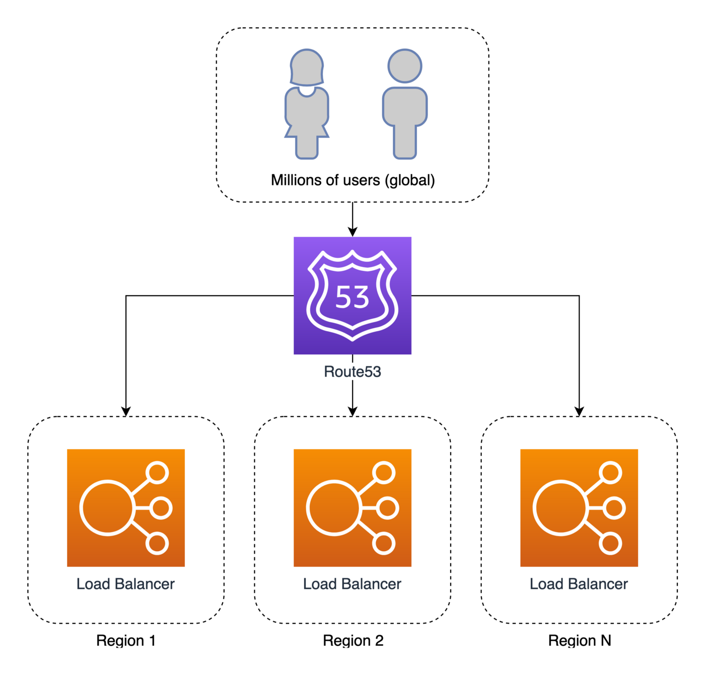

# 如何使用 Amazon Route53 来实现完美的失败切换战略

> 使用　Route53 健康检查来快速失败（切换）

如果你使用 AWS，那么 Amazon Route53 就是 DNS 的首选项。许多用户，包括我们，只使用了 Route53 所提供功能的极小部分－－它不仅仅是一个域名服务器。

## 设置

为了高可用性和容错，每个应用应该被部署到至少两个区域中。这应该是一种双活架构，而非主动－被动架构。在一个双活跃系统中，所有的区域同时使用，另一方面，主动－被动架构中备份区域仅仅在失败场景下使用。

因此，让我们来画一张架构图来展示无门想要达到的目的：

## 设置

## 设置

## 设置

## Reference
- [How to implement the perfect failover strategy using Amazon Route53](https://medium.com/dazn-tech/how-to-implement-the-perfect-failover-strategy-using-amazon-route53-1cc4b19fa9c7)
- [Using Route53 for Optimal Failover Efficiency & User Experience](https://medium.datadriveninvestor.com/using-route53-for-optimal-failover-efficiency-user-experience-5c9031a08300)
- [Amazon Route 53 Basics and Routing Policies](https://www.stormit.cloud/post/amazon-route-53)