# 使用 Terraform 在 AWS 中国区域实现自动化部署指南系列
## 第1章 Terraform概述
### 1.1 Terraform介绍
Terraform是HashiCorp公司旗下的Provision Infrastructure产品, 是AWS APN Technology Partner与AWS DevOps Competency Partner。Terraform是一个IT基础架构自动化编排工具，它的口号是“Write, Plan, and Create Infrastructure as Code”, 是一个“基础设施即代码”工具，类似于[AWS CloudFormation](https://amazonaws-china.com/cloudformation/)，允许您创建、更新和版本控制的AWS基础设施。

Terraform基于AWS Go SDK进行构建，采用HashiCorp配置语言（HCL）对资源进行编排，具体的说就是可以用代码来管理维护IT资源，比如针对AWS，我们可以用它创建、修改或删除 S3 Bucket、Lambda,、EC2、Kinesis、VPC等各种资源。并且在真正运行之前可以看到执行计划(即干运行-dryrun)。由于状态保存到文件中，因此能够离线方式查看资源情况（前提是不要在 Terraform 之外对资源进行修改）。Terraform 配置的状态除了能够保存在本地文件中，也可以保存到 Consul, S3等处。

Terraform是一个高度可扩展的工具，通过Provider来扩展对新的基础架构的支持，几乎支持所有的云服务平台，AWS只是Terraform内建 Providers 中的一种。

在Terraform诞生之前，我们对AWS资源的操作主要依赖Console、AWS CLI、SDK或Serverless。AWS CLI什么都能做，但它是无状态的，必须明确用不同的命令来创建、修改和删除。Serverless不是用来管理基础架构的，用Lambda创建资源是很麻烦的事。AWS提供的CloudFormation，虽然功能非常强大，但是大量的JSON代码阅读困难。
### 1.2 与CloudFormation的区别
AWS CloudFormation允许将基础设施的细节写入配置文件中，配置文件允许基础设施弹性创建、修改和销毁。Terraform类似地使用配置文件来详细描述基础架构设置，并且可以进一步组合多个Providers和服务。它提供统一HCL语法，为使用不同的平台，运维人员无需去学习每一种平台， Terraform还通过使用执行计划的概念将计划阶段与执行阶段分开。

通过运行terraform plan，刷新当前状态并查询配置以生成动作计划。该计划包括将采取的所有行动：将创建，销毁或修改哪些资源。可以对其进行检查，以确保运行正常。运用terraform graph，该计划可以被可视化显示依赖的顺序。一旦捕获了计划，执行阶段只能限于计划中的操作。

Terraform的主要特点如下：
- 基础架构代码（Infrastructure as Code）：使用HCL高级配置语法描述基础架构。这样可以让数据中心的蓝图进行版本控制，像其他代码一样对待，基础设施可以共享和重用。
- 执行计划（Execution Plans）：Terraform有一个“planning”步骤，它生成一个执行计划。当调用时，执行计划显示所有的操作，能有效避免操作人口山水对基础设施的误操作。
- 资源图表（Resource Graph）：Terraform构建了所有资源的图形，并且并行化了任何非依赖资源的创建和修改。因此，Terraform尽可能高效地构建基础架构，操作人员可以深入了解其基础架构中的依赖关系。
- 更改自动化（Change Automation）：复杂的变更集可以通过很少的人工交互应用到基础设施中，使用前面提到的执行计划和资源图表, 将清楚的知道Terraform发生的变化及顺序, 避免了许多可能的人为错误。
## 第2章 Terraform 入门
本章将主要介绍Terraform的安装及初始环境配置。
### 2.1 Terraform安装
可以到如下网站进行下载，选择所需要的二进制版本，支持Linux、Windows、macOS及BSD，目前最新版本为v0.10.8。
https://www.terraform.io/downloads.html
需要基于源码编译安装的可以到github下载。
https://github.com/hashicorp/terraform
将安装包解压后，会得到名为terraform的可执行文件，直接更新PATH环境变量即可运行。
### 2.2 配置介绍
Terraform使用文本文件来描述基础设施和设置变量。这些文件称为Terraform 配置，并以 .tf结尾。本节介绍这些文件的格式以及它们的加载方式。

配置文件的格式可以有两种格式：Terraform格式和JSON。Terraform格式更加人性化，支持注释，并且是大多数Terraform文件通常推荐的格式。JSON格式适用于机器创建，修改和更新，也可以由Terraform操作员完成。Terraform格式后缀名以.tf结尾，JSON格式后缀名以.tf.json结尾。详细说明请参考如下链接：https://www.terraform.io/docs/configuration/index.html
#### 2.2.1 加载顺序与语义
在调用加载Terraform配置的任何命令时，Terraform将按字母顺序加载指定目录中的所有配置文件。

加载文件的后缀名必须是.tf或.json。否则，文件将被忽略。多个文件可位于同一目录中。Terraform配置文件可以一个是Terraform语法，另一个是JSON格式。

覆盖文件是一个例外，因为它们在所有非覆盖文件之后按字母顺序加载。加载文件中的配置将相互附加。这具有相同名称的两个资源不会合并，而是会导致验证错误。

配置中定义的变量，资源等的顺序并不重要。Terraform配置是声明式的，因此对其他资源和变量的引用不依赖于它们定义的顺序。
#### 2.2.2 配置语法
Terraform配置的语法称为HashiCorp配置语言（HCL）。Terraform还可以读取JSON配置。但是，对于一般的Terraform配置，我们建议使用HCL Terraform语法。语法说明可以参考如下：https://www.terraform.io/docs/configuration/syntax.html。以下是Terraform HCL语法的示例：
```
# An AMI
variable "ami" {
  description = "the AMI to use"
}

/* A multi
   line comment. */
resource "aws_instance" "web" {
  ami               = "${var.ami}"
  count             = 2
  source_dest_check = false

  connection {
    user = "root"
  }
}
```
Terraform配置的语法是HashiCorp 独创的 HCL(HashiCorp configuration language), 它可以兼容 JSON 格式，可以采用任何文本编辑器进行配置文件的更新。http://hashivim.github.io/vim-terraform/。可以安装 hashivim/vim-terraform 插件，在Vim中实现HCL语法加亮。写好的 *.tf 文件后可以调用 terraform fmt 对配置文件进行格式化。
### 2.3 AWS Provider配置
AWS Provider被用来与AWS支持的许多资源进行交互。在使用该提供程序之前, 需要使用适当的Credentials进行配置。https://www.terraform.io/docs/providers/aws/index.html。AWS Provider提供了一种提供身份验证凭据的灵活方法,主要支持如下四种方式:
+ 静态凭据
   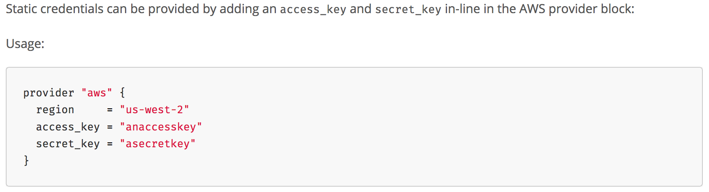
+ 环境变量
   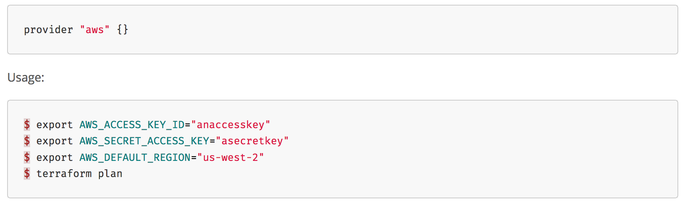
+ 共享凭据文件
   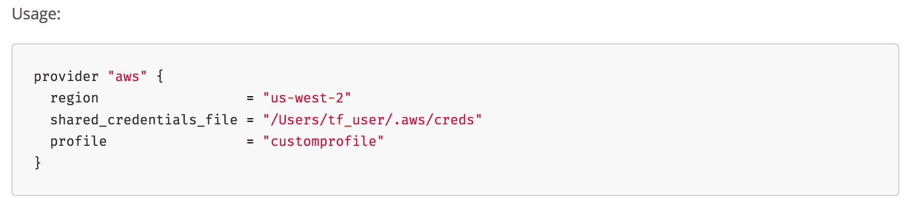
+ EC2角色
   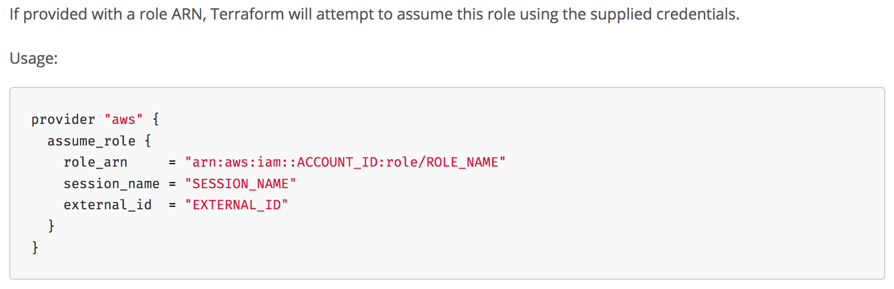

可以借助Terraform的多Provider实例配置，实现对多个Region的管理，例如：
```
# The default provider
provider "aws" {
  # ...
}

# West coast region
provider "aws" {
  alias  = "west"
  region = "us-west-2"
}
```
命名Provider后，可以在资源中引用该provider 字段：
```
resource "aws_instance" "foo" {
  provider = "aws.west"
  # ...
}
```
### 2.4 HelloWorld
本章节将演示如何利用Terraform进行S3桶的自动化构建、修改、删除。
#### 2.4.1 创建配置文件
新建helloworld目录，并编辑一个名为s3demo.tf的文件，具体内容如下：
```
provider "aws" {
    region                  = "cn-north-1"
    shared_credentials_file = "~/.aws/credentials"
    profile                 = "bjs"
    }

resource "aws_s3_bucket" "s3_bucket" {
bucket = "my-tf-test-bucket001"
acl    = "private"
    tags {
      Name        = "My bucket"
      Environment = "Dev"
    }
}
```
运行terraform fmt  对当前目录下的所有配置文件进行格式化。有关S3更详细的配置可以参考https://www.terraform.io/docs/providers/aws/r/s3_bucket.html
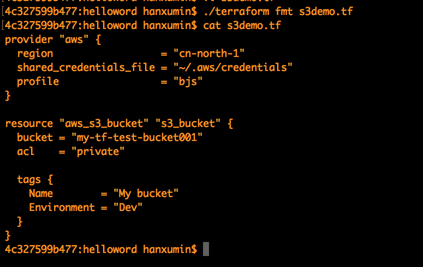

注：resource “aws_s3_bucket” “s3_bucket” 中，resource 后第一个是TYPE, 即资源名，第二个参是NAME，类型和名称的组合必须是唯一的。其实 “s3_bucket” 在这里没什么用，只是一个描述或助记符而已，在作为变量引用的时候就要用到它，”${aws_s3_bucket.s3_bucket.arn}”, 引用时不需要知道实际的名称。

我们使用 shared_credentials_file 中的 profile, 请确定您以预先生成好的 credentials 文件及有效的 profile。
#### 2.4.2 初始化工作目录
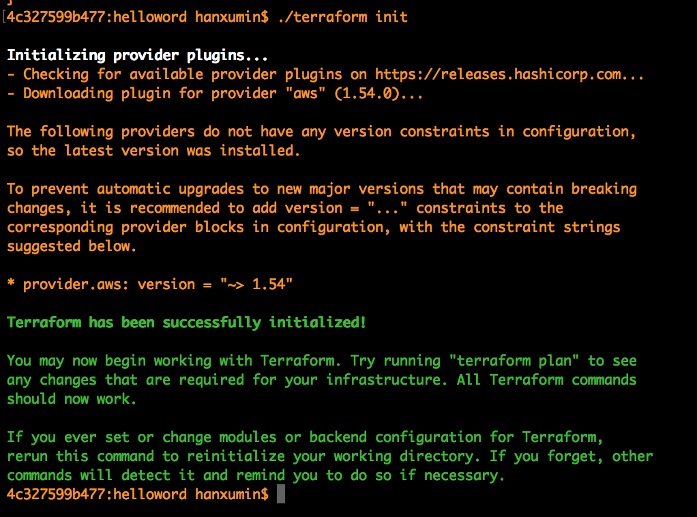

执行完了terraform init之后会在当前目录中生成 .terraform目录，并依照 *.tf文件中的配置下载相应的插件，下载可能需要等待一段时间。
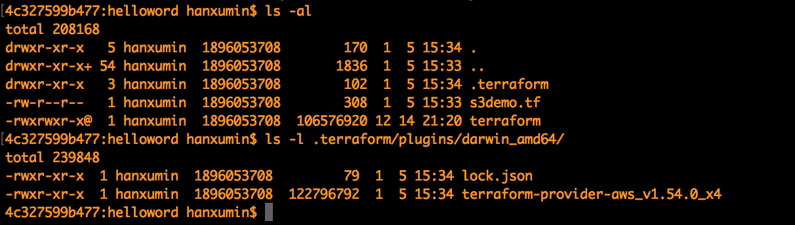
#### 2.4.3.2 terraform apply
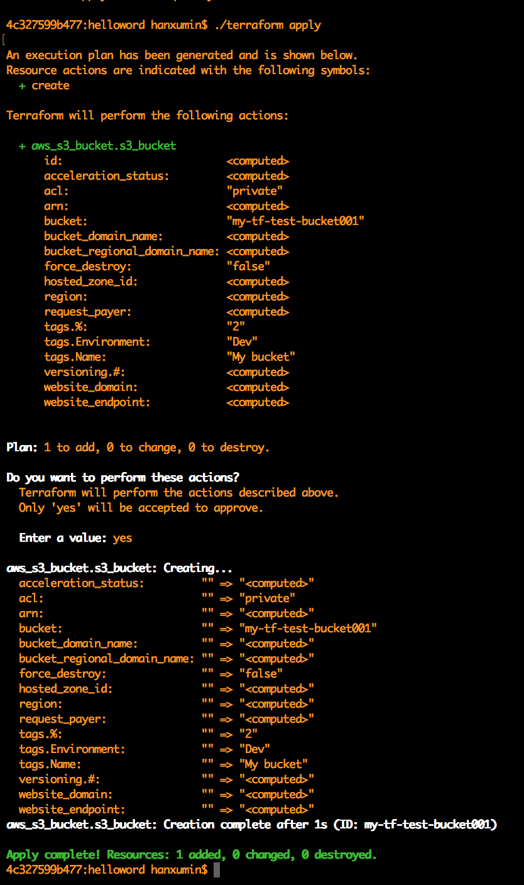

这样便在AWS上创建了一个名为”my-tf-test-bucket003“的S3桶, 同时会在当前目录中生成一个状态文件 terraform.tfstate, 它是一个标准的 JSON 文件。这个文件对 Terraform 来说很重要，它会影响 terraform plan的决策，虽然不会影响到实际的执行效果。

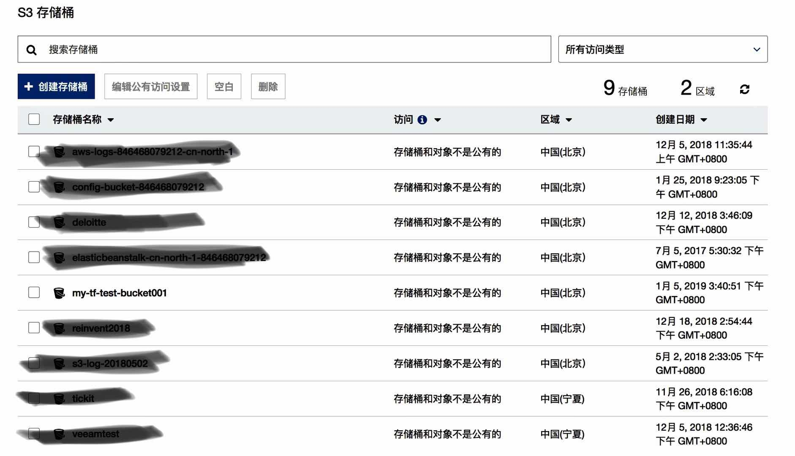

terraform state [list|mv|pull|push|rm|show]用来操作状态文件。此时什么也不改，再次执行 terraform plan, 会显示没什么要做的。
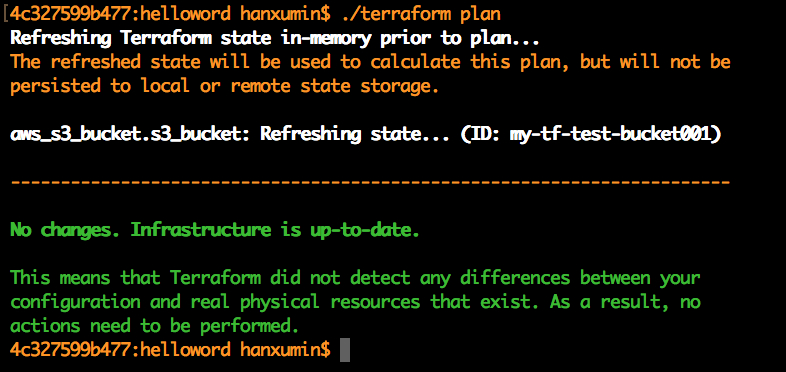

我们将s3demo.tf文件中的tags.Environment: “Dev” 改成”Dev001″，运行plan：
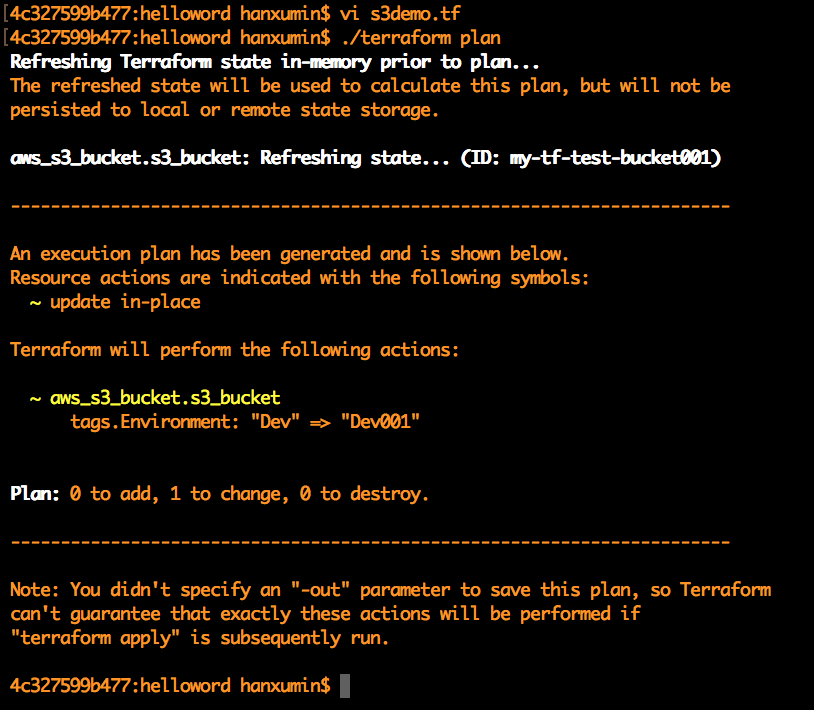

为什么说 terraform plan 是基于状态文件 terraform.tfstate 作出的呢？我们可以删除这个状态文件，然后执行 terraform plan 看看：
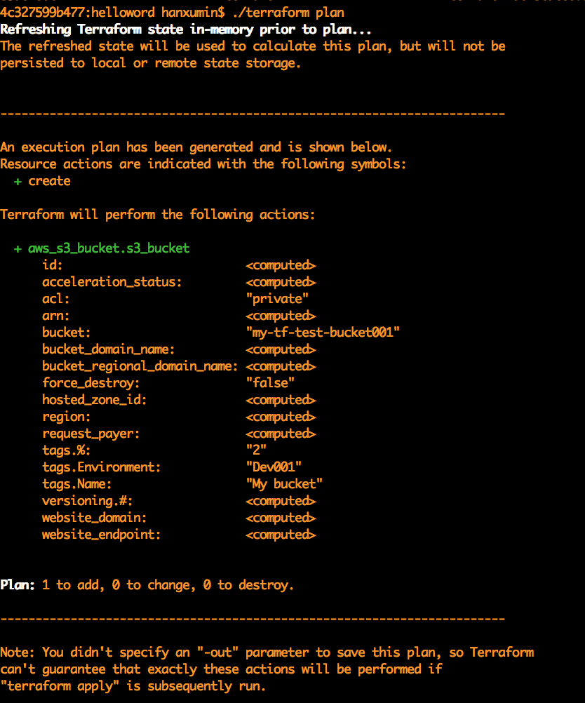

Terraform 由于缺乏 terraform.tfstate 对比，所以认为是要添加一个 bucket, 但是实际执行 terraform apply时，连接到远端 AWS, 发现该 bucket 已存在就报告错误。terraform apply总能给出正确的操作结果。同理如果状态文件中说有那个 bucket, terraform plan会说是更新，但AWS没有那个bucket，实际执行terraform apply也会进行添加的。
#### 2.4.3.3 资源更名
如果把 s3demo.tf中的bucket = “my-tf-test-bucket001″改成bucket = ” my-tf-test-bucket003“，则将重命名桶，用terraform plan看下计划
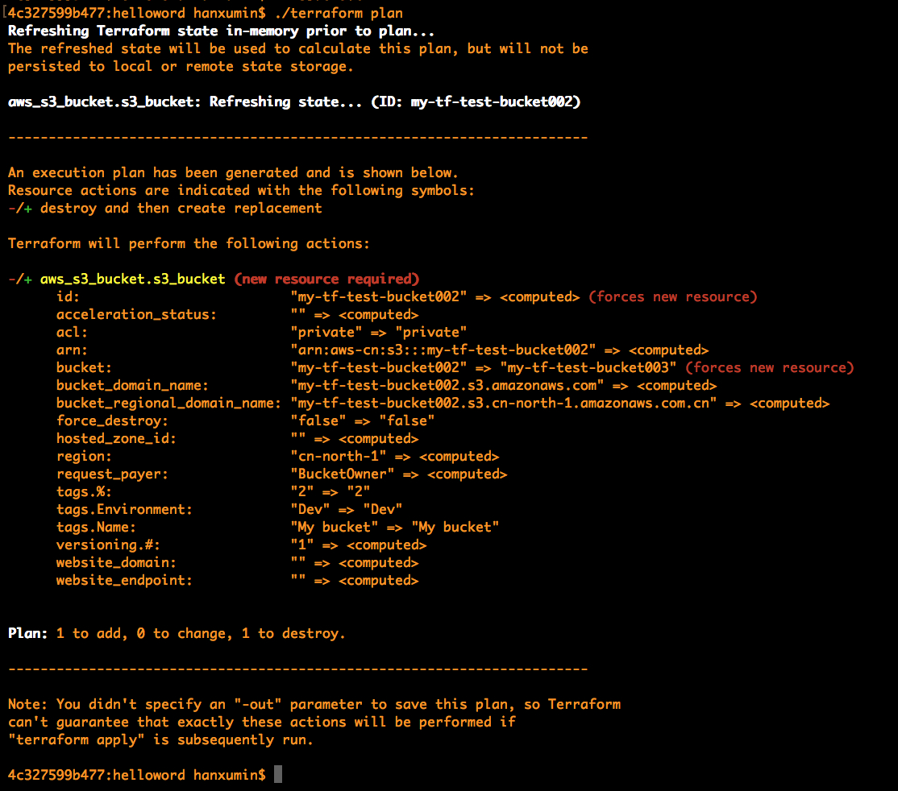

实际上 terraform apply也是先删除旧的，再创建新的。Terraform 像 git 一样用不同颜色和 +/- 号来显示变动操作。
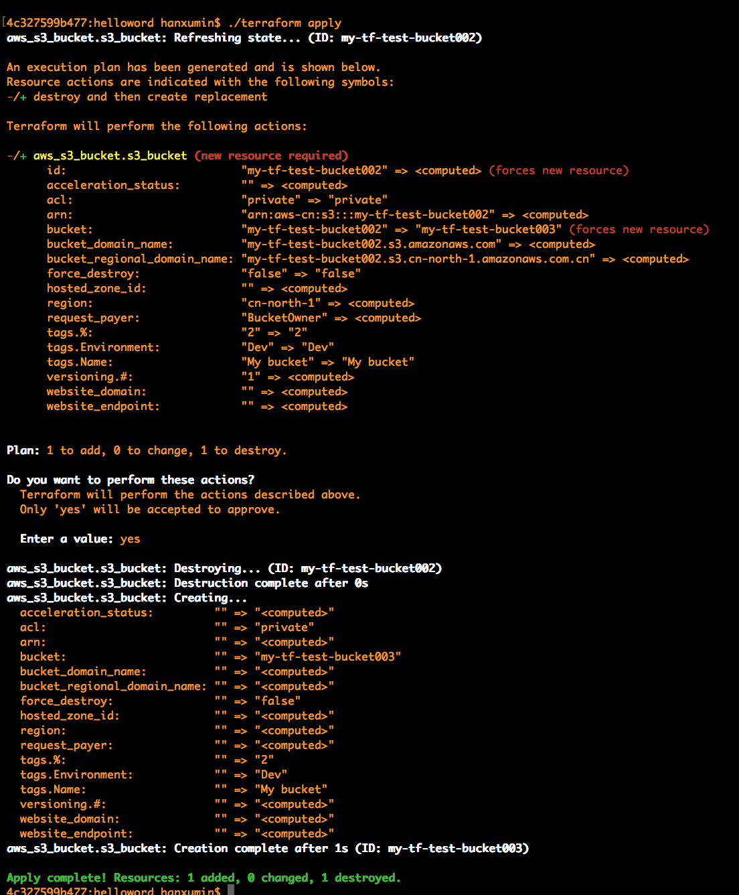
#### 2.4.3.4 terraform destroy
terraform destroy命令，把 *.tf文件中配置的所有资源从AWS上清理掉。
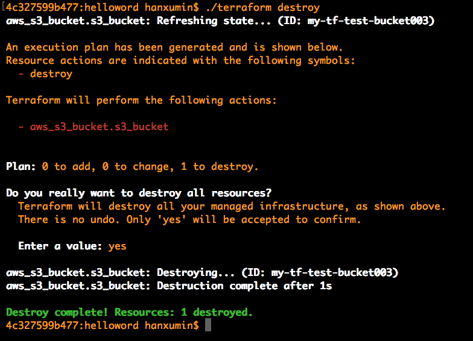
### 2.5 工作目录布局
Terraform 运行时会读取工作目录中所有的 *.tf, *.tfvars文件，所以我们不必把所有的东西都写在单个文件中去，应按职责分列在不同的文件中，例如
```
provider.tf                   ### provider 配置
terraform.tfvars        ### 配置 provider 要用到的变量
varable.tf                     ### 通用变量
resource.tf                  ### 资源定义
data.tf                          ### 包文件定义
output.tf                     ### 输出
```
在执行像 terraform plan或 terraform apply等命令的时候，可以按下 ctrl + c让控制台输出详细的日志信息。
## 第3章  Terraform进阶
Terraform的功能非常丰富，可以通过Providers来提供对多平台的支持，通过Provisioners来实现本地与远程的脚本调用等功能，支持ssh与winrm的连接方式，也能作为Chef Client的方式运行，通过Modules去重用组件提高开发效率，大数AWS资源都能通过官方托管的Module Sources来重用。

本章节我们将利用更多的Terraform功能，来实现较复杂场景的部署。
### 3.1 部署架构


以上架构要采用常见的三层应用方式，Web层位于公网，App与DB层位于私有网段，Web层安全组开放80及22端口，App层安全组对Web层开放，DB层安全组对App层开放。
### 3.2  配置文件
新建一个helloworld2目录，将下面的四个文件存放到同一目录，文件的易读比较好，这里不对内容做详细解释，有关详细使用方法可以参考如下：
- https://www.terraform.io/docs/index.html
- https://registry.terraform.io/browse?provider=aws
#### 3.2.1  variable.tf
变量申明, 编辑名为variable.tf的文件，内容如下：
```
variable "aws_access_key" {}
variable "aws_secret_key" {}
variable "aws_key_pair" {}
variable "aws_region" {}
variable "inst_ami" {}
variable "inst_type" {}
```
#### 3.2.2  terraform.tfvars
```
aws_access_key =  "Access Key"
aws_secret_key = "Secret_Key"
aws_key_pair =  "Your Key Pair"
aws_region = "cn-north-1"
inst_ami = "ami-fba67596"
inst_type = "t2.micro"
```
#### 3.2.3  aws.tf
编辑名为aws.tf的文件，内容如下：
```
provider "aws" {
  access_key = "${var.aws_access_key}"
  secret_key = "${var.aws_secret_key}"
  region     = "${var.aws_region}"
}
```
#### 3.2.4  main.tf
编辑名为main.tf的文件，内容如下：
```
module "vpc" {
  source = "terraform-aws-modules/vpc/aws"
  name = "myvpc"
  cidr = "10.10.0.0/16"
  
  azs              = ["cn-north-1a", "cn-north-1b"]
  public_subnets   = ["10.10.0.0/24", "10.10.10.0/24"]
  private_subnets  = ["10.10.1.0/24", "10.10.11.0/24"]
  database_subnets = ["10.10.2.0/24", "10.10.12.0/24"]
  
  create_database_subnet_group = true
  enable_dns_hostnames         = true
  enable_dns_support           = true
  enable_dynamodb_endpoint     = true
  enable_s3_endpoint           = true

  tags = {
    Owner       = "user"
    Environment = "staging"
  }
}

module "websg" {
  source = "terraform-aws-modules/security-group/aws"
  name        = "web-service"
  description = "Security group for HTTP and SSH within VPC"

  vpc_id      = "${module.vpc.vpc_id}"
  ingress_rules            = ["http-80-tcp", "https-443-tcp", "ssh-tcp", "all-icmp"]
  ingress_cidr_blocks      = ["0.0.0.0/0"]
  ingress_ipv6_cidr_blocks = []
  egress_rules             = ["all-all"]
  egress_cidr_blocks       = ["0.0.0.0/0"]
  egress_ipv6_cidr_blocks  = []
}

module "appsg" {
  source = "terraform-aws-modules/security-group/aws"
  name        = "app-service"
  description = "Security group for App within VPC"
  vpc_id      = "${module.vpc.vpc_id}"
  ingress_ipv6_cidr_blocks = []
  egress_ipv6_cidr_blocks  = []

  ingress_with_source_security_group_id = [
    {
      rule                     = "all-all"
      source_security_group_id = "${module.websg.this_security_group_id}"
    },
  ]

  egress_with_source_security_group_id = [
    {
      rule                     = "all-all"
      source_security_group_id = "${module.websg.this_security_group_id}"
    },
  ]
}

module "dbssg" {
  source = "terraform-aws-modules/security-group/aws"
  name        = "dbs-service"
  description = "Security group for Database within VPC"
  vpc_id      = "${module.vpc.vpc_id}"
  
  ingress_ipv6_cidr_blocks = []
  egress_ipv6_cidr_blocks  = []
  
  ingress_with_source_security_group_id = [
    {
      rule                     = "all-all"
      source_security_group_id = "${module.appsg.this_security_group_id}"
    },
  ]

  egress_with_source_security_group_id = [
    {
      rule                     = "all-all"
      source_security_group_id = "${module.appsg.this_security_group_id}"
    },
  ]
}

module "ec2_web_1a" {
  source = "terraform-aws-modules/ec2-instance/aws"
  name  = "web_1a"
  instance_count = 1
  ami                         = "${var.inst_ami}"
  instance_type    = "${var.inst_type}"
  key_name                    = "${var.aws_key_pair}"
  monitoring                  = true

  vpc_security_group_ids      = ["${module.websg.this_security_group_id}"]
  subnet_id                   = "${module.vpc.public_subnets[0]}"
  associate_public_ip_address = true

  tags = {
    Terraform   = "true"
    Environment = "dev"
  }
}

module "ec2_web_1b" {
  source = "terraform-aws-modules/ec2-instance/aws"
  name  = "web_1b"
  instance_count = 1

  ami                         = "${var.inst_ami}"
  instance_type               = "${var.inst_type}"
  key_name                    = "${var.aws_key_pair}"
  monitoring                  = true
  vpc_security_group_ids      = ["${module.websg.this_security_group_id}"]
  subnet_id                   = "${module.vpc.public_subnets[1]}"
  associate_public_ip_address = true

  tags = {
    Terraform   = "true"
    Environment = "dev"
  }
}

module "ec2_app_1a" {
  source = "terraform-aws-modules/ec2-instance/aws"
  name  = "app_1a"
  instance_count = 2
  ami                         = "${var.inst_ami}"
  instance_type               = "${var.inst_type}"
  key_name                    = "${var.aws_key_pair}"
  monitoring                  = true
  vpc_security_group_ids      = ["${module.appsg.this_security_group_id}"]
  subnet_id                   = "${module.vpc.private_subnets[0]}"
  associate_public_ip_address = false

  tags = {
    Terraform   = "true"
    Environment = "dev"
  }
}

module "ec2_app_1b" {
  source = "terraform-aws-modules/ec2-instance/aws"
  name  = "app_1b"
  instance_count = 2

  ami                         = "${var.inst_ami}"
  instance_type               = "${var.inst_type}"
  key_name                    = "${var.aws_key_pair}"
  monitoring                  = true
  vpc_security_group_ids      = ["${module.appsg.this_security_group_id}"]
  subnet_id                   = "${module.vpc.private_subnets[1]}"
  associate_public_ip_address = false

  tags = {
    Terraform   = "true"
    Environment = "dev"
  }
}

module "mysql01" {
  source = "terraform-aws-modules/rds/aws"
  identifier             = "mysql01"
  engine                 = "mysql"
  engine_version         = "5.7.11"
  instance_class         = "db.t2.small"
  allocated_storage      = 20
  storage_type           = "gp2"
  name                   = "demodb"
  username               = "myadmin"
  password               = "rootroot"
  port                   = "3306"
  multi_az               = true
  vpc_security_group_ids = ["${module.dbssg.this_security_group_id}"]
  maintenance_window     = "Mon:00:00-Mon:03:00"
  backup_window          = "03:00-06:00"

  tags = {
    Owner       = "user"
    Environment = "dev"
  }

  subnet_ids                = ["${module.vpc.database_subnets}"]
  family                    = "mysql5.7"
  final_snapshot_identifier = false
  backup_retention_period   = 0
  publicly_accessible       = false
  parameters = [
    {
      name  = "character_set_client"
      value = "utf8"
    },
    {
      name  = "character_set_server"
      value = "utf8"
    },
  ]
}
```
### 3.3  部署运行
#### 3.3.1  初始化
运行terraform init进行初始化，等待插件与Module自动下载：
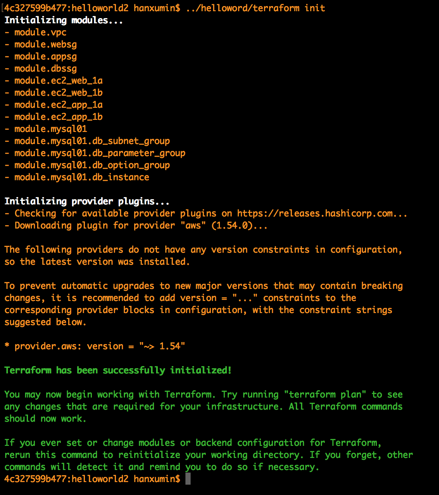
#### 3.3.2  查看计划
运行terraform plan执行计划，暂时忽略这个报错，有可能是安全组相互引用的问题，在后面分段运行即可。

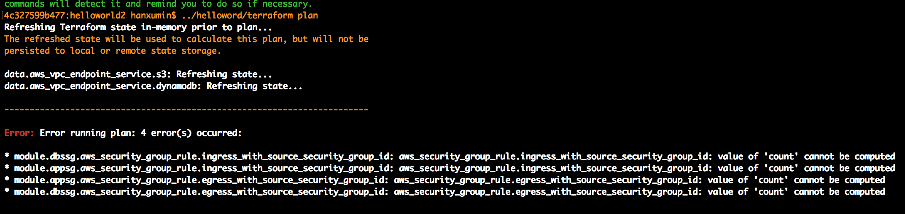
#### 3.3.3  分块运行
由于资源相互引用，请按下面的顺序执行，也可以放一个shell脚本里面。运行过程有可能遇到时间过长，在控制台上看到资源都已经建好，请耐心等待。
1. terraform apply -target=module.vpc ### 创建VPC及相关资源
   请留意最后一行，表示增加29个资源

   Apply complete! Resources: 29(27) added, 0 changed, 0 destroyed.
   
   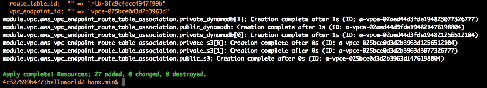
2. terraform apply -target=module.websg ### 创建Web层安全组
    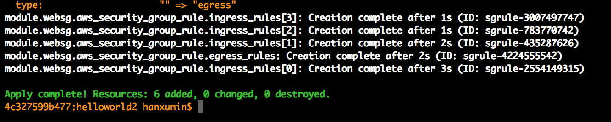
3. terraform apply -target=module.appsg ### 创建App层安全组
   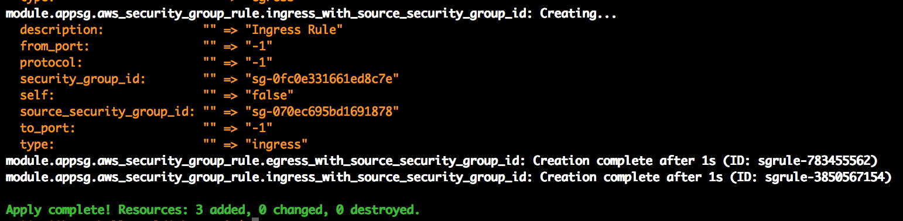
4. terraform apply -target=module.dbssg ### 创建DB层安全组
   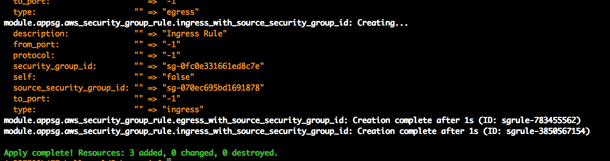
5. terraform apply -target=module.ec2_web_1a ### 创建EC2 Web
   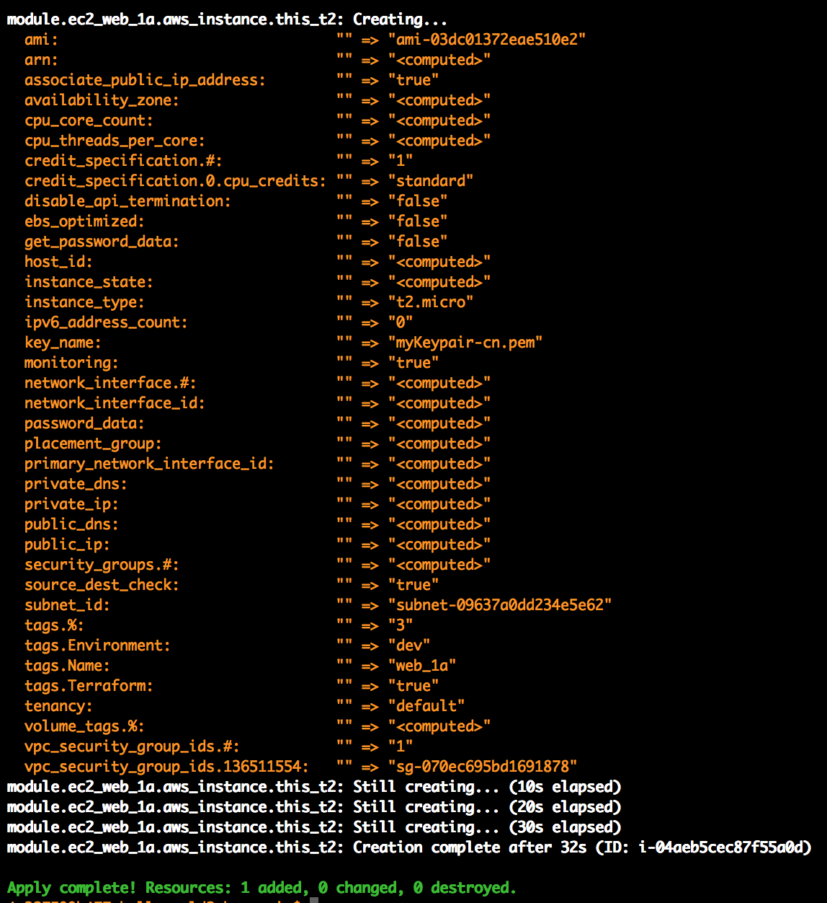
6. terraform apply -target=module.ec2_web_1b ### 创建EC2 Web
   
7. terraform apply -target=module.ec2_app_1a ### 创建2个EC2 APP
   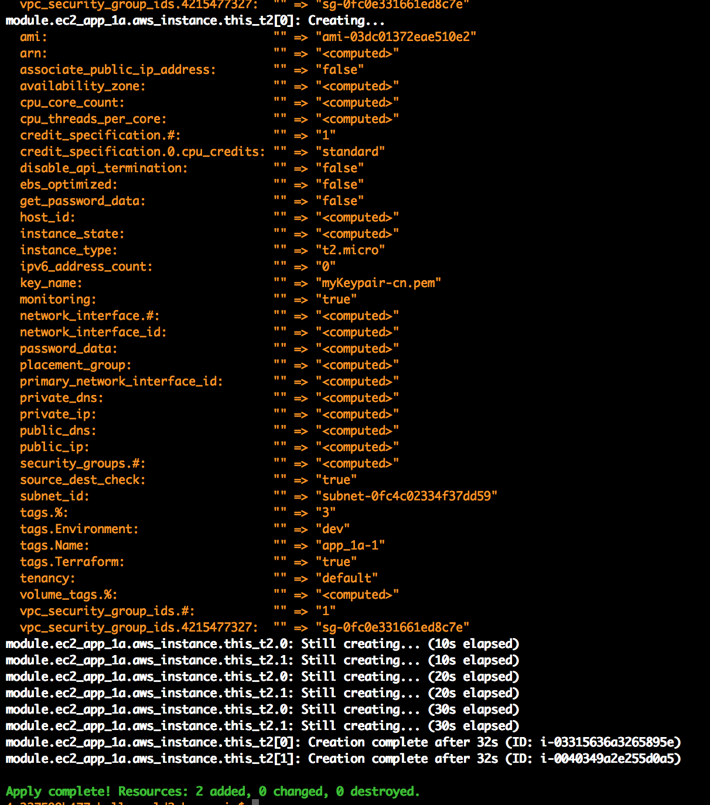
8. terraform apply -target=module.ec2_app_1b ### 创建2个EC2 APP
   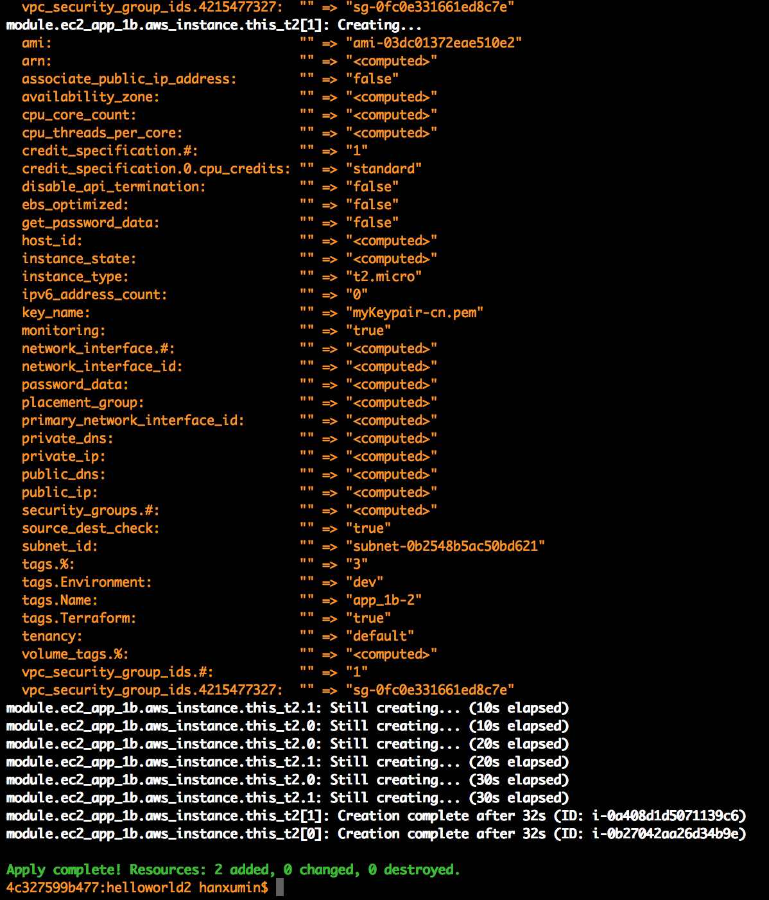
9.  terraform apply -target=module. mysql01 ### 创建多AZ MySQL实例
   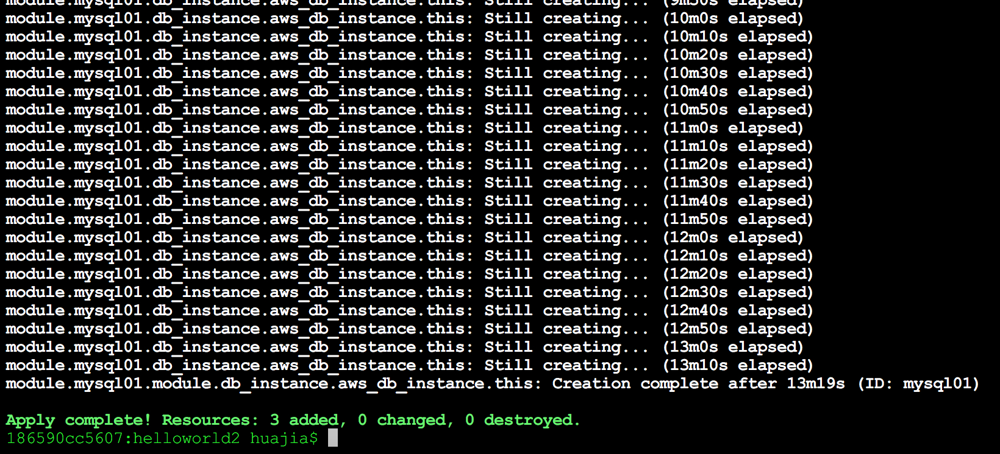
### 3.4  环境检查
#### 3.4.1  VPC相关
   

   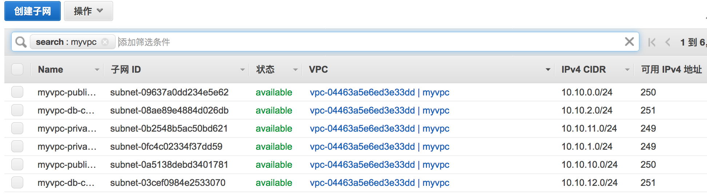


   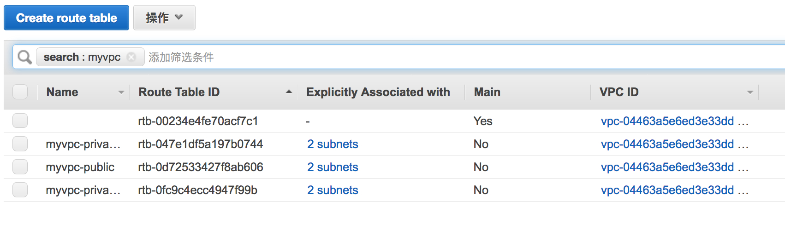


   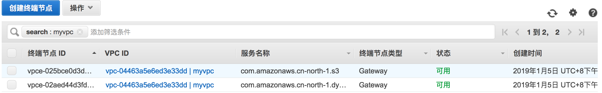


   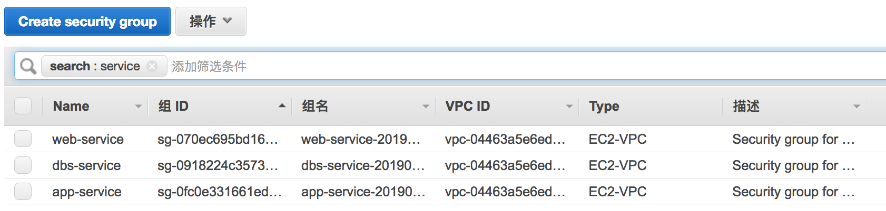


   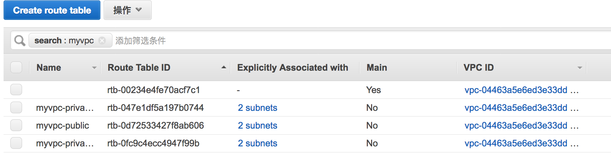


   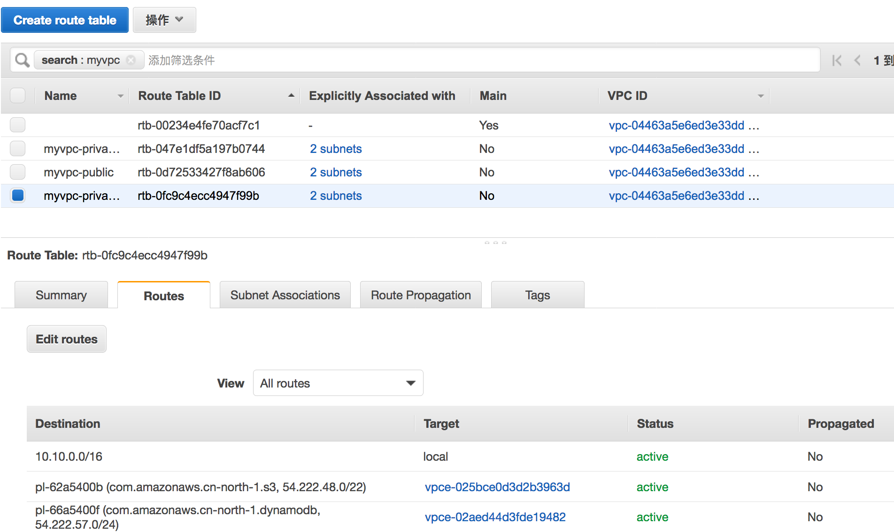


   
#### 3.4.2 EC2相关
   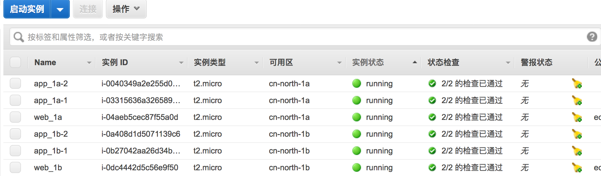
#### 3.4.3  MySQL相关
   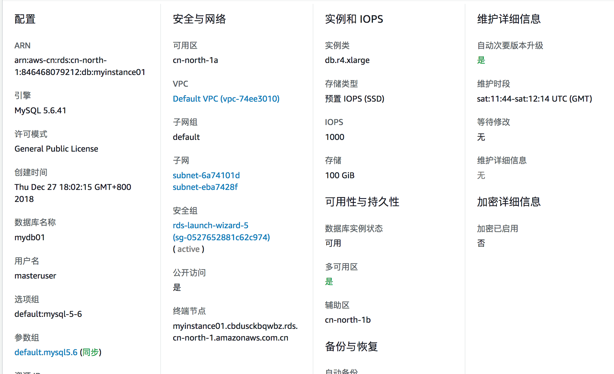
### 3.5  资源回收
**terraform destroy**  ### 将自动删除所有创建的资源即可

## Reference
- [使用 Terraform 在 AWS 中国区域实现自动化部署指南系列（一） TERRAFORM 入门](https://amazonaws-china.com/cn/blogs/china/aws-china-region-guide-series-terraform1/)
- [使用 Terraform 在 AWS 中国区域实现自动化部署指南系列（二） TERRAFORM 进阶](https://amazonaws-china.com/cn/blogs/china/aws-china-region-guide-series-terraform2/)
- [Configuration Language](https://www.terraform.io/docs/configuration/index.html)