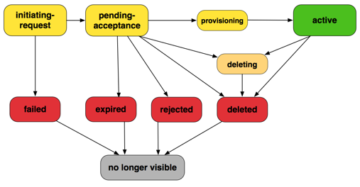
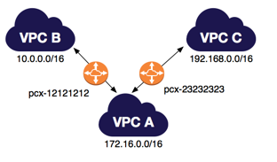

# 一. 什么是 VPC 对等？
Amazon Virtual Private Cloud (Amazon VPC) 允许您在已定义的虚拟网络内启动 AWS 资源。

VPC 对等连接是两个 VPC 之间的网络连接，通过此连接，您可以使用私有 IPv4 地址或 IPv6 地址在两个 VPC 之间路由流量。这两个 VPC 中的实例可以彼此通信，就像它们在同一网络中一样。您可以在自己的 VPC 之间创建 VPC 对等连接，或者在自己的 VPC 与其他 AWS 账户中的 VPC 之间创建连接。VPC 可位于不同区域内（也称为区域间 VPC 对等连接，即inter-region VPC peering connection）。

AWS 使用 VPC 的现有基础设施来创建 VPC 对等连接；该连接既不是网关也不是 VPN 连接，并且不依赖某一单独的物理硬件。没有单点通信故障也没有带宽瓶颈。

VPC 对等连接可以帮助您促进数据的传输。例如，如果您有多个 AWS 账户，则可以通过在这些账户中的 VPC 间建立对等连接来创建文件共享网络。您还可以使用 VPC 对等连接来允许其他 VPC 访问您某个 VPC 中的资源。

您可以在不同 AWS 区域之间建立 VPC 之间的对等关系（也称为区域间 VPC 对等）。这样允许不同 AWS 区域中运行的 VPC 资源（包括 EC2 实例、Amazon RDS 数据库和 Lambda 函数）使用私有 IP 地址互相通信，而无需使用网关、VPN 连接或独立的网络设备。这些流量保留在私有 IP 空间中。所有区域间流量都经过加密，没有单点故障或带宽瓶颈。流量一直处于全球 AWS 骨干网中，不会经过公共 Internet，这样可以减少面临的威胁，例如常见漏洞和 DDoS 攻击。区域间 VPC 对等连接提供了一种在区域间共享资源或为实现地理冗余性而复制数据的简单经济的方式。
### 1. VPC 对等基本知识
要建立 VPC 对等连接，请执行以下操作：
1. 请求者 VPC 的所有者向接受者 VPC 的所有者发送创建 VPC 对等连接的请求。接受者 VPC 可以归您或其他 AWS 账户所有，不能包含与请求者 VPC 的 CIDR 块重叠的 CIDR 块。
2. 接受者 VPC 的所有者接受 VPC 对等连接请求以激活 VPC 对等连接。
3. 要使用私有 IP 地址实现 VPC 之间的流量流动，VPC 对等连接中每个 VPC 的所有者必须向一个或多个 VPC 路由表手动添加指向其他 VPC (对等 VPC) 的 IP 地址范围的路由。
4. 如果需要，请更新与您的实例关联的安全组规则以确保进出对等 VPC 的流量不受限制。如果两个 VPC 位于相同区域内，则您可以引用对等 VPC 中的安全组作为安全组规则中的入口或出口规则的源或目标。
5. 默认情况下，如果 VPC 对等连接任一侧的实例使用公有 DNS 主机名相互进行寻址，则主机名会解析为实例的公有 IP 地址。要更改此行为，请为您的 VPC 连接启用 DNS 主机名解析。在启用 DNS 主机名解析后，如果 VPC 对等连接任一侧的实例使用公有 DNS 主机名相互进行寻址，则主机名将解析为实例的私有 IP 地址。
#### 1.1 VPC 对等连接的生命周期
从发起请求时开始，VPC 对等连接会经过各个阶段。在每个阶段中，您都可以执行一些操作，在生命周期结束后，VPC 对等连接仍会在 Amazon VPC 控制台和 API 或命令行输出中继续显示一段时间。

- **Initiating-request (发起请求)**：已发起 VPC 对等连接请求。在这一阶段中，对等连接可能失败或可能转到 **pending-acceptance**。
- **Failed (已失败)**：VPC 对等连接请求失败。在处于此状态时，无法接受、拒绝或删除该连接。请求者仍可在 2 个小时内看到失败的 VPC 对等连接。
- **Pending-acceptance**：等待接受者 VPC 的所有者接受 VPC 对等连接请求。在这一阶段中，请求者 VPC 的所有者可以删除此请求，接受者 VPC 的所有者可以接受或拒绝此请求。如果双方均未对此请求执行任何操作，该请求将在 7 天后过期。
- **Expired (已过期)**：VPC 对等连接请求已过期，任一 VPC 所有者都无法再对该请求执行任何操作。两个 VPC 所有者仍可以在 2 天内看到已过期的 VPC 对等连接。
- **Rejected**：接受者 VPC 的所有者拒绝了 pending-acceptance VPC 对等连接请求。在这一阶段中，无法接受请求。请求者 VPC 的所有者仍可以在 2 天内看到已拒绝的 VPC 对等连接，接受者 VPC 的所有者仍可在 2 个小时内看到此对等连接。如果请求是在同一 AWS 账户内创建的，则已拒绝的请求会继续显示 2 个小时。
- **Provisioning** (正在预置)：VPC 对等连接请求已接受，即将处于 **active** 状态。
- **Active**：VPC 对等连接处于活动状态，而且流量可以在 VPC 之间流动 (假设您的安全组和路由表允许流量流动)。在这一阶段中，任一 VPC 所有者都可以删除 VPC 对等连接，但是无法拒绝它。
  > **注意** 如果 VPC 所在的区域中的事件阻止了流量流动，则 VPC 对等连接的状态将保持 Active
- **Deleting**：适用于处于删除过程中的区域间 VPC 对等连接。任一 VPC 的所有者已提交删除 active VPC 对等连接的请求，或者请求者 VPC 的所有者已提交删除 pending-acceptance VPC 对等连接请求的请求。
- **Deleted (已删除)**：任一 VPC 拥有者已删除了 active 的 VPC 对等连接，或请求者 VPC 的拥有者已删除了 pending-acceptance 的 VPC 对等连接请求。在这一阶段中，无法接受或拒绝 VPC 对等连接。VPC 对等连接仍会向其删除方继续显示 2 个小时，向另一方显示 2 天。如果 VPC 对等连接是在同一 AWS 账户内创建的，则已删除的请求仍将继续显示 2 个小时。
#### 1.2 多个 VPC 对等连接
VPC 对等连接是两个 VPC 之间的一对一关系。您可以为您的每个 VPC 创建多个 VPC 对等连接，但是不支持传递的对等关系。您不会与您的 VPC 不直接对等的 VPC 形成任何对等关系。

下图举例说明一个 VPC 与两个不同的 VPC 具有对等关系。图中有两个 VPC 对等连接：VPC A 同时与 VPC B 和 VPC C 具有对等关系。VPC B 与 VPC C 不对等，并且您不能将 VPC A 用作 VPC B 和 VPC C 之间的对等中转点。如果您要在 VPC B 和 VPC C 之间支持流量路由，必须在这两者之间创建一个唯一的 VPC 对等连接。

#### 1.3 VPC 对等连接的定价
如果 VPC 对等连接中的 VPC 位于相同区域内，则 VPC 对等连接内传输数据的费用与跨可用区传输数据的费用相同。如果 VPC 位于不同区域，则收取区域间数据传输费用。

有关更多信息，请参阅 [Amazon EC2 定价](http://aws.amazon.com/ec2/pricing/on-demand/#Data_Transfer)。
#### 1.4 VPC 对等限制
要创建与其他 VPC 之间的 VPC 对等连接，请了解以下限制和规则：
- 您无法在具有匹配或重叠的 IPv4 或 IPv6 CIDR 块的 VPC 之间创建 VPC 对等连接。Amazon 将始终为您的 VPC 分配唯一的 IPv6 CIDR 块。如果您的 IPv6 CIDR 块唯一但 IPv4 块不唯一，则无法创建对等连接。
- 每个 VPC 可以具有的活动和待定 VPC 对等连接的数据具有配额。有关更多信息，请参阅 Amazon VPC 用户指南 中的 [Amazon VPC 配额](https://docs.aws.amazon.com/AmazonVPC/latest/UserGuide/amazon-vpc-limits.html)。
- PC 对等不支持传递的对等关系。在 VPC 对等连接中，您的 VPC 无权访问对等 VPC 可能与之对等的任何其他 VPC。其中包括完全在您自己的 AWS 账户内建立的 VPC 对等连接。有关不支持的对等关系的更多信息，请参阅不受支持的 VPC 对等配置。有关支持的对等关系的示例，请参阅VPC 对等方案。
- 您不能在相同两个 VPC 之间同时建立多个 VPC 对等连接。
- 不支持在 VPC 对等连接中进行单一地址反向传输路径转发。有关更多信息，请参阅[响应流量路由](https://docs.aws.amazon.com/zh_cn/vpc/latest/peering/peering-configurations-partial-access.html#peering-incorrect-response-routing)。
- 您可以让 VPC 对等连接两端的资源通过 IPv6 相互通信；不过，IPv6 通信不是自动的。您必须为每个 VPC 关联一个 IPv6 CIDR 块，允许 VPC 中的实例进行 IPv6 通信，并在您的路由表中添加路由以将针对对等 VPC 的 IPv6 流量路由到 VPC 对等连接。有关更多信息，请参阅 Amazon VPC 用户指南 中的[您的 VPC 和子网](https://docs.aws.amazon.com/AmazonVPC/latest/UserGuide/VPC_Subnets.html)。
- 您为您的 VPC 对等连接创建的任何标签仅在您创建它们的账户或区域中应用。
- 如果 VPC 对等连接中 VPC 的 IPv4 CIDR 块不在 [RFC 1918](http://www.faqs.org/rfcs/rfc1918.html) 所指定的私有 IPv4 地址范围内，则该 VPC 的私有 DNS 主机名无法解析为私有 IP 地址。要将私有 DNS 主机名解析为私有 IP 地址，您可以为 VPC 对等连接启用 DNS 解析支持。有关更多信息，请参阅[实现对 VPC 对等连接的 DNS 解析支持](https://docs.aws.amazon.com/zh_cn/vpc/latest/peering/modify-peering-connections.html#vpc-peering-dns)。
- 您无法连接或查询对等 VPC 中的 Amazon DNS 服务器。

区域间 VPC 对等连接具有其他限制：
- 无法创建引用对等 VPC 安全组的安全组规则。
- 无法启用对通过 ClassicLink 链接到 VPC 的 EC2-Classic 实例的支持以与对等 VPC 通信。
- 跨 VPC 对等连接的最大传输单元 (MTU) 为 1500 字节 (不支持极大帧)。
- 您必须为 VPC 对等连接启用 DNS 解析支持才能将对等 VPC 的私有 DNS 主机名解析为私有 IP 地址，即使 VPC 的 IPv4 CIDR 位于 RFC 1918 指定的私有 IPv4 地址范围内也是如此。
- 中国的区域间对等连接只允许在中国（北京）区域（由 SINNET 运营）和中国 (宁夏) 区域（由 NWCD 运营）之间进行。
## 二. 使用 VPC 对等连接
## 三. VPC 对等方案
## 四. VPC 对等连接配置
## 五. 不受支持的 VPC 对等配置
## 六. Identity and Access Management 

## Reference
- [什么是 VPC 对等？](https://docs.aws.amazon.com/zh_cn/vpc/latest/peering/what-is-vpc-peering.html)