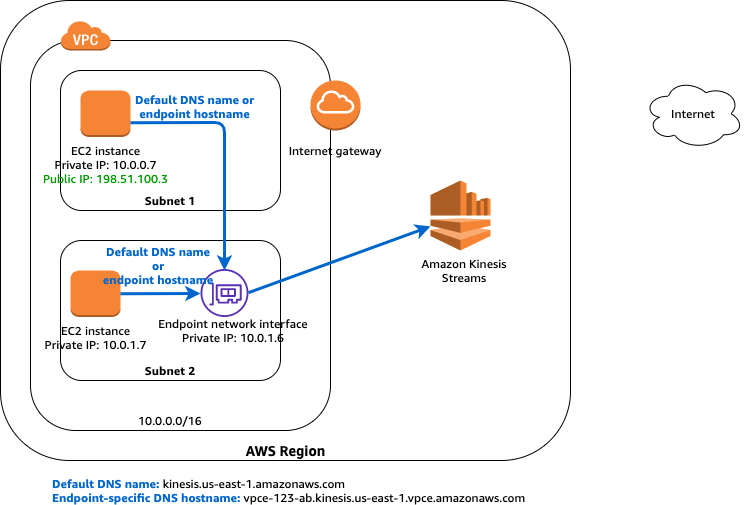

# Amazon Virtual Private Cloud
## 1. Amazon VPC 是什么？
## 2. Amazon VPC 的工作原理
## 3. 开始使用
## 4. VPC 的示例
## 5. VPC 和子网
## 6. 默认 VPC 和默认子网
## 7. IP 寻址
## 8. 安全
## 9. VPC 联网组件
## 10. VPC 终端节点和 VPC 终端节点服务 (AWS PrivateLink) (VPC endpoints and VPC endpoint services (AWS PrivateLink))
VPC 终端节点使您能够将 VPC 私密地连接到支持的 AWS 服务和 VPC 终端节点服务（由 AWS PrivateLink 提供支持），而无需互联网网关、NAT 设备、VPN 连接或 AWS Direct Connect 连接。VPC 中的实例无需公有 IP 地址便可与服务中的资源通信。VPC 和其他服务之间的通信不会离开 Amazon 网络。

终端节点是虚拟设备。它们是水平扩展、冗余和高度可用的 VPC 组件。通过它们，可以在 VPC 中的实例与服务之间进行通信，而不会对网络通信带来可用性风险或带宽约束。
### 10.1 VPC 终端节点
通过 VPC 终端节点可在您的 VPC 与受支持的 AWS 服务以及由 AWS PrivateLink 支持的 VPC 终端节点服务之间建立私有连接。VPC 终端节点不需要互联网网关、NAT 设备、VPN 连接或 AWS Direct Connect 连接。VPC 中的实例无需公有 IP 地址便可与服务中的资源通信。VPC 和其他服务之间的通信不会离开 Amazon 网络。

终端节点是虚拟设备。它们是水平扩展、冗余和高度可用的 VPC 组件。通过它们，可以在 VPC 中的实例与服务之间进行通信，而不会对网络通信带来可用性风险或带宽约束。

下面是不同VPC 终端节点类型，你应该创建受支持的服务所需要的 VPC 终端节点类型。
**接口终端节点**
[接口终端节点](https://docs.aws.amazon.com/zh_cn/vpc/latest/userguide/vpce-interface.html)是一个弹性网络接口，具有来自子网 IP 地址范围的私有 IP 地址，用作发送到受支持的服务的通信的入口点。接口终端节点由 AWS PrivateLink 提供支持，该技术使您能够通过使用私有 IP 地址私下访问服务。AWS PrivateLink 将 VPC 和服务之间的所有网络流量限制在 Amazon 网络以内。您无需互联网网关、NAT 设备或虚拟私有网关。

有关与 AWS PrivateLink 集成的 AWS 服务的信息，请参阅[可以与 AWS PrivateLink 一起使用的 AWS 服务](https://docs.aws.amazon.com/zh_cn/vpc/latest/userguide/integrated-services-vpce-list.html)。你也可以查看所有可用的 AWS 服务名称，请参阅[查看可用的 AWS 服务名称](https://docs.aws.amazon.com/vpc/latest/userguide/vpce-interface.html#vpce-view-services)。

**网关负载均衡终端节点**
[网关负载均衡终端节点](https://docs.aws.amazon.com/vpc/latest/userguide/vpce-gateway-load-balancer.html)是一个弹性网络接口，具有来自子网 IP 地址范围的私有 IP 地址。网关负载均衡终端节点由 AWS PrivateLink 提供支持。例如，为了安全检查，这种终端节点用作拦截流量并将其路由到使用[网关负载均衡器](https://docs.aws.amazon.com/elasticloadbalancing/latest/gateway/introduction.html)配置的服务的入口点。你指定一个网关负载均衡器作为您在路由表中指定的路由的目标。网关负载均衡终端节点仅仅支持由网关负载均衡器配置的终端节点服务。

**网关终端节点**
[网关终端节点](https://docs.aws.amazon.com/zh_cn/vpc/latest/userguide/vpce-gateway.html)是一个网关，作为您在路由表中指定的路由的目标，用于发往受支持的 AWS 服务的流量。支持以下 AWS 服务：
- Amazon S3
- DynamoDB
#### 10.1.1 接口 VPC 终端节点 (AWS PrivateLink)
利用接口 VPC 终端节点（接口终端节点），您可连接到由 AWS PrivateLink 提供支持的服务。这些服务包括一些 AWS 服务，由其它 AWS 客户和合作伙伴在他们自己的 VPC 中托管的服务（称为终端节点服务），以及受支持的 AWS Marketplace 合作伙伴服务。服务的拥有者是服务提供商，您 (作为创建接口终端节点的委托人) 是服务使用者。

以下是设置接口终端节点的常规步骤：
1. 选择要在其中创建接口终端节点的 VPC，然后提供您要连接到的 AWS 服务、终端节点服务或 AWS Marketplace 服务的名称。
2. 在 VPC 中选择使用接口终端节点的子网。我们将在该子网中创建一个终端节点网络接口。您可以在不同的可用区中指定多个子网 (在服务支持的情况下)，以帮助确保您的接口终端节点能够在出现可用区故障时复原。在此情况下，我们将在您指定的每个子网中创建一个终端节点网络接口。
   > **注意** 终端节点网络接口从您的子网 IP 地址范围分配一个私有 IP 地址，并保留此 IP 地址，直到该接口终端节点被删除为止。
   > 终端节点网络接口是由请求者管理的网络接口。您可以在您的账户中查看它，但不能亲自管理。有关更多信息，请参阅[请求者托管的网络接口](https://docs.aws.amazon.com/AWSEC2/latest/UserGuide/requester-managed-eni.html)。
3. 指定要与终端节点网络接口关联的安全组。安全组规则将控制从 VPC 中的资源发送到终端节点网络接口的通信。如果您未指定安全组，我们将关联 VPC 的默认安全组。
4. （可选；仅限 AWS 服务和 AWS Marketplace 合作伙伴服务）为终端节点启用私有 DNS 以使您能够使用服务的默认 DNS 主机名对服务发出请求。
   > **重要** 默认情况下，为 AWS 服务和 AWS Marketplace 合作伙伴服务创建的终端节点启用私有 DNS。
   > 私有 DNS 在其他子网中启动，该子网位于同一 VPC 和可用区或本地区域。
5. 当服务提供商与使用者处于不同的账户中时，请参阅[接口终端节点可用区](https://docs.aws.amazon.com/zh_cn/vpc/latest/userguide/vpce-interface.html#vpce-interface-availability-zones)注意事项了解如何使用可用区 ID 识别接口终端节点可用区。
6. 已创建的接口终端节点在服务提供商接受后即可使用。服务提供商必须将服务配置为自动或手动接受请求。AWS 服务和 AWS Marketplace 服务一般会自动接受所有终端节点请求。有关[终端节点生命周期](https://docs.aws.amazon.com/zh_cn/vpc/latest/userguide/vpce-interface.html#vpce-interface-lifecycle)的更多信息，请参阅接口终端节点生命周期。

服务无法通过终端节点发起对您的 VPC 中的资源的请求。终端节点仅返回对从您的 VPC 中的资源启动的通信的响应。在集成服务和终端节点之前，请查看特定于服务的 VPC 终端节点文档，了解任何特定于服务的配置和限制。
##### 用于接口终端节点的私有 DNS
当您创建接口终端节点时，我们将生成您可用于与服务通信的终端节点特定 DNS 主机名。对于 AWS 服务和 AWS Marketplace 合作伙伴服务，私有 DNS 选项（默认启用）会将私有托管区域与您的 VPC 相关联。托管区域包含服务的默认 DNS 名称（例如，ec2.us-east-1.amazonaws.com）的记录集，用于解析为您的 VPC 中的终端节点网络接口的私有 IP 地址。这使您能够使用服务的默认 DNS 主机名而不是终端节点特定 DNS 主机名向服务发出请求。例如，如果您的现有应用程序向 AWS 服务发出请求，则这些应用程序将继续通过接口终端节点发出请求，而无需任何配置更改。

在下图显示的示例中，子网 2 中有一个接口终端节点（对应 Amazon Kinesis Data Streams）和一个终端节点网络接口。您尚未为接口终端节点启用私有 DNS。子网的路由表具有以下路由：


任一子网中的实例都可以使用特定于终端节点的 DNS 主机名通过接口终端节点向 Amazon Kinesis Data Streams 发送请求。子网 1 中的实例可以使用其默认 DNS 名称，通过 AWS 区域中的公有 IP 地址空间与 Amazon Kinesis Data Streams 通信。


在下图中，已为终端节点启用私有 DNS。任一子网中的实例都可以使用默认的 DSN 主机名或特定于终端节点的 DNS 主机名，通过接口终端节点向 Amazon Kinesis Data Streams 发送请求。


> **重要** 要使用私有 DNS，您必须将以下 VPC 属性设置为 true：enableDnsHostnames 和 enableDnsSupport。有关更多信息，请参阅[查看和更新针对 VPC 的 DNS 支持](https://docs.aws.amazon.com/zh_cn/vpc/latest/userguide/vpc-dns.html#vpc-dns-updating)。IAM 用户必须有权使用托管区域。有关更多信息，请参阅[Route 53 的身份验证和访问控制](https://docs.aws.amazon.com/Route53/latest/DeveloperGuide/auth-and-access-control.html)。
##### 接口终端节点属性和限制
要使用接口终端节点，您需要了解它们的属性和当前限制：
- 对于每个接口终端节点，每个可用区您只能选择一个子网。
- 某些服务支持使用终端节点策略来控制对服务的访问。有关支持终端节点策略的服务的更多信息，请参阅[使用 VPC 终端节点控制对服务的访问](https://docs.aws.amazon.com/zh_cn/vpc/latest/userguide/vpc-endpoints-access.html)。
- 可能无法在所有可用区中通过接口终端节点使用服务。要了解支持的可用区，请使用 [describe-vpc-endpoint-services](https://docs.aws.amazon.com/cli/latest/reference/ec2/describe-vpc-endpoint-services.html) 命令或使用 Amazon VPC 控制台。有关更多信息，请参阅[创建接口终端节点](https://docs.aws.amazon.com/zh_cn/vpc/latest/userguide/vpce-interface.html#create-interface-endpoint)。
- 创建接口终端节点时，将在映射至您的账户且独立于其他账户的可用区中创建此终端节点。当服务提供商与使用者处于不同的账户中时，请参阅[接口终端节点可用区注意事项](https://docs.aws.amazon.com/zh_cn/vpc/latest/userguide/vpce-interface.html#vpce-interface-availability-zones)了解如何使用可用区 ID 识别接口终端节点可用区。
- **当服务提供商和使用者具有不同的账户并使用多个可用区，并且使用者查看 VPC 终端节点服务信息时，响应仅包括公共可用区。例如，当服务提供商账户使用 us-east-1a 和 us-east-1c 而使用者使用 us-east-1a 和 us-east-1b 时，响应包括公共可用区 us-east-1a 中的 VPC 终端节点服务**。
- 默认情况下，每个可用区的每个接口终端节点可支持高达 10 Gbps 的带宽，以及高达 40Gbps 的突增。如果您的应用程序需要更高的突增或持续的吞吐量，请联系 AWS support。
- 如果子网的网络 ACL 限制流量，您可能无法通过终端节点网络接口发送流量。请确保您增加了相应的规则，允许与子网的 CIDR 块之间的往返流量。
- 确保与终端网络接口关联的安全组允许终端网络接口与 VPC 中与此服务通信的资源之间进行通信。为确保 AWS 命令行工具（例如 AWS CLI）可以通过 HTTPS 从 VPC 中的资源向 AWS 服务发出请求，安全组必须允许入站 HTTPS（端口 443）流量。
- 接口终端节点仅支持 TCP 流量。
- 在创建终端节点时，您可为其连接终端节点策略来控制对连接到的服务的访问。有关更多信息，请参阅[策略最佳实践](https://docs.aws.amazon.com/vpc/latest/userguide/vpc-policy-examples.html#security_iam_service-with-iam-policy-best-practices)和使用 [VPC 终端节点控制对服务的访问](https://docs.aws.amazon.com/zh_cn/vpc/latest/userguide/vpc-endpoints-access.html)。
- 查看终端节点服务的服务特定的限制。
- 仅在同一区域内支持终端节点。无法在 VPC 和其他区域内的服务之间创建终端节点。
- 终端节点仅支持 IPv4 流量。
- 无法将终端节点从一个 VPC 转移到另一个 VPC，也无法将终端节点从一项服务转移到另一项服务。
- 您可以为每个 VPC 创建的终端节点的数量有配额。有关更多信息，请参阅[VPC 终端节点](https://docs.aws.amazon.com/zh_cn/vpc/latest/userguide/amazon-vpc-limits.html#vpc-limits-endpoints)。
##### 连接到本地数据中心
您可以使用以下类型的连接进行接口终端节点与本地数据中心之间的连接：
- [AWS Direct Connect](https://docs.aws.amazon.com/directconnect/latest/UserGuide/)
- [AWS Site-to-Site VPN](https://docs.aws.amazon.com/vpn/latest/s2svpn/)
##### 接口终端节点生命周期
从您创建接口终端节点 (终端节点连接请求) 时开始，接口终端节点将经历不同的阶段。在每个阶段，可能会有一些服务使用者和服务提供商可执行的操作。


以下规则适用：
- 服务提供商可将其服务配置为自动或手动接受接口终端节点请求。AWS 服务和 AWS Marketplace 服务一般会自动接受所有终端节点请求。
- 服务提供商无法删除连接至其服务的接口终端节点。只有请求接口终端节点连接的服务使用者才可以删除接口终端节点。
- 服务提供商可以在接口终端节点已被接受 (手动或自动) 并处于 available 状态之后拒绝它。
##### 接口终端节点可用区注意事项
创建接口终端节点时，将在映射至您的账户且独立于其他账户的可用区中创建此终端节点。当服务提供商与使用者处于不同的账户中时，请使用可用区 ID 唯一且一致地识别接口终端节点可用区。例如，use1-az1 是us-east-1区域的可用区 ID，并映射到每个 AWS 账户中的相同位置。有关可用区 ID 的信息，请参阅 AWS RAM 用户指南 中的[您的资源的 AZ ID](https://docs.aws.amazon.com/ram/latest/userguide/working-with-az-ids.html) 或使用 [describe-availability-zones](https://docs.aws.amazon.com/cli/latest/reference/ec2/describe-availability-zones.html)。

可能无法在所有可用区中通过接口终端节点使用服务。您可以使用以下操作中的任意一种，了解一项服务有哪些受支持的可用区：
- [describe-vpc-endpoint-services (AWS CLI)](https://docs.aws.amazon.com/cli/latest/reference/ec2/describe-vpc-endpoint-services.html)
- [DescribeVpcEndpointServices (API)](https://docs.aws.amazon.com/AWSEC2/latest/APIReference/API_DescribeVpcEndpointServices.html)

您创建接口终端结点时使用的 Amazon VPC 控制台。有关更多信息，请参阅[创建接口终端节点](https://docs.aws.amazon.com/zh_cn/vpc/latest/userguide/vpce-interface.html#create-interface-endpoint)。
##### 接口终端节点的定价
您在为某个服务创建和使用接口终端节点时需要付费。将按小时使用费率和数据处理费率收费。有关接口终端节点定价的更多信息，请参阅 [AWS PrivateLink 定价](http://aws.amazon.com/privatelink/pricing/)。您可以使用 Amazon VPC 控制台或 AWS CLI 查看接口终端节点的总数。
##### 查看可用的 AWS 服务名称
使用 Amazon VPC 控制台创建终端节点时，可以获得可用 AWS 服务名称的列表。

使用 AWS CLI 创建终端节点时，可以先使用 [describe-vpc-endpoint-services](https://docs.aws.amazon.com/cli/latest/reference/ec2/describe-vpc-endpoint-services.html) 命令查看服务名称，然后再使用 [create-vpc-endpoint](https://docs.aws.amazon.com/cli/latest/reference/ec2/create-vpc-endpoint.html) 命令创建终端节点。

**使用 AWS CLI 查看可用的 AWS 服务**
使用 [describe-vpc-endpoint-services](https://docs.aws.amazon.com/cli/latest/reference/ec2/describe-vpc-endpoint-services.html) 命令获取可用服务的列表。在返回的输出中，记录要连接到的服务的名称。ServiceType 字段指示是通过接口终端节点还是网关终端节点连接到服务。ServiceName 字段提供服务的名称。
```
aws ec2 describe-vpc-endpoint-services

{
    "VpcEndpoints": [
        {
            "VpcEndpointId": "vpce-08a979e28f97a9f7c",
            "VpcEndpointType": "Interface",
            "VpcId": "vpc-06e4ab6c6c3b23ae3",
            "ServiceName": "com.amazonaws.us-east-2.monitoring",
            "State": "available",
            "PolicyDocument": "{\n  \"Statement\": [\n    {\n      \"Action\": \"*\", \n      \"Effect\": \"Allow\", \n      \"Principal\": \"*\", \n      \"Resource\": \"*\"\n    }\n  ]\n}",
            "RouteTableIds": [],
            "SubnetIds": [
                "subnet-0931fc2fa5f1cbe44"
            ],
            "Groups": [
                {
                    "GroupId": "sg-06e1d57ab87d8f182",
                    "GroupName": "default"
                }
            ],
            "PrivateDnsEnabled": false,
            "RequesterManaged": false,
            "NetworkInterfaceIds": [
                "eni-019b0bb3ede80ebfd"
            ],
            "DnsEntries": [
                {
                    "DnsName": "vpce-08a979e28f97a9f7c-4r5zme9n.monitoring.us-east-2.vpce.amazonaws.com",
                    "HostedZoneId": "ZC8PG0KIFKBRI"
                },
                {
                    "DnsName": "vpce-08a979e28f97a9f7c-4r5zme9n-us-east-2c.monitoring.us-east-2.vpce.amazonaws.com",
                    "HostedZoneId": "ZC8PG0KIFKBRI"
                }
            ],
            "CreationTimestamp": "2019-06-04T19:10:37.000Z",
            "Tags": [],
            "OwnerId": "123456789012"
        }
    ]
```

**使用 AWS Tools for Windows PowerShell 查看可用的 AWS 服务**
- [Get-EC2VpcEndpointService](https://docs.aws.amazon.com/powershell/latest/reference/items/Get-EC2VpcEndpointService.html)

**使用 API 查看可用的 AWS 服务**
- [DescribeVpcEndpointServices](https://docs.aws.amazon.com/AWSEC2/latest/APIReference/ApiReference-query-DescribeVpcEndpointServices.html)
##### 创建接口终端节点
要创建接口终端节点，您必须指定要在其中创建接口终端节点的 VPC 和要连接到的服务。

对于 AWS 服务或 AWS Marketplace 合作伙伴服务，您可以选择为终端节点启用私有 DNS，以使您可以使用默认的 DNS 主机名向服务发出请求。
> **重要** 默认情况下，为 AWS 服务和 AWS Marketplace 合作伙伴服务创建的终端节点启用私有 DNS。

**使用 AWS CLI 创建接口终端节点**
1. 使用 [describe-vpc-endpoint-services](https://docs.aws.amazon.com/cli/latest/reference/ec2/describe-vpc-endpoint-services.html) 命令获取可用服务的列表。在返回的输出中，记录要连接到的服务的名称。ServiceType 字段指示是通过接口终端节点还是网关终端节点连接到服务。ServiceName 字段提供服务的名称。
2. 要创建接口终端节点，请使用 [create-vpc-endpoint](https://docs.aws.amazon.com/cli/latest/reference/ec2/create-vpc-endpoint.html) 命令并指定 VPC ID、VPC 终端节点（接口）的类型、服务名称、将使用终端节点的子网以及要与终端节点网络接口关联的安全组。

    以下示例创建连接到 Elastic Load Balancing 服务的接口终端节点。
    ```
    aws ec2 create-vpc-endpoint --vpc-id vpc-ec43eb89 --vpc-endpoint-type Interface --service-name com.amazonaws.us-east-1.elasticloadbalancing --subnet-id subnet-abababab --security-group-id sg-1a2b3c4d

    {
        "VpcEndpoint": {
            "PolicyDocument": "{\n  \"Statement\": [\n    {\n      \"Action\": \"*\", \n      \"Effect\": \"Allow\", \n      \"Principal\": \"*\", \n      \"Resource\": \"*\"\n    }\n  ]\n}", 
            "VpcId": "vpc-ec43eb89", 
            "NetworkInterfaceIds": [
                "eni-bf8aa46b"
            ], 
            "SubnetIds": [
                "subnet-abababab"
            ], 
            "PrivateDnsEnabled": true, 
            "State": "pending", 
            "ServiceName": "com.amazonaws.us-east-1.elasticloadbalancing", 
            "RouteTableIds": [], 
            "Groups": [
                {
                    "GroupName": "default", 
                    "GroupId": "sg-1a2b3c4d"
                }
            ], 
            "VpcEndpointId": "vpce-088d25a4bbf4a7abc", 
            "VpcEndpointType": "Interface", 
            "CreationTimestamp": "2017-09-05T20:14:41.240Z", 
            "DnsEntries": [
                {
                    "HostedZoneId": "Z7HUB22UULQXV", 
                    "DnsName": "vpce-088d25a4bbf4a7abc-ks83awe7.elasticloadbalancing.us-east-1.vpce.amazonaws.com"
                }, 
                {
                    "HostedZoneId": "Z7HUB22UULQXV", 
                    "DnsName": "vpce-088d25a4bbf4a7abc-ks83awe7-us-east-1a.elasticloadbalancing.us-east-1.vpce.amazonaws.com"
                }, 
                {
                    "HostedZoneId": "Z1K56Z6FNPJRR", 
                    "DnsName": "elasticloadbalancing.us-east-1.amazonaws.com"
                }
            ]
        }
    }
    ```

    或者，以下示例创建一个连接到另一 AWS 账户中的终端节点服务的接口终端节点 (服务提供商将为您提供终端节点服务的名称)。
    ```
    aws ec2 create-vpc-endpoint --vpc-id vpc-ec43eb89 --vpc-endpoint-type Interface --service-name com.amazonaws.vpce.us-east-1.vpce-svc-0e123abc123198abc --subnet-id subnet-abababab --security-group-id sg-1a2b3c4d
    ```
    在返回的输出中，记录 DnsName 字段。您可以使用这些 DNS 名称访问 AWS 服务。

**使用 AWS Tools for Windows PowerShell 描述可用的服务并创建 VPC 终端节点**
- [Get-EC2VpcEndpointService](https://docs.aws.amazon.com/powershell/latest/reference/items/Get-EC2VpcEndpointService.html)
- [New-EC2VpcEndpoint](https://docs.aws.amazon.com/powershell/latest/reference/items/New-EC2VpcEndpoint.html)

**描述可用的服务并使用 API 创建 VPC 终端节点**
- [DescribeVpcEndpointServices](https://docs.aws.amazon.com/AWSEC2/latest/APIReference/ApiReference-query-DescribeVpcEndpointServices.html)
- [CreateVpcEndpoint](https://docs.aws.amazon.com/AWSEC2/latest/APIReference/ApiReference-query-CreateVpcEndpoint.html)
##### 查看您的接口终端节点
在创建接口终端节点之后，您可以查看有关它的信息。

**使用控制台查看有关接口终端节点的信息**
1. 通过以下网址打开 Amazon VPC 控制台：https://console.aws.amazon.com/vpc/。
2. 在导航窗格中，选择 Endpoints 并选择您的接口终端节点。
3. 要查看有关接口终端节点的信息，请选择 Details。DNS Names 字段将显示用于访问服务的 DNS 名称。
4. 要查看已创建接口终端节点的子网以及每个子网中的终端节点网络接口的 ID，请选择 Subnets。
5. 要查看与终端节点网络接口关联的安全组，请选择 Security Groups。

**使用 AWS CLI 描述您的接口终端节点**
您可使用 [describe-vpc-endpoints](https://docs.aws.amazon.com/cli/latest/reference/ec2/describe-vpc-endpoints.html) 命令描述您的终端节点。
```
aws ec2 describe-vpc-endpoints --vpc-endpoint-ids vpce-088d25a4bbf4a7abc
```

**使用 AWS Tools for PowerShell 或 API 描述您的 VPC 终端节点**
- [Get-EC2VpcEndpoint](https://docs.aws.amazon.com/powershell/latest/reference/items/Get-EC2VpcEndpoint.html)（适用于 Windows PowerShell 的 AWS 工具）
- [DescribeVpcEndpoints](https://docs.aws.amazon.com/AWSEC2/latest/APIReference/ApiReference-query-DescribeVpcEndpoints.html)（Amazon EC2 查询 API）
##### 为接口终端节点创建和管理通知
您可以创建通知以接收针对您的接口终端节点上发生的特定事件的提醒。例如，您可在服务提供商接受接口终端节点时收到一封电子邮件。要创建通知，您必须将 [Amazon SNS 主题](https://docs.aws.amazon.com/sns/latest/dg/)与通知关联。您可以订阅 SNS 主题以在终端节点事件发生时收到电子邮件通知。

您用于通知的 Amazon SNS 主题必须具有允许 Amazon 的 VPC 终端节点服务代表您发布通知的主题策略。确保在您的主题策略中包含以下语句。有关更多信息，请参阅 Amazon Simple Notification Service 开发人员指南 中的 [Amazon SNS 中的 Identity and Access Management](https://docs.aws.amazon.com/sns/latest/dg/sns-authentication-and-access-control.html)。
```
{
  "Version": "2012-10-17",
  "Statement": [
    {
      "Effect": "Allow",
      "Principal": {
        "Service": "vpce.amazonaws.com"
      },
      "Action": "SNS:Publish",
      "Resource": "arn:aws:sns:region:account:topic-name"
    }
  ]
}
```

使用 AWS CLI 创建和管理通知：
1. 要为接口终端节点创建通知，请使用 [create-vpc-endpoint-connection-notification](https://docs.aws.amazon.com/cli/latest/reference/ec2/create-vpc-endpoint-connection-notification.html) 命令。指定 SNS 主题的 ARN、要通知的事件以及终端节点的 ID，如以下示例所示。
   ```
   aws ec2 create-vpc-endpoint-connection-notification --connection-notification-arn arn:aws:sns:us-east-2:123456789012:EndpointNotification --connection-events Accept Reject --vpc-endpoint-id vpce-123abc3420c1931d7
   ```
2. 要查看您的通知，请使用 [describe-vpc-endpoint-connection-notifications](https://docs.aws.amazon.com/cli/latest/reference/ec2/describe-vpc-endpoint-connection-notifications.html) 命令。
   ```
   aws ec2 describe-vpc-endpoint-connection-notifications
   ```
3. 要更改通知的 SNS 主题或终端节点事件，请使用 [modify-vpc-endpoint-connection-notification](https://docs.aws.amazon.com/cli/latest/reference/ec2/modify-vpc-endpoint-connection-notification.html) 命令。
   ```
   aws ec2 modify-vpc-endpoint-connection-notification --connection-notification-id vpce-nfn-008776de7e03f5abc --connection-events Accept --connection-notification-arn arn:aws:sns:us-east-2:123456789012:mytopic
   ```
4. 要删除通知，请使用 [delete-vpc-endpoint-connection-notifications](https://docs.aws.amazon.com/cli/latest/reference/ec2/delete-vpc-endpoint-connection-notifications.html) 命令。
   ```
   aws ec2 delete-vpc-endpoint-connection-notifications --connection-notification-ids vpce-nfn-008776de7e03f5abc
   ```
##### 通过接口终端节点访问服务
在创建接口终端节点之后，您可以通过终端节点 URL 将请求提交给支持的服务。您可以使用以下命令：
1. 如果您为终端节点启用了私有 DNS（私有托管区域；仅适用于 AWS 服务和 AWS Marketplace 合作伙伴服务），则为区域的 AWS 服务的默认 DNS 主机名。例如：`ec2.us-east-1.amazonaws.com`。
2. 我们为接口终端节点生成的终端节点特定的区域 DNS 主机名。主机名在其名称中包含一个唯一终端节点标识符、服务标识符、区域以及 vpce.amazonaws.com。例如：`vpce-0fe5b17a0707d6abc-29p5708s.ec2.us-east-1.vpce.amazonaws.com`。
3. 我们为终端节点可用的每个可用区生成的终端节点特定区域 DNS 主机名。主机名在其名称中包含可用区。例如：`vpce-0fe5b17a0707d6abc-29p5708s-us-east-1a.ec2.us-east-1.vpce.amazonaws.com`。如果架构隔离可用区（例如，为了故障遏制或降低区域数据传输费用），可使用此选项。

   对区域 DNS 主机名的请求将流至服务提供商账户中的相应可用区位置 (可能没有与您的账户相同的可用区名称)。有关更多信息，请参阅[区域和可用区域概念](https://docs.aws.amazon.com/AWSEC2/latest/UserGuide/using-regions-availability-zones.html#concepts-regions-availability-zones)。
4. VPC 中的终端节点网络接口的私有 IP 地址。

例如，在您已具有连接到 Elastic Load Balancing 的接口终端节点且您尚未为其启用私有 DNS 选项的子网中，通过一个实例使用以下 AWS CLI 命令来描述您的负载均衡器。此命令将使用终端节点特定的区域 DNS 主机名来使用接口终端节点发出请求。
```
aws elbv2 describe-load-balancers --endpoint-url https://vpce-0f89a33420c193abc-bluzidnv.elasticloadbalancing.us-east-1.vpce.amazonaws.com/
```
如果您启用私有 DNS 选项，则不必在请求中指定终端节点 URL。AWS CLI 将 AWS 服务的默认终端节点用于此区域 (`elasticloadbalancing.us-east-1.amazonaws.com`)。
##### 修改接口终端节点
您可以修改接口终端节点的以下属性：
- 接口终端节点所在的子网
- 与终端网络接口关联的安全组
- 标签
- 私有 DNS 选项
  > 注意： 启用私有 DNS 时，私有 IP 地址可能需要几分钟才能变为可用。
- 终端节点策略（如果服务支持）

如果您删除接口终端节点的子网，则将删除子网中相应的终端节点网络接口。

**使用 AWS CLI 修改 VPC 终端节点**：
1. 使用 [describe-vpc-endpoints](https://docs.aws.amazon.com/cli/latest/reference/ec2/describe-vpc-endpoints.html) 命令获取您的接口终端节点的 ID。
   ```
   aws ec2 describe-vpc-endpoints
   ```
2. 以下示例使用 [modify-vpc-endpoint](https://docs.aws.amazon.com/cli/latest/reference/ec2/modify-vpc-endpoint.html) 命令将子网 subnet-aabb1122 添加到接口终端节点。
   ```
   aws ec2 modify-vpc-endpoint --vpc-endpoint-id vpce-0fe5b17a0707d6abc --add-subnet-id subnet-aabb1122
   ```

**使用 AWS Tools for Windows PowerShell 或 API 修改 VPC 终端节点**
- [Edit-EC2VpcEndpoint](https://docs.aws.amazon.com/powershell/latest/reference/items/Edit-EC2VpcEndpoint.html) (AWS Tools for Windows PowerShell)
- [ModifyVpcEndpoint](https://docs.aws.amazon.com/AWSEC2/latest/APIReference/ApiReference-query-ModifyVpcEndpoint.html)（Amazon EC2 查询 API）

**使用 AWS Tools for Windows PowerShell 或 API 添加或删除 VPC 终端节点标签**
- [tag-resource](https://docs.aws.amazon.com/cli/latest/reference/directconnect/tag-resource.html) (AWS CLI)
- [TagResource](https://docs.aws.amazon.com/directconnect/latest/APIReference/API_TagResource.html) (AWS Tools for Windows PowerShell)
- [untag-resource](https://docs.aws.amazon.com/cli/latest/reference/directconnect/untag-resource.html) (AWS CLI)
- [TagResource](https://docs.aws.amazon.com/directconnect/latest/APIReference/API_UntagResource.html) (AWS Tools for Windows PowerShell)
#### 10.1.2 网关负载均衡终端节点
要创建和设置网关终端节点，请执行以下常规步骤：
1. 指定要在其中创建终端节点的 VPC 以及要连接到的服务。服务由 AWS 托管的前缀列表（即某个区域的服务的名称和 ID）标识。AWS 前缀列表 ID 使用 `pl-xxxxxxx` 格式，AWS 前缀列表名称使用`“com.amazonaws.region.service”`格式。使用 AWS 前缀列表名称（服务名称）创建终端节点。
2. 将终端节点策略附加（attach）到终端节点上，该策略允许您对要连接的部分或所有服务进行访问。有关更多信息，请参阅[使用 VPC 终端节点策略](https://docs.aws.amazon.com/zh_cn/vpc/latest/userguide/vpc-endpoints-access.html#vpc-endpoint-policies)。
3. 指定一个或多个路由表，在其中创建到服务的路由。路由表将控制 VPC 与其他服务之间的流量的路由。与其中任一路由表相关联的每个子网都可以访问终端节点，随后通过终端节点将来自这些子网实例的流量路由到服务。

在下图中，子网 2 中的实例可通过网关终端节点访问 Amazon S3。


您可以在单个 VPC 中创建多个终端节点 (例如，针对多项服务)。您还可以为单项服务创建多个终端节点，并使用不同的路由表通过同一服务的多个子网强制执行不同的访问策略。

创建终端节点后，您可以修改已连接到终端节点的终端节点策略，并添加或删除终端节点使用的路由表。
#### 10.1.3 网关终端节点
#### 10.1.4 使用 VPC 终端节点控制对服务的访问
#### 10.1.5 删除 VPC 终端节点
### 10.2 VPC 终端节点服务 (AWS PrivateLink)
### 10.3 Identity and Access Management
### 10.4 终端节点服务的私有 DNS 名称
### 10.5 可以与 AWS PrivateLink 一起使用的 AWS 服务
## 11. VPN 连接
## 12. 配额

## Reference
- [VPC用户指南](https://docs.aws.amazon.com/zh_cn/vpc/latest/userguide/index.html)