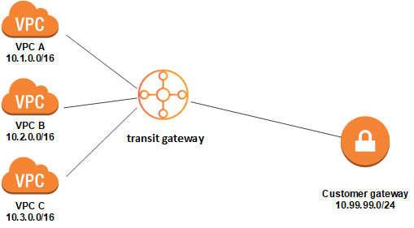

# 中转网关（transit gateways）
## 1. 什么是中转网关？
中转网关是网络中转中心，您可用它来互连 Virtual Private Cloud (VPC) 和本地网络（on-premises networks）。

有关更多信息，请参阅 [AWS Transit Gateway]()。
### 中转网关概念
以下是中转网关的关键概念：
- 挂载（Attachments ） — 您可以挂载以下各项：
  + 一个或多个 VPC
  + Connect SD-WAN/第三方网络设备
  + AWS Direct Connect 网关
  + 与另一个中转网关的对等连接
  + 与中转网关的 VPN 连接
- 中转网关最大传输单位 (MTU) — 网络连接的最大传输单位 (MTU) 是能够通过该连接传递的最大可允许数据包的大小（以字节为单位）。连接的 MTU 越大，可在单个数据包中传递的数据越多。对于 VPC、AWS Direct Connect、Transit Gateway Connect 和对等连接挂载之间的流量，中转网关支持的 MTU 为 8500 字节。VPN 连接上的流量可以具有的 MTU 为 1500 字节。
- 中转网关路由表 — 中转网关具有默认的路由表，且可选具有其他路由表。路由表包含动态路由和静态路由，它们根据数据包的目标 IP 地址决定下一个跃点。这些路由的目标可以是任何中转网关挂载。默认情况下，Transit Gateway 挂载与默认的中转网关路由表关联。
- 关联 — 每个挂载都正好与一个路由表关联。每个路由表可以与零到多个挂载关联。
- 路由传播 — VPC、VPN 连接或 Direct Connect 网关可以动态地将路由传播到中转网关路由表。默认情况下，使用 Connect 挂载，路由会传播到中转网关路由表。使用 VPC 时，您必须创建静态路由以将流量发送到中转网关。使用 VPN 连接或 Direct Connect 网关时，路由使用边界网关协议 (BGP) 从中转网关传播到本地路由器。使用对等连接的连接时，您必须在中转网关路由表中创建静态路由以指向对等连接。
### 使用中转网关
可以使用以下任意接口创建、访问和管理中转网关：
- AWS 管理控制台 — 提供一个 Web 界面，您可以使用该界面访问中转网关。
- AWS 命令行界面 (AWS CLI) — 提供用于众多 AWS 服务（包括 Amazon VPC）的命令，并且在 Windows、macOS 和 Linux 上受支持。有关更多信息，请参阅 [AWS 命令行界面](http://aws.amazon.com/cli/)。
- AWS 开发工具包 — 提供特定于语言的 API 操作，并关注许多连接详细信息，例如计算签名、处理请求重试和处理错误。有关更多信息，请参阅 [AWS 软件开发工具包](http://aws.amazon.com/tools/#SDKs)。
- 查询 API — 提供您使用 HTTPS 请求调用的低级别 API 操作。使用查询 API 是用于访问 Amazon VPC 的最直接方式，但需要您的应用程序处理低级别详细信息，例如生成哈希值以签署请求以及处理错误。有关更多信息，请参阅 [Amazon EC2 API 参考](https://docs.aws.amazon.com/AWSEC2/latest/APIReference/)。
### 定价
您需要按小时为中转网关上的每个挂载付费，并且需要为在中转网关上处理的流量付费。有关更多信息，请参阅 [AWS Transit Gateway 定价](http://aws.amazon.com/transit-gateway)。
## 2. 中转网关工作原理
中转网关充当区域虚拟路由器，用于路由在您的 Virtual Private Cloud (VPC) 和本地网络之间流动的流量。中转网关根据网络流量的规模灵活地进行扩展。通过中转网关进行路由是在第 3 层运行的，其中，数据包根据其目的地 IP 地址发送到特定的下一个跃点挂载。
### 资源挂载
Transit Gateway 挂载同时是数据包的源和目的地。您可以将以下资源附加到中转网关：
- 一个或多个 VPC
- 一个或多个 VPN 连接
- 一个或多个 AWS Direct Connect 网关
- 一个或多个中转网关连接挂载
- 一个或多个中转网关对等连接

如果您挂载了中转网关对等连接，则中转网关必须位于其它区域中。
### 可用区
当您将 VPC 连接到中转网关时，您必须启用要由中转网关使用的一个或多个可用区，以将流量路由到 VPC 子网中的资源。要启用每个可用区，您应指定确切一个子网。中转网关使用此子网中的一个 IP 地址将网络接口放入该子网中。在启用可用区之后，流量可路由到该可用区中的所有子网，而不只是指定的子网。驻留在没有 Transit Gateway 挂载的可用区内的资源将无法到达中转网关。

我们建议您启用多个可用区以确保可用性。

**使用设备模式支持**

默认情况下，当中转网关在 VPC 挂载之间路由流量时，它会将流量保持在发出流量的同一可用区中，直到流量到达目的地。只有在可用区出现故障或该可用区中没有与 VPC 挂载关联的子网时，流量才会在挂接之间跨过可用区。如果您计划在 VPC 中配置有状态的网络设备，则可以为该 VPC 挂载启用设备模式支持。这可以确保在源和目标之间传输流量的生命周期内，中转网关继续为该 VPC 挂载使用相同的可用区。它还允许中转网关将流量发送到 VPC 中的任何可用区，只要该可用区中存在子网关联。有关更多信息以及示例，请参阅 [示例：共享服务 VPC 中的设备](https://docs.aws.amazon.com/zh_cn/vpc/latest/tgw/transit-gateway-appliance-scenario.html)。
### 路由选择
您的中转网关使用中转网关路由表在挂载之间路由 IPv4 和 IPv6 数据包。您可以将这些路由表配置为传播所连接的 VPC、VPN 连接和 Direct Connect 网关的路由表中的路由。您还可以将静态路由添加到中转网关路由表中。当数据包来自一个连接时，会使用与目的地 IP 地址相符的路由，将该数据包路由到另一个连接。

中转网关对等连接仅支持静态路由。
#### 路由表
您的中转网关自动附带默认路由表。默认情况下，此路由表是默认的关联路由表和默认的传播路由表。或者，如果您禁用路由传播和路由表关联，AWS 不会为中转网关创建默认路由表。

您可以为中转网关创建其他路由表。这样，您就可以隔离连接的子网。每个连接可以与一个路由表相关联。一个挂载可以将其路由传播到一个或多个路由表。

您可以在中转网关路由表中创建丢弃与路由匹配的流量的黑洞路由。

将 VPC 附加到中转网关时，您必须向子网路由表添加路由，以使流量通过中转网关进行路由。有关更多信息，请参阅 [Amazon VPC 用户指南 中的中转网关的路由](https://docs.aws.amazon.com/vpc/latest/userguide/route-table-options.html#route-tables-tgw)。
#### 路由表关联
您可以将 Transit Gateway 挂载与单个路由表相关联。每个路由表可以与零到多个连接关联，并可以将数据包转发到其他连接。
#### 路由传播
每个挂载都附带可以安装到一个或多个中转网关路由表的路由。当挂载传播到中转网关路由表时，这些路由安装在路由表中。

对于 VPC 连接，VPC 的 CIDR 块将传播到中转网关路由表。

要附加 VPN 连接挂载或 Direct Connect 网关挂载，中转网关路由表中的路由会使用边界网关协议 (BGP) 在中转网关和本地路由器之间往返传播。
#### 对等连接的路由
您可以将两个中转网关对等连接并在它们之间路由流量。为此，您可以在中转网关上创建对等挂载，并指定要与其创建对等连接的对等中转网关。然后，您可以在中转网关路由表中创建静态路由，以将流量路由到中转网关对等挂载。路由到对等中转网关的流量随后可以路由到对等中转网关的 VPC 和 VPN 挂载。

有关更多信息，请参阅 [示例：对等中转网关](https://docs.aws.amazon.com/zh_cn/vpc/latest/tgw/transit-gateway-peering-scenario.html)。
#### 中转网关路由是按以下顺序评估的：
- 目标地址的最具体路由。
- 如果不同目标具有相同的路由：
  + 静态路由（包括静态站点到站点 VPN 路由）的优先级高于传播的路由。
  + 对于传播的路由，采用以下顺序：
    + VPC 具有最高优先级。
    + Direct Connect 网关具有第二高优先级。
    + Transit Gateway Connect 具有第三高优先级。
    + 站点到站点 VPN 的优先级为第四

请考虑以下 VPC 路由表。VPC 本地路由具有最高的优先级，然后是最具体的路由。在静态路由和传播的路由具有相同的目标时，静态路由具有更高的优先级。

目的地|目标|优先级
-------|--------|--------
10.0.0.0/16|本地|1
192.168.0.0/16|pcx-12345|2
172.31.0.0/16|vgw-12345（静态）或 tgw-12345（静态）|2
172.31.0.0/16|vgw-12345（传播）|3
0.0.0.0/0|igw-12345|4

考虑下面的中转网关路由表。在静态路由和传播的路由具有相同的目标时，静态路由具有更高的优先级。如果要通过 VPN 挂载使用 AWS Direct Connect 网关挂载，则使用 BGP VPN 挂载并传播中转网关路由表中的路由。

目的地|连接（目标）|资源类型|路由类型|优先级
--------|--------|--------|--------|--------
10.0.0.0/16|tgw-attach-123 | vpc-1234|VPC|静态或传播|1
192.168.0.0/16|tgw-attach-789 | vpn-5678|VPN|静态|2
172.31.0.0/16|tgw-attach-456 | dxgw_id|AWS Direct Connect 网关|传播|3
172.31.0.0/16|tgw-attach-789 | tgw-connect-peer-123|VPN|传播|4
172.31.0.0/16|tgw-attach-789 | vpn-5678|VPN|传播|5
## 3. 开始使用
### 先决条件
- 要演示使用中转网关的简单示例，请在同一个区域中创建两个 VPC。这些 VPC 不能具有重叠的 CIDR。在每个 VPC 中启动一个 EC2 实例。有关更多信息，请参阅 [Amazon VPC 用户指南](https://docs.aws.amazon.com/vpc/latest/userguide/) 中的[适用于 Amazon VPC 的 IPv4 入门](https://docs.aws.amazon.com/vpc/latest/userguide/getting-started-ipv4.html)。
- 您不能具有完全相同的路由指向两个不同的 VPC。如果中转网关路由表中存在相同的路由，中转网关不会传播新挂载的 VPC 的 CIDR。
- 验证您拥有使用中转网关所需的权限。有关更多信息，请参阅 [中转网关的身份验证和访问控制](https://docs.aws.amazon.com/zh_cn/vpc/latest/tgw/transit-gateway-authentication-access-control.html)。
### 步骤 1：创建中转网关
当您创建中转网关时，我们创建一个默认的中转网关路由表，并将其用作默认的关联路由表（the default association route table）和默认的传播路由表（the default propagation route table）。

1. 通过以下网址打开 Amazon VPC 控制台：https://console.aws.amazon.com/vpc/。
2. 在“区域”选择器中，选择您在创建 VPC 时使用的区域。
3. 在导航窗格中，选择 **Transit Gateways (中转网关)**。
4. 选择 **Create Transit Gateway (创建中转网关)**。
5. （可选）对于 **Name tag (名称标签)**，键入中转网关的名称。这会创建将“名称”作为键以及将您指定的名称作为值的标签。
6. （可选）对于 **Description (描述)**，键入中转网关的描述。
7. 对于 **Amazon side ASN (Amazon 端 ASN)**，键入中转网关的私有自治系统编号 (ASN)。这应该是边界网关协议 (BGP) 会话的 AWS 端的 ASN。
  对于 16 位 ASN，范围为 64512 到 65534。
  对于 32 位 ASN，范围为 4200000000 到 4294967294。
  如果您有多区域部署，我们建议您为每个中转网关使用唯一的 ASN。
8. （可选）如果您需要禁用 DNS 支持，或者不想要默认的关联路由表或默认的传播路由表，则可以修改默认设置。
9. 选择 **Create Transit Gateway (创建中转网关)**。
10. 在您看到消息 **Create Transit Gateway request succeeded (创建中转网关请求成功)** 后，选择 **Close (关闭)**。中转网关的初始状态为 **pending**。
### 步骤 2：将 VPC 挂载到中转网关（Attach your VPCs to your transit gateways）
等到您在上一部分中创建的中转网关显示为可用后，继续创建挂载。为每个 VPC 创建连接。

确认您已创建了两个 VPC，并在每个 VPC 中启动了一个 EC2 实例，如先决条件中所述。

1. 通过以下网址打开 Amazon VPC 控制台：https://console.aws.amazon.com/vpc/。
2. 在导航窗格中，选择 **Transit Gateway Attachments (中转网关挂载)**。
3. 选择 **Create Transit Gateway Attachment (创建中转网关挂载)**。
4. 对于 **Transit Gateway ID (中转网关 ID)**，选择要用于挂载的中转网关。
5. 对于 **Attachment type (挂载类型)**，选择 VPC。
6. （可选）对于 **Attachment name tag (挂载名称标签)**，输入挂载的名称。
7. 选择是否启用 **DNS support (DNS 支持)**。对于此练习，请勿启用 **IPv6 support (IPv6 支持)**。
8. 对于 **VPC ID**，选择要挂载到中转网关的 VPC。
9. 对于 **Subnet IDs (子网 ID)**，为中转网关要用于路由流量的每个可用区域选择一个子网。您必须至少选择一个子网。您只能为每个可用区域选择一个子网。
10. 选择 **Create attachment (创建挂载)**。

每个挂载都始终与正好一个路由表关联。路由表可以与零到多个挂载关联。要确定要配置的路由，请决定中转网关的使用案例，然后配置路由。有关更多信息，请参阅 [示例](https://docs.aws.amazon.com/zh_cn/vpc/latest/tgw/TGW_Scenarios.html)。
### 步骤 3：在中转网关与 VPC 之间添加路由
路由表包含动态路由和静态路由，它们根据数据包的目的地 IP 地址决定关联 VPC 的下一个跃点。配置具有非本地路由目的地和中转网关挂载 ID 目标的路由。有关更多信息，请参阅 Amazon VPC 用户指南中的[中转网关的路由](https://docs.aws.amazon.com/vpc/latest/userguide/route-table-options.html#route-tables-tgw)。

向 VPC 路由表中添加路由（To add a route to a VPC route table）：
1. 通过以下网址打开 Amazon VPC 控制台：https://console.aws.amazon.com/vpc/。
2. 在导航窗格中，选择路由表。
3. 选择与 VPC 关联的路由表。
4. 选择 **Routes (路由) 选项卡**，然后选择 **Edit routes (编辑路由)**。
5. 选择 **Add route (添加路由)**。
6. 在 **Destination (目的地)** 列中，输入目的地 IP 地址范围。对于 **Target（目标）**，请选择中转网关挂载 ID。
7. 选择 **Save routes (保存路由)**，然后选择 **Close (关闭)**。
### 步骤 4：测试中转网关
您可以确认中转网关已成功创建，方法是：通过连接到每个 VPC 中的一个 EC2 实例，然后在它们之间发送数据，如 ping 命令。有关更多信息，请参阅[连接到您的 Linux 实例](https://docs.aws.amazon.com/AWSEC2/latest/UserGuide/AccessingInstances.html)或[连接到您的 Windows 实例](https://docs.aws.amazon.com/AWSEC2/latest/WindowsGuide/connecting_to_windows_instance.html)。
### 步骤 5：删除中转网关
当您不再需要中转网关时，可以将其删除。您不能删除具有资源挂载的中转网关。一旦中转网关被删除，您就停止对其产生费用。

1. 通过以下网址打开 Amazon VPC 控制台：https://console.aws.amazon.com/vpc/。
2. 在导航窗格中，选择 **Transit Gateway Attachments (中转网关挂载)**。
3. 选择挂载，然后依次选择操作、删除。当系统提示进行确认时，选择 **Delete (删除)**。
4. 在导航窗格中，选择 **Transit Gateways (中转网关)**。
5. 选择中转网关，然后依次选择 **Actions (操作)** 和 **Delete (删除)**。当系统提示进行确认时，选择 **Delete**。
## 4. 示例
以下是中转网关的常见使用案例。您的中转网关并不仅限于这些使用案例。
### 4.1 示例：集中式路由器（Centralized router）
您可以将中转网关配置为连接所有 VPC、AWS Direct Connect 和站点到站点 VPN 连接的集中路由器。在该方案中，所有连接与中转网关默认路由表相关联，并传播到中转网关默认路由表。因此，所有挂载都可以将数据包路由到彼此，而将中转网关用作简单第 3 层 IP 路由器。
#### 4.1.1 概述
下表展示了此方案配置的主要组成部分。在这种情况下，中转网关有三个 VPC 挂载和一个站点到站点 VPN 挂载（Site-to-Site VPN attachment）。来自 VPC A、VPC B 和 VPC C 并将其他 VPC 中的子网或 VPN 连接作为目的地的数据包，首先通过中转网关路由。



在该方案中，您为该方案创建以下实体：
- 三个 VPC。有关创建 VPC 的信息，请参阅 Amazon Virtual Private Cloud 用户指南中的[创建 VPC](https://docs.aws.amazon.com/vpc/latest/userguide/working-with-vpcs.html#Create-VPC)。
- 中转网关。有关更多信息，请参阅[创建中转网关](https://docs.aws.amazon.com/zh_cn/vpc/latest/tgw/tgw-transit-gateways.html#create-tgw)。
- 中转网关上有三个 VPC 挂载。有关更多信息，请参阅 创建 [VPC 的 Transit Gateway 挂载](https://docs.aws.amazon.com/zh_cn/vpc/latest/tgw/tgw-vpc-attachments.html#create-vpc-attachment)。
- 中转网关上的站点到站点 VPN 挂载。有关更多信息，请参阅[创建 VPN 的中转网关挂载](https://docs.aws.amazon.com/zh_cn/vpc/latest/tgw/tgw-vpn-attachments.html#create-vpn-attachment)。确保您查看了 AWS 站点到站点 VPN 用户指南中的[客户网关设备的要求](https://docs.aws.amazon.com/vpn/latest/s2svpn/your-cgw.html#CGRequirements)。

在创建 VPC 挂载时，每个 VPC 的 CIDR 块将传播到中转网关路由表。在 VPN 连接启动后，将建立 BGP 会话，站点到站点 VPN CIDR 传播到中转网关路由表，并将 VPC CIDR 添加到客户网关 BGP 表中。
#### 4.1.2 路由选择
每个 VPC 具有一个路由表，并且中转网关具有一个路由表。
##### VPC 路由表
每个 VPC 具有一个包含 2 个条目的路由表。第一个条目是 VPC 中本地 IPv4 路由的默认条目；此条目允许此 VPC 中的实例相互通信。第二个条目将所有其他 IPv4 子网流量路由到中转网关。下表显示了 VPC A 路由。

目的地|目标
--------|--------
10.1.0.0/16|本地
0.0.0.0/0|tgw-id
##### 中转网关路由表
下面是前一个图中显示的连接的默认路由表示例（启用了路由传播）。

目的地|目标|路由类型
--------|--------|--------
10.1.0.0/16|VPC A 的连接|传播
10.2.0.0/16|VPC B 的连接|传播
10.3.0.0/16|VPC C 的连接|传播
10.99.99.0/24|VPN 连接的连接|传播
##### 客户网关 BGP 表
客户网关 BGP 表包含以下 VPC IP CIDR。
+ 10.1.0.0/16
+ 10.2.0.0/16
+ 10.3.0.0/16
### 4.2 示例：隔离 VPC
您可以将中转网关配置为多个隔离的路由器。这类似于使用多个中转网关，但在路由和挂载可能更改的情况下可提供更大的灵活性。在此方案中，每个隔离的路由器都有单个路由表。所有与隔离的路由器关联的挂载都传播其路由表并与这些路由表关联。与一个隔离的路由器关联的挂载可以将数据包路由到彼此，但无法将数据包路由到另一个隔离路由器的挂载或从中接收数据包。
#### 4.2.1 概述
下表展示了此方案配置的主要组成部分。来自 VPC A、VPC B 和 VPC C 的数据包路由到中转网关。来自 VPC A、VPC B 和 VPC C 中的子网并将 Internet 作为目的地的数据包先通过中转网关进行路由，然后路由到站点到站点 VPN（如果目的地在该网络中）。来自一个 VPC 并将另一个 VPC 中的子网作为目的地的数据包（例如从 10.1.0.0 到 10.2.0.0）通过中转网关进行路由，将在其中阻止这些数据包，因为在中转网关路由表中没有它们的路由。


在该方案中，您创建以下实体：
- 三个 VPC。有关创建 VPC 的信息，请参阅 Amazon Virtual Private Cloud 用户指南中的[创建 VPC](https://docs.aws.amazon.com/vpc/latest/userguide/working-with-vpcs.html#Create-VPC)。
- 中转网关。有关更多信息，请参阅[创建中转网关](https://docs.aws.amazon.com/zh_cn/vpc/latest/tgw/tgw-transit-gateways.html#create-tgw)。
- 中转网关上用于三个 VPC 的三个挂载。有关更多信息，请参阅[创建 VPC 的 Transit Gateway 挂载](https://docs.aws.amazon.com/zh_cn/vpc/latest/tgw/tgw-vpc-attachments.html#create-vpc-attachment)。
- 中转网关上的站点到站点 VPN 挂载。有关更多信息，请参阅[创建 VPN 的中转网关挂载](https://docs.aws.amazon.com/zh_cn/vpc/latest/tgw/tgw-vpn-attachments.html#create-vpn-attachment)。确保您查看了 AWS 站点到站点 VPN 用户指南中的[客户网关设备的要求](https://docs.aws.amazon.com/vpn/latest/s2svpn/your-cgw.html#CGRequirements)。

在 VPN 连接启动后，将建立 BGP 会话，VPN CIDR 传播到中转网关路由表，并将 VPC CIDR 添加到客户网关 BGP 表中。
#### 4.2.2 路由选择
每个 VPC 都有一个路由表，而中转网关有两个路由表：一个用于 VPC，另一个用于 VPN 连接。

**VPC A、VPC B 和 VPC C 路由表**
每个 VPC 具有一个包含 2 个条目的路由表。第一个条目是 VPC 中本地 IPv4 路由的默认条目。此条目使该 VPC 中的实例能够相互通信。第二个条目将所有其他 IPv4 子网流量路由到中转网关。下表显示了 VPC A 路由。

目的地|目标
--------|--------
10.1.0.0/16|本地
0.0.0.0/0	|tgw-id

**中转网关路由表**
此方案为 VPC 使用一个路由表，为 VPN 连接使用一个路由表。

VPC 挂载与以下路由表相关联，该路由表具有 VPN 挂载的传播路由。

目的地|目标|路由类型
--------|--------|--------
10.99.99.0/24|VPN连接的挂载|传播

VPN 挂载与以下路由表相关联，该路由表具有每个 VPC 连接的传播路由。

目的地|目标|路由类型
--------|--------|--------
10.1.0.0/16|VPC A 的挂载|传播
10.2.0.0/16|VPC B 的挂载|传播
10.3.0.0/16|VPC C 的挂载|传播

有关在中转网关路由表中传播路由的更多信息，请参阅[将路由传播到中转网关路由表](https://docs.aws.amazon.com/zh_cn/vpc/latest/tgw/tgw-route-tables.html#enable-tgw-route-propagation)。

**客户网关 BGP 表**
客户网关 BGP 表包含以下 VPC IP CIDR。
- 10.1.0.0/16
- 10.2.0.0/16
- 10.3.0.0/16
### 4.3 示例：具有共享服务的隔离 VPC
### 4.4 示例：对等中转网关
### 4.5 示例：到互联网的集中出站路由
### 4.6 示例：共享服务 VPC 中的设备
## 5. 使用中转网关
### 5.1 中转网关
### 5.2 VPC 的 Transit Gateway 挂载
### 5.3 将中转网关连接到 Direct Connect 网关
### 5.4 Transit Gateway VPN 挂载
### 5.5 中转网关对等连接挂载
### 5.6 中转网关 Connect 挂载和 Connect 对等节点
### 5.7 中转网关路由表
### 5.8 中转网关上的多播
多播是一种通信协议，用于同时向多台接收计算机传输单个数据流。中转网关支持在所连接 VPC 的子网之间路由多播流量，并充当实例的多播路由器，以将流量发送到多个接收实例目标。

**多播概念**
以下是多播的主要概念：
- **多播域** — 允许将一个多播网络分段成不同的域，并将中转网关用作多播路由器。您可以在子网级别定义多播域成员资格。
- **多播组** — 识别一组将发送和接收相同多播流量的主机。多播组由组 IP 地址标识。多播组成员资格由附加到 EC2 实例的单个弹性网络接口定义。
- Internet 组管理协议 (IGMP) — 允许主机和路由器动态管理多播组成员资格的互联网协议。IGMP 多播域包含使用 IGMP 协议加入、离开和发送消息的主机。AWS 支持 IGMPv2 协议以及 IGMP 和静态（基于 API 的）组成员资格多播域。
- **多播源** — 静态配置的与支持的 EC2 实例关联的弹性网络接口，用于发送多播流量。多播源仅适用于静态源配置。

  静态源多播域包含不使用 IGMP 协议加入、离开和发送消息的主机。您可以使用 AWS CLI 添加源成员和组成员。静态添加的源发送多播流量，成员接收多播流量。
- **多播组成员** — 与支持的 EC2 实例关联的弹性网络接口，用于接收多播流量。多播组具有多个组成员。在静态源组成员资格配置中，多播组成员只能接收流量。在 IGMP 组配置中，成员既可以发送流量，也可以接收流量。

**注意事项**

- 有关受支持区域的信息，请参阅 [AWS Transit Gateway 常见问题解答](http://aws.amazon.com/transit-gateway/faqs)。
- 您必须创建一个新的中转网关才能支持多播。
- 多播组成员资格是使用 Amazon VPC 控制台或 AWS CLI 或 IGMP 进行管理的。
- 一个子网只能位于一个多播域中。
- 如果您使用非 Nitro 实例，则必须禁用 Source/Dest (源/目标) 检查。有关禁用检查的信息，请参阅适用于 Linux 实例的 Amazon EC2 用户指南中的[更改源或目标检查](https://docs.aws.amazon.com/AWSEC2/latest/UserGuide/using-eni.html#change_source_dest_check)。
- 非 Nitro 实例不能是多播发送方。
- AWS Direct Connect、站点到站点 VPN 或对等挂载不支持多播路由。
- 中转网关不支持多播数据包分段。分段多播数据包会被丢弃。有关更多信息，请参阅[MTU](https://docs.aws.amazon.com/zh_cn/vpc/latest/tgw/transit-gateway-quotas.html#mtu-quota)。
- 启动时，IGMP 主机会发送多条 IGMP JOIN 消息以加入多播组（通常重试 2 到 3 次）。如果发生了所有 IGMP JOIN 消息均丢失的不太可能的情况，主机将不会成为中转网关多播组的一部分。在这种情况下，您需要使用特定于应用程序的方法从主机重新触发 IGMP JOIN 消息。
- 中转网关会跟踪成功加入多播组的主机。在中转网关中断的情况下，中转网关在上次成功发出 IGMP JOIN 消息后继续向主机发送多播数据 7 分钟（420 秒）。中转网关会继续向主机发送会员资格查询，最长持续 12 个小时，或直到它收到来自主机的 IGMP LEAVE 消息为止。
- 中转网关将成员资格查询数据包发送给所有 IGMP 成员，以便它可以跟踪多播组成员资格。这些 IGMP 查询数据包的源 IP 为 0.0.0.0/32，目标 IP 为 224.0.0.1/32，协议为 2。IGMP 主机（实例）上的安全组配置以及主机子网上的任何 ACL 配置都必须允许这些 IGMP 协议消息。
#### 5.8.1 多播路由
在中转网关上启用多播时，它将充当多播路由器。当您将子网添加到某个多播域时，我们会将所有多播流量发送到与该多播域关联的中转网关。
##### 网络 ACL
网络 ACL 规则在子网级别运行并应用到多播流量，因为中转网关位于子网之外。有关网络 ACL 的信息，请参阅 Amazon VPC 用户指南中的[网络 ACL](https://docs.aws.amazon.com/vpc/latest/userguide/vpc-network-acls.html)。

**你必须为 IGMP 多播流量设置如下所示最小入站规则：**

类型|协议|源|目标|描述
-------|-------|--------|--------|-------
Custom Protocol|IGMP(2)|0.0.0.0/32|224.0.0.1/32|IGMP query
Custom UDP Protocol|UDP|The remote host IP address. This is the IP address of the host that sends the multicast traffic.|Multicast group IP address|Inbound multicast traffic

**你必须为 IGMP 多播流量设置如下所示最小出站规则：**
类型|协议|源|目标|描述
-------|-------|--------|--------|-------
Custom Protocol|IGMP(2)|Host IP address|224.0.0.2/32|IGMP leave
Custom Protocol|IGMP(2)|Host IP address|Multicast group IP address|IGMP join
Custom UDP Protocol|UDP|Host IP address|Multicast group IP address|Outbound multicast traffic
##### 安全组
安全组规则在实例级别运行，可以同时应用于入站和出站多播流量。行为与单播流量相同。对于所有组成员实例，您必须允许来自组源的入站流量。有关安全组的信息，请参阅 Amazon VPC 用户指南 中的[安全组](https://docs.aws.amazon.com/vpc/latest/userguide/VPC_SecurityGroups.html)。

**你必须为 IGMP 多播流量设置如下所示最小入站规则：**

类型|协议|源|描述
-------|-------|--------|--------
Custom Protocol|2|Custom/0.0.0.0/32|IGMP query
Custom UDP Protocol|UDP|Custom/Remote host IP address. This is the IP address of the host that sends the multicast traffic.|Inbound multicast traffic

**你必须为 IGMP 多播流量设置如下所示最小出站规则：**
类型|协议|源|描述
-------|-------|--------|--------
Custom Protocol|2|Custom/224.0.0.2/32|IGMP leave
Custom Protocol|2|Custom/Multicast group IP address|IGMP join
CustomUDP Protocol|UDP|Custom/Multicast group IP address|Outbound multicast traffic
#### 5.8.2 多播路由
您可以使用 Amazon VPC 控制台或 AWS CLI 在中转网关上配置多播。

在创建多播域之前，您需要知道主机是否为多播流量使用了 Internet 组管理协议 (IGMP) 协议。

下表详细介绍了多播域属性。

- Igmpv2Support (AWS CLI)，IGMPv2 支持（Amazon VPC 控制台)：此属性决定组成员如何加入或退出多播组。
  当此属性设置为禁用时，您必须使用 Amazon VPC 控制台或 AWS CLI 将组成员添加到域。

  在至少有一个成员使用 IGMP 协议时将此值设置为启用。成员通过以下方式之一加入多播组：

  支持 IGMP 的成员使用 JOIN 和 LEAVE 消息。

  必须使用 Amazon VPC 控制台或 AWS CLI 在组中添加或删除不支持 IGMP 的成员。

  > **注意**: 如果您使用 Amazon VPC 控制台或 AWS CLI 手动注册多播组成员，则必须将其取消注册。中转网关将忽略手动添加的组成员发送的 IGMP LEAVE 消息。
- StaticSourcesSupport (AWS CLI)： 静态源支持（Amazon VPC 控制台）
  此属性确定该组是否有静态多播源。

  当此属性设置为启用时，您需要使用 register-transit-gateway-multicast-group-sources 静态添加多播域的源。只有多播源才能发送多播流量。

  > **注意**: 将 Igmpv2Support 属性设置为启用时，您不能将 staticSourcesEnable 设置为启用。如果将此属性设置为禁用，则没有指定的多播源。位于与多播域关联的子网中的任何实例都可以发送多播流量，组成员将接收多播流量。
##### 5.8.2.1 管理 IGMP 配置
当您至少有一台主机将 IGMP 协议用于多播流量时，AWS 会在收到来自实例的 IGMP JOIN 消息时自动创建多播组，然后将该实例添加为该组中的成员。您还可以使用 AWS CLI 静态将非 IGMP 主机作为成员添加到组中。位于与多播域关联的子网中的任何实例都可以发送流量，组成员将接收多播流量。

使用以下步骤完成配置：
1. 创建 VPC。有关创建 VPC 的更多信息，请参阅 Amazon VPC 用户指南中的[创建 VPC](https://docs.aws.amazon.com/vpc/latest/userguide/working-with-vpcs.html#Create-VPC)。
2. 在 VPC 中创建子网。有关创建子网的更多信息，请参阅 Amazon VPC 用户指南中的[在 VPC 中创建子网](https://docs.aws.amazon.com/vpc/latest/userguide/working-with-vpcs.html#AddaSubnet)。
3. 创建为多播流量配置的中转网关。有关更多信息，请参阅[创建中转网关](https://docs.aws.amazon.com/zh_cn/vpc/latest/tgw/tgw-transit-gateways.html#create-tgw)。
4. 创建 VPC 挂载。有关更多信息，请参阅[创建 VPC 的 Transit Gateway 挂载](https://docs.aws.amazon.com/zh_cn/vpc/latest/tgw/tgw-vpc-attachments.html#create-vpc-attachment)。
5. 创建为 IGMP 支持配置的多播域。有关更多信息，请参阅[创建 IGMP 多播域](https://docs.aws.amazon.com/zh_cn/vpc/latest/tgw/manage-domain.html#create-tgw-igmp-domain)。
   使用以下设置：
   - 将 **IGMPv2 支持**属性设置为**启用**。
   - 将**静态源支持**属性设置为**禁用**。
6. 在中转网关 VPC 挂载中的子网和多播域之间创建关联。有关更多信息，请参阅[将 VPC 挂载和子网与多播域关联](https://docs.aws.amazon.com/zh_cn/vpc/latest/tgw/manage-domain.html#associate-attachment-to-domain)。
7. EC2 的默认 IGMP 版本是 IGMPv3。您需要更改所有 IGMP 组成员的版本。您可以运行以下命令：
  ```
   sudo sysctl net.ipv4.conf.eth0.force_igmp_version=2
   ```
  然后，您可以运行以下命令，将多播 IP 地址添加到网络接口的 eth0：
  ```
  sudo ip addr add multicast-ip-address dev eth0 autojoin
  ```
  示例
  ```
  sudo ip addr add 239.255.0.1/32 dev eth0 autojoin
  ```
8. 将不使用 IGMP 协议的成员添加到多播组。有关更多信息，请参阅[将成员注册到多播组](https://docs.aws.amazon.com/zh_cn/vpc/latest/tgw/manage-multicast-group.html#add-members-multicast-group)。
##### 5.8.2.2 管理静态源配置
在此配置中，您需要在组中静态添加多播源。主机不使用 IGMP 协议加入或退出多播组。您需要静态添加接收多播流量的组成员。

使用以下步骤完成配置：
1. 创建 VPC。有关创建 VPC 的更多信息，请参阅 Amazon VPC 用户指南中的[创建 VPC](https://docs.aws.amazon.com/vpc/latest/userguide/working-with-vpcs.html#Create-VPC)。
2. 在 VPC 中创建子网。有关创建子网的更多信息，请参阅 Amazon VPC 用户指南中的[在 VPC 中创建子网](https://docs.aws.amazon.com/vpc/latest/userguide/working-with-vpcs.html#AddaSubnet)。
3. 创建为多播流量配置的中转网关。有关更多信息，请参阅[创建中转网关](https://docs.aws.amazon.com/zh_cn/vpc/latest/tgw/tgw-transit-gateways.html#create-tgw)。
4. 创建 VPC 挂载。有关更多信息，请参阅[创建 VPC 的 Transit Gateway 挂载](https://docs.aws.amazon.com/zh_cn/vpc/latest/tgw/tgw-vpc-attachments.html#create-vpc-attachment)。
5. 创建配置为不支持 IGMP 的多播域，并支持静态添加源。有关更多信息，请参阅[创建静态源多播域](https://docs.aws.amazon.com/zh_cn/vpc/latest/tgw/manage-domain.html#create-tgw-domain)。
   使用以下设置：
   + 将 IGMPv2 支持属性设置为禁用。
   + 要手动添加源，请将静态源支持属性设置为启用。
     当属性被设置为启用时，源是唯一可以发送多播流量的资源。否则，位于与多播域关联的子网中的任何实例都可以发送多播流量，组成员将接收多播流量。
6. 在中转网关 VPC 挂载中的子网和多播域之间创建关联。有关更多信息，请参阅[将 VPC 挂载和子网与多播域关联](https://docs.aws.amazon.com/zh_cn/vpc/latest/tgw/manage-domain.html#associate-attachment-to-domain)。
7. 如果将静态源支持属性设置为启用，请将源添加到多播组。有关更多信息，请参阅[将源注册到多播组](https://docs.aws.amazon.com/zh_cn/vpc/latest/tgw/manage-multicast-group.html#add-source-multicast-group)。
8. 将成员添加到多播组。有关更多信息，请参阅[将成员注册到多播组](https://docs.aws.amazon.com/zh_cn/vpc/latest/tgw/manage-multicast-group.html#add-members-multicast-group)。
##### 5.8.2.3 管理静态组成员配置
在此配置中，您需要静态地将多播成员添加到组中。主机不能使用 IGMP 协议加入或退出多播组。位于与多播域关联的子网中的任何实例都可以发送多播流量，组成员将接收多播流量。

使用以下步骤完成配置：
1. 创建 VPC。有关创建 VPC 的更多信息，请参阅 Amazon VPC 用户指南中的[创建 VPC](https://docs.aws.amazon.com/vpc/latest/userguide/working-with-vpcs.html#Create-VPC)。
2. 在 VPC 中创建子网。有关创建子网的更多信息，请参阅 Amazon VPC 用户指南中的在[] VPC 中创建子网](https://docs.aws.amazon.com/vpc/latest/userguide/working-with-vpcs.html#AddaSubnet)。
3. 创建为多播流量配置的中转网关。有关更多信息，请参阅[创建中转网关](https://docs.aws.amazon.com/zh_cn/vpc/latest/tgw/tgw-transit-gateways.html#create-tgw)。
4. 创建 VPC 挂载。有关更多信息，请参阅 [创建 VPC 的 Transit Gateway 挂载](https://docs.aws.amazon.com/zh_cn/vpc/latest/tgw/tgw-vpc-attachments.html#create-vpc-attachment)。
5. 创建配置为不支持 IGMP 的多播域，并支持静态添加源。有关更多信息，请参阅[创建静态源多播域](https://docs.aws.amazon.com/zh_cn/vpc/latest/tgw/manage-domain.html#create-tgw-domain)。
   使用以下设置：
   + 将 IGMPv2 支持属性设置为禁用。
   + 将静态源支持属性设置为禁用。
6. 在中转网关 VPC 挂载中的子网和多播域之间创建关联。有关更多信息，请参阅[将 VPC 挂载和子网与多播域关联](https://docs.aws.amazon.com/zh_cn/vpc/latest/tgw/manage-domain.html#associate-attachment-to-domain)。
7. 将成员添加到多播组。有关更多信息，请参阅[将成员注册到多播组](https://docs.aws.amazon.com/zh_cn/vpc/latest/tgw/manage-multicast-group.html#add-members-multicast-group)。
##### 5.8.2.4 管理多播域（Managing multicast domains）
要开始将多播与中转网关结合使用，请创建多播域，然后将子网与域关联。
###### 创建 IGMP 多播域
如果您尚未执行此操作，请查看可用的多播域属性。有关更多信息，请参阅[使用多播](https://docs.aws.amazon.com/zh_cn/vpc/latest/tgw/working-with-multicast.html)。

**Console**
要使用控制台创建 IGMP 多播域
1. 通过以下网址打开 Amazon VPC 控制台：https://console.aws.amazon.com/vpc/。
3. 在导航窗格中，选择**中转网关多播**。
4. 对于 **Name tag（命名标签）**，输入用于标识域的名称。
4. 对于 **Transit Gateway ID（中转网关 ID）**，选择处理多播流量的中转网关。
5. 对于 **IGMPv2 支持**，请选中该复选框。
6. 对于**静态源支持**，请清除该复选框。
7. 要自动接受此多播域的跨账户子网关联，请选择 **Auto accept shared associations（自动接受共享关联）**。
8. 选择**创建中转网关多播域**。

**使用 create-transit-gateway-multicast-domain 命令。**
```
aws ec2 create-transit-gateway-multicast-domain --transit-gateway-id tgw-0xexampleid12345 --options StaticSourcesSupport=disable,Igmpv2Support=enable
```
###### 创建静态源多播域
如果您尚未执行此操作，请查看可用的多播域属性。有关更多信息，请参阅[使用多播](https://docs.aws.amazon.com/zh_cn/vpc/latest/tgw/working-with-multicast.html)。

**Console**
要使用控制台创建静态多播域
1. 通过以下网址打开 Amazon VPC 控制台：https://console.aws.amazon.com/vpc/。
2. 在导航窗格中，选择**中转网关多播**。
3. 对于 **Name tag（命名标签）**，输入用于标识域的名称。
4. 对于 **Transit Gateway ID（中转网关 ID）**，选择处理多播流量的中转网关。
5. 对于 **IGMPv2** 支持，请清除该复选框。
6. 要手动添加源，请将**静态源支持**属性设置为**启用**。
7. 要自动接受此多播域的跨账户子网关联，请选择 **Auto accept shared associations（自动接受共享关联）**。
8. 选择**创建中转网关多播域**。

**使用 create-transit-gateway-multicast-domain 命令。**
```
aws ec2 create-transit-gateway-multicast-domain --transit-gateway-id tgw-0xexampleid12345 --options StaticSourcesSupport=enable,Igmpv2Support=disable
```
###### 将 VPC 挂载和子网与多播域关联
使用以下过程将 VPC 挂载与多播域关联。创建关联时，您可以随后选择要包括在多播域中的子网。

开始之前，您必须先在中转网关上创建 VPC 挂载。有关更多信息，请参阅 [VPC 的 Transit Gateway 挂载](https://docs.aws.amazon.com/zh_cn/vpc/latest/tgw/tgw-vpc-attachments.html)。

**Console**
要使用控制台将 VPC 挂载与多播域关联
1. 通过以下网址打开 Amazon VPC 控制台：https://console.aws.amazon.com/vpc/。
2. 在导航窗格中，选择**中转网关多播**。
3. 选择多播域，然后依次选择 **Actions（操作）**、**Create association（创建关联）**。
4. 对于 **Transit Gateway ID (中转网关 ID)**，选择 **Transit Gateway 挂载**。
5. 对于 **Choose subnets to associate（选择要关联的子网）**，选择要包括在多播域中的子网。
6. 选择**创建关联**。

**要使用 AWS CLI 将 VPC 挂载与多播域关联**
使用 [associate-transit-gateway-multicast-domain](https://docs.aws.amazon.com/cli/latest/reference/ec2/associate-transit-gateway-multicast-domain.html) 命令。
###### 查看您的多播域关联
您可以查看多播域以验证这些域可用，并且包含了相应的子网和挂载。

**Console**
要使用控制台查看多播域
1. 通过以下网址打开 Amazon VPC 控制台：https://console.aws.amazon.com/vpc/。
2. 在导航窗格中，选择**中转网关多播**。
3. 选择多播域。

**要使用 AWS CLI 查看多播域**
使用 [describe-transit-gateway-multicast-domains](https://docs.aws.amazon.com/cli/latest/reference/ec2/describe-transit-gateway-multicast-domains.html) 命令。
###### 向多播域添加标签
向资源添加标签以帮助整理和识别资源，例如，按用途、拥有者或环境。您可以向每个多播域添加多个标签。每个多播域的标签键必须唯一。如果您添加的标签中的键已经与多播域关联，它将更新该标签的值。有关更多信息，请参阅[标记 Amazon EC2 资源](https://docs.aws.amazon.com/AWSEC2/latest/UserGuide/Using_Tags.html)。

**Console**
使用控制台向中转网关添加标签
1. 通过以下网址打开 Amazon VPC 控制台：https://console.aws.amazon.com/vpc/。
2. 在导航窗格中，选择**中转网关多播**。
3. 选择**要添加或编辑标签的多播域**。
4. 在页面的下面部分选择 **Tags (标签) 选项卡**。
5. 选择**添加/编辑标签**。
6. 选择**创建标签**。
7. 输入标签的键和值。
8. 选择 **Save**。
###### 取消子网与多播域的关联
使用以下过程取消子网与多播域的关联。

**Console**
使用控制台取消子网的关联
1. 通过以下网址打开 Amazon VPC 控制台：https://console.aws.amazon.com/vpc/。
2. 在导航窗格中，选择**中转网关多播**。
3. 选择**多播域**。
4. 选择 **Associations (关联) 选项卡**。
5. 选择**子网**，然后选择 **Remove association (删除关联)**。

**使用 AWS CLI 取消子网的关联**
使用 [disassociate-transit-gateway-multicast-domain](https://docs.aws.amazon.com/cli/latest/reference/ec2/API_DisassociateTransitGatewayMulticastDomain.html) 命令。
###### 删除多播域
使用以下过程删除中多播域。

**Console**
要使用控制台删除多播域
1. 通过以下网址打开 Amazon VPC 控制台：https://console.aws.amazon.com/vpc/。
2. 在导航窗格中，选择**中转网关多播**。
3. 选择**多播域**，然后依次选择 **Actions（操作）**、**Delete multicast domain（删除多播域）**。
4. 选择 **Delete**。

**要使用 AWS CLI 删除多播域**
使用 [delete-transit-gateway-multicast-domain](https://docs.aws.amazon.com/cli/latest/reference/ec2/delete-transit-gateway-multicast-domain.html) 命令。
##### 5.8.2.5 管理多播组（Managing multicast groups）
###### 将源注册到多播组
> **注意** 仅当您将静态源支持属性设置为启用时，才需要执行此过程。

使用以下过程将源注册到多播组。源是发送多播流量的网络接口。

您需要以下信息才能添加源：
- 多播域的 ID
- 源网络接口的 ID
- 多播组 IP 地址

**Console**
使用控制台注册源
1. 通过以下网址打开 Amazon VPC 控制台：https://console.aws.amazon.com/vpc/。
2. 在导航窗格中，选择**中转网关多播**。
3. 选择多播域，然后依次选择 **Actions（操作）**、**Add group sources（添加组源）**。
4. 对于 **Group IP address (组 IP 地址)**，输入要分配给多播域的 IPv4 CIDR 块或 IPv6 CIDR 块。
5. 在 **Choose network interfaces (选择网络接口)** 下，选择多播发送方的网络接口。
6. 选择 **Add sources (添加源)**。

**使用 AWS CLI 注册源**
使用 [register-transit-gateway-multicast-group-sources](https://docs.aws.amazon.com/cli/latest/reference/ec2/register-transit-gateway-multicast-group-sources.html) 命令。
###### 将成员注册到多播组
使用以下过程将组成员注册到多播组。

您需要以下信息才能添加成员：
- 多播域的 ID
- 组成员网络接口的 ID
- 多播组 IP 地址

**Console**
使用控制台注册成员
1. 通过以下网址打开 Amazon VPC 控制台：https://console.aws.amazon.com/vpc/。
2. 在导航窗格中，选择**中转网关多播**。
3. 选择多播域，然后依次选择 **Actions（操作）**、**Add group members（添加组成员）**。
4. 对于 **Group IP address (组 IP 地址)**，输入要分配给多播域的 IPv4 CIDR 块或 IPv6 CIDR 块。
5. 在 **Choose network interfaces (选择网络接口)** 下，选择**多播接收方的网络接口**。
6. 选择 **Add members (添加成员)**。

使用 AWS CLI 注册成员

使用 [register-transit-gateway-multicast-group-sources](https://docs.aws.amazon.com/cli/latest/reference/ec2/register-transit-gateway-multicast-group-sources.html)) 命令。
###### 从多播组取消注册源
除非您手动将源添加到多播组，否则无需遵循此过程。

**Console**
使用控制台删除源
1. 通过以下网址打开 Amazon VPC 控制台：https://console.aws.amazon.com/vpc/。
2. 在导航窗格中，选择**中转网关多播**。
3. 选择**多播域**。
4. 选择 **Groups (组)** 选项卡。
5. 选择源，然后选择 **Remove source (删除源)**。

**使用 AWS CLI 删除源**
使用 [deregister-transit-gateway-multicast-group-sources](https://docs.aws.amazon.com/cli/latest/reference/ec2/deregister-transit-gateway-multicast-group-sources.html) 命令。
###### 从多播组取消注册成员
除非您手动将源添加到多播组，否则无需遵循此过程。

**Console**
使用控制台删除源
1. 通过以下网址打开 Amazon VPC 控制台：https://console.aws.amazon.com/vpc/。
2. 在导航窗格中，选择**中转网关多播**。
3. 选择**多播域**。
4. 选择 **Groups (组)** 选项卡。
5. 选择源，然后选择 **Remove member (删除成员)**。

**使用 AWS CLI 删除源**
使用 [deregister-transit-gateway-multicast-group-members](https://docs.aws.amazon.com/cli/latest/reference/ec2/deregister-transit-gateway-multicast-group-members.html) 命令。
###### 查看多播组
您可以查看有关多播组的信息，以验证是否使用 IGMPv2 协议发现了成员。当 AWS 发现具有协议的成员时，**成员类型（控制台中）**或 **MemberType（在 AWS CLI 中）**会显示 **IGMP**。

**Console**
使用控制台查看多播组
1. 通过以下网址打开 Amazon VPC 控制台：https://console.aws.amazon.com/vpc/。
2. 在导航窗格中，选择**中转网关多播**。
3. 选择**多播域**。
4. 选择 **Groups (组) 选项卡**。

**使用 AWS CLI 查看多播组**
使用 [search-transit-gateway-multicast-groups](https://docs.aws.amazon.com/cli/latest/reference/ec2/search-transit-gateway-multicast-groups.html) 命令。

以下示例显示 IGMP 协议发现了多播组成员。
```
aws ec2 search-transit-gateway-multicast-groups --transit-gateway-multicast-domain tgw-mcast-domain-000fb24d04EXAMPLE
{
    "MulticastGroups": [
        {
            "GroupIpAddress": "224.0.1.0",
            "TransitGatewayAttachmentId": "tgw-attach-0372e72386EXAMPLE",
            "SubnetId": "subnet-0187aff814EXAMPLE",
            "ResourceId": "vpc-0065acced4EXAMPLE",
            "ResourceType": "vpc",
            "NetworkInterfaceId": "eni-03847706f6EXAMPLE",
            "MemberType": "igmp"
        }
    ]
}
```
##### 5.8.2.6 使用共享的多播域（Working with shared multicast domains）
通过多播域共享，多播域拥有者可以与 AWS Organizations 中其组织内的其他 AWS 账户共享该域。作为多播域拥有者，您可以集中创建和管理多播域。使用者可以在共享的多播域上执行以下操作：
- 在多播域中注册和取消注册组成员或组源
- 将子网与多播域关联，并取消子网与多播域的关联

多播域拥有者可以与以下角色共享多播域：
- AWS Organizations 中其组织内部的特定 AWS 账户
- AWS Organizations 中其组织内的组织单位
- AWS Organizationss 中整个组织的账户数
###### 共享多播域的先决条件
- 要共享多播域，您必须在 AWS 账户中拥有该域。您无法共享已与您共享的多播域。
- 要与您的组织或 AWS Organizations 中的组织单位共享多播域，您必须启用与 AWS Organizations 的共享。有关更多信息，请参阅 AWS RAM 用户指南中的[启用与 AWS Organizations 的共享](https://docs.aws.amazon.com/ram/latest/userguide/getting-started-sharing.html#getting-started-sharing-orgs)。
###### 相关服务
多播域共享与 AWS Resource Access Manager (AWS RAM) 集成。AWS RAM 是一项服务，让您能够与任何 AWS 账户或通过 AWS Organizations 共享 AWS 资源。通过使用 AWS RAM，您可以创建资源共享以共享您拥有的资源。资源共享指定要共享的资源以及与之共享资源的使用者。使用者可能是单个 AWS 账户、组织单位或 AWS Organizations 中的整个组织。

有关 AWS RAM 的更多信息，请参阅 [AWS RAM 用户指南](https://docs.aws.amazon.com/ram/latest/userguide/)。
###### 跨可用区共享
为确保资源分配到区域的各可用区，我们将可用区独立映射到每个账户的名称。这可能会导致账户之间的可用区命名差异。例如，您的 AWS 账户的可用区 us-east-1a 可能与另一 AWS 账户的 us-east-1a 不在同一位置。

要确定您的多播域相对于账户的位置，您必须使用可用区 ID (AZ ID)。AZ ID 是跨所有 AWS 账户的可用区的唯一且一致的标识符。例如，use1-az1 是 us-east-1 区域的 AZ ID，它在每个 AWS 账户中的同一个位置。

**查看您账户中的可用区的 AZ ID**
1. 从 https://console.aws.amazon.com/ram 打开 AWS RAM 控制台。
2. 当前区域的 AZ ID 显示在屏幕右侧的 Your AZ ID (您的 AZ ID) 面板中。
###### 共享多播域
当拥有者与使用者共享多播域时，使用者可以执行以下操作：
- 注册和取消注册组成员或组源
- 关联和取消关联子网

要共享多播域，必须将其添加到资源共享中。资源共享是一种 AWS RAM 资源，可用于在 AWS 账户之间共享您的资源。资源共享指定要共享的资源以及与之共享资源的使用者。当使用 Amazon VPC 控制台共享多播域时，将其添加到现有资源共享中。要将多播域添加到新的资源共享中，必须首先使用 [AWS RAM 控制台](https://console.aws.amazon.com/ram)创建资源共享。

您可以使用 Amazon VPC 控制台、AWS RAM 控制台或 AWS CLI 共享自己拥有的多播域。

**使用 Amazon VPC 控制台共享您拥有的多播域**
1. 通过以下网址打开 Amazon VPC 控制台：https://console.aws.amazon.com/vpc/。
2. 在导航窗格中，选择 **Multicast Domains（多播域）**。
3. 选择您的多播域，然后选择 **Actions（操作）**、**Share multicast domain（共享多播域）**。
4. 选择您的资源共享，然后选择 Share multicast domain（共享多播域）。

**要使用 AWS RAM 控制台共享您拥有的多播域**
请参阅 AWS RAM 用户指南 中的[创建资源共享](https://docs.aws.amazon.com/ram/latest/userguide/working-with-sharing.html#working-with-sharing-create)。

**要使用 AWS CLI 共享您拥有的多播域**
使用 [create-resource-share](https://docs.aws.amazon.com/cli/latest/reference/ram/create-resource-share.html) 命令。
###### 取消共享多播域的共享
当共享的多播域被取消共享时，使用者多播域资源会发生以下情况：
- 使用者子网与多播域的关联被解除。子网仍保留在使用者账户中。
- 使用者组源和组成员将与多播域取消关联，然后从使用者账户中删除。

要取消共享多播域，必须将其从资源共享中删除。您可以从 AWS RAM 控制台或 AWS CLI 中执行此操作。

要取消共享您拥有的已共享多播域，必须从资源共享中将其删除。您可以使用 Amazon VPC 控制台、AWS RAM 控制台或 AWS CLI 执行此操作。

**要使用 Amazon VPC 控制台取消共享您拥有的已共享多播域**
1. 通过以下网址打开 Amazon VPC 控制台：https://console.aws.amazon.com/vpc/。
2. 在导航窗格中，选择 **Multicast Domains（多播域）**。
3. 选择您的多播域，然后依次选择 **Actions（操作）**、**Stop sharing（停止共享）**。

**要使用 AWS RAM 控制台取消共享您拥有的已共享多播域**
请参阅 AWS RAM 用户指南中的[更新资源共享](https://docs.aws.amazon.com/ram/latest/userguide/working-with-sharing.html#working-with-sharing-update)。

**使用 AWS CLI 取消共享您拥有的已共享多播域**
使用 [disassociate-resource-share](https://docs.aws.amazon.com/cli/latest/reference/ram/disassociate-resource-share.html) 命令。
###### 识别共享的多播域
拥有者和使用者可以使用 *Amazon VPC 控制台和 AWS CLI 识别共享的多播域。

**使用 *Amazon VPC 控制台识别共享的多播域**
1. 通过以下网址打开 Amazon VPC 控制台：https://console.aws.amazon.com/vpc/。
2. 在导航窗格中，选择 **Multicast Domains（多播域）**。
3. 选择您的**多播域**。
4. 在 **Transit Multicast Domain Details（中转多播域详细信息）**页面上，查看 **Owner ID（拥有者 ID）**以识别多播域的 AWS 账户 ID。

**要使用 AWS CLI 识别共享的多播域**
使用 [describe-transit-gateway-multicast-domains](https://docs.aws.amazon.com/cli/latest/reference/ec2/describe-transit-gateway-multicast-domains.html) 命令。该命令将返回您拥有的多播域和已与您共享的多播域。OwnerId 显示多播域拥有者的 AWS 账户 ID。
###### 共享的多播域权限
**拥有者的权限**

拥有者负责管理多播域以及他们注册或与该域关联的成员和挂载。拥有者可以随时更改或撤销共享访问权限。他们可以使用 AWS Organizations 查看、修改和删除使用者在共享多播域上创建的资源。

**使用者的权限**

拥有者可以通过在他们创建的多播域上采用的操作方式，对共享的多播域执行以下操作：
- 在多播域中注册和取消注册组成员或组源
- 将子网与多播域关联，并取消子网与多播域的关联

使用者负责管理他们在共享多播域上创建的资源。

客户无法查看或修改其他使用者或多播域拥有者拥有的资源，也不能修改与他们共享的多播域。
###### 计费和计量
对于拥有者或使用者的共享多播域，不会收取额外费用。
###### 配额
共享的多播域计入拥有者和所有者的多播域配额。
## 6. 监控中转网关
## 7. 身份验证和访问控制
## 8. 设计最佳实践
## 9. 网络 ACL
## 10. 配额
您的 AWS 账户具有与中转网关相关的以下服务配额（以前称为限制）。除非另有说明，否则您可以[请求增加配额](https://console.aws.amazon.com/support/home#/case/create?issueType=service-limit-increase&limitType=vpc)。有关服务配额的更多信息，请参阅 Amazon Web Services 一般参考中的 [AWS Service Quotas](https://docs.aws.amazon.com/general/latest/gr/aws_service_limits.html)。

**常规**
- 每个区域、每个账户的中转网关数：5
- 每个 VPC 的中转网关数：5
  不能提高此限制。
- 每个中转网关的中转网关 CIDR 块数：5
  不能提高此限制。

**路由选择**
- 每个中转网关的中转网关路由表数：20
- 每个中转网关路由表的路由数：10,000
  有关 VPC 路由表配额的信息，请参阅 Amazon VPC 用户指南中的 [Amazon VPC 配额](https://docs.aws.amazon.com/vpc/latest/userguide/amazon-vpc-limits.html)。
- 从虚拟路由器设备发布到 Connect 对等节点的动态路由：100
  无法提高此配额。
- 从 Transit Gateway 上的 Connect 对等节点发布到虚拟路由器设备的路由：1000
  发布的路由来自与 Connect 挂载关联的路由表。

  无法提高此配额。
- 单个挂载的前缀的静态路由数：1

**中转网关挂载**
- 每个中转网关的Transit Gateway 挂载总数：5,000
- 每个 VPC 的唯一 Transit Gateway 挂载数：5
  此值无法增加。一个中转网关不能有多个连接到同一 VPC 的挂载。
- 每个中转网关的中转网关对等挂载总数：50
- 两个中转网关之间的中转网关对等挂载的数量：1
- 每个中转网关待处理的中转网关对等挂载数：10
- 每个 Transit Gateway Connect 挂载的 Connect 对等节点（GRE 隧道）数量：4
  此值无法增加。

**带宽**
- 每个 VPC、Direct Connect 网关或对等中转网关连接的最大带宽（突发）：50 Gbps
- 每个 VPN 隧道的最大带宽：1.25Gbps

  这是一个硬值。您可以使用 ECMP，通过聚合多个 VPN 隧道来获得更高的 VPN 带宽。要使用 ECMP，必须配置 VPN 连接以进行动态路由。在使用静态路由的 VPN 连接上不支持 ECMP。
- 个 Connect 挂载的每个 Connect 对等节点（GRE 隧道）的最大带宽（突增）：5Gbps

  只要底层传输（VPC 或 AWS Direct Connect）挂载支持所需的带宽，您就可以为每个 Connect 挂载最多总共获取 20Gbps 的带宽。

  中转网关可以在同一 Connect 挂载的 Connect 对等节点之间或在同一中转网关的 Connect 挂载之间使用 ECMP。中转网关不能在同一 Connect 对等节点的 BGP 对等连接之间使用 ECMP。

**AWS Direct Connect 网关**
- 每个中转网关的 AWS Direct Connect 网关数量：20
  此值无法增加。
- 每个 AWS Direct Connect 网关的中转网关数：3
  此值无法增加。

**MTU**
- 网络连接的最大传输单位 (MTU) 是能够通过该连接传递的最大可允许数据包的大小 (以字节为单位)。连接的 MTU 越大，可在单个数据包中传递的数据越多。对于 VPC、Direct Connect 和对等连接挂载之间的流量，中转网关支持的 MTU 为 8500 字节。VPN 连接上的流量可以具有的 MTU 为 1500 字节。
- 到达中转网关的大小超过 8500 字节的数据包将被丢弃。
- 中转网关不会为 ICMPv4 数据包生成 FRAG_NEEDED，也不会为 ICMPv6 数据包生成 Packet Too Big (PTB)。因此，不支持路径 MTU 发现 (PMTUD)。
- 中转网关会对所有数据包强制执行最大分段大小 (MSS) 固定。有关更多信息，请参阅 RFC879。

**多播**
- 每个中转网关的多播域数：20
- 每个中转网关的多播组成员和源数：1000
- 每个中转网关的多播组成员数：100
- 每个 VPC 的多播域关联数：20
- 每个中转网关多播组的源数量：1
- 每个中转网关的静态多播组和 IGMPv2 多播组成员和源数：10000
- 每个中转网关多播组的静态多播组和 IGMPv2 多播组成员数：100
- 每个流的最大多播吞吐量（单位：每秒的数据包数）：1Gbps
- 每个子网的最大聚合多播吞吐量：4Gbps
- 每个子网的最大聚合多播吞吐量（包括单播流量）：50Gbps

**其它配额资源**
- 有关适用于站点到站点 VPN 连接的配额的信息，请参阅 AWS 站点到站点 VPN 用户指南中的[站点到站点 VPN 配额](https://docs.aws.amazon.com/vpn/latest/s2svpn/vpn-limits.html)。
- 有关适用于 VPC 挂载的配额的信息，请参阅 Amazon VPC 用户指南中的 [Amazon VPC 配额](https://docs.aws.amazon.com/vpc/latest/userguide/amazon-vpc-limits.html)。
- 有关应用于 Direct Connect 网关挂载的配额的信息，请参阅 AWS Direct Connect 用户指南中的 [AWS Direct Connect 配额](https://docs.aws.amazon.com/directconnect/latest/UserGuide/limits.html)。
- 有关 Transit Gateway Network Manager 服务配额的更多信息，请参阅 [Network Manager 配额](https://docs.aws.amazon.com/zh_cn/vpc/latest/tgw/how-network-manager-works.html#network-manager-limits)。
## 11. 共享注意事项
## 12. Transit Gateway Network Manager
## 13. 文档历史记录

## Reference
- [中转网关](https://docs.aws.amazon.com/zh_cn/vpc/latest/tgw/what-is-transit-gateway.html)