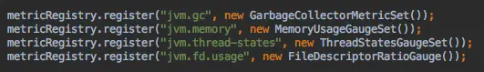
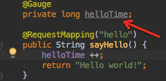
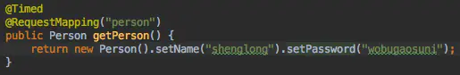
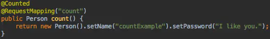
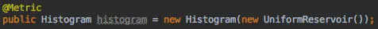
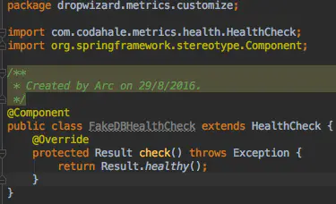

# Dropwizard Metrics使用
> **Metrics is a Java library which gives you unparalleled insight into what your code does in production**.
> 
> Metrics provides a powerful toolkit of ways to measure the behavior of critical components in your production environment.
>
> With modules for common libraries like Jetty, Logback, Log4j, Apache HttpClient, Ehcache, JDBI, Jersey and reporting backends like Ganglia and Graphite, Metrics provides you with full-stack visibility.
## 1. 什么是Dropwizard metrics?
[Dropwizard Metrics](https://metrics.dropwizard.io/3.2.3/index.html) 能够帮助我们从各个角度度量已存在的java应用的成熟框架，简便地以jar包的方式集成进您的系统，可以以http、ganglia、graphite、log4j等方式提供全栈式的监控视野。
## 2. 为什么要用该框架？
在`springboot`的领域内使用`actuator`是最优的选择， 然而web应用五花八门，如一些应用直接使用Jetty启动的web应用、一些已存在的非springboot的应用、其他一些如已服务很久的基于netty的java应用, `springboot actuator`就不那么适用了。

或者说你的应用直接是基于Dropwizard搭建起来的，使用dropwizard metrics会显得理所应当。总得来讲：只要是Java application 就可以使用dropwizard metrics来解决自己应用的应用级监控问题。
## 3 Metrics 类型
度量术语|描述
--------|--------
Meters|Meter度量一系列事件发生的速率(rate)，例如TPS。Meters会统计最近1分钟，5分钟，15分钟，还有全部时间的速率。
Gauges|某个特定瞬时值，例如MQ中消息数量
Counters|Counter 就是计数器，Counter 只是用 Gauge 封装了 AtomicLong
Histograms|Histogram统计数据的分布情况。比如最小值，最大值，中间值，还有中位数，75百分位, 90百分位, 95百分位, 98百分位, 99百分位, 和 99.9百分位的值(percentiles)。
Timers|Timer其实是 Histogram 和 Meter 的结合， histogram 某部分代码/调用的耗时， meter统计TPS。
Health Checks|集中式检测系统的监控状态，例如数据库连接是否正常。
Reporting|度量值可以通过 HTTP，SLF4J，JMX，CSV ，Ganglia，Graphite
## 4. 使用
### 4.1 注册jvm监控

### 4.2 使用Gauge

```
    private final Queue queue;

    public QueueManager(MetricRegistry metrics, String name) {
        this.queue = new Queue();
        metrics.register(MetricRegistry.name(QueueManager.class, name, "size"),
                         new Gauge<Integer>() {
                             @Override
                             public Integer getValue() {
                                 return queue.size();
                             }
                         });
    }
}
```
### 4.3 使用Timer
一个timer 不仅测量一段代码背地啊用的速率；还包含其调用花费时间的分布。


```
private final Timer responses = metrics.timer(name(RequestHandler.class, "responses"));

public String handleRequest(Request request, Response response) {
    final Timer.Context context = responses.time();
    try {
        // etc;
        return "OK";
    } finally {
        context.stop();
    }
}
```
### 4.4 使用Counted

### 4.5 使用Metric + Histograms

### 4.6 自定义healthCheck


Metrics可以利用`metrics-healthchecks` 模块来中心化你的服务的健康检查的能力：
1. 首先，创建一个新的HealthCheckRegistry 对象；
   ```
   final HealthCheckRegistry healthChecks = new HealthCheckRegistry();
   ```
2. 其次，实现HealthCheck 子类。
    ```
    public class DatabaseHealthCheck extends HealthCheck {
        private final Database database;

        public DatabaseHealthCheck(Database database) {
            this.database = database;
        }

        @Override
        public HealthCheck.Result check() throws Exception {
            if (database.isConnected()) {
                return HealthCheck.Result.healthy();
            } else {
                return HealthCheck.Result.unhealthy("Cannot connect to " + database.getUrl());
            }
        }
    }
    ```
3. 利用Metrics注册这个实例：
   ```
   healthChecks.register("postgres", new DatabaseHealthCheck(database));
   ```
4. 运行所有注册的健康检查实例：
   ```
   for (Entry<String, HealthCheck.Result> entry : results.entrySet()) {
        if (entry.getValue().isHealthy()) {
            System.out.println(entry.getKey() + " is healthy");
        } else {
            System.err.println(entry.getKey() + " is UNHEALTHY: " + entry.getValue().getMessage());
            final Throwable e = entry.getValue().getError();
            if (e != null) {
                e.printStackTrace();
            }
        }
    }
   ```

Metrics 提供了一个现成的健康检查`ThreadDeadlockHealthCheck`，它利用了Java内建线程死锁检测来判断线程是否处于死锁状态。
### 4.7 使用Meters
meter 测量随时间发生的时间的速率（如“requests per second”），除了平均速度，meters 也可追踪1分钟，5分钟，15分钟移动速度。
```
private final Meter requests = metrics.meter("requests");

public void handleRequest(Request request, Response response) {
    requests.mark();
    // etc
}
```
这个meter 将以每秒请求数的方式测量请求速度。
### 4.8 使用Histograms
一个histogram 流中数据的统计分布值。除了最小，最大，平均值，它黑客测量中位数，75th, 90th, 95th, 98th, 99th, and 99.9th等百分比。
```
private final Histogram responseSizes = metrics.histogram(name(RequestHandler.class, "response-sizes"));

public void handleRequest(Request request, Response response) {
    // etc
    responseSizes.update(response.getContent().length);
}
```
### 4.9 完整的入门代码
```
package sample;
  import com.codahale.metrics.*;
  import java.util.concurrent.TimeUnit;

  public class GetStarted {
    static final MetricRegistry metrics = new MetricRegistry();
    public static void main(String args[]) {
      startReport();
      Meter requests = metrics.meter("requests");
      requests.mark();
      wait5Seconds();
    }

  static void startReport() {
      ConsoleReporter reporter = ConsoleReporter.forRegistry(metrics)
          .convertRatesTo(TimeUnit.SECONDS)
          .convertDurationsTo(TimeUnit.MILLISECONDS)
          .build();
      reporter.start(1, TimeUnit.SECONDS);
  }

  static void wait5Seconds() {
      try {
          Thread.sleep(5*1000);
      }
      catch(InterruptedException e) {}
  }
}
```
### 4.10 Registry
Metrics 的核心是`MetricRegistry` 类，其实它也是你的应用指标的同期。让我们从创建一个新的Registry开始吧：
```
final MetricRegistry metrics = new MetricRegistry();
```


至此，Java的两个(springboot actuator, dropwizard metrics) 比较强大好用的应用级监控都介绍完了，落地让运维监控的同学一起提升应用质量的availability吧！

## Reference
- [Dropwizard Metrics使用](https://www.jianshu.com/p/9d24435e26fd)
- [Dropwizard 之 application metrics](https://www.jianshu.com/p/070f615dfb57)
- [Dropwizard Metrics Getting Started](https://metrics.dropwizard.io/3.2.3/getting-started.html)
- [Dropwizard Metrics](https://metrics.dropwizard.io/3.2.3/index.html)