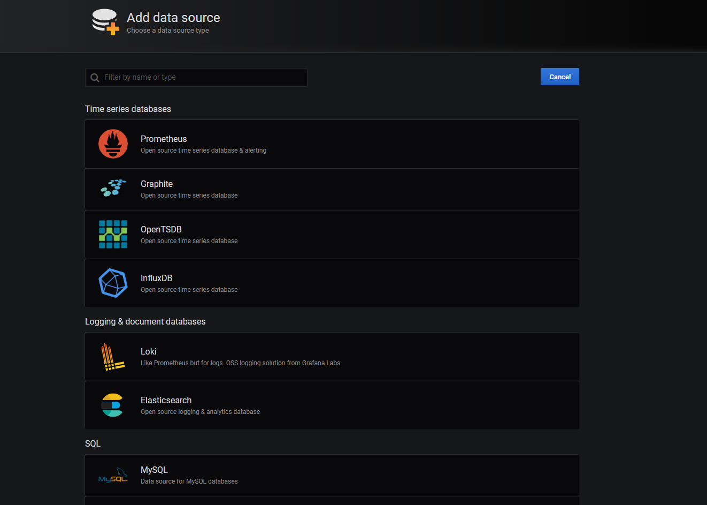

# Monitoring Spring Boot Apps with Micrometer, Prometheus, and Grafana
## 介绍
监控一个应用的健康和指标可以帮我们更好管理它，通过未优化的行为，逐渐接近预期性能。这在开发一个由许多微服务的系统时尤其有用，当你维护这样一个系统时，你会发现监控没一个微服务非常关键。

基于这些信息，我们可以得出结论，在当前设置不能再提升性能时，我们可以横向扩展哪些微服务。

在本文中，我将讲解如何监控Spring Boot Web应用，我们将使用下面的三个项目来达成目标：
- [Micrometer](https://micrometer.io/)：从我们的应用中暴露指标
- [Prometheus](https://prometheus.io/): 存储我们的指标数据
- [Grafana](https://grafana.com/): 用图来可视化我们的数据

则看起来很多，尤其与仅仅使用 [Spring Boot Actuator](https://spring.io/guides/gs/actuator-service/)的项目相比，但很容奇仅仅用一些配置就可实现所有这一切。

为了使事情更简单，我们将使用 [Docker](https://www.docker.com/)来运行Prometheus 和 Grafana，因为他们都有官方Docker镜像。如果你不熟悉Docker，你可以参考我们的文章 [Docker: A High-Level Introduction](https://stackabuse.com/docker-a-high-level-introduction/)。

请注意这些指标将随时间给你一个总体印象。如果你仅仅是想检查某个特定时间某个特定请求的信息，以及该请求发生了些什么，那么这并不适合你。

在这种情况下，你可能需要一个分布式追踪系统，我们已经在[Distributed Tracing with Sleuth](https://stackabuse.com/spring-cloud-distributed-tracing-with-sleuth)中详细讨论了它。
## Spring Boot Actuator
我们将使用[Spring Initializr](https://start.spring.io/)从一个简单的REST服务开始，它包含一个简单的端点`/hello`，并在缺省端口`8080`上运行。 

另外，该应用依赖`spring-boot-starter-actuator`，它为你的应用提供了[产品级别的端点](https://docs.spring.io/spring-boot/docs/current/reference/html/production-ready-endpoints.html)。这些端点在一个公共前缀`/actuator`下，并且默认是受保护的。

可以在`application.properties`加上下面的配置来单独暴露指标或者一次暴露所有：
```
management.endpoints.web.exposure.include=*
```
为了检查，让我们在浏览器导航到`http://localhost:8080/actuator`：


你可以看到`Actuator`暴露出来的所有端点，比如`/health`, `/metrics`, `/mappings`等。让我们导航到http://localhost:8080/actuator/metrics打开/metrics端点：


如你所见，这里有大量应用相关信息。例如关于threads, Tomcat sessions, classes, buffer等。让我们深入一点看看JVM使用的内存信息：


现在，像上面那些利用`Spring Boot Actuator`已经为捏应用产生了许多信息，但它并不是用户友好的。它可以与[Spring Boot Admin](https://github.com/codecentric/spring-boot-admin)集成来支持可视化，但它有自己的局限性，并逐渐变得不流行。

一些工具如Prometheus, [Netflix Atlas](https://github.com/Netflix/atlas), 和 Grafana灌泛用于监控和可视化，并且是语言中立的。

每种以上工具拥有自己的数据格式，为每一个种格式转换/metrics也是一件头疼的事情。为了避免自己转换它们，我们需要一种供应商中立的数据提供者，比如Micrometer。
## Micrometer
为了解决称为一个供应商中立的数据提供者这一问题，Micrometer 出现了。它将Actuator 指标把偶给外部监控系统如Prometheus, Netflix Atlas, [AWS Cloudwatch](https://aws.amazon.com/cloudwatch/), 以及更多。

它们正确地描述自己为：
> Think SLF4J, but for metrics.

复习一下，SLF4J 是其它Java日志框架的门面。SLF4J 自己没有任何日志实现，思路在于你是用SLF4J以及你自己选择的实际实现来编写代码，它可以是任何流行的框架如[log4j](https://logging.apache.org/log4j/2.x/), [logback](http://logback.qos.ch/)等。

类似第，Micrometer自动导出`/actuator/metrics`数据为某种你的监控系统可以理解的东西。你所雪要做的是在你的应用中包含供应商特定的micrometer 依赖。

Micrometer 是一个单独的开源项目，它并不在Spring 生态圈里，因此我们不得不自己把它作为依赖加入。因为我们要使用Prometheus，让我们在`pom.xml`中加入该依赖：
```
<dependency>
    <groupId>io.micrometer</groupId>
    <artifactId>micrometer-registry-prometheus</artifactId>
</dependency>
```
重新构建并启动应用，打开浏览器导航到`http://localhost:8080/actuator`：


它将产生新的端点/actuator/prometheus，打开它，你将看到特定于Prometheus的数据格式：

## Prometheus
Prometheus是一个时间序列数据库，它通过 `HTTP` 定期拉取（使用内建的数据刮取器）来把我们的指标存起来。拉取的间隔可配，当然，我们不得不提供地址以拉取数据。它也有一个肩带的用户接口方便我们可视化它所搜集的所有指标数据。

让我们来配置Prometheus，或者更精确地，配置其刮取间隔，目标等。为了做这个，我们需要一个`prometheus.yml`文件：
```
global:
  scrape_interval: 10s

scrape_configs:
  - job_name: 'spring_micrometer'
    metrics_path: '/actuator/prometheus'
    scrape_interval: 5s
    static_configs:
      - targets: ['192.168.2.8:8080']
```
正如你可看到的，我们有一个`scrape_configs` 根键，哪里我们可以定义一系列`jobs`，指定URL，指标路径以及刮取间隔。如果你想了解更多Prometheus 配置信息，请方位其[官方文档](https://prometheus.io/docs/prometheus/latest/configuration/configuration/)。

> 注意：因为我们在利用Docker运行Prometheus，它运行在一个Docker 网络里，该网络并不理解`localhost/120.0.0.1`，可能这正是你的期待。因为我们的应用运行在`localhost`，对于Docker容器来讲，`localhost` 意味着自己的网络。我们不得不指定系统IP来替换它。

因此替换掉locahost:8080, 我们将使用192.168.2.8:8080。192.168.2.8是我的PC当时的IP地址。

现在，我们使用Docker命令来运行Prometheus ：
```
$ docker run -d -p 9090:9090 -v <path-to-prometheus.yml>:/etc/prometheus/prometheus.yml prom/prometheus
```
<path-to-prometheus.yml> 是你的prometheus.yml所在目录。例如，下面的例子在我的本地Windows PC上可以工作：
```
$ docker run -d -p 9090:9090 -v $PWD/prometheus.yml:/etc/prometheus/prometheus.yml prom/prometheus
```
为了查看Prometheus 仪表板，将你的浏览器导航到 http://localhost:9090:


为了检查Prometheus是否正在监听Spring应用，你可以导航到`/targets`端点：


让我们回到主页上，从列表中选择一个指标并点击执行：

### Prometheus查询语言 - PromQL
另一个值得注意的事情--Prometheus拥有自己的查询语言叫作PromQL。它允许用户实时选择并聚集时间序列数据，将其存为图或表的格式。另外，你也可以利用HTTP来访问它。

如果你想了解PromQL更多，[官方文档](https://prometheus.io/docs/prometheus/latest/querying/basics/)包含更多内容。
## Grafana
虽然Prometheus提供了一些粗糙的可视化功能，Grafana 则提供了丰富的UI，在哪里你可以快速构建你的定制图像，基于剁图像创建仪表板。你也可以免费导入许多社区构建的仪表板并让其运行。

Grafana 可以拉取不同的数据源像Prometheus, [Elasticsearch](https://www.elastic.co/), [InfluxDB](https://www.influxdata.com/)等。他也可让你设置基于规则的报警，然后他可以通过Slack, Email, Hipchat等通知你。

让我们从利用Docker运行Grafana开始：
```
$ docker run -d -p 3000:3000 grafana/grafana
```
如果你访问`http://localhost:3000`，你就爱那个会被重定向到一个登陆页面：


默认用户名为admin，默认密码也为admin。你可以在下一步更改它们，这是强烈推荐的做法：


由于Grafana 与许多数据源一起工作，我们需要定义我们依赖于哪一个。选择Prometheus 作为捏数据源：


现在，加进Prometheus 运行的URL地址，我们的例子是`http://localhost:9090`，点击Access 来通过浏览器访问。

在这个点，我们可以保存并测试数据源是否可以正常工作。


如前所述，Grafana 由一些自带的[仪表板](https://grafana.com/grafana/dashboards)，对 Spring Boot 项目，[JVM仪表板](https://grafana.com/grafana/dashboards/4701)很流行。


输入仪表板URL，选择"Already created Prometheus datasource"然后点击“Import”。

## 结论
监控一个应用的健康与指标能帮我们更好地管理它，注意其未优化的行为，更好地理解塔恩性能。这在开发一个由许多微服务的系统时尤其有用，当你维护这样一个系统时，你会发现监控没一个微服务非常关键。

基于这些信息，我们可以得出结论，在当前设置不能再提升性能时，我们可以横向扩展哪些微服务。

在本文中，我们使用Micrometer对Spring Boot Actuator提供的指标数据重新格式化，并将其在一个新的端点上导出。这些数据被Prometheus定期拉取并存储，它实际上是一个时间序列数据库。最终，我们使用Grafana 以用户友好的仪表板来可视化这些信息。

作为管理，文章实例代码在[GitHub](https://github.com/StackAbuse/microservices-monitoring)上可见。

## Reference
- [Monitoring Spring Boot Apps with Micrometer, Prometheus, and Grafana](https://stackabuse.com/monitoring-spring-boot-apps-with-micrometer-prometheus-and-grafana/)