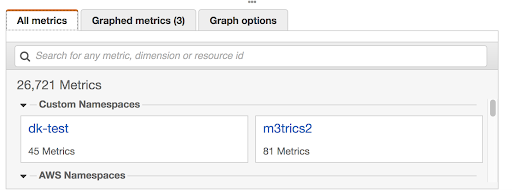
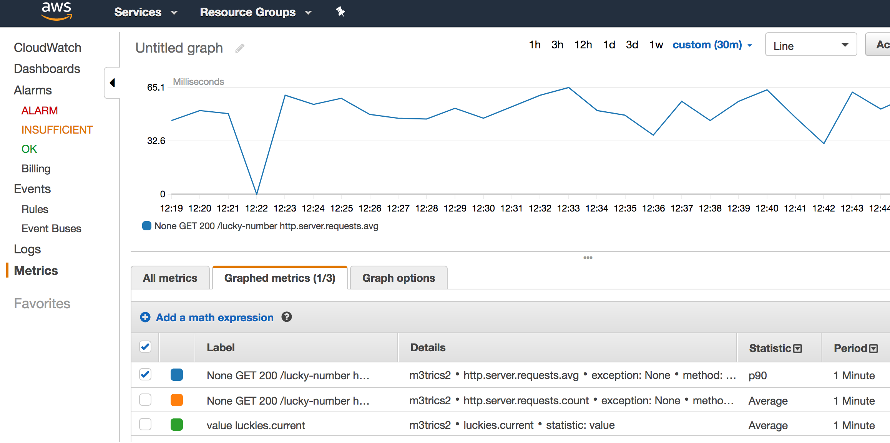
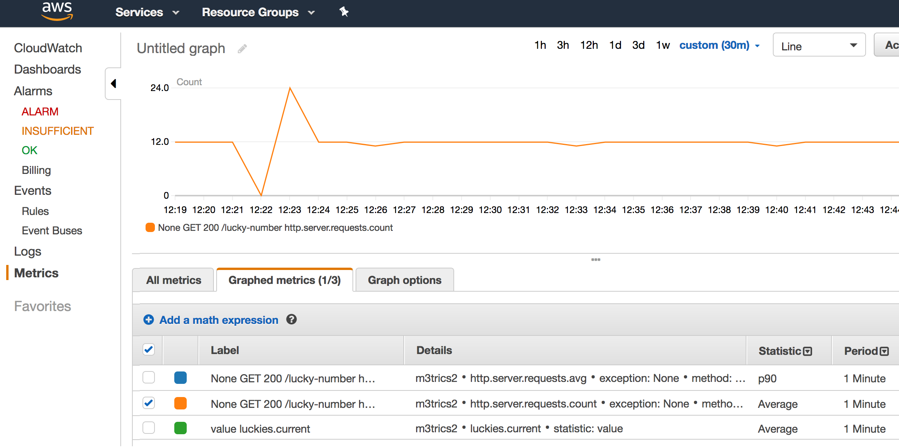
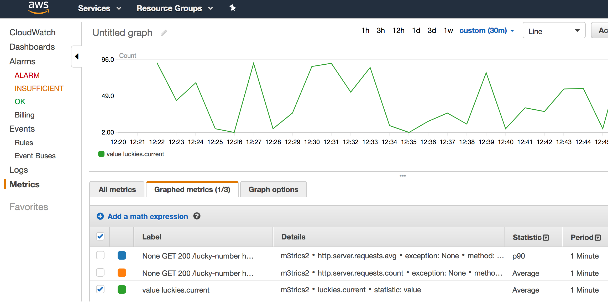

# Spring Boot: Metrics With Micrometer and AWS CloudWatch
有些日子之前，我写了篇博文关于如何给Spring Boot配置CloudWatch指标。它出现在micrometer之前且极为依赖 Netflix Servo Metrics。时间在流逝，文明在发展，但查找Spring Boot与Micrometer CloudWatch共同工作的信息依然困难。

这是一个很长的故事。

如果你对此不感兴趣，只想知道如何使Spring Boot 与AWS CloudWatch一起工作，按下面的做：
- 添加下面的依赖（[build.gradle](https://github.com/dkublik/micrometer-aws-example/blob/master/build.gradle)）
  ```
  dependencies {
    compile('org.springframework.boot:spring-boot-starter-actuator')
    compile('org.springframework.cloud:spring-cloud-starter-aws')
    compile('io.micrometer:micrometer-registry-cloudwatch:1.0.6')
  }
  ```
- 设置必须的[属性](https://github.com/dkublik/micrometer-aws-example/blob/master/src/main/resources/application.properties):
  ```
  management.metrics.export.cloudwatch.namespace=m3trics2
  management.metrics.export.cloudwatch.batchSize=20
  ```
这就成了，如果你想学习更多细节，请继续读下去。你也可以并遵循[代码](https://github.com/dkublik/micrometer-aws-example)中同样的做法。
## Micrometer.io 和 CloudWatch Metrics Exporter
描述Mirometer 本身不是我这里的目标，也不包括不同指标的概念。因为所有信息乐意很容易在[Micrometer docs](https://micrometer.io/docs)上找到。

在Spring Boot中设置Micrometer非常简单，只要加入特定的registry 作为依赖，registries和不同的指标系统在[Micrometer页面](https://micrometer.io/docs)被列出。

- Atlas
- Datadog
- Ganglia
- Graphite
- Influx
- JMX
- New Relic
- Prometheus
- SignalFx
- StatsD
- Wavefront

学习这个列表；但是在这里你没有发现CloudWatch。但是，该registry 存在且可在 [repo](https://repo.spring.io/libs-release/io/micrometer/) 和 [Git](Hubhttps://github.com/micrometer-metrics/micrometer/tree/master/implementations) 上找到，并等待被使用。

当为Spring boot通过Micrometer构建一个特殊的指标系统（比如像datadog）时，需要的主键可在两个地方发现：
- `micrometer-registry-datadog.jar`（假如是datadog）包含一个Sprint Boot独立的meter registry和工具。
- `spring-boot-actuator-autoconfigure.jar`，那里我们可以为不同的系统（如[DatadogMetricsExportAutoConfiguration](https://github.com/spring-projects/spring-boot/blob/master/spring-boot-project/spring-boot-actuator-autoconfigure/src/main/java/org/springframework/boot/actuate/autoconfigure/metrics/export/datadog/DatadogMetricsExportAutoConfiguration.java)）找到`autoConfigurations`，然后当给定的registry在类路径上出现时，自动为指标系统创建一个exporter。

真是的事情是：当为CloudWatch创建`metrics exporter`，我们将需要Amazon CloudWatch 客户端。利用区域提供者，检测一个app是否在云上运行，登录proiler等，这样的一个客户端并不是一件简单的事情。幸运地，所有这些事情已经写好，不在Spring Boot而在 Spring Cloud里。

由于Spring Cloud 依赖于Spring Boot而非其它方式，CloudWatchExportAutoConfiguration不能在Spring Boot的 actuator里与其它系统放在一起。因此，为了使用它我们需要加入另一个依赖：
- spring-cloud-aws-autoconfigure.jar ( 由于像类如StepRegistryProperties spring-boot-actuator-autoconfigure.jar仍然是需要的)。
## 属性
检查[CloudWatchExportAutoConfiguration](https://github.com/spring-cloud/spring-cloud-aws/blob/master/spring-cloud-aws-autoconfigure/src/main/java/org/springframework/cloud/aws/autoconfigure/metrics/CloudWatchExportAutoConfiguration.java)你会发现为了导出指标到CloudWatch 你唯一需要开启的属性是：
```
management.metrics.export.cloudwatch.namespace=m3trics2
```
就像其名字表明的，该名字定义了自定义CloudWatch 名字空间，在哪里你将发现你自己的指标：


由于cloud/ Micrometer中的代码bug，需要额外增加一个属性：
```
management.metrics.export.cloudwatch.batchSize=20
```
为了理解它，你需要知道指标时以异步批量的方式被送到 CloudWatch的，并且Amazon CloudWatch client 由每个批量最多包含20个指标的限制。[CloudWatchConfig](https://github.com/micrometer-metrics/micrometer/blob/master/implementations/micrometer-registry-cloudwatch/src/main/java/io/micrometer/cloudwatch/CloudWatchConfig.java)正确地处理了它，但接下来，实际的属性从 [CloudWatchProperties](https://github.com/spring-cloud/spring-cloud-aws/blob/master/spring-cloud-aws-autoconfigure/src/main/java/org/springframework/cloud/aws/autoconfigure/metrics/CloudWatchProperties.java)获取。而它获取`batchSize` 属性并设置缺省值为`10000`，并未考虑AWS的限制。
## 实例指标
产生指标的示例代码可在[这里](https://github.com/dkublik/micrometer-aws-example)找到。它是一个超级简单的Web应用，每次一个特殊的地址被点击（/lucky-number）一个随机数将被产生，还有一个调度器将每5秒钟会点击这个地址以做演示流量。

这个应用展示了许多指标被Spring Boot自动添加，例如：
- `http.server.requests.avg` 演示了在平均每分钟里，花费多久用于恢复幸运数字
  
- http.server.requests.count 一分钟里有多少个请求
  
- luckies.current (查看[LuckyNumbersController](https://github.com/dkublik/micrometer-aws-example/blob/master/src/main/java/pl/dk/m3trics2/LuckyNumbersController.java))，它仅仅存储最近产生的幸运数字。
  

最后，请记住并非所有生成的数字都会发送到CloudWatch，因为gauge 指标时周期探测的。再一次，额外的细节可以在[Micrometer docs](https://micrometer.io/docs/concepts#_gauges)找到。

同样，你可以在[这里](https://github.com/dkublik/m3trics)查看代码。

## Reference
- [Spring Boot: Metrics With Micrometer and AWS CloudWatch](https://dzone.com/articles/spring-boot-metrics-with-micrometer-and-aws-cloudw)
- [Collecting SpringBoot Application Metrics in AWS CloudWatch](https://prog.world/collecting-springboot-application-metrics-in-aws-cloudwatch/)
- [SpringBoot - Metrics with Servo and AWS CloudWatch](https://dkublik.github.io/2017/10/28/springboot-metrics-with-servo-and-aws-cloudwatch.html)