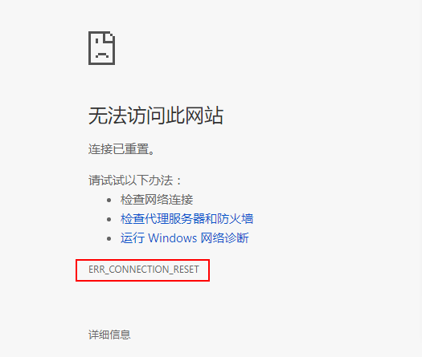
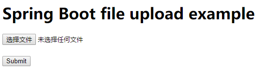
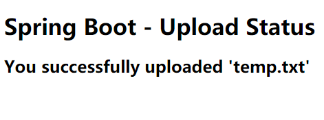
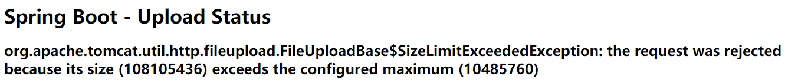
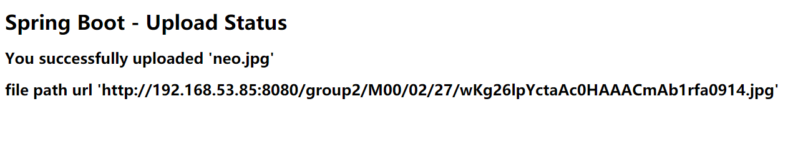
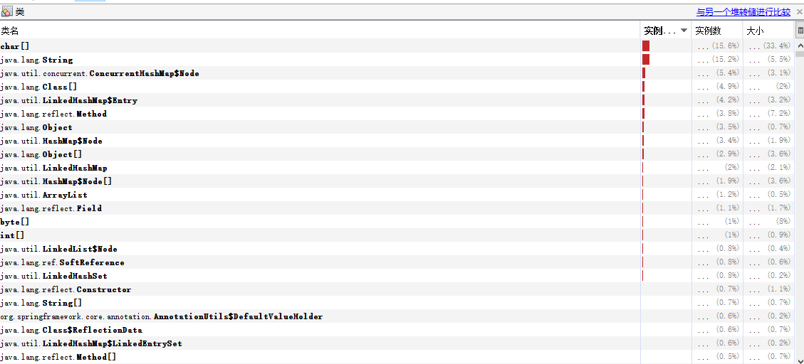
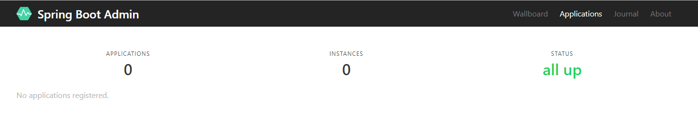
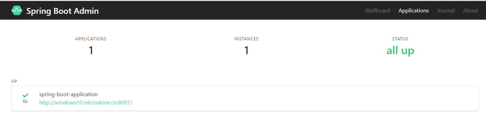
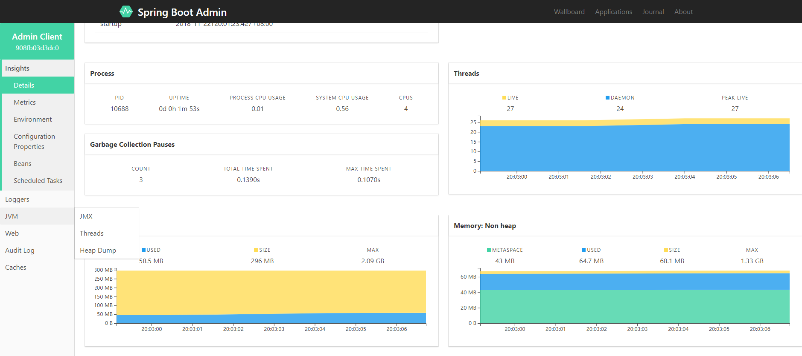

# SpringBoot 知识
## 第1章. 入门篇
### spingboot建议的目录结果结构如下：
root package结构：com.example.myproject
```
+- com
   +- example
     +- myproject
       +- Application.java
       |
       +- domain
       |  +- Customer.java
       |  +- CustomerRepository.java
       |
       +- service
       |  +- CustomerService.java
       |
       +- controller
       |  +- CustomerController.java
       |
```
1. Application.java 建议放到跟目录下面,主要用于做一些框架配置
2. domain目录主要用于实体（Entity）与数据访问层（Repository）
3. service 层主要是业务类代码
4. controller 负责页面访问控制
### 引入 Web 模块
```
@RestController
public class HelloWorldController {
    @RequestMapping("/hello")
    public String index() {
        return "Hello World";
    }
}
```
@RestController的意思就是controller里面的方法都以json格式输出。

启动主程序，打开浏览器访问http://localhost:8080/hello，就可以看到效果了。
## 第2章. Web 综合开发
Spring Boot Web 开发非常的简单，其中包括常用的 json 输出、filters、property、log 等
### json 接口开发
只需要类添加 @RestController 即可，默认类中的方法都会以 json 的格式返回。
```
@RestController
public class HelloController {
    @RequestMapping("/getUser")
    public User getUser() {
    	User user=new User();
    	user.setUserName("小明");
    	user.setPassWord("xxxx");
        return user;
    }
}
```
如果需要使用页面开发只要使用@Controller注解即可，下面会结合模板来说明。
### 自定义 Filter
我们常常在项目中会使用 filters 用于录调用日志、排除有 XSS 威胁的字符、执行权限验证等等。Spring Boot 自动添加了 OrderedCharacterEncodingFilter 和 HiddenHttpMethodFilter，并且我们可以自定义 doFilter。

两个步骤：
1. 实现 Filter 接口，实现 Filter 方法
2. 添加@Configuration 注解，将自定义Filter加入过滤链
```
@Configuration
public class WebConfiguration {
    @Bean
    public RemoteIpFilter remoteIpFilter() {
        return new RemoteIpFilter();
    }
    
    @Bean
    public FilterRegistrationBean testFilterRegistration() {

        FilterRegistrationBean registration = new FilterRegistrationBean();
        registration.setFilter(new MyFilter());
        registration.addUrlPatterns("/*");
        registration.addInitParameter("paramName", "paramValue");
        registration.setName("MyFilter");
        registration.setOrder(1);
        return registration;
    }
    
    public class MyFilter implements Filter {
		@Override
		public void destroy() {
			// TODO Auto-generated method stub
		}

		@Override
		public void doFilter(ServletRequest srequest, ServletResponse sresponse, FilterChain filterChain)
				throws IOException, ServletException {
			// TODO Auto-generated method stub
			HttpServletRequest request = (HttpServletRequest) srequest;
			System.out.println("this is MyFilter,url :"+request.getRequestURI());
			filterChain.doFilter(srequest, sresponse);
		}

		@Override
		public void init(FilterConfig arg0) throws ServletException {
			// TODO Auto-generated method stub
		}
    }
}
```
### 自定义 Property
在 Web 开发的过程中，我经常需要自定义一些配置文件，如何使用呢？答案是配置在 **application.properties** 中：
```
com.neo.title=纯洁的微笑
com.neo.description=分享生活和技术
```
自定义配置类：
```
@Component
public class NeoProperties {
	@Value("${com.neo.title}")
	private String title;
	@Value("${com.neo.description}")
	private String description;

	//省略getter settet方法
}
```
### log配置
配置输出的地址和输出级别：
```
logging.path=/user/local/log
logging.level.com.favorites=DEBUG
logging.level.org.springframework.web=INFO
logging.level.org.hibernate=ERROR
```
`path` 为本机的 log 地址，`logging.level` 后面可以根据包路径配置不同资源的 log 级别。
### 数据库操作
在这里我重点讲述 Mysql、spring data jpa 的使用，其中 Mysql 就不用说了大家很熟悉。Jpa 是利用 Hibernate 生成各种自动化的 sql，如果只是简单的增删改查，基本上不用手写了，Spring 内部已经帮大家封装实现了。
#### 1、添加相关 jar 包
```
<dependency>
    <groupId>org.springframework.boot</groupId>
    <artifactId>spring-boot-starter-data-jpa</artifactId>
</dependency>
 <dependency>
    <groupId>mysql</groupId>
    <artifactId>mysql-connector-java</artifactId>
</dependency>
```
#### 2、添加配置文件
```
spring.datasource.url=jdbc:mysql://localhost:3306/test
spring.datasource.username=root
spring.datasource.password=root
spring.datasource.driver-class-name=com.mysql.jdbc.Driver

spring.jpa.properties.hibernate.hbm2ddl.auto=update
spring.jpa.properties.hibernate.dialect=org.hibernate.dialect.MySQL5InnoDBDialect
spring.jpa.show-sql= true
```
其实这个 hibernate.hbm2ddl.auto 参数的作用主要用于：自动创建，更新，验证数据库表结构,有四个值：
- create： 每次加载 hibernate 时都会删除上一次的生成的表，然后根据你的 model 类再重新来生成新表，哪怕两次没有任何改变也要这样执行，这就是导致数据库表数据丢失的一个重要原因。
- create-drop ：每次加载 hibernate 时根据 model 类生成表，但是 sessionFactory 一关闭,表就自动删除。
- update：最常用的属性，第一次加载 hibernate 时根据 model 类会自动建立起表的结构（前提是先建立好数据库），以后加载 hibernate 时根据 model 类自动更新表结构，即使表结构改变了但表中的行仍然存在不会删除以前的行。要注意的是当部署到服务器后，表结构是不会被马上建立起来的，是要等 应用第一次运行起来后才会。
- validate ：每次加载 hibernate 时，验证创建数据库表结构，只会和数据库中的表进行比较，不会创建新表，但是会插入新值。

`dialect` 主要是指定生成表名的存储引擎为 `InnoDBD`。

`show-sql` 是否打印出自动生成的 `SQL`，方便调试的时候查看。
#### 3、添加实体类和 Dao
```
@Entity
public class User implements Serializable {
	private static final long serialVersionUID = 1L;
	@Id
	@GeneratedValue
	private Long id;
	@Column(nullable = false, unique = true)
	private String userName;
	@Column(nullable = false)
	private String passWord;
	@Column(nullable = false, unique = true)
	private String email;
	@Column(nullable = true, unique = true)
	private String nickName;
	@Column(nullable = false)
	private String regTime;

	//省略getter settet方法、构造方法
}
```
dao 只要继承 `JpaRepository` 类就可以，几乎可以不用写方法，还有一个特别有尿性的功能非常赞，就是可以根据方法名来自动的生成 SQL，比如 `findByUserName` 会自动生成一个以 `userName` 为参数的查询方法，比如 `findAlll` 自动会查询表里面的所有数据，比如自动分页等等。

**Entity 中不映射成列的字段得加 @Transient 注解，不加注解也会映射成列**
```
public interface UserRepository extends JpaRepository<User, Long> {
    User findByUserName(String userName);
    User findByUserNameOrEmail(String username, String email);
}
```
#### 4、测试
```
@RunWith(SpringJUnit4ClassRunner.class)
@SpringApplicationConfiguration(Application.class)
public class UserRepositoryTests {
	@Autowired
	private UserRepository userRepository;

	@Test
	public void test() throws Exception {
		Date date = new Date();
		DateFormat dateFormat = DateFormat.getDateTimeInstance(DateFormat.LONG, DateFormat.LONG);        
		String formattedDate = dateFormat.format(date);
		
		userRepository.save(new User("aa1", "aa@126.com", "aa", "aa123456",formattedDate));
		userRepository.save(new User("bb2", "bb@126.com", "bb", "bb123456",formattedDate));
		userRepository.save(new User("cc3", "cc@126.com", "cc", "cc123456",formattedDate));

		Assert.assertEquals(9, userRepository.findAll().size());
		Assert.assertEquals("bb", userRepository.findByUserNameOrEmail("bb", "cc@126.com").getNickName());
		userRepository.delete(userRepository.findByUserName("aa1"));
	}
}
```
当然 Spring Data Jpa 还有很多功能，比如封装好的分页，可以自己定义 SQL，主从分离等等，这里就不详细讲了。
### Thymeleaf 模板
Spring Boot 推荐使用 Thymeleaf 来代替 Jsp，Thymeleaf 模板到底是什么来头呢，让 Spring 大哥来推荐，下面我们来聊聊
#### 1. Thymeleaf 介绍
Thymeleaf 是一款用于渲染 XML/XHTML/HTML5 内容的模板引擎。类似 JSP，Velocity，FreeMaker 等，它也可以轻易的与 Spring MVC 等 Web 框架进行集成作为 Web 应用的模板引擎。与其它模板引擎相比，Thymeleaf 最大的特点是能够直接在浏览器中打开并正确显示模板页面，而不需要启动整个 Web 应用。

好了，你们说了我们已经习惯使用了什么 Velocity, FreMaker，beetle之类的模版，那么到底好在哪里呢？

比一比吧：
Thymeleaf 是与众不同的，因为它使用了自然的模板技术。这意味着 Thymeleaf 的模板语法并不会破坏文档的结构，模板依旧是有效的XML文档。模板还可以用作工作原型，Thymeleaf 会在运行期替换掉静态值。Velocity 与 FreeMarke r则是连续的文本处理器。 下面的代码示例分别使用 Velocity、FreeMarker 与 Thymeleaf 打印出一条消息：
```
Velocity: <p>$message</p>
FreeMarker: <p>${message}</p>
Thymeleaf: <p th:text="${message}">Hello World!</p>
```
**注意，由于 Thymeleaf 使用了 XML DOM 解析器，因此它并不适合于处理大规模的 XML 文件。**
#### 2. URL
URL 在 Web 应用模板中占据着十分重要的地位，需要特别注意的是 Thymeleaf 对于 URL 的处理是通过语法 @{...} 来处理的。Thymeleaf 支持绝对路径 URL：
```
<a th:href="@{http://www.thymeleaf.org}">Thymeleaf</a>
```
#### 3. 条件求值
```
<a th:href="@{/login}" th:unless=${session.user != null}>Login</a>
```
#### 4. for循环
```
<tr th:each="prod : ${prods}">
      <td th:text="${prod.name}">Onions</td>
      <td th:text="${prod.price}">2.41</td>
      <td th:text="${prod.inStock}? #{true} : #{false}">yes</td>
</tr>
```
#### 5. 页面即原型
在 Web 开发过程中一个绕不开的话题就是前端工程师与后端工程师的协作，在传统 Java Web 开发过程中，前端工程师和后端工程师一样，也需要安装一套完整的开发环境，然后各类 Java IDE 中修改模板、静态资源文件，启动/重启/重新加载应用服务器，刷新页面查看最终效果。

但实际上前端工程师的职责更多应该关注于页面本身而非后端，使用 JSP，Velocity 等传统的 Java 模板引擎很难做到这一点，因为它们必须在应用服务器中渲染完成后才能在浏览器中看到结果，而 Thymeleaf 从根本上颠覆了这一过程，通过属性进行模板渲染不会引入任何新的浏览器不能识别的标签，例如 JSP 中的 ，不会在 Tag 内部写表达式。整个页面直接作为 HTML 文件用浏览器打开，几乎就可以看到最终的效果，这大大解放了前端工程师的生产力，它们的最终交付物就是纯的 HTML/CSS/JavaScript 文件。
### Gradle 构建工具
Spring 项目建议使用 Maven/Gradle 进行构建项目，相比 Maven 来讲 Gradle 更简洁，而且 Gradle 更适合大型复杂项目的构建。Gradle 吸收了 Maven 和 Ant 的特点而来，不过目前 Maven 仍然是 Java 界的主流，大家可以先了解了解。
### WebJars
WebJars 是一个很神奇的东西，可以让大家以 Jar 包的形式来使用前端的各种框架、组件。
#### 1. 什么是 WebJars
WebJars 是将客户端（浏览器）资源（JavaScript，Css等）打成 Jar 包文件，以对资源进行统一依赖管理。WebJars 的 Jar 包部署在 Maven 中央仓库上。
#### 2. 为什么使用
我们在开发 Java web 项目的时候会使用像 Maven，Gradle 等构建工具以实现对 Jar 包版本依赖管理，以及项目的自动化管理，但是对于 JavaScript，Css 等前端资源包，我们只能采用拷贝到 webapp 下的方式，这样做就无法对这些资源进行依赖管理。那么 WebJars 就提供给我们这些前端资源的 Jar 包形势，我们就可以进行依赖管理。
#### 3. 如何使用
1. [WebJars主官网](http://www.webjars.org/bower) 查找对于的组件，比如 `Vuejs`
```
<dependency>
    <groupId>org.webjars</groupId>
    <artifactId>vue</artifactId>
    <version>2.5.16</version>
</dependency>
```
2. 页面引入
```
<link th:href="@{/webjars/bootstrap/3.3.6/dist/css/bootstrap.css}" rel="stylesheet"></link>
```
就可以正常使用了！
## 第3章. Spring Boot 中 Redis 的使用
### Redis 介绍
Redis 是目前业界使用最广泛的内存数据存储。相比 Memcached，Redis 支持更丰富的数据结构，例如 hashes, lists, sets 等，同时支持数据持久化。除此之外，Redis 还提供一些类数据库的特性，比如事务，HA，主从库。可以说 Redis 兼具了缓存系统和数据库的一些特性，因此有着丰富的应用场景。本文介绍 Redis 在 Spring Boot 中两个典型的应用场景。
### 如何使用
#### 1、引入依赖包
```
<dependency>
    <groupId>org.springframework.boot</groupId>
    <artifactId>spring-boot-starter-data-redis</artifactId>
</dependency>
<dependency>
    <groupId>org.apache.commons</groupId>
    <artifactId>commons-pool2</artifactId>
</dependency>
```
Spring Boot 提供了对 Redis 集成的组件包：`spring-boot-starter-data-redis`，`spring-boot-starter-data-redis` 依赖于 `spring-data-redis` 和 `lettuce` 。Spring Boot 1.0 默认使用的是 Jedis 客户端，2.0 替换成 `Lettuce`，但如果你从 Spring Boot 1.5.X 切换过来，几乎感受不大差异，这是因为 `spring-boot-starter-data-redis` 为我们隔离了其中的差异性。

`Lettuce` 是一个可伸缩线程安全的 Redis 客户端，多个线程可以共享同一个 `RedisConnection`，它利用优秀 `netty NIO` 框架来高效地管理多个连接。
#### 2、添加配置文件
```
# Redis数据库索引（默认为0）
spring.redis.database=0  
# Redis服务器地址
spring.redis.host=localhost
# Redis服务器连接端口
spring.redis.port=6379  
# Redis服务器连接密码（默认为空）
spring.redis.password=
# 连接池最大连接数（使用负值表示没有限制） 默认 8
spring.redis.lettuce.pool.max-active=8
# 连接池最大阻塞等待时间（使用负值表示没有限制） 默认 -1
spring.redis.lettuce.pool.max-wait=-1
# 连接池中的最大空闲连接 默认 8
spring.redis.lettuce.pool.max-idle=8
# 连接池中的最小空闲连接 默认 0
spring.redis.lettuce.pool.min-idle=0
```
#### 3、添加 cache 的配置类
```
@Configuration
@EnableCaching
public class RedisConfig extends CachingConfigurerSupport{
    
    @Bean
    public KeyGenerator keyGenerator() {
        return new KeyGenerator() {
            @Override
            public Object generate(Object target, Method method, Object... params) {
                StringBuilder sb = new StringBuilder();
                sb.append(target.getClass().getName());
                sb.append(method.getName());
                for (Object obj : params) {
                    sb.append(obj.toString());
                }
                return sb.toString();
            }
        };
    }
}
```
注意我们使用了注解：`@EnableCaching` 来开启缓存。

接下来就可以直接使用了：
```
@RunWith(SpringRunner.class)
@SpringBootTest
public class TestRedis {
    @Autowired
    private StringRedisTemplate stringRedisTemplate;
    @Autowired
    private RedisTemplate redisTemplate;

    @Test
    public void test() throws Exception {
        stringRedisTemplate.opsForValue().set("aaa", "111");
        Assert.assertEquals("111", stringRedisTemplate.opsForValue().get("aaa"));
    }
    
    @Test
    public void testObj() throws Exception {
        User user=new User("aa@126.com", "aa", "aa123456", "aa","123");
        ValueOperations<String, User> operations=redisTemplate.opsForValue();
        operations.set("com.neox", user);
        operations.set("com.neo.f", user,1, TimeUnit.SECONDS);
        Thread.sleep(1000);
        //redisTemplate.delete("com.neo.f");
        boolean exists=redisTemplate.hasKey("com.neo.f");
        if(exists){
            System.out.println("exists is true");
        }else{
            System.out.println("exists is false");
        }
       // Assert.assertEquals("aa", operations.get("com.neo.f").getUserName());
    }
}
```
以上都是手动使用的方式，如何在查找数据库的时候自动使用缓存呢，看下面。
#### 4、自动根据方法生成缓存
```
@RestController
public class UserController {

    @RequestMapping("/getUser")
    @Cacheable(value="user-key")
    public User getUser() {
        User user=new User("aa@126.com", "aa", "aa123456", "aa","123");
        System.out.println("若下面没出现“无缓存的时候调用”字样且能打印出数据表示测试成功");
        return user;
    }
}
```
其中 value 的值就是缓存到 Redis 中的 key。
### 共享 Session
分布式系统中，Session 共享有很多的解决方案，其中托管到缓存中应该是最常用的方案之一，
#### Spring Session 官方说明
Spring Session provides an API and implementations for managing a user’s session information.

Spring Session 提供了一套创建和管理 Servlet HttpSession 的方案。Spring Session 提供了集群 Session（Clustered Sessions）功能，默认采用外置的 Redis 来存储 Session 数据，以此来解决 Session 共享的问题。
#### 如何使用
##### 1、引入依赖
```
<dependency>
    <groupId>org.springframework.session</groupId>
    <artifactId>spring-session-data-redis</artifactId>
</dependency>
```
##### 2、Session 配置
```
@Configuration
@EnableRedisHttpSession(maxInactiveIntervalInSeconds = 86400*30)
public class SessionConfig {
}
```
> maxInactiveIntervalInSeconds: 设置 Session 失效时间，使用 Redis Session 之后，原 Spring Boot 的 server.session.timeout 属性不再生效。

好了，这样就配置好了，我们来测试一下
##### 3、测试
添加测试方法获取 sessionid
```
@RequestMapping("/uid")
String uid(HttpSession session) {
    UUID uid = (UUID) session.getAttribute("uid");
    if (uid == null) {
        uid = UUID.randomUUID();
    }
    session.setAttribute("uid", uid);
    return session.getId();
}
```
登录 Redis 输入 keys '*sessions*'
```
t<spring:session:sessions:db031986-8ecc-48d6-b471-b137a3ed6bc4
t(spring:session:expirations:1472976480000
```
其中 1472976480000 为失效时间，意思是这个时间后 Session 失效，db031986-8ecc-48d6-b471-b137a3ed6bc4 为 sessionId,登录 http://localhost:8080/uid 发现会一致，就说明 Session 已经在 Redis 里面进行有效的管理了。
#### 如何在两台或者多台中共享 Session
其实就是按照上面的步骤在另一个项目中再次配置一次，启动后自动就进行了 Session 共享。

**[示例代码-github](https://github.com/ityouknow/spring-boot-examples/tree/master/spring-boot-redis)**
### 参考
- [Redis的两个典型应用场景](http://emacoo.cn/blog/spring-redis)
- [SpringBoot应用之分布式会话](https://segmentfault.com/a/1190000004358410)
## 第4章. Thymeleaf 使用详解
### Thymeleaf 介绍
简单说，Thymeleaf 是一个跟 Velocity、FreeMarker 类似的模板引擎，它可以完全替代 JSP 。相较与其他的模板引擎，它有如下三个极吸引人的特点：
1. Thymeleaf 在有网络和无网络的环境下皆可运行，即它可以让美工在浏览器查看页面的静态效果，也可以让程序员在服务器查看带数据的动态页面效果。这是由于它支持 html 原型，然后在 html 标签里增加额外的属性来达到模板+数据的展示方式。浏览器解释 html 时会忽略未定义的标签属性，所以 Thymeleaf 的模板可以静态地运行；当有数据返回到页面时，Thymeleaf 标签会动态地替换掉静态内容，使页面动态显示。
2. Thymeleaf 开箱即用的特性。它提供标准和 Spring 标准两种方言，可以直接套用模板实现 JSTL、 OGNL表达式效果，避免每天套模板、改 Jstl、改标签的困扰。同时开发人员也可以扩展和创建自定义的方言。
3. Thymeleaf 提供 Spring 标准方言和一个与 SpringMVC 完美集成的可选模块，可以快速的实现表单绑定、属性编辑器、国际化等功能。
### 标准表达式语法
它们分为四类：
- 变量表达式
- 选择或星号表达式
- 文字国际化表达式
- URL 表达式
### 常用th标签都有那些？
### 几种常用的使用方法
### 使用 Thymeleaf 布局
## 第5章. Spring Boot Jpa 的使用
### 5.1 Spring Boot Jpa 介绍
#### 首先了解 Jpa 是什么？
Jpa (Java Persistence API) 是 Sun 官方提出的 Java 持久化规范。它为 Java 开发人员提供了一种对象/关联映射工具来管理 Java 应用中的关系数据。它的出现主要是为了简化现有的持久化开发工作和整合 ORM 技术，结束现在 Hibernate，TopLink，JDO 等 ORM 框架各自为营的局面。

值得注意的是，Jpa是在充分吸收了现有 Hibernate，TopLink，JDO 等 ORM 框架的基础上发展而来的，具有易于使用，伸缩性强等优点。从目前的开发社区的反应上看，Jpa 受到了极大的支持和赞扬，其中就包括了 Spring 与 EJB3. 0的开发团队。
> 注意:Jpa 是一套规范，不是一套产品，那么像 Hibernate,TopLink,JDO 他们是一套产品，如果说这些产品实现了这个 Jpa 规范，那么我们就可以叫他们为 Jpa 的实现产品。
#### Spring Boot Jpa
Spring Boot Jpa 是 Spring 基于 ORM 框架、Jpa 规范的基础上封装的一套 Jpa 应用框架，可使开发者用极简的代码即可实现对数据的访问和操作。它提供了包括增删改查等在内的常用功能，且易于扩展！学习并使用 Spring Data Jpa 可以极大提高开发效率！
> Spring Boot Jpa 让我们解脱了 DAO 层的操作，基本上所有 CRUD 都可以依赖于它来实现
### 5.2 基本查询
基本查询也分为两种，一种是 Spring Data 默认已经实现，一种是根据查询的方法来自动解析成 SQL。
#### 预先生成方法
Spring Boot Jpa 默认预先生成了一些基本的CURD的方法，例如：增、删、改等等。
1. 继承 JpaRepository
   ```
   public interface UserRepository extends JpaRepository<User, Long> {
   }
   ```
2. 使用默认方法
   ```
   @Test
    public void testBaseQuery() throws Exception {
        User user=new User();
        userRepository.findAll();
        userRepository.findOne(1l);
        userRepository.save(user);
        userRepository.delete(user);
        userRepository.count();
        userRepository.exists(1l);
        // ...
    }
   ```
#### 自定义简单查询
自定义的简单查询就是根据方法名来自动生成 SQL，主要的语法是findXXBy,readAXXBy,queryXXBy,countXXBy, getXXBy后面跟属性名称：
```
User findByUserName(String userName);
```
也使用一些加一些关键字And 、 Or：
```
User findByUserNameOrEmail(String username, String email);
```
修改、删除、统计也是类似语法：
```
Long deleteById(Long id);
Long countByUserName(String userName)
```
基本上 SQL 体系中的关键词都可以使用，例如： LIKE 、 IgnoreCase、 OrderBy：
```
List<User> findByEmailLike(String email);
User findByUserNameIgnoreCase(String userName);
List<User> findByUserNameOrderByEmailDesc(String email);
```
具体的关键字，使用方法和生产成SQL如下表所示：
Keyword|Sample|JPQL snippet
--------|--------|--------
And|findByLastnameAndFirstname|… where x.lastname = ?1 and x.firstname = ?2
Or|findByLastnameOrFirstname|… where x.lastname = ?1 or x.firstname = ?2
Is,Equals|findByFirstnameIs,findByFirstnameEquals|… where x.firstname = ?1
Between|findByStartDateBetween|… where x.startDate between ?1 and ?2
LessThan|findByAgeLessThan|… where x.age < ?1
LessThanEqual|findByAgeLessThanEqual|… where x.age ⇐ ?1
GreaterThan|findByAgeGreaterThan|… where x.age > ?1
GreaterThanEqual|findByAgeGreaterThanEqual|… where x.age >= ?1
After|findByStartDateAfter|… where x.startDate > ?1
Before|findByStartDateBefore|… where x.startDate < ?1
IsNull|findByAgeIsNull|… where x.age is null
IsNotNull,NotNull|findByAge(Is)NotNull|… where x.age not null
Like|findByFirstnameLike|… where x.firstname like ?1
NotLike|findByFirstnameNotLike|… where x.firstname not like ?1
StartingWith|findByFirstnameStartingWith|… where x.firstname like ?1 (parameter bound with appended %)
EndingWith|findByFirstnameEndingWith|… where x.firstname like ?1 (parameter bound with prepended %)
Containing|findByFirstnameContaining|… where x.firstname like ?1 (parameter bound wrapped in %)
OrderBy|findByAgeOrderByLastnameDesc|… where x.age = ?1 order by x.lastname desc
Not|findByLastnameNot|… where x.lastname <> ?1
In|findByAgeIn(Collection ages)|… where x.age in ?1
NotIn|findByAgeNotIn(Collection age)|… where x.age not in ?1
TRUE|findByActiveTrue()|… where x.active = true
FALSE|findByActiveFalse()|… where x.active = false
IgnoreCase|findByFirstnameIgnoreCase|… where UPPER(x.firstame) = UPPER(?1)
### 5.3 复杂查询
在实际的开发中我们需要用到分页、删选、连表等查询的时候就需要特殊的方法或者自定义 SQL。
#### 分页查询
分页查询在实际使用中非常普遍了，`Spring Boot Jpa` 已经帮我们实现了分页的功能，在查询的方法中，需要传入参数 `Pageable` ,当查询中有多个参数的时候 `Pageable` 建议做为最后一个参数传入。
```
Page<User> findALL(Pageable pageable);
Page<User> findByUserName(String userName,Pageable pageable);
```
`Pageable` 是 Spring 封装的分页实现类，使用的时候需要传入页数、每页条数和排序规则：
```
@Test
public void testPageQuery() throws Exception {
	int page=1,size=10;
	Sort sort = new Sort(Direction.DESC, "id");
    Pageable pageable = new PageRequest(page, size, sort);
    userRepository.findALL(pageable);
    userRepository.findByUserName("testName", pageable);
}
```
#### 限制查询
有时候我们只需要查询前N个元素，或者支取前一个实体。
```
User findFirstByOrderByLastnameAsc();
User findTopByOrderByAgeDesc();
Page<User> queryFirst10ByLastname(String lastname, Pageable pageable);
List<User> findFirst10ByLastname(String lastname, Sort sort);
List<User> findTop10ByLastname(String lastname, Pageable pageable);
```
#### 自定义SQL查询
其实 Spring Data 绝大部分的 SQL 都可以根据方法名定义的方式来实现，但是由于某些原因我们想使用自定义的 SQL 来查询，Spring Data 也是完美支持的；在 SQL 的查询方法上面使用 `@Query` 注解，如涉及到删除和修改在需要加上 `@Modifying`.也可以根据需要添加 `@Transactional` 对事务的支持，查询超时的设置等。
```
@Modifying
@Query("update User u set u.userName = ?1 where u.id = ?2")
int modifyByIdAndUserId(String  userName, Long id);
	
@Transactional
@Modifying
@Query("delete from User where id = ?1")
void deleteByUserId(Long id);
  
@Transactional(timeout = 10)
@Query("select u from User u where u.emailAddress = ?1")
User findByEmailAddress(String emailAddress);
```
#### 多表查询
多表查询 Spring Boot Jpa 中有两种实现方式，第一种是利用 Hibernate 的级联查询来实现，第二种是创建一个结果集的接口来接收连表查询后的结果，这里主要第二种方式。

首先需要定义一个结果集的接口类：
```
public interface HotelSummary {

	City getCity();

	String getName();

	Double getAverageRating();

	default Integer getAverageRatingRounded() {
		return getAverageRating() == null ? null : (int) Math.round(getAverageRating());
	}

}
```
查询的方法返回类型设置为新创建的接口：
```
@Query("select h.city as city, h.name as name, avg(r.rating) as averageRating "
		- "from Hotel h left outer join h.reviews r where h.city = ?1 group by h")
Page<HotelSummary> findByCity(City city, Pageable pageable);

@Query("select h.name as name, avg(r.rating) as averageRating "
		- "from Hotel h left outer join h.reviews r  group by h")
Page<HotelSummary> findByCity(Pageable pageable);
```
使用：
```
Page<HotelSummary> hotels = this.hotelRepository.findByCity(new PageRequest(0, 10, Direction.ASC, "name"));
for(HotelSummary summay:hotels) {
	System.out.println("Name" +summay.getName());
}
```
> 在运行中 Spring 会给接口（HotelSummary）自动生产一个代理类来接收返回的结果，代码汇总使用 getXX的形式来获取
### 5.4 多数据源的支持
#### 同源数据库的多源支持
日常项目中因为使用的分布式开发模式，不同的服务有不同的数据源，常常需要在一个项目中使用多个数据源，因此需要配置 Spring Boot Jpa 对多数据源的使用，一般分一下为三步：
1. 配置多数据源
2. 不同源的实体类放入不同包路径
3. 声明不同的包路径下使用不同的数据源、事务支持 
#### 异构数据库多源支持
比如我们的项目中，即需要对 mysql 的支持，也需要对 Mongodb 的查询等。

实体类声明@Entity 关系型数据库支持类型、声明@Document 为 Mongodb 支持类型，不同的数据源使用不同的实体就可以了：
```
interface PersonRepository extends Repository<Person, Long> {
 …
}

@Entity
public class Person {
  …
}

interface UserRepository extends Repository<User, Long> {
 …
}

@Document
public class User {
  …
}
```
但是，如果 User 用户既使用 Mysql 也使用 Mongodb 呢，也可以做混合使用：
```
interface JpaPersonRepository extends Repository<Person, Long> {
 …
}

interface MongoDBPersonRepository extends Repository<Person, Long> {
 …
}

@Entity
@Document
public class Person {
  …
}
```
也可以通过对不同的包路径进行声明，比如 A 包路径下使用 mysql,B 包路径下使用 MongoDB：
```
@EnableJpaRepositories(basePackages = "com.neo.repositories.jpa")
@EnableMongoRepositories(basePackages = "com.neo.repositories.mongo")
interface Configuration { }
```
### 5.5 其它
#### 使用枚举
使用枚举的时候，我们希望数据库中存储的是枚举对应的 String 类型，而不是枚举的索引值，需要在属性上面添加 @Enumerated(EnumType.STRING)  注解：
```
@Enumerated(EnumType.STRING) 
@Column(nullable = true)
private UserType type;
```
#### 不需要和数据库映射的属性
正常情况下我们在实体类上加入注解@Entity，就会让实体类和表相关连。如果其中某个属性我们不需要和数据库来关联，且只是在展示的时候做计算，只需要加上@Transient属性既可。
```
@Transient
private String  userName;
```
### [**示例代码-github**](https://github.com/ityouknow/spring-boot-examples/tree/master/spring-boot-jpa)
### 参考
[Spring Data JPA - Reference Documentation](http://docs.spring.io/spring-data/jpa/docs/current/reference/html/)
[Spring Data JPA——参考文档 中文版](https://www.gitbook.com/book/ityouknow/spring-data-jpa-reference-documentation/details)
## 第6章. 如何优雅的使用 Mybatis
这两天启动了一个新项目因为项目组成员一直都使用的是 Mybatis，虽然个人比较喜欢 Jpa 这种极简的模式，但是为了项目保持统一性技术选型还是定了 Mybatis 。到网上找了一下关于 Spring Boot 和 Mybatis 组合的相关资料，各种各样的形式都有，看的人心累，结合了 Mybatis 的官方 Demo 和文档终于找到了最简的两种模式，花了一天时间总结后分享出来。

Orm 框架的本质是简化编程中操作数据库的编码，发展到现在基本上就剩两家了，一个是宣称可以不用写一句 Sql 的 Hibernate，一个是可以灵活调试动态 Sql 的 Mybatis ,两者各有特点，在企业级系统开发中可以根据需求灵活使用。发现一个有趣的现象：传统企业大都喜欢使用 Hibernate ,互联网行业通常使用 Mybatis 。

Hibernate 特点就是所有的 Sql 都用 Java 代码来生成，不用跳出程序去写（看） Sql ，有着编程的完整性，发展到最顶端就是 Spring Data Jpa 这种模式了，基本上根据方法名就可以生成对应的 Sql 了，

Mybatis 初期使用比较麻烦，需要各种配置文件、实体类、Dao 层映射关联、还有一大推其它配置。当然 Mybatis 也发现了这种弊端，初期开发了[generator](https://github.com/mybatis/generator)可以根据表结果自动生产实体类、配置文件和 Dao 层代码，可以减轻一部分开发量；后期也进行了大量的优化可以使用注解了，自动管理 Dao 层和配置文件等，发展到最顶端就是今天要讲的这种模式了，`mybatis-spring-boot-starter` 就是 Spring Boot+ Mybatis 可以完全注解不用配置文件，也可以简单配置轻松上手。
> 现在想想 Spring Boot 就是牛逼呀，任何东西只要关联到 Spring Boot 都是化繁为简。
## 第9章. 定时任务
在我们开发项目过程中，经常需要定时任务来帮助我们来做一些内容， Spring Boot 默认已经帮我们实行了，只需要添加相应的注解就可以实现。
### 1、pom 包配置
pom 包里面只需要引入 Spring Boot Starter 包即可：
```
<dependencies>
	<dependency>
		<groupId>org.springframework.boot</groupId>
		<artifactId>spring-boot-starter</artifactId>
	</dependency>
	<dependency>
		<groupId>org.springframework.boot</groupId>
		<artifactId>spring-boot-starter-test</artifactId>
		<scope>test</scope>
	</dependency>
</dependencies>
```
### 2、启动类启用定时
在启动类上面加上@EnableScheduling即可开启定时：
```
@SpringBootApplication
@EnableScheduling
public class Application {
	public static void main(String[] args) {
		SpringApplication.run(Application.class, args);
	}
}
```
### 3、创建定时任务实现类
- 定时任务1：
  ```
  @Component
  public class SchedulerTask {
    private int count=0;

    @Scheduled(cron="*/6 * * * * ?")
    private void process(){
        System.out.println("this is scheduler task runing  "+(count++));
    }
  }
  ```
- 定时任务2：
  ```
  @Component
  public class Scheduler2Task {
    private static final SimpleDateFormat dateFormat = new SimpleDateFormat("HH:mm:ss");

    @Scheduled(fixedRate = 6000)
    public void reportCurrentTime() {
        System.out.println("现在时间：" + dateFormat.format(new Date()));
    }
  }
  ```

结果如下：
```
this is scheduler task runing  0
现在时间：09:44:17
this is scheduler task runing  1
现在时间：09:44:23
this is scheduler task runing  2
现在时间：09:44:29
this is scheduler task runing  3
现在时间：09:44:35
```
**参数说明**：
`@Scheduled` 参数可以接受两种定时的设置，一种是我们常用的 `cron="*/6 * * * * ?"`,一种是 `fixedRate = 6000`，两种都表示每隔六秒打印一下内容。

`fixedRate` 说明：
- `@Scheduled(fixedRate = 6000)` ：上一次开始执行时间点之后6秒再执行
- `@Scheduled(fixedDelay = 6000)` ：上一次执行完毕时间点之后6秒再执行
- `@Scheduled(initialDelay=1000, fixedRate=6000)` ：第一次延迟1秒后执行，之后按 fixedRate 的规则每6秒执行一次

[**示例代码-github**](https://github.com/ityouknow/spring-boot-examples/tree/master/spring-boot-scheduler)
## 第10章. 邮件服务
发送邮件应该是网站的必备功能之一，什么注册验证，忘记密码或者是给用户发送营销信息。最早期的时候我们会使用 JavaMail 相关 api 来写发送邮件的相关代码，后来 Spring 推出了 `JavaMailSender` 更加简化了邮件发送的过程，在之后 Spring Boot 对此进行了封装就有了现在的 `spring-boot-starter-mail` ,本章文章的介绍主要来自于此包。
### 10.1 简单使用
#### 1、pom 包配置
pom 包里面添加 `spring-boot-starter-mail` 包引用：
```
<dependencies>
	<dependency> 
	    <groupId>org.springframework.boot</groupId>
	    <artifactId>spring-boot-starter-mail</artifactId>
	</dependency> 
</dependencies>
```
#### 2、在 application.properties 中添加邮箱配置
```
spring.mail.host=smtp.qiye.163.com //邮箱服务器地址
spring.mail.username=xxx@oo.com //用户名
spring.mail.password=xxyyooo    //密码
spring.mail.default-encoding=UTF-8

mail.fromMail.addr=xxx@oo.com  //以谁来发送邮件
```
#### 3、编写 mailService，这里只提出实现类
```
@Component
public class MailServiceImpl implements MailService {
    private final Logger logger = LoggerFactory.getLogger(this.getClass());

    @Autowired
    private JavaMailSender mailSender;

    @Value("${mail.fromMail.addr}")
    private String from;

    @Override
    public void sendSimpleMail(String to, String subject, String content) {
        SimpleMailMessage message = new SimpleMailMessage();
        message.setFrom(from);
        message.setTo(to);
        message.setSubject(subject);
        message.setText(content);

        try {
            mailSender.send(message);
            logger.info("简单邮件已经发送。");
        } catch (Exception e) {
            logger.error("发送简单邮件时发生异常！", e);
        }

    }
}
```
#### 4、编写 test 类进行测试
```
@RunWith(SpringRunner.class)
@SpringBootTest
public class MailServiceTest {

    @Autowired
    private MailService MailService;

    @Test
    public void testSimpleMail() throws Exception {
        MailService.sendSimpleMail("ityouknow@126.com","test simple mail"," hello this is simple mail");
    }
}
```
至此一个简单的文本发送就完成了。
### 10.2 加点料
但是在正常使用的过程中，我们通常在邮件中加入图片或者附件来丰富邮件的内容，下面讲介绍如何使用 Spring Boot 来发送丰富的邮件。
#### 1. 发送 html 格式邮件
其它都不变在 MailService 添加 sendHtmlMail 方法.
```
public void sendHtmlMail(String to, String subject, String content) {
    MimeMessage message = mailSender.createMimeMessage();

    try {
        //true表示需要创建一个multipart message
        MimeMessageHelper helper = new MimeMessageHelper(message, true);
        helper.setFrom(from);
        helper.setTo(to);
        helper.setSubject(subject);
        helper.setText(content, true);

        mailSender.send(message);
        logger.info("html邮件发送成功");
    } catch (MessagingException e) {
        logger.error("发送html邮件时发生异常！", e);
    }
}
```
在测试类中构建 html 内容，测试发送
```
@Test
public void testHtmlMail() throws Exception {
    String content="<html>\n" +
            "<body>\n" +
            "    <h3>hello world ! 这是一封Html邮件!</h3>\n" +
            "</body>\n" +
            "</html>";
    MailService.sendHtmlMail("ityouknow@126.com","test simple mail",content);
}
```
#### 2. 发送带附件的邮件
在 MailService 添加 sendAttachmentsMail 方法.
```
public void sendAttachmentsMail(String to, String subject, String content, String filePath){
    MimeMessage message = mailSender.createMimeMessage();

    try {
        MimeMessageHelper helper = new MimeMessageHelper(message, true);
        helper.setFrom(from);
        helper.setTo(to);
        helper.setSubject(subject);
        helper.setText(content, true);

        FileSystemResource file = new FileSystemResource(new File(filePath));
        String fileName = filePath.substring(filePath.lastIndexOf(File.separator));
        helper.addAttachment(fileName, file);

        mailSender.send(message);
        logger.info("带附件的邮件已经发送。");
    } catch (MessagingException e) {
        logger.error("发送带附件的邮件时发生异常！", e);
    }
}
```
> 添加多个附件可以使用多条 `helper.addAttachment(fileName, file)`

在测试类中添加测试方法：
```
@Test
public void sendAttachmentsMail() {
    String filePath="e:\\tmp\\application.log";
    mailService.sendAttachmentsMail("ityouknow@126.com", "主题：带附件的邮件", "有附件，请查收！", filePath);
}
```
#### 3. 发送带静态资源的邮件
邮件中的静态资源一般就是指图片，在 MailService 添加 sendAttachmentsMail 方法.
```
public void sendInlineResourceMail(String to, String subject, String content, String rscPath, String rscId){
    MimeMessage message = mailSender.createMimeMessage();

    try {
        MimeMessageHelper helper = new MimeMessageHelper(message, true);
        helper.setFrom(from);
        helper.setTo(to);
        helper.setSubject(subject);
        helper.setText(content, true);

        FileSystemResource res = new FileSystemResource(new File(rscPath));
        helper.addInline(rscId, res);

        mailSender.send(message);
        logger.info("嵌入静态资源的邮件已经发送。");
    } catch (MessagingException e) {
        logger.error("发送嵌入静态资源的邮件时发生异常！", e);
    }
}
```
在测试类中添加测试方法：
```
@Test
public void sendInlineResourceMail() {
    String rscId = "neo006";
    String content="<html><body>这是有图片的邮件：</body></html>";
    String imgPath = "C:\\Users\\summer\\Pictures\\favicon.png";

    mailService.sendInlineResourceMail("ityouknow@126.com", "主题：这是有图片的邮件", content, imgPath, rscId);
}
```
> 添加多个图片可以使用多条 `` 和 `helper.addInline(rscId, res)` 来实现

到此所有的邮件发送服务已经完成了。
### 10.3 邮件系统
#### 1. 邮件模板
我们会经常收到这样的邮件：
```
尊敬的neo用户：
              
          恭喜您注册成为xxx网的用户,，同时感谢您对xxx的关注与支持并欢迎您使用xx的产品与服务。
          ...
```
其中只有 neo 这个用户名在变化，其它邮件内容均不变，如果每次发送邮件都需要手动拼接的话会不够优雅，并且每次模板的修改都需要改动代码的话也很不方便，因此对于这类邮件需求，都建议做成邮件模板来处理。模板的本质很简单，就是在模板中替换变化的参数，转换为 html 字符串即可，这里以thymeleaf为例来演示。
1. **pom 中导入 thymeleaf 的包**
```
<dependency>
	<groupId>org.springframework.boot</groupId>
	<artifactId>spring-boot-starter-thymeleaf</artifactId>
</dependency>
```
2. 在 `resorces/templates` 下创建 `emailTemplate.html`
   ```
   <!DOCTYPE html>
   <html lang="zh" xmlns:th="http://www.thymeleaf.org">
        <head>
            <meta charset="UTF-8"/>
            <title>Title</title>
        </head>
        <body>
            您好,这是验证邮件,请点击下面的链接完成验证,<br/>
            <a href="#" th:href="@{ http://www.ityouknow.com/neo/{id}(id=${id}) }">激活账号</a>
        </body>
   </html>
   ```
3. 解析模板并发送
```
@Test
public void sendTemplateMail() {
    //创建邮件正文
    Context context = new Context();
    context.setVariable("id", "006");
    String emailContent = templateEngine.process("emailTemplate", context);

    mailService.sendHtmlMail("ityouknow@126.com","主题：这是模板邮件",emailContent);
}
```
#### 2. 发送失败
因为各种原因，总会有邮件发送失败的情况，比如：邮件发送过于频繁、网络异常等。在出现这种情况的时候，我们一般会考虑重新重试发送邮件，会分为以下几个步骤来实现：
1. 接收到发送邮件请求，首先记录请求并且入库。
2. 调用邮件发送接口发送邮件，并且将发送结果记录入库。
3. 启动定时系统扫描时间段内，未发送成功并且重试次数小于3次的邮件，进行再次发送
#### 3. 异步发送
很多时候邮件发送并不是我们主业务必须关注的结果，比如通知类、提醒类的业务可以允许延时或者失败。这个时候可以采用异步的方式来发送邮件，加快主交易执行速度，在实际项目中可以采用MQ发送邮件相关参数，监听到消息队列之后启动发送邮件。

[**示例代码-github**](https://github.com/ityouknow/spring-boot-examples/tree/master/spring-boot-mail)
### 参考:
- [spring boot 发送邮件](http://blog.csdn.net/clementad/article/details/51833416)
## 第14章. Spring Boot 整合 Shiro-登录认证和权限管理
这篇文章我们来学习如何使用 Spring Boot 集成 Apache Shiro 。安全应该是互联网公司的一道生命线，几乎任何的公司都会涉及到这方面的需求。在 Java 领域一般有 Spring Security、 Apache Shiro 等安全框架，但是由于 Spring Security 过于庞大和复杂，大多数公司会选择 Apache Shiro 来使用，这篇文章会先介绍一下 Apache Shiro ，在结合 Spring Boot 给出使用案例。
### 14.1 Apache Shiro
#### What is Apache Shiro?
Apache Shiro 是一个功能强大、灵活的，开源的安全框架。它可以干净利落地处理身份验证、授权、企业会话管理和加密。

Apache Shiro 的首要目标是易于使用和理解。安全通常很复杂，甚至让人感到很痛苦，但是 Shiro 却不是这样子的。一个好的安全框架应该屏蔽复杂性，向外暴露简单、直观的 API，来简化开发人员实现应用程序安全所花费的时间和精力。

Shiro 能做什么呢？
- 验证用户身份
- 用户访问权限控制，比如：1、判断用户是否分配了一定的安全角色。2、判断用户是否被授予完成某个操作的权限
- 在非 Web 或 EJB 容器的环境下可以任意使用 Session API
- 可以响应认证、访问控制，或者 Session 生命周期中发生的事件
- 可将一个或以上用户安全数据源数据组合成一个复合的用户 “view”(视图)
- 支持单点登录(SSO)功能
- 支持提供“Remember Me”服务，获取用户关联信息而无需登录
...

等等——都集成到一个有凝聚力的易于使用的 API。

Shiro 致力在所有应用环境下实现上述功能，小到命令行应用程序，大到企业应用中，而且不需要借助第三方框架、容器、应用服务器等。当然 Shiro 的目的是尽量的融入到这样的应用环境中去，但也可以在它们之外的任何环境下开箱即用。
#### Apache Shiro Features 特性
Apache Shiro 是一个全面的、蕴含丰富功能的安全框架。下图为描述 Shiro 功能的框架图：


Authentication（认证）, Authorization（授权）, Session Management（会话管理）, Cryptography（加密）被 Shiro 框架的开发团队称之为应用安全的四大基石。那么就让我们来看看它们吧：
- **Authentication（认证）**：用户身份识别，通常被称为用户“登录”
- **Authorization（授权）**：访问控制。比如某个用户是否具有某个操作的使用权限。
- **Session Management（会话管理）**：特定于用户的会话管理，甚至在非web 或 EJB 应用程序。
- **Cryptography（加密）**：在对数据源使用加密算法加密的同时，保证易于使用。

还有其他的功能来支持和加强这些不同应用环境下安全领域的关注点。特别是对以下的功能支持：
- Web支持：Shiro 提供的 Web 支持 api ，可以很轻松的保护 Web 应用程序的安全。
- 缓存：缓存是 Apache Shiro 保证安全操作快速、高效的重要手段。
- 并发：Apache Shiro 支持多线程应用程序的并发特性。
- 测试：支持单元测试和集成测试，确保代码和预想的一样安全。
- “Run As”：这个功能允许用户假设另一个用户的身份(在许可的前提下)。
- “Remember Me”：跨 session 记录用户的身份，只有在强制需要时才需要登录。
> 注意： Shiro 不会去维护用户、维护权限，这些需要我们自己去设计/提供，然后通过相应的接口注入给 Shiro
#### High-Level Overview 高级概述
在概念层，Shiro 架构包含三个主要的理念：Subject，SecurityManager和 Realm。下面的图展示了这些组件如何相互作用，我们将在下面依次对其进行描述。


- Subject：当前用户，Subject 可以是一个人，但也可以是第三方服务、守护进程帐户、时钟守护任务或者其它–当前和软件交互的任何事件。
- SecurityManager：管理所有Subject，SecurityManager 是 Shiro 架构的核心，配合内部安全组件共同组成安全伞。
- Realms：用于进行权限信息的验证，我们自己实现。Realm 本质上是一个特定的安全 DAO：它封装与数据源连接的细节，得到Shiro 所需的相关的数据。在配置 Shiro 的时候，你必须指定至少一个Realm 来实现认证（authentication）和/或授权（authorization）。

我们需要实现Realms的Authentication 和 Authorization。其中 Authentication 是用来验证用户身份，Authorization 是授权访问控制，用于对用户进行的操作授权，证明该用户是否允许进行当前操作，如访问某个链接，某个资源文件等。
### 14.2 快速上手
#### 基础信息
**pom包依赖**：
```
<dependencies>
	<dependency>
		<groupId>org.springframework.boot</groupId>
		<artifactId>spring-boot-starter-data-jpa</artifactId>
	</dependency>
	<dependency>
		<groupId>org.springframework.boot</groupId>
		<artifactId>spring-boot-starter-thymeleaf</artifactId>
	</dependency>
	<dependency>
		<groupId>net.sourceforge.nekohtml</groupId>
		<artifactId>nekohtml</artifactId>
		<version>1.9.22</version>
	</dependency>
	<dependency>
		<groupId>org.springframework.boot</groupId>
		<artifactId>spring-boot-starter-web</artifactId>
	</dependency>
	<dependency>
		<groupId>org.apache.shiro</groupId>
		<artifactId>shiro-spring</artifactId>
		<version>1.4.0</version>
	</dependency>
	<dependency>
		<groupId>mysql</groupId>
		<artifactId>mysql-connector-java</artifactId>
		<scope>runtime</scope>
	</dependency>
</dependencies>
```
重点是 shiro-spring 包。

**配置文件**
```
spring:
    datasource:
      url: jdbc:mysql://localhost:3306/test
      username: root
      password: root
      driver-class-name: com.mysql.jdbc.Driver

    jpa:
      database: mysql
      show-sql: true
      hibernate:
        ddl-auto: update
        naming:
          strategy: org.hibernate.cfg.DefaultComponentSafeNamingStrategy
      properties:
         hibernate:
            dialect: org.hibernate.dialect.MySQL5Dialect

    thymeleaf:
       cache: false
       mode: LEGACYHTML5
```
thymeleaf的配置是为了去掉html的校验。

**页面**
我们新建了六个页面用来测试：
- index.html ：首页
- login.html ：登录页
- userInfo.html ： 用户信息页面
- userInfoAdd.html ：添加用户页面
- userInfoDel.html ：删除用户页面
- 403.html ： 没有权限的页面

除过登录页面其它都很简单，大概如下：
```
<!DOCTYPE html>
<html lang="en">
<head>
    <meta charset="UTF-8">
    <title>Title</title>
</head>
<body>
<h1>index</h1>
</body>
</html>
```
#### RBAC
RBAC 是基于角色的访问控制（Role-Based Access Control ）在 RBAC 中，权限与角色相关联，用户通过成为适当角色的成员而得到这些角色的权限。这就极大地简化了权限的管理。这样管理都是层级相互依赖的，权限赋予给角色，而把角色又赋予用户，这样的权限设计很清楚，管理起来很方便。

采用 Jpa 技术来自动生成基础表格，对应的实体如下：
**用户信息**
```
@Entity
public class UserInfo implements Serializable {
    @Id
    @GeneratedValue
    private Integer uid;
    @Column(unique =true)
    private String username;//帐号
    private String name;//名称（昵称或者真实姓名，不同系统不同定义）
    private String password; //密码;
    private String salt;//加密密码的盐
    private byte state;//用户状态,0:创建未认证（比如没有激活，没有输入验证码等等）--等待验证的用户 , 1:正常状态,2：用户被锁定.
    @ManyToMany(fetch= FetchType.EAGER)//立即从数据库中进行加载数据;
    @JoinTable(name = "SysUserRole", joinColumns = { @JoinColumn(name = "uid") }, inverseJoinColumns ={@JoinColumn(name = "roleId") })
    private List<SysRole> roleList;// 一个用户具有多个角色

    // 省略 get set 方法
 }
```
**角色信息**
```
@Entity
public class SysRole {
    @Id@GeneratedValue
    private Integer id; // 编号
    private String role; // 角色标识程序中判断使用,如"admin",这个是唯一的:
    private String description; // 角色描述,UI界面显示使用
    private Boolean available = Boolean.FALSE; // 是否可用,如果不可用将不会添加给用户

    //角色 -- 权限关系：多对多关系;
    @ManyToMany(fetch= FetchType.EAGER)
    @JoinTable(name="SysRolePermission",joinColumns={@JoinColumn(name="roleId")},inverseJoinColumns={@JoinColumn(name="permissionId")})
    private List<SysPermission> permissions;

    // 用户 - 角色关系定义;
    @ManyToMany
    @JoinTable(name="SysUserRole",joinColumns={@JoinColumn(name="roleId")},inverseJoinColumns={@JoinColumn(name="uid")})
    private List<UserInfo> userInfos;// 一个角色对应多个用户

    // 省略 get set 方法
 }
```
**权限信息**
```
@Entity
public class SysPermission implements Serializable {
    @Id@GeneratedValue
    private Integer id;//主键.
    private String name;//名称.
    @Column(columnDefinition="enum('menu','button')")
    private String resourceType;//资源类型，[menu|button]
    private String url;//资源路径.
    private String permission; //权限字符串,menu例子：role:*，button例子：role:create,role:update,role:delete,role:view
    private Long parentId; //父编号
    private String parentIds; //父编号列表
    private Boolean available = Boolean.FALSE;
    @ManyToMany
    @JoinTable(name="SysRolePermission",joinColumns={@JoinColumn(name="permissionId")},inverseJoinColumns={@JoinColumn(name="roleId")})
    private List<SysRole> roles;

    // 省略 get set 方法
 }
```
根据以上的代码会自动生成 `user_info`（用户信息表）、`sys_role`（角色表）、`sys_permission`（权限表）、`sys_user_role`（用户角色表）、`sys_role_permission`（角色权限表）这五张表，为了方便测试我们给这五张表插入一些初始化数据：
```
INSERT INTO `user_info` (`uid`,`username`,`name`,`password`,`salt`,`state`) VALUES ('1', 'admin', '管理员', 'd3c59d25033dbf980d29554025c23a75', '8d78869f470951332959580424d4bf4f', 0);
INSERT INTO `sys_permission` (`id`,`available`,`name`,`parent_id`,`parent_ids`,`permission`,`resource_type`,`url`) VALUES (1,0,'用户管理',0,'0/','userInfo:view','menu','userInfo/userList');
INSERT INTO `sys_permission` (`id`,`available`,`name`,`parent_id`,`parent_ids`,`permission`,`resource_type`,`url`) VALUES (2,0,'用户添加',1,'0/1','userInfo:add','button','userInfo/userAdd');
INSERT INTO `sys_permission` (`id`,`available`,`name`,`parent_id`,`parent_ids`,`permission`,`resource_type`,`url`) VALUES (3,0,'用户删除',1,'0/1','userInfo:del','button','userInfo/userDel');
INSERT INTO `sys_role` (`id`,`available`,`description`,`role`) VALUES (1,0,'管理员','admin');
INSERT INTO `sys_role` (`id`,`available`,`description`,`role`) VALUES (2,0,'VIP会员','vip');
INSERT INTO `sys_role` (`id`,`available`,`description`,`role`) VALUES (3,1,'test','test');
INSERT INTO `sys_role_permission` VALUES ('1', '1');
INSERT INTO `sys_role_permission` (`permission_id`,`role_id`) VALUES (1,1);
INSERT INTO `sys_role_permission` (`permission_id`,`role_id`) VALUES (2,1);
INSERT INTO `sys_role_permission` (`permission_id`,`role_id`) VALUES (3,2);
INSERT INTO `sys_user_role` (`role_id`,`uid`) VALUES (1,1);
```
#### Shiro 配置
首先要配置的是 ShiroConfig 类，Apache Shiro 核心通过 Filter 来实现，就好像 SpringMvc 通过 DispachServlet 来主控制一样。 既然是使用 Filter 一般也就能猜到，是通过 URL 规则来进行过滤和权限校验，所以我们需要定义一系列关于 URL 的规则和访问权限。

**ShiroConfig**
```
@Configuration
public class ShiroConfig {
	@Bean
	public ShiroFilterFactoryBean shirFilter(SecurityManager securityManager) {
		System.out.println("ShiroConfiguration.shirFilter()");
		ShiroFilterFactoryBean shiroFilterFactoryBean = new ShiroFilterFactoryBean();
		shiroFilterFactoryBean.setSecurityManager(securityManager);
		//拦截器.
		Map<String,String> filterChainDefinitionMap = new LinkedHashMap<String,String>();
		// 配置不会被拦截的链接 顺序判断
		filterChainDefinitionMap.put("/static/**", "anon");
		//配置退出 过滤器,其中的具体的退出代码Shiro已经替我们实现了
		filterChainDefinitionMap.put("/logout", "logout");
		//<!-- 过滤链定义，从上向下顺序执行，一般将/**放在最为下边 -->:这是一个坑呢，一不小心代码就不好使了;
		//<!-- authc:所有url都必须认证通过才可以访问; anon:所有url都都可以匿名访问-->
		filterChainDefinitionMap.put("/**", "authc");
		// 如果不设置默认会自动寻找Web工程根目录下的"/login.jsp"页面
		shiroFilterFactoryBean.setLoginUrl("/login");
		// 登录成功后要跳转的链接
		shiroFilterFactoryBean.setSuccessUrl("/index");

		//未授权界面;
		shiroFilterFactoryBean.setUnauthorizedUrl("/403");
		shiroFilterFactoryBean.setFilterChainDefinitionMap(filterChainDefinitionMap);
		return shiroFilterFactoryBean;
	}

	@Bean
	public MyShiroRealm myShiroRealm(){
		MyShiroRealm myShiroRealm = new MyShiroRealm();
		return myShiroRealm;
	}


	@Bean
	public SecurityManager securityManager(){
		DefaultWebSecurityManager securityManager =  new DefaultWebSecurityManager();
		securityManager.setRealm(myShiroRealm());
		return securityManager;
	}
}
```
Filter Chain 定义说明：
1. 一个URL可以配置多个 Filter，使用逗号分隔
2. 当设置多个过滤器时，全部验证通过，才视为通过
3. 部分过滤器可指定参数，如 perms，roles

**Shiro 内置的 FilterChain**
Filter Name|Class
--------|--------
anon|org.apache.shiro.web.filter.authc.AnonymousFilter
authc|org.apache.shiro.web.filter.authc.FormAuthenticationFilter
authcBasic|org.apache.shiro.web.filter.authc.BasicHttpAuthenticationFilter
perms|org.apache.shiro.web.filter.authz.PermissionsAuthorizationFilter
port|org.apache.shiro.web.filter.authz.PortFilter
rest|org.apache.shiro.web.filter.authz.HttpMethodPermissionFilter
roles|org.apache.shiro.web.filter.authz.RolesAuthorizationFilter
ssl|org.apache.shiro.web.filter.authz.SslFilter
user|org.apache.shiro.web.filter.authc.UserFilter

- anon:所有 url 都都可以匿名访问
- authc: 需要认证才能进行访问
- user:配置记住我或认证通过可以访问

**登录认证实现**
在认证、授权内部实现机制中都有提到，最终处理都将交给Realm进行处理。因为在 Shiro 中，最终是通过 Realm 来获取应用程序中的用户、角色及权限信息的。通常情况下，在 Realm 中会直接从我们的数据源中获取 Shiro 需要的验证信息。可以说，Realm 是专用于安全框架的 DAO. Shiro 的认证过程最终会交由 Realm 执行，这时会调用 Realm 的 `getAuthenticationInfo(token)` 方法。

该方法主要执行以下操作:
1、检查提交的进行认证的令牌信息
2、根据令牌信息从数据源(通常为数据库)中获取用户信息
3、对用户信息进行匹配验证。
4、验证通过将返回一个封装了用户信息的AuthenticationInfo实例。
5、验证失败则抛出AuthenticationException异常信息。

而在我们的应用程序中要做的就是自定义一个 `Realm` 类，继承 `AuthorizingRealm` 抽象类，重载 `doGetAuthenticationInfo()`，重写获取用户信息的方法。

**doGetAuthenticationInfo 的重写**
```
@Override
protected AuthenticationInfo doGetAuthenticationInfo(AuthenticationToken token)
        throws AuthenticationException {
    System.out.println("MyShiroRealm.doGetAuthenticationInfo()");
    //获取用户的输入的账号.
    String username = (String)token.getPrincipal();
    System.out.println(token.getCredentials());
    //通过username从数据库中查找 User对象，如果找到，没找到.
    //实际项目中，这里可以根据实际情况做缓存，如果不做，Shiro自己也是有时间间隔机制，2分钟内不会重复执行该方法
    UserInfo userInfo = userInfoService.findByUsername(username);
    System.out.println("----->>userInfo="+userInfo);
    if(userInfo == null){
        return null;
    }
    SimpleAuthenticationInfo authenticationInfo = new SimpleAuthenticationInfo(
            userInfo, //用户名
            userInfo.getPassword(), //密码
            ByteSource.Util.bytes(userInfo.getCredentialsSalt()),//salt=username+salt
            getName()  //realm name
    );
    return authenticationInfo;
}
```

**链接权限的实现**
Shiro 的权限授权是通过继承 `AuthorizingRealm` 抽象类，重载 `doGetAuthorizationInfo()` ;当访问到页面的时候，链接配置了相应的权限或者 Shiro 标签才会执行此方法否则不会执行，所以如果只是简单的身份认证没有权限的控制的话，那么这个方法可以不进行实现，直接返回 null 即可。在这个方法中主要是使用类：`SimpleAuthorizationInfo` 进行角色的添加和权限的添加。
```
@Override
protected AuthorizationInfo doGetAuthorizationInfo(PrincipalCollection principals) {
    System.out.println("权限配置-->MyShiroRealm.doGetAuthorizationInfo()");
    SimpleAuthorizationInfo authorizationInfo = new SimpleAuthorizationInfo();
    UserInfo userInfo  = (UserInfo)principals.getPrimaryPrincipal();
    for(SysRole role:userInfo.getRoleList()){
        authorizationInfo.addRole(role.getRole());
        for(SysPermission p:role.getPermissions()){
            authorizationInfo.addStringPermission(p.getPermission());
        }
    }
    return authorizationInfo;
}
```
当然也可以添加 set 集合：roles 是从数据库查询的当前用户的角色，stringPermissions 是从数据库查询的当前用户对应的权限
```
authorizationInfo.setRoles(roles);
authorizationInfo.setStringPermissions(stringPermissions);
```
就是说如果在shiro配置文件中添加了`filterChainDefinitionMap.put(“/add”, “perms[权限添加]”)`；就说明访问 `/add` 这个链接必须要有“权限添加”这个权限才可以访问，如果在shiro配置文件中添加了 `filterChainDefinitionMap.put(“/add”, “roles[100002]，perms[权限添加]”)`；就说明访问 `/add` 这个链接必须要有“权限添加”这个权限和具有 “100002” 这个角色才可以访问。

**登录实现**
登录过程其实只是处理异常的相关信息，具体的登录验证交给 Shiro 来处理
```
@RequestMapping("/login")
public String login(HttpServletRequest request, Map<String, Object> map) throws Exception{
    System.out.println("HomeController.login()");
    // 登录失败从request中获取shiro处理的异常信息。
    // shiroLoginFailure:就是shiro异常类的全类名.
    String exception = (String) request.getAttribute("shiroLoginFailure");
    System.out.println("exception=" + exception);
    String msg = "";
    if (exception != null) {
        if (UnknownAccountException.class.getName().equals(exception)) {
            System.out.println("UnknownAccountException -- > 账号不存在：");
            msg = "UnknownAccountException -- > 账号不存在：";
        } else if (IncorrectCredentialsException.class.getName().equals(exception)) {
            System.out.println("IncorrectCredentialsException -- > 密码不正确：");
            msg = "IncorrectCredentialsException -- > 密码不正确：";
        } else if ("kaptchaValidateFailed".equals(exception)) {
            System.out.println("kaptchaValidateFailed -- > 验证码错误");
            msg = "kaptchaValidateFailed -- > 验证码错误";
        } else {
            msg = "else >> "+exception;
            System.out.println("else -- >" + exception);
        }
    }
    map.put("msg", msg);
    // 此方法不处理登录成功,由shiro进行处理
    return "/login";
}
```
其它 Dao 层和 Service 的代码就不贴出来了大家直接看代码。
#### 测试
1、编写好后就可以启动程序，访问 `http://localhost:8080/userInfo/userList` 页面，由于没有登录就会跳转到 `http://localhost:8080/login` 页面。登录之后就会跳转到 index 页面，登录后，直接在浏览器中输入 `http://localhost:8080/userInfo/userList` 访问就会看到用户信息。上面这些操作时候触发 `MyShiroRealm.doGetAuthenticationInfo()` 这个方法，也就是登录认证的方法。
2、登录admin账户，访问：`http://127.0.0.1:8080/userInfo/userAdd` 显示用户添加界面，访问 `http://127.0.0.1:8080/userInfo/userDel` 显示403没有权限。上面这些操作时候触发`MyShiroRealm.doGetAuthorizationInfo()` 这个方面，也就是权限校验的方法。
3、修改 `admin` 不同的权限进行测试

Shiro 很强大，这仅仅是完成了登录认证和权限管理这两个功能，更多内容以后有时间再做探讨。

[**示例代码-github**](https://github.com/ityouknow/spring-boot-examples/tree/master/spring-boot-shiro)
### 参考
- [Apache Shiro中文手册](https://waylau.gitbooks.io/apache-shiro-1-2-x-reference/content/)
- [Spring Boot Shiro权限管理【从零开始学Spring Boot】](http://412887952-qq-com.iteye.com/blog/2299777)
- [SpringBoot+shiro整合学习之登录认证和权限控制](http://z77z.oschina.io/2017/02/13/SpringBoot+shiro%E6%95%B4%E5%90%88%E5%AD%A6%E4%B9%A0%E4%B9%8B%E7%99%BB%E5%BD%95%E8%AE%A4%E8%AF%81%E5%92%8C%E6%9D%83%E9%99%90%E6%8E%A7%E5%88%B6/)
## 第17章. 使用 Spring Boot 上传文件
上传文件是互联网中常常应用的场景之一，最典型的情况就是上传头像等，今天就带着带着大家做一个 Spring Boot 上传文件的小案例。
### 17.1 pom 包配置
我们使用 Spring Boot 版本 2.1.0、jdk 1.8、tomcat 8.0。
```
<parent>
    <groupId>org.springframework.boot</groupId>
    <artifactId>spring-boot-starter-parent</artifactId>
    <version>2.1.0.RELEASE</version>
</parent>

<properties>
    <java.version>1.8</java.version>
</properties>

<dependencies>
    <dependency>
        <groupId>org.springframework.boot</groupId>
        <artifactId>spring-boot-starter-web</artifactId>
    </dependency>
    <dependency>
        <groupId>org.springframework.boot</groupId>
        <artifactId>spring-boot-starter-thymeleaf</artifactId>
    </dependency>
    <dependency>
        <groupId>org.springframework.boot</groupId>
        <artifactId>spring-boot-devtools</artifactId>
        <optional>true</optional>
    </dependency>
</dependencies>
```
引入了 `spring-boot-starter-thymeleaf` 做页面模板引擎，写一些简单的上传示例。
### 17.2 启动类设置
```
@SpringBootApplication
public class FileUploadWebApplication {

    public static void main(String[] args) throws Exception {
        SpringApplication.run(FileUploadWebApplication.class, args);
    }

    @Bean
    public TomcatServletWebServerFactory tomcatEmbedded() {
        TomcatServletWebServerFactory tomcat = new TomcatServletWebServerFactory();
        tomcat.addConnectorCustomizers((TomcatConnectorCustomizer) connector -> {
            if ((connector.getProtocolHandler() instanceof AbstractHttp11Protocol<?>)) {
                //-1 means unlimited
                ((AbstractHttp11Protocol<?>) connector.getProtocolHandler()).setMaxSwallowSize(-1);
            }
        });
        return tomcat;
    }

}
```
tomcatEmbedded 这段代码是为了解决，上传文件大于10M出现连接重置的问题。此异常内容 GlobalException 也捕获不到。



详细内容参考：[Tomcat large file upload connection reset](http://www.mkyong.com/spring/spring-file-upload-and-connection-reset-issue/)
### 17.3 编写前端页面
上传页面：
```
<!DOCTYPE html>
<html xmlns:th="http://www.thymeleaf.org">
<body>
<h1>Spring Boot file upload example</h1>
<form method="POST" action="/upload" enctype="multipart/form-data">
    <input type="file" name="file" /><br/><br/>
    <input type="submit" value="Submit" />
</form>
</body>
</html>
```
非常简单的一个 Post 请求，一个选择框选择文件，一个提交按钮，效果如下：



上传结果展示页面：
```
<!DOCTYPE html>
<html lang="en" xmlns:th="http://www.thymeleaf.org">
<body>
<h1>Spring Boot - Upload Status</h1>
<div th:if="${message}">
    <h2 th:text="${message}"/>
</div>
</body>
</html>
```
效果图如下：


### 17.4 编写上传控制类
访问 localhost 自动跳转到上传页面：
```
@GetMapping("/")
public String index() {
    return "upload";
}
```
上传业务处理：
```
@PostMapping("/upload") 
public String singleFileUpload(@RequestParam("file") MultipartFile file,
                               RedirectAttributes redirectAttributes) {
    if (file.isEmpty()) {
        redirectAttributes.addFlashAttribute("message", "Please select a file to upload");
        return "redirect:uploadStatus";
    }

    try {
        // Get the file and save it somewhere
        byte[] bytes = file.getBytes();
        Path path = Paths.get(UPLOADED_FOLDER + file.getOriginalFilename());
        Files.write(path, bytes);

        redirectAttributes.addFlashAttribute("message",
                "You successfully uploaded '" + file.getOriginalFilename() + "'");

    } catch (IOException e) {
        e.printStackTrace();
    }

    return "redirect:/uploadStatus";
}
```
上面代码的意思就是，通过MultipartFile读取文件信息，如果文件为空跳转到结果页并给出提示；如果不为空读取文件流并写入到指定目录，最后将结果展示到页面。

`MultipartFile` 是Spring上传文件的封装类，包含了文件的二进制流和文件属性等信息，在配置文件中也可对相关属性进行配置，基本的配置信息如下：
- `spring.http.multipart.enabled=true` #默认支持文件上传.
- `spring.http.multipart.file-size-threshold=0` #支持文件写入磁盘.
- `spring.http.multipart.location=` # 上传文件的临时目录
- `spring.http.multipart.max-file-size=1Mb` # 最大支持文件大小
- `spring.http.multipart.max-request-size=10Mb` # 最大支持请求大小

最常用的是最后两个配置内容，限制文件上传大小，上传时超过大小会抛出异常：



**更多配置信息参考这里**：[Common application properties](https://docs.spring.io/spring-boot/docs/current/reference/htmlsingle/#common-application-properties)
### 17.5 异常处理
```
@ControllerAdvice
public class GlobalExceptionHandler {

    @ExceptionHandler(MultipartException.class)
    public String handleError1(MultipartException e, RedirectAttributes redirectAttributes) {
        redirectAttributes.addFlashAttribute("message", e.getCause().getMessage());
        return "redirect:/uploadStatus";
    }
}
```
设置一个 `@ControllerAdvice` 用来监控 `Multipart` 上传的文件大小是否受限，当出现此异常时在前端页面给出提示。利用 `@ControllerAdvice` 可以做很多东西，比如全局的统一异常处理等，感兴趣的同学可以下来了解。
### 17.6 总结
这样一个使用 Spring Boot 上传文件的简单 Demo 就完成了，感兴趣的同学可以将示例代码下载下来试试吧。
[**示例代码-github**](https://github.com/ityouknow/spring-boot-examples/tree/master/spring-boot-file-upload)
### 参考
- [Spring Boot file upload example](http://www.mkyong.com/spring-boot/spring-boot-file-upload-example/)
## 第18章. 使用 Spring Boot 集成 FastDFS
上篇文章介绍了[如何使用 Spring Boot 上传文件](http://www.ityouknow.com/springboot/2018/01/12/spring-boot-upload-file.html)，这篇文章我们介绍如何使用 Spring Boot 将文件上传到分布式文件系统 FastDFS 中。

这个项目会在上一个项目的基础上进行构建。
### 18.1 pom 包配置
```
<dependency>
    <groupId>org.csource</groupId>
    <artifactId>fastdfs-client-java</artifactId>
    <version>1.27-SNAPSHOT</version>
</dependency>
```
加入了 `fastdfs-client-java` 包，用来调用 `FastDFS` 相关的 API。
### 18.2 配置文件
resources 目录下添加 `fdfs_client.conf` 文件
```
connect_timeout = 60
network_timeout = 60
charset = UTF-8
http.tracker_http_port = 8080
http.anti_steal_token = no
http.secret_key = 123456

tracker_server = 192.168.53.85:22122
tracker_server = 192.168.53.86:22122
```
配置文件设置了连接的超时时间，编码格式以及 tracker_server 地址等信息。

详细内容参考：[fastdfs-client-java](https://github.com/happyfish100/fastdfs-client-java)
### 18.3 封装 FastDFS 上传工具类
封装FastDFSFile，文件基础信息包括文件名、内容、文件类型、作者等。
```
public class FastDFSFile {
    private String name;
    private byte[] content;
    private String ext;
    private String md5;
    private String author;
    //省略getter、setter
}
```
封装 FastDFSClient 类，包含常用的上传、下载、删除等方法。

首先在类加载的时候读取相应的配置信息，并进行初始化：
```
static {
    try {
        String filePath = new ClassPathResource("fdfs_client.conf").getFile().getAbsolutePath();;
        ClientGlobal.init(filePath);
        trackerClient = new TrackerClient();
        trackerServer = trackerClient.getConnection();
        storageServer = trackerClient.getStoreStorage(trackerServer);
    } catch (Exception e) {
        logger.error("FastDFS Client Init Fail!",e);
    }
}
```
**文件上传：**
```
public static String[] upload(FastDFSFile file) {
    logger.info("File Name: " + file.getName() + "File Length:" + file.getContent().length);

    NameValuePair[] meta_list = new NameValuePair[1];
    meta_list[0] = new NameValuePair("author", file.getAuthor());

    long startTime = System.currentTimeMillis();
    String[] uploadResults = null;
    try {
        storageClient = new StorageClient(trackerServer, storageServer);
        uploadResults = storageClient.upload_file(file.getContent(), file.getExt(), meta_list);
    } catch (IOException e) {
        logger.error("IO Exception when uploadind the file:" + file.getName(), e);
    } catch (Exception e) {
        logger.error("Non IO Exception when uploadind the file:" + file.getName(), e);
    }
    logger.info("upload_file time used:" + (System.currentTimeMillis() - startTime) + " ms");

    if (uploadResults == null) {
        logger.error("upload file fail, error code:" + storageClient.getErrorCode());
    }
    String groupName = uploadResults[0];
    String remoteFileName = uploadResults[1];

    logger.info("upload file successfully!!!" + "group_name:" + groupName + ", remoteFileName:" + " " + remoteFileName);
    return uploadResults;
}
```
使用 FastDFS 提供的客户端 storageClient 来进行文件上传，最后将上传结果返回。

**根据 groupName 和文件名获取文件信息**。
```
public static FileInfo getFile(String groupName, String remoteFileName) {
    try {
        storageClient = new StorageClient(trackerServer, storageServer);
        return storageClient.get_file_info(groupName, remoteFileName);
    } catch (IOException e) {
        logger.error("IO Exception: Get File from Fast DFS failed", e);
    } catch (Exception e) {
        logger.error("Non IO Exception: Get File from Fast DFS failed", e);
    }
    return null;
}
```
**下载文件**
```
public static InputStream downFile(String groupName, String remoteFileName) {
    try {
        storageClient = new StorageClient(trackerServer, storageServer);
        byte[] fileByte = storageClient.download_file(groupName, remoteFileName);
        InputStream ins = new ByteArrayInputStream(fileByte);
        return ins;
    } catch (IOException e) {
        logger.error("IO Exception: Get File from Fast DFS failed", e);
    } catch (Exception e) {
        logger.error("Non IO Exception: Get File from Fast DFS failed", e);
    }
    return null;
}
```
**删除文件**
```
public static void deleteFile(String groupName, String remoteFileName)
        throws Exception {
    storageClient = new StorageClient(trackerServer, storageServer);
    int i = storageClient.delete_file(groupName, remoteFileName);
    logger.info("delete file successfully!!!" + i);
}
```
使用 FastDFS 时，直接调用 `FastDFSClient` 对应的方法即可。
### 18.4 编写上传控制类
从 MultipartFile 中读取文件信息，然后使用 FastDFSClient 将文件上传到 FastDFS 集群中。
```
public String saveFile(MultipartFile multipartFile) throws IOException {
    String[] fileAbsolutePath={};
    String fileName=multipartFile.getOriginalFilename();
    String ext = fileName.substring(fileName.lastIndexOf(".") + 1);
    byte[] file_buff = null;
    InputStream inputStream=multipartFile.getInputStream();
    if(inputStream!=null){
        int len1 = inputStream.available();
        file_buff = new byte[len1];
        inputStream.read(file_buff);
    }
    inputStream.close();
    FastDFSFile file = new FastDFSFile(fileName, file_buff, ext);
    try {
        fileAbsolutePath = FastDFSClient.upload(file);  //upload to fastdfs
    } catch (Exception e) {
        logger.error("upload file Exception!",e);
    }
    if (fileAbsolutePath==null) {
        logger.error("upload file failed,please upload again!");
    }
    String path=FastDFSClient.getTrackerUrl()+fileAbsolutePath[0]+ "/"+fileAbsolutePath[1];
    return path;
}
```
请求控制，调用上面方法saveFile()。
```
@PostMapping("/upload") //new annotation since 4.3
public String singleFileUpload(@RequestParam("file") MultipartFile file,
                               RedirectAttributes redirectAttributes) {
    if (file.isEmpty()) {
        redirectAttributes.addFlashAttribute("message", "Please select a file to upload");
        return "redirect:uploadStatus";
    }
    try {
        // Get the file and save it somewhere
        String path=saveFile(file);
        redirectAttributes.addFlashAttribute("message",
                "You successfully uploaded '" + file.getOriginalFilename() + "'");
        redirectAttributes.addFlashAttribute("path",
                "file path url '" + path + "'");
    } catch (Exception e) {
        logger.error("upload file failed",e);
    }
    return "redirect:/uploadStatus";
}
```
上传成功之后，将文件的路径展示到页面，效果图如下：



在浏览器中访问此Url，可以看到成功通过FastDFS展示：


[**示例代码-github**](https://github.com/ityouknow/spring-boot-examples/tree/master/spring-boot-fastDFS)
## 第19章. 使用 Spring Boot Actuator 监控应用
微服务的特点决定了功能模块的部署是分布式的，大部分功能模块都是运行在不同的机器上，彼此通过服务调用进行交互，前后台的业务流会经过很多个微服务的处理和传递，出现了异常如何快速定位是哪个环节出现了问题？

在这种框架下，微服务的监控显得尤为重要。本文主要结合 Spring Boot Actuator，跟大家一起分享微服务 Spring Boot Actuator 的常见用法，方便我们在日常中对我们的微服务进行监控治理。
### 19.1 Actuator 监控
Spring Boot 使用“习惯优于配置的理念”，采用包扫描和自动化配置的机制来加载依赖 Jar 中的 Spring bean，不需要任何 Xml 配置，就可以实现 Spring 的所有配置。虽然这样做能让我们的代码变得非常简洁，但是整个应用的实例创建和依赖关系等信息都被离散到了各个配置类的注解上，这使得我们分析整个应用中资源和实例的各种关系变得非常的困难。

Actuator 是 Spring Boot 提供的对应用系统的自省和监控的集成功能，可以查看应用配置的详细信息，例如自动化配置信息、创建的 Spring beans 以及一些环境属性等。

为了保证 actuator 暴露的监控接口的安全性，需要添加安全控制的依赖 `spring-boot-start-security` 依赖，访问应用监控端点时，都需要输入验证信息。Security` 依赖，可以选择不加，不进行安全管理，但不建议这么做。
### 19.2 Actuator 的 REST 接口
Actuator 监控分成两类：原生端点和用户自定义端点；自定义端点主要是指扩展性，用户可以根据自己的实际应用，定义一些比较关心的指标，在运行期进行监控。

原生端点是在应用程序里提供众多 Web 接口，通过它们了解应用程序运行时的内部状况。原生端点又可以分成三类：
1. 应用配置类：可以查看应用在运行期的静态信息：例如自动配置信息、加载的 springbean 信息、yml 文件配置信息、环境信息、请求映射信息；
2. 度量指标类：主要是运行期的动态信息，例如堆栈、请求连、一些健康指标、metrics 信息等；
3. 操作控制类：主要是指 shutdown,用户可以发送一个请求将应用的监控功能关闭。

Actuator 提供了 13 个接口，具体如下表所示：
HTTP 方法|路径|描述
--------|--------|--------
GET|/auditevents|显示应用暴露的审计事件 (比如认证进入、订单失败)
GET|/beans|描述应用程序上下文里全部的 Bean，以及它们的关系
GET|/conditions|就是 1.0 的 /autoconfig ，提供一份自动配置生效的条件情况，记录哪些自动配置条件通过了，哪些没通过
GET|/configprops|描述配置属性(包含默认值)如何注入Bean
GET|/env|获取全部环境属性
GET|/env/{name}|根据名称获取特定的环境属性值
GET|/flyway|提供一份 Flyway 数据库迁移信息
GET|/liquidbase|显示Liquibase 数据库迁移的纤细信息
GET|/health|报告应用程序的健康指标，这些值由 HealthIndicator 的实现类提供
GET|/heapdump|dump 一份应用的 JVM 堆信息
GET|/httptrace|显示HTTP足迹，最近100个HTTP request/repsponse
GET|/info|获取应用程序的定制信息，这些信息由info打头的属性提供
GET|/logfile|返回log file中的内容(如果 logging.file 或者 logging.path 被设置)
GET|/loggers|显示和修改配置的loggers
GET|/metrics|报告各种应用程序度量信息，比如内存用量和HTTP请求计数
GET|/metrics/{name}|报告指定名称的应用程序度量值
GET|/scheduledtasks|展示应用中的定时任务信息
GET|/sessions|如果我们使用了 Spring Session 展示应用中的 HTTP sessions 信息
POST|/shutdown|关闭应用程序，要求endpoints.shutdown.enabled设置为true
GET|/mappings|描述全部的 URI路径，以及它们和控制器(包含Actuator端点)的映射关系
GET|/threaddump|获取线程活动的快照
### 19.3 快速上手
#### 项目依赖
```
<dependencies>
  <dependency>
    <groupId>org.springframework.boot</groupId>
    <artifactId>spring-boot-starter-web</artifactId>
  </dependency>
  <dependency>
      <groupId>org.springframework.boot</groupId>
      <artifactId>spring-boot-starter-actuator</artifactId>
  </dependency>
</dependencies>
```
#### 配置文件
```
info.app.name=spring-boot-actuator
info.app.version= 1.0.0
info.app.test=test

management.endpoints.web.exposure.include=*
management.endpoint.health.show-details=always
#management.endpoints.web.base-path=/monitor

management.endpoint.shutdown.enabled=true
```
- `management.endpoints.web.base-path=/monitor` 代表启用单独的url地址来监控 Spring Boot 应用，为了安全一般都启用独立的端口来访问后端的监控信息
- `management.endpoint.shutdown.enabled=true` 启用接口关闭 Spring Boot

配置完成之后，启动项目就可以继续验证各个监控功能了。
### 19.4 命令详解
在 Spring Boot 2.x 中为了安全期间，Actuator 只开放了两个端点 `/actuator/health` 和 `/actuator/info`。可以在配置文件中设置打开。

可以打开所有的监控点：
```
management.endpoints.web.exposure.include=*
```
也可以选择打开部分：
```
management.endpoints.web.exposure.exclude=beans,trace
```
Actuator 默认所有的监控点路径都在/actuator/*，当然如果有需要这个路径也支持定制：
```
management.endpoints.web.base-path=/manage
```
设置完重启后，再次访问地址就会变成/manage/*

Actuator 几乎监控了应用涉及的方方面面，我们重点讲述一些经常在项目中常用的命令。
#### health
health 主要用来检查应用的运行状态，这是我们使用最高频的一个监控点。通常使用此接口提醒我们应用实例的运行状态，以及应用不”健康“的原因，比如数据库连接、磁盘空间不够等。

默认情况下 health 的状态是开放的，添加依赖后启动项目，访问：`http://localhost:8080/actuator/health` 即可看到应用的状态。
```
{
    "status" : "UP"
}
```
默认情况下，最终的 Spring Boot 应用的状态是由 `HealthAggregator` 汇总而成的，汇总的算法是：
1. 设置状态码顺序：`setStatusOrder(Status.DOWN, Status.OUT_OF_SERVICE, Status.UP, Status.UNKNOWN)`;。
2. 过滤掉不能识别的状态码。
3. 如果无任何状态码，整个 Spring Boot 应用的状态是 `UNKNOWN`。
4. 将所有收集到的状态码按照 1 中的顺序排序。
5. 返回有序状态码序列中的第一个状态码，作为整个 Spring Boot 应用的状态。

`health` 通过合并几个健康指数检查应用的健康情况。`Spring Boot Actuator` 有几个预定义的健康指标比如 `DataSourceHealthIndicator`, `DiskSpaceHealthIndicator`, `MongoHealthIndicator`, `RedisHealthIndicator`等，它使用这些健康指标作为健康检查的一部分。

举个例子，如果你的应用使用 `Redis`，`RedisHealthindicator` 将被当作检查的一部分；如果使用 `MongoDB`，那么 `MongoHealthIndicator` 将被当作检查的一部分。

可以在配置文件中关闭特定的健康检查指标，比如关闭 `redis` 的健康检查：
```
management.health.redise.enabled=false
```
默认，所有的这些健康指标被当作健康检查的一部分。
#### info
info 就是我们自己配置在配置文件中以 info 开头的配置信息，比如我们在示例项目中的配置是：
```
info.app.name=spring-boot-actuator
info.app.version= 1.0.0
info.app.test= test
```
启动示例项目，访问：`http://localhost:8080/actuator/info` 返回部分信息如下：
```
{
  "app": {
    "name": "spring-boot-actuator",
    "version": "1.0.0",
    "test":"test"
  }
}
```
#### beans
根据示例就可以看出，展示了 bean 的别名、类型、是否单例、类的地址、依赖等信息。

启动示例项目，访问：`http://localhost:8080/actuator/beans` 返回部分信息如下：
```
[
  {
    "context": "application:8080:management",
    "parent": "application:8080",
    "beans": [
      {
        "bean": "embeddedServletContainerFactory",
        "aliases": [
          
        ],
        "scope": "singleton",
        "type": "org.springframework.boot.context.embedded.tomcat.TomcatEmbeddedServletContainerFactory",
        "resource": "null",
        "dependencies": [
          
        ]
      },
      {
        "bean": "endpointWebMvcChildContextConfiguration",
        "aliases": [
          
        ],
        "scope": "singleton",
        "type": "org.springframework.boot.actuate.autoconfigure.EndpointWebMvcChildContextConfiguration$$EnhancerBySpringCGLIB$$a4a10f9d",
        "resource": "null",
        "dependencies": [
          
        ]
      }
  }
]
```
#### conditions
Spring Boot 的自动配置功能非常便利，但有时候也意味着出问题比较难找出具体的原因。使用 conditions 可以在应用运行时查看代码了某个配置在什么条件下生效，或者某个自动配置为什么没有生效。

启动示例项目，访问：`http://localhost:8080/actuator/conditions` 返回部分信息如下：
```
{
    "positiveMatches": {
     "DevToolsDataSourceAutoConfiguration": {
            "notMatched": [
                {
                    "condition": "DevToolsDataSourceAutoConfiguration.DevToolsDataSourceCondition", 
                    "message": "DevTools DataSource Condition did not find a single DataSource bean"
                }
            ], 
            "matched": [ ]
        }, 
        "RemoteDevToolsAutoConfiguration": {
            "notMatched": [
                {
                    "condition": "OnPropertyCondition", 
                    "message": "@ConditionalOnProperty (spring.devtools.remote.secret) did not find property 'secret'"
                }
            ], 
            "matched": [
                {
                    "condition": "OnClassCondition", 
                    "message": "@ConditionalOnClass found required classes 'javax.servlet.Filter', 'org.springframework.http.server.ServerHttpRequest'; @ConditionalOnMissingClass did not find unwanted class"
                }
            ]
        }
    }
}
```
#### headdump
返回一个 GZip 压缩的 JVM 堆 dump

启动示例项目，访问：`http://localhost:8080/actuator/heapdump` 会自动生成一个 Jvm 的堆文件 `heapdump`，我们可以使用 JDK 自带的 Jvm 监控工具 `VisualVM` 打开此文件查看内存快照。类似如下图：

#### shutdown
开启接口优雅关闭 Spring Boot 应用，要使用这个功能首先需要在配置文件中开启：
```
management.endpoint.shutdown.enabled=true
```
配置完成之后，启动示例项目，使用 curl 模拟 post 请求访问 shutdown 接口。
> shutdown 接口默认只支持 post 请求。
```
curl -X POST "http://localhost:8080/actuator/shutdown" 
{
    "message": "Shutting down, bye..."
}
```
此时你会发现应用已经被关闭。
#### mappings
描述全部的 URI 路径，以及它们和控制器的映射关系

启动示例项目，访问：`http://localhost:8080/actuator/mappings` 返回部分信息如下：
```
{
  "/**/favicon.ico": {
    "bean": "faviconHandlerMapping"
  },
  "{[/hello]}": {
    "bean": "requestMappingHandlerMapping",
    "method": "public java.lang.String com.neo.controller.HelloController.index()"
  },
  "{[/error]}": {
    "bean": "requestMappingHandlerMapping",
    "method": "public org.springframework.http.ResponseEntity<java.util.Map<java.lang.String, java.lang.Object>> org.springframework.boot.autoconfigure.web.BasicErrorController.error(javax.servlet.http.HttpServletRequest)"
  }
}
```
#### threaddump
/threaddump 接口会生成当前线程活动的快照。这个功能非常好，方便我们在日常定位问题的时候查看线程的情况。 主要展示了线程名、线程ID、线程的状态、是否等待锁资源等信息。

启动示例项目，访问：http://localhost:8080/actuator/threaddump返回部分信息如下：
```
[
  {
    "threadName": "http-nio-8088-exec-6",
    "threadId": 49,
    "blockedTime": -1,
    "blockedCount": 0,
    "waitedTime": -1,
    "waitedCount": 2,
    "lockName": "java.util.concurrent.locks.AbstractQueuedSynchronizer$ConditionObject@1630a501",
    "lockOwnerId": -1,
    "lockOwnerName": null,
    "inNative": false,
    "suspended": false,
    "threadState": "WAITING",
    "stackTrace": [
      {
        "methodName": "park",
        "fileName": "Unsafe.java",
        "lineNumber": -2,
        "className": "sun.misc.Unsafe",
        "nativeMethod": true
      },
      ...
      {
        "methodName": "run",
        "fileName": "TaskThread.java",
        "lineNumber": 61,
        "className": "org.apache.tomcat.util.threads.TaskThread$WrappingRunnable",
        "nativeMethod": false
      }
      ...
    ],
    "lockInfo": {
      "className": "java.util.concurrent.locks.AbstractQueuedSynchronizer$ConditionObject",
      "identityHashCode": 372286721
    }
  }
  ...
]
```
生产出现问题的时候，可以通过应用的线程快照来检测应用正在执行的任务。

[**示例代码-github**](https://github.com/ityouknow/spring-boot-examples/tree/master/spring-boot-actuator)
### 参考
- [Spring Boot Actuator: Production-ready features](https://docs.spring.io/spring-boot/docs/current/reference/htmlsingle/#production-ready)
- [对没有监控的微服务Say No！](http://mp.163.com/v2/article/detail/D7SQCHGT0511FQO9.html)
- [Spring Boot Actuator 使用](https://www.jianshu.com/p/af9738634a21)
## 第20章. 使用 spring-boot-admin 对 Spring Boot 服务进行监控
Spring Boot Actuator 提供了对单个 Spring Boot 的监控，信息包含：应用状态、内存、线程、堆栈等等，比较全面的监控了 Spring Boot 应用的整个生命周期。

但是这样监控也有一些问题：第一，所有的监控都需要调用固定的接口来查看，如果全面查看应用状态需要调用很多接口，并且接口返回的 Json 信息不方便运营人员理解；第二，如果 Spring Boot 应用集群非常大，每个应用都需要调用不同的接口来查看监控信息，操作非常繁琐低效。在这样的背景下，就诞生了另外一个开源软件：Spring Boot Admin。
### 20.1 什么是 Spring Boot Admin?
Spring Boot Admin 是一个管理和监控 Spring Boot 应用程序的开源软件。每个应用都认为是一个客户端，通过 HTTP 或者使用 Eureka 注册到 admin server 中进行展示，Spring Boot Admin UI 部分使用 VueJs 将数据展示在前端。

这篇文章给大家介绍如何使用 Spring Boot Admin 对 Spring Boot 应用进行监控。
### 20.2 监控单体应用
这节给大家展示如何使用 Spring Boot Admin 监控单个 Spring Boot 应用。
#### Admin Server 端
**项目依赖**
```
<dependencies>
  <dependency>
    <groupId>de.codecentric</groupId>
    <artifactId>spring-boot-admin-starter-server</artifactId>
    <version>2.1.0</version>
  </dependency>
  <dependency>
    <groupId>org.springframework.boot</groupId>
    <artifactId>spring-boot-starter-web</artifactId>
  </dependency>
</dependencies>
```
配置文件：
```
server.port=8000
```
服务端设置端口为：8000。

**启动类**
```
@Configuration
@EnableAutoConfiguration
@EnableAdminServer
public class AdminServerApplication {

  public static void main(String[] args) {
    SpringApplication.run(AdminServerApplication.class, args);
  }
}
```
完成上面三步之后，启动服务端，浏览器访问http://localhost:8000可以看到以下界面：


#### Admin Client 端
**项目依赖**
```
<dependencies>
    <dependency>
      <groupId>de.codecentric</groupId>
      <artifactId>spring-boot-admin-starter-client</artifactId>
      <version>2.1.0</version>
    </dependency>
    <dependency>
      <groupId>org.springframework.boot</groupId>
      <artifactId>spring-boot-starter-web</artifactId>
    </dependency>
</dependencies>
```
配置文件：
```
server.port=8001
spring.application.name=Admin Client
spring.boot.admin.client.url=http://localhost:8000  
management.endpoints.web.exposure.include=*
```
- `spring.boot.admin.client.url` 配置 Admin Server 的地址
- `management.endpoints.web.exposure.include=*` 打开客户端 Actuator 的监控。


**启动类**
```
@SpringBootApplication
public class AdminClientApplication {
  public static void main(String[] args) {
    SpringApplication.run(AdminClientApplication.class, args);
  }
}
```
配置完成之后，启动 Client 端，Admin 服务端会自动检查到客户端的变化，并展示其应用



页面会展示被监控的服务列表，点击详项目名称会进入此应用的详细监控信息:



通过上图可以看出，Spring Boot Admin 以图形化的形式展示了应用的各项信息，这些信息大多都来自于 Spring Boot Actuator 提供的接口。
### 20.3 监控微服务
如果我们使用的是单个 Spring Boot 应用，就需要在每一个被监控的应用中配置 Admin Server 的地址信息；如果应用都注册在 Eureka 中就不需要再对每个应用进行配置，Spring Boot Admin 会自动从注册中心抓取应用的相关信息。

如果我们使用了 Spring Cloud 的服务发现功能，就不需要在单独添加 Admin Client 客户端，仅仅需要 Spring Boot Server，其它内容会自动进行配置。

接下来我们以 Eureka 作为服务发现的示例来进行演示，实际上也可以使用 Consul 或者 Zookeeper：
1. 服务端和客户端添加 spring-cloud-starter-eureka 到包依赖中
   ```
   <dependency>
       <groupId>org.springframework.cloud</groupId>
       <artifactId>spring-cloud-starter-netflix-eureka-client</artifactId>
    </dependency>
   ```
2. 启动类添加注解
   ```
    @Configuration
    @EnableAutoConfiguration
    @EnableDiscoveryClient
    @EnableAdminServer
    public class SpringBootAdminApplication {
        public static void main(String[] args) {
            SpringApplication.run(SpringBootAdminApplication.class, args);
        }

        @Configuration
        public static class SecurityPermitAllConfig extends WebSecurityConfigurerAdapter {
            @Override
            protected void configure(HttpSecurity http) throws Exception {
                http.authorizeRequests().anyRequest().permitAll()  
                    .and().csrf().disable();
            }
        }
    }
   ```
   使用类 SecurityPermitAllConfig 关闭了安全验证。
3. 在客户端中配置服务发现的地址
   ```
   eureka:   
    instance:
        leaseRenewalIntervalInSeconds: 10
        health-check-url-path: /actuator/health
        metadata-map:
        startup: ${random.int}    #needed to trigger info and endpoint update after restart
    client:
        registryFetchIntervalSeconds: 5
        serviceUrl:
        defaultZone: ${EUREKA_SERVICE_URL:http://localhost:8761}/eureka/

    management:
    endpoints:
        web:
        exposure:
            include: "*"  
    endpoint:
        health:
        show-details: ALWAYS
   ```
Spring Cloud 提供了示例代码可以参考这里：[spring-boot-admin-sample-eureka](https://github.com/codecentric/spring-boot-admin/tree/master/spring-boot-admin-samples/spring-boot-admin-sample-eureka/)

重启启动服务端和客户端之后，访问服务端的相关地址就可以看到监控页面了。

[**示例代码-github**](https://github.com/ityouknow/spring-boot-examples/tree/master/spring-boot-admin-simple)
### 参考
- [Spring Boot Admin Reference Guide](http://codecentric.github.io/spring-boot-admin/1.5.6/#getting-started)

## Reference
- [构建微服务：Spring boot 入门篇](https://www.cnblogs.com/ityouknow/p/5662753.html)
- [Spring Boot 面试，一个问题就干趴下了！](https://www.cnblogs.com/ityouknow/p/11281643.html)