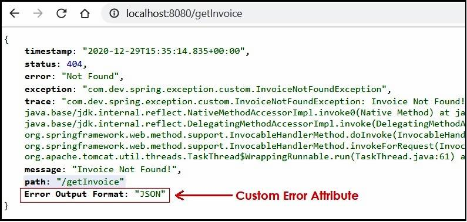

# Spring Boot 中如何处理错误和异常？
我们中的每个人都花费了大量的时间来学习 Spring & Spring Boot 中的大的主题，如 [Spring Boot Rest](https://javatechonline.com/how-to-develop-rest-api-using-spring-boot/)，Spring Boot MVC，[Spring Boot Security](https://javatechonline.com/how-to-implement-security-in-spring-boot-project/) 等。但通常我们不会考虑“在Spring Boot 中如何处理错误和异常”？这个主题对于无障碍运行程序是最重要的。另外，它对于其它开发者更容易地理解我们的代码流很有帮助。如果我们不能合适地处理它们，即使是查找错误和异常的源头也是令人恼火，有些时候我们不得不调试整个代码流以找出问题所在并解决。这样说来异常处理在软件开发活动中攀岩了一个非常重要的角色。


在本文 “Spring Boot 中如何处理错误和异常？”中，我们将逐步学习如何处理错误和异常的所有方面。但是，Spring Boot 内部已经在框架级别处理了大多数常见异常，所以它使得我们的工作非常简单。我们甚至可以在学习和实现异常的过程中观察到 Spring Boot 的魅力。在我看来，每个开发者都应该学习这个主题，并接下来把学到的概念应用到实际项目中。让我们开始 “Spring Boot 中如何处理错误和异常？”吧。
## 1 整体上你能够期待从本文中获得什么？
一旦你阅读完这篇文章，你应该可以回答：
- 什么是在一个 Spring Boot 应用中实现异常处理器的重要性以及益处
- Spring Boot 的内建错误/异常处理内部如何工作地？
- 在不同场景下预定义 BasicErrorController 如何工作？
- 如何显示有意义的自定义错误/异常页面？
- 另外，什么是 HTTP 回复状态码？
- 哪些是最常用的 HTTP 回复状态码？
- 如何为一个特殊 HTTP 回复状态码创建特定错误页面？
- 如何创建一个自定义异常并将其映射到反应一个特定 HTTP 回复状态码的错误页面？
- 如何在自定义错误控制器中添加自定义错误属性？
- 默认情况下预定义错误控制器如何处理一个 REST 调用抛出的异常？
- 我们如何自定义错误状态码以及错误详细属性？
- 最后，我们如何自定义所有的错误属性？
- 注解 `@ControllerAdvice`, `@RestControllerAdvice`, `@ExceptionHandler`, `@ResponseStatus`, `@ResponseBody` 的使用
- 最后一个但不是最少一个，Spring Boot 中如何处理错误和异常？
## 2 通过内建功能 Spring Boot 应用如何在内部处理错误/异常？
为了演示一个 Spring Boot 项目的内建错误处理，我们将考虑最常用的处理流如 Spring Boot MVC 和 Spring Boot REST，两者都基于控制器，或者是正常控制器或者 `RestController`。同时在两种情况下，任意请求都先与 DispatcherServlet 交互。而且，任意请求在把回复发送回客户端之前还得与 `DispatcherServlet` 交互，无论它返回一个成功的结果，或者抛出异常导致的失败。如果它返回失败的结果，`DispatcherServlet` 调用一个预定义[函数式接口](https://javatechonline.com/functional-interface-java8/) ErrorController。在这种情况下 `BasicErrorController`（接口 ErrorController 的一个实现） 将处理该请求。`BasicErrorController` 拥有如下两个方法以处理此类请求：
- `errorHtml()` – 当请求来自于浏览器时调用（MVC 调用）
- `error()` – 当请求来自于非浏览器时媒介例如 postman 工具/客户端应用/其它应用 (REST 调用)。

由于下面的 `@RequestMapping` 注解里的默认路径 `BasicErrorController` 会显式错误/异常：
```
@RequestMapping(“${server.error.path:${error.path:/error}}”)
```
最终，MVC调用时一个带有一些状态码的默认白标签错误页面会出现在屏幕上。相似地，如果是一个 `REST` 调用，你将收到一个 `Json` 格式的错误消息，带有一些默认错误属性，如 状态，错误，消息，时间戳等。更进一步，如果你想在屏幕上展示自定义页面，我们该如何做？参见后面的章节。
## 3 如何显示有意义的自定义错误/异常页面？
取代[白标签错误页面](https://javatechonline.com/whitelabel-error-page-spring-boot/)，我们可以在 `src/main/resources/templates` 下创建 `error.html` 页面如下：
```
<!DOCTYPE html>
<html xmlns:th="https://www.thymeleaf.org/">
<head>
<meta charset="ISO-8859-1">
<title>Insert title here</title>
<link rel="stylesheet" href="https://stackpath.bootstrapcdn.com/bootstrap/4.5.2/css/bootstrap.min.css" >
</head>
<body>
<div class="container">
<h3>SOMTHING WENT WRONG! PLZ CONTACT MAINTENANCE TEAM</h3>
<table class="table table-bordered">
    <tr>
        <td>DATE</td>
        <td th:text="${timestamp}"></td>
    </tr>
    
    <tr>
        <td>status</td>
        <td th:text="${status}"></td>
    </tr>
    
    <tr>
        <td>error</td>
        <td th:text="${error}"></td>
    </tr>
    
    <tr>
        <td>path</td>
        <td th:text="${path}"></td>
    </tr>
    
    <tr>
        <td>Trace</td>
        <td th:text="${trace}"></td>
    </tr>
</table>
</div>
</body>
</html>
```
一旦创建了我们的自定义 error.html ，我们可以得到由默认错误属性分割的有意义的错误页面。


error.html 可以处理所有带状态码 `4xx` & `5xx` 的错误。例如，`400`, `401`, `403`, `404`, .. `500`, `501` 等，仅仅 error.html 会被处理。
## 4 什么是 HTTP 回复状态码？
在一个客户端-服务器请求-回复模型中，Http 回复的状态码时一个三位数的代码，由服务器向客户端提供。状态码指示请求的动作成功了或者在处理工程中由错误发生。例如，当一个查询引擎或一个 Web 访问器向一个 Web 服务器发出一个请求，一个三位数字的 HTTP 回复状态码将被返回。这个状态码指示发生了什么。状态码 `200` 意味着 “OK” ，它指示出路被成功执行。类似地，其它状态码有其各自的意义。

通常 Http 状态码被划分为一下五个类：
```
Informational responses (100–199)
Successful responses (200–299)
Redirects (300–399)
Client errors (400–499)       : denotes Errors in Java
Server errors (500–599)       : denotes Exceptions in Java
```
下面的状态码在 [RFC 2616 第十节](https://tools.ietf.org/html/rfc2616#section-10) 定义。你可以在 [RFC 7231](https://tools.ietf.org/html/rfc7231#section-6.5.1) 找到一个更新版本。

如果你收到一个不在上面列表的回复，他是一个非标准回复，可能是被服务端软件定制过的。如果错误状态吗为 4xx 或 5xx，前述的 error.html 将会处理该请求。
## 5 有哪些常用 HTTP 回复状态码？
```
OK : 200
CREATED : 201
NO_CONTENT : 204
MULTIPLE_CHOICES : 300
NOT_MODIFIED : 304
PERMANENT_REDIRECT : 308
BAD_REQUEST : 400
UNAUTHORIZED : 401
PAYMENT_REQUIRED : 402
FORBIDDEN : 403
NOT_FOUND : 404
METHOD_NOT_ALLOWED : 405
PROXY_AUTHENTICATION_REQUIRED : 407
REQUEST_TIMEOUT : 408
CONFLICT : 409
URI_TOO_LONG : 414
UNSUPPORTED_MEDIA_TYPE : 415
TOO_MANY_REQUESTS : 429
REQUEST_HEADER_FIELDS_TOO_LARGE : 431
INTERNAL_SERVER_ERROR : 500
NOT_IMPLEMENTED : 501
BAD_GATEWAY : 502
SERVICE_UNAVAILABLE : 503
GATEWAY_TIMEOUT : 504
HTTP_VERSION_NOT_SUPPORTED : 505
NETWORK_AUTHENTICATION_REQUIRED : 511
```
## 6 如何为一个特殊 HTTP 回复状态码创建特定错误页面？
前述的 error.html 将处理所有的请求，无论其 Http 返回状态码。它用作一个一般性错误页面。假如我们想为 `404` 状态码显示一个单独的错误页面，类似地，我们可能也期待为 `500` 状态码显示一个单独的错误页面。那么我们如何创建这些页面？
1. Step#1：在 `src/main/resources/templates` 下创建子目录 `error`
2. Step#2 : 创建一个与错误状态码同名的 html 页如 `StatusCode.html` 格式。例如，对状态码 `404` 创建 `404.html` 并将其放在 `error` 子目录下。

你的目录结构应该如下所示：


如果没有状态码对应的页面，它默认将显示 error.html。如果控制器抛出异常，那么默认 Http 状态码将会是 500，即 ”INTERNAL SERVER ERROR“。为了修改错误码至其它状态码，在你的自定义异常上应用 @ResponseStatus(code= HttpStatus.StatusCodeName) 。

我们可以为错误状态码 400-499 生成一个单一页面 `4xx.html`，类似地，500-599 可以生成 `5xx.html`。
## 7 如何创建一个自定义异常并将其映射到反应一个特定 HTTP 回复状态码的错误页面
为了展示这个需求，让我们假设我们有一个订单处理应用。在该应用中我们有一个控制器，它拥有一个 `getInvoice()` 方法服务于如下请求。在 if 条件下，我们得到一些随机整数作为输入，因此这个方法有时候会返回成功的回复，但有时候他它会抛出一个异常。我们将称之为 `InvoiceNotFoundException`，并创建它为自定义异常。另外我们也想自定义 `404.html` 来显示它:
```
package com.dev.spring.exception.controller;

import java.util.Random;

import org.springframework.stereotype.Controller;
import org.springframework.web.bind.annotation.GetMapping;

import com.dev.spring.exception.custom.ImplementationNotFoundException;
import com.dev.spring.exception.custom.InvoiceNotFoundException;

@Controller
public class InvoiceController {

    @GetMapping("/getInvoice")
    public String getInvoice() {
        if(new Random().nextInt(10)>5)
            throw new InvoiceNotFoundException("Invoice Not Found!");
        return "showInvoice";
    }
}
```
### 7.1 创建自定义异常
创建一个类 `InvoiceNotFoundException`，它扩展自 `java.lang.RuntimeException`。然后在其上应用注解 `@ResponseStatus(code= HttpStatus.NOT_FOUND)`。 
```
package com.dev.spring.exception.custom;

import org.springframework.http.HttpStatus;
import org.springframework.web.bind.annotation.ResponseStatus;

@ResponseStatus(code= HttpStatus.NOT_FOUND)
public class InvoiceNotFoundException extends RuntimeException {
    private static final long serialVersionUID = 1L;

    public InvoiceNotFoundException() {
        super();
    }

    public InvoiceNotFoundException(String message) {
        super(message);
    }
}
```
### 7.2 创建自定义错误页面 (`404.html`)
创建 `404.html` 并将其放置在如前述的 `src/main/resources/templates/error` 目录下。
```
<!DOCTYPE html>
<html xmlns:th="https://www.thymeleaf.org/">
<head>
<meta charset="ISO-8859-1">
<title>Insert title here</title>
<link rel="stylesheet" href="https://stackpath.bootstrapcdn.com/bootstrap/4.5.2/css/bootstrap.min.css" >
</head>
<body>
<div class="container">
<h4>SOME RESOURCE NOT FOUND! PLEASE CONTACT MAINTENANCE TEAM</h4>
<table class="table table-bordered">
    <tr>
        <td>DATE</td>
        <td th:text="${timestamp}"></td>
    </tr>
    
    <tr>
        <td>STATUS</td>
        <td th:text="${status}"></td>
    </tr>
    
    <tr>
        <td>ERROR</td>
        <td th:text="${error}"></td>
    </tr>
    
    <tr>
        <td>PATH</td>
        <td th:text="${path}"></td>
    </tr>
</table>
</div>
</body>
</html>
```
无论何时当异常发生时，404.html 将会被调用，它将会显示错误信息如下有意义的格式：

## 8 在 Spring Boot 中如何编写自定义错误控制器？
不同于利用 Spring Boot 已经提供的 `ErrorController` 功能，我们可以实现自己的错误处理器。因为已经提供的 `ErrorController.class` 是一个接口，我们可以创建一个它的实现类从而使这个目标成为可能。如果我们定义 `ErrorController` 的实现类，Spring Boot 将优先选择我们的实现类来展示 `errors/exceptions`。然而在这种情况下，`error.hml`, `4xx.html`, `5xx.html` 或其它任何错误页面就不能再工作了。Spring Boot 默认提供一些错误属性如 `timestamp`, `status`, `message`, `path`, `exception`, `trace` 等，借助 `@Autowired` 注解我们可以在实现类中使用它们。现在来读取请求的属性值，代码如下：
```
ServletWebRequest swr = new ServletWebRequest(request);
Map<String, Object> errors= errorAttribues.getErrorAttributes(swr, true);
```
### 8.1 自定义错误控制器以得到 HTML 格式输出
为了演示自定义错误控制器如何以 HTML 格式显示错误输出，参看以下代码：
```
package com.dev.spring.exception.controller;

import java.util.Map;

import javax.servlet.http.HttpServletRequest;

import org.springframework.beans.factory.annotation.Autowired;
import org.springframework.boot.web.servlet.error.ErrorAttributes;
import org.springframework.boot.web.servlet.error.ErrorController;
import org.springframework.stereotype.Controller;
import org.springframework.web.bind.annotation.RequestMapping;
import org.springframework.web.bind.annotation.ResponseBody;
import org.springframework.web.context.request.ServletWebRequest;

@Controller
public class CustomErrorController implements ErrorController {
    @Autowired
    private ErrorAttributes errorAttributes;
    
    @Override
    public String getErrorPath() {
        return "/error";         //mandatory path
    }
    
    @RequestMapping("/error")    //mandatory mapping
    public @ResponseBody String handleError(HttpServletRequest req) {
        
        ServletWebRequest servletWebRequest = new ServletWebRequest(req);

        @SuppressWarnings("deprecation")
        Map<String, Object> errors = errorAttributes.getErrorAttributes(servletWebRequest, true);

        StringBuilder builder = new StringBuilder();
        builder.append("<html><body>");
        builder.append("<h2>ERROR SUMMARY</h2>");

        builder.append("<table border='1.5'>");
        errors.forEach((key, value) -> {
            builder.append("<tr>").append("<td>").append(key).append("</td>").append("<td>").append(value).append("</td>")
                    .append("</tr>");
        });
        builder.append("</table>");
        builder.append("</body></html>");
        return builder.toString();
    }
}
```
#### 8.1.1 输出
以下是具体输出：

### 8.2 自定义错误控制器以得到 JSON 格式输出
为了演示自定义错误控制器如何以 JSON 格式显示错误输出，参看以下代码：
```
package com.dev.spring.exception.controller;

import java.util.Map;

import javax.servlet.http.HttpServletRequest;

import org.springframework.beans.factory.annotation.Autowired;
import org.springframework.boot.web.servlet.error.ErrorAttributes;
import org.springframework.boot.web.servlet.error.ErrorController;
import org.springframework.stereotype.Controller;
import org.springframework.web.bind.annotation.RequestMapping;
import org.springframework.web.bind.annotation.ResponseBody;
import org.springframework.web.context.request.ServletWebRequest;

@Controller
public class CustomErrorControllerWithJSONResponse implements ErrorController {
    
    @Autowired
    private ErrorAttributes errorAttributes;
    
    @RequestMapping("/error")
    public @ResponseBody Map<String, Object> handleError(HttpServletRequest req)
    {
        ServletWebRequest webRequest = new ServletWebRequest(req);
        @SuppressWarnings("deprecation")
        Map<String, Object> errors = errorAttributes.getErrorAttributes(webRequest, true);
        
        return errors;
    }
    
    @Override
    public String getErrorPath() {
        // TODO Auto-generated method stub
        return null;
    }
}
```
> 谨记在 Spring Boot 中 `@ResponseBody` 的默认输出是字符串或 JSON 格式。任何非字符串的返回类型都会提供 JSON 格式输出。因此确认你的控制器方法返回类型是非字符串（`Lis/Set/Map`）。同时在方法上应用 `@ResponseBody` 注解。
#### 8.2.1 输出
下面是输出格式：


> 为了看到 JSON 输出，可以使用 Firefox，Google Chrome 的 JSON View 扩展，甚至 Postman 工具。
## 9 如何在自定义错误控制器中添加自定义错误属性？
有时候我们可能得到需求要在错误i细节中添加一些额外的属性。在这种情况下，我们可以添加一些属性值以键值对的格式添加到 Map 中，如下所示。这里我们仅仅提供了方法代码。接下来的自定义控制器代码的其它部分与上面的代码一致：
```
@RequestMapping("/error")
public @ResponseBody Map<String, Object> handleError(HttpServletRequest req)
{
    ServletWebRequest webRequest = new ServletWebRequest(req);
    @SuppressWarnings("deprecation")
    Map<String, Object> errors = errorAttributes.getErrorAttributes(webRequest, true);
    errors.put("Error Output Format", "JSON");
    return errors;
}
```
### 9.1 输出
下面是输出格式：

## 10 默认情况下预定义错误控制器如何处理一个 REST 调用抛出的异常？
为了演示这个，让我们创建一个 Spring Boot 启动器项目，它逐步实现了一个简单的 REST 调用。考虑一个订单处理示例，我们有一个 `RestController` 作为 `InvoiceRestController`，其有一个方法 `getInvoice()`。另外我们还有一个模型类 `Invoice` 以及一个自定义异常类 `InvoiceNotFoundException`。
### 10.1 Step#1 : 利用 STS（Spring Tool Suite）创建一个 Spring Boot 启动器项目
当创建一个 Spring Boot 启动器项目时选择Spring Web，Lombok 和 Spring Boot DevTools 作为项目依赖。即使你不懂得如何创建 Spring Boot 启动器项目，请访问[内部链接](https://javatechonline.com/saving-data-into-database-using-spring-boot-data-jpa-step-by-step-tutorial/#Step_1_Creating_Starter_Project_using_STS)。同时，如果你不了解 Lombok 也可以访问[内部链接](https://javatechonline.com/how-to-reduce-boilerplate-code-in-java-lombok-api/)。
### 10.2 Step#2 : 创建模型类如 Invoice.java
```
package com.dev.spring.exception.entity;

import lombok.AllArgsConstructor;
import lombok.Data;
import lombok.NoArgsConstructor;

@Data
@NoArgsConstructor
@AllArgsConstructor
public class Invoice { 
    private Integer id;
    private String name;
    private Double amount;
    private String number;
}
```
### 10.3 Step#3 : 创建控制器类如 InvoiceRestController.java
这里我们有意在 `invoice id` 值为 `24` 时抛出异常 `InvoiceNotFoundException`。
```
package com.dev.spring.exception.controller;

import org.springframework.http.ResponseEntity;
import org.springframework.web.bind.annotation.GetMapping;
import org.springframework.web.bind.annotation.PathVariable;
import org.springframework.web.bind.annotation.RestController;

import com.dev.spring.exception.custom.InvoiceNotFoundException;
import com.dev.spring.exception.entity.Invoice;

@RestController
public class InvoiceRestController {
    @GetMapping("/find/{id}")
    public ResponseEntity<Invoice> getInvoice(@PathVariable Integer id){
        if(id ==24) {
            throw new InvoiceNotFoundException("Invoice with id: " +id +" does not exist!");
        }
        return ResponseEntity.ok(new Invoice(id,"INV001",2378.75,"CRTQW224"));
    }
}
```
### 10.4 Step#4 : 创建自定义异常类如 InvoiceNotFoundException.java
```
package com.dev.spring.exception.custom;

public class InvoiceNotFoundException extends RuntimeException {
    private static final long serialVersionUID = 1L;

    public InvoiceNotFoundException() {
        super();
    }

    public InvoiceNotFoundException(String message) {
        super(message);
    }
}
```
### 10.5 测试异常
Send在 Postman 工具中输入路径 `http://localhost:8080/find/24`，选择 `GET` 方法然后点击 `Send` 按钮。接下来你将会看到如下输出。你可以选择你喜欢的任意浏览器来测试这个用例：
```
{
"timestamp": "2020-12-29T19:32:29.056+00:00",
"status": 500,
"error": "Internal Server Error",
"trace": "com.dev.spring.exception.custom.InvoiceNotFoundException: Invoice with id: 24 does not exist!\r\n\tat com.dev.spring.exception.controller.InvoiceRestController.getInvoice(InvoiceRestController.java:18)\r\n\tat java.base/jdk.internal.reflect.NativeMethodAccessorImpl.invoke0(Native Method)\r\n\tat java.base/jdk.internal.reflect.NativeMethodAccessorImpl.invoke(NativeMethodAccessorImpl.java:62)\r\n\tat java.base/jdk.internal.reflect.DelegatingMethodAccessorImpl.invoke(DelegatingMethodAccessorImpl.java:43)\r\n\tat java.base/java.lang.reflect.Method.invoke(Method.java:564)\r\n\tat org.springframework.web.method.support.InvocableHandlerMethod.doInvoke(InvocableHandlerMethod.java:190)\r\n\tat org.springframework.web.method.support.InvocableHandlerMethod.invokeForRequest(InvocableHandlerMethod.java:138)\r\n\tat org.springframework.web.servlet.mvc.method.annotation.ServletInvocableHandlerMethod.invokeAndHandle(ServletInvocableHandlerMethod.java:105)\r\n\tat org.springframework.web.servlet.mvc.method.annotation.RequestMappingHandlerAdapter.invokeHandlerMethod(RequestMappingHandlerAdapter.java:878)\r\n\tat org.springframework.web.servlet.mvc.method.annotation.RequestMappingHandlerAdapter.handleInternal(RequestMappingHandlerAdapter.java:792)\r\n\tat org.springframework.web.servlet.mvc.method.AbstractHandlerMethodAdapter.handle(AbstractHandlerMethodAdapter.java:87)\r\n\tat org.springframework.web.servlet.DispatcherServlet.doDispatch(DispatcherServlet.java:1040)\r\n\tat org.springframework.web.servlet.DispatcherServlet.doService(DispatcherServlet.java:943)\r\n\tat org.springframework.web.servlet.FrameworkServlet.processRequest(FrameworkServlet.java:1006)\r\n\tat org.springframework.web.servlet.FrameworkServlet.doGet(FrameworkServlet.java:898)\r\n\tat javax.servlet.http.HttpServlet.service(HttpServlet.java:626)\r\n\tat org.springframework.web.servlet.FrameworkServlet.service(FrameworkServlet.java:883)\r\n\tat javax.servlet.http.HttpServlet.service(HttpServlet.java:733)\r\n\tat org.apache.catalina.core.ApplicationFilterChain.internalDoFilter(ApplicationFilterChain.java:231)\r\n\tat org.apache.catalina.core.ApplicationFilterChain.doFilter(ApplicationFilterChain.java:166)\r\n\tat org.apache.tomcat.websocket.server.WsFilter.doFilter(WsFilter.java:53)\r\n\tat org.apache.catalina.core.ApplicationFilterChain.internalDoFilter(ApplicationFilterChain.java:193)\r\n\tat org.apache.catalina.core.ApplicationFilterChain.doFilter(ApplicationFilterChain.java:166)\r\n\tat org.springframework.web.filter.RequestContextFilter.doFilterInternal(RequestContextFilter.java:100)\r\n\tat org.springframework.web.filter.OncePerRequestFilter.doFilter(OncePerRequestFilter.java:119)\r\n\tat org.apache.catalina.core.ApplicationFilterChain.internalDoFilter(ApplicationFilterChain.java:193)\r\n\tat org.apache.catalina.core.ApplicationFilterChain.doFilter(ApplicationFilterChain.java:166)\r\n\tat org.springframework.web.filter.FormContentFilter.doFilterInternal(FormContentFilter.java:93)\r\n\tat org.springframework.web.filter.OncePerRequestFilter.doFilter(OncePerRequestFilter.java:119)\r\n\tat org.apache.catalina.core.ApplicationFilterChain.internalDoFilter(ApplicationFilterChain.java:193)\r\n\tat org.apache.catalina.core.ApplicationFilterChain.doFilter(ApplicationFilterChain.java:166)\r\n\tat org.springframework.web.filter.CharacterEncodingFilter.doFilterInternal(CharacterEncodingFilter.java:201)\r\n\tat org.springframework.web.filter.OncePerRequestFilter.doFilter(OncePerRequestFilter.java:119)\r\n\tat org.apache.catalina.core.ApplicationFilterChain.internalDoFilter(ApplicationFilterChain.java:193)\r\n\tat org.apache.catalina.core.ApplicationFilterChain.doFilter(ApplicationFilterChain.java:166)\r\n\tat org.apache.catalina.core.StandardWrapperValve.invoke(StandardWrapperValve.java:202)\r\n\tat org.apache.catalina.core.StandardContextValve.invoke(StandardContextValve.java:97)\r\n\tat org.apache.catalina.authenticator.AuthenticatorBase.invoke(AuthenticatorBase.java:542)\r\n\tat org.apache.catalina.core.StandardHostValve.invoke(StandardHostValve.java:143)\r\n\tat org.apache.catalina.valves.ErrorReportValve.invoke(ErrorReportValve.java:92)\r\n\tat org.apache.catalina.core.StandardEngineValve.invoke(StandardEngineValve.java:78)\r\n\tat org.apache.catalina.connector.CoyoteAdapter.service(CoyoteAdapter.java:343)\r\n\tat org.apache.coyote.http11.Http11Processor.service(Http11Processor.java:374)\r\n\tat org.apache.coyote.AbstractProcessorLight.process(AbstractProcessorLight.java:65)\r\n\tat org.apache.coyote.AbstractProtocol$ConnectionHandler.process(AbstractProtocol.java:888)\r\n\tat org.apache.tomcat.util.net.NioEndpoint$SocketProcessor.doRun(NioEndpoint.java:1597)\r\n\tat org.apache.tomcat.util.net.SocketProcessorBase.run(SocketProcessorBase.java:49)\r\n\tat java.base/java.util.concurrent.ThreadPoolExecutor.runWorker(ThreadPoolExecutor.java:1130)\r\n\tat java.base/java.util.concurrent.ThreadPoolExecutor$Worker.run(ThreadPoolExecutor.java:630)\r\n\tat org.apache.tomcat.util.threads.TaskThread$WrappingRunnable.run(TaskThread.java:61)\r\n\tat java.base/java.lang.Thread.run(Thread.java:832)\r\n",
"message": "Invoice with id: 24 does not exist!",
"path": "/find/24"
}
```
### 10.6 结论
虽然从上面的输出，我们可以很清楚地看到 Spring Boot 的预定义 `ErrorController` 对任何类型异常提供状态码 `500` 以及 `Internal Server Error` 错误。进一步我们可以根据我们的需求自定义状态码及错误。
## 11 我们如何自定义错误状态码以及错误详细属性？
进一步自定义错误状态码和错误，我们可以在自定义异常上如下所示应用 @ResponseStatus(code= HttpStatus.StatusName) 注解：
```
package com.dev.spring.exception.custom;

import org.springframework.http.HttpStatus;
import org.springframework.web.bind.annotation.ResponseStatus;

@ResponseStatus(code= HttpStatus.NOT_FOUND)
public class InvoiceNotFoundException extends RuntimeException {
    private static final long serialVersionUID = 1L;

    public InvoiceNotFoundException() {
        super();
    }

    public InvoiceNotFoundException(String message) {
        super(message);
    }
}
```
### 11.1 自定义输出
```
{
"timestamp": "2020-12-29T20:17:21.207+00:00",
"status": 404,
"error": "Not Found",
"trace": "com.dev.spring.exception.custom.InvoiceNotFoundException: Invoice with id: 24 does not exist!\r\n\tat com.dev.spring.exception.controller.InvoiceRestController.getInvoice(InvoiceRestController.java:18)\r\n\tat java.base/jdk.internal.reflect.NativeMethodAccessorImpl.invoke0(Native Method)\r\n\tat java.base/jdk.internal.reflect.NativeMethodAccessorImpl.invoke(NativeMethodAccessorImpl.java:62)\r\n\tat java.base/jdk.internal.reflect.DelegatingMethodAccessorImpl.invoke(DelegatingMethodAccessorImpl.java:43)\r\n\tat java.base/java.lang.reflect.Method.invoke(Method.java:564)\r\n\tat org.springframework.web.method.support.InvocableHandlerMethod.doInvoke(InvocableHandlerMethod.java:190)\r\n\tat org.springframework.web.method.support.InvocableHandlerMethod.invokeForRequest(InvocableHandlerMethod.java:138)\r\n\tat org.springframework.web.servlet.mvc.method.annotation.ServletInvocableHandlerMethod.invokeAndHandle(ServletInvocableHandlerMethod.java:105)\r\n\tat org.springframework.web.servlet.mvc.method.annotation.RequestMappingHandlerAdapter.invokeHandlerMethod(RequestMappingHandlerAdapter.java:878)\r\n\tat org.springframework.web.servlet.mvc.method.annotation.RequestMappingHandlerAdapter.handleInternal(RequestMappingHandlerAdapter.java:792)\r\n\tat org.springframework.web.servlet.mvc.method.AbstractHandlerMethodAdapter.handle(AbstractHandlerMethodAdapter.java:87)\r\n\tat org.springframework.web.servlet.DispatcherServlet.doDispatch(DispatcherServlet.java:1040)\r\n\tat org.springframework.web.servlet.DispatcherServlet.doService(DispatcherServlet.java:943)\r\n\tat org.springframework.web.servlet.FrameworkServlet.processRequest(FrameworkServlet.java:1006)\r\n\tat org.springframework.web.servlet.FrameworkServlet.doGet(FrameworkServlet.java:898)\r\n\tat javax.servlet.http.HttpServlet.service(HttpServlet.java:626)\r\n\tat org.springframework.web.servlet.FrameworkServlet.service(FrameworkServlet.java:883)\r\n\tat javax.servlet.http.HttpServlet.service(HttpServlet.java:733)\r\n\tat org.apache.catalina.core.ApplicationFilterChain.internalDoFilter(ApplicationFilterChain.java:231)\r\n\tat org.apache.catalina.core.ApplicationFilterChain.doFilter(ApplicationFilterChain.java:166)\r\n\tat org.apache.tomcat.websocket.server.WsFilter.doFilter(WsFilter.java:53)\r\n\tat org.apache.catalina.core.ApplicationFilterChain.internalDoFilter(ApplicationFilterChain.java:193)\r\n\tat org.apache.catalina.core.ApplicationFilterChain.doFilter(ApplicationFilterChain.java:166)\r\n\tat org.springframework.web.filter.RequestContextFilter.doFilterInternal(RequestContextFilter.java:100)\r\n\tat org.springframework.web.filter.OncePerRequestFilter.doFilter(OncePerRequestFilter.java:119)\r\n\tat org.apache.catalina.core.ApplicationFilterChain.internalDoFilter(ApplicationFilterChain.java:193)\r\n\tat org.apache.catalina.core.ApplicationFilterChain.doFilter(ApplicationFilterChain.java:166)\r\n\tat org.springframework.web.filter.FormContentFilter.doFilterInternal(FormContentFilter.java:93)\r\n\tat org.springframework.web.filter.OncePerRequestFilter.doFilter(OncePerRequestFilter.java:119)\r\n\tat org.apache.catalina.core.ApplicationFilterChain.internalDoFilter(ApplicationFilterChain.java:193)\r\n\tat org.apache.catalina.core.ApplicationFilterChain.doFilter(ApplicationFilterChain.java:166)\r\n\tat org.springframework.web.filter.CharacterEncodingFilter.doFilterInternal(CharacterEncodingFilter.java:201)\r\n\tat org.springframework.web.filter.OncePerRequestFilter.doFilter(OncePerRequestFilter.java:119)\r\n\tat org.apache.catalina.core.ApplicationFilterChain.internalDoFilter(ApplicationFilterChain.java:193)\r\n\tat org.apache.catalina.core.ApplicationFilterChain.doFilter(ApplicationFilterChain.java:166)\r\n\tat org.apache.catalina.core.StandardWrapperValve.invoke(StandardWrapperValve.java:202)\r\n\tat org.apache.catalina.core.StandardContextValve.invoke(StandardContextValve.java:97)\r\n\tat org.apache.catalina.authenticator.AuthenticatorBase.invoke(AuthenticatorBase.java:542)\r\n\tat org.apache.catalina.core.StandardHostValve.invoke(StandardHostValve.java:143)\r\n\tat org.apache.catalina.valves.ErrorReportValve.invoke(ErrorReportValve.java:92)\r\n\tat org.apache.catalina.core.StandardEngineValve.invoke(StandardEngineValve.java:78)\r\n\tat org.apache.catalina.connector.CoyoteAdapter.service(CoyoteAdapter.java:343)\r\n\tat org.apache.coyote.http11.Http11Processor.service(Http11Processor.java:374)\r\n\tat org.apache.coyote.AbstractProcessorLight.process(AbstractProcessorLight.java:65)\r\n\tat org.apache.coyote.AbstractProtocol$ConnectionHandler.process(AbstractProtocol.java:888)\r\n\tat org.apache.tomcat.util.net.NioEndpoint$SocketProcessor.doRun(NioEndpoint.java:1597)\r\n\tat org.apache.tomcat.util.net.SocketProcessorBase.run(SocketProcessorBase.java:49)\r\n\tat java.base/java.util.concurrent.ThreadPoolExecutor.runWorker(ThreadPoolExecutor.java:1130)\r\n\tat java.base/java.util.concurrent.ThreadPoolExecutor$Worker.run(ThreadPoolExecutor.java:630)\r\n\tat org.apache.tomcat.util.threads.TaskThread$WrappingRunnable.run(TaskThread.java:61)\r\n\tat java.base/java.lang.Thread.run(Thread.java:832)\r\n",
"message": "Invoice with id: 24 does not exist!",
"path": "/find/24"
}
```
## 12 我们如何自定义所有的错误属性？
为了实现这个我们需要利用下面的注解创建一个新的异常处理器类。
- @ControllerAdvice : At Handler class level
- @ExceptionHandler : At method level
- @ResponseBody     : At method level

> 虽然我们可以偶尔在类级别应用注解 @RestControllerAdvice。但在这个用例上我们并不需要在方法级别应用 @ResponseBody。为了了解更多这些注解的细节，请访问 `Spring Boot关于错误及异常的注解`。
### 12.1 Step#1 : 编写一个性的模型类如 ErrorType.java
为了自定义所有的属性，我们将创建一个模型类 `ErrorType.java`，并定义所有的属性为字段。我们也需要这个类的对象在我们的处理器类中。
```
package com.dev.spring.exception.entity;

import lombok.AllArgsConstructor;
import lombok.Data;
import lombok.NoArgsConstructor;

@Data
@NoArgsConstructor
@AllArgsConstructor
public class ErrorType {
    private String message;
    private String code;
    private String error;
    private String staus;
}
```
### 12.2 Step#2 : 编写写一个新的处理类如 InvoiceExceptionhandler.java
我们必须定义一个处理器类并应用前述的注解如下：
```
package com.dev.spring.exception.handler;

import org.springframework.http.HttpStatus;
import org.springframework.http.ResponseEntity;
import org.springframework.web.bind.annotation.ControllerAdvice;
import org.springframework.web.bind.annotation.ExceptionHandler;
import org.springframework.web.bind.annotation.ResponseBody;
import org.springframework.web.bind.annotation.RestControllerAdvice;

import com.dev.spring.exception.custom.InvoiceNotFoundException;
import com.dev.spring.exception.entity.ErrorType;

//@RestControllerAdvice
@ControllerAdvice
public class InvoiceExceptionHandler {
    @ExceptionHandler(InvoiceNotFoundException.class)
    @ResponseBody
    public ResponseEntity<ErrorType> handleInvoiceNotFoundException(
        InvoiceNotFoundException ine){

        return new ResponseEntity<ErrorType>(
            new ErrorType(
                     ine.getMessage(), 
                    "INVOICE_NOT_FOUND", 
                     "DATA NOT FOUND FOR REQUESTED ID", 
                    "406"), 
                    HttpStatus.NOT_ACCEPTABLE);
    }
}
```
### 12.3 Step#3 : 编写一个新的自定义异常类及 Rest 控制器
你可以使用前面章节的 `InvoiceNotFoundException.java`。另外，确认 @ResponseStatus 没有在其上应用。同样地，也可以使用前面章节的 InvoiceRestController。
### 12.4 测试自定义错误属性
在 Postman 工具中输入路径 `http://localhost:8080/find/24`，选择 `GET` 方法然后点击 `Send` 按钮。接下来你将会看到如下输出。你可以选择你喜欢的任意浏览器来测试这个用例：

## 13 总结
在讨论了 “Spring Boot 中如何处理错误和异常？”的理论和实例部分后，最终，我们能够在 Spring Boot 项目中实现 `Exceptions/Errors` 处理。当然，在本文中我们彻底的了解了 Spring Boot 的异常处理。类似地，我们期待你能够进一步扩展这些例子，并在你的项目中相应地实现它们。你也可以从 [spring.io](https://spring.io/blog/2013/11/01/exception-handling-in-spring-mvc) 查找到更多关于 Spring MVC 中异常处理的更多细节。另外，如果将来有更新，我们也会相应地更新本文。另外，请自由地在评论区写下你的评论。


## Reference
- [How To Handle Exceptions & Errors In Spring Boot?](https://javatechonline.com/how-to-handle-exceptions-errors-in-spring-boot/)
- [Java Functional Interface](https://javatechonline.com/java-functional-interface/)