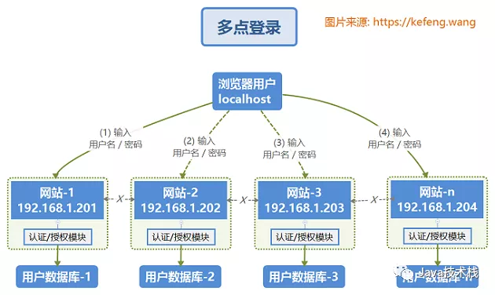
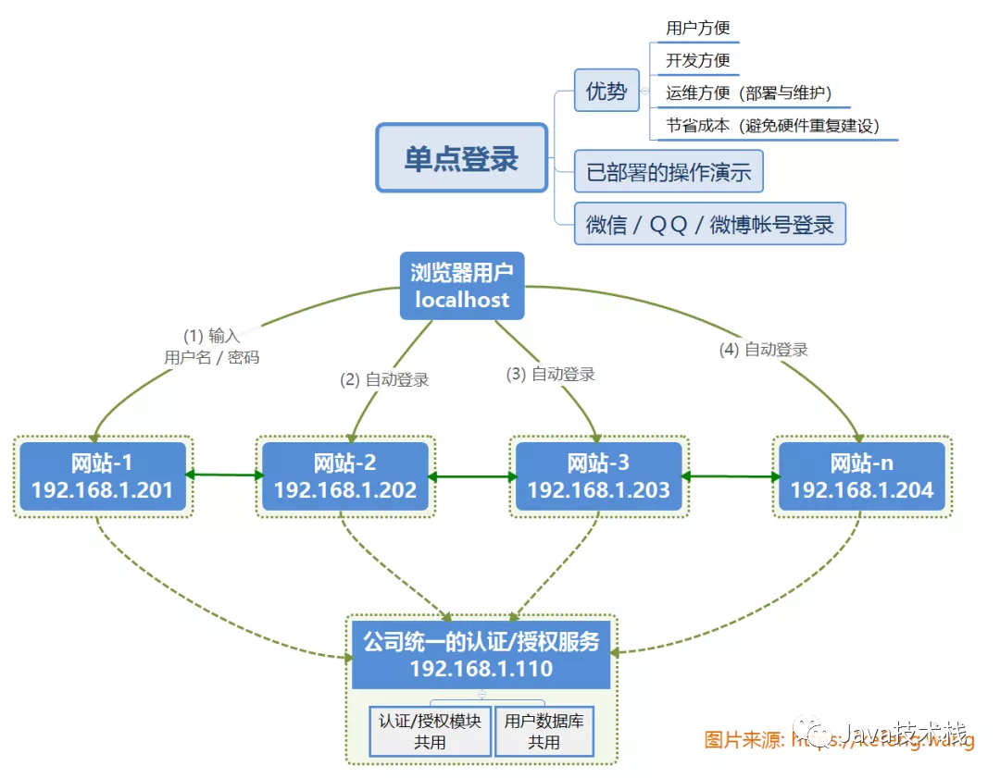
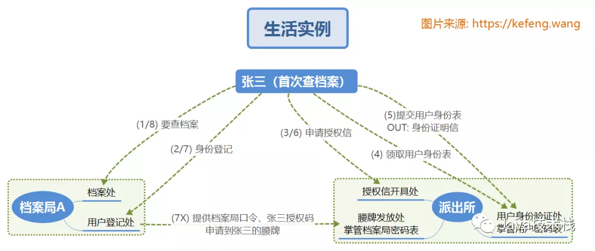
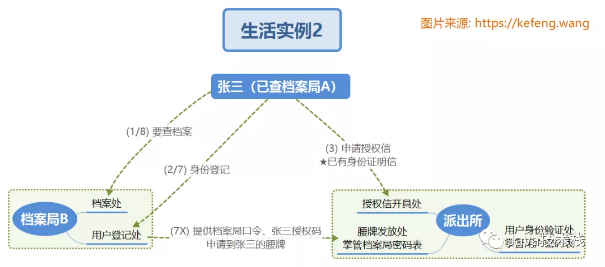
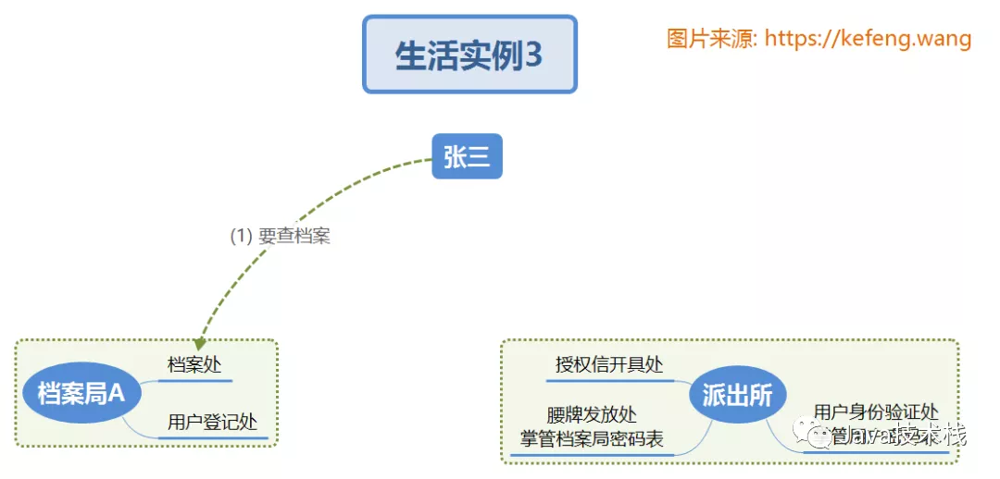
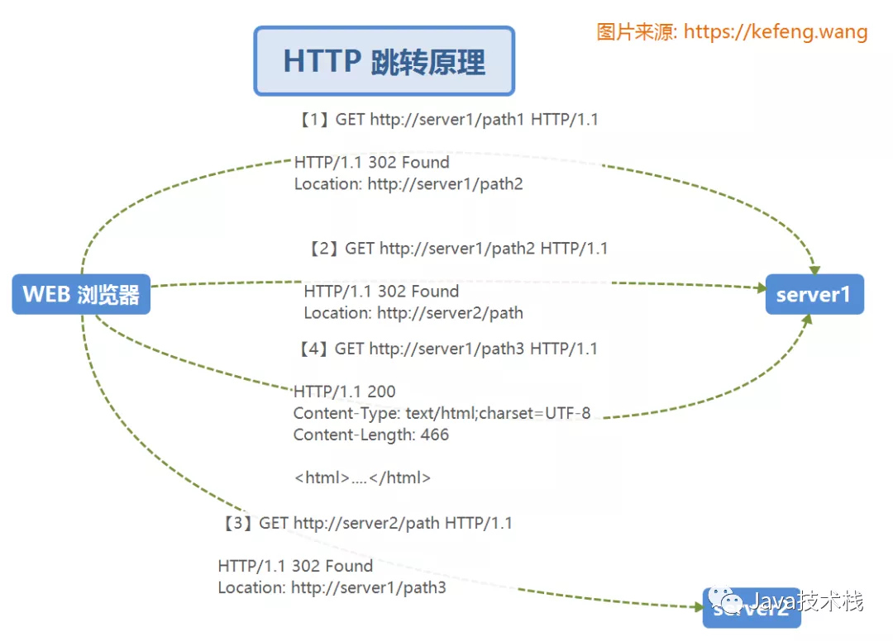
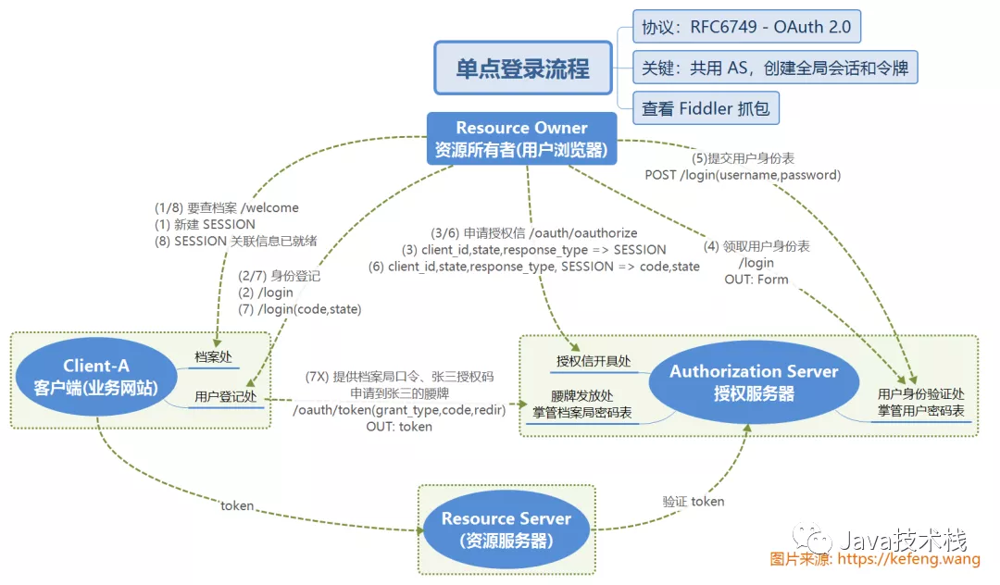
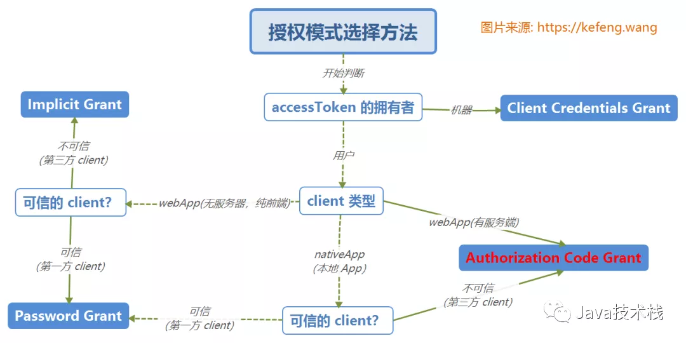
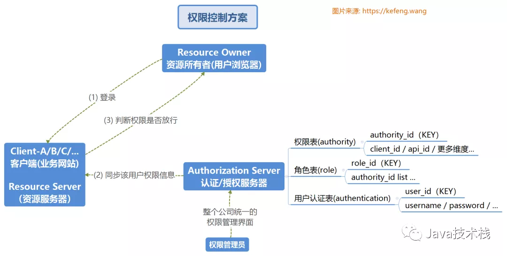
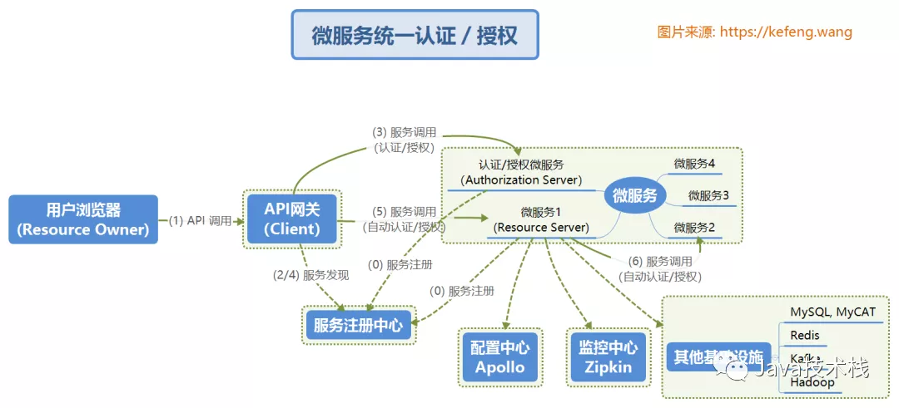

# OAuth 2 实现单点登录
单点登录是多域名企业站点流行的登录方式。本文以现实生活场景辅助理解，力争彻底理清 OAuth2.0 实现单点登录的原理流程。同时总结了权限控制的实现方案，及其在微服务架构中的应用。
## 1 什么是单点登录
### 1.1 多点登录
传统的多点登录系统中，每个站点都实现了本站专用的帐号数据库和登录模块。各站点的登录状态相互不认可，各站点需要逐一手工登录。如下图，有两个术语含义如下：
- 认证(authentication): 验证用户的身份；
- 授权(authorization): 验证用户的访问权限。


### 1.2 单点登录
单点登录，英文是 Single Sign On，缩写为 SSO。多个站点(192.168.1.20X)共用一台认证授权服务器(192.168.1.110，用户数据库和认证授权模块共用)。用户经由其中任何一个站点(比如 192.168.1.201)登录后，可以免登录访问其他所有站点。而且，各站点间可以通过该登录状态直接交互。


## 2 OAuth2 认证授权的原理流程
### 2.1 生活实例
为了直观的理解 OAuth2.0 原理流程，我们假设这样一个生活场景：
- 档案局A(`客户端/Client`)：以“档案局ID/密码”标识，是掌握档案资源的机构。并列还有很多档案局B/C/…，每个档案局存储的档案内容(`资源/Resource`)不一样，比如政治、经济、军事、文化等；
- 公民张三(`资源所有者/Resource Owner`)：以“用户名/密码”标识，需要到各个档案局查档案
- 派出所(`授权服务器/Authentication Server`)：可以是单个巨大的派出所，也可以是数据共享的派出所集群，掌管的信息、提供的对外接口功能有：
  + 档案局信息：所有档案局的“档案局ID/密码”，证明档案局的身份；
  + 公民信息：所有公民的“用户名/密码”，能提供张三是张三的用户身份证明(`认证/Authentication`)
  + 公民对于档案局的权限：有张公民和档案局的权限的映射表，可查得各公民对各档案局是否有操作权限(`授权/Authorization`)。通常，设计中会增加官职(`角色/Role`)一层，各公民属于哪个官职(`角色`)，哪个官职(`角色`)对于特定档案局有操作权限。
#### 2.1.1 张三首次访问档案局A
张三之前从未到访档案局，第一次来档案局。对照下图序号理解：
1. 张三来到“档案局A”的“档案处”，该处要求实名登记后才能查询，被指示到“用户登记处”办理(HTTP重定向)；
2. 张三来到“档案局A”的“用户登记处”，既不能证明身份(`认证`)，又不能证明自己有查档案A的权限(`授权`)。张三携带档案局A的标识(`client-id`)，被重定向至“授权信开具处”；
3. 张三来到“派出所”的“授权信开具处”，出示档案局A的标识，希望开具授权信(`授权`)。该处要求首先证明身份(`认证`)，被重定向至“用户身份验证处”；
4. 张三来到“派出所”的“用户身份验证处”，领取了用户身份表(`网页登录表单 Form`)；
5. 张三填上自己的用户名和密码，交给(`提交/Submit`)“用户身份验证处”，该处从私有数据库中查得用户名密码匹配，确定此人是张三，开具身份证明信，完成`认证`。张三带上身份证明信和档案局A的标识，被重定向至“授权信开具处”；
6. 张三再次来到“授权信开具处”，出示身份证明信和档案局A的标识，该处从私有数据库中查得，张三的官职是市长级别(角色)，该官职具有档案局A的查询权限，就开具“允许张三查询档案局A”的授权信(`授权码/code`)，张三带上授权信被重定向至“档案局”的“用户登录处”；
7. 张三到了“档案局”的“用户登录处”，该处私下拿出档案局A的标识(`client-id`)和密码，再附上张三出示的授权信(`code`)，向“派出所”的“腰牌发放处”为张三申请的“腰牌”(token)，将来张三可以带着这个腰牌表明身份和权限。又被重定向到“档案处”；
8. 张三的会话(`Session`)已经关联上了腰牌(`token`)，可以直接通过“档案处”查档案


#### 2.1.2 张三首次访问档案局B
张三已经成功访问了档案局A，现在他要访问档案局B。对照下图序号理解：最新面试题整理好了，大家可以在[Java面试库小程序在线](https://mp.weixin.qq.com/s?__biz=MzI3ODcxMzQzMw==&mid=2247554905&idx=2&sn=4ecd9ec0837291e79a210f0ee4eb5ffb&chksm=eb50926fdc271b79a11bd1d73019471df64065ed3ffabdc3a966d82bab6c5a2c408669e46db5&scene=132)刷题。

(1)/(2) 同上；

(3)张三已经有“身份证明信”，直接在“派出所”的“授权信开具处”成功开具“访问档案局B”的授权信；

(4)/(5)/(6) 免了；

(7)“档案局B”的“用户登记处”完成登记；

(8)“档案局B”的“档案处”查得档案。


#### 2.1.3 张三再次访问档案局A
张三已经成功访问了档案局A，现在他要访问档案局A。对照下图序号理解：

(1)直接成功查到了档案；

(2~8)都免了。


### 2.2 HTTP 重定向原理
HTTP 协议中，浏览器的 REQUEST 发给服务器之后，服务器如果发现该业务不属于自己管辖，会把你指派到自身服务器或其它服务器(host)的某个接口(uri)。正如我们去政府部门办事，每到一个窗口，工作人员会说“你带上材料A，到本所的X窗口，或者其他Y所的Z窗口”进行下一个手续。


### 2.3 SSO 工作流程
至此，就不难理解 OAuth 2.0 的认证/授权流程，此处不再赘述。请拿下图对照“2.1 生活实例”一节来理解。


### 2.4 OAuth2.0 进阶
- https://tools.ietf.org/html/rfc6749
- https://tools.ietf.org/html/rfc6750
- https://blog.csdn.net/seccloud/article/details/8192707

根据官方标准，OAuth 2.0 共有四种授权模式：
+ `Authorization Code`: 用在服务端应用之间，这种最复杂，也是本文采用的模式；
+ `Implicit`: 用在移动app或者web app(这些app是在用户的设备上的，如在手机上调起微信来进行认证授权)
+ `Resource Owner Password Credentials(password)`: 应用直接都是受信任的(都是由一家公司开发的，本例子使用)
+ `Client Credentials`: 用在应用API访问。


## 3 基于 SpringBoot 实现认证/授权
### 3.1 授权服务器(Authorization Server)
推荐一个 Spring Boot 基础教程及实战示例: https://github.com/javastacks/spring-boot-best-practice

(1) pom.xml
```
<dependency>
    <groupId>org.springframework.cloud</groupId>
    <artifactId>spring-cloud-starter-oauth2</artifactId>
</dependency>
```
(2) application.properties
```
server.port=8110 ## 监听端口
```
(3) AuthorizationServerApplication.java
```
@EnableResourceServer // 启用资源服务器
public class AuthorizationServerApplication {
    // ...
}
```
(4) 配置授权服务的参数
```
@Configuration
@EnableAuthorizationServer
public class Oauth2AuthorizationServerConfigurer extends AuthorizationServerConfigurerAdapter {
    @Override
    public void configure(final ClientDetailsServiceConfigurer clients) throws Exception {
        clients.inMemory()
                .withClient("webapp").secret("secret") //客户端 id/secret
                .authorizedGrantTypes("authorization code") //授权妈模式
                .scopes("user_info")
                .autoApprove(true) //自动审批
                .accessTokenValiditySeconds(3600); //有效期1hour
    }
}

@Configuration
public class Oauth2WebSecurityConfigurer extends WebSecurityConfigurerAdapter {
    @Override
    protected void configure(HttpSecurity http) throws Exception {
        http.requestMatchers()
                .antMatchers("/login", "/oauth/authorize/oauth/logout")
                .and().authorizeRequests().anyRequest().authenticated()
                .and().formLogin().permitAll();
    }

    @Override
    protected void configure(AuthenticationManagerBuilder auth) throws Exception {
        auth.inMemoryAuthentication().withUser("admin").password("admin123").roles("ADMIN");
    }
}
```
### 3.2 客户端(Client, 业务网站)
(1) pom.xml
```
<dependency>
    <groupId>org.springframework.cloud</groupId>
    <artifactId>spring-cloud-starter-oauth2</artifactId>
</dependency>
```
(2) application.properties
```
server port=8080
security.oauth2.client.client-id=webapp
security.oauth2.client.client-secret=secret
security.oauth2.client.access-token-uri=http://localhost:8110/oauth/token
security.oauth2.client.user-authorization-uri=http://localhost:8110/oauth/authorize
security.oauth2.resource.user-info-uri=http://localhost:8110/oauth/user
```
(3) 配置 WEB 安全
```
@Configuration
@EnableOAuth2Sso
public class Oauth2WebsecurityConfigurer extends WebSecurityConfigurerAdapter {
    @Override
    public void configure(HttpSecurity http) throws Exception {
        http.antMatcher("/**").authorizeRequests()
                .antMatchers("/", "/login").permitAll()
                .anyRequest().authenticated();
    }
}

@RestController
public class Oauth2ClientController {
    @GetMapping("/")
    public ModelAndView index() {
        return new ModelAndView("index");
    }

    @GetMapping("/welcome")
    public ModelAndView welcome() {
        return new ModelAndView("welcome");
    }
}
```
### 3.3 用户权限控制(基于角色)
+ 授权服务器中，定义各用户拥有的角色: user=USER, admin=ADMIN/USER, root=ROOT/ADMIN/USER
+ 业务网站中(client)，注解标明哪些角色可
  ```
    @RestController
    public class Oauth2ClientController {
        @GetMapping("/welcome")
        public ModelAndView welcome() {
            return new ModelAndView("welcome");
        }

        @GetMapping("/api/user")
        @PreAuthorize("hasAuthority('USER')")
        public Map<String, Object> apiUser() {
        }

        @GetMapping("/api/admin")
        @PreAuthorize("hasAuthority('ADMIN')")
        public Map<String, Object> apiAdmin() {
        }

        @GetMapping("/api/root")
        @PreAuthorize("hasAuthority('ROOT')")
        public Map<String, Object> apiRoot() {
        }
    }
  ```
## 4 综合运用
### 4.1 权限控制方案
下图是基本的认证/授权控制方案，主要设计了认证授权服务器上相关数据表的基本定义。可对照本文“2.1 生活实例”一节来理解。


### 4.2 在微服务架构中的应用
与常规服务架构不同，在微服务架构中，Authorization Server/Resource Server 是作为微服务存在的，用户的登录可以通过API网关一次性完成，无需与无法跳转至内网的 Authorization Server 来完成。


## Reference
- [OAuth 2 实现单点登录](https://mp.weixin.qq.com/s?__biz=MzI3ODcxMzQzMw==&mid=2247554905&idx=2&sn=4ecd9ec0837291e79a210f0ee4eb5ffb&chksm=eb50926fdc271b79a11bd1d73019471df64065ed3ffabdc3a966d82bab6c5a2c408669e46db5&scene=132#wechat_redirect)