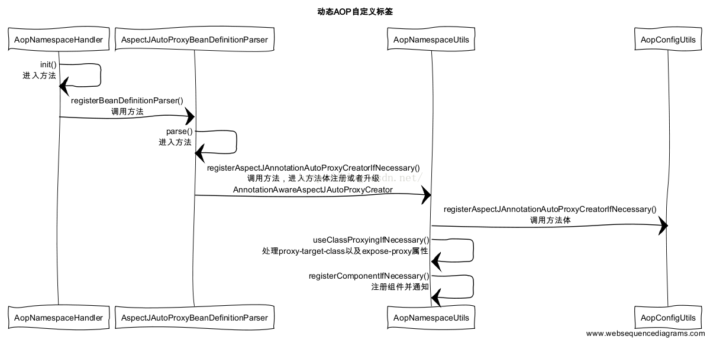
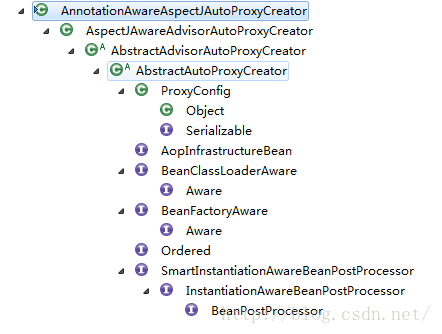
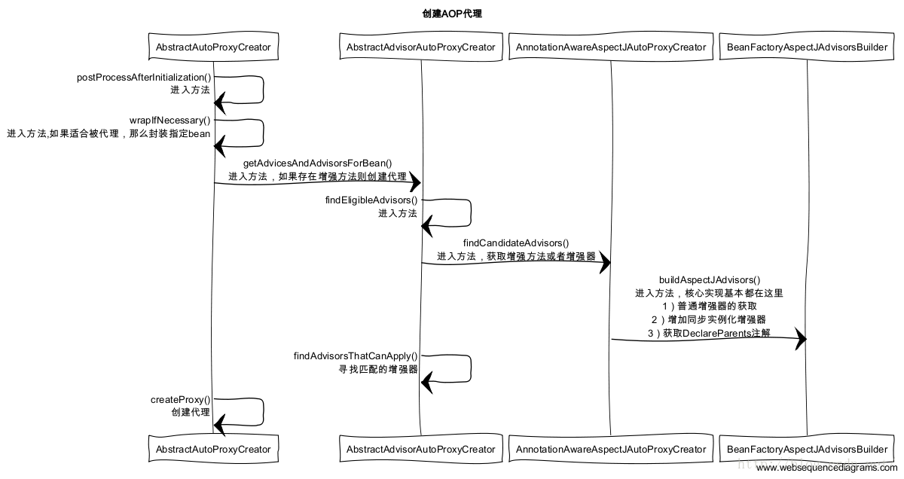

# Spring Boot 错误 & AOP 注解及其实例
在本文中我们将讨论 `“Spring Boot 注解及其实例”` 之前。无需细说，这些注解在创建 Spring Boot 应用时起到了关键作用。如果你想学习在一个 Spring Boot 项目中常用的所有注解，你可以访问博文 `“Spring Boot 注解及其实例”`。但这里我们将仅仅讨论 `“Spring Boot 注解及其实例”`。
## 1 关于 Spring 错误和异常的注解
Spring Boot 证明了通过提供一些注解例如：`@Exception` 处理器, `@ContollerAdvice`, `@ResponseStatus`，异常处理是横切关注点。为了深入学习 Spring Boot 异常处理，请访问我们的博文[在 Spring Boot 中如何处理异常和错误](https://javatechonline.com/how-to-handle-exceptions-errors-in-spring-boot/)。
### 1.1 @ResponseStatus
在 Spring Boot 的默认异常处理机制中，当任何运行时一场发生时，我们的网页控制器会在返回的负载中提供一条一般性的错误页面。我们的错误回复总是给我们显示 [HTTP 状态码 500](https://javatechonline.com/how-to-handle-exceptions-errors-in-spring-boot/#What_are_some_commonly_used_Http_Response_Status_codes)（指示内部服务器错误）而非一个更具描述性的状态码。我们可以利用 `@ResponseStatus` 的帮助得到一个格式更好的描述性错误回复，而非一般性错误页面。注解允许我们修改我们的回复的 HTTP 状态。它可被用于以下各处：
1. 在异常类本身上
2. 在方法上与 `@ExceptionHandler` 注解一起出现
3. 在类上与 `@ControllerAdvice` 注解一起出现

例如，我们可以给我们的自定义异常类添加 `@ResponseStatus` 注解，并为其添加期待的 HTTP 状态码作为其属性，如下所示。为了了解其它重要的状态码，请访问[状态码列表](https://javatechonline.com/how-to-handle-exceptions-errors-in-spring-boot/#What_are_some_commonly_used_Http_Response_Status_codes)。
```
@ResponseStatus(code = HttpStatus.NOT_FOUND)
public class NoSuchUserFoundException extends RuntimeException {
   ...
}
```
如果我们以一个非法用户调用我们的异常类，我们将收到 httpStatus.NOT_FOUND（指示错误状态码 404），这是一个更好的回复。
### 1.2 @ExceptionHandler
如果你想修改回复负载的整体结构从而使得它对用户更友好，更具描述性，@ExceptionHandler 给我们提供了巨大的弹性以达成目标。我们只需要创建一个方法或者在控制器类自身里或者在一个 @ControllerAdvice 注解类里，然后使用 @ExceptionHandler。现在清楚了--我们可以在类级别或者方法级别应用这个注解。例如，下面的代码展示了 @ExceptionHandler 的使用。我们为这个方法添加了 @ExceptionHandler 和 @ResponseStatus 注解以定义异常，我们期待处理它并返回期待的状态码。而且，@ExceptionHandler 可以接受方法期待返回的异常列表。
```
@RestController
@RequestMapping("/user")
public class UserController { 
      @Autowired 
      private UserService userService;

      @GetMapping("/{id}")
      public Response getUser(@PathVariable String id) {
          return userService.getUser(id);
      }

      @ExceptionHandler(NoSuchUserFoundException.class)
      @ResponseStatus(HttpStatus.NOT_FOUND)
      public ResponseEntity<String> handleNoSuchUserFoundException( NoSuchUserFoundException exception) {
             return ResponseEntity .status(HttpStatus.NOT_FOUND)
            .body(exception.getMessage());
      }
}
```
### 1.3 @ContollerAdvice 和 @RestControllerAdvice
带有 @ControllerAdvice 或 @RestControllerAdvice 注解的异常处理类使我们可以将异常处理器应用到程序的多于一个或所有的控制器上。一个控制器建议（controller advice）可以让我们拦截并修改控制器方法的返回值以处理异常。术语 “建议” 来源于面向方面编程（Aspect-Oriented Programming (AOP)），它给我们提供了在已有方法基础上的横切关注点的概念。无需细说，如果我们用 @RestControllerAdvice 代替 @ControllerAdvice，我们不需要在方法级别应用 @ResponseBody。例如，下面的代码展示了 @ControllerAdvice 的用法：
```
//@RestControllerAdvice
@ControllerAdvice
public class UserExceptionHandler {
      @ExceptionHandler(NoSuchUserFoundException.class)
      @ResponseBody 
      public ResponseEntity<Object> handleUserNotFoundException(NoSuchUserFoundException unfe) {
             return new ResponseEntity<>("User not found", HttpStatus.NOT_FOUND);
      }
}
```
另外，这个处理器将处理应用中所有的控制器抛出的异常，而不仅仅是 UserController。

为了解更多 Spring Boot 中的异常 & 错误处理，你们可以访问我们的博文 [Spring Boot Errors & Exceptions](https://javatechonline.com/how-to-handle-exceptions-errors-in-spring-boot/)。
## 2 Spring AOP 注解
在 Spring AOP 中，我们使用由 [AspectJ 库](https://docs.spring.io/spring-framework/docs/3.0.0.RC2/reference/html/ch07s08.html) 提供的注解。为了使用 AOP 特性，我们需要在 pom.xml 中加入一下依赖：
```
<dependency>
    <groupId>org.springframework.boot</groupId>
    <artifactId>spring-boot-starter-aop</artifactId>
</dependency>
```
### 2.1 @EnableAspectJAutoProxy
在 面向方面编程（Aspect Oriented Programming）中我们使用 AspectJ 注解来声明 Advices。为了允许使用 AspectJ 注解你必须先在你的配置类上应用 `@EnableAspectJAutoProxy` 注解。然后它会为带有 @Aspect 注解的组件提供支持。例如，下面的代码展示了 `@EnableAspectJAutoProxy` 注解。
```
@Configuration
@EnableAspectJAutoProxy
public class MyAopConfiguration { }
```
### 2.2 @Aspect
我们在类级别上应用 @Aspect 注解以表明这个类是一个 Aspect。例如，下面的 InvoiceAspect 类代表一个 Aspect：
```
@Aspect
public class InvoiceAspect { }
```
### 2.3 @Pointcut
`@Pointcut` 应用于 Aspect 类的方法上。它在括号中使用表达式来选择相应的方法。记住，它仅仅选中需要 `advice` 的业务方法，但从未谈及哪个 `advice`。例如，下面的 `p1()` 方法代表一个 `pointcut`。
```
@Pointcut(“execution(public void com.dev.spring.aop.service.InvoiceBusinessService.saveInvoice())”)
public void p1() { }
```

下面的注解是 Advices 类型。一个 Advice 必须带有下面任一 `advice` 注解。

> **注意**：任意 Advice 类型注解必须以参数（以括号包裹）形式描述相关 `pointcut` 信息。
### 2.4 @Before
以 `@Before` 注解的方法代表 `Before Advice`，代表它会在业务方法执行之前执行。例如，下面的方法代表拥有 `p1()` 方法的 `Pointcut` 的 `Before Advice`。
```
@Before(“p1()”)
public void beginTransaction() {
    System.out.println(“Transaction begins!”);
}
```
### 2.5 @After
以 `@After` 注解的方法代表 `After Advice`，代表它会在业务方法执行之后执行。例如，下面的方法代表拥有 `p1()` 方法的 `Pointcut` 的 `After Advice`。
```
@After(“p1()”)
public void completeTransaction() {
    System.out.println(“Transaction completes!”);
}
```
### 2.6 @AfterReturning
以 `@AfterReturning` 注解的方法代表 `After Returning Advice`，代表它会在业务方法执行之后并且执行成功之后执行。例如，下面的方法代表拥有 `p1()` 方法的 `Pointcut` 的 `After Returning Advice`。
```
@AfterReturning(“p1()”)
public void completeTransaction() {
    System.out.println(“Transaction committed!”);
}
```
### 2.7 @AfterThrowing
以 `@AfterThrowing` 注解的方法代表 `After Throwing Advice`，代表它会在业务方法执行之后并且方法不能成功执行之后执行。例如，下面的方法代表拥有 `p1()` 方法的 `Pointcut` 的 `After Throwing Advice`。
```
@AfterThrowing(“p1()”)
public void rollbackTransaction() {
    System.out.println(“Transaction rolled back !”);
}
```
### 2.8 @Around
以 `@Around` 注解的方法代表 `Around Advice`，它分两部分执行。某些部分会在业务方法之前执行，但其它部分会在业务方法之后执行。例如，下面的方法代表拥有 `p4()` 方法的 `Pointcut` 的 `Around Advice`。
```
@Around(“p4()”)
public void testAroundAdvice(ProceedingJoinPoint pj) throws Throwable {
    System.out.println(“Executing Before part of business method”);
    pj.proceed();             // this code will call business method
    System.out.println(“Executing After part of business method”);
}
```
## 3 结论
为了学习更多 AOP 的知识，请访问我们的博文 "[在 Spring Boot 应用中如何实现 AOP](https://javatechonline.com/how-to-implement-aop-in-spring-boot-application/)"
## 4 Appendeix
### 4.1 AOP简介
#### 概念
- 切面（Aspect）：官方的抽象定义为 “一个关注点的模块化，这个关注点可能会横切多个对象”。
- 连接点（Joinpoint）：程序执行过程中的某一行为。
- 通知（Advice）：“切面”对于某个“连接点”所产生的动作。
- 切入点（Pointcut）：匹配连接点的断言，在AOP中通知和一个切入点表达式关联。
- 目标对象（Target Object）：被一个或者多个切面所通知的对象。
- AOP代理（AOP Proxy）：在Spring AOP中有两种代理方式，JDK 动态代理和 CGLIB代理。
#### 通知（Advice）类型
- 前置通知（Before advice）：在某连接点（JoinPoint）之前执行的通知，但这个通知不能阻止连接点前的执行。ApplicationContext 中在 `<aop:aspect>` 里面使用 `<aop:before>` 元素进行声明。
- 后置通知（After advice）：当某连接点退出的时候执行的通知（不论是正常返回还是异常退出）。ApplicationContext 中在 `<aop:aspect>` 里面使用 `<aop:after>` 元素进行声明。
- 返回后通知（After return advice）：在某连接点正常完成后执行的通知，不包括抛出异常的情况。ApplicationContext 中在 `<aop:aspect>` 里面使用 `<after-returning>` 元素进行声明。
- 环绕通知（Around advice）：包围一个连接点的通知，类似 Web 中 Servlet 规范中的 Filter 的 `doFilter` 方法。可以在方法的调用前后完成自定义的行为，也可以选择不执行。ApplicationContext 中在 `<aop:aspect>` 里面使用 `<aop:around>` 元素进行声明。
- 抛出异常后通知（After throwing advice）：在方法抛出异常退出时执行的通知。 ApplicationContext 中在 `<aop:aspect>` 里面使用 `<aop:after-throwing>` 元素进行声明。
- 切入点表达式 ：如 `execution(* com.spring.service.*.*(..))`
#### 特点
- 降低模块之间的耦合度
- 使系统容易扩展
- 更好的代码复用。
### 4.2 动态AOP使用示例
由于在之前的博客，已经介绍过[Spring源码剖析（五）利用AOP实现自定义Spring注解](http://blog.csdn.net/fighterandknight/article/details/51170746) 里面有介绍到 AOP 的简单使用，相信大家要看这个 AOP 的原理的也对AOP的使用比较熟悉了，所以在这里也不再重复展示了。
### 4.3 动态AOP自定义标签
#### 初始化时序图
我之前的博客中有说到，如何自定义Spring标签的，以及自定义Spring标签的大概解析流程，其实这里的AOP的标签的定义也和之前的逻辑类似，先上时序图把：


1. AOP标签的定义解析刘彻骨肯定是从NamespaceHandlerSupport的实现类开始解析的，这个实现类就是AopNamespaceHandler。至于为什么会是从NamespaceHandlerSupport的实现类开始解析的，这个的话我想读者可以去在回去看看Spring自定义标签的解析流程，里面说的比较详细。
2. 要启用AOP，我们一般会在Spring里面配置<aop:aspectj-autoproxy/>  ，所以在配置文件中在遇到aspectj-autoproxy标签的时候我们会采用AspectJAutoProxyBeanDefinitionParser解析器
3. 进入AspectJAutoProxyBeanDefinitionParser解析器后，调用AspectJAutoProxyBeanDefinitionParser已覆盖BeanDefinitionParser的parser方法，然后parser方法把请求转交给了AopNamespaceUtils的registerAspectJAnnotationAutoProxyCreatorIfNecessary去处理
4. 进入AopNamespaceUtils的registerAspectJAnnotationAutoProxyCreatorIfNecessary方法后，先调用AopConfigUtils的registerAspectJAnnotationAutoProxyCreatorIfNecessary方法，里面在转发调用给registerOrEscalateApcAsRequired，注册或者升级AnnotationAwareAspectJAutoProxyCreator类。对于AOP的实现，基本是靠AnnotationAwareAspectJAutoProxyCreator去完成的，它可以根据@point注解定义的切点来代理相匹配的bean。
5. AopConfigUtils的registerAspectJAnnotationAutoProxyCreatorIfNecessary方法处理完成之后，接下来会调用useClassProxyingIfNecessary() 处理proxy-target-class以及expose-proxy属性。如果将proxy-target-class设置为true的话，那么会强制使用CGLIB代理，否则使用jdk动态代理，expose-proxy属性是为了解决有时候目标对象内部的自我调用无法实现切面增强。
6. 最后的调用registerComponentIfNecessary 方法，注册组建并且通知便于监听器做进一步处理。
#### 创建AOP代理
上面说到AOP的核心逻辑是在 AnnotationAwareAspectJAutoProxyCreator 类里面实现，那么我们先来看看这个类的层次关系


我们可以看到这个类实现了 `BeanPostProcessor` 接口，那就意味着这个类在 Spring 加载实例化前会调用 `postProcessAfterInitialization` 方法，对于AOP的逻辑也是由此开始的。


1. spring 容器启动，每个bean的实例化之前都会先经过 AbstractAutoProxyCreator 类的 `postProcessAfterInitialization()` 这个方法，然后接下来是调用 `wrapIfNecessary` 方法。
   ```
    /** 
    * Create a proxy with the configured interceptors if the bean is 
    * identified as one to proxy by the subclass. 
    * @see #getAdvicesAndAdvisorsForBean 
    */  
    public Object <strong>postProcessAfterInitialization</strong>(Object bean, String beanName) throws BeansException {  
        if (bean != null) {  
            Object cacheKey = getCacheKey(bean.getClass(), beanName);  
            if (!this.earlyProxyReferences.containsKey(cacheKey)) {  
                return wrapIfNecessary(bean, beanName, cacheKey);  
            }  
        }  
        return bean;  
    }  
   ```
2. 进入wrapIfNecessary方法后，我们直接看重点实现逻辑的方法getAdvicesAndAdvisorsForBean，这个方法会提取当前bean 的所有增强方法，然后获取到适合的当前bean 的增强方法，然后对增强方法进行排序，最后返回。
   ```
   /** 
     * Wrap the given bean if necessary, i.e. if it is eligible for being proxied. 
     * @param bean the raw bean instance 
     * @param beanName the name of the bean 
     * @param cacheKey the cache key for metadata access 
     * @return a proxy wrapping the bean, or the raw bean instance as-is 
     */  
    protected Object wrapIfNecessary(Object bean, String beanName, Object cacheKey) {  
        if (beanName != null && this.targetSourcedBeans.containsKey(beanName)) {  
            return bean;  
        }  
        if (Boolean.FALSE.equals(this.advisedBeans.get(cacheKey))) {  
            return bean;  
        }  
        if (isInfrastructureClass(bean.getClass()) || shouldSkip(bean.getClass(), beanName)) {  
            this.advisedBeans.put(cacheKey, Boolean.FALSE);  
            return bean;  
        }  
  
        // Create proxy if we have advice.    
        Object[] specificInterceptors = <strong>getAdvicesAndAdvisorsForBean</strong>(bean.getClass(), beanName, null);  
        if (specificInterceptors != DO_NOT_PROXY) {  
            this.advisedBeans.put(cacheKey, Boolean.TRUE);  
            Object proxy = createProxy(bean.getClass(), beanName, specificInterceptors, new SingletonTargetSource(bean));  
            this.proxyTypes.put(cacheKey, proxy.getClass());  
            return proxy;  
        }  
  
        this.advisedBeans.put(cacheKey, Boolean.FALSE);  
        return bean;  
    }
   ```
3. 获取到当前bean的增强方法后，便调用createProxy方法，创建代理。先创建代理工厂proxyFactory，然后获取当前bean 的增强器advisors，把当前获取到的增强器添加到代理工厂proxyFactory，然后设置当前的代理工的代理目标对象为当前bean，最后根据配置创建JDK的动态代理工厂，或者CGLIB的动态代理工厂，然后返回proxyFactory
   ```
   /** 
     * Create an AOP proxy for the given bean. 
     * @param beanClass the class of the bean 
     * @param beanName the name of the bean 
     * @param specificInterceptors the set of interceptors that is 
     * specific to this bean (may be empty, but not null) 
     * @param targetSource the TargetSource for the proxy, 
     * already pre-configured to access the bean 
     * @return the AOP proxy for the bean 
     * @see #buildAdvisors 
     */  
    protected Object createProxy(  
            Class<?> beanClass, String beanName, Object[] specificInterceptors, TargetSource targetSource) {  
  
        ProxyFactory proxyFactory = new ProxyFactory();  
        // Copy our properties (proxyTargetClass etc) inherited from ProxyConfig.  
        proxyFactory.copyFrom(this);  
  
        if (!shouldProxyTargetClass(beanClass, beanName)) {  
            // Must allow for introductions; can't just set interfaces to  
            // the target's interfaces only.  
            Class<?>[] targetInterfaces = ClassUtils.getAllInterfacesForClass(beanClass, this.proxyClassLoader);  
            for (Class<?> targetInterface : targetInterfaces) {  
                proxyFactory.addInterface(targetInterface);  
            }  
        }  
  
        Advisor[] advisors = buildAdvisors(beanName, specificInterceptors);  
        for (Advisor advisor : advisors) {  
            proxyFactory.addAdvisor(advisor);  
        }  
  
        proxyFactory.<strong>setTargetSource</strong>(targetSource);  
        customizeProxyFactory(proxyFactory);  
  
        proxyFactory.setFrozen(this.freezeProxy);  
        if (advisorsPreFiltered()) {  
            proxyFactory.setPreFiltered(true);  
        }  
  
        return proxyFactory.getProxy(this.proxyClassLoader);  
    }
   ```
#### AOP动态代理执行
关于AOP的动态代理执行，有两种主要的方式JDK的动态代理和CGLIB的动态代理，如果对这两种代理不是很熟悉的话，建议先去看看我之前写的一篇博客 [java代理（静态代理和jdk动态代理以及cglib代理）](http://blog.csdn.net/fighterandknight/article/details/51200470)里面有介绍这两种代理的使用和实现方式。

接下来，我们先来看看AOP动态代理的实现选择方式，先上核心实现代码：
```
public AopProxy createAopProxy(AdvisedSupport config) throws AopConfigException {  
    if (config.isOptimize() || config.isProxyTargetClass() || hasNoUserSuppliedProxyInterfaces(config)) {  
        Class targetClass = config.getTargetClass();  
        if (targetClass == null) {  
            throw new AopConfigException("TargetSource cannot determine target class: " +  
                    "Either an interface or a target is required for proxy creation.");  
        }  
        if (targetClass.isInterface()) {  
            return new JdkDynamicAopProxy(config);  
        }  
        return CglibProxyFactory.createCglibProxy(config);  
    }  
    else {  
        return new JdkDynamicAopProxy(config);  
    }  
}  
```
### 4.4 Spring JDK动态代理实现

## Reference
- [Spring Boot Errors And AOP Annotations With Examples](https://javatechonline.com/spring-boot-errors-and-aop-annotations-with-examples/)
- [在 Spring Boot 中如何处理错误和异常](https://javatechonline.com/how-to-handle-exceptions-errors-in-spring-boot/)
- [Java后台框架篇--Spring的AOP实现原理](https://blog.csdn.net/hello_worldee/article/details/78136616)
