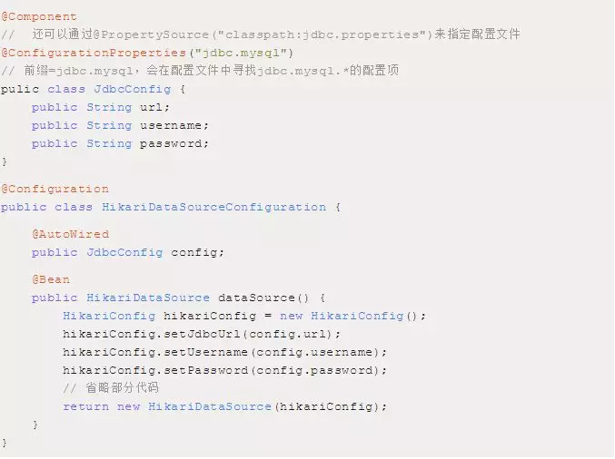

# 给你一份超详细 Spring Boot 知识清单
Spring Boot 有何魔法？**自动配置、起步依赖、Actuator、命令行界面(CLI)** 是 Spring Boot 最重要的4大核心特性，其中 `CLI` 是 Spring Boot 的可选特性，虽然它功能强大，但也引入了一套不太常规的开发模型，因而这个系列的文章仅关注其它3种特性。如文章标题，本文是这个系列的第一部分，将为你打开 Spring Boot 的大门，重点为你剖析其启动流程以及自动配置实现原理。要掌握这部分核心内容，理解一些 Spring 框架的基础知识，将会让你事半功倍。
## 一、抛砖引玉：探索 Spring IoC 容器
如果有看过 `SpringApplication.run()` 方法的源码，Spring Boot 冗长无比的启动流程一定会让你抓狂，透过现象看本质，SpringApplication 只是将一个典型的 Spring 应用的启动流程进行了扩展，因此，透彻理解 Spring 容器是打开 Spring Boot 大门的一把钥匙。
### 1.1、Spring IoC容器
可以把 Spring IoC 容器比作一间餐馆，当你来到餐馆，通常会直接招呼服务员：点菜！至于菜的原料是什么？如何用原料把菜做出来？可能你根本就不关心。IoC容器也是一样，你只需要告诉它需要某个bean，它就把对应的实例（instance）扔给你，至于这个bean是否依赖其他组件，怎样完成它的初始化，根本就不需要你关心。

作为餐馆，想要做出菜肴，得知道菜的原料和菜谱，同样地，IoC 容器想要管理各个业务对象以及它们之间的依赖关系，需要通过某种途径来记录和管理这些信息。 BeanDefinition 对象就承担了这个责任：容器中的每一个 bean 都会有一个对应的 BeanDefinition 实例，该实例负责保存bean对象的所有必要信息，包括 bean 对象的 class 类型、是否是抽象类、构造方法和参数、其它属性等等。当客户端向容器请求相应对象时，容器就会通过这些信息为客户端返回一个完整可用的 bean 实例。

原材料已经准备好（把 BeanDefinition 看着原料），开始做菜吧，等等，你还需要一份菜谱， BeanDefinitionRegistry 和 BeanFactory 就是这份菜谱，BeanDefinitionRegistry 抽象出 bean 的注册逻辑，而 BeanFactory 则抽象出了bean的管理逻辑，而各个 BeanFactory 的实现类就具体承担了 bean 的注册以及管理工作。它们之间的关系就如下图：


DefaultListableBeanFactory 作为一个比较通用的 BeanFactory 实现，它同时也实现了 BeanDefinitionRegistry 接口，因此它就承担了 Bean 的注册管理工作。从图中也可以看出，BeanFactory 接口中主要包含  `getBean`、`containBean`、`getType`、`getAliases` 等管理 bean 的方法，而 BeanDefinitionRegistry 接口则包含 `registerBeanDefinition`、`removeBeanDefinition`、`getBeanDefinition` 等注册管理 `BeanDefinition` 的方法。

下面通过一段简单的代码来模拟 BeanFactory 底层是如何工作的：
```
// 默认容器实现
DefaultListableBeanFactory beanRegistry = new DefaultListableBeanFactory();
// 根据业务对象构造相应的 BeanDefinition
AbstractBeanDefinition definition = new RootBeanDefinition(Buesiness.class, true);
// 将 Bean 注册到容器中
beanRegistry.registerBeanDefinition("beanName", definition);
// 如果有多个 Bean，还可以多个 Bean 之间的依赖关系
// ......

// 然后可以从容器中取出这个 Bean 实例
// 注意这里的 beanRegistry 实现了 BeanFactory 接口，所以可以强转
// 单纯的 BeanDefinitionRegistry 时无法强制转换到 BeanDefinitionRegistry 类型的
BeanFactory container = (BeanFactory)beanRegistry;
Buesiness buesiness= container.getBean("beanName")
```
这段代码仅为了说明 BeanFactory 底层的大致工作流程，实际情况会更加复杂，比如 bean 之间的依赖关系可能定义在外部配置文件(XML/Properties)中、也可能是注解方式。Spring IoC 容器的整个工作流程大致可以分为两个阶段：
#### 1） 容器启动阶段
容器启动时，会通过某种途径加载 ConfigurationMetaData。除了代码方式比较直接外，在大部分情况下，容器需要依赖某些工具类，比如： BeanDefinitionReader，BeanDefinitionReader 会对加载的 ConfigurationMetaData 进行解析和分析，并将分析后的信息组装为相应的 BeanDefinition，最后把这些保存了 bean 定义的 BeanDefinition，注册到相应的 BeanDefinitionRegistry，这样容器的启动工作就完成了。这个阶段主要完成一些准备性工作，更侧重于 bean 对象管理信息的收集，当然一些验证性或者辅助性的工作也在这一阶段完成。

来看一个简单的例子吧，过往，所有的 bean 都定义在XML配置文件中，下面的代码将模拟 BeanFactory 如何从配置文件中加载 bean 的定义以及依赖关系：
```
// 通常是 BeanDefinitionRegistry 的实现类，这里以 DefaultListableBeanFactory 为例
DefaultListableBeanFactory beanRegistry = new DefaultListableBeanFactory();
// XMLBeanDefinitionReader 实现了 BeanDefinitionReader 接口，用于解析 XML 文件
XMLBeanDefinitionReader beanDefinitionReader = new XMLBeanDefinitionReaderImpl(beanRegistry);
// 加载配置文件
beanDefinitionReader.loadbeanDefinitionReaders("classpath:spring-bean.xml");
// 从容器中获取 Bean 实例
BeanFactory container = (BeanFactory)beanRegistry;
Buesiness buesiness= container.getBean("beanName")
```
#### 2） Bean的实例化阶段
经过第一阶段，所有bean定义都通过 BeanDefinition 的方式注册到 BeanDefinitionRegistry 中，当某个请求通过容器的 `getBean` 方法请求某个对象，或者因为依赖关系容器需要隐式的调用`getBean` 时，就会触发第二阶段的活动：容器会首先检查所请求的对象之前是否已经实例化完成。如果没有，则会根据注册的 BeanDefinition 所提供的信息实例化被请求对象，并为其注入依赖。当该对象装配完毕后，容器会立即将其返回给请求方法使用。

BeanFactory只是Spring IoC容器的一种实现，如果没有特殊指定，它采用采用延迟初始化策略：只有当访问容器中的某个对象时，才对该对象进行初始化和依赖注入操作。而在实际场景下，我们更多的使用另外一种类型的容器： `ApplicationContext`，它构建在 `BeanFactory` 之上，属于更高级的容器，除了具有BeanFactory的所有能力之外，还提供对事件监听机制以及国际化的支持等。它管理的bean，在容器启动时全部完成初始化和依赖注入操作。
### 1.2、Spring容器扩展机制
IoC 容器负责管理容器中所有 bean 的生命周期，而在bean生命周期的不同阶段，Spring 提供了不同的扩展点来改变bean的命运。在容器的启动阶段，`BeanFactoryPostProcessor` 允许我们在容器实例化相应对象之前，对注册到容器的 BeanDefinition 所保存的信息做一些额外的操作，比如修改bean定义的某些属性或者增加其他信息等。

如果要自定义扩展类，通常需要实现 `org.springframework.beans.factory.config.BeanFactoryPostProcessor` 接口，与此同时，因为容器中可能有多个 `BeanFactoryPostProcessor`，可能还需要实现 `org.springframework.core.Ordered` 接口，以保证 `BeanFactoryPostProcessor` 按照顺序执行。Spring 提供了为数不多的 `BeanFactoryPostProcessor` 实现，我们以`PropertyPlaceholderConfigurer` 来说明其大致的工作流程。

在Spring项目的XML配置文件中，经常可以看到许多配置项的值使用占位符，而将占位符所代表的值单独配置到独立的 `properties` 文件，这样可以将散落在不同XML文件中的配置集中管理，而且也方便运维根据不同的环境进行配置不同的值。这个非常实用的功能就是由 `PropertyPlaceholderConfigurer` 负责实现的。

根据前文，当BeanFactory 在第一阶段加载完所有配置信息时，BeanFactory 中保存的对象的属性还是以占位符方式存在的，比如 `${jdbc.mysql.url}`。当 PropertyPlaceholderConfigurer 作为`BeanFactoryPostProcessor` 被应用时，它会使用 `properties` 配置文件中的值来替换相应的 `BeanDefinition` 中占位符所表示的属性值。当需要实例化 bean 时，bean 定义中的属性值就已经被替换成我们配置的值。当然其实现比上面描述的要复杂一些，这里仅说明其大致工作原理，更详细的实现可以参考其源码。

与之相似的，还有 BeanPostProcessor，其存在于对象实例化阶段。跟 BeanFactoryPostProcessor 类似，它会处理容器内所有符合条件并且已经实例化后的对象。简单的对比，BeanFactoryPostProcessor 处理 bean 的定义，而 BeanPostProcessor 则处理 bean 完成实例化后的对象。BeanPostProcessor 定义了两个接口：
```
public interface BeanPostProcessor {
    // 前置处理
    Object postProcessorBeforeInitialization(Object bean, String beanName) throws BeanException;
    // 后置处理
    Object postProcessorAfterInitialization(Object bean, String beanName) throws BeanException;
}
```
为了理解这两个方法执行的时机，简单的了解下bean的整个生命周期：


`postProcessBeforeInitialization()` 方法与 `postProcessAfterInitialization()` 分别对应图中前置处理和后置处理两个步骤将执行的方法。这两个方法中都传入了 bean 对象实例的引用，为扩展容器的对象实例化过程提供了很大便利，在这儿几乎可以对传入的实例执行任何操作。注解、AOP等功能的实现均大量使用了 `BeanPostProcessor`，比如有一个自定义注解，你完全可以实现 `BeanPostProcessor` 的接口，在其中判断 bean 对象的脑袋上是否有该注解，如果有，你可以对这个 bean 实例执行任何操作，想想是不是非常的简单？

再来看一个更常见的例子，在 Spring 中经常能够看到各种各样的 `Aware` 接口，其作用就是在对象实例化完成以后将 `Aware` 接口定义中规定的依赖注入到当前实例中。比如最常见的 `ApplicationContextAware` 接口，实现了这个接口的类都可以获取到一个 `ApplicationContext` 对象。当容器中每个对象的实例化过程走到 `BeanPostProcessor` 前置处理这一步时，容器会检测到之前注册到容器的 ApplicationContextAwareProcessor，然后就会调用其 `postProcessBeforeInitialization()` 方法，检查并设置 Aware 相关依赖。看看代码吧，是不是很简单：
```
// 代码来自：org.springframework.context.support.ApplicationContextAwareProcessor
// 其 ApplicationContextAwareProcessor 方法调用了 invokeAwareInterfaces 方法。
private invokeAwareInterfaces(Object bean) {
    if (bean instanceof EnvironmentAware) {
        ((EnvironmentWare)bean).setEnvironment(this.applicationContext.getEnvironment());
    }
    if (bean instanceof ApplicationContextAware) {
        ((ApplicationContextAware)bean).setApplicationContext(this.applicationContext);
    }
}
```

最后总结一下，本小节内容和你一起回顾了 Spring 容器的部分核心内容，限于篇幅不能写更多，但理解这部分内容，足以让您轻松理解 Spring Boot 的启动原理，如果在后续的学习过程中遇到一些晦涩难懂的知识，再回过头来看看 Spring 的核心知识，也许有意想不到的效果。也许 Spring Boot的中文资料很少，但 Spring 的中文资料和书籍有太多太多，总有东西能给你启发。
## 二、夯实基础：JavaConfig 与常见 Annotation
### 2.1、JavaConfig
我们知道 bean是Spring IOC中非常核心的概念，Spring容器负责bean的生命周期的管理。在最初，Spring使用XML配置文件的方式来描述bean的定义以及相互间的依赖关系，但随着Spring的发展，越来越多的人对这种方式表示不满，因为Spring项目的所有业务类均以bean的形式配置在XML文件中，造成了大量的XML文件，使项目变得复杂且难以管理。

后来，基于纯Java Annotation依赖注入框架 Guice出世，其性能明显优于采用XML方式的Spring，甚至有部分人认为， Guice可以完全取代Spring（ Guice仅是一个轻量级IOC框架，取代Spring还差的挺远）。正是这样的危机感，促使Spring及社区推出并持续完善了 JavaConfig子项目，它基于Java代码和Annotation注解来描述bean之间的依赖绑定关系。比如，下面是使用XML配置方式来描述bean的定义：
```
<bean id="bookService" class="cn.moondev.service.BookServiceImpl"></bean>
```
而基于JavaConfig的配置形式是这样的：
```
@Configuration
public class MoonBookCOnfiguration {
    // 任何标志了 @Bean 的地方，其返回值将作为一个 bean 注册到 Spring 的 IOC 容器中
    // 方法名默认成为该 bean 定义的 id
    @Bean
    public BookService bookService() {
        return new BookServiceImpl();
    }
}
```
如果两个bean之间有依赖关系的话，在XML配置中应该是这样：
```
<bean id="bookService" class="cn.moondev.service.BookServiceImpl">
    <property name="dependencyService" ref="dependencyService" />
</bean>
<bean id="otherService" class="cn.moondev.service.OtherServiceImpl">
    <property name="dependencyService" ref="dependencyService" />
</bean>

<bean id="dependencyService" class="DependencyServiceImpl"></bean>
```
而在 JavaConfig中则是这样：
```
@Configuration
public class MoonBookCOnfiguration {
    // 如果一个 bean 依赖另一个 bean，则直接调用对应 JavaConfig 类中依赖 bean 的构建方法即可。
    // 这里直接调用 dependencyService().
    @Bean
    public BookService bookService() {
        return new BookServiceImpl(dependencyService());
    }

    @Bean
    public OtherService otherService() {
        return new OtherServiceImpl(dependencyService());
    }

    @Bean
    public DependencyService dependencyService() {
        return new DependencyServiceImpl());
    }
}
```
你可能注意到这个示例中，有两个bean都依赖于dependencyService，也就是说当初始化bookService时会调用 dependencyService()，在初始化otherService时也会调用 dependencyService()，那么问题来了？这时候IOC容器中是有一个dependencyService实例还是两个？这个问题留着大家思考吧，这里不再赘述。
### 2.2、@ComponentScan
`@ComponentScan` 注解对应XML配置形式中的 `<context:component-scan>` 元素，表示启用组件扫描，Spring 会自动扫描所有通过注解配置的 bean，然后将其注册到 IOC 容器中。我们可以通过 `basePackages` 等属性来指定 `@ComponentScan` 自动扫描的范围，如果不指定，默认从声明 `@ComponentScan` 所在类的 package 进行扫描。正因为如此，`SpringBoot` 的启动类都默认在 `src/main/java` 下。
### 2.3、@Import
`@Import` 注解用于导入配置类，举个简单的例子：
```
@Configuration
public class MoonBookCOnfiguration {
    @Bean
    public BookService bookService() {
        return new BookServiceImpl();
    }
}
```
现在有另外一个配置类，比如： MoonUserConfiguration，这个配置类中有一个bean依赖于MoonBookConfiguration中的bookService，如何将这两个bean组合在一起？借助 @Import 即可：
```
@Configuration
@Import(MoonBookConfiguration.class)
public class MoonUserCOnfiguration {
    @Bean
    public UserService userService(BookService bookService) {
        return new UserServiceImpl(BookService bookService);
    }
}
```
需要注意的是，在 `4.2` 之前，`@Import` 注解只支持导入配置类，但是在 `4.2` 之后，它支持导入普通类，并将这个类作为一个 `bean` 的定义注册到 `IOC` 容器中。
### 2.4、@Conditional
`@Conditional` 注解表示在满足某种条件后才初始化一个 bean 或者启用某些配置。它一般用在由 `@Component`、 `@Service`、`@Configuration` 等注解标识的类上面，或者由 `@Bean` 标记的方法上。如果一个 `@Configuration` 类标记了 `@Conditional`，则该类中所有标识了 `@Bean` 的方法和 `@Import` 注解导入的相关类将遵从这些条件。

在 Spring 里可以很方便的编写你自己的条件类，所要做的就是实现 `Condition` 接口，并覆盖它的 `matches()` 方法。举个例子，下面的简单条件类表示只有在 `Classpath` 里存在 `JdbcTemplate` 类时才生效：
```
public class JdbcTemplate implements Condition {
    @Override
    public boolean matches(ConditionContext conditionContext, AnnotatedTypeMetadata annotatedTypeMetadata){
        try {
            conditionContext.getClassLoader("org.springframework.jdbc.core.JdbcTemplate").loadClass();
            return true;
        } catch (ClassNotfoundException e) {
            e.printStackTrace();
        }
        return false;
    }
}
```
当你用Java来声明bean的时候，可以使用这个自定义条件类：


这个例子中只有当 JdbcTemplateCondition类的条件成立时才会创建MyService这个bean。也就是说MyService这bean的创建条件是 classpath里面包含 JdbcTemplate，否则这个bean的声明就会被忽略掉。

SpringBoot定义了很多有趣的条件，并把他们运用到了配置类上，这些配置类构成了 SpringBoot的自动配置的基础。 SpringBoot运用条件化配置的方法是：定义多个特殊的条件化注解，并将它们用到配置类上。下面列出了 SpringBoot提供的部分条件化注解：

### 2.5、@ConfigurationProperties与@EnableConfigurationProperties
当某些属性的值需要配置的时候，我们一般会在 application.properties文件中新建配置项，然后在bean中使用 @Value注解来获取配置的值，比如下面配置数据源的代码。


使用 `@Value` 注解注入的属性通常都比较简单，如果同一个配置在多个地方使用，也存在不方便维护的问题（考虑下，如果有几十个地方在使用某个配置，而现在你想改下名字，你该怎么做？）。对于更为复杂的配置，Spring Boot 提供了更优雅的实现方式，那就是 `@ConfigurationProperties` 注解。我们可以通过下面的方式来改写上面的代码：


`@ConfigurationProperties` 对于更为复杂的配置，处理起来也是得心应手，比如有如下配置文件：


`@EnableConfigurationProperties` 注解表示对 `@ConfigurationProperties` 的内嵌支持，默认会将对应 `Properties Class` 作为 bean 注入的 `IOC` 容器中，即在相应的 `Properties` 类上不用加 `@Component` 注解。[《Spring Boot 配置加载顺序详解》](http://mp.weixin.qq.com/s?__biz=MzI3ODcxMzQzMw==&mid=2247486895&idx=2&sn=1d49a0de72f9dee2c434ae905d5bc2e4&chksm=eb538899dc24018ffb0e618abfe7e2223da20e5b8a2d5be36267769779a82701699cd5476748&scene=21#wechat_redirect)了解一下。
## 三、削铁如泥：SpringFactoriesLoader详解
JVM提供了3种类加载器：` BootstrapClassLoader`、`ExtClassLoader`、`AppClassLoader` 分别加载 Java 核心类库、扩展类库以及应用的类路径(`CLASSPATH`)下的类库。JVM 通过双亲委派模型进行类的加载，我们也可以通过继承 `java.lang.classloader` 实现自己的类加载器。

何为双亲委派模型？当一个类加载器收到类加载任务时，会先交给自己的父加载器去完成，因此最终加载任务都会传递到最顶层的 `BootstrapClassLoader`，只有当父加载器无法完成加载任务时，才会尝试自己来加载。

采用双亲委派模型的一个好处是保证使用不同类加载器最终得到的都是同一个对象，这样就可以保证Java 核心库的类型安全，比如，加载位于 `rt.jar` 包中的 `java.lang.Object` 类，不管是哪个加载器加载这个类，最终都是委托给顶层的`BootstrapClassLoader` 来加载的，这样就可以保证任何的类加载器最终得到的都是同样一个 Object 对象。查看 ClassLoader 的源码，对双亲委派模型会有更直观的认识：


但双亲委派模型并不能解决所有的类加载器问题，比如，Java 提供了很多服务提供者接口( ServiceProviderInterface，SPI)，允许第三方为这些接口提供实现。常见的 SPI 有 `JDBC`、`JNDI`、`JAXP` 等，这些SPI的接口由核心类库提供，却由第三方实现，这样就存在一个问题：SPI 的接口是 Java 核心库的一部分，是由 `BootstrapClassLoader` 加载的；SPI 实现的 Java 类一般是由 `AppClassLoader` 来加载的。`BootstrapClassLoader` 是无法找到 SPI 的实现类的，因为它只加载 Java 的核心库。它也不能代理给 `AppClassLoader`，因为它是最顶层的类加载器。也就是说，双亲委派模型并不能解决这个问题。

线程上下文类加载器( ContextClassLoader)正好解决了这个问题。从名称上看，可能会误解为它是一种新的类加载器，实际上，它仅仅是 `Thread` 类的一个变量而已，可以通过 `setContextClassLoader(ClassLoadercl)` 和 `getContextClassLoader()` 来设置和获取该对象。如果不做任何的设置，Java应用的线程的上下文类加载器默认就是AppClassLoader。在核心类库使用SPI接口时，传递的类加载器使用线程上下文类加载器，就可以成功的加载到SPI实现的类。线程上下文类加载器在很多SPI的实现中都会用到。但在JDBC中，你可能会看到一种更直接的实现方式，比如，JDBC驱动管理 `java.sql.Driver` 中的 `loadInitialDrivers()` 方法中，你可以直接看到JDK是如何加载驱动的：
```
for (String aDriver: driverList) {
    try {
        // 直接使用 AppClassLoader
        Class.forName(aDriver, true, ClassLoader.getSystemClassLoader());
    } catch (Exception ex) {
        // 
    }
}
```
其实讲解线程上下文类加载器，最主要是让大家在看到 `Thread.currentThread().getClassLoader()` 和 `Thread.currentThread().getContextClassLoader()` 时不会一脸懵逼，这两者除了在许多底层框架中取得的 ClassLoader 可能会有所不同外，其他大多数业务场景下都是一样的，大家只要知道它是为了解决什么问题而存在的即可。

类加载器除了加载class外，还有一个非常重要功能，就是加载资源，它可以从jar包中读取任何资源文件，比如，`ClassLoader.getResources(Stringname)` 方法就是用于读取jar包中的资源文件，其代码如下：


是不是觉得有点眼熟，不错，它的逻辑其实跟类加载的逻辑是一样的，首先判断父类加载器是否为空，不为空则委托父类加载器执行资源查找任务，直到BootstrapClassLoader，最后才轮到自己查找。而不同的类加载器负责扫描不同路径下的jar包，就如同加载class一样，最后会扫描所有的jar包，找到符合条件的资源文件。

类加载器的 findResources(name)方法会遍历其负责加载的所有jar包，找到jar包中名称为name的资源文件，这里的资源可以是任何文件，甚至是.class文件，比如下面的示例，用于查找Array.class文件：


运行后可以得到如下结果：
```
$JAVA_HOME/jre/lib/rt.jar!/java/sql/Array.class
```
根据资源文件的URL，可以构造相应的文件来读取资源内容。

看到这里，你可能会感到挺奇怪的，你不是要详解 SpringFactoriesLoader吗？上来讲了一堆ClassLoader是几个意思？看下它的源码你就知道了：


有了前面关于ClassLoader的知识，再来理解这段代码，是不是感觉豁然开朗：从 CLASSPATH下的每个Jar包中搜寻所有 META-INF/spring.factories配置文件，然后将解析properties文件，找到指定名称的配置后返回。需要注意的是，其实这里不仅仅是会去ClassPath路径下查找，会扫描所有路径下的Jar包，只不过这个文件只会在Classpath下的jar包中。来简单看下 spring.factories文件的内容吧：


执行 `loadFactoryNames(EnableAutoConfiguration.class, classLoader)`后，得到对应的一组 `@Configuration` 类，我们就可以通过反射实例化这些类然后注入到IOC容器中，最后容器里就有了一系列标注了 `@Configuration的JavaConfig` 形式的配置类。

这就是 SpringFactoriesLoader，它本质上属于Spring框架私有的一种扩展方案，类似于SPI，Spring Boot 在 Spring 基础上的很多核心功能都是基于此，希望大家可以理解。
## 四、另一件武器：Spring容器的事件监听机制
过去，事件监听机制多用于图形界面编程，比如：点击按钮、在文本框输入内容等操作被称为事件，而当事件触发时，应用程序作出一定的响应则表示应用监听了这个事件，而在服务器端，事件的监听机制更多的用于异步通知以及监控和异常处理。Java提供了实现事件监听机制的两个基础类：自定义事件类型扩展自 `java.util.EventObject`、事件的监听器扩展自 `java.util.EventListener`。来看一个简单的实例：简单的监控一个方法的耗时。

首先定义事件类型，通常的做法是扩展EventObject，随着事件的发生，相应的状态通常都封装在此类中：


事件发布之后，相应的监听器即可对该类型的事件进行处理，我们可以在方法开始执行之前发布一个begin事件，在方法执行结束之后发布一个end事件，相应地，事件监听器需要提供方法对这两种情况下接收到的事件进行处理：


事件监听器接口针对不同的事件发布实际提供相应的处理方法定义，最重要的是，其方法只接收MethodMonitorEvent参数，说明这个监听器类只负责监听器对应的事件并进行处理。有了事件和监听器，剩下的就是发布事件，然后让相应的监听器监听并处理。通常情况，我们会有一个事件发布者，它本身作为事件源，在合适的时机，将相应的事件发布给对应的事件监听器：


对于事件发布者（事件源）通常需要关注两点：
1. 在合适的时机发布事件。此例中的methodMonitor()方法是事件发布的源头，其在方法执行之前和结束之后两个时间点发布MethodMonitorEvent事件，每个时间点发布的事件都会传给相应的监听器进行处理。在具体实现时需要注意的是，事件发布是顺序执行，为了不影响处理性能，事件监听器的处理逻辑应尽量简单。
2. 事件监听器的管理。publisher类中提供了事件监听器的注册与移除方法，这样客户端可以根据实际情况决定是否需要注册新的监听器或者移除某个监听器。如果这里没有提供remove方法，那么注册的监听器示例将一直被MethodMonitorEventPublisher引用，即使已经废弃不用了，也依然在发布者的监听器列表中，这会导致隐性的内存泄漏。
### Spring容器内的事件监听机制
Spring的ApplicationContext容器内部中的所有事件类型均继承自 org.springframework.context.AppliationEvent，容器中的所有监听器都实现 org.springframework.context.ApplicationListener接口，并且以bean的形式注册在容器中。一旦在容器内发布ApplicationEvent及其子类型的事件，注册到容器的ApplicationListener就会对这些事件进行处理。

你应该已经猜到是怎么回事了。

ApplicationEvent继承自EventObject，Spring提供了一些默认的实现，比如： ContextClosedEvent表示容器在即将关闭时发布的事件类型， ContextRefreshedEvent表示容器在初始化或者刷新的时候发布的事件类型......

容器内部使用ApplicationListener作为事件监听器接口定义，它继承自EventListener。ApplicationContext容器在启动时，会自动识别并加载EventListener类型的bean，一旦容器内有事件发布，将通知这些注册到容器的EventListener。

`ApplicationContext` 接口继承了 `ApplicationEventPublisher` 接口，该接口提供了 `void publishEvent(ApplicationEventevent)` 方法定义，不难看出，`ApplicationContext` 容器担当的就是事件发布者的角色。如果有兴趣可以查看 AbstractApplicationContext.publishEvent(ApplicationEventevent)方法的源码：`ApplicationContext` 将事件的发布以及监听器的管理工作委托给 `ApplicationEventMulticaster` 接口的实现类。在容器启动时，会检查容器内是否存在名为 `applicationEventMulticaster` 的 `ApplicationEventMulticaster` 对象实例。如果有就使用其提供的实现，没有就默认初始化一个`SimpleApplicationEventMulticaster` 作为实现。

最后，如果我们业务需要在容器内部发布事件，只需要为其注入`ApplicationEventPublisher` 依赖即可：实现 `ApplicationEventPublisherAware` 接口或者 `ApplicationContextAware` 接口(Aware接口相关内容请回顾上文)。
## 五、出神入化：揭秘自动配置原理
典型的 Spring Boot 应用的启动类一般均位于 `src/main/java` 根路径下，比如 `MoonApplication` 类：
```
@SpringBootApplication
public class MoonApplication {

    public static void main(String[] args) {
        SpringApplication.run(MoonApplication.class, args);
    }
}
```
其中 `@SpringBootApplication` 开启组件扫描和自动配置，而 `SpringApplication.run` 则负责启动引导应用程序。 `@SpringBootApplication` 是一个复合 Annotation，它将三个有用的注解组合在一起：
```
@Target(ElementType.TYPE)
@Retention(RetentionPolicy.RUNTIME)
@Documented
@Inherited
@SpringBootConfiguration
@EnableAutoConfiguration
@ComponentScan(excludeFilters = { @Filter(type = FilterType.CUSTOM, classes = TypeExcludeFilter.class),
		@Filter(type = FilterType.CUSTOM, classes = AutoConfigurationExcludeFilter.class) })
public @interface SpringBootApplication {
    ...
}
```
@SpringBootConfiguration 就是 @Configuration，它是 Spring 框架的注解，标明该类是一个 JavaConfig 配置类。而 @ComponentScan 启用组件扫描，前文已经详细讲解过，这里着重关注 @EnableAutoConfiguration。

@EnableAutoConfiguration 注解表示开启Spring Boot自动配置功能，Spring Boot会根据应用的依赖、自定义的bean、classpath下有没有某个类 等等因素来猜测你需要的bean，然后注册到IOC容器中。那 @EnableAutoConfiguration是如何推算出你的需求？首先看下它的定义：
```
@Target(ElementType.TYPE)
@Retention(RetentionPolicy.RUNTIME)
@Documented
@Inherited
@AutoConfigurationPackage
@Import(AutoConfigurationImportSelector.class)
public @interface EnableAutoConfiguration {
    // ......
}
```
你的关注点应该在 @Import(EnableAutoConfigurationImportSelector.class)上了，前文说过， @Import注解用于导入类，并将这个类作为一个bean的定义注册到容器中，这里它将把 EnableAutoConfigurationImportSelector作为bean注入到容器中，而这个类会将所有符合条件的@Configuration配置都加载到容器中，看看它的代码：
```
@Override
public String[] selectImports(AnnotationMetadata annotationMetadata) {
    if (!isEnabled(annotationMetadata)) {
        return NO_IMPORTS;
    }
    AutoConfigurationEntry autoConfigurationEntry = getAutoConfigurationEntry(annotationMetadata);
    return StringUtils.toStringArray(autoConfigurationEntry.getConfigurations());
}
```
这个类会扫描所有的jar包，将所有符合条件的@Configuration配置类注入的容器中，何为符合条件，看看 META-INF/spring.factories的文件内容：


以 DataSourceAutoConfiguration 为例，看看Spring Boot是如何自动配置的：
```
@Configuration
@ConditionalOnClass ({DataSource.class, EmbeddedDatabaseType.class})
@EnableConfigurationProperties ({DataSourceProperties.class})
@Import ({Registra.class, DataSourcePoolMetadataProvidersConfiguration.class})
public class DataSourceAutoConfiguration {

}
```
分别说一说：
- @ConditionalOnClass({DataSource.class,EmbeddedDatabaseType.class})：当 Classpath 中存在 DataSource或者 EmbeddedDatabaseType 类时才启用这个配置，否则这个配置将被忽略。
- @EnableConfigurationProperties(DataSourceProperties.class)：将DataSource的默认配置类注入到IOC容器中，DataSourceProperties 定义为：
  
- @Import({ Registrar.class, DataSourcePoolMetadataProvidersConfiguration.class })：导入其他额外的配置，就以 DataSourcePoolMetadataProvidersConfiguration 为例吧：
  ```
  @Configuration
  public class DataSourcePoolMetadataProvidersConfiguration {
      @Configuration 
      @ConditionalClass (org.apache.tomcat.jdbc.pool.DataSource.class)
      static class TomcatDataSourcePoolMetadataProviderConfiguration {
          @Bean
          public DataSourcePoolMetadataProvider tomcattDataSourcePoolMetadataProvider() {
              ...
          }
      }
  }
  ```
DataSourcePoolMetadataProvidersConfiguration是数据库连接池提供者的一个配置类，即Classpath中存在 org.apache.tomcat.jdbc.pool.DataSource.class，则使用tomcat-jdbc连接池，如果Classpath中存在 HikariDataSource.class则使用Hikari连接池。

这里仅描述了DataSourceAutoConfiguration的冰山一角，但足以说明Spring Boot如何利用条件话配置来实现自动配置的。回顾一下， @EnableAutoConfiguration中导入了EnableAutoConfigurationImportSelector类，而这个类的 selectImports()通过SpringFactoriesLoader得到了大量的配置类，而每一个配置类则根据条件化配置来做出决策，以实现自动配置。

整个流程很清晰，但漏了一个大问题：
EnableAutoConfigurationImportSelector.selectImports()是何时执行的？其实这个方法会在容器启动过程中执行： AbstractApplicationContext.refresh()，更多的细节在下一小节中说明。
## 六、启动引导：Spring Boot应用启动的秘密
### 6.1 SpringApplication初始化
SpringBoot整个启动流程分为两个步骤：初始化一个 SpringApplication 对象、执行该对象的 run 方法。看下SpringApplication的初始化流程，SpringApplication的构造方法中调用 initialize(Object[] sources)方法，其代码如下：
```
private void initialzie(Object[] sources) {
    if (sources != null && sources.length > 0) {
        this.sources.addAll(arrays.asList(sources));
    }
    // 判断是否 Web 项目
    this.webEnvironment = deduceWebEnvironment();
    setInitializers((Collection)getSpringFactoryInstances(ApplicationContextInitializer.class));
    setListeners((Collection)getSpringFactoryInstances(ApplicationListener.class));
    // 找到入口类
    this.mainApplicationClass = deduceMainApplicationClass();
}
```
初始化流程中最重要的就是通过SpringFactoriesLoader找到 spring.factories文件中配置的 ApplicationContextInitializer和 ApplicationListener两个接口的实现类名称，以便后期构造相应的实例。 ApplicationContextInitializer的主要目的是在 ConfigurableApplicationContext做refresh之前，对ConfigurableApplicationContext实例做进一步的设置或处理。ConfigurableApplicationContext继承自ApplicationContext，其主要提供了对ApplicationContext进行设置的能力。

实现一个ApplicationContextInitializer非常简单，因为它只有一个方法，但大多数情况下我们没有必要自定义一个ApplicationContextInitializer，即便是Spring Boot框架，它默认也只是注册了两个实现，毕竟Spring的容器已经非常成熟和稳定，你没有必要来改变它。

而 ApplicationListener的目的就没什么好说的了，它是Spring框架对Java事件监听机制的一种框架实现，具体内容在前文Spring事件监听机制这个小节有详细讲解。这里主要说说，如果你想为Spring Boot应用添加监听器，该如何实现？

Spring Boot提供两种方式来添加自定义监听器：
- 通过 SpringApplication.addListeners(ApplicationListener<?>...listeners)或者 SpringApplication.setListeners(Collection<?extendsApplicationListener<?>>listeners)两个方法来添加一个或者多个自定义监听器
- 既然SpringApplication的初始化流程中已经从 spring.factories中获取到 ApplicationListener的实现类，那么我们直接在自己的jar包的 META-INF/spring.factories文件中新增配置即可：
  ```
  org.springframework.context.ApplicationListener=
  cn.moondev.listeners.xxxxListener
  ```
关于SpringApplication的初始化，我们就说这么多。
### 6.2 Spring Boot启动流程
Spring Boot应用的整个启动流程都封装在SpringApplication.run方法中，其整个流程真的是太长太长了，但本质上就是在Spring容器启动的基础上做了大量的扩展，按照这个思路来看看源码：
```
public static ConfigurableApplicationContext run(String... args) {
    StopWatch stopWatch = new StopWatch();
    stopWatch.start();

    ConfigurableApplicationContext context = null;
    FailureAnalyzers analyzers = null;
    ConfigureHeadlessProperty();

    // 1)
    SprintApplicationRunListeners listeners = getRunListeners(args);
    listeners.starting();
    try {
        // 2)
        ApplicationArguments applicationArguments = new DefaultApplicationArguments(args);
        ConfigurableEnvironment environment = prepareEnvironment(ApplicationArguments, applicationArguments);

        // 3)
        Banner printBanner = printbanner(environment);
        // 4)
        context = createApplicationContext();
        // 5)
        analyzers = new FailureAnalyzers(context);
        // 6) 
        prepareContext(context, environment, listeners, applicationArguments, printBanner);
        // 7)
        refreshContext(context);
        // 8)
        afterRefreshContext(context, applicationArguments);
        // 9)
        listeners.finished(context, null);
        stopWatch.stop();
        return context;
    }
    catch (Throwable ex) {
        handleRunFailure(context, listeners, analyzers, ex);
        throw new IllegalStateException(ex);
    }
}
```
1. 通过SpringFactoriesLoader查找并加载所有的 SpringApplicationRunListeners，通过调用starting()方法通知所有的SpringApplicationRunListeners：应用开始启动了。SpringApplicationRunListeners其本质上就是一个事件发布者，它在SpringBoot应用启动的不同时间点发布不同应用事件类型(ApplicationEvent)，如果有哪些事件监听者(ApplicationListener)对这些事件感兴趣，则可以接收并且处理。还记得初始化流程中，SpringApplication加载了一系列ApplicationListener吗？这个启动流程中没有发现有发布事件的代码，其实都已经在SpringApplicationRunListeners这儿实现了。
   
   简单的分析一下其实现流程，首先看下SpringApplicationRunListener的源码：
   

   SpringApplicationRunListener只有一个实现类： EventPublishingRunListener。①处的代码只会获取到一个EventPublishingRunListener的实例，我们来看看starting()方法的内容：
   ```
   public void starting() {
       // 发布一个 ApplicationStartedEvent
       this.initialMulticaster.multicastEvent(new ApplicationStartedEvent(this.application, this.args))
   }
   ```
   顺着这个逻辑，你可以在② 2. 处的 prepareEnvironment()方法的源码中找到 listeners.environmentPrepared(environment);即SpringApplicationRunListener接口的第二个方法，那不出你所料， environmentPrepared()又发布了另外一个事件 ApplicationEnvironmentPreparedEvent。接下来会发生什么，就不用我多说了吧。
2. 创建并配置当前应用将要使用的 Environment，Environment用于描述应用程序当前的运行环境，其抽象了两个方面的内容：配置文件(profile)和属性(properties)，开发经验丰富的同学对这两个东西一定不会陌生：不同的环境(eg：生产环境、预发布环境)可以使用不同的配置文件，而属性则可以从配置文件、环境变量、命令行参数等来源获取。因此，当Environment准备好后，在整个应用的任何时候，都可以从Environment中获取资源。
   总结起来，2. 处的两句代码，主要完成以下几件事：
   + 判断Environment是否存在，不存在就创建（如果是web项目就创建 StandardServletEnvironment，否则创建 StandardEnvironment）
   + 配置Environment：配置profile以及properties
   + 调用SpringApplicationRunListener的 environmentPrepared()方法，通知事件监听者：应用的Environment已经准备好
3. SpringBoot应用在启动时会输出这样的东西：
   

   如果想把这个东西改成自己的涂鸦，你可以研究以下Banner的实现，这个任务就留给你们吧。
4. 根据是否是web项目，来创建不同的ApplicationContext容器。
5. 创建一系列 FailureAnalyzer，创建流程依然是通过SpringFactoriesLoader获取到所有实现FailureAnalyzer接口的class，然后在创建对应的实例。FailureAnalyzer用于分析故障并提供相关诊断信息。
6. 初始化ApplicationContext，主要完成以下工作：
   + 将准备好的Environment设置给ApplicationContext
   + 遍历调用所有的ApplicationContextInitializer的 initialize()方法来对已经创建好的ApplicationContext进行进一步的处理
   + 调用SpringApplicationRunListener的 contextPrepared()方法，通知所有的监听者：ApplicationContext已经准备完毕
   + 将所有的bean加载到容器中
   + 调用SpringApplicationRunListener的 contextLoaded()方法，通知所有的监听者：ApplicationContext已经装载完毕
7. 调用ApplicationContext的 refresh()方法，完成IoC容器可用的最后一道工序。从名字上理解为刷新容器，那何为刷新？就是插手容器的启动，联系一下第一小节的内容。那如何刷新呢？且看下面代码：
   ```
   // 摘自 refresh()中一行代码
   invokeBeanFactoryPostProcessors(beanFactory);
   ```
   看看这个方法的实现：
   ```
   protected void invokeBeanFactoryPostProcessors(ConfigurableListableBeanFactory beanFactory) {
       PostProcessorRegistrationDelegate.invokeBeanFactoryPostProcessors(beanFactory, getBeanFactoryPostProcessors());
   }
   ```
   获取到所有的 BeanFactoryPostProcessor来对容器做一些额外的操作。BeanFactoryPostProcessor允许我们在容器实例化相应对象之前，对注册到容器的BeanDefinition所保存的信息做一些额外的操作。这里的getBeanFactoryPostProcessors()方法可以获取到3个Processor：
   

   不是有那么多BeanFactoryPostProcessor的实现类，为什么这儿只有这3个？因为在初始化流程获取到的各种ApplicationContextInitializer和ApplicationListener中，只有上文3个做了类似于如下操作：
   ```
   public void initialize(ConfigurableApplicationContext context) {
      context.addBeanFactoryPostProcessors(new ConfigurationWarningsPostProcessors(getCheckes()));
   }
   ```
   然后你就可以进入到 PostProcessorRegistrationDelegate.invokeBeanFactoryPostProcessors()方法了，这个方法除了会遍历上面的3个BeanFactoryPostProcessor处理外，还会获取类型为 BeanDefinitionRegistryPostProcessor的bean： org.springframework.context.annotation.internalConfigurationAnnotationProcessor，对应的Class为 ConfigurationClassPostProcessor。 ConfigurationClassPostProcessor用于解析处理各种注解，包括：@Configuration、@ComponentScan、@Import、@PropertySource、@ImportResource、@Bean。当处理 @import注解的时候，就会调用<自动配置>这一小节中的 EnableAutoConfigurationImportSelector.selectImports()来完成自动配置功能。其他的这里不再多讲，如果你有兴趣，可以查阅参考资料6。
8. 查找当前context中是否注册有CommandLineRunner和ApplicationRunner，如果有则遍历执行它们。
9. 执行所有SpringApplicationRunListener的finished()方法。

这就是Spring Boot的整个启动流程，其核心就是在Spring容器初始化并启动的基础上加入各种扩展点，这些扩展点包括：ApplicationContextInitializer、ApplicationListener以及各种BeanFactoryPostProcessor等等。你对整个流程的细节不必太过关注，甚至没弄明白也没有关系，你只要理解这些扩展点是在何时如何工作的，能让它们为你所用即可。

整个启动流程确实非常复杂，可以查询参考资料中的部分章节和内容，对照着源码，多看看，我想最终你都能弄清楚的。言而总之，Spring才是核心，理解清楚Spring容器的启动流程，那Spring Boot启动流程就不在话下了。

## Reference
- [给你一份超详细 Spring Boot 知识清单](https://mp.weixin.qq.com/s/1yxsCD3IxopIWYceA54Ayw)
- [Spring Boot 教程](https://github.com/javastacks/spring-boot-best-practice)