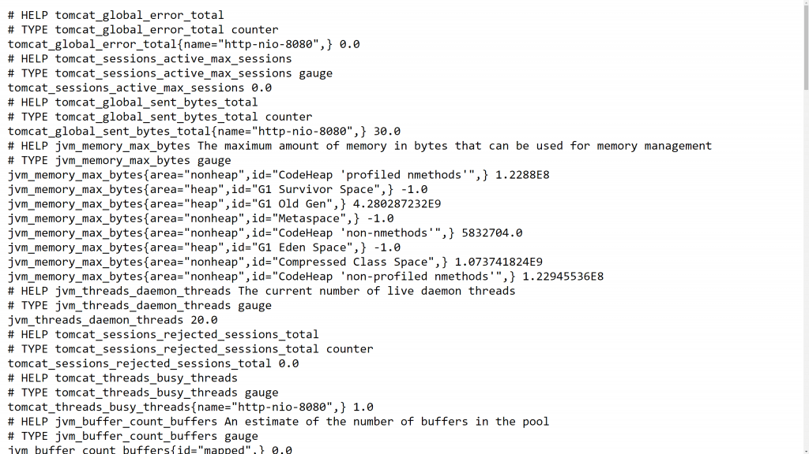
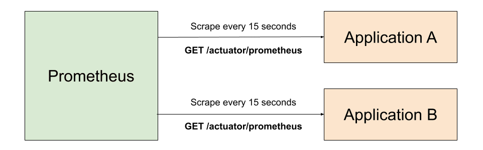
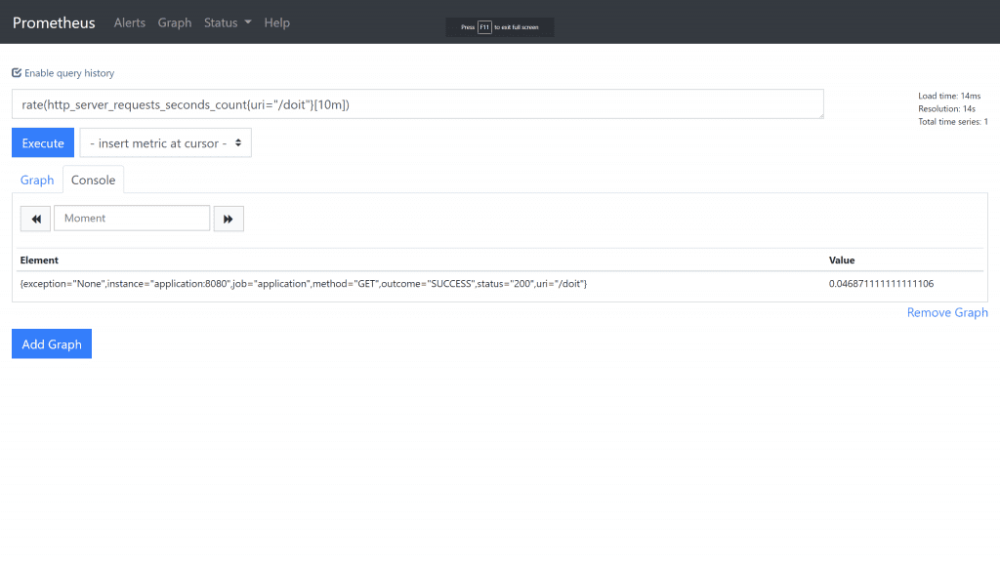
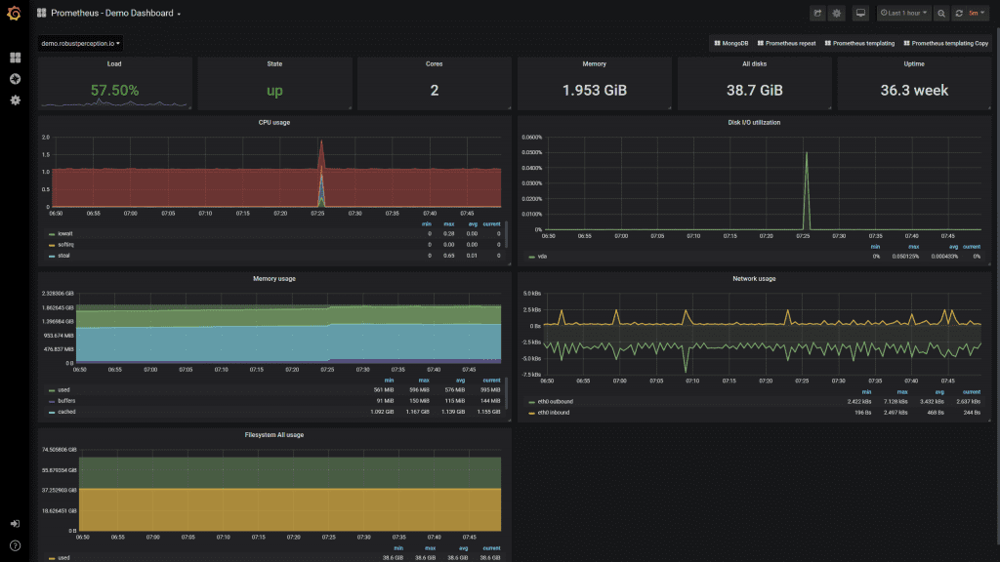

# 监控一个Spring Boot应用
## 1. 基础
### 1.1 需求
在我们趟进任何特定技术细节之前，理解我们期望从一个监控系统得到什么事非常重要的。对我来说，监控是一切能让我知晓什么时候我的应用出了问题，能给我足够星系了解系统运行状态的东西。它应该包括：
- 从应用内部暴露重要指标
- 随时间汇集指标
- 提供某种方式配置针对指标的规则
- 当规则被打破时通过配置渠道发送警告
- 提供可视化和图形化指标的能力

日志方案不在本文讨论范围里。

让我们来看看上面的每一个需求并添加一些细节。在本系列的下一篇文章中，我们将详细讨论每一个，告诉你如何实现它。
### 1.2 从一个Spring Boot 应用到出指标
清楚地讲，但我谈论指标时我是指从应用内部一个值的度量。下面是一些例子：
- 当前内存使用
- HTTP请求数
- HTTP请求处理时长（延迟）
- 使用线程数

这些都是系要知道的有用指标，而且幸运的是Spring Boot 2.0 已经通过某些简单配置就免费暴露了它们：
- 添加 [micrometer-registry-prometheus](https://mvnrepository.com/artifact/io.micrometer/micrometer-registry-prometheus) 依赖到你的项目
- 添加 [spring-boot-starter-actuator](https://mvnrepository.com/artifact/org.springframework.boot/spring-boot-starter-actuator) 依赖到你的项目
- 添加`management.endpoints.web.exposure.include=prometheus`到你的`application.properties`。

一旦这些已经被添加，你可以导航到 `/actuator/prometheus`，从而能看到默认情况下你的Spring Boot应用可以导出的所有指标。

如果你不想自己设置这些，你可以使用我自己制作的[Docker镜像](https://cloud.docker.com/u/tkgregory/repository/docker/tkgregory/sample-metrics-application)，它在Docker Hub上可得：
```
docker run -p 8080:8080 tkgregory/sample-metrics-application:latest
```
然后你可以代开链接 `http://localhost:8080/actuator/prometheus`，从而看到这些指标：


你看到的指标都是键值对，仅仅是简单的指标名字和值。它们代表指标的当前值。为了随时间汇集指标，从而是我们看到趋势，我们需要一个不同的工具。
### 1.3 随时间汇集指标
现在我们已经有应用暴露出来的指标，我们需要一种方式去拉取它们，并保留其历史，为了这些：
- 我们可以看到历史数据
- 我们可以看到随时间的数据从而得到一些测量如速率
- 我们可以以更容易的方式看到数据

幸运的是已经有这样的工具，[Prometheus](https://prometheus.io/)，下图是该服务如何工作的一个高度概括的架构图：


你能看到，它不间断地从配置的应用哪里拉取数据。如此，它就包含了我们配置的时间放微里所有应用的历史数据。

我们可以查询Prometheus， 搜索书籍并将它们以一种适合我们需求的方式返回。不仅如此，别的应用也可查询Prometheus。例如，图形应用可能想查询随时间的请求数，并以一种可视化的方式展示：

### 1.4 对指标配置规则
持续不断地监控指标以应对应用问题是没有意义的，如此有神恶魔乐趣可言呢？

作为替代，可以在指标上制定规则，如果被打破，就把问题向我们告警。这里是一些示例：
- 内存使用率超过`95%`
- 所有请求中返回`404`数超过`10%`
- 平均回复返回时长超过`500 ms`

Prometheus 给了我们一种很容易的方式来配置规则，当其被打破时可通过另一个工具[AlertManager](https://prometheus.io/docs/alerting/alertmanager/)告警。
### 1.5 通过配置通道发送警报
当一个规则被打破时，它需要某种方式通知到合适的人。这有点微妙，并非所有的警告是一个“在半夜叫醒我”的那种，并且并非所有警告应该发送至同一人。

幸运地，AlertManager 允许你配置你如何期望警告精确地“浮现”。当一条规则在Prometheus 中被配置时，你可以配置它为一个标签，该标签可被AlertManager 用于决定它应该被精确地送往何处。例如，你可能有一个标签`application`，它用于决定警告应该被送往那个团队。

默认地，AlertManager 可以发送警告到不同地渠道，例如email, Slack, 和 webhooks。
### 1.6 可视化和图形化能力
当你半夜收到一个警告，需要一个简单的方式来快速理解应用发生了什么。某些种类的预配置仪表盘，能够让我们以可视化的方式看到某些重要指标，讲师非常理想的。毕竟，可视化的数据是让我们理解情况并制定下一步计划最快速（有效）的。

[Grafana](https://grafana.com/)就是这样的一个工具，他可以与Prometheus直接集成。并允许我们为我们的应用构建有用的仪表板。这些会自动刷新，并提供了某一段时间缩放值最小的能力。

而且，一旦你构建了一个仪表板，你可以为其它的应用复用它。因此，如果你有一套相似的Spring Boot应用，只要他们暴露相似的指标，你就可以复用仪表板。


### 1.7 结论
用用监控绝对非常重要，应该在应用开发过程中就被考虑到而非之后。当前可用的工具如Spring Boot, Prometheus, AlertManager, 何 Grafana，使得我们为我们的应用创建一个监控方案相当直截了当。
### 1.8 资源
如果你倾向于射频格式学习，从[Tom Gregory Tech](https://www.youtube.com/channel/UCxOVEOhPNXcJuyfVLhm_BfQ) YouTube频道看看本文的伴生视频。
## 2. Prometheus

## Reference
- [Monitoring A Spring Boot Application, Part 1: Fundamentals](https://tomgregory.com/monitoring-a-spring-boot-application-part-1-fundamentals/)
- [Monitoring A Spring Boot Application, Part 2: Prometheus](https://tomgregory.com/monitoring-a-spring-boot-application-part-2-prometheus/)
- [Spring Boot default metrics](https://tomgregory.com/spring-boot-default-metrics/)
- [Spring Metrics](https://docs.spring.io/spring-metrics/docs/current/public/prometheus)