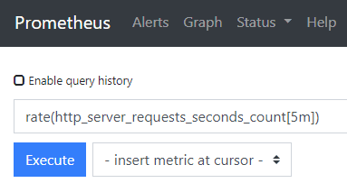
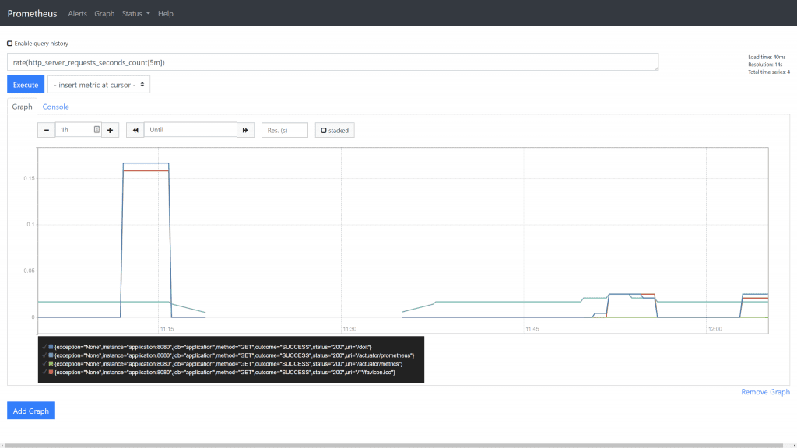
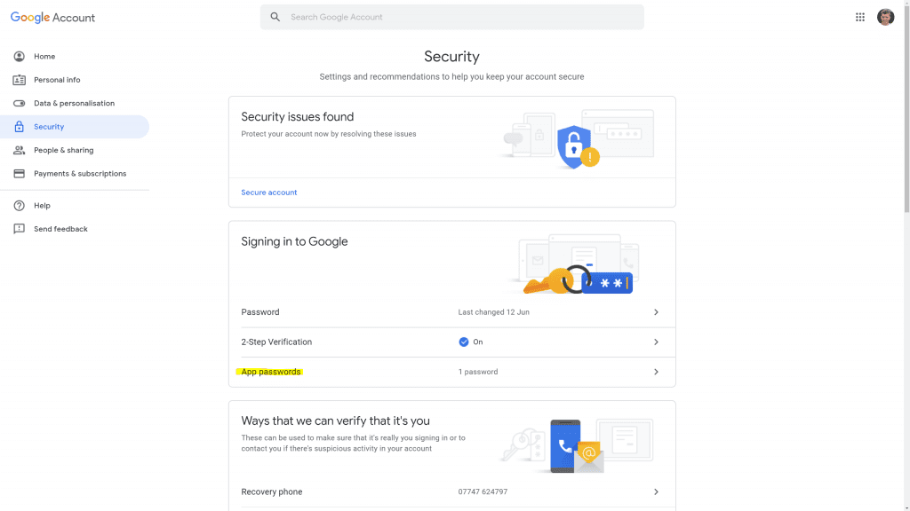
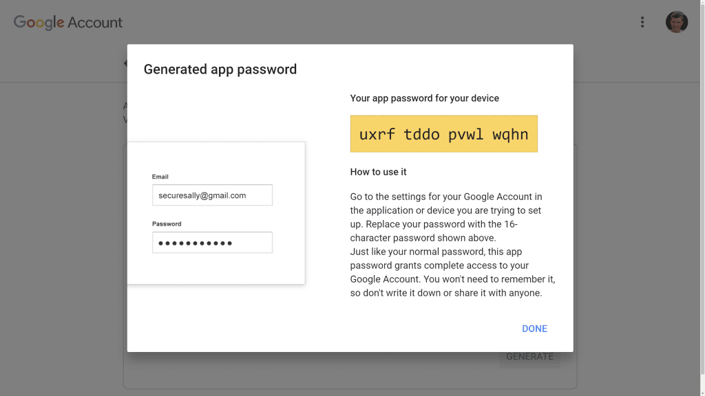
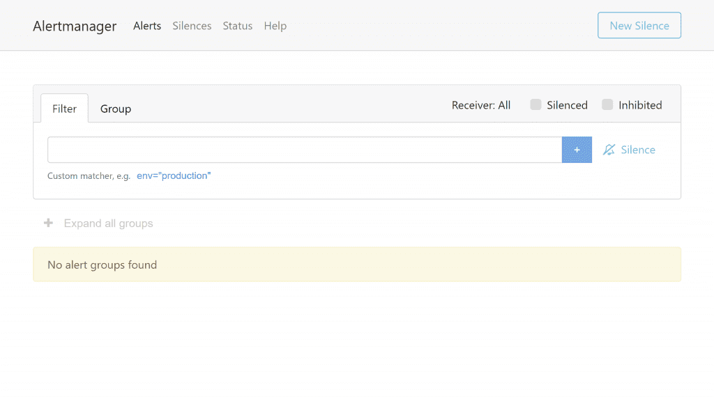
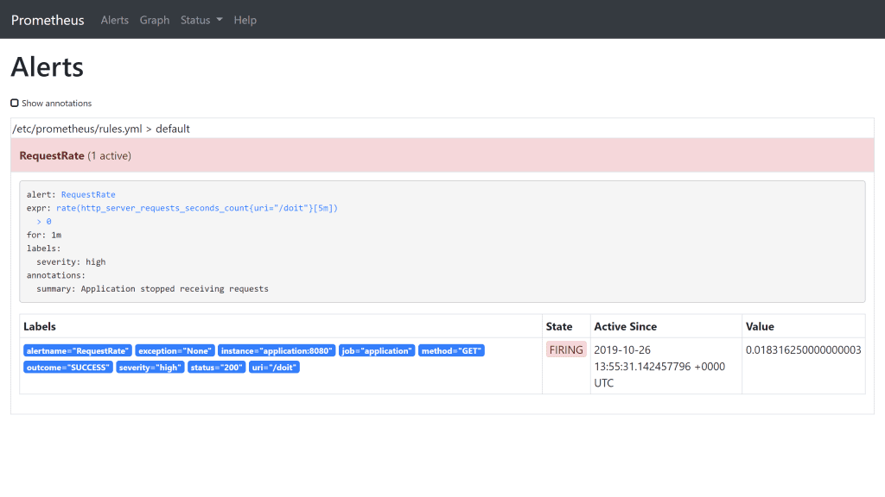
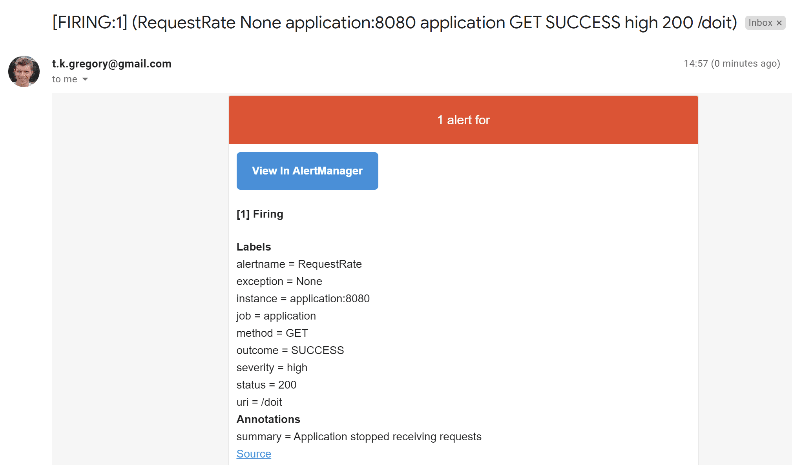

# 监控一个Spring Boot应用
## 1. 基础
### 1.1 需求
在我们趟进任何特定技术细节之前，理解我们期望从一个监控系统得到什么事非常重要的。对我来说，监控是一切能让我知晓什么时候我的应用出了问题，能给我足够星系了解系统运行状态的东西。它应该包括：
- 从应用内部暴露重要指标
- 随时间汇集指标
- 提供某种方式配置针对指标的规则
- 当规则被打破时通过配置渠道发送警告
- 提供可视化和图形化指标的能力

日志方案不在本文讨论范围里。

让我们来看看上面的每一个需求并添加一些细节。在本系列的下一篇文章中，我们将详细讨论每一个，告诉你如何实现它。
### 1.2 从一个Spring Boot 应用到出指标
清楚地讲，但我谈论指标时我是指从应用内部一个值的度量。下面是一些例子：
- 当前内存使用
- HTTP请求数
- HTTP请求处理时长（延迟）
- 使用线程数

这些都是系要知道的有用指标，而且幸运的是Spring Boot 2.0 已经通过某些简单配置就免费暴露了它们：
- 添加 [micrometer-registry-prometheus](https://mvnrepository.com/artifact/io.micrometer/micrometer-registry-prometheus) 依赖到你的项目
- 添加 [spring-boot-starter-actuator](https://mvnrepository.com/artifact/org.springframework.boot/spring-boot-starter-actuator) 依赖到你的项目
- 添加`management.endpoints.web.exposure.include=prometheus`到你的`application.properties`。

一旦这些已经被添加，你可以导航到 `/actuator/prometheus`，从而能看到默认情况下你的Spring Boot应用可以导出的所有指标。

如果你不想自己设置这些，你可以使用我自己制作的[Docker镜像](https://cloud.docker.com/u/tkgregory/repository/docker/tkgregory/sample-metrics-application)，它在Docker Hub上可得：
```
docker run -p 8080:8080 tkgregory/sample-metrics-application:latest
```
然后你可以代开链接 `http://localhost:8080/actuator/prometheus`，从而看到这些指标：


你看到的指标都是键值对，仅仅是简单的指标名字和值。它们代表指标的当前值。为了随时间汇集指标，从而是我们看到趋势，我们需要一个不同的工具。
### 1.3 随时间汇集指标
现在我们已经有应用暴露出来的指标，我们需要一种方式去拉取它们，并保留其历史，为了这些：
- 我们可以看到历史数据
- 我们可以看到随时间的数据从而得到一些测量如速率
- 我们可以以更容易的方式看到数据

幸运的是已经有这样的工具，[Prometheus](https://prometheus.io/)，下图是该服务如何工作的一个高度概括的架构图：


你能看到，它不间断地从配置的应用哪里拉取数据。如此，它就包含了我们配置的时间放微里所有应用的历史数据。

我们可以查询Prometheus， 搜索书籍并将它们以一种适合我们需求的方式返回。不仅如此，别的应用也可查询Prometheus。例如，图形应用可能想查询随时间的请求数，并以一种可视化的方式展示：

### 1.4 对指标配置规则
持续不断地监控指标以应对应用问题是没有意义的，如此有神恶魔乐趣可言呢？

作为替代，可以在指标上制定规则，如果被打破，就把问题向我们告警。这里是一些示例：
- 内存使用率超过`95%`
- 所有请求中返回`404`数超过`10%`
- 平均回复返回时长超过`500 ms`

Prometheus 给了我们一种很容易的方式来配置规则，当其被打破时可通过另一个工具[AlertManager](https://prometheus.io/docs/alerting/alertmanager/)告警。
### 1.5 通过配置通道发送警报
当一个规则被打破时，它需要某种方式通知到合适的人。这有点微妙，并非所有的警告是一个“在半夜叫醒我”的那种，并且并非所有警告应该发送至同一人。

幸运地，AlertManager 允许你配置你如何期望警告精确地“浮现”。当一条规则在Prometheus 中被配置时，你可以配置它为一个标签，该标签可被AlertManager 用于决定它应该被精确地送往何处。例如，你可能有一个标签`application`，它用于决定警告应该被送往那个团队。

默认地，AlertManager 可以发送警告到不同地渠道，例如email, Slack, 和 webhooks。
### 1.6 可视化和图形化能力
当你半夜收到一个警告，需要一个简单的方式来快速理解应用发生了什么。某些种类的预配置仪表盘，能够让我们以可视化的方式看到某些重要指标，讲师非常理想的。毕竟，可视化的数据是让我们理解情况并制定下一步计划最快速（有效）的。

[Grafana](https://grafana.com/)就是这样的一个工具，他可以与Prometheus直接集成。并允许我们为我们的应用构建有用的仪表板。这些会自动刷新，并提供了某一段时间缩放值最小的能力。

而且，一旦你构建了一个仪表板，你可以为其它的应用复用它。因此，如果你有一套相似的Spring Boot应用，只要他们暴露相似的指标，你就可以复用仪表板。


### 1.7 结论
用用监控绝对非常重要，应该在应用开发过程中就被考虑到而非之后。当前可用的工具如Spring Boot, Prometheus, AlertManager, 何 Grafana，使得我们为我们的应用创建一个监控方案相当直截了当。
### 1.8 资源
如果你倾向于视频格式学习，从[Tom Gregory Tech](https://www.youtube.com/channel/UCxOVEOhPNXcJuyfVLhm_BfQ) YouTube频道看看本文的伴生视频。
## 2. Prometheus
### 2.1 概览
Prometheus是一个服务，它通过轮询一套配置的目标应用来获取它们的指标数据值。在Prometheus 的术语中，轮询被称为刮（scraping）。

高级概览如下图：


Prometheus 可被配置为从任意多的应用刮取指标。一旦Prometheus 获取到这些数据，Prometheus 将以某种方式存储它们并建立索引，然后我们可以以欧中有意义的方式查询数据。
### 2.2 指标语法
一个应用必须在端口上以一种特殊格式向Prometheus 暴露指标。在Spring Boot中如果你遵从上个Post的步骤，你就会自动获得该功能。在Spring Boot中为Prometheus刮取 暴露的端口位于`/actuator/prometheus`。

一个实例指标如下所示：
```
http_server_requests_seconds_count{exception="None",method="GET",outcome="SUCCESS",status="200",uri="/doit",} 6.0
```
起个事遵从：
```
metric_name{labe1Name="label1Value",label2Name="label2Value",...}
```
- `http_server_requests_seconds_count`是一个持有HTTP 请求数量的指标（不用担心其名字中包含单词`seconds`）。了解更多默认指标，请参考文章[Spring Boot默认指标](https://tomgregory.com/spring-boot-default-metrics/)。
- `exception, method, outcome, status, 和 uri`是将ian个死指标组合在一起的有用的标签。例如，任何对 `/doit` 的GET请求的成功返回（200)都会导致指标递增。
### 2.3 查询语法
如果一个像上面提到的指标已经被Prometheus的刮取过程消费（默认每15秒钟一次），那我们就可以查询它了。
#### 基本查询
在这种基本形式下，查询语法与指标语法非常相似。例如，为了得到http_server_requests_seconds_count metric指标的所有值，我晕行下买你的查询：
```
http_server_requests_seconds_count
```
它将给我们返回下面的数据：
```
http_server_requests_seconds_count{exception="None",instance="application:8080",job="application",method="GET",outcome="SUCCESS",status="200",uri="/**/favicon.ico"} 9

http_server_requests_seconds_count{exception="None",instance="application:8080",job="application",method="GET",outcome="SUCCESS",status="200",uri="/actuator/prometheus"} 1

http_server_requests_seconds_count{exception="None",instance="application:8080",job="application",method="GET",outcome="SUCCESS",status="200",uri="/doit"} 10
```
这代表已经静茹应用的所有请求，包括：
- 一个前面谈到的对`/doit`请求的指标
- 一个 `/actuator/prometheus` 请求的指标，它是Prometheus 什么时候在向应用刮取数据的指标。
- 一个对`facicon.ico`的请求，Chrome 默认会请求它。
#### 带标签查询
我们可以通过添加标签而获得更特定的查询，例如：
```
http_server_requests_seconds_count{uri="/doit"}
```
仅仅返回一个与/doit关联的简单指标：
```
ttp_server_requests_seconds_count{exception="None",instance="application:8080",job="application",method="GET",outcome="SUCCESS",status="200",uri="/doit"} 15 
```
使用同样的语法，我们就可以运行一个查询以获取 来自/doit的非200回复：
```
http_server_requests_seconds_count{uri="/doit",status!="200"}
```
#### 带函数查询
Prometheus 提供[函数](https://prometheus.io/docs/prometheus/latest/querying/functions/)以运行更优雅的查询。这是rate函数的例子，它计算每秒的速度，在以指定的时间范围内算出平均值：
```
rate(http_server_requests_seconds_count{uri="/doit"}[5m])
```
> 注意：本实例中的[5m]被称为`范围向量选择器`(range vector selector)，我们告诉Prometheus 使用最近5分钟的指标来计算我们的平均值。

查询返回一个单独的行如下，显式速度为每秒0.15个请求。并非一个很时髦的API：
```
{exception="None",instance="application:8080",job="application",method="GET",outcome="SUCCESS",status="200",uri="/doit"}  0.15 
```
另一个有用的函数是sum。如果我们仅仅对整体请求速度干兴趣，且并不局限于/doit，我们可以宇星一个类似下面的查询：
```
sum(rate(http_server_requests_seconds_count[5m]))
```
它返回：
```
{} 0.3416666666666667 
```
sum 函数把不同速率的返回解雇相加，如果我们不包括sum，我们将得到每个 http_server_requests_seconds_count 指标的速度数据（/doit, /actuator/prometheus 等）。
### 2.4 一个可工作的例子实例
现在你已经了解了更多的Prometheus，让我们把它运行起来并从一个Spring Boot应用刮取数据。如果你想按照下面的步骤操作，你需要安装Docker.

我们将使用`Docker Compose`，这是使得对个Docker容器启动并运行且能互相通讯的非常简单的方法。

我们将使用2个Docker镜像：
- tkgregory/sample-metrics-application:latest 这是一个示例Spring Boot应用，在标准路径http://localhost:8080/actuator/metrics上暴露指标
- prom/prometheus:latest 官方Prometheus Docker镜像
#### 运行Spring Boot应用
常见一个`docker-compose.yml`文件，并填充下面的内容：
```
version: "3"
services:
  application:
    image: tkgregory/sample-metrics-application:latest
    ports:
      - 8080:8080
```
它指定了我们需要一个使用`tkgregory/sample-metrics-application:latest`镜像名为`application`的容器，暴露端口8080。我们可以将它运行起来：
```
docker-compose up
```
导航到 http://localhost:8080/actuator/prometheus，你就爱你刚看到像下面的图：


你也可以点击http://localhost:8080/doit，如果你想得到`http_server_requests_seconds_count`指标，你将看到它在不断增长。
#### 运行Prometheus
首先，在与`docker-compose.yml`同一目录下创建`prometheus.yml`。这个文件将包含Prometheus的配置，尤其是`scrape_configs`，它定义了Prometheus 将从哪里刮取指标：
```
scrape_configs:
  - job_name: 'application'
    metrics_path: '/actuator/prometheus'
    static_configs:
      - targets: ['application:8080']
```
> 注意：Prometheus将会轮询http://application:8080/actuator/prometheus以获取指标。注意默认情况下Docker 使得容器名成为hostname，以此来允许不同容器间的通讯。

到目前为止的所有内容，将下面的小姐添加进`docker-compose.yml`：
```
prometheus:
  image: prom/prometheus:latest
  volumes:
    - ./prometheus.yml:/etc/prometheus/prometheus.yml
  ports:
    - "9090:9090"
```
> 注意：这里我们配置prometheus 在端口9090运行，将本地prometheus.yml配置文件挂载进容器Prometheus期待的默认位置。

再次运行`docker-compose up`以启动Prometheus，你现在可以导航到http://localhost:9090以访问Prometheus。
#### 运行一些查询
现在你可以执行一些我们早先谈到的查询。例如，试试下面的查询过去5分钟每个请求路径的HTTP 请求速率：
```
rate(http_server_requests_seconds_count[5m])
```
在标为Expression 的文本输入框中输入上面的查询，并点击绿色的Execute 按钮：


你将看到如下的差序你饿过：
```
{exception="None",instance="application:8080",job="application",method="GET",outcome="SUCCESS",status="200",uri="/**/favicon.ico"} 0

{exception="None",instance="application:8080",job="application",method="GET",outcome="SUCCESS",status="200",uri="/actuator/prometheus"}  0.016666666666666666 

{exception="None",instance="application:8080",job="application",method="GET",outcome="SUCCESS",status="200",uri="/doit"} 0
```
如果你看到这个，/doit 的速度为0，你可以另起页面http://localhost:8080/doit并请求多次。在运行查询观察更新的结果。注意Prometheus 每15秒运行一次，因此其值是不是立刻更新的。
#### 图
如果一旦你已经运行了一个查询，你可以点击Graph ，从而可以以可视化的格式观察数据：


这向你显示了你的历史查询选定时间的结果，这是可视化数据的一种快速方式，但并未提供完整的仪表板功能。在以后的博文中我们将讨论Grafana。
### 2.5 结论
你已经看到Prometheus 如何收集指标，并且是它们存储的中心。有比较容易的方式来运行针对这些指标的查询，甚至可以看到可视化的输出。
### 2.6 资源
1. 本文讨论的示例：[GitHub](https://github.com/tkgregory/monitoring-example)
2. [Prometheus](https://prometheus.io/)
## 3. Rules & Alerting
### 3.1 概览
Prometheus 被配置从你的应用刮取指标。正如在上篇文章看到的，查询这些指标并值从而知晓你的应用发生了什么是很直接的。

为了知道什么时候发生了问题，我们使用这些查询来配置规则，它处在正常状态和被打破状态。当一个规则被打破，一个警报会通过我们另外建立的一个服务AlertManager触发。

在AlertManager 中你配置如何处理警报。某些警报发送邮件就够了，但有些警报可能需要随时打电话给相关人员来处理。
### 3.2 Rules
下面是一些你可能配置的规则的示例：
- 我的服务没在运行吗？
- 我的服务器请求速率过高吗？
- 我的服务器内存使用率超95%了吗？

一个规则拥有二元即对或错两种答案。一旦一个规则被打破，一个警报将被触发。
#### Rule语法
在上篇文章我们看到了我们可以查询对一个特定端点的请求速率：
```
rate(http_server_requests_seconds_count{uri="/doit"}[5m])
```
这个特定查询为我们发挥过去5分钟发往 `doit` 端点的请求速率。

一个规则就是一个指标和规则条件。如果我们想创建一个规则，当我们的应用请求速率超过0时，规则看起来如下：
```
rate(http_server_requests_seconds_count{uri="/doit"}[5m]) > 0
```
#### Prometheus 规则配置
在Prometheus 语言中触发一个警告的规则叫作“警告规则”。它与其它一些信息一起被定义：
```
groups:
  - name: default
    rules:
      - alert: RequestRate
        expr:  rate(http_server_requests_seconds_count{uri="/doit"}[5m]) > 0
        for: 1m
        labels:
          severity: high
        annotations:
          summary: Application receiving too many requests
```
- alert – 当该规则被打破时，触发的警报名
- expr – 实际规则定义，已经解释过了
- for – 在警报发出之前， 该规则被打过多久。在我们的例子中，如果请求思虑超过0持续了1分钟，一个警报将被触发
- labels – 附在警报上的额外信息，例如严重级别
- annotations – 附在警报上的额外描述，例如总结描述
### 3.3 警报
如果Prometheus已经配制了一个AlertManager 实例，当一个规则被打破时，它会发送一个包含很多细节的警报。

AlertManager 是一个单独的服务，其中你可以配置警报如何精确地被处理，它们应被送往哪里。它有两个概念值得理解：
- 接收器（receivers） – 警报“浮出水面”的通道，如 email, Slack, webhooks等。
- 路由（routes） – 基于警报的标签，警报将随一个特殊的路径流动，并通过一个特殊的接收器浮出水面。例如，我们可能有一个每个警报都含有的`application` 标签，它用于把警报路由到负责该应用维护的团队的电子邮箱中。

这些是很关键的，你需要掌握以建立一个基础的报警系统。AlertManager 确实提供了更多高级功能，例如组织报警，通过其UI经报警归零，禁止规则触发报警等。
### 3.4 工作实例
我们继续从上篇文章的例子出发，扩展我们的Spring Boot Docker compose以包括以下组件：
- 一个基本的AlertManager 配置，对于它收到的任何警报，它都会向我们发邮件
- 一个AlertManager 容器
- 一个基本的Prometheus 规则配置
- 一个Prometheus 向AlertManager推送的配置

对于这个例子，我们将设置通过一个gmail账户发送邮件，因此请确保你在[gmail.com](http://gmail.com/)上设置过了。
#### Gmail 设置
我们将用一个gmail账户来配置AlertManager，单位了实现这个我们需要在Gmail产生一个叫作app密码的东西。 Gmail关于这个有一个[完整的指南](https://support.google.com/accounts/answer/185833?hl=en)，但关键的是你需要去你的Gmail账户找到[安全设置](https://myaccount.google.com/security)，然后在登录Google下点击“App Passwords”。


下一页你可以通过选择app Mail 和 device Other（在文本框中输入AlertManager）来创建一个新的app密码。你接下来将得到一个新的app密码用于AlertManager 配置。

#### AlertManager配置
创建一个文件alertmanager.yml并添加下面的配置，用你的Gmail邮箱账户和app密码替换。
```
route:
  receiver: emailer
receivers:
- name: emailer
  email_configs:
  - to: <gmail-email-address>
    from:  <gmail-email-address> 
    smarthost: smtp.gmail.com:587 
    auth_username: <gmail-email-address>  
    auth_identity: <gmail-email-address>  
    auth_password: <gmail-app-password>  
```
> **注意**：如前面的章节所述，我们在设置一个路由和一个接收器。路由是最基本的，并告诉AlertManager 对任何警报使用同样的emailer接收器。接收器是email类型，包括所有连接到你的email账户所需信息。
#### AlertManager容器
为了添加一个AlertManager 容器，让我们扩展我们的`docker-compose.yml`文件，添加如下家出的段：
```
version: "3"
 services:
   application:
     image: tkgregory/sample-metrics-application:latest
     ports:
       - 8080:8080
     depends_on:
       - prometheus
   prometheus:
     image: prom/prometheus:latest
     volumes:
       - ./prometheus.yml:/etc/prometheus/prometheus.yml
       - ./rules.yml:/etc/prometheus/rules.yml
     ports:
       - 9090:9090
  alertmanager:
    image: prom/alertmanager:latest
    ports:
      - 9093:9093
    volumes:
      - ./alertmanager.yml:/etc/alertmanager/alertmanager.yml
```
> **注意**：额外的配置告诉Docker 在端口9093启动AlertManager。我们还把alertmanager.yml挂载到容器里默认的AlertManager 配置文件位置。

运行`docker-compose up`你就会发现你已经有一个AlertManager 实例运行在`http://localhost:9093.`：

#### Prometheus规则配置
为了在Prometheus中配置规则，你在一个规则文件中添加规则。创建一个规则文件包含以前描述过的规则：
```
groups:
  - name: default
    rules:
      - alert: RequestRate
        expr:  rate(http_server_requests_seconds_count{uri="/doit"}[5m]) > 0
        for: 1m
        labels:
          severity: high
        annotations:
          summary: Application stopped receiving requests
```
规则文件需要在主prometheus.yml 配置文件中被引用到，添加下面的内容：
```
scrape_configs:
  - job_name: 'application'
    metrics_path: '/actuator/prometheus'
    static_configs:
      - targets: ['application:8080']
rule_files:
  - 'rules.yml'
```
#### Prometheus AlertManager配置
我们需要更新prometheus.yml以包含Prometheus 如何连接到我们的AlertManager 容器的细节。再一次，添加下面的内容：
```
scrape_configs:
  - job_name: 'application'
    metrics_path: '/actuator/prometheus'
    static_configs:
      - targets: ['application:8080']
rule_files:
  - rules.yml
alerting:
   alertmanagers:
     - static_configs: 
         - targets:
             - alertmanager:9093 
```
> **注意**：这里我们告诉Prometheus 向alertmanager:9093链接我们运行的AlertManager 实例。请记住默认地Docker 会自动芭欧容器名 alertmanager 作为网络上的主机名。
#### 把它们结合在一起
现在所有的一切已经配置好了，再次运行`docker-compose up`。因为只要对http://localhost:8080/doit的请求速率超过就会触发警报，多次点击该链接。15秒钟后重复该操作。
> **注意**：Prometheus 的速率函数依赖于两个单独的刮取指标值。这就是我们几点/doit两次的原因，每次间隔15秒（默认刮取间隔）。以此初始化指标，以此增加指标值。

你可以关注http://localhost:9090/alerts来查看RequestRate 规则的状态。你可能至多需要5分钟知道规则发生了改变。它首先变成黄色（yellow），指示它处于`PENDING` 状态；当rules.yml 中指定的间隔时间（我们的例子中是1分钟）过去，它变成红色，指示 `FIRING` 状态。


当该规则处于FIRING 状态，Prometheus 将联系AlertManager 产生一警报。AlertManager 将决定如何处理该警报，在我们的例子中将发送邮件。

你将在你的收件箱中收到如下邮件：


一段时间之后，只要没有新的请求到达 `/doit`，规则将会重新变为绿色。恐惧过去了！

如果你期待事情发生后收到邮件，你应更新`alertmanager.yml`配置在`email_configs`下添加`send_resolved: true`。
### 3.5 结论
把Prometheus 和AlertManager 结合在一起让我们很容易针对指标制定规则，并针对我们需要知道的重要情景发警报。

我们看到了很容易配置AlertManager 发送警报邮件至Gmail 账号。可以有多个接收器，可以去 [AlertManager网站](https://prometheus.io/docs/alerting/configuration/)了解更多。

如果你想学习如何以一种易于理解的方式可视化指标数据，可以很快作出决定，阅读下一章。
### 3.6 资源
导航到 [GitHub repository](https://github.com/tkgregory/monitoring-example)可看到本中涉及的所有代码。

其它一些资源可见下面的链接：
- [Prometheus 文档](https://prometheus.io/docs/introduction/overview/)和[Docker镜像](https://hub.docker.com/r/prom/prometheus/)
- [AlertManager 文档](https://prometheus.io/docs/alerting/overview/)和[Docker镜像](https://hub.docker.com/r/prom/alertmanager)
- 实例指标应用[Docker镜像](https://hub.docker.com/r/tkgregory/sample-metrics-application)

如果你倾向于视频格式学习，从[Tom Gregory Tech](https://www.youtube.com/channel/UCxOVEOhPNXcJuyfVLhm_BfQ) YouTube频道看看本文的伴生视频。
## 4. Visualisation & Graphing

## Reference
- [Monitoring A Spring Boot Application, Part 1: Fundamentals](https://tomgregory.com/monitoring-a-spring-boot-application-part-1-fundamentals/)
- [Monitoring A Spring Boot Application, Part 2: Prometheus](https://tomgregory.com/monitoring-a-spring-boot-application-part-2-prometheus/)
- [Monitoring A Spring Boot Application, Part 3: Rules & Alerting](https://tomgregory.com/monitoring-a-spring-boot-application-part-3-rules-and-alerting/)
- [Monitoring A Spring Boot Application, Part 4: Visualisation & Graphing](https://tomgregory.com/monitoring-a-spring-boot-application-part-4-visualisation-and-graphing/)
- [Spring Boot default metrics](https://tomgregory.com/spring-boot-default-metrics/)
- [Spring Metrics](https://docs.spring.io/spring-metrics/docs/current/public/prometheus)
- [Prometheus](https://prometheus.io/)