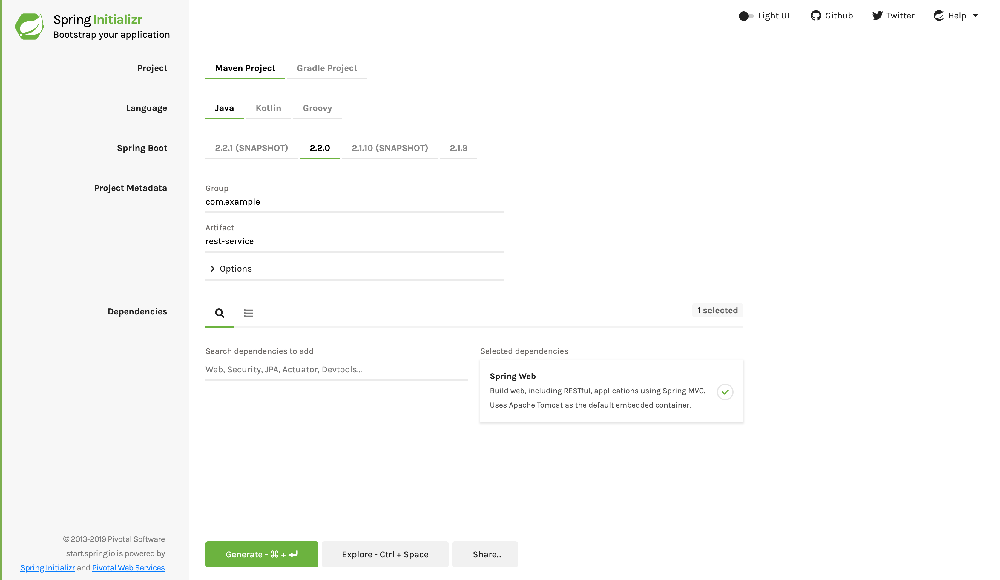

# 构建一个RESTful Web Service
## 你将会构建什么
你将会构建一个服务，它将在http://localhost:8080/greeting接受HTTP GET请求。

它将返回一个问候的JSON表示，如下所示：
```
{"id":1,"content":"Hello, World!"}
```
你可以在查询字符串中添加可选`name`参数来定制问候，如下所示：
```
http://localhost:8080/greeting?name=User
```
`name`参数值覆盖了缺省值`World `，并反映在回复中，如下所示：
```
{"id":1,"content":"Hello, User!"}
```


## 你需要些什么
- 大约15分钟
- 一个你钟爱的文本编辑器或IDE
- [JDK 1.8](http://www.oracle.com/technetwork/java/javase/downloads/index.html) 或更新
- [Gradle 4+](http://www.gradle.org/downloads) or [Maven 3.2+](https://maven.apache.org/download.cgi)
- 你也可以将代码直接导入到IDE中
  + [Spring Tool Suite (STS)](https://spring.io/guides/gs/sts)
  + [IntelliJ IDEA](https://spring.io/guides/gs/intellij-idea/)
## 如何完成这个指南
像大多数Spring [入门指南](https://spring.io/guides)，你可以从头开始完成每一步，或跳过对你来讲很熟悉的基础设置步骤，每种方式你都可得到科工作的代码。

为了从头开始，请移步[Spring Initializr入门](https://spring.io/guides/gs/spring-boot/#scratch)。

为了跳过基础步骤，按下面的步骤操作：
+ [下载](https://github.com/spring-guides/gs-spring-boot/archive/master.zip)并解压本指南的代码库，货值使用git克隆：`git clone https://github.com/spring-guides/gs-rest-service.git`
+ cd 到 gs-rest-service/initial
+ 进入到[创建一个资源表示类](https://spring.io/guides/gs/rest-service/#initial)

当你完成后，你可以检查你的结果并与`gs-rest-service/complete`中的代码比对。
## Spring Initializr入门
对所有的Spring应用，你应该从[Spring Initializr](https://start.spring.io/)开始。Initializr提供了一个快速向你的应用中添加依赖的方式，并为你做了许多设置。这个例子仅仅需要Spring Web依赖，下面的图形显示了样本项目Initializr 设置。



下面的列表显示了当你选择Maven时产生的`pom.xml`
```
<?xml version="1.0" encoding="UTF-8"?>
<project xmlns="http://maven.apache.org/POM/4.0.0" xmlns:xsi="http://www.w3.org/2001/XMLSchema-instance"
	xsi:schemaLocation="http://maven.apache.org/POM/4.0.0 https://maven.apache.org/xsd/maven-4.0.0.xsd">
	<modelVersion>4.0.0</modelVersion>
	<parent>
		<groupId>org.springframework.boot</groupId>
		<artifactId>spring-boot-starter-parent</artifactId>
		<version>2.2.2.RELEASE</version>
		<relativePath/> <!-- lookup parent from repository -->
	</parent>
	<groupId>com.example</groupId>
	<artifactId>rest-service</artifactId>
	<version>0.0.1-SNAPSHOT</version>
	<name>rest-service</name>
	<description>Demo project for Spring Boot</description>

	<properties>
		<java.version>1.8</java.version>
	</properties>

	<dependencies>
		<dependency>
			<groupId>org.springframework.boot</groupId>
			<artifactId>spring-boot-starter-web</artifactId>
		</dependency>

		<dependency>
			<groupId>org.springframework.boot</groupId>
			<artifactId>spring-boot-starter-test</artifactId>
			<scope>test</scope>
			<exclusions>
				<exclusion>
					<groupId>org.junit.vintage</groupId>
					<artifactId>junit-vintage-engine</artifactId>
				</exclusion>
			</exclusions>
		</dependency>
	</dependencies>

	<build>
		<plugins>
			<plugin>
				<groupId>org.springframework.boot</groupId>
				<artifactId>spring-boot-maven-plugin</artifactId>
			</plugin>
		</plugins>
	</build>

</project>
```
下面的列表显示了当你选择Gradle时产生的`build.gradle`
```
plugins {
	id 'org.springframework.boot' version '2.2.0.RELEASE'
	id 'io.spring.dependency-management' version '1.0.8.RELEASE'
	id 'java'
}

group = 'com.example'
version = '0.0.1-SNAPSHOT'
sourceCompatibility = '1.8'

repositories {
	mavenCentral()
}

dependencies {
	implementation 'org.springframework.boot:spring-boot-starter-web'
	testImplementation('org.springframework.boot:spring-boot-starter-test') {
		exclude group: 'org.junit.vintage', module: 'junit-vintage-engine'
	}
}

test {
	useJUnitPlatform()
}
```
## 创建一个资源表示类
现在你已经设立了这个项目和构建环境，你可以创建Web Service了。

思考服务交互，在开始这个过程。

服务将处理对`/greeting`的`GET`请求，在查询字符串带有一个可选的`name`参数。`GET`请求应该在代表问候的JSON载荷中返回200 OK回复。它应该与下面输出相似：
```
{
    "id": 1,
    "content": "Hello, World!"
}
```
`id`字段是问候的唯一性标识符，`content`是问候的文本表示。

为了给问候表示建模，创建一个资源表示类。为了做到这个，创建一个简单Java对象带有字段，构造函数，以及`id`和`content`数据的访问器，就像下面显示的那样（来自于`src/main/java/com/example/restservice/Greeting.java`）：
```
package com.example.restservice;

public class Greeting {

	private final long id;
	private final String content;

	public Greeting(long id, String content) {
		this.id = id;
		this.content = content;
	}

	public long getId() {
		return id;
	}

	public String getContent() {
		return content;
	}
}
```
> 这个应用使用[Jackson JSON](https://github.com/FasterXML/jackson/)来自动对`Greeting` 对象编码为JSON对象。缺省地web starter包含了Jackson。
## 创建一个资源控制器
在Spring创建RESTful web services的方式中，HTTP请求被一个控制器处理。这些组件由`@RestController`注解识别，下面列表显示的`GreetingController`（来自`src/main/java/com/example/restservice/GreetingController.java`）处理对`/greeting`的`GET`请求，返回一个`Greeting`类 的新实例：
```
package com.example.restservice;

import java.util.concurrent.atomic.AtomicLong;

import org.springframework.web.bind.annotation.GetMapping;
import org.springframework.web.bind.annotation.RequestParam;
import org.springframework.web.bind.annotation.RestController;

@RestController
public class GreetingController {

	private static final String template = "Hello, %s!";
	private final AtomicLong counter = new AtomicLong();

	@GetMapping("/greeting")
	public Greeting greeting(@RequestParam(value = "name", defaultValue = "World") String name) {
		return new Greeting(counter.incrementAndGet(), String.format(template, name));
	}
}
```
> 这个控制器简洁且简单，但其下由很多秘密。我们将逐步分解它.

`@GetMapping`注解确保 对`/greeting`的HTTP请求映射到 `greeting()`方法。

存在针对HTTP动作的伴生注解（如对POST的`@PostMapping`），还存在一个`@RequestMapping`注解，所有其它注解从此继承，并可用于一个代名词（如`@RequestMapping(method=GET)`）。

`@RequestParam`将查询字符串参数`name`的值绑定到`greeting()`方法的`name`参数。如果在请求中没有`name`参数，缺省参数`defaultValue`的值`World`将被使用。

方法体的实现基于`counter`的下一个值和使用`greeting`模板格式化给定的`name`作为`id`和`content`的属性值创建并返回一个新的`Greeting`对象。

传统的MVC控制器和刚展示的RESTful web service控制器的一个关键区别在于HTTP恢复被创建的方式。不依赖视图技术来执行问候数据到HTML的服务端渲染，RESTful web service控制器产生并返回一个`Greeting`对象。对象数据将被以JSON格式写给HTTP回复。

这个代码使用了Spring`@RestController`注解，这将标记这个类为控制器，每种方法将返回一个领域对象而非一个视图。 它是包含两者`@Controller`和`@ResponseBody`的快捷方式。

`Greeting`对象必须被转化为JSON，得益于Spring的HTTP消息转换支持，你不需要做这种手动转换。由于[Jackson 2](https://wiki.fasterxml.com/JacksonHome)在classpath上，Spring的`MappingJackson2HttpMessageConverter`将会被自动选择来转换`Greeting`对象至JSON。

`@SpringBootApplication`是一个方便的注解，它添加了下面所有的内容：
- `@Configuration`：标记类作为应用上下文Beans定义的源
- `@EnableAutoConfiguration`：告诉Spring Boot基于classpath 开始添加Beans，其它beans，以及各种属性设置。例如，如果 `spring-webmvc`在classpath上，这个注解标记该应用为一个Web应用并激活关键行为，比如设置一个`DispatcherServlet`。
- `@ComponentScan`：告诉Spring去`com/example`下查询其它组件，配置和服务，让他找到控制器。

`main()`方法使用Spring Boot的`SpringApplication.run()`方法来启动一个应用。你注意到没有一行XML吗？也没有`web.xml`。这个Web应用是100%纯Java，你不必应付配置的重担。
## 构建一个可执行JAR
你可以使用 Gradle 或 Maven从命令行运行应用。你也能构建一个包含所有必须的依赖，类以及资源的单一可执行JAR文件并运行它。构建一个可执行JAR将使得在整个开发生命周期，跨越不同的环境易于传送，版本管理及作为一个应用部署。

如果你使用Gradle，你可以使用`./gradlew bootRun`来运行应用。另外，你可以使用`./gradlew build`来构建JAR文件，并如下所示运行JAR：
```
java -jar build/libs/gs-rest-service-0.1.0.jar
```
如果你使用Maven，你可以使用`./mvnw spring-boot:run`来运行应用。另外，你可以使用`./mvnw clean package`来构建JAR文件，并如下所示运行JAR：
```
java -jar build/libs/gs-rest-service-0.1.0.jar
```
> 这里描述的步骤将创建一个可以运行的JAR。你也可以[构建一个典型的WAR文件](https://spring.io/guides/gs/convert-jar-to-war/)。

日志输出被打印出来。服务已经启动起来并将在几秒钟后运行。
## 测试服务
现在服务已经起来了，访问`http://localhost:8080/greeting`，那里你应该看到：
```
{"id":1,"content":"Hello, World!"}
```
提供一个`name`查询字符串参数来访问`http://localhost:8080/greeting?name=User`。注意到`content`属性的值变为了`Hello, World! to Hello, User!`，如下所示：
```
{"id":2,"content":"Hello, User!"}
```
这个改变演示了`GreetingController`中的`@RequestParam`设置工作正常。`name`参数会被给定一个缺省值`World`，而且它可以通过查询字符串显式覆盖。

注意到`id`属性从 `1` 变为 `2`，这证明你跨多个请求作用于同一个`GreetingController`实例，其`content`属性像期望的那样每次请求加1.
## 总结
祝贺你！你已经利用Spring创建了一个RESTful web service。

## Refrence
- [Building a RESTful Web Service](https://spring.io/guides/gs/rest-service/)
- [Accessing GemFire Data with REST](https://spring.io/guides/gs/accessing-gemfire-data-rest/)
- [Accessing MongoDB Data with REST](https://spring.io/guides/gs/accessing-mongodb-data-rest/)
- [Accessing data with MySQL](https://spring.io/guides/gs/accessing-data-mysql/)
- [Accessing JPA Data with REST](https://spring.io/guides/gs/accessing-data-rest/)
- [Accessing Neo4j Data with REST](https://spring.io/guides/gs/accessing-neo4j-data-rest/)
- [Consuming a RESTful Web Service](https://spring.io/guides/gs/consuming-rest/)
- [Consuming a RESTful Web Service with AngularJS](https://spring.io/guides/gs/consuming-rest-angularjs/)
- [Consuming a RESTful Web Service with jQuery](https://spring.io/guides/gs/consuming-rest-jquery/)
- [Consuming a RESTful Web Service with rest.js](https://spring.io/guides/gs/consuming-rest-restjs/)
- [Securing a Web Application](https://spring.io/guides/gs/securing-web/)
- [Building REST services with Spring](https://spring.io/guides/tutorials/bookmarks/)
- [React.js and Spring Data REST](https://spring.io/guides/tutorials/react-and-spring-data-rest/)
- [Building an Application with Spring Boot](https://spring.io/guides/gs/spring-boot/)
- [Creating API Documentation with Restdocs](https://spring.io/guides/gs/testing-restdocs/)
- [Enabling Cross Origin Requests for a RESTful Web Service](https://spring.io/guides/gs/rest-service-cors/)
- [Building a Hypermedia-Driven RESTful Web Service](https://spring.io/guides/gs/rest-hateoas/)
- [Circuit Breaker](https://spring.io/guides/gs/circuit-breaker/)