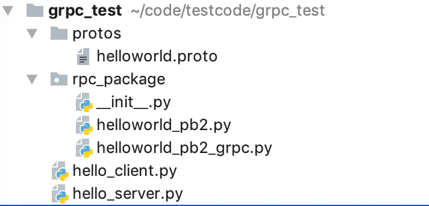

# gRPC详解
## gRPC是什么？
> A high-performance, open-source universal RPC framework

### gRPC vs. Restful API
gRPC和restful API都提供了一套通信机制，用于server/client模型通信，而且它们都使用http作为底层的传输协议(严格地说, gRPC使用的http2.0，而restful api则不一定)。不过gRPC还是有些特有的优势，如下：
- gRPC可以通过protobuf来定义接口，从而可以有更加严格的接口约束条件。
- 通过protobuf可以将数据序列化为二进制编码，这会大幅减少需要传输的数据量，从而大幅提高性能。
- gRPC可以方便地支持流式通信(理论上通过http2.0就可以使用streaming模式, 但是通常web服务的restful api似乎很少这么用，通常的流式数据应用如视频流，一般都会使用专门的协议如HLS，RTMP等，这些就不是我们通常web服务了，而是有专门的服务器应用。）
### 使用场景
+ 需要对接口进行严格约束的情况，比如我们提供了一个公共的服务，很多人，甚至公司外部的人也可以访问这个服务，这时对于接口我们希望有更加严格的约束，我们不希望客户端给我们传递任意的数据，尤其是考虑到安全性的因素，我们通常需要对接口进行更加严格的约束。这时gRPC就可以通过protobuf来提供严格的接口约束。
+ 对于性能有更高的要求时。有时我们的服务需要传递大量的数据，而又希望不影响我们的性能，这个时候也可以考虑gRPC服务，因为通过protobuf我们可以将数据压缩编码转化为二进制格式，通常传递的数据量要小得多，而且通过http2我们可以实现异步的请求，从而大大提高了通信效率。

但是，通常我们不会去单独使用gRPC，而是将gRPC作为一个部件进行使用，这是因为在生产环境，我们面对大并发的情况下，需要使用分布式系统来去处理，而gRPC并没有提供分布式系统相关的一些必要组件。而且，真正的线上服务还需要提供包括负载均衡，限流熔断，监控报警，服务注册和发现等等必要的组件。不过，这就不属于本篇文章讨论的主题了，我们还是先继续看下如何使用gRPC。
## gRPC HelloWorld实例详解
gRPC的使用通常包括如下几个步骤：
- 通过protobuf来定义接口和数据类型
- 编写gRPC server端代码
- 编写gRPC client端代码
下面来通过一个实例来详细讲解上述的三步。下边的hello world实例完成之后，其目录结果如下：

### 定义接口和数据类型
- 通过protobuf定义接口和数据类型
```
syntax = "proto3";

package rpc_package;

// define a service
service HelloWorldService {
    // define the interface and data type
    rpc SayHello (HelloRequest) returns (HelloReply) {}
}

// define the data type of request
message HelloRequest {
    string name = 1;
}

// define the data type of response
message HelloReply {
    string message = 1;
}
```
- 使用gRPC protobuf生成工具生成对应语言的库函数
```
python -m grpc_tools.protoc -I=./protos --python_out=./rpc_package --grpc_python_out=./rpc_package ./protos/user_info.proto
```
这个指令会自动生成rpc_package文件夹中的helloworld_pb2.py和helloworld_pb2_grpc.py，但是不会自动生成__init__.py文件，需要我们手动添加
### gRPC server端代码
```
#!/usr/bin/env python
# -*-coding: utf-8 -*-

from concurrent import futures
import grpc
import logging
import time

from rpc_package.helloworld_pb2_grpc import add_HelloWorldServiceServicer_to_server, \ 
    HelloWorldServiceServicer
from rpc_package.helloworld_pb2 import HelloRequest, HelloReply


class Hello(HelloWorldServiceServicer):

    # 这里实现我们定义的接口
    def SayHello(self, request, context):
        return HelloReply(message='Hello, %s!' % request.name)


def serve():
    # 这里通过thread pool来并发处理server的任务
    server = grpc.server(futures.ThreadPoolExecutor(max_workers=10))

    # 将对应的任务处理函数添加到rpc server中
    add_HelloWorldServiceServicer_to_server(Hello(), server)

    # 这里使用的非安全接口，世界gRPC支持TLS/SSL安全连接，以及各种鉴权机制
    server.add_insecure_port('[::]:50000')
    server.start()
    try:
        while True:
            time.sleep(60 * 60 * 24)
    except KeyboardInterrupt:
        server.stop(0)


if __name__ == "__main__":
    logging.basicConfig()
    serve()
```
### gRPC client端代码
```
#!/usr/bin/env python
# -*- coding: utf-8 -*-

from __future__ import print_function
import logging

import grpc
from rpc_package.helloworld_pb2 import HelloRequest, HelloReply
from rpc_package.helloworld_pb2_grpc import HelloWorldServiceStub

def run():
    # 使用with语法保证channel自动close
    with grpc.insecure_channel('localhost:50000') as channel:
        # 客户端通过stub来实现rpc通信
        stub = HelloWorldServiceStub(channel)

        # 客户端必须使用定义好的类型，这里是HelloRequest类型
        response = stub.SayHello(HelloRequest(name='eric'))
    print ("hello client received: " + response.message)

if __name__ == "__main__":
    logging.basicConfig()
    run()
```
### 演示
- 先执行server端代码
```
python hello_server.py
```
- 接着执行client端代码如下：
```
grpc_test python hello_client.py
hello client received: Hello, eric!
```

## Reference
- [gRPC详解](https://www.jianshu.com/p/9c947d98e192)