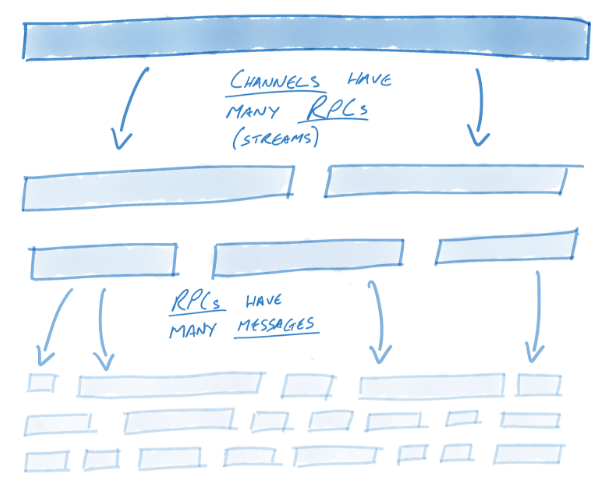
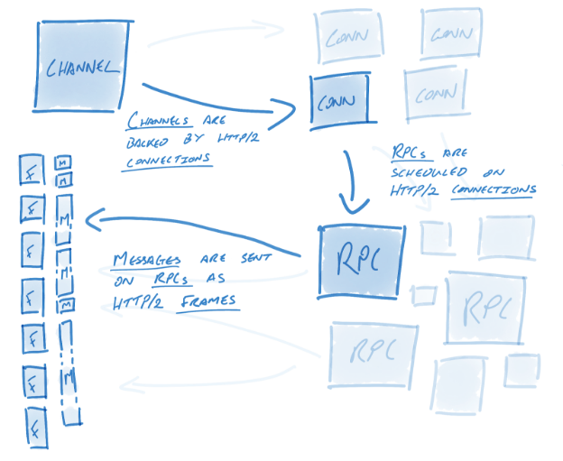
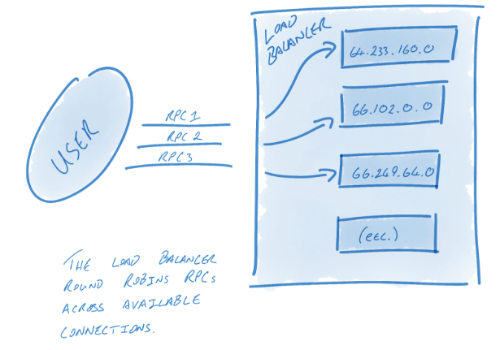

# gRPC On HTTP/2
## gRPC语义
作为开始，让我们首先探讨HTTP/2概念是如何与gRPC概念关联起来的：gRPC引入了三个新的概念，通道，远程过程调用（RPC）和消息。它们三个之间的关系很简单：每个通道可能含有多个远程过程调用，而每个远程过程调用可能含有许多消息。

让我们看看gRPC语义如何关联到 HTTP/2：

通道是gRPC的一个关键概念。HTTP/2中的流允许在一个单个连接上的多个并发会话；通道通过跨越多个并行连接允许多个流扩展了这个概念。表面上，通道提供了简单的接口来让用户把消息发送进去；但在其背后，我们进行了大量的工作来保持这些连接活跃，健康并被使用。

通道代表至对端的虚拟连接，它事实上由许多HTTP/2连接支撑。RPC与一个连接（这个关联将深入描述）关联。RPC在实践中是简单HTTP/2 （消息）流。消息与RPC关联，并以[HTTP/2数据帧](https://http2.github.io/http2-spec/#rfc.figure.6)的形式发送。更具体地，消息在数据帧层之上。一个数据帧可能含有多个消息，或者一个gRPC消息太大以至于它需跨越多个数据帧。
## 解析器和负载均衡
为了保持连接活跃，健康并被使用，gRPC 利用了很多组件，它们之中最重要的就是名称解析器（name resolvers）和负载均衡（load balancers）。解析器将名字转换为地址，并把这些地址传递给负载均衡器。负载均衡器将负责从这些地址创建连接并在这些连接间进行负载均衡。

比如，一个域名解析器（DNS resolver）可能将某个主机名解析为13个IP地址，接下来一个循环往复均衡器（RoundRobin）可能创建13个连接--每地址一个--并将RPC循环至每一个连接。一个更简单的负载均衡器可能仅仅创建与第一个地址的连接。可选地，一个用户想要多个连接，单知道主机仅仅能解析为一个地址，那么它的负载均衡器可能与每个地址创建10个连接以保证多个连接可用。

解析器和负载均衡解决了gRPC系统中小但关键的问题。设计初衷如下：减小问题空间为一些小的，分散的问题，帮助用户构建自定义组件。这些组件可被用于细粒度调优gRPC以满足各个系统的独立需求。
## 连接管理
一旦配置，gRPC将保持一个连接池，就像解析器和负载均衡定义的--连接活跃，健康并被使用。

当一个连接失败时，负载均衡器将使用最后知晓的地址列表来开始重连。同时，解析器也将试着重新解析地址列表。这在很多场景下是有用的。比如，如果代理不再可用，我们将期待解析器更新地址列表，但不包括代理地址。另举一个例子：DNS条目可能随时间更新了，地址列表可能需要定期以这种方式或那种方式更新，gRPC设计成可用于长期弹性（resiliency）。

一旦解析完成，负载均衡器将被通知有新的地址列表。如果地址已经改变了，负载均衡器可能关闭已经与不在列表上的地址的连接，并与新的地址创建连接。
## 识别失败的连接

## Reference
- [gRPC On HTTP/2: Engineering A Robust, High Performance Protocol](https://www.cncf.io/blog/2018/08/31/grpc-on-http-2-engineering-a-robust-high-performance-protocol/)