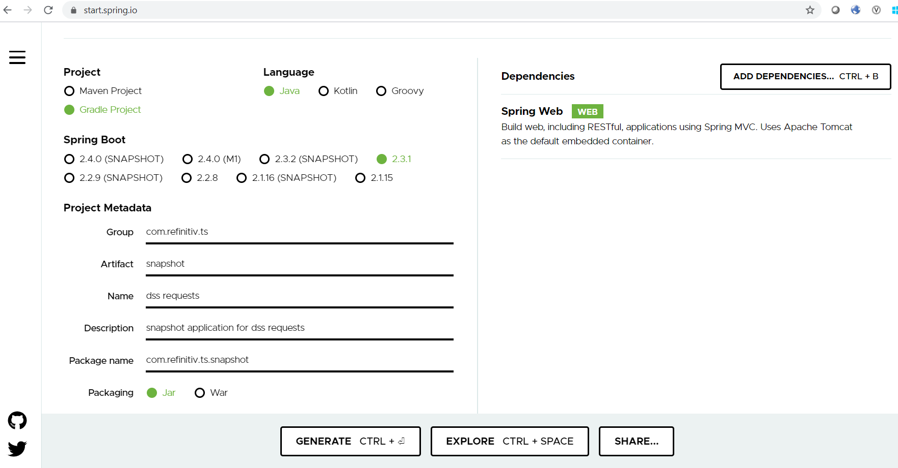

# 创建异步方法
本指南带你创建一个对GitHub的异步查询。关注点在于异步部分，这是缩放服务时经常是用的一个特性。
## 你将构建什么
你将构建一个查询服务，它将查询GitHub用户信息，并通过GitHub API检索数据。缩放服务的一种方式是在后台运行一个昂贵的工作并使用Java的[CompletableFuture](https://docs.oracle.com/javase/8/docs/api/java/util/concurrent/CompletableFuture.html)接口来等待结果；Java的[CompletableFuture](https://docs.oracle.com/javase/8/docs/api/java/util/concurrent/CompletableFuture.html)是常规`Future`的进化。它使得利用流水线处理多个异步请求并将它们合并成一个单一的异步计算。
## 你需要些什么
- 大约15分钟
- 一个你钟爱的文本编辑器或IDE
- [JDK 1.8](http://www.oracle.com/technetwork/java/javase/downloads/index.html) 或更新
- [Gradle 4+](http://www.gradle.org/downloads) or [Maven 3.2+](https://maven.apache.org/download.cgi)
- 你也可以将代码直接导入到IDE中
  + [Spring Tool Suite (STS)](https://spring.io/guides/gs/sts)
  + [IntelliJ IDEA](https://spring.io/guides/gs/intellij-idea/)
## 如何完成这个指南
像大多数Spring [入门指南](https://spring.io/guides)，你可以从头开始完成每一步，或跳过对你来讲很熟悉的基础设置步骤，每种方式你都可得到可工作的代码。

为了从头开始，请移步[Spring Initializr入门](https://spring.io/guides/gs/spring-boot/#scratch)。

为了跳过基础步骤，按下面的步骤操作：
+ [下载](https://github.com/spring-guides/gs-async-method/archive/master.zip)并解压本指南的代码库，货值使用git克隆：`git clone git clone https://github.com/spring-guides/gs-async-method.git`
+ cd 到 gs-async-method/initial
+ 进入到[创建一个GitHub账号](https://spring.io/guides/gs/async-method/#initial)

当你完成后，你可以检查你的结果并与`gs-async-method/complete`中的代码比对。
## Spring Initializr入门
对所有的Spring应用，你应该从[Spring Initializr](https://start.spring.io/)开始。Initializr提供了一个快速向你的应用中添加依赖的方式，并为你做了许多设置。这个例子仅仅需要Spring Web依赖，下面的图形显示了样本项目Initializr 设置。



下面的列表显示了当你选择Maven时产生的`pom.xml`
```
<?xml version="1.0" encoding="UTF-8"?>
<project xmlns="http://maven.apache.org/POM/4.0.0" xmlns:xsi="http://www.w3.org/2001/XMLSchema-instance"
	xsi:schemaLocation="http://maven.apache.org/POM/4.0.0 https://maven.apache.org/xsd/maven-4.0.0.xsd">
	<modelVersion>4.0.0</modelVersion>
	<parent>
		<groupId>org.springframework.boot</groupId>
		<artifactId>spring-boot-starter-parent</artifactId>
		<version>2.2.2.RELEASE</version>
		<relativePath/> <!-- lookup parent from repository -->
	</parent>
	<groupId>com.example</groupId>
	<artifactId>spring-boot</artifactId>
	<version>0.0.1-SNAPSHOT</version>
	<name>spring-boot</name>
	<description>Demo project for Spring Boot</description>

	<properties>
		<java.version>1.8</java.version>
	</properties>

	<dependencies>
		<dependency>
			<groupId>org.springframework.boot</groupId>
			<artifactId>spring-boot-starter-web</artifactId>
		</dependency>

		<dependency>
			<groupId>org.springframework.boot</groupId>
			<artifactId>spring-boot-starter-test</artifactId>
			<scope>test</scope>
			<exclusions>
				<exclusion>
					<groupId>org.junit.vintage</groupId>
					<artifactId>junit-vintage-engine</artifactId>
				</exclusion>
			</exclusions>
		</dependency>
	</dependencies>

	<build>
		<plugins>
			<plugin>
				<groupId>org.springframework.boot</groupId>
				<artifactId>spring-boot-maven-plugin</artifactId>
			</plugin>
		</plugins>
	</build>

</project>
```

下面的列表显示了当你选择Gradle时产生的`build.gradle`
```
plugins {
	id 'org.springframework.boot' version '2.2.2.RELEASE'
	id 'io.spring.dependency-management' version '1.0.8.RELEASE'
	id 'java'
}

group = 'com.example'
version = '0.0.1-SNAPSHOT'
sourceCompatibility = '1.8'

repositories {
	mavenCentral()
}

dependencies {
	implementation 'org.springframework.boot:spring-boot-starter-web'
	testImplementation('org.springframework.boot:spring-boot-starter-test') {
		exclude group: 'org.junit.vintage', module: 'junit-vintage-engine'
	}
}

test {
	useJUnitPlatform()
}
```
## 创建一个GitHub用户表示
在你创建一个GitHub用户之前，你需要定义一个通过GitHub API查询的数据的表示形式。

为了给用户表示建模，创建一个资源呈现类。为了达到目的，创建一个简单Java对象，其包含字段，构造函数及访问器，如下面的代码（src/main/java/com/example/asyncmethod/User.java）所示：
```
package com.example.asyncmethod;

import com.fasterxml.jackson.annotation.JsonIgnoreProperties;

@JsonIgnoreProperties(ignoreUnknown=true)
public class User {

  private String name;
  private String blog;

  public String getName() {
    return name;
  }

  public void setName(String name) {
    this.name = name;
  }

  public String getBlog() {
    return blog;
  }

  public void setBlog(String blog) {
    this.blog = blog;
  }

  @Override
  public String toString() {
    return "User [name=" + name + ", blog=" + blog + "]";
  }

}
```
Spring利用[Jackson JSON](https://wiki.fasterxml.com/JacksonHome)库来把GitHub的JSON表示转化为一个`User`对象。`@JsonIgnoreProperties`注解告诉Spring忽略这个类没包含的属性。这使得发起REST调用和产生领域对象更容易。

在本教程中，出于演示目的我们将仅仅捕获`name`和`blog`URL。
## 创建一个GitHub查询服务
接下来，你需要创建一个服务来查询GitHub获取用户信息。下面的代码（来自`src/main/java/com/example/asyncmethod/GitHubLookupService.java`）现实了如何做：
```
package com.example.asyncmethod;

import org.slf4j.Logger;
import org.slf4j.LoggerFactory;
import org.springframework.boot.web.client.RestTemplateBuilder;
import org.springframework.scheduling.annotation.Async;
import org.springframework.stereotype.Service;
import org.springframework.web.client.RestTemplate;

import java.util.concurrent.CompletableFuture;

@Service
public class GitHubLookupService {

  private static final Logger logger = LoggerFactory.getLogger(GitHubLookupService.class);

  private final RestTemplate restTemplate;

  public GitHubLookupService(RestTemplateBuilder restTemplateBuilder) {
    this.restTemplate = restTemplateBuilder.build();
  }

  @Async
  public CompletableFuture<User> findUser(String user) throws InterruptedException {
    logger.info("Looking up " + user);
    String url = String.format("https://api.github.com/users/%s", user);
    User results = restTemplate.getForObject(url, User.class);
    // Artificial delay of 1s for demonstration purposes
    Thread.sleep(1000L);
    return CompletableFuture.completedFuture(results);
  }

}
```
`GitHubLookupService`类使用Spring的RestTemplate来触发一个远程REST调用（api.github.com/users/），接下来把回复转换成一个`User`对象。Spring Boot自动提供一个`RestTemplateBuilder`来定制化auto-configuration控制的许多选项（如`MessageConverter`）。

这个类用`@Service`注解标记，使得它可以作为Spring组件扫描发现的候选对象，并可被加入到应用上下文中。

`findUser`方法被用Spring的`@Async`注解标记，指示它应该运行在一个单独的线程中。方法的返回类型是[CompletableFuture<User>](https://docs.oracle.com/javase/8/docs/api/java/util/concurrent/CompletableFuture.html)而非`User`，这是任何异步服务的必须要求。代码使用`completedFuture`方法返回一个`CompletableFuture`实例，它代表GitHub查询已完成的结果。
> 创建`GitHubLookupService`类的本地实例并不会允许`findUser`方法异步运行。它必须在@Configuration类中被创建或者被@ComponentScan标记。

GitHub API所费时间变化很大。为了在本教程中演示（异步）收益，在该服务中额外加了一秒的延迟。
## 使应用可执行
为了运行示例，你可以创建一个可运行jar。Spring的`@Async`可以工作于Web应用。但你不需要设置一个Web荣起来来看到收益。下面的代码（来自src/main/java/com/example/asyncmethod/AsyncMethodApplication.java）告诉你如何做：
```
package com.example.asyncmethod;

import org.springframework.boot.SpringApplication;
import org.springframework.boot.autoconfigure.SpringBootApplication;
import org.springframework.context.annotation.Bean;
import org.springframework.scheduling.annotation.EnableAsync;
import org.springframework.scheduling.concurrent.ThreadPoolTaskExecutor;

import java.util.concurrent.Executor;

@SpringBootApplication
@EnableAsync
public class AsyncMethodApplication {

  public static void main(String[] args) {
    // close the application context to shut down the custom ExecutorService
    SpringApplication.run(AsyncMethodApplication.class, args).close();
  }

  @Bean
  public Executor taskExecutor() {
    ThreadPoolTaskExecutor executor = new ThreadPoolTaskExecutor();
    executor.setCorePoolSize(2);
    executor.setMaxPoolSize(2);
    executor.setQueueCapacity(500);
    executor.setThreadNamePrefix("GithubLookup-");
    executor.initialize();
    return executor;
  }

}
```
> Spring初始化器为你创建了AsyncMethodApplication类，你可在从Spring初始化器下载的zip文件（在src/main/java/com/example/asyncmethod/AsyncMethodApplication.java）中找到它，你可以把这个类拷贝到你的项目中，或者从上面的列表中拷贝。

@SpringBootApplication`是一个方便的注解，它添加了下面所有的内容：
- `@Configuration`：标记类作为应用上下文Beans定义的源
- `@EnableAutoConfiguration`：告诉Spring Boot基于classpath 开始添加Beans，其它beans，以及各种属性设置。例如，如果 `spring-webmvc`在classpath上，这个注解标记该应用为一个Web应用并激活关键行为，比如设置一个`DispatcherServlet`。
- `@ComponentScan`：告诉Spring去`com/example`下查询其它组件，配置和服务，让它找到控制器。

`main()`方法使用Spring Boot的`SpringApplication.run()`方法来启动一个应用。你注意到没有一行XML吗？也没有`web.xml`。这个Web应用是100%纯Java，你不必应付配置的重担。

[@EnableAsync](https://docs.spring.io/spring/docs/current/spring-framework-reference/html/scheduling.html#scheduling-annotation-support)注解切换Spring的能力范围，从而在一个后台线程池中运行`@Async`方法。该类可以通过定义一个新的Bean来定制化`Executor`。这里，该方法被命名为`taskExecutor`，因为这是[Spring搜索的一个特殊方法](https://docs.spring.io/spring-framework/docs/current/javadoc-api/org/springframework/scheduling/annotation/EnableAsync.html)。在我们的例子中，我们想限制并行线程数为2，队列大小为500。有[很多你可以调优的东西](https://docs.spring.io/spring-framework/docs/current/spring-framework-reference/integration.html#scheduling-task-executor)。如果你没有定义一个`Executor`Bean，Spring将创建一个`SimpleAsyncTaskExecutor`并使用它。

还有一个`CommandLineRunner`也注入到`GitHubLookupService`，并调用服务三次来演示方法的异步执行。

你也需要一个类来运行应用，你可在`src/main/java/com/example/asyncmethod/AppRunner.java`中找到。下面的列表展示了这个类：
```
package com.example.asyncmethod;

import org.slf4j.Logger;
import org.slf4j.LoggerFactory;
import org.springframework.boot.CommandLineRunner;
import org.springframework.stereotype.Component;

import java.util.concurrent.CompletableFuture;

@Component
public class AppRunner implements CommandLineRunner {

  private static final Logger logger = LoggerFactory.getLogger(AppRunner.class);

  private final GitHubLookupService gitHubLookupService;

  public AppRunner(GitHubLookupService gitHubLookupService) {
    this.gitHubLookupService = gitHubLookupService;
  }

  @Override
  public void run(String... args) throws Exception {
    // Start the clock
    long start = System.currentTimeMillis();

    // Kick of multiple, asynchronous lookups
    CompletableFuture<User> page1 = gitHubLookupService.findUser("PivotalSoftware");
    CompletableFuture<User> page2 = gitHubLookupService.findUser("CloudFoundry");
    CompletableFuture<User> page3 = gitHubLookupService.findUser("Spring-Projects");

    // Wait until they are all done
    CompletableFuture.allOf(page1,page2,page3).join();

    // Print results, including elapsed time
    logger.info("Elapsed time: " + (System.currentTimeMillis() - start));
    logger.info("--> " + page1.get());
    logger.info("--> " + page2.get());
    logger.info("--> " + page3.get());

  }
}
```
## 构建一个可执行JAR
你可以利用Gradle 或 Maven从命令行来运行应用。你也可以构建一个单独可执行JAR文件，其包含所有必须的依赖，类以及资源来运行它。构建一个可执行JAR使其容易交付，控制版本，并在整个生命周期中将服务作为一个应用部署从而跨越不同的环境，等等。

**如果你运行Gradle**， 你可以使用`./gradlew bootRun`运行应用。可选地，你可使用`./gradlew build`来构建JAR文件，并像下面那样运行应用：
```
java -jar build/libs/gs-async-method-0.1.0.jar
```

**如果你运行Maven**， 你可以使用`./mvnw spring-boot:run`运行应用。可选地，你可使用`./mvnw clean package`来构建JAR文件，并像下面那样运行应用：
```
java -jar target/gs-async-method-0.1.0.jar
```
> 这里描述的步骤创建了一个可运行JAR，你也可以[构建一个典型WAR文件](https://spring.io/guides/gs/convert-jar-to-war/)。

应用显示了日志输出，展示了每次的GitHub查询。利用`allOf`工厂方法，我们创建了一个`CompletableFuture`对象数组。通过调用`join`方法，有可能等到所有`CompletableFuture`对象的完成。

下面的列表展示了样例应用的典型输出：
```
2016-09-01 10:25:21.295  INFO 17893 --- [ GithubLookup-2] hello.GitHubLookupService                : Looking up CloudFoundry
2016-09-01 10:25:21.295  INFO 17893 --- [ GithubLookup-1] hello.GitHubLookupService                : Looking up PivotalSoftware
2016-09-01 10:25:23.142  INFO 17893 --- [ GithubLookup-1] hello.GitHubLookupService                : Looking up Spring-Projects
2016-09-01 10:25:24.281  INFO 17893 --- [           main] hello.AppRunner                          : Elapsed time: 2994
2016-09-01 10:25:24.282  INFO 17893 --- [           main] hello.AppRunner                          : --> User [name=Pivotal Software, Inc., blog=https://pivotal.io]
2016-09-01 10:25:24.282  INFO 17893 --- [           main] hello.AppRunner                          : --> User [name=Cloud Foundry, blog=https://www.cloudfoundry.org/]
2016-09-01 10:25:24.282  INFO 17893 --- [           main] hello.AppRunner                          : --> User [name=Spring, blog=https://spring.io/projects]
```
注意前两个调用在两个单独的线程里（GithubLookup-2, GithubLookup-1）发生，第三个一直等待直到两个线程中一个可用。为了比较如果没有异步特性这个任务花费的时间，注释掉`@Async`注解并再次运行服务。总的任务时间增长可观，因为每个查询任务至少话费1秒。你可以调优`Executor`，比如增加`corePoolSize`的大小。

本质上，任务花费时间越长，同时触发的任务越多，你从任务异步上获得收益越多。代价是需要处理`CompletableFuture`接口。它增加了一层抽象，因为你不再直接处理结果。
## 总结
恭喜你！你已经开发了一个完整的异步服务，它让你可以一次处理多个调用。
## 注意
### CommandLineRunner
```
import org.springframework.core.annotation.Order;
public interface CommandLineRunner {
    /**
     * Callback used to run the bean.
     * @param args incoming main method arguments
     * @throws Exception on error
     */
    void run(String... args) throws Exception;
}
```
平常开发中有可能需要实现在项目启动后执行的功能，SpringBoot提供的一种简单的实现方案就是添加一个model并实现CommandLineRunner接口，实现功能的代码放在实现的run方法中。如下例：
```
import org.springframework.boot.CommandLineRunner;
import org.springframework.core.annotation.Order;
import org.springframework.stereotype.Component;

@Component
@Order(value=1)
public class StartupRunnerOne implements CommandLineRunner{
    @Override
    public void run(String... args) throws Exception {
        System.out.println(">>>>>>>>>>>>>>>服务启动第一个开始执行的任务，执行加载数据等操作<<<<<<<<<<<<<");
    }
}
```

```
import org.springframework.boot.CommandLineRunner;
import org.springframework.core.annotation.Order;
import org.springframework.stereotype.Component;

@Component
@Order(value=2)
public class StartupRunnerTwo implements CommandLineRunner{
    @Override
    public void run(String... args) throws Exception {
        System.out.println(">>>>>>>>>>>>>>>服务第二顺序启动执行，执行加载数据等操作<<<<<<<<<<<<<");
    }
}
```

Spring Boot如何解决项目启动时初始化资源，在我们实际工作中，总会遇到这样需求，在项目启动的时候需要做一些初始化的操作，比如初始化线程池，提前加载好加密证书等。

为了达到这个目的，我们需要使用CommandLineRunner或ApplicationRunner接口创建bean，spring boot会自动监测到它们。这两个接口都有一个run()方法，在实现接口时需要覆盖该方法，并使用@Component注解使其成为bean。

CommandLineRunner和ApplicationRunner的作用是相同的。不同之处在于CommandLineRunner接口的run()方法接收String数组作为参数，即是最原始的参数，没有做任何处理；而ApplicationRunner接口的run()方法接收ApplicationArguments对象作为参数，是对原始参数做了进一步的封装。


## Reference
- [Creating Asynchronous Methods](https://spring.io/guides/gs/async-method/)
- [org.springframework.scheduling.annotation: Annotation Type EnableAsync](https://docs.spring.io/spring/docs/3.1.x/javadoc-api/org/springframework/scheduling/annotation/EnableAsync.html)