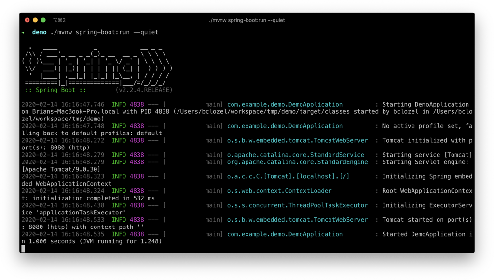
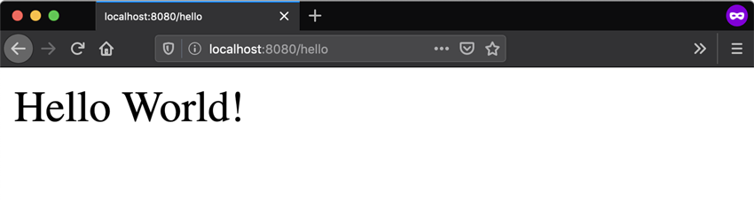

# Spring 快速入门指南
## Step 1：开始一个Spring Boot新项目
使用 start.spring.io 创建一个“Web”项目。在“依赖”对话框中搜寻并添加“web”依赖，如下图所示。点击“Generate” 按钮，下载压缩包，解压到你本机的一个目录中。


由start.spring.io创建的项目包含[Spring Boot](https://spring.io/projects/spring-boot)，一个很容易使得Spring 在你的app里工作的框架，而不需要太多的代码和配置。Spring Boot是开始Sprint项目最快捷和最流行的方式。
## Step 2：添加你的代码
在你的IDE中打开这个项目，定位到目录src/main/java/com/example/demo下的DemoApplication.java。现在修改文件内容，添加额外的方法和注解如下。你可以拷贝粘贴代码，或者直接输入.
```
package com.example.demo;

import org.springframework.boot.SpringApplication;
import org.springframework.boot.autoconfigure.SpringBootApplication;
import org.springframework.web.bind.annotation.GetMapping;
import org.springframework.web.bind.annotation.RequestParam;
import org.springframework.web.bind.annotation.RestController;

@SpringBootApplication
@RestController
public class DemoApplication {
    public static void main(String[] args) {
        SpringApplication.run(DemoApplication.class, args);
    }

    @GetMapping("/hello")
    public String hello(@RequestParam(value = "name", defaultValue = "World") String name) {
        return String.format("Hello %s!", name);
    }
}
```
我们添加的hello() 方法包含一个参数叫name，然后在代码中把它与单词"Hello"绑定在一起，这意味着如果你在你的请求中把你的名字设为“Amy”，回复将是“Hello Amy”。

@RestController注解告诉Spring这段代码描述了一个通过Web可以访问的端点，@GetMapping(“/hello”) 告诉Spring使用我们的 hello()方法来回答发送到http://localhost:8080/hello的请求。最终，@RequestParam告诉Spring期待请求中的name参数，但如果没有，将使用缺省的“World”单词。
## Step 3：试试
让我们构建并运行程序。开启一个命令行（或终端）导航到拥有项目文件的目录，使用如下命令来构建并运行程序：

**MacOS/Linux**:
```
./mvnw spring-boot:run
```

**Windows**:
```
mvnw spring-boot:run
```
你应该看到一些输出看起来像下面的例子：



最后两行告诉我们Spring 已经启动，Spring Boot嵌入的Apache Tomcat服务器正充当一个Web服务器，并在localhost:8089上监听，打开你的浏览器并输入http://localhost:8080/hello，你应该看到一个友好的回复如下：


## 小测验
在你的URL末尾添加?name=Amy会发生什么？


## Reference
- [Spring Quickstart Guide](https://spring.io/quickstart)