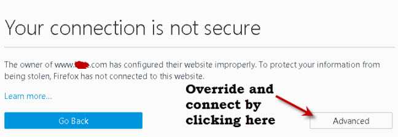
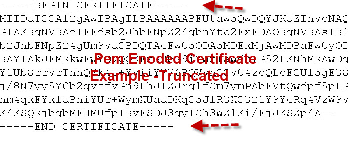
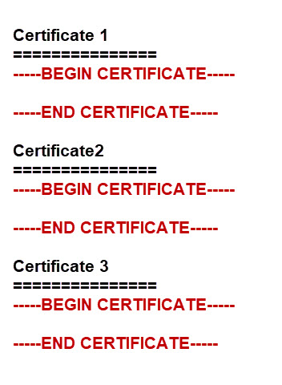
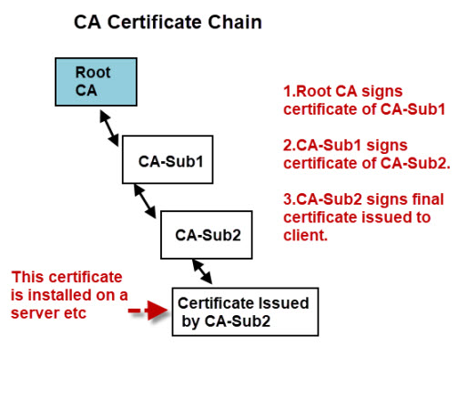
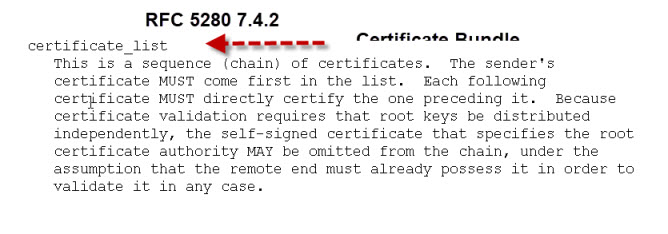
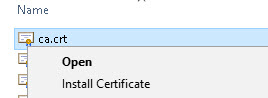

# 写给入门人员的 SSL 和 SSL 证书详解
安全套接字层（Secure Sockets Layer，SSL）和传输层安全（Transport Layer security，TLS）是为通过计算机网络或连接提供安全通讯的协议。

它们广泛用于网页浏览和电子邮件。在本教程中我们将看到：
- TLS 和 SSL
- 公钥和私钥
- 为什么我们需要证书以及它们做什么
- 如何得到一个数字证书并理解常用证书类型的区别
## 什么是 TLS
TLS 基于 SSL，在 SSLv3 发布后暴露出很多问题，作为应对，TLS 被开发用于替代 SSL。

SSL 是一个公共术语，今天通常用来代指 TLS。
### TLS 的安全性
SSL/TLS 提供了数据加密，数据完整性以及认证。这意味着当你使用 SSL/TLS 时，你可以确信：
- 没有人可以阅读你的数据
- 没有人可以改变你的数据
- 你在与你期待的人（服务器）通信

在通讯双反发送消息时你有两个问题需要解决：
- 你知道没有人阅读你的消息吗？
- 你知道没有人篡改你的消息吗？

对这些问题的解决方案如下：
- **加密**：这使得内容不可读，如此任何人看到它时就如同看到一堆垃圾
- **签名**：它允许接收方确信是你发送的消息，并且该消息未被篡改过

两个过程都需要使用密钥。这些密钥是简单的数字（常用的是128位），它们通过某个特定的方法与消息绑定来加密消息或对小西签名。这些方法常被称为算法，例如 RSA。
## 对称密钥，公钥和私钥
今天几乎所有使用的加密算法都使用了公钥和私钥。它们通常被认为比老的对称密钥安排安全得多。
> 对一一个对称密钥，该密钥用于加密和对消息签名，同样的密钥也用于对消息解密。

这和我们日常生活中处理的钥匙一样（门钥匙，汽车钥匙）。这种类型的密钥安排的问题在于如果你丢失了钥匙，任何得到它的人可以打开你的们。

使用公钥和私钥，两个使用的密钥是算术相关的（**属于同一密钥对**），但却是不同的。这意味这**用一个公钥加密**的消息**不能用同一公钥解密**。为了解密消息，你需要**私钥**。

如果这种类型密钥安排被用于你的汽车密钥，那么你可以用它锁车，并把钥匙留在锁上--同一把锁并不能解锁汽车。
> 这种类型的密钥安排是非常安全的，并被用于所有现代加密，签名系统中。
## 密钥和 SSL 证书
SSL/TLS 使用公钥和私钥来加密数据以及确保数据完整性。任何人都可得到公钥，因此得名**公钥**。

因为这个有一个尤其关于信任的问题：你如何知道一个公钥属于一个它所声称的人或实体？例如，你收到了一个公钥声称属于你的银行，你如何知道它确实属于你的银行？答案是**使用一个数字证书**。一个数字证书与日常生活中的护照服务于同一目的。护照在一张照片和一个人之间建立关联，这个关联是**信任的权威机构**（护照办公室）验证过的。一个数字证书为一个**公钥**和一个实体（商业机构，域名等）提供了一个关联，该关联已经被信任的第三方（**证书颁发机构**）验证（签名）过了。**数字证书**提供了分发信任的**公共加密密钥**的便利方式。
## 得到一个数字证书
你可以从一个公认的证书颁发机构（CA）得到一个数字证书，就像你从护照办公室得到一本护照。事实上这个过程非常相似：

你填写一份申请表，添加上你的公钥（它们实际上就是些数字），并把它们发送给证书颁发机构（这被称为**证书请求**）。

证书颁发机构做一些核查（依赖于机构）并向你发回**证书**包裹的公钥。

证书已经由发布的证书颁发机构签名，这用余保证公钥（的真实性）。现在当某人想要你的公钥时，你把证书发送给他，他们验证证书的签名，如果验证通过，他们就可以**信任你的公钥**。
### 使用示例
为了演示，我们来看看一个典型地使用 SSL(https) 的Web浏览器和Web服务器的连接。这个链接在会联网上用于在 Gmail 中发送邮件，网上银行，购物等。
1. 浏览器使用使用 SSL(https) 连接到服务器
2. 服务器把其包含Web服务器公钥的服务器证书发送回来
3. 浏览器通过验证CA的签名来验证该证书。为了实现这个**CA的证书**需要被放在浏览器的信任存储里（见后）。
4. 浏览器使用公钥同意与服务器通讯的**会话密钥**。
5. Web浏览器和服务器通过连接使用**会话密钥**加密数据。

这里有[一个视频](https://youtu.be/iQsKdtjwtYI)，包含了以上更多细节。
## 数字证书类型
如果你在试图为一个网站购买一个证书，或用于加密 MQTT，你将遇到两个主要类型：
- 域名验证证书（Domain Validated Certificates (DVC)）
- 扩展验证证书（Extended validation Certificates (EVC)）

两种类型的区别在于证书信任的深度，它由更严密的验证（措施）提供。它们提供的加密级别是一致的。

一个域名验证证书是一个典型地用于 TLS 的 X.509 数字证书，那里申请者的身份已经通过控制一个DNS域名而加以验证过了--[WikI](https://en.wikipedia.org/wiki/Domain-validated_certificate)、验证过程通常是全完全自动化的，这使得它称为最便宜类型的证书。它们对于像本站点这样提供内容的网站是理想的，但不适用于提供敏感数据的网站。

扩展验证证书用于 HTTPS 站点和软件的证书，它证明了控制网站或软件包的合法实体。获得一个扩展验证证书需要CA对请求实体的合法身份的验证。因为涉及到人工验证。它们通常比域名验证证书昂贵，
### 证书使用限制--通配符和 SANs
通常一个证书仅仅在用于一个完全限定域名（FQDN）时才是有效的。这意味着为 `www.mydomain.com` 购买的证书不能用于 `mail.mydomain.com` 或 `www.otherdomain.com`。

但是如果你想使你的多个子域名和主域名一样安全，那么你可以购买一个**带通配符的证书**。一个通配符证书包含一个域名下的**所有子域**。例如，一个带通配符的证书如 `*.mydomain.com` 可以用于：
- mail.mydomain.com
- www.mydomain.com
- ftp.mydomain.com
- 等

但它不能同时用于 `mydomain.com` 和 `myotherdomain.com`。

为了用一个证书加固多个不同的域名，你必须购买带SAN的证书（主题可选的名字，即Subject Alternative Name）。这允许你在主域名之外再加固四个额外的域名。例如，你可以使用同一个证书于下面的域名：
- www.mydomain.com
- www.mydomain.org
- www.mydomain.net
- www.mydomain.co
- www.mydomain.co.uk
你可以更改该证书包含的域名，但需要证书的重新发布。
### 为什么使用商业证书
使用某些免费软件工具创建你自己的 SSL 证书或极爱密钥是很容易的，这些密钥和证书和商业版本一样安全，在大多数情况下甚至被认为更安全。
> 当你需要为你的证书提供更广泛的支持时，商业证书是必要的。

这是因为对主要的商业证书颁发机构的支持已经内建在大多数 Web 浏览器及操作系统内。

如果我把一个我自己产生的证书安装到一个站点上，当你访问这个站点时，你会看到像下面的一条消息警告你该站点不安全：
 
## 证书编码及文件扩展名
证书可被编码为：
- 而兼治文件
- ASCII（base64）文件

常用文件扩展名包括：
- .DER
- .PEM (Privacy Enhanced Electron Mail)
- .CRT
- .CERT
> **注意**：文件扩展名和编码并没有必然的关联。这意味着一个 `.crt` 文件可以是一个 `.der` 编码文件或一个 `.pem` 编码文件。你可以使用 openssl 工具来找到编码类型并在期间转换。可以参阅这个教程[DER vs. CRT vs. CER vs. PEM 证书](http://www.gtopia.org/blog/2010/02/der-vs-crt-vs-cer-vs-pem-certificates/)。
### 证书示例
因为 .pem 编码的证书是 ASCII 文件，它们可以使用一件简单的文本编辑器来阅读：



这里需要注意的是它们以 `Begin Certificate` 和 `End Certificate` 作为起始行及结束行

证书可以被存储为单独的文件，也可以多个多个证书存储为一个文件，这杯称为一个**族（bundle）**。
### 根 CA 族和散列证书（Root CA Bundle and Hashed Certificates）
虽然根证书可以以单独文件存在，但它们也可以绑定为一个**族**。

在以Debian 为基础的 Linux系统里，根证书存储在 `/etc/ssl/certs` 目录里，并有一个文件名为 `ca-certificates.crt`。

这个文件是包含系统上所有根证书的一个证书族（bundle）。

它由系统创建，但但有新的证书需要被加入时可以使用 `update-ca-certificates` 命令更新，参见[这里](http://manpages.ubuntu.com/manpages/bionic/man8/update-ca-certificates.8.html)：



证书目录下也包括各个单独的证书文件或到证书文件的符号连接以及一个散列文件。这个散列文件由[c_rehash](https://www.openssl.org/docs/man1.0.2/apps/c_rehash.html)命令行工具创建，但一个目录而非一个文件被使用时创建。例如，[mosquitto_pub](http://www.steves-internet-guide.com/mosquitto_pub-sub-clients/) 工具可被使用如下：
```
mosquitto_pub --cafile /etc/ssl/certs/ca-certificates.crt

mosquitto_pub --capath /etc/ssl/certs/
```
### 根证书，中间证书，证书链以及证书族（Root Certificates, Intermediate Certificates and Certificate Chains and Bundles.）
一个证书办法机构可以创建下级证书颁发机构负责发放给客户的证书：



对一个客户来讲，为了验证证书的权威性，它需要能够验证该证书链上的所有CA的签名，这意味着客户需要访问该链上的所有证书。

客户端可能已经安装了根证书，不但没有中间CA的证书：



因此证书通常被以证书族的一部分的形式提供。包含一个证书链的所有 CA 证书的证书族通常存储在一个单独的文件中，通常被称为 `CA-Bundle.crt`。

如果你的证书需要独立发送，你可以遵从[这里](https://support.comodo.com/index.php?/Knowledgebase/Article/View/1145/1/how-do-i-make-my-own-bundle-file-from-crt-files)的步骤创建自己的证书族。
## 常见问题与答案
- Q：什么是信任存储（trusted store）
  A: 它是一个你信任的 CA 证书的列表，所有的浏览器都提供了信任的 CA 列表。
- Q: 我可以添加我的 CA 到我的浏览器的信任存储里吗？
  A: 可以，在Windows上如果你在证书上右击你就会看到安装选项。

  
- Q: 什么是自签名证书
  A: 自签名证书一个有该整数需要验证的实体签名的证书。这就像你批准你自己的护照申请。参看 [wiki](https://en.wikipedia.org/wiki/Self-signed_certificate)。
- Q: 什么是证书指纹？
  A: 它是实际证书的一个散列，可用于验证证书而不需安装 CA 证书。这在小型设备上很有用，因为它不需要花费大量内存来存储 CA 文件。它也用于手动验证证书。参阅[这里](https://www.ghacks.net/2013/07/27/use-fingerprints-to-determine-the-authenticity-of-an-internet-website/)可看到更多细节。
- Q: 如果一个服务器的证书被盗会发生什么？
  A: 它可被撤回。客户端（如浏览器）有很多方式来检查一个证书是否已经被撤回。参看[这里](https://medium.com/@alexeysamoshkin/how-ssl-certificate-revocation-is-broken-in-practice-af3b63b9cb3)。

## Reference
- [写给入门人员的 SSL 和 SSL 证书详解](http://www.steves-internet-guide.com/ssl-certificates-explained/)
- [如何在CentOS 8 上设置及配置一个证书颁发机构](https://www.digitalocean.com/community/tutorials/how-to-set-up-and-configure-a-certificate-authority-ca-on-centos-8)
- [SSL 证书验证](https://curl.se/docs/sslcerts.html)
- [附录 A. SSL/TLS 证书配置](https://access.redhat.com/documentation/zh-cn/red_hat_openstack_platform/12/html/director_installation_and_usage/appe-ssltls_certificate_configuration)
- [RFC 5280](https://tools.ietf.org/html/rfc5280#page-25)
- [OpenSSL Guide](https://www.digitalocean.com/community/tutorials/openssl-essentials-working-with-ssl-certificates-private-keys-and-csrs)
- [Structure of a certificate](https://en.wikipedia.org/wiki/X.509#Structure_of_a_certificate) – Wiki
- [Wildcard certificates](https://en.wikipedia.org/wiki/Wildcard_certificate) – Wiki
- [Certificates and Encoding](http://info.ssl.com/article.aspx?id=12149%20)
- [PEM, DER, pfxpkcs12 etc](https://myonlineusb.wordpress.com/2011/06/19/what-are-the-differences-between-pem-der-p7bpkcs7-pfxpkcs12-certificates/)
- [Creating Own CA and Self signed certificates](https://web.archive.org/web/20160403100211/https://metabrot.rocho.org/jan/selfsign.html)
- [Digital signatures and timestamps](https://www.sysadmins.lv/blog-en/digital-signatures.aspx)

## 相关视频和教程
- 这里是[我的视频](https://youtu.be/cLnMr2OuXFI)，它包含额上面描述的知识点
- 这是我发现的[Microsoft video](https://youtu.be/LRMBZhdFjDI)，它也包含了以上的点
- [Mosquitto SSL Configuration -MQTT TLS Security](http://www.steves-internet-guide.com/mosquitto-tls/)
- [Configure Mosquitto Bridge With SSL Encryption- Examples](http://www.steves-internet-guide.com/mosquitto-bridge-encryption/)
- [MQTT Security Mechanisms](http://www.steves-internet-guide.com/mqtt-security-mechanisms/)
