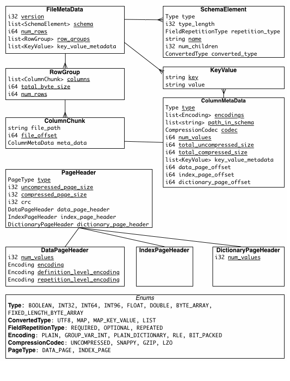

# Apache Parquet

## 1. 概览

Apache Parquet 是一个列存储格式，可用于 Hadoop 生态系统中的任一项目，不管其选择何种数据处理框架，数据模型和编程语言。

### 1.1 动机

为了给 Hadoop 生态系统中的项目提供压缩高效的列数据呈现，我们创造了 Parquet。

Parquet 是从头开始构建的复杂嵌套数据结构，使用了 Dremel 论文里描述的[记录分片及装配算法（record shredding and assembly algorithm）](https://github.com/julienledem/redelm/wiki/The-striping-and-assembly-algorithms-from-the-Dremel-paper)。我们相信这种方式比嵌套名字空间的简单扁平化更具优势。

Parquet 被构建以支持非常高效的压缩及编码模式（schemes）。多个项目已经证明了对数据采用正确的压缩及编码模式的性能影响。Parquet 允许在列级别指定压缩模式，从它们被发明及实现之日起就允许添加更多更多编码方式，因此基本是永不过时的。

Parquet 可被任何人使用。Hadoop 生态系统拥有丰富的数据处理框架，但我们并不偏向任意一个。我们相信一个高效的，良好实现的列存储底层对所有框架都是有用的，而且不用担心成本扩张以及复杂的使用依赖。

## 2. 概念
> 相关术语词汇表。

**块 (hdfs 块)**：这意味着 hdfs 中的一个块，在描述这个文件格式时其意义并无改变。这个文件格式设计用于在 hdfs　之上良好工作。

**文件**：一个 hdfs 文件必须包含这个文件的元信息。它并不需要实际包含数据。

**行组**：一个包含多行数据的逻辑水平分区。没有物理结构来确保一个行组。一个行组包含数据集针对每个列的列块（column chunk）。

**列块**：特定列的数据块。它们驻留于一个特定的行组，且在文件中确保使连续的。

**页**：列块细分成页。一个页是一个概念上不可分割的单元（基于压缩和编码来讲）。在一个列块中可能拥有多个交错的页类型。

层次上看，一个文件包含一个或多个行组。一个行组内每个列拥有一个列块。列块包含一个或多个页。

## 3. 文件格式
> 关于 Parquet 文件格式的文档。

文件和 thrift 定义应该一起阅读以了解其格式：
```
4-byte magic number "PAR1"
<Column 1 Chunk 1 + Column Metadata>
<Column 2 Chunk 1 + Column Metadata>
...
<Column N Chunk 1 + Column Metadata>
<Column 1 Chunk 2 + Column Metadata>
<Column 2 Chunk 2 + Column Metadata>
...
<Column N Chunk 2 + Column Metadata>
...
<Column 1 Chunk M + Column Metadata>
<Column 2 Chunk M + Column Metadata>
...
<Column N Chunk M + Column Metadata>
File Metadata
4-byte length in bytes of file metadata
4-byte magic number "PAR1"
```

在上面的例子中，表中有 N 个列，被划分进 M 个行组。文件元信息包含所有列元数据开始位置的信息。关于元信息包含什么的具体细节可以在 thrift 文件里找到。

元信息在数据之后被写入以允许单程写入。

**读取器期望首先读入文件元信息以找到它们感兴趣的所有列块。列块其后应该顺序读入**。

文件格式显式设计以分隔元数据和数据本身。这允许将列划分进多个文件，同时有一个单一元数据文件以引用多个 Parquet 文件。


### 3.1 配置

**行组大小**

更大的行组允许更大的列块，这使得更大的序列 IO 成为可能。更大的组同时需要在写入路径（或双道写入）上更大的缓存。我们推荐大的行组（512MB - 1GB）。因为整个行组可能需要被读入，我们期待它完美匹配一个 HDFS 块（HDFS block）。如此，HDFS 块大小也应该被调高。一个优化的读设置应该是： 1GB 行组, 1GB HDFS 块大小, 每 HDFS 文件1个 HDFS 块。

**数据页大小**

数据页应该被是为不可分的，因此更小的数据页允许更精细的读取（例如单行查询）。更大的页大小带来更小的空间消耗（更小的页头部）及潜在的更小的解析负荷（处理头部）。注意：对顺序扫描，并不期待一次读入一个页面，这并不是 IO 块，我们推荐 8KB 页大小。

### 3.2 扩展性（Extensibility）

格式中有很多地方可以做兼容性扩展。

- 文件版本：包含一个版本的文件元信息。
- 编码：编码通过枚举指定。将来肯定会有更多编码方式加入。
- 页类型：额外的页类型可被加入并安全地跳过。

### 3.3 元数据

有三种类型的元数据：文件元数据，列（块）元数据，页头元数据。所有 thrift 结构使用 TCompactProtocol 进行序列化。



### 3.4 类型

文件格式所支持的类型设计为尽可能少，关注它们于磁盘存储的影响。例如，16-位整型数在存储格式中并不支持，其原因在于32-位整型数可以通过高效编码包含它。这降低了实现读写这个格式（文件）的复杂性。这些类型包括：
```
BOOLEAN: 1位 boolean
INT32: 32位有符号整型数
INT64: 64位有符号整型数
INT96: 96位有符号整型数
FLOAT: IEEE 32-位浮点数
DOUBLE: IEEE 64-位浮点数
BYTE_ARRAY: 任意长字节数组
```

### 3.4.1 逻辑类型

通过指定基础类型如何被解释，逻辑类型可用于扩展 parquet 可以用于存储的类型。这可以保持基础类型尽可能小，并复用 parquet 的高效编码。例如，字符串被存储为添加了 UTF8 注解的字节数组。这些注解定义了如何记忆不解码和解释数据。注解在文件元信息中被存储为一个 ConvertedType，并在 LogicalTypes.md 中被解释。

### 3.5 嵌套编码

为了编码嵌套列， Parquet 使用了带定义和重复级别的 Dremel 编码。定义级别指定了在列路径上有多少可选字段被定义了。重复级别指定了路径上什么指定重复字段拥有重复值。最大的定义及重复级别可以从模式（schema ）计算得到（例如，有多少嵌套），它定义了最多需要多少位类存储级别（级别用于定义列上的所有值）。

对于级别有两种支持的编码方式 ：BITPACKED 和 RLE。当前只有 RLE 被使用，它被用来代替 BITPACKED。

### 3.6 数据页

对于数据页，在数据页头之后，有三部分信息被连续编码。我们有：

- 定义级别数据
- 重复级别数据
- 编码值
在头部指定的大小时包括三部分的。

基于模式定义，数据页中的数据通常是必须的。定义个重复级别时可选的。如果列不嵌套（例如，列路径长度为1），我们就必须要编码重复级别（其值永远为1）.对于必须的数据，定义级别可以被跳过（如果定义的话，它总是拥有最大定义级别值）。

例如，在列非嵌套且必须的场景下，页中的数据就仅有编码数据。

支持的编码在 `Encodings.md` 中描述。

#### 3.6.1 编码

#### 3.6.2 校验和

#### 3.6.3 列块

#### 3.6.4 错误恢复

### 3.7 Nulls

Nullity 在定义级别编码（它是运行长度编码），NULL 值并不在数据中编码。例如，在一个非嵌套模式，一个带有一千个 NULL 列将会在定义级别以运行长度编码（0，1000次），而没有其它的。

## 4. 开发者指南

这一节包括 Parquet 相关的开发者特定的文档。

### 4.1 模块

[parquet-format](https://github.com/apache/parquet-format)项目包括格式规范和正确读取 Parquet 文件所需元信息的 Thrift 定义。

[parquet-mr](https://github.com/apache/parquet-mr)项目包括多个子模块，它实现了读写嵌套的面向列数据流的核心组件，将核心映射至 parquet 格式，提供 Hadoop Input/Output 格式，Pig 加载器，以及与 Parquet 交互的其它基于 Java 的工具。

[parquet-cpp](https://github.com/apache/parquet-cpp)项目是一个用于读写 Parquet 文件的 C++ 库。

[parquet-rs](https://github.com/apache/arrow-rs/tree/master/parquet)项目一个用于读写 Parquet 文件的 Rust 库。

[parquet-compatibility](https://github.com/Parquet/parquet-compatibility)项目（废弃）包括兼容性测试，可被用于通过读写各自的文件来验证不同语言实现，截至 2022 一月兼容性测试仅仅存在最高 1.2.0 版本。

### 4.2 构建 Parquet

构建 Java 资源可以使用 `mvn package`。当前稳定版本应该在 `Maven` 仓库里永远可用。

C++ thrift 资源可以通过 `make` 生成。

Thrift 也可以通过代码生成产生其它 thrift 支持的语言的资源。

### 4.3 对 Parquet 做贡献

> 如何对 Parquet 做贡献。

#### 4.3.1 Pull 请求

我们喜欢以 GitHub pull 请求的形式收到贡献。请对 [github.com/apache/parquet-mr](https://github.com/apache/parquet-mr) 仓库提交 pull 请求。如果你以前从旧的地址 `fork Parquet` 过，那么你需要添加远程地址或更新你的 `origin remote` 至 `https://github.com/apache/incubator-parquet-mr.git`。下面时一些提交你的贡献的小技巧：

1. 尽可能将你的工作分割为小的，单一目的的补丁。合并一个包含多个不相关特性的大的修改想染要困难得多。
2. 在 [Parquet Project JIRA](https://issues.apache.org/jira/browse/PARQUET) 为你的补丁创建一个 JIRA。
3. 以 `GitHub pull request` 的形式将你的补丁提交至主分支。关于教程，可以参考 GitHub 关于克隆一个仓库并发布 `Pull` 请求的指南。你的 pull 请求名应该以 `JIRA` 名开头（例如：https://github.com/apache/parquet-mr/pull/5）。
4. 确保你的代码通过了单元测试。你可以在项目根目录下通过 `mvn test` 运行测试。
5. 为你的代码添加新的单元测试。
6. 所有的 Pull 请求在 [GitHub Actions](https://github.com/apache/parquet-mr/actions) 上会自动测试。[TravisCI](https://travis-ci.org/github/apache/parquet-mr)也被用于在 `ARM64 CPU` 架构上运行测试。

如果你打算报告一个缺陷但没有时间解决它，你仍可以将它提交至 [issue tracker](https://issues.apache.org/jira/browse/PARQUET)，或者发邮件至 dev@parquet.apache.org。

#### 4.3.2 提交者

合并 pull 请求需要成为项目的提交者。

如何合并一个 pull 请求（拥有一个 apache 和 github-apache 设置）：
```
git remote add github-apache git@github.com:apache/parquet-mr.git
git remote add apache https://gitbox.apache.org/repos/asf?p=parquet-mr.git
```

运行下面的命令：
```
dev/merge_parquet_pr.py
```

示例输出：
```
Which pull request would you like to merge? (e.g. 34):
```

输入 pull 请求号（从 `https://github.com/apache/parquet-mr/pulls` ）并回车：
```
=== Pull Request #X ===
title   Blah Blah Blah
source  repo/branch
target  master
url https://api.github.com/repos/apache/parquet-mr/pulls/X

Proceed with merging pull request #3? (y/n):
```

如果看起来正常，输入 `y` 并回车：
```
From gitbox.apache.org:/repos/asf/parquet-mr.git
* [new branch]      master     -> PR_TOOL_MERGE_PR_3_MASTER
Switched to branch 'PR_TOOL_MERGE_PR_3_MASTER'

Merge complete (local ref PR_TOOL_MERGE_PR_3_MASTER). Push to apache? (y/n):
```

一个带有合并的本地分支以及被创建，输入 `y` 并回车以把它推送至 apache 主分支：
```
Counting objects: 67, done.
Delta compression using up to 4 threads.
Compressing objects: 100% (26/26), done.
Writing objects: 100% (36/36), 5.32 KiB, done.
Total 36 (delta 17), reused 0 (delta 0)
To gitbox.apache.org:/repos/asf/parquet-mr.git
   b767ac4..485658a  PR_TOOL_MERGE_PR_X_MASTER -> master
Restoring head pointer to b767ac4e
Note: checking out 'b767ac4e'.

You are in 'detached HEAD' state. You can look around, make experimental
changes and commit them, and you can discard any commits you make in this
state without impacting any branches by performing another checkout.

If you want to create a new branch to retain commits you create, you may
do so (now or later) by using -b with the checkout command again. Example:

  git checkout -b new_branch_name

HEAD is now at b767ac4... Update README.md
Deleting local branch PR_TOOL_MERGE_PR_X
Deleting local branch PR_TOOL_MERGE_PR_X_MASTER
Pull request #X merged!
Merge hash: 485658a5

Would you like to pick 485658a5 into another branch? (y/n):
```

现在进需要说 `n` ，因为我们已经哟了一个分支。

#### 4.3.3 网站

##### 发布文档

为了给 `parquet-format` 创建一个新的发布文档，在 `content/en/blog/parquet-format` 下创建一个新的 `.md` 文件。可以参考该目录下已有的文件作为参考。

为了给 `parquet-mr` 创建一个新的发布文档，在 `content/en/blog/parquet-mr` 下创建一个新的 `.md` 文件。可以参考该目录下已有的文件作为参考。

##### 网站开发和部署

**Staging**

为了对网站的 Staging 版本做修改：

1. 在仓库中对 `staging` 分支做一个 `PR`
2. 一旦该 PR 被合并，[部署工作流](https://github.com/apache/parquet-site/blob/staging/.github/workflows/deploy.yml)中的构建和部署 Parquet 站点的工作将运行，并将仓库中最近的文件合并进 `asf-staging` 分支。

不要在仓库中直接修改 `asf-staging` 分支。

**Production**

为了对网站的 `production` 版本做修改：

1. 在仓库中对 `production` 分支做一个 `PR`
2. 一旦该 PR 被合并，[部署工作流](https://github.com/apache/parquet-site/blob/production/.github/workflows/deploy.yml)中的构建和部署 Parquet 站点的工作将运行，并将仓库中最近的文件合并进 `asf-staging` 分支。

不要在仓库中直接修改 `asf-staging` 分支。

### 4.4 发布 Parquet

#### 4.4.1 设置

#### 4.4.2 发布流程

#### 4.4.3 投票通过之后的发布

## 5. 资源

## Reference
- [Apache Parquet](https://parquet.apache.org/docs/overview/)
- [parquet-format](https://github.com/apache/parquet-format)
- [parquet学习总结](https://www.jianshu.com/p/b823c727fe46)
