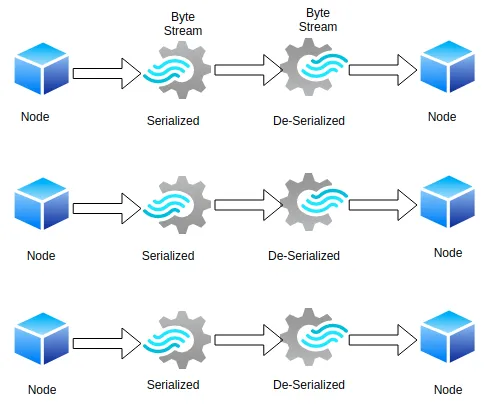

## Apache Spark: All about Serialization

关于你可以如何调优你的 Spark Jobs 以提升性能的概述。



在分布式系统中，网络数据传输时最常见的任务。如果它不能被高效处理，你可能会最终面临很多问题，比如高内存使用率，网络瓶颈，以及性能问题。对任何分布式应用的性能，序列化都扮演了非常重要的角色。

### 序列化

序列化指将对象转化为字节流或反之（反序列化）并以一种最优的方式跨网络节点传输，或将其保存于文件或内存缓冲。

Spark 提供了两种序列化库支持，并通过 `spark.serializer` 属性来配置其模式。

#### Java 序列化（默认）

Java 序列化是驱动器运行起来后 Spark 默认使用的序列化。Spark 使用 Java 的 `ObjectOutputStream` 框架来序列化对象。一个类的序列化能力是通过让泪继承 [java.io.Serializableh](ttps://docs.oracle.com/javase/8/docs/api/java/io/Serializable.html) 接口来开启的。没有实现这个接口的类将没有任何状态需要序列化或反序列化。一个可序列化类的子类可自行决定是否支持序列化。

一个类绝不会序列化，只有一个类的对象可被序列化。Java 序列化很慢，类如果很多则导致大量的序列化格式。我们可以通过扩展 [java.io.Externalizable](https://docs.oracle.com/javase/8/docs/api/java/io/Externalizable.html) 来调优性能。

#### Kryo 序列化（Spark 推荐）

```
public class KryoSerializer
extends Serializerimplements Logging, java.io.Serializable
```

[Kryo](https://github.com/EsotericSoftware/kryo) 是一个 Java 序列化框架，它关注速度，效率，以及用户友好的 API。它拥有更少的内存占用，这在你做 `shuffling` 以及缓存大量数据时很重要，但它并不原生支持序列化到磁盘。两种方法，RDD 的 `saveAsObjectFile` 和 SparkContext 的 `objectFile` 方法只支持 Java 序列化。

由于自定义注册以及手动配置的需求，Kryo 不是默认的序列化。

#### 默认序列化器（Default Serializer）

当 Kryo 序列化一个对象时，它创建了之前注册的 `Serializer` 类的一个实例来做字节转换。默认序列化器从用户端无需任何设置即可使用。

#### 自定义序列化器（Custom Serializer）

为了对序列化过程是假更多控制，Kryo 提供了两种选项，我们可以编写自己的序列化器类并在 Kryo 上注册，或者让这个类自己处理序列化。

让我们看看在我们的应用中如何 Kryo 以使用它：

```
val conf = new SparkConf()
.set("spark.serializer", "org.apache.spark.serializer.KryoSerializer")
.set("spark.kryoserializer.buffer.mb","24")

val sc = new SparkContext(conf)val sc = new SparkContext(conf)
```

```
val spark = SparkSession.builder().appName(“KryoSerializerExample”) 
.config(someConfig)
.config(“spark.serializer”, “org.apache.spark.serializer.KryoSerializer”)
.config(“spark.kryoserializer.buffer”, “1024k”) 
.config(“spark.kryoserializer.buffer.max”, “1024m”)
.config(“spark.kryo.registrationRequired”, “true”)     // make sure by every class is registered
.getOrCreate()
```

缓存大小用于持有你将序列化的最大对象，它应该足够大以获取最优性能。KryoSerializer 是 spark 提供的一个帮助类以方便使用 Kryo。我们创建了 KryoSerializer 的单个实例并在配置中为其配置需要的缓冲大小。

### Databricks 避免序列化问题的指南

下面是 Databricks 做出的一些避免序列化问题的指南：

- 使对象/类可序列化
- 在 lambda 函数里声明实例
- 在对象里声明尽可能多的函数
- 在函数里重新定义构造函数提供的变量


### Reference

- [Apache Spark: All about Serialization](https://dzone.com/articles/apache-spark-all-about-serialization)
- [Spark Tuning](https://spark.apache.org/docs/latest/tuning.html)
- [kryo](https://github.com/EsotericSoftware/kryo)