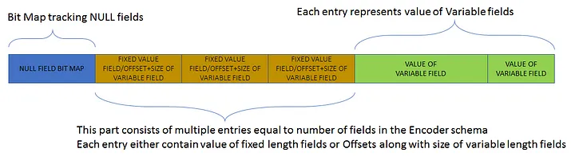
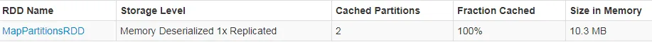
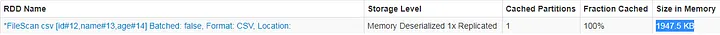

## Apache Spark Dataset Encoders 解密

Encoders 就像 `Spark Dataset APIs` 的秘密酱汁，后者正成为 `Spark Jobs` 的默认范式。本文将试着揭秘其基本要素。

在 Spark 中 RDD, Dataframe 和 Dataset 是一个数据记录集合的不同表现形式，并且每一种都有一套自己的 `API` 以在集合上执行期待的转换和行动（transformations and actions ）。在这三者中，RDD 是最老的且最基础的表现形式，而 Dataframe 和 Dataset 在 `Spark 1.6` 中引入。

但是，随着 `Spark 2.0` 的发布，在编写 `Spark Jobs` 时在 Spark 程序员中 Datasets 的使用已经成为默认标准。Dataframe（将记录集合表示成表格形式）的概念在　`Spark 2.0`　中与 Dataset 合并。在 `2.0` 中，一个 Dataframe 仅仅时某种类型的 Dataset 的一个别名。 Dataset 的流行源自以下事实，它被设计合并了 RDD 和 Dataframe 世界的优点，即 RDDs 的灵活性及编译器类型安全，以及 Dataframes 的效率及性能。

Dataset 概念的中心在于为 Dataset 提供了超过 RDDs 的存储及执行效率的一个 Encoder 框架。理解这个 `encoder` 框架对于编写和调试基于 Dataset 的 Spark Jobs 非常重要。由于每个 Dataset 必须与一种类型关联，当一个特定类型的 Dataset 被创建时（从一个文件，一个内存中的对象集合，RDD, 或者一个 Dataset），必须在 Dataset 创建 API 里指定一个对应的相同类型的 Encoder。但是，`encoder` 规范在某些场景下可能不明显，例如装箱基本类型。

> 特定类型的 encoder 将一个 Java 对象（encoder 类型）或者一个数据记录（遵从 encoder 类型的数据模式）编码成由原始内存支撑的二进制格式或者反之。Encoders 是 Spark tungusten 框架的一部分。由于是原始内存支撑，从编码过的二进制文本更新或查询相关信息需要通过 `Java Unsafe APIs`。

Spark 提供了泛型 Encoder 接口以及一个泛型实现 [ExpressionEncoder](https://jaceklaskowski.gitbooks.io/mastering-spark-sql/spark-sql-ExpressionEncoder.html)。这个 encoder 通过表达式编码及解码（也可以被理解为序列化及反序列化）一个 JVM 对象（类型 T）。进一步，有一个可用的工厂 Encoders。

> Encoders 工厂 为类型提供储存优化过的 ExpressionEncoders，例如 Java 装箱基本类型（Integer, Long, Double, Short, Float, Byte, 等）， String, Date, Timestamp, Java bean 等。进一步，工厂提供了基于 ExpressionEncoder 的泛型 Java/Kryo 序列化，它可以用于任何类型，因此 Encoders 可以为任何不被存储优化的  ExpressionEncoder 覆盖的自定义类型创建。

下面是一个被声明为 TestWrapper 的 Java bean：

```
import java.io.Serializable;
import java.util.ArrayList;
import java.util.HashMap;
import java.util.Map;
public class TestWrapper implements Serializable {
	private static final long serialVersionUID = 1L; 
        private Map<String, String> zap;
	private ArrayList<String> strA;
	private String name;
	private String value;

	public String getName() {
		return name;
	}
	public void setName(String name) {
		this.name = name;
	}
	public String getValue() {
		return value;
	}
	public void setValue(String value) {
		this.value = value;
	}
	public Map<String, String> getZap() {
		return zap;
	}
	public void setZap(Map<String, String> zap) {
		this.zap = zap;
	}
	public ArrayList<String> getStrA() {
		return strA;
	}
	public void setStrA(ArrayList<String> strA) {
		this.strA = strA;
	}	
}
```

为这个 TestWrapper Java bean 存储及性能优化过的 ExpressionEncoder 被声明为：

```
ExpressionEncoder<TestWrapper> en = Encoders.bean(TestWrapper.class) 
```

TestWrapper 专用 ExpressionEncoder 也可使用 Java/kryo 序列化声明如下：

```
ExpressionEncoder<TestWrapper> en = Encoders.javaserialization(TestWrapper.class)

或

ExpressionEncoder<TestWrapper> en = Encoders.kryo(TestWrapper.class)
```

一旦 ExpressionEncoder 被创建，它可被用于编解码 TestWrapper 实例从/成二进制格式，如下所示：

```
TestWrapper tw = new TestWrapper()
/* To encode tw into binary format */
InternalRow row = en.toRow(tw)
/* To decode tw from binary format */
Seq<Attribute> attr = en.resolveAndBind$default$1();
TestWrapper tw = en.resolveAndBind(attrs, sparkSession.sessionState().analyzer()).fromRow(row);
```

InternalRow 抽象了存储编码二进制格式并暴露方法以查询及更新二进制格式里的字段，如下所示：

```
row.numFields() /* Outputs number of fields stored in the binary format */
row.getString(0) /* Outputs the value of the name field in the TestWrapper instance tw stored in the binary format row */
```

二进制格式里的字段数与特定 ExpressionEncoder 解析的模式一致。例如，当 Java bean ExpressionEncoder 用于 TestWrapper 时字段数目为 4，但当基于 Java/kyro 序列化器的 ExpressionEncoder 被使用时，字段数将为 1。

> 在基于序列化的 ExpressionEncoders 里，整个对象基于 Java 或 Kryo 序列化机制序列化的，序列化后的字节字符串在编码二进制格式中仅仅存为一个单一字段，因此它们缺乏存储效率，也不能从编码二进制格式直接直接查询对象的特定字段。

另一方面，

> 在基于 Java bean 的 ExpressionEncoders 里，bean 对象被映射进二进制格式，但只有字段被转换为二进制格式，由此带来两方面益处：存储效率以及独立字段的快速查询。因此，由复杂数据类型构成的 Datatsets，它应该总是以 Java bean 构造数据类型，且仅包含 Encoders 工厂支持的基于非序列化 ExpressionEncoders 的字段。

下面是一个 Encoder 输出的二进制格式图示：



如上所示，开头有一个 `NULL bitmap` 用于高效检测某些包含 `NULL` 值的字段。后面跟随一个固定长度项段，这里每个项对应一个字段，项的数目与字段数相等。每个项或者包含固定长度字段值，或者值的偏移（在可变段）及其长度。可变段在最后，它包含可变长度字段的值。

通过存储优化的 encoders 获得的空间节省可演示下：



                      Size of IN_MEMORY cached RDD



                      Size of IN_MEMORY cached Dataset

在上面的图示中，首先，一个创建自 1 Lakh Person bean（包含 Id, Name, Age）对象的 RDD 被缓存在内存里以测量其内存大小。其次，使用 bean encoder（ExpressionEncoder）基于同样的 1 Lakh Person bean 对象 创建一个 Dataset 并将其缓存在内存里以测量其内存大小。比较两者内存大小，Dataset 显然具有内存优势。

回忆一下，Encoders 赋予的3个明显优势造就了 Datasets 现在的辉煌：

存储效率：Dataset Encoder 为广泛使用的 Java 类型提供了存储效率。因此，Datasets 可被容易缓存在内存里以取得性能优势。同时，良好的二进制格式也带来 Datasets 在磁盘上的高效存储（不需要 JAVA/Kryo 序列化器）。

查询效率：由于数据字段的布局在 Encoder 的二进制格式里被很好地定义，数据字段可以直接从存储在磁盘上的高效二进制编码对象查询。另一方面，如果对象以序列化格式存储在磁盘，那么为了查询其字段，对象将不得不首先反序列化至内存，这是效率较低的。

Shuffle 效率：在 shuffle 过程中，数据对象被通过网络从一个分区被移动至另一个分区。这个移动通常需要通过 Java/Kryo 序列化器的数据序列化及反序列化。但是，因为 Dataset encoder 已经将对象编码为紧凑且定义良好的二进制格式，不再需要显式序列化。由于 Dataset encoders 存储效率由于传统序列化器，当 Dataset 执行宽转换时其 shuffle 数据量将比 RDDs 场景下少得多。shuffle 数据量的减少将带来 shuffle 阶段可靠性及性能的提高。

### Reference

- [Apache Spark Dataset Encoders Demystified](https://towardsdatascience.com/apache-spark-dataset-encoders-demystified-4a3026900d63)
- [Author Published Book](https://www.amazon.com/Guide-Spark-Partitioning-Explained-Depth-ebook/dp/B08KJCT3XN)