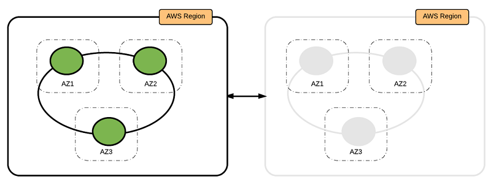

# Best Practices for Running Apache Cassandra on Amazon EC2
Apache Cassandra是广泛使用的高性能NoSQL数据库。当前在on-premises环境维护Cassandra的客户可能期待在[Amazon EC2](https://aws.amazon.com/ec2/运行Cassandra)以获取其弹性，可靠性，安全性及其经济型等收益。

Amazon EC2 和 [Amazon Elastic Block Store (Amazon EBS)](https://aws.amazon.com/ebs/) 提供了安全，可扩展的计算能力，以及AWS云端存储。当两者结合使用，你可以部署Cassandra，允许你根据你的需求缩放Cassandra系统的能力。考虑到可能的部署计数的数量，为你的用例选择一个最合适的战略并不总是很容易的。

本文中，我们将介绍3种Cassandra 部署选项，也提供了在下面这些领域根据你的用例决定你的最佳实践的指南。
- Cassandra 资源概览
- 部署考虑（Deployment considerations）
- 存储选项（Storage options）
- 网络（Networking）
- 高可用性和可靠性（High availability and resiliency）
- 可维护性（Maintenance）
- 安全性
## DynamoDB
在我们跳进在AWS运行Cassandra的最佳实践之前，我们应该提到我们有可多客户决定使用DynamoDB 而非维护自己的Cassandra集群。DynamoDB 是全托管的，无服务的，并且提供了跨区域，多master的复制，数据加密，以及托管的备份和恢复。与IAM的集成使得DynamoDB 的客户可以基于他们的数据安全需要而实现细粒度的访问控制。

几个已经运行大型Cassandra 集群多年的客户已经切换到DynamoDB--这消除了管理Cassandra集群和自己维护高可用性和持久性的复杂性。Gumgum.com就是这样的一个客户，它们切换到DynamoDB并观察到了客观的成本节省。更多细节，请参考[Moving to Amazon DynamoDB from Hosted Cassandra: A Leap Towards 60% Cost Saving per Year](http://techblog.gumgum.com/articles/moving-to-amazon-dynamodb-from-hosted-cassandra)。
## Cassandra 资源概览
这里是标准Cassandra 资源的一个简短介绍，以及它们在AWS的基础设施下如何实现。如果你已经对Cassandra 和AWS部署熟悉，它们可作为一个知识更新：
资源|Cassandra|AWS
--------|--------|--------
集群|一个简单的Cassandra部署。这通常包括多个物理位置，keyspaces和物理服务器|AWS 上一个逻辑部署构造，映射到一个[AWS CloudFormation](https://aws.amazon.com/cloudformation) StackSet，它包含一个或多个CloudFormation 栈以部署Cassandra
Datacenter|医嘱节点配置为一个单独复制组|AWS 上一个逻辑部署构造。一个数据中心是用一个CloudFormation 栈部署的，包含EC2实例，网络，unchu以及安全资源。
机架（Rack）|服务器集合。一个数据中心至少包含一个机架。Cassandra 努力将数据副本放置到不同的机架|一个单独的可用区
服务器/节点|一个运行Cassandra 软件的物理或虚拟机|一个AWS EC2实例
令牌（Token）|概念上，集群管理的数据以一个环形表示。换进一步被分成与节点数相当的范围。每个节点负责维护一个或多个范围。每个节点被指定一个Token。它是从范围里的一个随机数。Token值决定了节点在环上的位置以及它负责的范围|Cassandra内部管理
虚拟节点（vnode）|负责存储一定范围的数据。每个vnode接受环上的一个Token。一个集群（默认地）含有256个Token，它平均分布到Cassandra 数据中心的所有服务器上|Cassandra内部管理
复制因子|跨集群的副本数|Cassandra内部管理
## 部署考虑
将Cassandra 部署到Amazon EC2上的众多收益中的一个就是你可以自动化你的很多部署任务。另外，AWS包含一些服务如CloudFormation，它允许你描述和规定你的云端基础设施资源。

我们建议用一个CloudFormation 模板编排一个Cassandra环。如果你在多个AWS区域中部署，你可以使用一个CloudFormation StackSet来管理这些栈。所有这些维护操作（缩放，升级和备份）都可用AWS SDK脚本化。
### 部署模式（Deployment patterns）
在本节我们讨论在Amazon EC2上部署Cassandra不同部署选项。一个成功的部署始于对这些选项的详细的思考。考虑你的巨大的数据量，网络环境，throughput，和可用性。
- 单AWS区域，3个可用区
- Active-Active，多个AWS区域
- Active-Standby，多个AWS区域
### 单AWS区域，3个可用区
在这个模式下，你把 Cassandra 集群部署到一个AWS区域的3个可用区上。整个集群只有一个环。通过利用3个可用区中的EC2实例，你可以确保副本在所有可用区中平均分布。
 

为了确保数据跨所有可用区平均分布，我们建议你在所有可用区平均分布EC2实例。集群中的EC2实例格式应为3（复制因子）的倍数。

该模式适用于应用制备部署到一个区域的场景，或者被部署到多个区域但出于数据隐私或法律需求需要数据被要求被部署到同一区域。

优势（Pros）|劣势（Cons）
--------|--------
高可用性，可忍受一个可用区失败|不能保护一种情形：该区域的许多资源在断断续续失败
部署简单|
### Active-Active，多个AWS区域
在这个模式下，你在两个区域部署两个环并连接它们。两个区域的VPC是[成对](http://docs.aws.amazon.com/AmazonVPC/latest/PeeringGuide/Welcome.html)的，所以数据可以在两个环间复制。

 

我们推荐两个区域的环在性质上保持一致，节点数一样，实例类型以及存储配置。

这种模式最适合使用Cassandra集群的应用被部署在多个区域上。

优势（Pros）|劣势（Cons）
--------|--------
failover时没有数据丢失|很高的操作负荷
高可用性，可容忍一个区域的许多资源在断断续续失败|第二个区域使成本翻倍
读写操作可被路由到本地区域以获取更低延迟及更高的性能|
### Active-Standby，多个AWS区域
在这个模式下，你在两个区域部署两个环并连接它们。两个区域的VPC是[成对](http://docs.aws.amazon.com/AmazonVPC/latest/PeeringGuide/Welcome.html)的，所以数据可以在两个环间复制。

 

但是，第二个区域不从应用哪里接受流量。它仅仅用作灾备恢复的第二数据中心。如果主区域不可用，它才开始接受流量。

我们推荐两个区域的环在性质上保持一致，节点数一样，实例类型以及存储配置。

这种模式最适合使用Cassandra集群的应用要求低的单点失效目标(RPO) 以及恢复时间(RTO)。

优势（Pros）|劣势（Cons）
--------|--------
failover时没有数据丢失|很高的操作负荷
高可用性，可容忍一个区域的失败或分区|写操作最终一致性读的延迟很高；第二个区域使成本翻倍
## 存储选项
在on-premises 部署中，Cassandra 部署使用本地磁盘来存储数据。对于EC2实例，我们有两种存储选择。
- [临时存储 (实例存储)](https://docs.aws.amazon.com/AWSEC2/latest/UserGuide/InstanceStorage.html)
- [Amazon EBS](https://docs.aws.amazon.com/AWSEC2/latest/UserGuide/AmazonEBS.html)

你的存储选择与你的Cassandra集群支持的负载类型紧密相关。实例存储对大多数通用Cassandra集群都工作的很好。但是，对于读负载较重的集群，Amazon EBS是一个更好的选择。

[实例](https://aws.amazon.com/ec2/instance-types/)类型的通常由存储类型驱动：
- 如果你的应用需要临时存储，一个存储优化的实例(I3) 是最佳选择
- 如果你的工作负载需要Amazon EBS, 最好选用计算优化的(C5) 实例
- 突发实例类型(T2) 不能为Cassandra 部署提供好的性能。
### 实例存储
临时存储是EC2的本地存储。它可能基于实例类型提供较高的IOPs。一个基于SSD的实例存储在I3实例上可以提供3.3MIOPS。这种高性能使它成为交易性或写密集型应用如Cassandra的理想选择。

一般来讲，实例存储建议用于支持交易的，大型或中等大小的Cassandra 集群。对于一个大的集群，读写流量呗平均分配到更多的节点上，所以一个节点的失效带来的影响更小。但是，对于小些的集群，失效节点的快速恢复是重要的。

作为一个例子，对一个100个节点的集群，一个节点的失效导致 3.33% 的数据丢失（复制因子为3）。类似地，对于提个10个节点的集群，一个节点的失效导致 33% 的性能损失（复制因子为3）。
选项|临时存储|Amazon EBS|Comments
--------|--------|--------|--------
IOPS（它意味着更高的查询性能）|I3上最高可达3.3M|80K/实例，10K/gp2/卷，32K/io1/卷|这导致每个节点上较高的查询性能。但是，Cassandra隐式地支持很好的横向扩展。一般来讲，我们建议首先选择横向扩展。接下来，垂直扩展来减轻特定问题。
AWS实例类型|I3|计算优化C5|无论横向或垂直扩展，能够基于CPU，内存选择不同的实例类型是一个很大的优势
备份恢复|自定义|AWS上已有可用的组件|Amazon EBS在此提供了独特的优势。只需要很小的工程量就可以建立一套备份恢复战略。a）如果实例失败，失败实例的EBS 卷可被新的实例挂载；b）如果EBS卷失败，数据可以从最后的snapshot上创建一个新的EBS卷恢复。
### Amazon EBS
EBS卷提供高可用性，IOPs 可基于你的存储需求配置。EBS卷还具备独特的优势在于其恢复时间。EBS卷可以支持最高每卷32K IOPS，在RAID 配置下每实例可以达到最高 80K IOPS。它们年化失败率 (AFR) 为0.1–0.2%，这使得EBS卷提供了比典型民用磁盘驱动器20倍的可靠性。

在Cassandra部署中使用Amazon EBS的主要优势在于当一个节点失败或被替换时能够降低数据传输的量。替换节点可以很快加入集群。但是，取决于你的数据存储要求Amazon EBS可能是更昂贵。

Cassandra 拥有内建的fault tolerance--通过跨可配置的节点复制数据到别的分区。它不仅能经受节点失败，而且如果一个节点失败，它可以通过从一个副本拷贝到新的节点来恢复数据。取决于你的应用，这可能意味着拷贝多大10G的数据。这可能给恢复过程带来额外的延迟，增加网络流量，进而影响Cassandra集群恢复时的性能。

Amazon EBS上存储的数据在一个实例失败或终止保持持久化。节点存储在EBS上的数据保持不变，并且EBS卷可被挂载到一个新的EC2实例上。被替换节点大部分副本数据已经在EBS 卷上，不需要通过网络从别的节点上拷贝。只有原先节点失败后发生的修改需要通过网络传送。这使得这个过程快的多。

EBS卷定期做快照。因此，如果一个卷失败，一个新卷可以从最后的好的快照创建出来，并被一个新的实例挂载。这比创建一个新的卷并拷贝数据到其上要快的多。

大部分Cassandra 安装使用复制因子为3，但是，Amazon EBS 为了fault tolerance使用自己的复制。实践中，EBS卷的可靠性是典型磁盘驱动的20倍。因此，有可能只使用复制因子2.这不仅节省成本，也可以在只有两个可用区的区域部署。

EBS 卷推荐用于读密集且需要大量数据存储的小的集群（更少的节点）。记住 Amazon EBS规划的IOPS 可能变得很贵。通用目的的[EBS卷](http://docs.aws.amazon.com/AWSEC2/latest/UserGuide/EBSVolumeTypes.html)当有适合性能需求的集群规模时工作的很好。
## 网络
如果你的集群可能收到较高的读写流量，选择一个能提供10Gb/s的[实例类型](https://aws.amazon.com/ec2/instance-types/)。作为一个例子， i3.8xlarge 和 c5.9xlarge 都提供了10–Gb/s的网络性能。同家族较小的实例类型拥有相对低的网络新能。

Cassandra 基于IP地址为每个节点产生一个UUID。这个UUID是为了在环上飞培vnodes。

**在一个AWS 部署上，当一个EC2实例被创建时自动赋予一个IP地址。伴随这个新的IP地址，数据分布改变了，整个环都必须再平衡**。这并不是期待的。

为了保留赋予的IP地址，随一个固定IP地址使用一个[第二弹性网络接口](http://docs.aws.amazon.com/AWSEC2/latest/UserGuide/using-eni.html#scenarios-enis)。在用一个新的EC2实例替换一个EC2之前，将第二网络接口从旧的实例上`detach` 下来，并将其附加到洗呢实例上。这种方式`UUID` 保持一致，数据在整个进群中的分布没有任何变化。

如果你在多个区域中部署，你可以使用[cross-region VPC peering](https://aws.amazon.com/answers/networking/aws-multiple-region-multi-vpc-connectivity/)连接在两个区域的VPCs。
## 高可用性和可靠性
Cassandra 设计就是当多个节点失效时fault-tolerant及高可用性的。在之前本文描述的模式下，你把Cassandra部署到3个可用区上，复制因子为3。即使它限制AWS 区域选择为要求至少3个或更多可用区，它通常提供了一个可用区失效的保护，以及单独一个区域网络分区的保护。本文前面描述的多区域部署可保护一个区域的许多资源在断断续续失败。

弹性通过基础架构自动化来确保。部署模式都需要对一个失效节点的替换。当一个区域整体失效时，但你部署为多区域选项时，流量可被导向活动区域，尽管同时失效区域证字恢复中。在不可预知的数据毁坏情况下，standby 集群可以利用存储在[AWS S3](https://aws.amazon.com/s3)的时间点备份恢复。
## 可维护性
在本节，我们将查看确保你的Cassandra 集群健康的方法：
- 缩放
- 升级
- 备份和恢复
### 缩放
Cassandra 可用过添加更多实例到环上来实现水平扩展。我们建议在以此扩展操作中把节点数增加一倍。这可以让数据跨可用区均匀地分布。类似地，当收缩时，最好对节点数简版来确保数据均匀分布。

Cassandra 可通过增加每个节点算力来实现垂直扩展。更大的实例类型拥有按比例更大的内存，使用自动化部署来用大的实例替换小的实例而无需服务断线或数据丢失。
### 升级
所有三种升级（Cassandra, 操作系统patching, 以及实例类型改变）遵从同样的滚动更新模式。

在这个过程中，你启动了一个新的EC2实例，安装软件并对其打patching。之后，从环上移掉一个节点。更多信息，请参见[Cassandra集群滚动升级](http://www.doc.ic.ac.uk/~pg1712/blog/cassandra-cluster-rolling-upgrade/)。接下来，你从环上一个运行的EC2实例上剥离其第二网络接口，并将其附在新的EC2实例上。从起Cassandra 服务并等待其同步。对集群中的所有集群重复上面的步骤。
### 备份和恢复
你的备份和恢复战略依赖于你的部署所使用的存储类型。Cassandra 支持快照和增量备份。当时用实例存储时，一个基于文件的备份工具工作得最好。用户通常使用rsync 或其它第三方产品来从实例拷贝到长期存储上。需要在集群的每个节点上重复上述过程以完成一个完整的备份。这些备份文件被拷贝到新实例以恢复。我们推荐使用S3来持久存储这些备份文件以作长期存储。

对基于Amazon EBS的部署，你可以开启[EBS卷自动快照](http://docs.aws.amazon.com/AmazonCloudWatch/latest/events/TakeScheduledSnapshot.html)，新的EBS卷可以从这些快照创建以作恢复。
## 安全性
我们推荐你考虑部署各个方面的安全性。第一步是确保数据时加密的（at rest）和 in transit，第二步是限制非授权用户的访问。更多安全问题，请参见[Cassandra文档](http://cassandra.apache.org/doc/latest/operating/security.html)。
### Encryption at rest
可通过对 EBS卷开启加密来实现Encryption at rest。Amazon EBS使用[AWS KMS](https://aws.amazon.com/kms)来加密。更多信息，请参见[AWS EBS 加密](http://docs.aws.amazon.com/AWSEC2/latest/UserGuide/EBSEncryption.html)。

基于实例存储的部署需要是用一个加密文件系统或者AWS合作伙伴的解决方案。
### Encryption in transit
Cassandra 使用TLS来加密客户与节点键通讯。
### Authentication
安全机制是可插拔的，这意味着你可以很容易地用一种认证方法替换另一种。你可以向Cassandra提供自己的认证方法，比如一个Kerberos ticket，或者如果你想将密码存储在一个不同的位置，比如LDAP 目录。
### Authorization
默认可插拔授权工具真`org.apache.cassandra.auth.Allow AllAuthorizer`，Cassandra也提供了基于角色的访问控制`(RBAC)`能力，它允许你查U那个键角色并把权限赋给这些角色。
## 结论 
在本文中，我们讨论了在AWS云上运行Cassandra的几种模式。它描述了如何管理在AWS EC2实例上运行的Cassandra 数据库。AWS 也提供了一些托管数据库，为了了解更多，可参见[你的应用需要的特定目的数据库](https://aws.amazon.com/products/databases/)。

## Reference
- [Best Practices for Running Apache Cassandra on Amazon EC2](https://aws.amazon.com/cn/blogs/big-data/best-practices-for-running-apache-cassandra-on-amazon-ec2/)