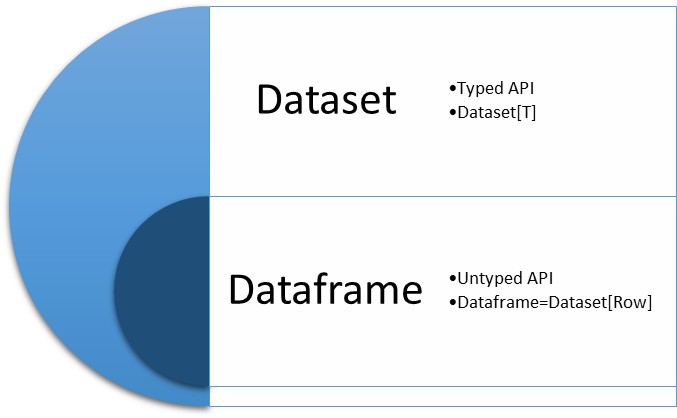

## Dataframe and dataset

Dataframes 在 `Spark 1.3` 中引入。Dataframe 架设在为数据提供模型的概念上。一个 RDD 基本上就包含原始数据，虽然它提供了各种各样的的函数以处理数据，但它作为一个Java 对象的集合，引入了垃圾收集和序列化的负担。Spark SQL 的概念只有当它包含数据模型时才能充分发挥作用。所以早期版本的 Spark 提供了另一个版本的 RDD， 名为 SchemaRDD。

### SchemaRDD

正如其名字所称的，它是个带模型的 RDD。由于它包含模型，除了运行基本 RDD 函数外，还可以运行关系查询。SchemaRDD 可被注册为一个表，可使用 Spark SQL 在其上执行 SQL 查询。它在早期版本的 Spark 上可用。但是，随着 `Spark Version 1.3` 的发布，SchemaRDD 被声明为废弃的，dataframe 则被引入。

### Dataframe

尽管是 SchemaRDD 的进化版本，`dataframe` 与 RDD 拥有巨大的差别。它是作为 `Tungsten` 项目的一部分被引入，这个项目允许数据在堆外以二进制格式存储。这帮助甩掉了垃圾收集的报复。

dataframe 自带随数据提供模型的概念（Spark 框架管理模型，在节点之间仅仅传递数据）。由于 Spark 理解模型，数据以二进制格式存储于堆外，没有必要使用 Java (或 Kryo) 序列化来编码数据，这同时减少了序列化的工作。

同时，`dataframe API` 引入了构建优化查询计划的概念，这能够被 `Spark Catalyst 优化器`执行。由于 dataframe 像 RDD 也遵从延迟计算，它允许在执行前创建一个优化的查询计划。最终，操作仅发生在 RDD 上，但它对用户透明。考虑下面的查询：

```
select a.name, b.title from a,b where a.id=b.id where b.title ='Architect' 
```

这里，数据首先将被过滤然后根据优化查询计划被连接，而不是连接表再基于 `title` 过滤数据。这帮助减少了网络 shuffle。

伴随这种领先，dataframe 也有其缺点。Dataframe 不提供编译器安全性，考虑下面来自 `Spark 1.6` 的 dataframe 示例：

```
JavaRDD<Employee> empRDD = jsc.parallelize(Arrays.asList(new Employee("Foo", 1),new Employee("Bar", 2))); 
SQLContext sqlContext = new SQLContext(jsc); 
 
DataFrame df = sqlContext.createDataFrame(empRDD, Employee.class); 
``` 

这里我们使用 `sqlContext` 创建了一个 Employee dataframe 对象，Employee 构造函数接受两个参数：`name`, `ID`。

> JavaBean 应该包含一个默认构造函数，并且可被序列化从而用作 RDD, dataframe, 或 dataset 的元素。

注意 DataFrame 不包含任何类型，为了过滤元素，一个过滤操作可在 DataFrame 上执行，如下所示：

```
DataFrame filter = df.filter("id >1"); 
``` 

这里，编译器没有选择，它无法识别过滤器指定中的列名是否存在。如果不存在，它将在运行时抛出异常。

dataframe 的另一个缺点在于它仅存在于 Scala 中，所有的 API 在 Java 或 Python 中不可用。

### Dataset

Dataset 自 `Spark 1.6` 引入，它是 RDD 的 dataframe 的合体。Dataset 带来了编译期安全，RDD 的面向对象编程风格，以及 dataframes 的优势。因此它是一个不可变的强类型对象，使用模型来描述数据。它使用高效堆外存储机制，Tungsten，创建优化查询计划--其被 Spark Catalyst 优化器执行。

Datasets 也引入了 encoders 的概念。Encoders 就像 JVM 对象和 Spark 内部二进制格式的翻译器。带模型的数据的表格化表达以 Spark 二进制格式存储。Encoders 允许序列化数据上的操作。Spark 提供了各种内建 encoders，以及一个针对 JavaBean 的 encoder API。Encoders 允许访问单独属性而无需对整个对象反序列化。今次，它减少了序列化的工作和负载。

#### 使用 encoders 创建 dataset

一个 dataset 可以使用 empRDD 如下创建：

```
Dataset<Employee> dsEmp = = sparkSession.createDataset(empRDD.rdd(), org.apache.spark.sql.Encoders.bean(Employee.class)); 
```

注意 dataset 是强类型对象。我们已经创建了一个 dataset 对象，其包含 `Employee` 元素。

我们可以在 dataset 上运行下面的操作来过滤 `ID > 1` 的员工：

```
Dataset<Employee> filter = dsEmp.filter(emp->emp.getId()>1);
filter.show();
``` 

dataset 的另一个优势是它提供了 Scala 和 Java APIs，它允许 Java 工程师利用 datasets 高效工作。

#### 使用 StructType 创建 dataset

在上一节，我们讨论了利用 encoders 的帮助从 RDD 创建 dataset。就像[第五节](https://learning.oreilly.com/library/view/apache-spark-2-x/9781787126497/23e3b1ef-5265-4c2f-836e-68b665361f91.xhtml)，与数据和存储共同工作，我们也讨论了从 `JSON`, `CSV`, 和 `XML` 文件创建 dataframes，`dataset (row)` 的别名的各种不同方式。这里有另一种方式，我们可以利用它动态创建一个模式，并由此产生一个 dataset (row)。第一步涉及到使用类 RowFactory 的工厂模式方法将 `RDD(T)` 转化为 `RDD(row)`。然后我们识别出数据里的字段数，并创建一个 `StructType` 模式以代表 `RDD(row)` 的结构，然后将这个模式应用到 `SparkSession` 的 `createDataFrame` 方法上。

一个实例，假设我们有一个文本文件，其第一行代表列名，其它行代表数据：

```
//Create a RDD
JavaRDD<String> deptRDD = sparkSession.sparkContext()
                          .textFile("src/main/resources/dept.txt", 1)
                          .toJavaRDD();

//Convert the RDD to RDD<Rows>
JavaRDD<Row> deptRows = deptRDD.filter(str-> !str.contains("deptno")).map(new Function<String, Row>() {
  private static final long serialVersionUID = 1L;
  @Override
  public Row call(String rowString) throws Exception {
    String[] cols = rowString.split(",");
    return RowFactory.create(cols[0].trim(), cols[1].trim(),cols[2].trim());
  }
});

//Create schema
String[] schemaArr=deptRDD.first().split(",");
List<StructField> structFieldList = new ArrayList<>();
for (String fieldName : schemaArr) {
  StructField structField = DataTypes.createStructField(fieldName, DataTypes.StringType, true);
  structFieldList.add(structField);
}
StructType schema = DataTypes.createStructType(structFieldList);

Dataset<Row> deptDf = sparkSession.createDataFrame(deptRows, schema);
deptDf.printSchema();
deptDf.show();
``` 

### 统一 dataframe 和 dataset API

随着 Spark 2.x 的演化，dataframe 的无类型特征以及 dataset 的强类型特征被合并到 dataset。因此，基本上 dataframe 是泛型对象集合 dataset (row) 的一个别名，这里 row 是一个无类型 JVM 对象。在 Java 中，dataframe 被表示为 dataset (row)。dataframe 和 dataset 的统一允许我们以多种方式操作数据，如下所示：

- 使用强类型 API：Java 函数提供了操作 dataset 的类型安全性，也被称为类型转化。

```
dsEmp.filter(newFilterFunction<Employee>() {
  @Override
  publicboolean call(Employee emp) throws Exception {
    return emp.getEmpId() > 1;
  }
}).show();

//Using Java 8
dsEmp.filter(emp -> emp.getEmpId()>1).show();
```

- 使用无类型 API：一个无类型转换提供了像 SQL 的特定列名，可在数据上应用操作。

```
dsEmp.filter("empID > 1").show();
``` 

- 使用 DSL：Dataframes/dataset 为结构化数据操控提供了领域特定语言。在 Java 中，我们可以使用 `col()` 函数导入 Spark SQL 包 `org.apache.spark.sql.functions.col`，它提供了 dataframe 的无类型列名的静态类型函数。

```
dsEmp.filter(col("empId").gt(1)).show();
``` 



### Reference

- [Dataframe and dataset](https://learning.oreilly.com/library/view/apache-spark-2-x/9781787126497/a8284e5f-1db5-49d2-971e-67126c51160e.xhtml)