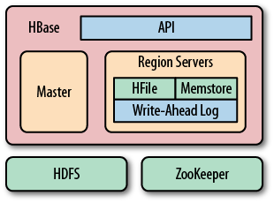
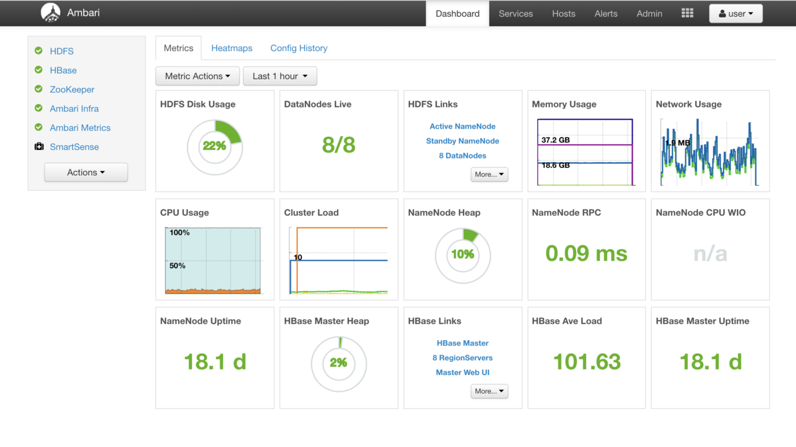
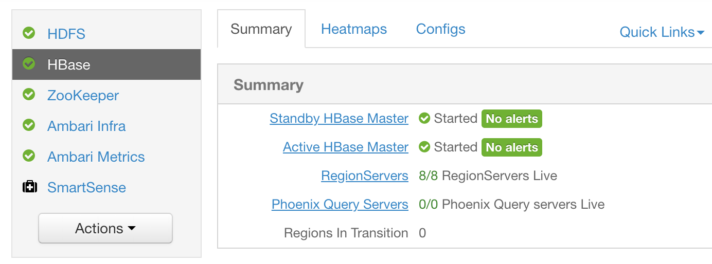
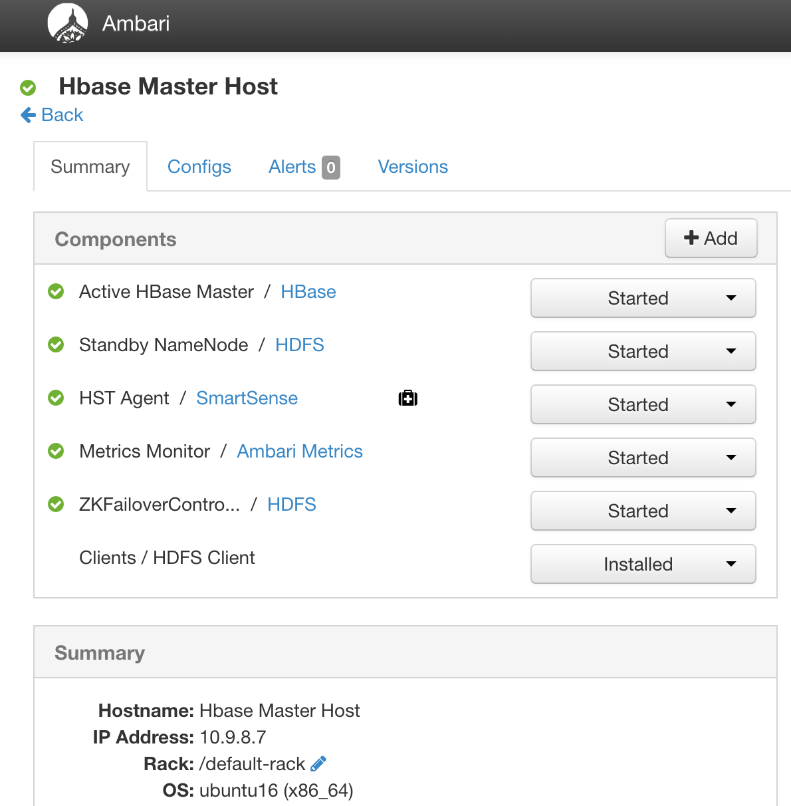
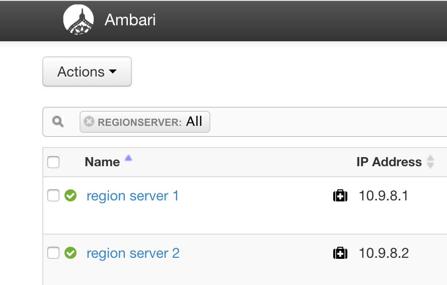
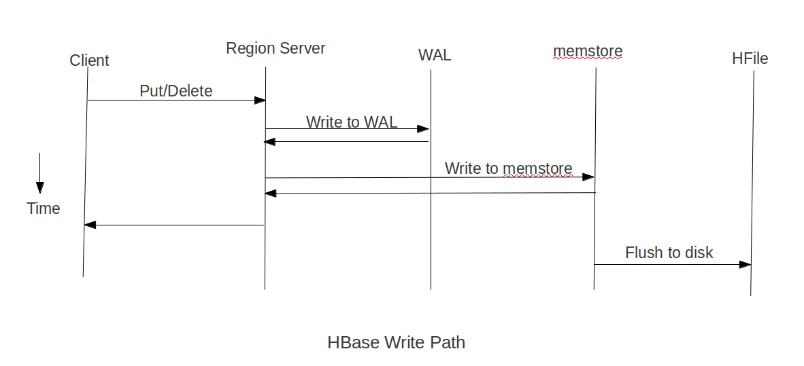
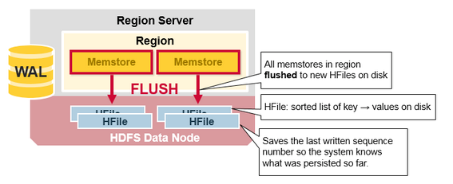
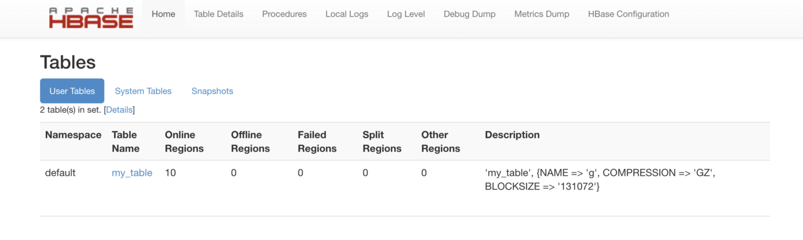
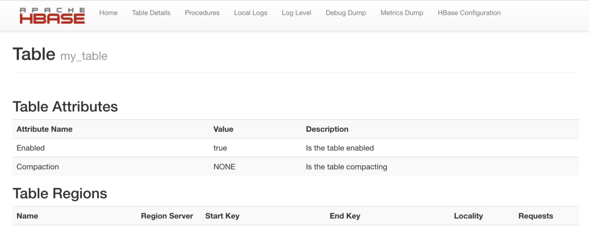

# HBase入门指南
这是一本为想了解一些Hbase以及内部运作的人准备的简单参考。

## 1. Ambari
Ambari console提供了HBase所有管理功能的一站式解决方案。首先，你得在一台服务器上安装Ambari console。它提供了管理HBase集群所有其它的功能，包括安装各种各样的组件，比如HBase, Ambari Metrics, HDFS, ZK等，添加或移除节点，重启一个节点，更改HBase进程配置等。

你可以参考这个[官方文档](https://docs.hortonworks.com/HDPDocuments/Ambari/Ambari-2.7.1.0/index.html)来获取所有Ambari How-Tos。
## 2. HBase
### 2.1 简介
HBase至此对你的大数据append-only，随机实时读写。

HBase是一个构建在Hadoop文件系统上的分布式面向列数据库。它是一个开源项目，支持水平扩展。你可以利用HBase创建巨大的稀疏表。

HBase数据模型与Google的BigTable相似，被设计用来提供对海量结构化数据的快速随机访问。它利用了Hadoop文件系统提供的容错性。它是Hadoop生态系统的一部分，用于提供对存储于Hadopp文件系统中的数据的随机实时读写访问。

你可以将数据直接存在HDFS中，也可存在HBase中。使用HBase数据的客户可以随机地访问它们。HBase位于HDFS文件系统上提供读写访问。

接下来将介绍HBase集群的主要组件，一个HBase组件概览如下图所示：


## 3. HBase Components
### 3.1 Ambari Console
正如上面提到，Ambari console用于监控和管理HBase集群。它运行在8080端口。
```
Link — http://<server_ip_where_ambari_is_installed>:8080/
```
下面是Ambari dashboard界面，在左手边，你可以根据你想监控，选取HDFS, HBase, Zookeeper等，你可以参考这个[链接](https://docs.hortonworks.com/HDPDocuments/Ambari/Ambari-2.7.1.0/index.html)来获取所有Ambari How-To。


### 3.2 Ambari Metrics/Grafana
它提供所有的图和指标，方便你调式HBase集群相关问题，确保你的集群运行健康。它和Ambari 运行在同一台服务器上，位于3000端口。
```
Link — http://<server_ip_where_ambari_is_installed>:3000/
```
你可以从[这里](https://docs.hortonworks.com/HDPDocuments/Ambari-2.7.1.0/using-ambari-core-services/content/amb_hbase_dashboards.html)找到HBase指标的所有文档，包括每个图代表什么。
### 3.3 HBase客户端
当客户端（Java或Python库）连接HBase读写时，客户端将首先连接HBase Master。HBase Master提供所有的RegionServer以及指派给它们的Region列表。Regions可以是随机的。它还提供所有Regions的起始和终止行键。

现在，当查询发生时，客户端将直接调用数据所在的RegionServer。当HBase高可用性（Hbase HA）开启时，可以还知道辅助RegionServer在哪里，当查询超时时可以再次调用它们。

当RegionServer停止或regions被指派给其它的RegionServer，不正确的Region异常就会发生，客户端再次查询HBase Master以获取正确的信息。然后客户端就可以发出正确的请求并获取数据。
### 3.4 HBase Master节点
HBase Master节点被称为管理RegionServer的编排器，它拥有所有的RegionServer和Region的信息。它拥有RegionServer和Regions的映射关系，以及其它一些重要的细节。

当RegionServer崩溃后，心跳超时，Master 就能检查到从这个RegionServer的心跳缺失，并把其所属Regions指派给其它可用的RegionServers。

Master借助HBase Zookeeper的帮助以实现这些功能。HBase Master Node Dashboard（运行在16010端口上）可以通过以下地址访问：http://<hbase_master_node_ip>:16010。你可以从左边菜单栏中的HBase标签栏选择 Active HBase Master链接来获取IP。



你可以在下面的“Summary”段中找到master节点的IP：



master节点dashboard提供所有的Region的信息，以及它们与RegionServer映射，一个RegionServer拥有多少Regions，每秒请求数，HBase表的信息等。
### 3.5 HBase Zookeeper
它可被视为HBase Master的持久化存储地。HBase Master做的任何事情，都会在此保存同样一份。
### 3.6 HBase Region Servers
RegionServers是任何读写的接触点，客户直接调用RegionServer以获取数据。因为客户端知道任一region驻留在哪个RegionServer上，所以客户端可以识别正确的RegionServer并调用它。每个RegionServer拥有很多指派给它的Regions，任何不在此Regions范围内的查询将导致IncorrectRegion异常。

一个RegionServer包含以下组件：
1. Memstore
2. Block cache
3. Write Ahead Log (WAL)

RegionServer和RegionServer本身并不持有实际数据，实际文件以H-Files的形式存储于HDFS中。它仅用作客户端和HFies的“中间人”。RegionServer维护了一个cache，叫作 BlockCache，它持有最近访问过的数据块（数据以块的形式存放于HFiles并以块的形式读取）。

类似地，对于写请求，数据先写入WAL，然后写入MemStore，然后客户端返回。当MemStore充满或者在一个固定的间隔，Memstore会以HFiles的形式刷写到HDFS。刷写后，因为数据现在存储在HDFS中，
刷写点之前的WAL数据不再需要，因此将被删除。

HBase RegionServers Dashboard（端口16030）可以通过地址`http://<server_ip_of_region_server>:16030/`访问。

你可以从左边菜单中选取HBase，然后选择RegionServers链接来获取其IP，该页面将列出所有的RegionServers及其IP地址。



RegionServer dashboard提供了有关RegionServer的以下统计值：每秒请求数, block cache大小, region数，块本地性等。
### 3.7 HBase Region Server Memstore
Memstore 是所有写操作都要经过的地方。无论何时一个RegionServer收到一个插入/更新请求时，它首先被添加到WAL，然后马上被写到MemStore并向客户端返回成功。

MemStore可被视为一个内存中有序HashMap。每个Region有一个MemStore。因此，一个RegionServer拥有的MemStore数目等同于它拥有的Region数。通常，一个MemStore为256M。

通常我们分配40%的内存给MemStore用。[这里](https://sematext.com/blog/hbase-memstore-what-you-should-know/)有一份关于MemStore的更详细的信息。
### 3.8 HBase Region Server Block Cache
就像Memstore，Block Cache是RegionD的读缓存。一个RegionServer只拥有一个Block Cache。Block Cache是读操作中首次查询发生地。如果它不在这里（缓存未命中），接下来查询将发生在HDFS（主要持久存储）中，接下来将数据存到Block Cache中并返回数据给客户。

Block Cache用于基于LRU的过期策略。通常我们分配整体40%的内存给Block Cache。剩下的20%给堆和HBase使用。
### 3.9 HBase Region Server Write Ahead Log(WAL)
WAL是写操作首先发生的地方。之后，写操作在MemStore中进行。WAL的目的是在RegionServer崩溃而MemStore里的数据丢失时，能提供左右的写（数据）。一个RegionServer只有一个WAL。

WAL缺省开启，你可以在查询基础上禁用它。阅读[这里](https://blog.cloudera.com/blog/2012/06/hbase-write-path/)可获取更多相关信息。 
### 3.10 HBase Region Server L2 Cache/堆外缓存（Off-Heap Cache）
这是Block Cache使用的辅助缓存。如果开启，在block cache之后，HDFS之前，这个缓存将会被检索。

另一个原因是在这里没有GC因此可以防止GC停顿。在一个JVM进程内，GC仅仅发生在主堆内存。进程（本例是HBase本身）管理GC，但不在通常JVM GC范围内。
### 3.11 HDFS
HDFS是主存储地，所有的数据皆存储于此。HDFS一般把数据以[顺序文件](http://blog.cloudera.com/blog/2011/01/hadoop-io-sequence-map-set-array-bloommap-files/)的格式存储，但HBase使用一种特殊结构的文件，即[HFiles](http://blog.cloudera.com/blog/2012/06/hbase-io-hfile-input-output/)，它允许HBase从HDFS文件存储里实时读写数据。
### 3.12 HDFS HFile
HFile是HDFS存储的数据的最终形式，当一个memstore刷写时，数据被转换成HFiles的形式并被涮写到HDFS文件系统中。两个过程major compaction 和 minor compaction发生，从而将多个HFiles合并成一个较大的文件。

一个HFile也不可更改。菲常简单地，一个HFile包括3部分：
1. 一个HFile — 数据所在的形式
2. 一个布隆过滤器 — 检查该Hfile是否拥有该数据
3. 一个索引：— 如果数据存在，给予索引取回块数据

详细的架构也在[这里](http://blog.cloudera.com/blog/2012/06/hbase-io-hfile-input-output/)。
### 3.13 HDFS Name Node
就像HBase的Master节点，存在针对HDFS数据节点（它存储实际数据）的管理服务器。它们负责维护HDFS服务器的可用性，数据复制，以及节点的启动已否等。

HDFS Name Node Dashboard (端口号50070) —  `http://<server_ip_of_name_node>:50070`

和region server master dashboard一样，dashboard提供了所有与HDFS DataNodes相关的数据，比如它们的IP地址，服务器配置，HDFS配置等。
### 3.14 HDFS Data Node
一个DataNode是实际数据以HFile格式驻留的主服务器。通常，数据复制副本数为3，这意味着糊了本节点外，在其他地方还有额外两份拷贝。这样任何数据通常有3份数据，冗余但可以满足失败-安全所需。

在这种场景下，当一个HDFS 数据节点失败时，这些拷贝可以确保数据任然可用。

HDFS Data Node Dashboard (端口50075) — `http://<server_ip_of_data_node>:50075`

这个dashboard提供了这个数据节点的信息，例如其磁盘大小等。
## 4. HBase Processes
### 4.1 读路径（Read Path）
简单描述，读路径如下：
+ 如果查询数据还未被刷写到HDFS（因此也不会处于BlockCache中），则第一轮查询发生在Memstore中；
+ 第二轮查询在BlockCache中
+ 第三轮查询发生在堆外缓存中（如果存在）
+ 第四轮查询发生在HDFS上（HFile）--从HFile读时，一个Region的所有文件都将被检查（通过HFile的布隆过滤器判断是否有可用数据）直至找到所需文件。然后，数据被借助于HFile的索引被访问。

更多细节请参看[这里](https://stackoverflow.com/questions/17346472/need-help-in-understanding-hbase-read-path)。
### 4.2 写路径（Write Path）
简单描述，写路径如下：
+ 首先，数据被写到WAL
+ 然后数据被写到Memstore
+ 当Memstore满时，数据被以HFile的形式写到HDFS上
  
下图是这个过程一个恰当的解释；



阅读这个[链接](http://blog.cloudera.com/blog/2012/06/hbase-write-path/)可以获取HBase写路径的更多细节。
### 4.3 Memstore Flushing
当一个RegionServer收到一个写请求时，它把请求导向到一个特定的Region。每个Region存储一个行集（row set），行数据可被分为多个列族。特定列族的数据被存在HStore里，它由MemStore和一系列HFiles构成。Memstore在RegionServer主存中，而HFiles被写到HDFS里。当一个写请求被处理时，数据首先写到Memstore。然后，当数据量达到某个阀值（显然，主存必须被很好地限制），Memstore数据被刷写到HFile。

使用Memstore的主要原因是需要在往HDFS存储数据时使其按行键排序。由于HDFS被设计用于顺序读写，不允许文件修改，HBase 不能有效地把新数据写到磁盘上：写的数据未曾排序（当输入是无序的时候），这也意味着未曾为将来的检索优化。为了解决这个问题，HBase将收到的数据缓存在内存里（Memstore），并在刷写前排序，接下来在写到HDFS时使用顺序写。注意在现实中HFile 不仅仅是一系列有序行，它的结构和功能比这复杂的多。

除了解决“无序”的问题，Memstore 也有其它好处，比如：
  + 它可用做一个内存缓存持有新加数据。当新写的数据访问比老数据访问更频繁时，在许多场合下它都是有用的。
  + 当内存中数据写入到持久存储时，可能对行/单元格作一定的优化。例如，对某一个列族的单元格如果配置成只保存一个版本，而Memstore收到某个单元格的多个更新，则仅仅最新一条数据被保存，其它老数据将被丢弃（它们永远不会被写入到HFile中）

重要的事情是每次Memstore的刷写都将为一个列族创建一个HFile。

请阅读下图以做参考：


#### 4.3.1 Minor Compaction
一天内有好几次，一个HBase内部进程被启动用来将多个小文件合并为大文件。这个过程不想Major Compaction那么强烈（intensive）。

你可以通过检查下面的链接（将IP和表名按你的实际情况修改）来查看Minor Compaction是否在运行：
```
http://<server_ip_of_region_server>:16010/table.jsp?name=<table_name>
```
另外，你可以按下面的步骤操作：
1. 打开HBase Master dashboard
2. 滚到到达Tables段
3. 点击你感兴趣的表名
   
4. 在“Table Attributes”段中检索“Compaction”。它应该是None（没有Compaction运行），MINOR（Minor Compaction），MAJOR（Major Compaction）--基于那时那种Compaction在运行。
   
#### 4.3.2 Major Compaction
Major compaction将每个Region的**所有小文件合并成一个大文件**。Major compaction后留下的HFiles总数取决于一个配置参数--它定义了Major compaction启动的最小HFiles数目。如果这个值设置为2，那么除非有超过2个HFiles存在，否则Major compaction不会发生，或最终Major compaction的输出为2个文件。

Major compaction使用了大量的资源，并影响集群读写，因此它应在在集群负载最小时进行。它由一个HBase的内部进程运行。你可以通过检查下面的链接（将IP和表名按你的实际情况修改）来查看Major Compaction是否在运行：
```
http://<server_ip_of_region_server>:16010/table.jsp?name=<table_name>
```
另外，你可以按下面的步骤操作：
1. 打开HBase Master dashboard
2. 滚到到达Tables段
3. 点击你感兴趣的表名
   
4. 在“Table Attributes”段中检索“Compaction”。它应该是None（没有Compaction运行），MINOR（Minor Compaction），MAJOR（Major Compaction）--基于那时那种Compaction在运行。
   

Major Compaction也修正数据本地性。Compaction后，数据（HFile）被移动到各自的数据节点，这些数据节点与它们映射到的RegionServer在同一节点上。

更多细节请参阅下面的[文章](http://blog.cloudera.com/blog/2013/12/what-are-hbase-compactions/)。 
### 4.4 Data Locality
Hadoop DataNode存储RegionServer管理的所有数据，所有的HBase数据存储于HDFS文件中。RegionServer与HDFS DataNodes搭配（collocated）以开启RegionServer所服务的数据的本地性（将数据放置在它需要的地方）。HBase数据刚写时是具备本地性的，但当一个Region被移动（一个Region被切分，HBase进程停止--无论重启/停止进程或进程崩溃）后，它就不再具有本地性直至Compaction。

NameNode维护者组成文件的所有无路数据块的元（metadata ）信息。

当一个读查询发生时，RegionServer查询Hadoop DataNode，如果数据不在本地，它就会发起一个网络调用以获取所需数据。（所有这些对HBase都是抽象的--它并不参与底层HDFS的具体工作。）
## 5. 高可用性配置要点（HBase HA Configuration Essentials）
为HBase读查询配置HBase高可用性，你需要做下面3个事情：
+ 开启HBase高可用性
+ 开启表高可用性
+ 开启客户端高可用性--在创建连接时传递高可用性配置
### 5.1 HBase HA read path
当开启高可用后，每个Region有一个为读查询而指定的辅助Region，这意味着辅助RegionServer也为辅助Region的读入而保持了block cache。因此，这是一个很公平的假设，即我们需要之前两倍内存量来用作block cache。

在HBase高可用性中，当从主Region读超时后，客户端对辅助RegionServer发起同样的调用。这确保了当主Region由于某些原因卡顿而不能回复时，我们可以有另一个RegionServer来处理我们的请求。

HA读是最终一致性读，这意味着你从辅助RegionServer读到的数据可能有点老旧。这种情况发生是因为在HA中，在主block cache发生的变化将会被一个内部进程复制到辅助block cache。因此，你可能因为某些延迟而读到旧数据。

可以进一步阅读[一致性读时间线](http://hbase.apache.org/book.html#arch.timelineconsistent.reads)。
### 5.2 HBase HA write path
写操作没有高可用性。写操作发生在指定的Region本身上，如果超时，你将不得不自己处理它们。因为HBase是一个一致性(CAP)数据库，HA的引入（像读操作）将引入最终一致性的行为，但写HA却不在此范围内。
### 5.3 HBase add Region Server/Data Node
我们可以通过Ambari添加一个新的RegionServer(Ambari → HBase → Region Servers → Actions → Add New Host)。当虚拟主机启动后，我们可以在Ambari中配置参数，Ambari将为我们设置该主机。

当该RegionServer被加入后，Master将在所有主机间均分所有的Regions。也因为新加入的RegionServer将会拥有来自从其它RegionServers的Regions，数据本地性将为0，搭配的HDFS将不得不通过网络调用来持久化数据。因此，延迟会升高一点。

通常，我们会在低流量时，major compaction之前做此操作，如此数据本地性可以在major compaction完成后得到更正。
### 5.4 HBase remove Region Server/Data Node
和添加RegionServer一样，我们可以通过以下步骤退役一个RegionServer（Ambari → HBase → Region Servers → 点击想被移除的RegionServer）。

你可以找到退役HDFS 和 HBase的选项。你可以在NameNode和HBase Master Dashboards监控进度。你也可检查RegionServer和DataNode Dashboards。

移除后，该RegionServer的Regions被指派给其它RegionServers。再一次，数据本地性将会被破坏，随之而来延迟也会有所升高。

本地性在Major Compaction完成后会回归正常。
#### 5.4.1 HBase Region Server Crash
当一个RegionServer崩溃时，WAL可被用来救急。因为WAL包含到现在为止所有的写操作，它们还未被刷写到HDFS上（以HFile的形式），它被通过Memstore回放--就像正常写操作一样。

在写的过程中遵从正常HBase写路径。值得注意的是，在WAL回放过程中，对应Regions是不能服务于读写请求的。恢复之后，Regions就可用了。请参阅下图以作参考：


更多信息请阅读[HBase Write Path](https://blog.cloudera.com/blog/2012/06/hbase-write-path/)，[Differences betweenWAL and MemStore](https://stackoverflow.com/q/40067933/820410)和[HBase Log Splitting](http://blog.cloudera.com/blog/2012/07/hbase-log-splitting/)。 
### 5.5 HDFS NameNode HA
请参阅以下文档：
+ https://hortonworks.com/blog/namenode-high-availability-in-hdp-2-0/
+ https://hadoop.apache.org/docs/current/hadoop-project-dist/hadoop-hdfs/HDFSHighAvailabilityWithNFS.html
+ https://www.cloudera.com/documentation/enterprise/5-8-x/topics/cdh_hag_hdfs_ha_config.html

## References
虽然我对上面提到的每一个主题都提供了对应链接，但我主要还是参考Hortonworks/Cloudera文档。
- https://medium.com/@pankaj.singhal/a-beginners-guide-to-hbase-1310f832aff7
- https://mapr.com/blog/in-depth-look-hbase-architecture/
- https://hbase.apache.org/book.html
- http://www.larsgeorge.com/search/label/hbase
- http://blog.cloudera.com/blog/category/hbase
- [HBase BlockCache简介](https://www.jianshu.com/p/64512e706548)
