## 分布式文件系统HDFS

### 1、分布式文件系统

#### 计算机集群结构

分布式文件系统把文件分布存储到多个节点（计算机）上，成千上万的计算机节点构成计算机集群。

分布式文件系统使用的计算机集群，其配置都是由普通硬件构成的，与用多个处理器和专用高级硬件的并行化处理装置相比，前者大大降低了硬件上的开销。

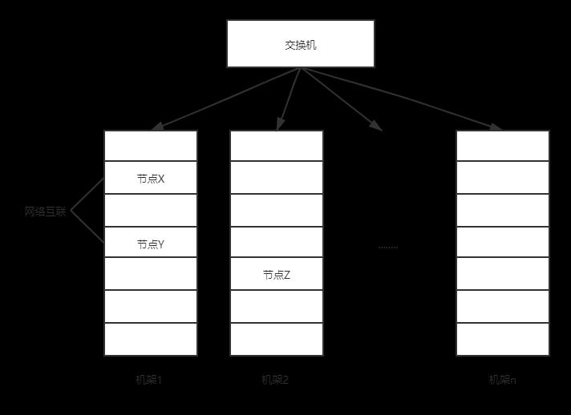

#### 分布式文件系统的结构

分布式文件系统在物理结构上是由众多阶段及节点构成的，而这些节点中分为两类。一类是主节点（Master Node），又被称为名称节点（NameNode），另一类是从节点（Slave Node），又被称为数据节点（DataNode）。

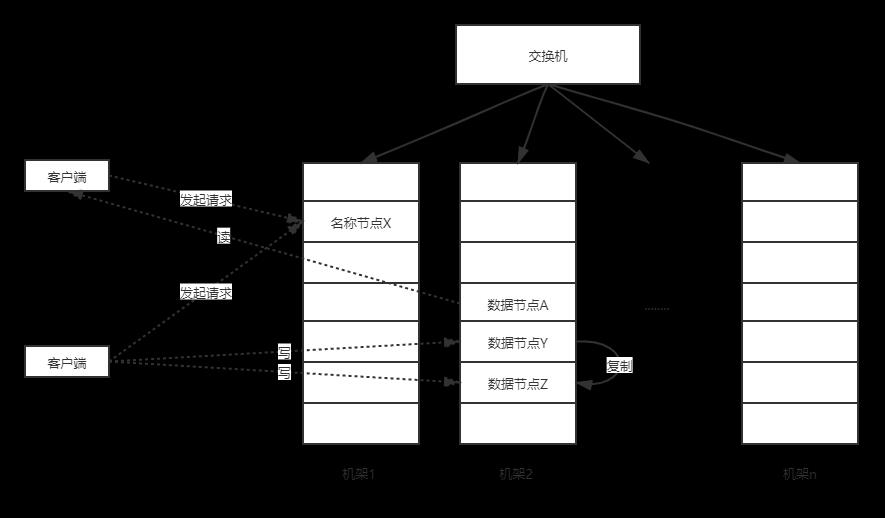

### 2、HDFS简介

官方用户指南：https://hadoop.apache.org/docs/stable/hadoop-project-dist/hadoop-hdfs/HdfsUserGuide.html

Hadoop 是由 HDFS 和 MapReduce 两大组件组成的，HDFS 全称为 `Hadoop Distributed File System`（Hadoop 分布式文件系统）。

它和现有的分布式文件系统有很多共同点。但同时，它和其他的分布式文件系统的区别也是很明显的。HDFS是一个高度容错性的系统，适合部署在廉价的机器上。HDFS能提供高吞吐量的数据访问，非常适合大规模数据集上的应用。

HDFS要实现的目标：

- 兼容廉价的硬件设备
- 流数据读写
- 大数据集
- 简单的文件类型
- 强大的跨平台兼容性

HDFS局限性：

- 不适合低延迟数据访问
- 无法高效存储大量小文件（与自身实现有关）
- 不支持多用户写入及任意修改文件

### 3、HDFS相关概念

#### 块

块”在HDFS中作为最小存储单位，默认一个块为 128 MB。在HDFS中，一个文件将会被分割成多个块，保存到各个数据节点。块的大小远远高于普通文件系统，可以最小化寻址开销。HDFS中抽象的块模型可以带来如下好处：

- 支持大规模文件存储：单个文件被分成若干个块，分别存储到若干个数据节点中，其文件大小不会受到单个节点容量的限制。
- 简化系统设计：文件块大小是固定的，可以很容易计算出一个节点中可以存储多少个文件块。方便了元数据的管理，元数据不需要和文件块一起保存，可以由其它系统负责管理元数据。
- 适合数据备份：每个文件块都可以冗余的存储到多个数据节点上，当一个节点数据出错时，就可以根据其他副本节点恢复数据。大大提高了系统的容错性与高可用性。

#### 名称节点（NAMENODE）和数据节点(DATANODE)

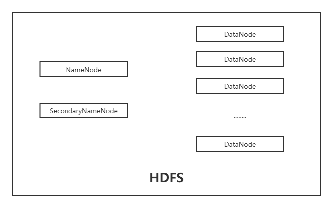

NameNode 与 SecondaryNameNode 同为“名称节点”。SecondaryNameNode 作为二级名称节点，它与 NameNode 的关系是：SecondaryNameNode 是 NameNode 的冷备份。

属性|功能|位置|内容
--------|--------|--------|--------
NameNode|存储元数据|元数据保存在内存中|保存文件、block、DataNode之间的映射关系
DataNode|存储文件内容|文件内容保存到磁盘|维护了block id到DataNode本地文件的映射关系

#### 名称节点的数据结构

在HDFS中，名称节点（NameNode）负责管理分布式文件系统的命名空间 （Namespace），保存了两个核心的数据结构，即FsImage和EditLog 。名称节点记录了每个文件中各个块所在的数据节点的位置信息。

- FsImage：用于维护文件系统树以及文件树中所有的文件和文件夹的元数据 。
- EditLog：操作日志文件，其中记录了所有针对文件的创建、删除、重命名等操作 。

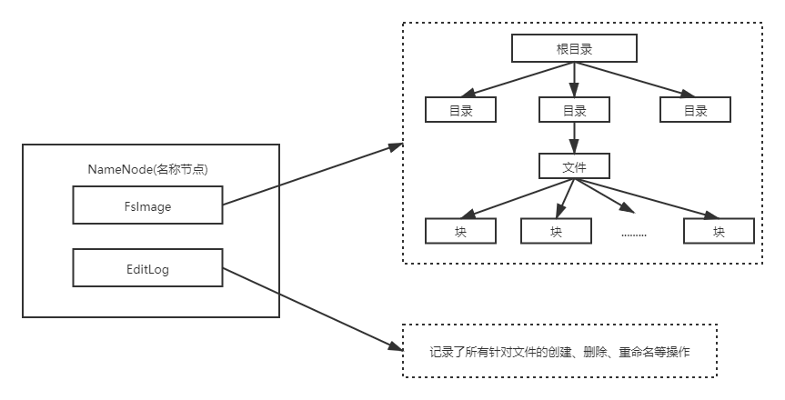

#### FSIMAGE

FsImage文件包含文件系统中所有目录和文件inode的序列化形式。每个inode是一 个文件或目录的元数据的内部表示，并包含此类信息：文件的复制等级、修改和访问时间、访问权限、块大小以及组成文件的块。对于目录，则存储修改时间、权限和配额元数据 。

FsImage文件没有记录块存储在哪个数据节点。而是由名称节点把这些映射保留在内存中，当数据节点加入HDFS集群时，数据节点会把自己所包含的块列表告知给名称节点，此后会定期执行这种告知操作，以确保名称节点的块映射是最新的。

#### 名称节点的启动

在名称节点启动的时候，它会将FsImage文件中的内容加载到内存中，之后再执行 EditLog 文件中的各项操作，使得内存中的元数据和实际的同步，存在内存中的元数据支持客户端的读操作。

一旦在内存中成功建立文件系统元数据的映射，则创建一个新的 FsImage 文件和一个空的 EditLog　文件。

名称节点起来之后，HDFS 中的更新操作会重新写到 EditLog 文件中，因为 FsImage 文件一般都很大（GB级别的很常见），如果所有的更新操作都往 FsImage 文件中添加，这样会导致系统运行的十分缓慢，但是，如果往 EditLog 文件里面写就不会这样 ，因为 EditLog 要小很多。每次执行写操作之后，且在向客户端发送成功代码之前， edits 文件都需要同步更新。

#### 名称节点运行期间 EDITLOG 不断变大的问题

在名称节点运行期间，HDFS 的所有更新操作都是直接写到 EditLog 中，久而久之， EditLog 文件将会变得很大 。

虽然这对名称节点运行时候是没有什么明显影响的，但是，当名称节点重启的时候，名称节点 需要先将 FsImage 里面的所有内容映像到内存中，然后再一条一条地执行 EditLog中的记录，当 EditLog 文件非常大的时候，会导致名称节点启动操作非常慢，而在这段时间内 HDFS 系统处于安全模式，一直无法对外提供写操作，影响了用户的使用。

名称节点运行期间 EditLog 不断变大的问题，如何解决？答案是：**SecondaryNameNode** 第二名称节点。

第二名称节点是HDFS架构中的一个组成部分，它是用来保存名称节点中对HDFS元数据信息的备份，并减少名称节点重启的时间。SecondaryNameNode一般是单独运行在一台机器上。

SecondaryNameNode 的工作情况：

1. SecondaryNameNode 会定期和 NameNode 通信，请求其停止使用 EditLog 文件，暂时将新的写操作写到一个新的文件 edit.new 上来，这个操作是瞬间完成，上层写日志的函数完全感觉不到差别。
2. SecondaryNameNode 通过HTTP GET方式从 NameNode 上获取到 FsImage 和 EditLog 文件，并下载到本地的相应目录下。
3. SecondaryNameNode 将下载下来的 FsImage 载入到内存，然后一条一条地执行 EditLog 文件中的各项更新操作，使得内存中的 FsImage 保持最新；这个过程就是EditLog 和 FsImage 文件合并。
4. SecondaryNameNode 执行完 3 操作之后，会通过post 方式将新的 FsImage 文件发送到 NameNode节点上
5. NameNode 将从SecondaryNameNode 接收到的新的 FsImage 替换旧的 FsImage 文件， 同时将 edit.new 替换 EditLog 文件，通过这个过程 EditLog 就变小了。

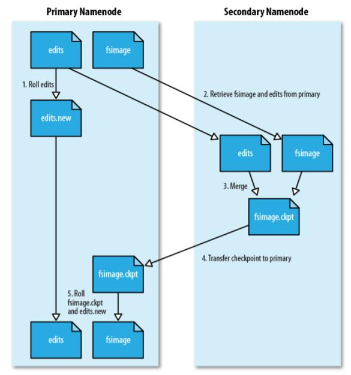

#### 数据节点（DATANODE）

数据节点是分布式文件系统HDFS的工作节点，负责数据的存储和读取，会根据客户端或者是名称节点的调度来进行数据的存储和检索，并且向名称节点定期发送自己 所存储的块的列表 。

每个数据节点中的数据会被保存在各自节点的本地Linux文件系统中。

### 4、HDFS体系结构

#### 概述

HDFS采用了主从（Master/Slave）结构模型，一个HDFS集群包括一个名称节点（ NameNode）和若干个数据节点（DataNode）。名称节点作为中心服务器， 负责管理文件系统的命名空间及客户端对文件的访问。集群中的数据节点一般是一个节点运行 一个数据节点进程，负责处理文件系统客户端的读/写请求，在名称节点的统一调度下进行数据 块的创建、删除和复制等操作。每个数据节点的数据实际上是保存在本地Linux文件系统中的。

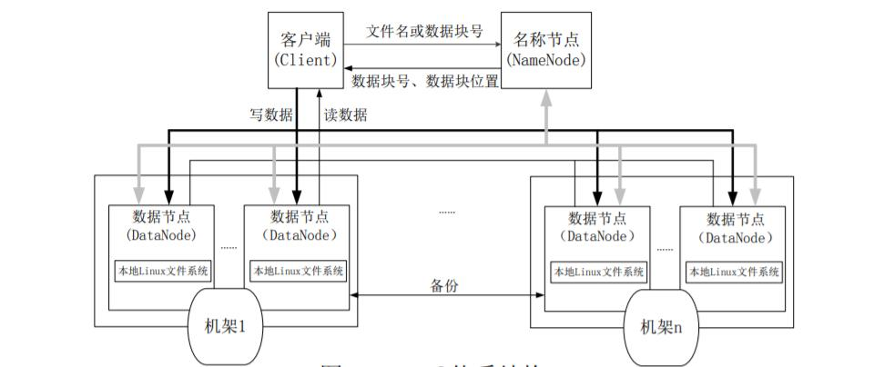

#### HDFS命名空间管理

HDFS的命名空间包含目录、文件和块。

在HDFS1.0体系结构中，在整个HDFS集群中只有一个命名空间，并且只有唯一一个名称节点，该节点负责对这个命名空间进行管理 。

HDFS使用的是传统的分级文件体系，因此，用户可以像使用普通文件系统一样，创建、删除目录和文件，在目录间转移文件，重命名文件等。

#### 通信协议

HDFS是一个部署在集群上的分布式文件系统，因此，很多数据需要通过网络进行传输。

所有的HDFS通信协议都是构建在TCP/IP协议基础之上的。

客户端通过一个可配置的端口向名称节点主动发起TCP连接，并使用客户端协议与名称节点进行交互。 

名称节点和数据节点之间则使用数据节点协议进行交互。

客户端与数据节点的交互是通过RPC（Remote Procedure Call）来实现的。在设计上，名称节点不会主动发起RPC，而是响应来自客户端和数据节点的RPC请求。

#### 客户端

客户端是用户操作HDFS最常用的方式，HDFS在部署时都提供了客户端。

HDFS客户端是一个库，暴露了HDFS文件系统接口，这些接口隐藏了HDFS实现中的大部分复杂性。 

严格来说，客户端并不算是HDFS的一部分。

客户端可以支持打开、读取、写入等常见的操作，并且提供了类似 Shell 的命令行方式来访问HDFS中的数据

此外，HDFS也提供了 `Java API`，作为应用程序访问文件系统的客户端编程接口。

#### HDFS体系结构的局限性

HDFS只设置唯一一个名称节点，这样做虽然大大简化了系统设计，但也带来了一些 明显的局限性，具体如下：

- 命名空间的限制：名称节点是保存在内存中的，因此，名称节点能够容纳的 对象（文件、块）的个数会受到内存空间大小的限制。
- 性能的瓶颈：整个分布式文件系统的吞吐量，受限于单个名称节点的吞吐量。
- 隔离问题：由于集群中只有一个名称节点，只有一个命名空间，因此，无法 对不同应用程序进行隔离。
- 集群的可用性：一旦这个唯一的名称节点发生故障，会导致整个集群变得不 可用。

### 5、HDFS存储原理

#### 冗余数据保存

作为一个分布式文件系统，为了保证系统的容错性和可用性，HDFS采用了多副 本方式对数据进行冗余存储，通常一个数据块的多个副本会被分布到不同的数据节点上，如图所示，数据块1被分别存放到数据节点A和C上，数据块2被存放在数据节点A和B上。

这种多副本方式具有以下几个优点：

- 加快数据传输速度。
- 容易检查数据错误。
- 保证数据可靠性。

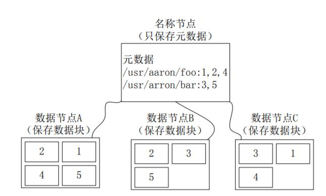

#### 数据存取策略

##### 数据存放

Block的副本放置策略：

第一个副本：放置在上传文件的数据节点；如果是集群外提交，则随机挑选一台磁盘 不太满、CPU不太忙的节点。

第二个副本：放置在与第一个副本不同的机架的节点上。

第三个副本：与第一个副本相同机架的其他节点上。

更多副本：随机节点。

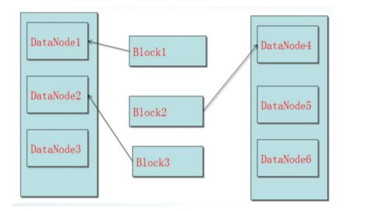

##### 数据读取

HDFS提供了一个API可以确定一个数据节点所属的机架ID，客户端也可以调用API 获取自己所属的机架ID。

当客户端读取数据时，从名称节点获得数据块不同副本的存放位置列表，列表中包 含了副本所在的数据节点，可以调用API来确定客户端和这些数据节点所属的机架ID， 当发现某个数据块副本对应的机架ID和客户端对应的机架ID相同时，就优先选择该副本读取数据，如果没有发现，就随机选择一个副本读取数据。

#### 数据错误与恢复

HDFS具有较高的容错性，可以兼容廉价的硬件，它把硬件出错看作一种常态， 而不是异常，并设计了相应的机制检测数据错误和进行自动恢复，主要包括以下几种情形：名称节点出错、数据节点出错和数据出错。

##### 名称节点出错

名称节点保存了所有的元数据信息，其中，最核心的两大数据结构是FsImage和Editlog，如果这两个文件发生损坏，那么整个HDFS实例将失效。因此，HDFS设置了备份机制，把这些核心文件同步复制到备份服务器SecondaryNameNode上。当名称节点出错时，就可以根据备份服务器 SecondaryNameNode 中的 FsImage 和 Editlog 数据进行恢复。

##### 数据节点出错

每个数据节点会定期向名称节点发送“心跳”信息，向名称节点报告自己的状态。

当数据节点发生故障，或者网络发生断网时，名称节点就无法收到来自一些数据节点的心跳信息，这时，这些数据节点就会被标记为“宕机”，节点上面的所有数据都会被标记为“不可读”，名称节点不会再给它们发送任何I/O请求。

这时，有可能出现一种情形，即由于一些数据节点的不可用，会导致一些数据块的副本数量小于冗余因子。 

名称节点会定期检查这种情况，一旦发现某个数据块的副本数量小于冗余因子，就会启动数据冗余复制，为它生成新的副本。 

HDFS和其它分布式文件系统的最大区别就是可以调整冗余数据的位置。

##### 数据出错

网络传输和磁盘错误等因素，都会造成数据错误。 

客户端在读取到数据后，会采用md5和sha1对数据块进行校验，以确定读取到正确的数据。 

在文件被创建时，客户端就会对每一个文件块进行信息摘录，并把这些信息写入到同一个路径的隐藏文件里面。 

当客户端读取文件的时候，会先读取该信息文件，然后，利用该信息文件对每个读 取的数据块进行校验，如果校验出错，客户端就会请求到另外一个数据节点读取该文件块，并且向名称节点报告这个文件块有错误，名称节点会定期检查并且重新复制这个块。

### 6、HDFS 读写过程

FileSystem 是一个通用文件系统的抽象基类，可以被分布式文件系统继承，所有可能使用 Hadoop 文件系统的代码，都要使用这个类。

Hadoop 为 FileSystem 这个抽象类提供了多种具体实现。

DistributedFileSystem 就是 FileSystem 在 HDFS 文件系统中的具体实现。

`FileSystem` 的 `open()` 方法返回的是一个输入流 `FSDataInputStream` 对象，在 HDFS 文件系统中，具体的输入流就是 `DFSInputStream`；FileSystem 中的 `create()` 方法返回的是一个输出流 `FSDataOutputStream` 对象，在 HDFS 文件系统中，具体的输出流就是 `DFSOutputStream`。

```
Configuration conf = new Configuration();
FileSystem fs = FileSystem.get(conf);
FSDataInputStream in = fs.open(new Path(uri));
FSDataOutputStream out = fs.create(new Path(uri));
```

备注：创建一个 `Configuration` 对象时，其构造方法会默认加载工程项目下两个配置文件，分别是 `hdfs-site.xml` 以及 `core-site.xml`，这两个文件中会有访问 HDFS所需的参数值，主要是 `fs.defaultFS`，指定了 HDFS 的地址（比如 `hdfs://localhost:9000`），有了这个地址客户端就可以 通过这个地址访问HDFS了。

#### 读取文件

```
import java.io.BufferedReader;
import java.io.InputStreamReader ;
import org.apache.hadoop.conf.Configuration ;
import org.apache.hadoop.fs.FileSystem ;
import org.apache.hadoop.fs.Path ;
import org.apache.hadoop.fs.FSDataInputStream ;
public class Chapter3 {
	public static void main(String[] args) {
		try {
			Configuration conf = new Configuration();
			FileSystem fs = FileSystem.get(conf);
			Path filename = new Path(“hdfs://localhost:9000/user/hadoop/test.txt");
			FSDataInputStream is = fs.open(filename);
			BufferedReader d = new BufferedReader(new InputStreamReader(is));
			String content = d.readLine(); //读取文件一行
			System.out.println(content);
			d.close(); //关闭文件
			fs.close(); //关闭hdfs
		} catch (Exception e) {
			e.printStackTrace();
		}
	}
}
```

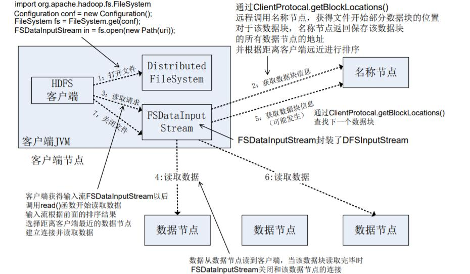

#### 写入文件

```
import org.apache.hadoop.conf.Configuration;
import org.apache.hadoop.fs.FileSystem;
import org.apache.hadoop.fs.FSDataOutputStream;
import org.apache.hadoop.fs.Path;
public class Chapter3 {
	public static void main(String[] args) {
		try {
			Configuration conf = new Configuration();
			FileSystem fs = FileSystem.get(conf);
			byte[] buff = "Hello world".getBytes(); // 要写入的内容
			String filename = " hdfs://localhost:9000/user/hadoop/test.txt "; //要写入的文件名
			FSDataOutputStream os = fs.create(new Path(filename));
			os.write(buff,0,buff.length);
			System.out.println("Create:"+ filename);
		} catch (Exception e) {
			e.printStackTrace();
		}
	}
}
```

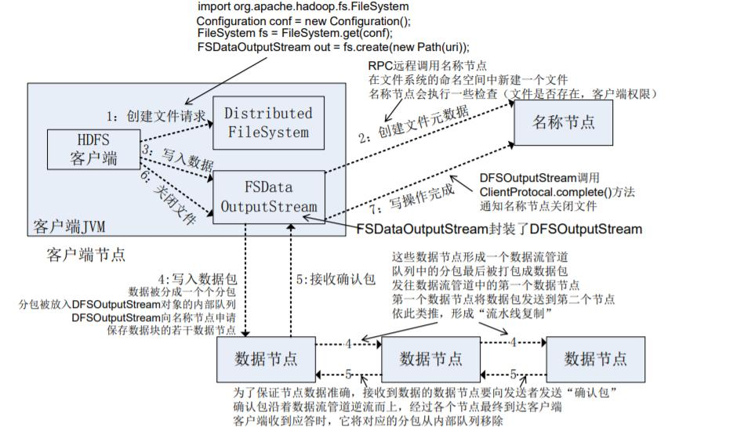

### 7、HDFS 编程实践

#### 首先启动HADOOP

```
$ cd /usr/local/hadoop
$ ./bin/hdfs namenode -format  # 格式化hdfs文件系统，初始化时使用，之前执行后就不需再执行
$ ./bin/start-dfs.sh
```

#### 常用命令

HDFS 有很多 shell 命令，其中，`fs` 命令可以说是 HDFS 最常用的命令。利用该命令可以 查看 HDFS 文件系统的目录结构、上传和下载数据、创建文件等。

该命令的用法为： hadoop fs [genericOptions] [commandOptions]

备注：Hadoop 中有三种 Shell 命令方式：

- `hadoop fs` 适用于任何不同的文件系统，比如本地文件系统和 HDFS 文件系统。
- `hadoop dfs` 只能适用于 HDFS 文件系统。
- `hdfs dfs` 跟 `hadoop dfs` 的命令作用一样，也只能适用于 HDFS 文件系统。

#### 实例

hadoop fs -ls <path>:显示 <path> 指定的文件的详细信息

hadoop fs -mkdir <path>:创建 <path> 指定的文件夹

例中 “./” 表示 “/usr/local/hadoop/bin” 路径。

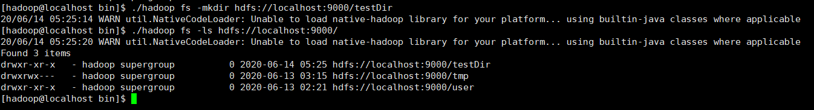

hadoop fs -cat <path>:将<path>指定的文件的内容输出到标准输出（stdout）

hadoop fs -copyFromLocal <localsrc> <dst>: 将本地源文件 <localsrc> 复制到路径 <dst> 指定的文件或文件夹中

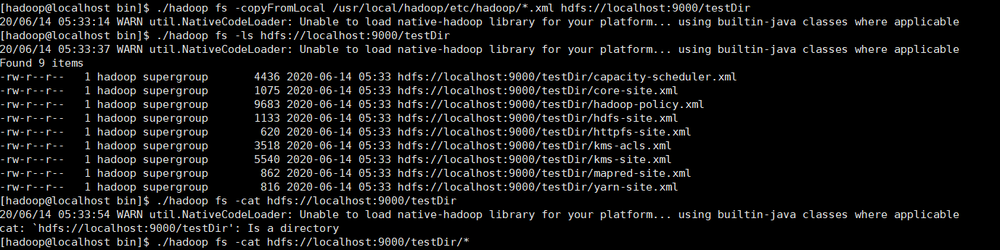

#### WEB管理界面

http://ip:50070, 默认端口 50070

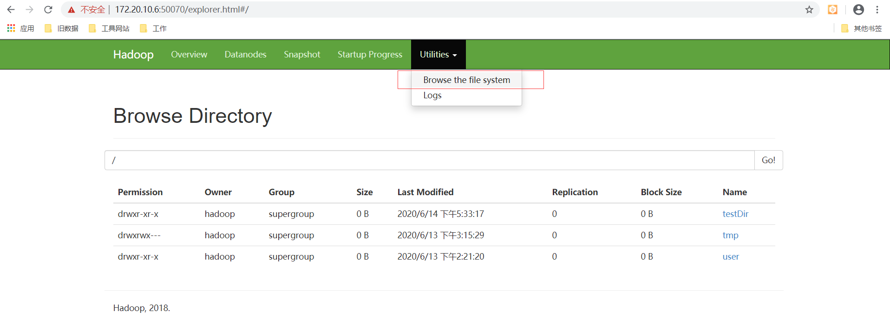

#### 利用 JAVA API 与 HDFS 进行交互

maven项目中引入

```
<dependencies>
    <!-- https://mvnrepository.com/artifact/org.apache.hadoop/hadoop-common -->
    <dependency>
        <groupId>org.apache.hadoop</groupId>
        <artifactId>hadoop-common</artifactId>
        <version>2.6.0</version>
    </dependency>
    <!-- https://mvnrepository.com/artifact/org.apache.hadoop/hadoop-hdfs -->
    <dependency>
        <groupId>org.apache.hadoop</groupId>
        <artifactId>hadoop-hdfs</artifactId>
        <version>2.6.0</version>
    </dependency>
    <!-- https://mvnrepository.com/artifact/org.apache.hadoop/hadoop-client -->
    <dependency>
        <groupId>org.apache.hadoop</groupId>
        <artifactId>hadoop-client</artifactId>
        <version>2.6.0</version>
    </dependency>
</dependencies>
```

 写一个FileSystem获取工具类：

 ```
 package com.yl.hdfs;
 
import java.io.IOException;
 
import org.apache.hadoop.conf.Configuration;
import org.apache.hadoop.fs.FileSystem;
 
/**
 * 单例模式生成FileSystem
 * 
 * @author guilin
 *
 */
public class FileSystemFactory {
	
	private static class FileSystemFactoryHolder{
		
        public static FileSystem instance;
        
        static {
        	Configuration conf = new Configuration();
                conf.set("fs.defaultFS","hdfs://172.20.10.6:9000");
                conf.set("fs.hdfs.impl", "org.apache.hadoop.hdfs.DistributedFileSystem");
                try {
			        instance = FileSystem.get(conf);
	            } catch (IOException e) {
		             e.printStackTrace();
	            }
            }
	}
	
	public static FileSystem getInsatnce() {
		return FileSystemFactoryHolder.instance;
	}
 
}
 ```

### 结尾

本文是根据中国大学MOOC网站上，课程[《大数据技术原理与应用》](https://www.icourse163.org/course/XMU-1002335004)的课件ppt撰写的一篇博文。由于自己也是正在跟着这门课进行学习，所以很多专业性知识点都是截取课件ppt上的内容。顺便推荐一下这门课程，老师讲解的知识点非常细致，还有对操作步骤详细记录的博客资源。

感谢厦门大学数据库实验室，感谢林子雨老师提供的这么优秀的资源。

### Reference 

- [你想了解的分布式文件系统HDFS，看这一篇就够了](https://www.freesion.com/article/8657874613/)
- [FileSystemShell.html](https://hadoop.apache.org/docs/stable/hadoop-project-dist/hadoop-common/FileSystemShell.html)
- [yarn quick start](https://hadoop.apache.org/docs/stable/hadoop-yarn/hadoop-yarn-site/yarn-service/QuickStart.html)
- [HDFS Commands, HDFS Permissions and HDFS Storage](https://www.informit.com/articles/article.aspx?p=2755708&seqNum=3)
- [Creating and configuring home directory for a user in HDFS](http://www.hadooplessons.info/2017/12/creating-home-directory-for-user-in-hdfs-hdpca.html)
