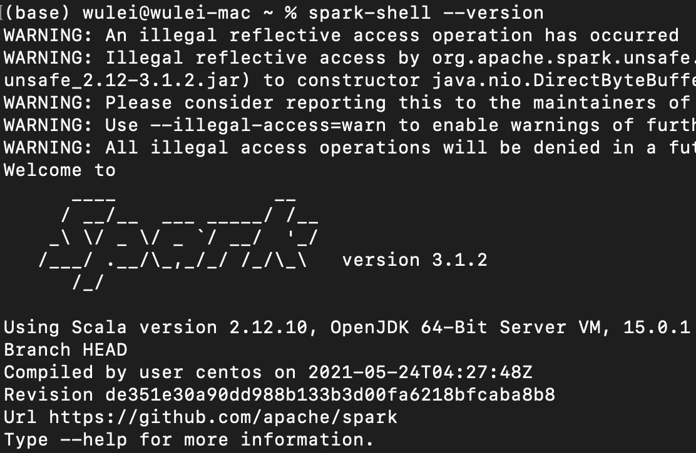
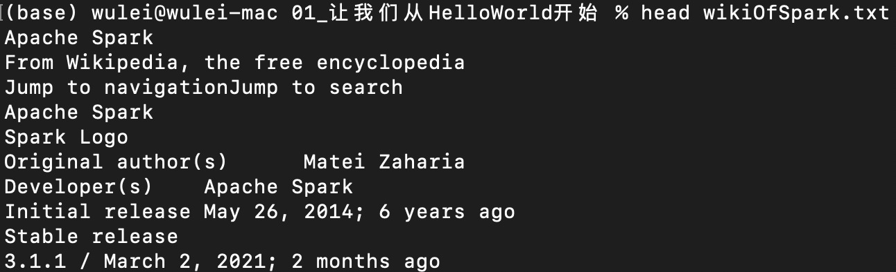
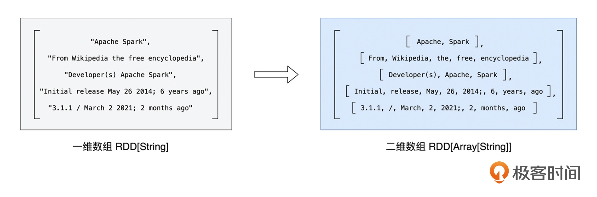
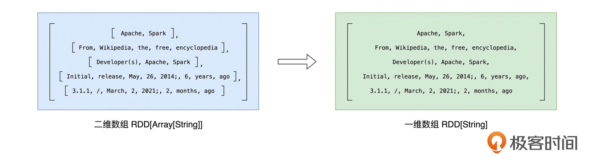
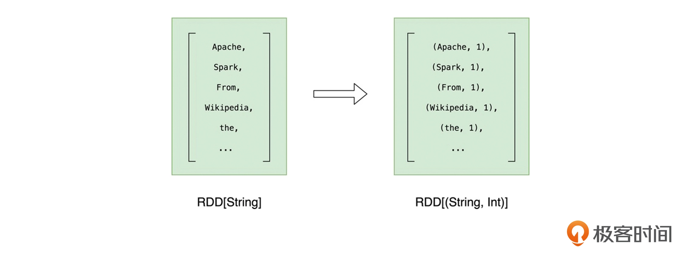
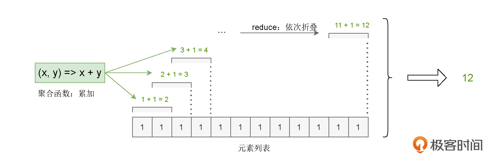
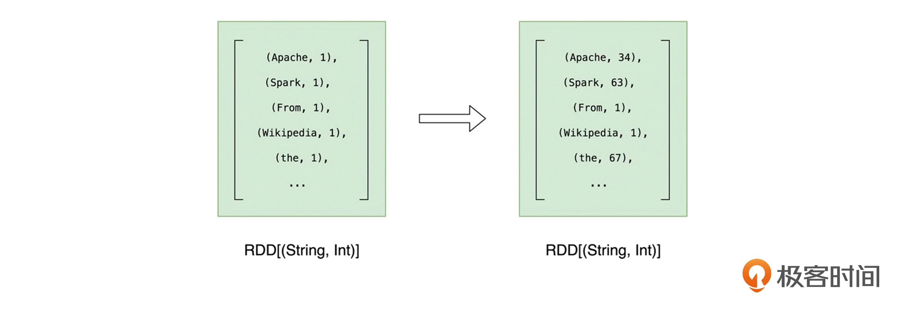
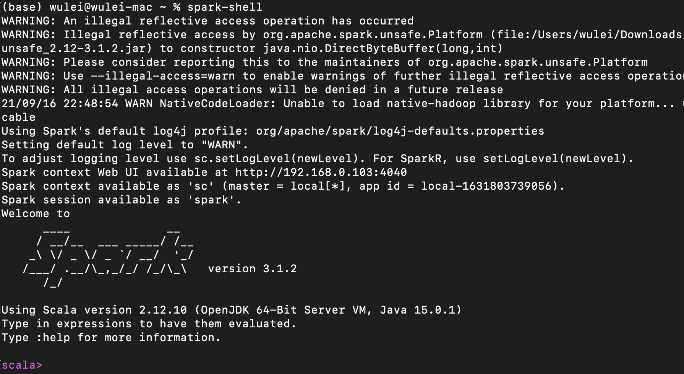

# 01｜Spark：从“大数据的Hello World”开始

## 准备工作

咱们做 `Word Count` 的初衷是学习 Spark，因此源文件的内容无足轻重。这里我提取了[Wikipedia 中对 Spark 的介绍](https://en.wikipedia.org/wiki/Apache_Spark)来做我们的源文件。我把它保存到了与课程配套的 GitHub 项目中，并把它命名为“wikiOfSpark.txt”。你可以从[这里](https://github.com/wulei-bj-cn/learn-spark/blob/main/chapter01/wikiOfSpark.txt)下载它。

为了跑通 `Word Count` 实例，我们还需要在本地（Local）部署 Spark 运行环境。这里的“本地”，指的是你手头能够获取到的任何计算资源，比如服务器、台式机，或是笔记本电脑。在本地部署 Spark 运行环境非常简单，即便你从来没有和 Spark 打过交道，也不必担心。**只需要下面这 3 个步骤，我们就可以完成 Spark 的本地部署了**。

1. **下载安装包**：从[Spark 官网](http://spark.apache.org/downloads.html)下载安装包，选择最新的预编译版本即可；
2. **解压**：解压 Spark 安装包到任意本地目录；
3. **配置**：将“${解压目录}/bin”配置到 PATH 环境变量。

接下来，我们确认一下 Spark 是否部署成功。打开命令行终端，敲入`“spark-shell --version”`命令，如果该命令能成功地打印出 Spark 版本号，就表示我们大功告成了，就像这样：



这里你不妨暂时把它当做是 Spark 中的 Linux shell。spark-shell 提供交互式的运行环境（REPL，Read-Evaluate-Print-Loop），以“所见即所得”的方式，让开发者在提交源代码之后，就可以迅速地获取执行结果。

不过，需要注意的是，spark-shell 在运行的时候，依赖于 Java 和 Scala 语言环境。因此，为了保证 spark-shell 的成功启动，你需要在本地预装 Java 与 Scala。好消息是，关于 Java 与 Scala 的安装，网上的资料非常丰富，你可以参考那些资料来进行安装，咱们在本讲就不再赘述 Java 与 Scala 的安装步骤啦。

## 梳理Word Count 的计算步骤

Word Count 的初衷是对文件中的单词做统计计数，打印出频次最高的 5 个词汇。那么 Word Count 的第一步就很明显了，当然是得读取文件的内容，不然咱们统计什么呢？我们准备好的文件是 wikiOfSpark.txt，它以纯文本的方式记录了关于 Spark 的简单介绍，我摘取了其中的部分内容给你看一下：



我们知道，文件的读取往往是以行（Line）为单位的。不难发现，`wikiOfSpark.txt` 的每一行都包含多个单词。我们要是以“单词”作为粒度做计数，就需要对每一行的文本做分词。分词过后，文件中的每一句话，都被打散成了一个个单词。这样一来，我们就可以按照单词做分组计数了。这就是 `Word Count` 的计算过程，主要包含如下 3 个步骤：

1. **读取内容**：调用 Spark 文件读取 API，加载 `wikiOfSpark.txt` 文件内容；
2. **分词**：以行为单位，把句子打散为单词；
3. **分组计数**：按照单词做分组计数。

明确了计算步骤后，接下来我们就可以调用 Spark 开发 API，对这些步骤进行代码实现，从而完成 `Word Count` 的应用开发。

## Word Count 代码实现

选定了语言，接下来，我们就按照读取内容、分词、分组计数这三步来看看 Word Count 具体怎么实现。

### 第一步，读取内容

首先，我们调用 SparkContext 的 textFile 方法，读取源文件，也就是 wikiOfSpark.txt，代码如下表所示：
```
import org.apache.spark.rdd.RDD

val rootPath: String = "."
val file: String = s"${rootPath}/wikiOfSpark.txt"
 
// 读取文件内容
val lineRDD: RDD[String] = spark.sparkContext.textFile(file) 
```

在这段代码中，你可能会发现 3 个新概念，分别是 `spark`、`sparkContext` 和 `RDD`。

其中，spark 和 sparkContext 分别是两种不同的开发入口实例：

- `spark` 是开发入口 `SparkSession` 实例（Instance），`SparkSession` 在 spark-shell 中会由系统自动创建；
- `sparkContext` 是开发入口 `SparkContext` 实例。
 
在 Spark 版本演进的过程中，从 2.0 版本开始，SparkSession 取代了 SparkContext，成为统一的开发入口。换句话说，要开发 Spark 应用，你必须先创建 SparkSession。关于 SparkSession 和 SparkContext，我会在后续的课程做更详细的介绍，这里你只要记住它们是必需的开发入口就可以了。

我们再来看看 RDD，RDD 的全称是 `Resilient Distributed Dataset`，意思是“弹性分布式数据集”。RDD 是 Spark 对于分布式数据的统一抽象，它定义了一系列分布式数据的基本属性与处理方法。关于 RDD 的定义、内涵与作用，我们留到下一讲再去展开。在这里，你不妨先简单地把 RDD 理解成“数组”，比如代码中的 `lineRDD` 变量，它的类型是 `RDD[String]`，你可以暂时把它当成元素类型是 String 的数组，数组的每个元素都是文件中的一行字符串。

获取到文件内容之后，下一步我们就要做分词了。

### 第二步，分词

“分词”就是把“数组”的行元素打散为单词。要实现这一点，我们可以调用 RDD 的 `flatMap` 方法来完成。`flatMap` 操作在逻辑上可以分成两个步骤：**映射**和**展平**。

这两个步骤是什么意思呢？我们还是结合 Word Count 的例子来看：
```
// 以行为单位做分词
val wordRDD: RDD[String] = lineRDD.flatMap(line => line.split(" ")) 
```

要把 lineRDD 的行元素转换为单词，我们得先用分隔符对每个行元素进行分割（Split），咱们这里的分隔符是空格。

分割之后，每个行元素就都变成了单词数组，元素类型也从 String 变成了 Array[String]，像这样以元素为单位进行转换的操作，统一称作“**映射**”。

映射过后，RDD 类型由原来的 `RDD[String]` 变为 `RDD[Array[String]]`。如果把 `RDD[String]` 看成是“数组”的话，那么 `RDD[Array[String]]` 就是一个“二维数组”，它的每一个元素都是单词。



为了后续对单词做分组，我们还需要对这个“二维数组”做展平，也就是去掉内层的嵌套结构，把“二维数组”还原成“一维数组”，如下图所示。



就这样，在 flatMap 算子的作用下，原来以行为元素的 lineRDD，转换成了以单词为元素的 wordRDD。

不过，值得注意的是，我们用“空格”去分割句子，有可能会产生空字符串。所以，在完成“映射”和“展平”之后，对于这样的“单词”，我们要把其中的空字符串都过滤掉，这里我们调用 RDD 的 `filter` 方法来过滤：
```
// 过滤掉空字符串
val cleanWordRDD: RDD[String] = wordRDD.filter(word => !word.equals(""))
```

这样一来，我们在分词阶段就得到了过滤掉空字符串之后的单词“数组”，类型是 `RDD[String]`。接下来，我们就可以准备做分组计数了。

### 第三步，分组计数

在 RDD 的开发框架下，聚合类操作，如计数、求和、求均值，需要依赖键值对（Key Value Pair）类型的数据元素，也就是（Key，Value）形式的“数组”元素。

因此，在调用聚合算子做分组计数之前，我们要先把 RDD 元素转换为（Key，Value）的形式，也就是把 RDD[String]映射成 RDD[(String, Int)]。

其中，我们统一把所有的 Value 置为 1。这样一来，对于同一个的单词，在后续的计数运算中，我们只要对 Value 做累加即可，就像这样：



下面是对应的代码：
```
// 把RDD元素转换为（Key，Value）的形式
val kvRDD: RDD[(String, Int)] = cleanWordRDD.map(word => (word, 1)) 
```

这样一来，RDD 就由原来存储 String 元素的 cleanWordRDD，转换为了存储（String，Int）的 kvRDD。

完成了形式的转换之后，我们就该正式做分组计数了。分组计数其实是两个步骤，也就是先“分组”，再“计数”。下面，我们使用聚合算子 reduceByKey 来同时完成分组和计数这两个操作。

对于 kvRDD 这个键值对“数组”，`reduceByKey` 先是按照 Key（也就是单词）来做分组，分组之后，每个单词都有一个与之对应的 `Value` 列表。然后根据用户提供的聚合函数，对同一个 Key 的所有 `Value` 做 `reduce` 运算。

这里的 reduce，你可以理解成是一种计算步骤或是一种计算方法。当我们给定聚合函数后，它会用折叠的方式，把包含多个元素的列表转换为单个元素值，从而统计出不同元素的数量。

在 Word Count 的示例中，我们调用 reduceByKey 实现分组计算的代码如下：
```
// 按照单词做分组计数
val wordCounts: RDD[(String, Int)] = kvRDD.reduceByKey((x, y) => x + y) 
```

可以看到，我们传递给 reduceByKey 算子的聚合函数是 `(x, y) => x + y`，也就是累加函数。因此，在每个单词分组之后，reduce 会使用累加函数，依次折叠计算 Value 列表中的所有元素，最终把元素列表转换为单词的频次。对于任意一个单词来说，reduce 的计算过程都是一样的，如下图所示。



reduceByKey 完成计算之后，我们得到的依然是类型为 `RDD[(String, Int)]` 的 RDD。不过，与 kvRDD 不同，wordCounts 元素的 Value 值，记录的是每个单词的统计词频。到此为止，我们就完成了 `Word Count` 主逻辑的开发与实现。



在程序的最后，我们还要把 wordCounts 按照词频做排序，并把词频最高的 5 个单词打印到屏幕上，代码如下所示。
```
// 打印词频最高的5个词汇
wordCounts.map{case (k, v) => (v, k)}.sortByKey(false).take(5)
```

## 代码执行

应用开发完成之后，我们就可以把代码丢进已经准备好的本地 Spark 部署环境里啦。首先，我们打开命令行终端（Terminal），敲入“spark-shell”，打开交互式运行环境，如下图所示。



然后，把我们开发好的代码，依次敲入 spark-shell。为了方便你操作，我把完整的代码实现整理到下面了：
```
import org.apache.spark.rdd.RDD
 
// 这里的下划线"_"是占位符，代表数据文件的根目录
val rootPath: String = "."
val file: String = s"${rootPath}/wikiOfSpark.txt"
 
// 读取文件内容
val lineRDD: RDD[String] = spark.sparkContext.textFile(file) 

// 以行为单位做分词
val wordRDD: RDD[String] = lineRDD.flatMap(line => line.split(" ")) 

// 过滤掉空字符串
val cleanWordRDD: RDD[String] = wordRDD.filter(word => !word.equals(""))

// 把RDD元素转换为（Key，Value）的形式
val kvRDD: RDD[(String, Int)] = cleanWordRDD.map(word => (word, 1)) 

// 按照单词做分组计数
val wordCounts: RDD[(String, Int)] = kvRDD.reduceByKey((x, y) => x + y) 

// 打印词频最高的5个词汇
val top5Words: Array[(Int, String)] = wordCounts.map{case (k, v) => (v, k)}.sortByKey(false).take(5)
```

我们把上面的代码依次敲入到 spark-shell 之后，spark-shell 最终会把词频最高的 5 个单词打印到屏幕上：
```
scala> wordCounts.map{case (k, v) => (v, k)}.sortByKey(false).take(5)
res0: Array[(Int, String)] = Array((67,the), (63,Spark), (54,a), (51,and), (50,of))
```

在 Wikipedia 的 Spark 介绍文本中，词频最高的单词分别是 the、Spark、a、and 和 of，除了“Spark”之外，其他 4 个单词都是常用的停用词（Stop Word），因此它们几个高居榜首也就不足为怪了。

好啦，到此为止，我们在 Spark 之上，完成了“大数据领域 Hello World”的开发与实现，恭喜你跨入大数据开发的大门！

## Reference

- [RDD Programming Guide](https://spark.apache.org/docs/latest/rdd-programming-guide.html#transformations)