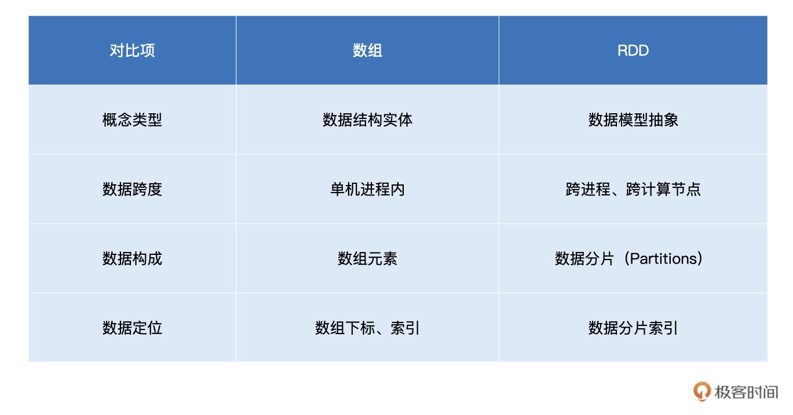
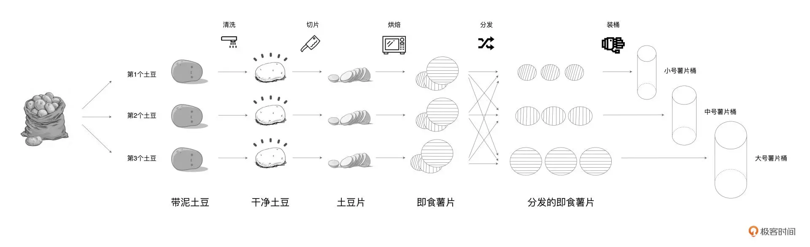
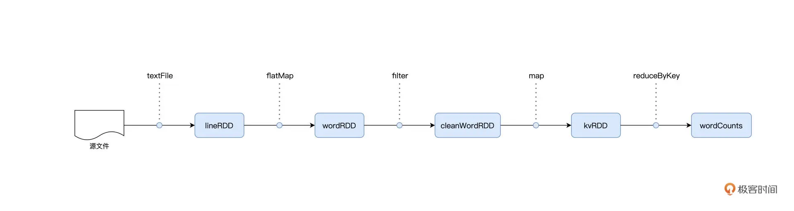
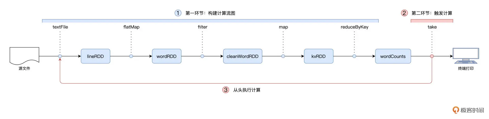
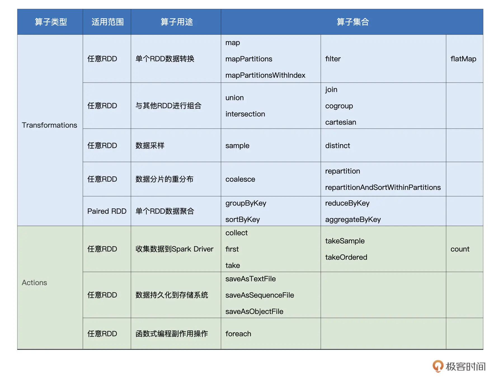

## 02 RDD与编程模型：延迟计算是怎么回事？

### 什么是 RDD

**RDD 是一种抽象，是 Spark 对于分布式数据集的抽象，它用于囊括所有内存中和磁盘中的分布式数据实体**。通过对比 RDD 与数组之间的差异认识一下 RDD：

我在表中从四个方面对数组和 RDD 进行了对比，现在我来详细解释一下：

- 首先，就概念本身来说，数组是实体，它是一种存储同类元素的数据结构，而 RDD 是一种抽象，它所囊括的是分布式计算环境中的分布式数据集。
- 因此，这两者第二方面的不同就是在活动范围，数组的“活动范围”很窄，仅限于单个计算节点的某个进程内，而 RDD 代表的数据集是跨进程、跨节点的，它的“活动范围”是整个集群。
- 至于数组和 RDD 的第三个不同，则是在数据定位方面。在数组中，承载数据的基本单元是元素，而 RDD 中承载数据的基本单元是数据分片。在分布式计算环境中，一份完整的数据集，会按照某种规则切割成多份数据分片。这些数据分片被均匀地分发给集群内不同的计算节点和执行进程，从而实现分布式并行计算。

通过以上对比，不难发现，数据分片（Partitions）是 RDD 抽象的重要属性之一。在初步认识了 RDD 之后，接下来咱们换个视角，从 RDD 的重要属性出发，去进一步深入理解 RDD。要想吃透 RDD，我们必须掌握它的 4 大属性：

- partitions：数据分片
- partitioner：分片切割规则
- dependencies：RDD 依赖
- compute：转换函数

### 从薯片的加工流程看 RDD 的 4 大属性

在很久很久以前，有个生产桶装薯片的工坊，工坊的规模较小，工艺也比较原始。为了充分利用每一颗土豆、降低生产成本，工坊使用 3 条流水线来同时生产 3 种不同尺寸的桶装薯片。3 条流水线可以同时加工 3 颗土豆，每条流水线的作业流程都是一样的，分别是清洗、切片、烘焙、分发和装桶。其中，分发环节用于区分小、中、大号 3 种薯片，3 种不同尺寸的薯片分别被发往第 1、2、3 条流水线。具体流程如下图所示。

好了，故事讲完了。那如果我们把每一条流水线看作是分布式运行环境的计算节点，用薯片生产的流程去类比 Spark 分布式计算，会有哪些有趣的发现呢？显然，这里的每一种食材形态，如“带泥土豆”、“干净土豆”、“土豆片”等，都可以看成是一个个 RDD。而**薯片的制作过程，实际上就是不同食材形态的转换过程**。

起初，工人们从麻袋中把“带泥土豆”加载到流水线，这些土豆经过清洗之后，摇身一变，成了“干净土豆”。接下来，流水线上的切片机再把“干净土豆”切成“土豆片”，然后紧接着把这些土豆片放进烤箱。最终，土豆片烤熟之后，就变成了可以放心食用的即食薯片。

通过分析我们不难发现，不同食材形态之间的转换过程，与 `Word Count` 中不同 RDD 之间的转换过程如出一辙。所以接下来，我们就结合薯片的制作流程，去理解 RDD 的 4 大属性。

首先，咱们沿着纵向，也就是从上到下的方向，去观察上图中土豆工坊的制作工艺。我们可以看到对于每一种食材形态来说，流水线上都有多个实物与之对应，比如，“带泥土豆”是一种食材形态，流水线上总共有 3 颗“脏兮兮”的土豆同属于这一形态。

如果把“带泥土豆”看成是 RDD 的话，那么 RDD 的 partitions 属性，囊括的正是麻袋里那一颗颗脏兮兮的土豆。同理，流水线上所有洗净的土豆，一同构成了“干净土豆”RDD 的 partitions 属性。

我们再来看 RDD 的 partitioner 属性，这个属性定义了把原始数据集切割成数据分片的切割规则。在土豆工坊的例子中，“带泥土豆”RDD 的切割规则是随机拿取，也就是从麻袋中随机拿取一颗脏兮兮的土豆放到流水线上。后面的食材形态，如“干净土豆”、“土豆片”和“即食薯片”，则沿用了“带泥土豆”RDD 的切割规则。换句话说，后续的这些 RDD，分别继承了前一个 RDD 的 partitioner 属性。

这里面与众不同的是“分发的即食薯片”。显然，“分发的即食薯片”是通过对“即食薯片”按照大、中、小号做分发得到的。也就是说，对于“分发的即食薯片”来说，它的 partitioner 属性，重新定义了这个 RDD 数据分片的切割规则，也就是把先前 RDD 的数据分片打散，按照薯片尺寸重新构建数据分片。

由这个例子我们可以看出，数据分片的分布，是由 RDD 的 partitioner 决定的。因此，**RDD 的 partitions 属性，与它的 partitioner 属性是强相关的**。

不难发现，流水线上的每一种食材形态，都是上一种食材形态在某种操作下进行转换得到的。比如，“土豆片”依赖的食材形态是“干净土豆”，这中间用于转换的操作是“切片”这个动作。回顾 Word Count 当中 RDD 之间的转换关系，我们也会发现类似的现象。

在数据形态的转换过程中，每个 RDD 都会通过 dependencies 属性来记录它所依赖的前一个、或是多个 RDD，简称“父 RDD”。与此同时，RDD 使用 compute 属性，来记录从父 RDD 到当前 RDD 的转换操作。

拿 Word Count 当中的 wordRDD 来举例，它的父 RDD 是 lineRDD，因此，它的 dependencies 属性记录的是 lineRDD。从 lineRDD 到 wordRDD 的转换，其所依赖的操作是 flatMap，因此，wordRDD 的 compute 属性，记录的是 flatMap 这个转换函数。

总结下来，薯片的加工流程，与 RDD 的概念和 4 大属性是一一对应的：

- 不同的食材形态，如带泥土豆、土豆片、即食薯片等等，对应的就是 RDD 概念；
- 同一种食材形态在不同流水线上的具体实物，就是 RDD 的 partitions 属性；
- 食材按照什么规则被分配到哪条流水线，对应的就是 RDD 的 partitioner 属性；
- 每一种食材形态都会依赖上一种形态，这种依赖关系对应的是 RDD 中的 dependencies 属性；
- 不同环节的加工方法对应 RDD 的 compute 属性。

在你理解了 RDD 的 4 大属性之后，还需要进一步了解 RDD 的编程模型和延迟计算。编程模型指导我们如何进行代码实现，而延迟计算是 Spark 分布式运行机制的基础。只有搞明白编程模型与延迟计算，你才能流畅地在 Spark 之上做应用开发，在实现业务逻辑的同时，避免埋下性能隐患。

### 编程模型与延迟计算

首先，这 4 个算子（map、filter、flatMap 和 reduceByKey）都是作用（Apply）在 RDD 之上、用来做 RDD 之间的转换。比如，flatMap 作用在 lineRDD 之上，把 lineRDD 转换为 wordRDD。

其次，这些算子本身是函数，而且它们的参数也是函数。**参数是函数、或者返回值是函数的函数，我们把这类函数统称为“高阶函数”（Higher-order Functions）**。换句话说，这 4 个算子，都是高阶函数。关于高阶函数的作用与优劣势，我们留到后面再去展开。这里，我们先专注在 RDD 算子的第一个共性：RDD 转换。

我们刚刚说过，RDD 代表的是分布式数据形态，因此，RDD 到 RDD 之间的转换，本质上是数据形态上的转换（Transformations）。

在 RDD 的编程模型中，一共有两种算子，Transformations 类算子和 Actions 类算子。**开发者需要使用 Transformations 类算子，定义并描述数据形态的转换过程，然后调用 Actions 类算子，将计算结果收集起来、或是物化到磁盘**。

在这样的编程模型下，Spark 在运行时的计算被划分为两个环节。

1. 基于不同数据形态之间的转换，构建计算流图（DAG，Directed Acyclic Graph）；
2. 通过 Actions 类算子，以回溯的方式去触发执行这个计算流图。

换句话说，开发者调用的各类 Transformations 算子，并不立即执行计算，当且仅当开发者调用 Actions 算子时，之前调用的转换算子才会付诸执行。在业内，这样的计算模式有个专门的术语，叫作“延迟计算”（Lazy Evaluation）。

Spark 程序的整个运行流程如下图所示：

Spark 有很多算子，[Spark 官网](https://spark.apache.org/docs/latest/rdd-programming-guide.html)提供了完整的 RDD 算子集合，不过对于这些算子，官网更多地是采用一种罗列的方式去呈现的，没有进行分类，看得人眼花缭乱、昏昏欲睡。因此，我把常用的 RDD 算子进行了归类，并整理到了下面的表格中，供你随时查阅。

结合每个算子的分类、用途和适用场景，这张表格可以帮你更快、更高效地选择合适的算子来实现业务逻辑。对于表格中不熟悉的算子，比如 aggregateByKey，你可以结合官网的介绍与解释，或是进一步查阅网上的相关资料，有的放矢地去深入理解。重要的算子，我们会在之后的课里详细解释。重点回顾

### 重点回顾

今天这一讲，我们重点讲解了 RDD 的编程模型与延迟计算，并通过土豆工坊的类比介绍了什么是 RDD。RDD 是 Spark 对于分布式数据集的抽象，它用于囊括所有内存中和磁盘中的分布式数据实体。对于 RDD，你要重点掌握它的 4 大属性，这是我们后续学习的重要基础：

- partitions：数据分片
- partitioner：分片切割规则
- dependencies：RDD 依赖
- compute：转换函数

深入理解 RDD 之后，你需要熟悉 RDD 的编程模型。在 RDD 的编程模型中，开发者需要使用 Transformations 类算子，定义并描述数据形态的转换过程，然后调用 Actions 类算子，将计算结果收集起来、或是物化到磁盘。

而延迟计算指的是，开发者调用的各类 Transformations 算子，并不会立即执行计算，当且仅当开发者调用 Actions 算子时，之前调用的转换算子才会付诸执行。