## 05 调度系统：如何把握分布式计算的精髓？

你可能会好奇：“对于给定的用户代码和相应的计算流图，`Driver` 是怎么把计算图拆解为分布式任务，又是按照什么规则分发给 `Executors` 的呢？还有，`Executors` 具体又是如何执行分布式任务的呢？”

我们之前一再强调，**分布式计算的精髓，在于如何把抽象的计算图，转化为实实在在的分布式计算任务，然后以并行计算的方式交付执行**。深入理解分布式计算，是我们做好大数据开发的关键和前提，它能有效避免我们掉入“单机思维”的陷阱，同时也能为性能导向的开发奠定坚实基础。

而上面的这一系列问题，恰恰是我们吃透分布式计算的关键所在。因此，今天这一讲，我们就顺着这些问题，一起去深入探究 Spark 调度系统，进而弄清楚分布式计算的来龙去脉。角色划分与斯巴克建筑集团

### 角色划分与斯巴克建筑集团

在上一讲，我们通过“包工头与施工工人”的类比、以及 `Word Count` 的示例，其实已经大致厘清了 Spark 分布式任务调度的核心环节与关键步骤。今天这一讲的核心任务，就是带你去深入其中的每一个环节，做到“既见森林、也见树木”。这里咱们不妨先把这些环节和涉及的组件梳理出来，从而让你在整体上有一个清晰的把握。

不难发现，表中的步骤与组件众多，要是照本宣科地去讲调度系统，先别说你可能看着看着就开始犯困了，就连我自己，也可能写着写着就睡着了。因此，咱们不妨把这些环节与组件融入到一个故事中去，让你像读小说一样，在捧腹之余弄懂 Spark 调度系统。

话说很久以前，美国有一家名扬海内外的建筑集团，名为“斯巴克（Spark）”。这家建筑集团规模庞大，设有一个总公司（`Driver`），和多个分公司（`Executors`）。斯巴克公司的主要服务对象是建筑设计师（开发者），建筑设计师负责提供设计图纸（用户代码、计算图），而斯巴克公司的主营业务是将图纸落地、建造起一栋栋高楼大厦。

要完成主营业务，集团公司需要招聘能够看懂图纸、并将其转化为建筑项目的架构师，因此斯巴克公司挖角了行业知名架构师“戴格”（`DAGScheduler`）。集团公司给戴格安排的职位是总公司的一把手，同时要求两位创始元老“塔斯克”和“拜肯德”全力配合戴格的工作。

听到这里，你肯定会问“塔斯克”和“拜肯德”是谁呢？

塔斯克（TaskScheduler）一毕业就加入了斯巴克公司，现任总公司施工经理，成功指挥完成了多个大大小小的工程项目，业绩非常突出，深得公司赏识。拜肯德（SchedulerBackend）和塔斯克在上大学的时候就是上下铺，关系好得穿一条裤子，现任总公司人力资源总监，负责与分公司协调、安排人力资源。从公司的安排来看，三位主管的分工还是比较明确的。

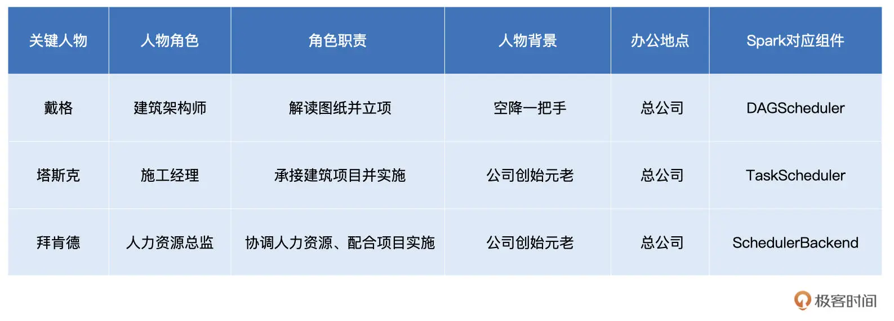

之所以说塔斯克（`TaskScheduler`）和拜肯德（`SchedulerBackend`）是公司元老，原因在于，在 `SparkContext / SparkSession` 的初始化中，`TaskScheduler` 和 `SchedulerBackend` 是最早、且同时被创建的调度系统组件。这二者的关系非常微妙：`SchedulerBackend` 在构造方法中引用 `TaskScheduler`，而 `TaskScheduler` 在初始化时会引用 `SchedulerBackend`。

值得一提的是，`SchedulerBackend` 组件的实例化，取决于开发者指定的 `Spark MasterURL`，也就是我们使用 `spark-shell`（或是 `spark-submit`）时指定的`–master` 参数，如 “–master spark://ip:host” 就代表 `Standalone` 部署模式，“–master yarn” 就代表 `YARN` 模式等等。

不难发现，`SchedulerBackend` 与资源管理器（`Standalone`、`YARN`、`Mesos` 等）强绑定，是资源管理器在 Spark 中的代理。其实硬件资源与人力资源一样，都是“干活儿的”。所以，如果我们用集团公司的人力资源来类比 Spark 集群的硬件资源，那么“拜肯德”就是名副其实的人力资源总监。

从全局视角来看，`DAGScheduler` 是任务调度的发起者，`DAGScheduler` 以 `TaskSet` 为粒度，向 `TaskScheduler` 提交任务调度请求。`TaskScheduler` 在初始化的过程中，会创建任务调度队列，任务调度队列用于缓存 `DAGScheduler` 提交的 `TaskSets`。`TaskScheduler` 结合 `SchedulerBackend` 提供的 `WorkerOffer`，按照预先设置的调度策略依次对队列中的任务进行调度。

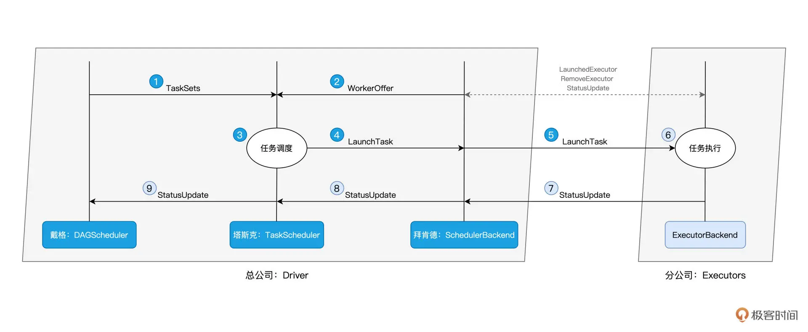

简而言之，`DAGScheduler` 手里有“活儿”，`SchedulerBackend` 手里有“人力”，`TaskScheduler` 的核心职能，就是把合适的“活儿”派发到合适的“人”的手里。由此可见，`TaskScheduler` 承担的是承上启下、上通下达的关键角色，这也正是我们将“塔斯克”视为斯巴克建筑公司元老之一的重要原因。

那么，了解了这三个主管的角色职责，我们接下来就来详细说说，他们是怎么各自完成自己的工作的。

### 总架构师戴格：DAGScheduler

回到我们的故事里，戴格在两位元老的协助下，工作开展得还算顺利，然而，冰层之下，暗流涌动，作为一名空降的领导，戴老板还需亲自“露两手”，才能赢得平级的认可与信任。

作为集团公司的“总架”（总架构师），戴格的核心职责，是把计算图 DAG 拆分为执行阶段 `Stages`，`Stages` 指的是不同的运行阶段，同时还要负责把 `Stages` 转化为任务集合 `TaskSets`，也就是把“建筑图纸”转化成可执行、可操作的“建筑项目”。

用一句话来概括从 DAG 到 `Stages` 的拆分过程，那就是：**以 Actions 算子为起点，从后向前回溯 DAG，以 Shuffle 操作为边界去划分 Stages**。

在第 2 讲介绍编程模型的时候，我们以 `Word Count` 为例，提到 Spark 作业的运行分为两个环节，第一个是以惰性的方式构建计算图，第二个则是通过 `Actions` 算子触发作业的从头计算：

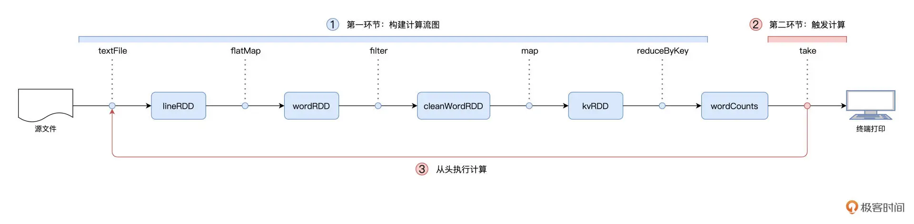

对于图中的第二个环节，Spark 在实际运行的过程中，会把它再细化为两个步骤。**第一个步骤，就是以 `Shuffle` 为边界，从后向前以递归的方式，把逻辑上的计算图 DAG，转化成一个又一个 `Stages`**。

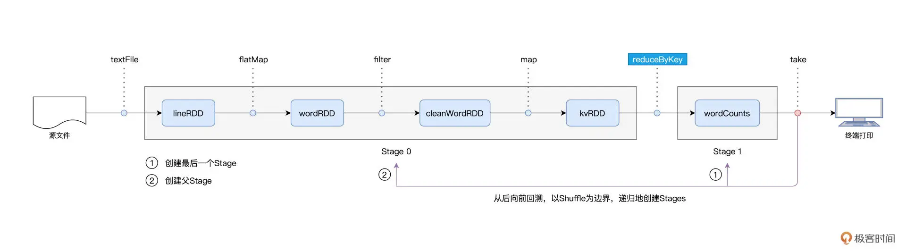

我们还是以 `Word Count` 为例，Spark 以 `take` 算子为起点，依次把 DAG 中的 RDD 划入到第一个 `Stage`，直到遇到 `reduceByKey` 算子。由于 `reduceByKey` 算子会引入 `Shuffle`，因此第一个 Stage 创建完毕，且只包含 `wordCounts` 这一个 RDD。接下来，Spark 继续向前回溯，由于未曾碰到会引入 `Shuffle` 的算子，因此它把“沿途”所有的 RDD 都划入了第二个 Stage。

**在 Stages 创建完毕之后，就到了触发计算的第二个步骤**：Spark从后向前，以递归的方式，依次提请执行所有的 `Stages`。

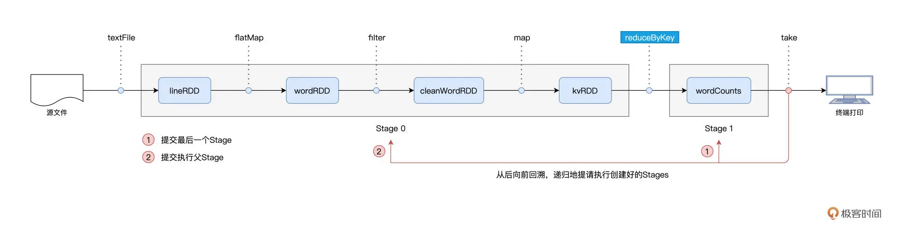

具体来说，在 `Word Count` 的例子中，`DAGScheduler` 最先提请执行的是 `Stage1`。在提交的时候，`DAGScheduler` 发现 `Stage1` 依赖的父 `Stage`，也就是 `Stage0`，还没有执行过，那么这个时候它会把 `Stage1` 的提交动作压栈，转而去提请执行 `Stage0`。当 `Stage0` 执行完毕的时候，`DAGScheduler` 通过出栈的动作，再次提请执行 `Stage 1`。

对于提请执行的每一个 `Stage`，`DAGScheduler` 根据 `Stage` 内 RDD 的 `partitions` 属性创建分布式任务集合 `TaskSet`。`TaskSet` 包含一个又一个分布式任务 `Task`，RDD 有多少数据分区，`TaskSet` 就包含多少个 `Task`。换句话说，`Task` 与 RDD 的分区，是一一对应的。

你可能会问：“Task 代表的是分布式任务，不过它具体是什么呢？” 要更好地认识 Task，我们不妨来看看它的关键属性。

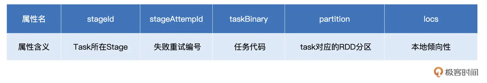

在上表中，`stageId`、`stageAttemptId` 标记了 `Task` 与执行阶段 `Stage` 的所属关系；`taskBinary` 则封装了隶属于这个执行阶段的用户代码；`partition` 就是我们刚刚说的 RDD 数据分区；`locs` 属性以字符串的形式记录了该任务倾向的计算节点或是 `Executor ID`。

不难发现，`taskBinary`、`partition` 和 `locs` 这三个属性，一起描述了这样一件事情：`Task` 应该在哪里（`locs`）为谁（`partition`）执行什么任务（taskBinary）。

到这里，我们讲完了戴格的职责，让我们来一起简单汇总一下，戴格指代的是 `DAGScheduler`，`DAGScheduler` 的主要职责有三个：

- 根据用户代码构建 DAG；
- 以 Shuffle 为边界切割 Stages；
- 基于 Stages 创建 TaskSets，并将 TaskSets 提交给 TaskScheduler 请求调度。

现在，戴格不辱使命，完成了“建筑图纸”到“建筑项目”的转化，接下来，他需要把这些“活儿”下派给塔斯克，由塔斯克进一步完成任务的委派。

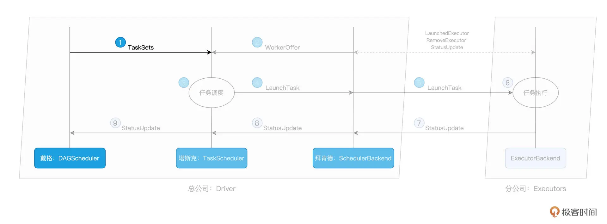

不过，对于塔斯克来说，要想把这些“活儿”委派出去，他得先摸清楚集团内有多少“适龄劳动力”才行。要做到这一点，他必须仰仗死党：拜肯德的帮忙。

### 拜肯德：SchedulerBackend

作为集团公司的人力资源总监，拜肯德的核心职责，就是实时汇总并掌握全公司的人力资源状况。前面我们讲了，全公司的人力资源对应的就是 Spark 的计算资源。对于集群中可用的计算资源，`SchedulerBackend` 用一个叫做 `ExecutorDataMap` 的数据结构，来记录每一个计算节点中 `Executors` 的资源状态。这里的 `ExecutorDataMap` 是一种 `HashMap`，它的 `Key` 是标记 `Executor` 的字符串，`Value` 是一种叫做 `ExecutorData` 的数据结构。`ExecutorData` 用于封装 `Executor` 的资源状态，如 RPC 地址、主机地址、可用 CPU 核数和满配 CPU 核数等等，它相当于是对 `Executor` 做的“资源画像”。

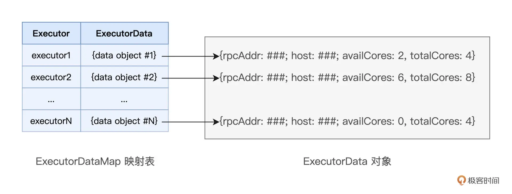

有了 `ExecutorDataMap` 这本“人力资源小册子”，对内，`SchedulerBackend` 可以就 `Executor` 做“资源画像”；对外，`SchedulerBackend` 以 `WorkerOffer` 为粒度提供计算资源。其中，`WorkerOffer` 封装了 `Executor ID`、主机地址和 CPU 核数，它用来表示一份可用于调度任务的空闲资源。

显然，基于 Executor 资源画像，SchedulerBackend 可以同时提供多个 WorkerOffer 用于分布式任务调度。WorkerOffer 这个名字起得很传神，Offer 的字面意思是公司给你提供的工作机会，到了 Spark 调度系统的上下文，它就变成了使用硬件资源的机会。

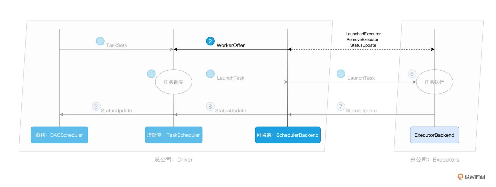

你可能会好奇，坐镇总公司的拜肯德，对于整个集团的人力资源，他是怎么做到足不出户就如数家珍的？一个篱笆三个桩，一个好汉三个帮。仅凭拜肯德一己之力，自然是力不从心，幕后功臣实际上是驻扎在分公司的一众小弟们：`ExecutorBackend`。

SchedulerBackend 与集群内所有 Executors 中的 ExecutorBackend 保持周期性通信，双方通过 LaunchedExecutor、RemoveExecutor、StatusUpdate 等消息来互通有无、变更可用计算资源。拜肯德正是通过这些小弟发送的“信件”，来不停地更新自己手中的那本小册子，从而对集团人力资源了如指掌。

### 塔斯克：TaskScheduler

一把手戴格有“活儿”，三把手拜肯德出“人力”，接下来，终于轮到牵线搭桥的塔斯克出马了。作为施工经理，塔斯克的核心职责是，给定拜肯德提供的“人力”，遴选出最合适的“活儿”并派发出去。而这个遴选的过程，就是任务调度的核心所在，如下图步骤 3 所示：

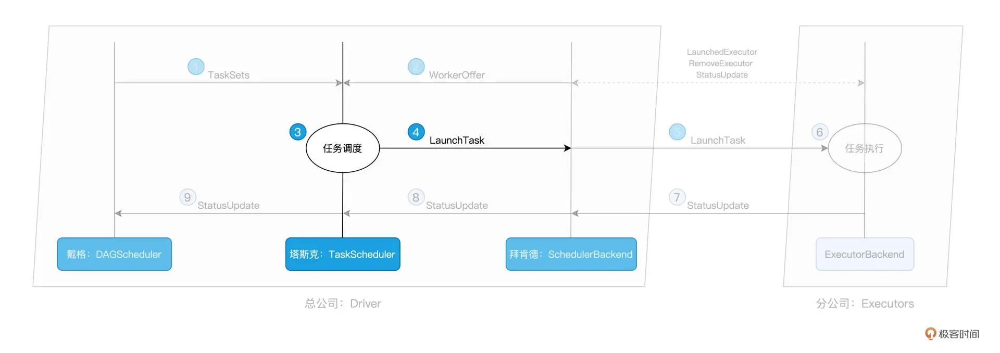

那么问题来了，对于 `SchedulerBackend` 提供的一个个 `WorkerOffer`，`TaskScheduler` 是依据什么规则来挑选 `Tasks` 的呢？

用一句话来回答，对于给定的 `WorkerOffer`，**`TaskScheduler` 是按照任务的本地倾向性，来遴选出 `TaskSet` 中适合调度的 `Tasks`**。这是什么意思呢？听上去比较抽象，我们还是从 `DAGScheduler` 在 `Stage` 内创建任务集 `TaskSet` 说起。我们刚刚说过，`Task` 与 RDD 的 `partitions` 是一一对应的，在创建 `Task` 的过程中，`DAGScheduler` 会根据数据分区的物理地址，来为 `Task` 设置 `locs` 属性。`locs` 属性记录了数据分区所在的计算节点、甚至是 `Executor` 进程 ID。

举例来说，当我们调用 `textFile API` 从 `HDFS` 文件系统中读取源文件时，Spark 会根据 `HDFS NameNode` 当中记录的元数据，获取数据分区的存储地址，例如 `node0:/rootPath/partition0-replica0`，`node1:/rootPath/partition0-replica1` 和 n`ode2:/rootPath/partition0-replica2`。

那么，`DAGScheduler` 在为该数据分区创建 `Task0` 的时候，会把这些地址中的计算节点记录到 `Task0` 的 `locs` 属性。如此一来，当 `TaskScheduler `需要调度 `Task0` 这个分布式任务的时候，根据 `Task0` 的 `locs` 属性，它就知道：“Task0 所需处理的数据分区，在节点 `node0`、`node1`、`node2` 上存有副本，因此，如果 `WorkOffer` 是来自这 3 个节点的计算资源，那对 `Task0` 来说就是投其所好”。

**从这个例子我们就能更好地理解，每个任务都是自带本地倾向性的，换句话说，每个任务都有自己的“调度意愿”**。

回到斯巴克建筑集团的类比，就好比是某个“活儿”，并不是所有人都能干，而是只倾向于让某些人来做，因为他们更专业。比如砌墙这件事，更倾向于给工龄 3 年以上的瓦工来做；而吊顶，则更倾向于给经验超过 5 年的木工来做，诸如此类。

像上面这种定向到计算节点粒度的本地性倾向，Spark 中的术语叫做 `NODE_LOCAL`。除了定向到节点，`Task` 还可以定向到进程（`Executor`）、机架、任意地址，它们对应的术语分别是 `PROCESS_LOCAL`、`RACK_LOCAL` 和 `ANY`。

对于倾向 `PROCESS_LOCAL` 的 `Task` 来说，它要求对应的数据分区在某个进程（`Executor`）中存有副本；而对于倾向 `RACK_LOCAL` 的 `Task` 来说，它仅要求相应的数据分区存在于同一机架即可。`ANY` 则等同于无定向，也就是 `Task` 对于分发的目的地没有倾向性，被调度到哪里都可以。

下图展示的是，TaskScheduler 依据本地性倾向，依次进行任务调度的运行逻辑：

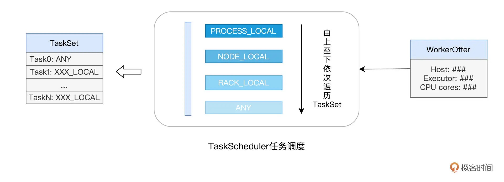

不难发现，从 `PROCESS_LOCAL`、`NODE_LOCAL`、到 `RACK_LOCAL`、再到 `ANY`，`Task` 的本地性倾向逐渐从严苛变得宽松。`TaskScheduler` 接收到 W`orkerOffer` 之后，也正是按照这个顺序来遍历 `TaskSet` 中的 `Tasks`，优先调度本地性倾向为 `PROCESS_LOCAL` 的 `Task`，而 `NODE_LOCAL` 次之，`RACK_LOCAL` 为再次，最后是 `ANY`。

可能会问：“Spark 区分对待不同的本地倾向性，它的初衷和意图是什么呢？” **实际上，不同的本地性倾向，本质上是用来区分计算（代码）与数据之间的关系**。

**Spark 调度系统的核心思想，是“数据不动、代码动”**。也就是说，在任务调度的过程中，为了完成分布式计算，Spark 倾向于让数据待在原地、保持不动，而把计算任务（代码）调度、分发到数据所在的地方，从而消除数据分发引入的性能隐患。毕竟，相比分发数据，分发代码要轻量得多。

本地性倾向则意味着代码和数据应该在哪里“相会”，`PROCESS_LOCAL` 是在 JVM 进程中，`NODE_LOCAL` 是在节点内，`RACK_LOCAL` 是不超出物理机架的范围，而 `ANY` 则代表“无所谓、不重要”。

好啦，到此为止，结合 `WorkerOffer` 与任务的本地性倾向，塔斯克 `TaskScheduler` 挑选出了适合调度的“活儿”：`Tasks`。接下来，`TaskScheduler` 就把这些 `Tasks` 通过 `LaunchTask` 消息，发送给好基友 `SchedulerBackend`。人力资源总监 `SchedulerBackend` 拿到这些活儿之后，同样使用 `LaunchTask` 消息，把活儿进一步下发给分公司的小弟：`ExecutorBackend`。

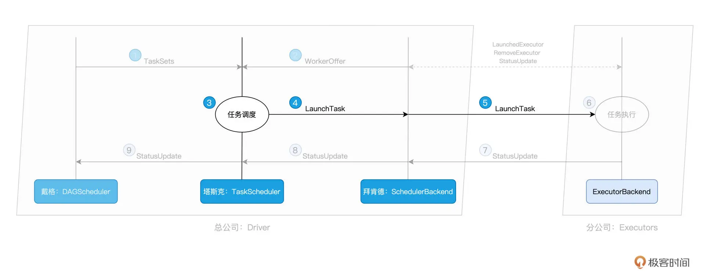

### 付诸执行：ExecutorBackend

作为分公司的人力资源主管，`ExecutorBackend` 拿到“活儿”之后，随即把活儿派发给分公司的建筑工人。这些工人，就是 `Executors` 线程池中一个又一个的 CPU 线程，每个线程负责处理一个 `Task`。

每当 `Task` 处理完毕，这些线程便会通过 `ExecutorBackend`，向 `Driver` 端的 `SchedulerBackend` 发送 `StatusUpdate` 事件，告知 `Task` 执行状态。接下来，`TaskScheduler` 与 `SchedulerBackend` 通过接力的方式，最终把状态汇报给 `DAGScheduler`，如图中步骤 7、8、9 所示：

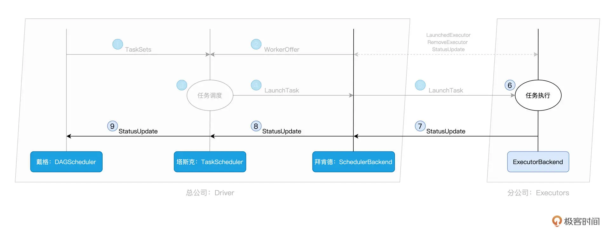

对于同一个 TaskSet 当中的 Tasks 来说，当它们分别完成了任务调度与任务执行这两个环节时，也就是上图中步骤 1 到步骤 9 的计算过程，Spark 调度系统就完成了 DAG 中某一个 Stage 的任务调度。

不过，故事到这里并未结束。我们知道，一个 DAG 会包含多个 Stages，一个 Stage 的结束即宣告下一个 Stage 的开始，而这也是戴格起初将 DAG 划分为 Stages 的意义所在。只有当所有的 Stages 全部调度、执行完毕，才表示一个完整的 Spark 作业宣告结束。

路遥知马力，在一起合作了一个又一个建筑项目之后，空降老大戴格终于赢得了元老塔斯克和拜肯德的信任与认可，坐稳了斯巴克建筑集团的头把交椅。来日可期，戴格的前景一片光明。

### 重点回顾

今天这一讲，我们用斯巴克建筑集团的故事，介绍了 Spark 调度系统的工作原理。对于调度系统的工作流程，你需要掌握表格中的 5 个关键环节：

具体说来，任务调度分为如下 5 个步骤：

1. DAGScheduler 以 `Shuffle` 为边界，将开发者设计的计算图 DAG 拆分为多个执行阶段 `Stages`，然后为每个 Stage 创建任务集 `TaskSet`。
2. SchedulerBackend 通过与 Executors 中的 ExecutorBackend 的交互来实时地获取集群中可用的计算资源，并将这些信息记录到 ExecutorDataMap 数据结构。
3. 与此同时，SchedulerBackend 根据 ExecutorDataMap 中可用资源创建 WorkerOffer，以 WorkerOffer 为粒度提供计算资源。
4. 对于给定 WorkerOffer，TaskScheduler 结合 TaskSet 中任务的本地性倾向，按照 PROCESS_LOCAL、NODE_LOCAL、RACK_LOCAL 和 ANY 的顺序，依次对 TaskSet 中的任务进行遍历，优先调度本地性倾向要求苛刻的 Task。
5. 被选中的 Task 由 TaskScheduler 传递给 SchedulerBackend，再由 SchedulerBackend 分发到 Executors 中的 ExecutorBackend。Executors 接收到 Task 之后，即调用本地线程池来执行分布式任务。

今天的内容就是这些，调度系统是分布式计算系统的核心，掌握了 Spark 任务调度的来龙去脉，你也就把握住了 Spark 分布式计算引擎的精髓，这会为你开发出高性能的 Spark 分布式应用打下坚实基础。

### Reference

- [05 | 调度系统：如何把握分布式计算的精髓？](https://time.geekbang.org/column/article/420078)