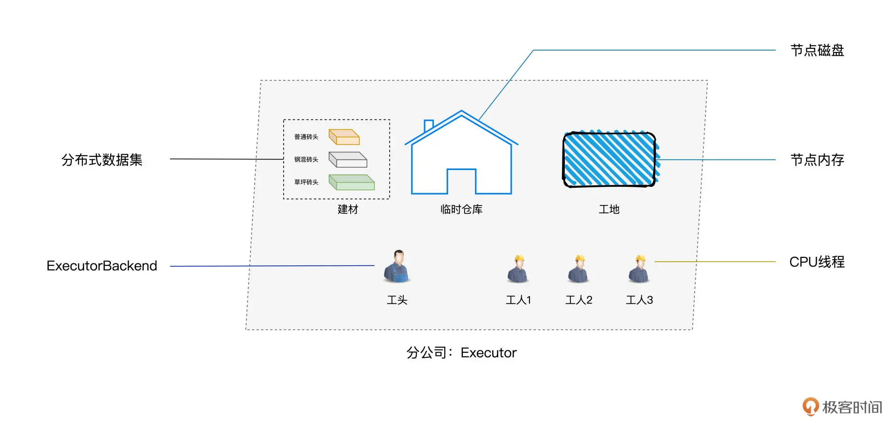
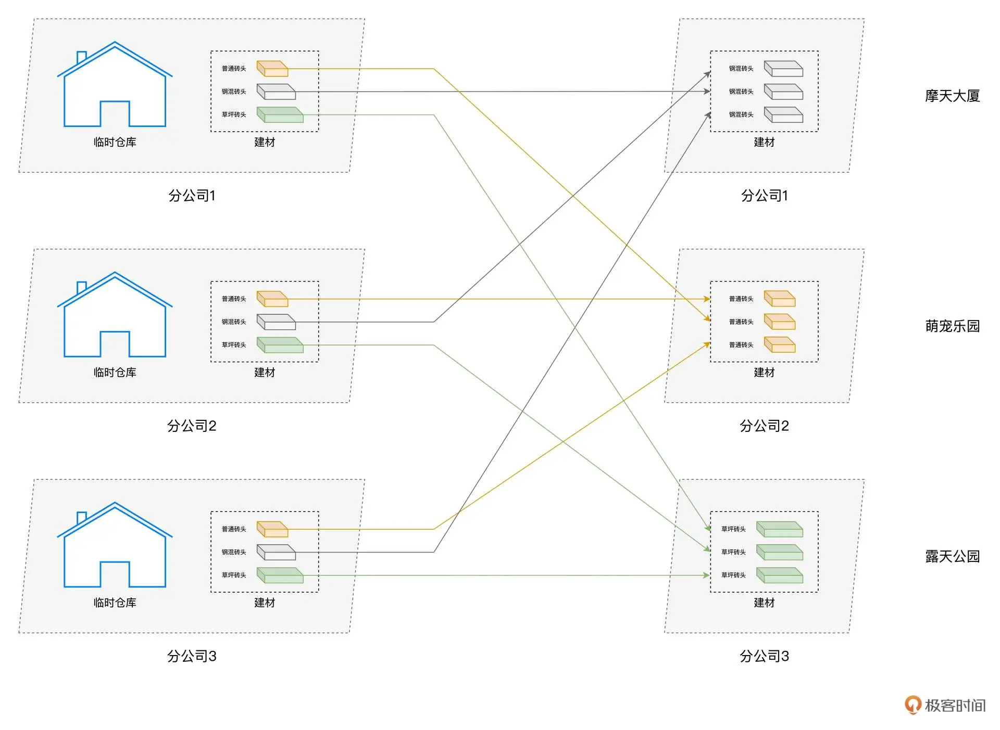
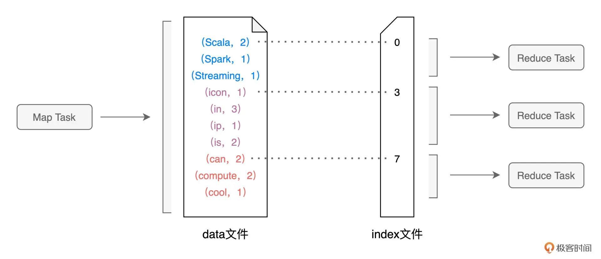

## 06 Shuffle管理：为什么Shuffle是性能瓶颈？

在上一讲，我们拜访了斯巴克国际建筑集团总公司，结识了 Spark 调度系统的三巨头：`DAGScheduler`、`TaskScheduler` 和 `SchedulerBackend`。相信你已经感受到，调度系统组件众多且运作流程精密而又复杂。

**任务调度的首要环节，是 `DAGScheduler` 以 `Shuffle` 为边界，把计算图 DAG 切割为多个执行阶段 `Stages`。显然，Shuffle 是这个环节的关键**。那么，我们不禁要问：“Shuffle 是什么？为什么任务执行需要 `Shuffle 操作`？`Shuffle` 是怎样一个过程？”

今天这一讲，我们转而去“拜访”斯巴克国际建筑集团的分公司，用“工地搬砖的任务”来理解 `Shuffle` 及其工作原理。由于 `Shuffle` 的计算几乎需要消耗所有类型的硬件资源，比如 CPU、内存、磁盘与网络，在绝大多数的 Spark 作业中，`Shuffle` 往往是作业执行性能的瓶颈，因此，我们必须要掌握 `Shuffle` 的工作原理，从而为 `Shuffle` 环节的优化打下坚实基础。

### 什么是 Shuffle

斯巴克集团的各家分公司分别驻扎在不同的建筑工地，每家分公司的人员配置和基础设施都大同小异：在人员方面，各家分公司都有建筑工人若干、以及负责管理这些工人的工头。在基础设施方面，每家分公司都有临时搭建、方便存取建材的临时仓库，这些仓库配备各式各样的建筑原材料，比如混凝土砖头、普通砖头、草坪砖头等等。

咱们参观、考察斯巴克建筑集团的目的，毕竟还是学习 Spark，因此我们得把分公司的人与物和 Spark 的相关概念对应上，这样才能方便你快速理解 Spark 的诸多组件与核心原理。分公司的人与物和 Spark 的相关概念是这样对应的：



基于图中不同概念的对应关系，接下来，我们来看“工地搬砖”的任务。斯巴克建筑集团的 3 家分公司，分别接到 3 个不同的建筑任务。第一家分公司的建筑项目是摩天大厦，第二家分公司被要求在工地上建造一座“萌宠乐园”，而第三家分公司收到的任务是打造露天公园。为了叙述方便，我们把三家分公司分别称作分公司 1、分公司 2 和分公司 3。

显然，不同建筑项目对于建材的选型要求是有区别的，摩天大厦的建造需要刚性强度更高的混凝土砖头，同理，露天公园的建设需要透水性好的草坪砖头，而萌宠乐园使用普通砖头即可。

可是，不同类型的砖头，分别散落在 3 家公司的临时仓库中。为了实现资源的高效利用，每个分公司的施工工人们，都需要从另外两家把项目特需的砖头搬运过来。对于这个过程，我们把它叫作“搬砖任务”。



有了“工地搬砖”的直观对比，我们现在就可以直接给 Shuffle 下一个正式的定义了。**Shuffle 的本意是扑克的“洗牌”，在分布式计算场景中，它被引申为集群范围内跨节点、跨进程的数据分发**。在工地搬砖的任务中，如果我们把不同类型的砖头看作是分布式数据集，那么不同类型的砖头在各个分公司之间搬运的过程，与分布式计算中的 `Shuffle` 可以说是异曲同工。

要完成工地搬砖的任务，每位工人都需要长途跋涉到另外两家分公司，然后从人家的临时仓库把所需的砖头搬运回来。分公司之间相隔甚远，仅靠工人们一块砖一块砖地搬运，显然不现实。因此，为了提升搬砖效率，每位工人还需要借助货运卡车来帮忙。不难发现，工地搬砖的任务需要消耗大量的人力物力，可以说是劳师动众。

`Shuffle` 的过程也是类似，分布式数据集在集群内的分发，会引入大量的磁盘 `I/O` 与网络 `I/O`。在 DAG 的计算链条中，`Shuffle` 环节的执行性能是最差的。你可能会问：“既然 `Shuffle` 的性能这么差，为什么在计算的过程中非要引入 `Shuffle` 操作呢？免去 `Shuffle` 环节不行吗？”

其实，计算过程之所以需要 Shuffle，往往是由计算逻辑、或者说业务逻辑决定的。比如，对于搬砖任务来说，不同的建筑项目就是需要不同的建材，只有这样才能满足不同的施工要求。再比如，在 Word Count 的例子中，我们的“业务逻辑”是对单词做统计计数，那么对单词 “Spark” 来说，在做“加和”之前，我们就是得把原本分散在不同 `Executors` 中的 “Spark”，拉取到某一个 `Executor`，才能完成统计计数的操作。

结合过往的工作经验，我们发现在绝大多数的业务场景中，`Shuffle` 操作都是必需的、无法避免的。既然我们躲不掉 `Shuffle`，那么接下来，我们就一起去探索，看看 `Shuffle` 到底是怎样的一个计算过程。

### Shuffle 工作原理

为了方便你理解，我们还是用 Word Count 的例子来做说明。在这个示例中，引入 Shuffle 操作的是 reduceByKey 算子，也就是下面这行代码（完整代码请回顾第 1 讲）。

```
// 按照单词做分组计数
val wordCounts: RDD[(String, Int)] = kvRDD.reduceByKey((x, y) => x + y) 
```

我们先来直观地回顾一下这一步的计算过程，然后再去分析其中涉及的 Shuffle 操作：


如上图所示，以 `Shuffle` 为边界，`reduceByKey` 的计算被切割为两个执行阶段。约定俗成地，我们把 `Shuffle` 之前的 `Stage` 叫作 **Map 阶段**，而把 `Shuffle` 之后的 `Stage` 称作 **Reduce 阶段**。在 **Map 阶段**，每个 `Executors` 先把自己负责的数据分区做初步聚合（又叫 **Map 端聚合**、**局部聚合**）；在 **Shuffle 环节**，不同的单词被分发到不同节点的 `Executors` 中；最后的 **Reduce 阶段**，`Executors` 以单词为 `Key` 做第二次聚合（又叫**全局聚合**），从而完成统计计数的任务。

不难发现，**Map 阶段**与 **Reduce 阶段**的计算过程相对清晰明了，二者都是利用 `reduce` 运算完成局部聚合与全局聚合。在 `reduceByKey` 的计算过程中，`Shuffle` 才是关键。

仔细观察上图你就会发现，与其说 Shuffle 是跨节点、跨进程的数据分发，不如说 Shuffle 是 Map 阶段与 Reduce 阶段之间的数据交换。那么问题来了，两个执行阶段之间，是如何实现数据交换的呢？

### Shuffle 中间文件

如果用一句来概括的话，那就是，**Map 阶段与 Reduce 阶段，通过生产与消费 Shuffle 中间文件的方式，来完成集群范围内的数据交换**。换句话说，Map 阶段生产 Shuffle 中间文件，Reduce 阶段消费 Shuffle 中间文件，二者以中间文件为媒介，完成数据交换。

那么接下来的问题是，什么是 Shuffle 中间文件，它是怎么产生的，又是如何被消费的？它的产生和消费过程总结如下：


在上一讲介绍调度系统的时候，我们说过 `DAGScheduler` 会为每一个 `Stage` 创建任务集合 `TaskSet`，而每一个 `TaskSet` 都包含多个分布式任务（`Task`）。在 **Map 执行阶段，每个 Task（以下简称 Map Task）都会生成包含 data 文件与 index 文件的 Shuffle 中间文件**，如上图所示。也就是说，`Shuffle` 文件的生成，是以 **Map Task 为粒度**的，Map 阶段有多少个 `Map Task`，就会生成多少份 `Shuffle` 中间文件。

再者，Shuffle 中间文件是统称、泛指，它包含两类实体文件，一个是记录（Key，Value）键值对的 data 文件，另一个是记录键值对所属 `Reduce Task` 的 index 文件。换句话说，index 文件标记了 data 文件中的哪些记录，应该由下游 `Reduce` 阶段中的哪些 Task（简称 Reduce Task）消费。在上图中，为了方便示意，我们把首字母是 S、i、c 的单词分别交给下游的 3 个 `Reduce Task` 去消费，显然，这里的数据交换规则是单词首字母。

在 Spark 中，`Shuffle` 环节实际的数据交换规则要比这复杂得多。数据交换规则又叫分区规则，因为它定义了分布式数据集在 **Reduce 阶段**如何划分数据分区。假设 Reduce 阶段有 `N` 个 `Task`，这 `N` 个 `Task` 对应着 `N` 个数据分区，那么在 Map 阶段，每条记录应该分发到哪个 `Reduce Task`，是由下面的公式来决定的。

```
P = Hash(Record Key) % N
```

对于任意一条数据记录，Spark 先按照既定的哈希算法，计算记录主键的哈希值，然后把哈希值对 N 取模，计算得到的结果数字，就是这条记录在 `Reduce` 阶段的数据分区编号 `P`。换句话说，这条记录在 `Shuffle` 的过程中，应该被分发到 `Reduce` 阶段的 `P` 号分区。

熟悉了分区规则与中间文件之后，接下来，我们再来说一说中间文件是怎么产生的。

### Shuffle Write

我们刚刚说过，Shuffle 中间文件，是以 `Map Task` 为粒度生成的，我们不妨使用下图中的 `Map Task` 以及与之对应的数据分区为例，来讲解中间文件的生成过程。数据分区的数据内容如图中绿色方框所示：


在生成中间文件的过程中，Spark 会借助一种类似于 Map 的数据结构，来计算、缓存并排序数据分区中的数据记录。这种 Map 结构的 Key 是（Reduce Task Partition ID，Record Key），而 Value 是原数据记录中的数据值，如图中的“内存数据结构”所示。

对于数据分区中的数据记录，Spark 会根据我们前面提到的公式 1 逐条计算记录所属的目标分区 ID，然后把主键（Reduce Task Partition ID，Record Key）和记录的数据值插入到 Map 数据结构中。当 Map 结构被灌满之后，Spark 根据主键对 Map 中的数据记录做排序，然后把所有内容溢出到磁盘中的临时文件，如图中的步骤 1 所示。

随着 Map 结构被清空，Spark 可以继续读取分区内容并继续向 Map 结构中插入数据，直到 Map 结构再次被灌满而再次溢出，如图中的步骤 2 所示。就这样，如此往复，直到数据分区中所有的数据记录都被处理完毕。

到此为止，磁盘上存有若干个溢出的临时文件，而内存的 Map 结构中留有部分数据，Spark 使用归并排序算法对所有临时文件和 Map 结构剩余数据做合并，分别生成 data 文件、和与之对应的 index 文件，如图中步骤 4 所示。Shuffle 阶段生成中间文件的过程，又叫 `Shuffle Write`。

总结下来，Shuffle 中间文件的生成过程，分为如下几个步骤：

1. 对于数据分区中的数据记录，逐一计算其目标分区，然后填充内存数据结构；
2. 当数据结构填满后，如果分区中还有未处理的数据记录，就对结构中的数据记录按（目标分区 ID，Key）排序，将所有数据溢出到临时文件，同时清空数据结构；
3. 重复前 2 个步骤，直到分区中所有的数据记录都被处理为止；
4. 对所有临时文件和内存数据结构中剩余的数据记录做归并排序，生成数据文件和索引文件。

到目前为止，我们熟悉了 Spark 在 Map 阶段生产 Shuffle 中间文件的过程，那么，在 Reduce 阶段，不同的 Tasks 又是如何基于这些中间文件，来定位属于自己的那部分数据，从而完成数据拉取呢？

### Shuffle Read

首先，我们需要注意的是，对于每一个 `Map Task` 生成的中间文件，其中的目标分区数量是由 Reduce 阶段的任务数量（又叫并行度）决定的。在下面的示意图中，Reduce 阶段的并行度是 3，因此，`Map Task` 的中间文件会包含 3 个目标分区的数据，而 `index` 文件，恰恰是用来标记目标分区所属数据记录的起始索引。



对于所有 `Map Task` 生成的中间文件，`Reduce Task` 需要通过网络从不同节点的硬盘中下载并拉取属于自己的数据内容。不同的 `Reduce Task` 正是根据 `index` 文件中的起始索引来确定哪些数据内容是“属于自己的”。Reduce 阶段不同于 `Reduce Task` 拉取数据的过程，往往也被叫做 `Shuffle Read`。

### 重点回顾

首先，我们给 Shuffle 下了一个明确的定义，**在分布式计算场景中，Shuffle 指的是集群范围内跨节点、跨进程的数据分发**。

我们在最开始提到，Shuffle 的计算会消耗所有类型的硬件资源。具体来说，Shuffle 中的哈希与排序操作会大量消耗 CPU，而 Shuffle Write 生成中间文件的过程，会消耗宝贵的内存资源与磁盘 I/O，最后，Shuffle Read 阶段的数据拉取会引入大量的网络 I/O。不难发现，**Shuffle 是资源密集型计算**，因此理解 Shuffle 对开发者来说至关重要。

接着，我们介绍了 Shuffle 中间文件。Shuffle 中间文件是统称，它包含两类文件，一个是记录（Key，Value）键值对的 data 文件，另一个是记录键值对所属 Reduce Task 的 index 文件。计算图 DAG 中的 Map 阶段与 Reduce 阶段，正是通过中间文件来完成数据的交换。

接下来，我们详细讲解了 Shuffle Write 过程中生成中间文件的详细过程，归纳起来，这个过程分为 4 个步骤：

1. 对于数据分区中的数据记录，逐一计算其目标分区，然后填充内存数据结构；
2. 当数据结构填满后，如果分区中还有未处理的数据记录，就对结构中的数据记录按（目标分区 ID，Key）排序，将所有数据溢出到临时文件，同时清空数据结构；
3. 重复前 2 个步骤，直到分区中所有的数据记录都被处理为止；
4. 对所有临时文件和内存数据结构中剩余的数据记录做归并排序，生成数据文件和索引文件。

最后，在 Reduce 阶段，Reduce Task 通过 index 文件来“定位”属于自己的数据内容，并通过网络从不同节点的 data 文件中下载属于自己的数据记录。

### Reference

- [06 | Shuffle管理：为什么Shuffle是性能瓶颈？](https://time.geekbang.org/column/article/420399)
- [Spark Configuration](https://spark.apache.org/docs/3.1.2/configuration.html)